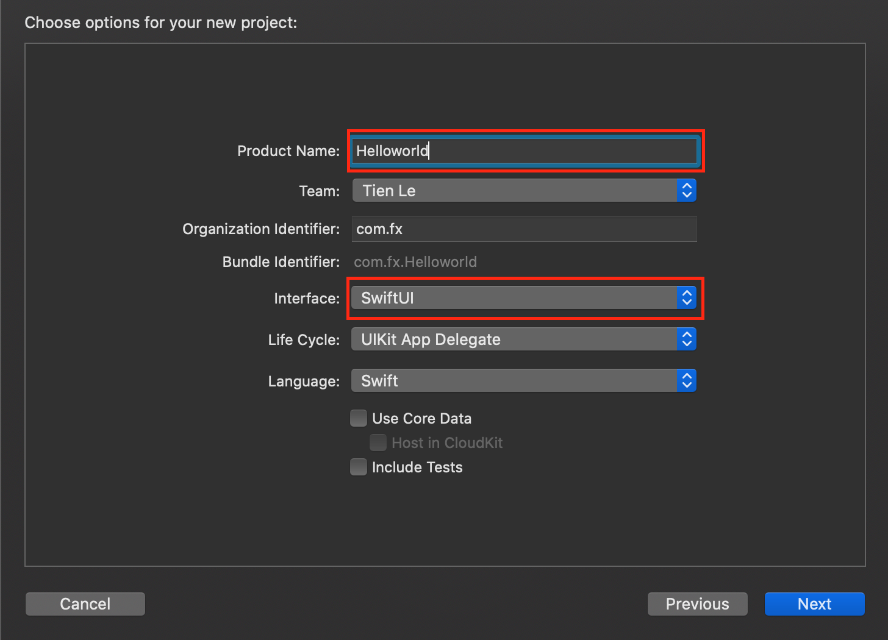
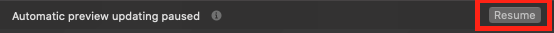
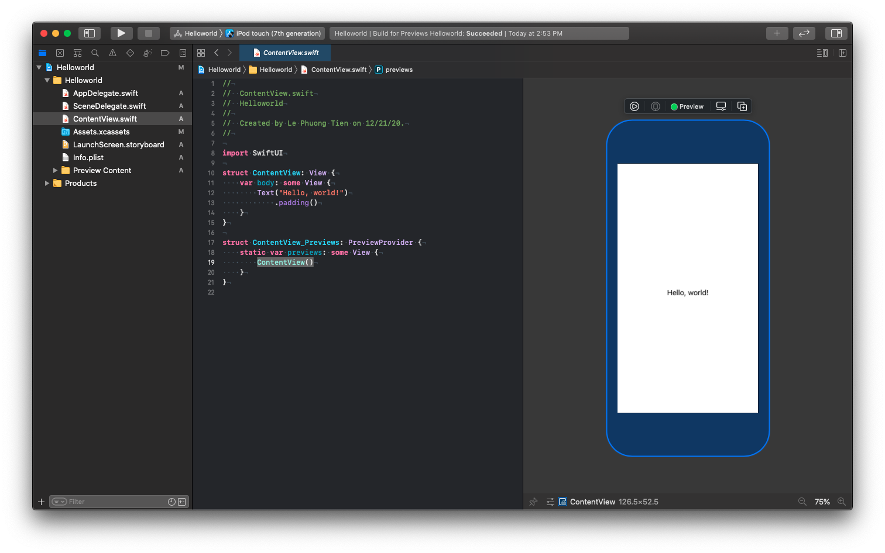
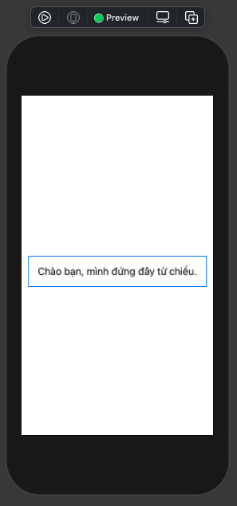
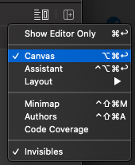
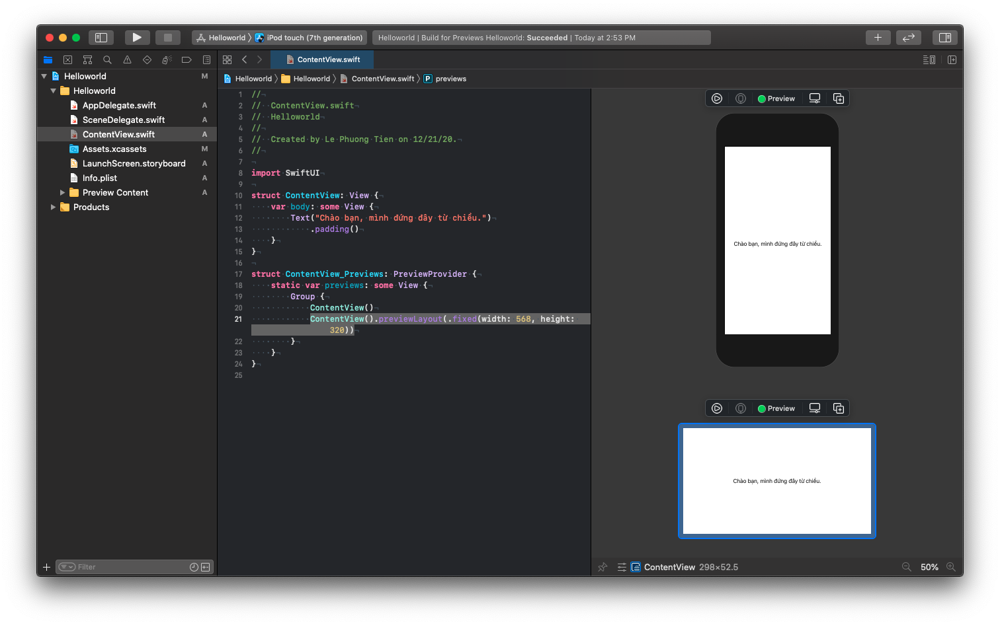
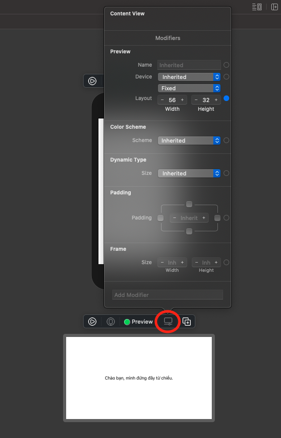

# 001 : Hello world!

> *"SwiftUI is an innovative, exceptionally simple way to build user interfaces across all Apple platforms with the power of Swift."*
>
> --- Apple ---

Tạm thời chúng ta sẽ bỏ qua các khái niệm về **SwiftUI** và những ưu nhược điểm của nó. Mà đi vào phần trọng tâm chính trong bài này. Đó là cách tạo một dự án với SwiftUI là như thế nào.

> Bắt đầu thôi!

## 1. Creating a new SwiftUI project

Để bắt đầu tìm hiểu về SwiftUI thì bạn sẽ tạo một project với SwiftUI. Công việc này khá là đơn giản. Bạn theo các bước sau:

1. Mở Xcode và chọn tại mới 1 một project
2. Chọn iOS với Single View
3. Đặt tên project và các thông tin cần thiết khác
4. Phần User Interface thì chọn `SwiftUI` là okay

Bạn xem hình để hình dùng kĩ hơn nha.



Về cấu trúc thư mục project ban đầu thì bạn sẽ thấy các file chủ đạo như sau:

* AppDelegate.swift
* SceneDelegate.swift

Nếu bạn nào mới cập nhật lại kiến thức iOS thì đây sẽ là điều khá bất người. Tuy nhiên, bạn cũng không cần quá lo lắng lắm. Vì chúng nó tuy 2 nhưng lại là 1 mà thôi. Cụ thể như thế nào thì qua các chương sau sẽ rõ.

Bạn mở file `SceneDelegate.swift` , bạn tập trung vào dòng lệnh sau:

```swift
window.rootViewController = UIHostingController(rootView: contentView)
```

Trong đó:

* **UIHostingController** sẽ tạo ra một ViewController cho View của SwiftUI là `contentView`.
* `contentView` là một thể hiện của class **ContentView**

Về UIHostingController thì bạn chưa cần phải quan tâm nhiều. Mình sẽ giải thích ở các phần sau.

## 2. Hello world!

Giờ tới phần chính của chúng ta. Bạn truy cập vào file `ContentView.swift` và xem code của nó như thế nào.

```swift
import SwiftUI

struct ContentView: View {
    var body: some View {
        Text("Hello, world!")
            .padding()
    }
}

struct ContentView_Previews: PreviewProvider {
    static var previews: some View {
        ContentView()
    }
}
```

> May quá, Xcode đã làm sẵn luôn cho bạn công việc đơn giản đầu tiên rồi.

Chúng ta đã có Hello world, giờ thử bấm cái nut `Resume` xem sao



Và thật là:

> Ờ mây zing gút chóp!



Bạn sẽ thấy Xcode của bạn chia ra 2 phần chính. 

* Phần dành cho code SwiftUI
* Phần hiển thị (Preview)

Tiếp theo, bạn hãy thay đổi nội dung trong `Text` để xem phần hiển thị có cập nhật theo thời gian thật hay không. Ví dụ:

```swift
struct ContentView: View {
    var body: some View {
        Text("Chào bạn, mình đứng đây từ chiều.")
            .padding()
    }
}
```

Kết quả sẽ như sau:



## 3. Phân tích

Với SwiftUI thì file `*.swift` của bạn sẽ nôm là có 2 phần

### 3.1. View

Đây là phần chính của SwiftUI. Vì mọi thứ bây giờ đều là View hết. Và bạn sẽ cần 1 `struct` ddể khai báo View của bạn. Trong đó thành phần `body` là đóng vài trò diễn viên chính. Nó sẽ hiện thị nội dụng của View đó.

```swift
struct ContentView: View {
    var body: some View {
        // return a view
    }
}
```

Với cú pháp mới của **Swift 5.1**, thì bạn không cần phải thêm từ khoá `return` trong function chỉ có duy nhất `1 line`. 

> Bổ sung, với SwiftUI bạn sẽ viết code với cú pháp & kiểu mới. Nên tuy là bạn nhìn thấy nhiều hơn 1 dòng code, nhưng nó lại tính 1 dòng code.

Còn về `some` thì như sau:

`Opaque types` là một tính năng quan trọng của Swift. Với từ khoá `some` - biểu thị một *opaque type*, bạn có thể ẩn return type cụ thể của một property hoặc một function. Và như vậy bạn có thể viết code một cách linh hoạt, súc tích.

> Mình sẽ có 1 bài viết về Opaque Type cho bạn hiểu kĩ hơn.

Hiểu nôm na nhất là bạn chỉ cần trả về một đối tượng nào đó mà `implement` protocol **View** là okay. Bạn hãy nhảy tới định nghĩa của nó và đọc cho kĩ hơn nha.

```swift
public protocol View {

    /// The type of view representing the body of this view.
    ///
    /// When you create a custom view, Swift infers this type from your
    /// implementation of the required `body` property.
    associatedtype Body : View

    /// The content and behavior of the view.
    @ViewBuilder var body: Self.Body { get }
}
```

### 3.2. Preview

Phần thứ 2, là phần hiển thị giao diện. Tuy nhiên chỉ là bản xem trước mà thôi. Và người ta đặt tên nó là Preview. Bạn sẽ thấy code nó khá tương đồng với phần View.

```swift
struct ContentView_Previews: PreviewProvider {
    static var previews: some View {
        ContentView()
    }
}
```

Hiểu nôm na nữa, bạn sẽ tạo ra một cái View mà bạn có thể thấy được. Nội dung của cái View đó chính là phần ContentView ở trên.

Để bật tắt chúng thì bạn chỉ cần chọn ẩn hiện Canvas là xong (dành cho các bản lỡ tay mà tìm lại không được)



Về Preview thì bạn có rất nhiều thứ có thể tìm hiểu thêm. Mình sẽ hé mở đơn giản thêm cho bạn là việc thêm 1 preview nữa cho sinh động. Bạn edit lại đoạn code trên.

```swift
struct ContentView_Previews: PreviewProvider {
    static var previews: some View {
        Group {
            ContentView()
            ContentView().previewLayout(.fixed(width: 568, height: 320))
        }
    }
}
```

Trong đó:

* `Group` để nhóm nhiều view lại với nhau để hiển thị trên Preview
* Tạo một view mới với việc fix kích thước cho nó

Kết quả ra như sau:



Muốn tuỳ chỉnh thêm thì bạn có thể tham khảo hình dưới đây. Bây giờ, mọi thức đúng nghĩa là không cần code nữa rồi. Bạn thoả sức mà sáng tạo nha.



EZ Game!

## Tạm kết:

- Tạo project với SwiftUI
- Helloword với View của SwiftUI
- Tìm hiểu sơ lược về `some`
- Tìm hiểu sơ lược về Preview

---

Okay, tới đây thì chúc mừng bạn đã `Hello world` xong rồi đây. Quả thật là một bài khởi đầu quá vất vả với SwiftUI. Hẹn bạn ở các bài sau. 

Cảm ơn bạn đã đọc bài viết này!

