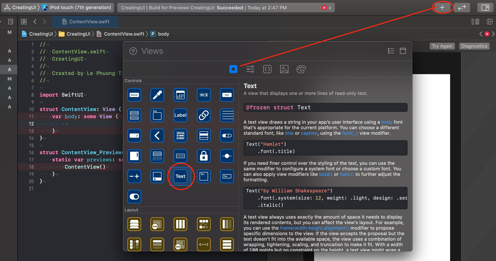
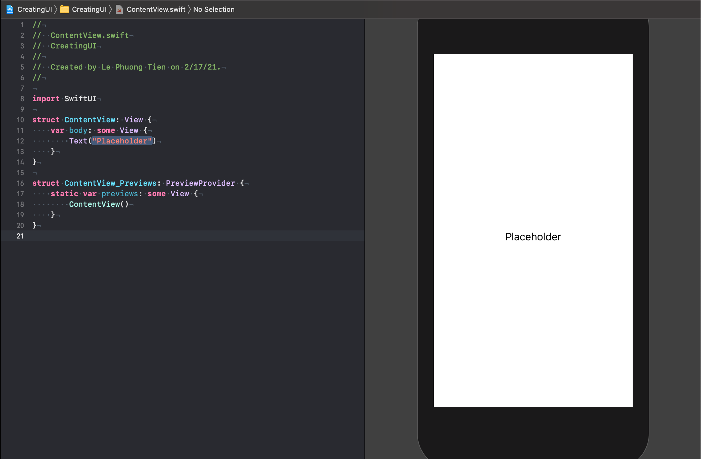
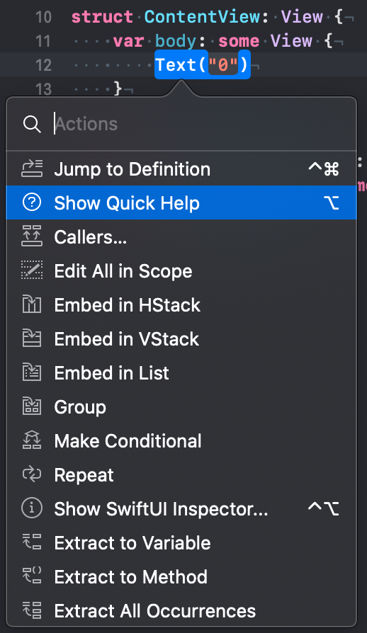
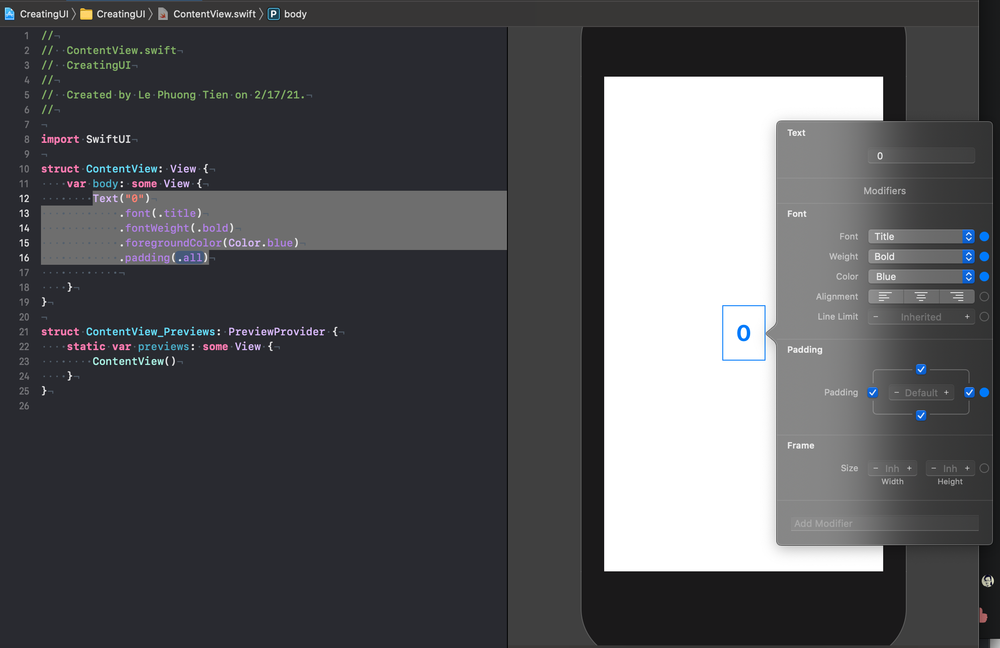
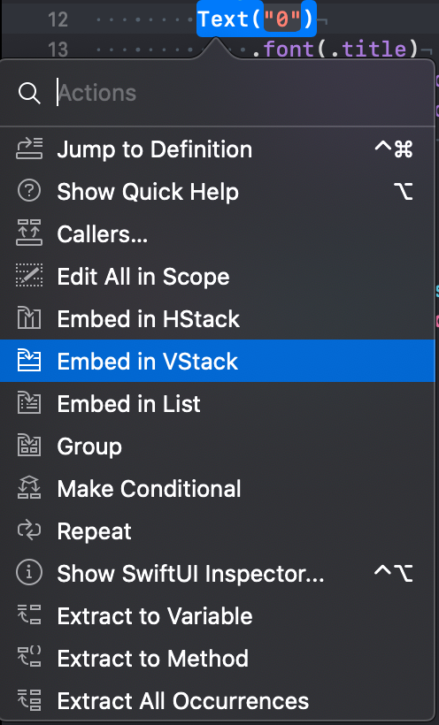
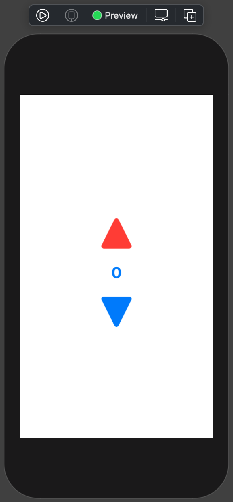

# 002 : Creating your UI

Bài viết này sẽ hướng dẫn bạn tạo giao diện một cách cơ bản nhất với SwiftUI. 

> Bắt đầu thôi!

## 1. Chuẩn bị

### 1.1. Cấu hình

Như bài viết trước thì SwiftUI có yêu cầu về mặt cấu hình cơ bản, để đảm bảo việc hoạt động của ứng dụng trên các thiết bị. Do đó, cấu hình & version tối thiểu như sau:

* Xcode 11 hoặc mới hơn
* macOS 10.15 hoặc mới hơn
* Swift 5.x

### 1.2. Declarative

Với SwiftUI, ứng dụng của bạn sẽ không có `storyboard` hay các `ViewController`. ContentView.swift (file có sẵn khi bạn tạo project với SwiftUI) sẽ đam đương tất cả.

Bạn có thể kết hợp giữa kéo thả & code chay truyền thống trong cùng một file `*.swift`. Và điều cực kì quan trọng là 

> Mọi thứ bạn thao tác khi code thì sẽ được hiển thị theo thời gian thực.

Bên cạnh đó, điều bạn sẽ phải làm quen dần là `Declarative`. SwiftUI chính là khai báo. (có thể hiểu SwiftUI tương đương một ngôn ngữ lập trình độc lập cũng được). Bạn chỉ cần khai báo những gì mà bạn muốn UI bạn hiển thị. Việc còn lại thì SwiftUI sẽ tự động chuyển đổi chúng để hoàn thành công việc. Ứng dụng sẽ hoạt động. EZ game!

Với SwiftUI, bạn sẽ dần quên đi `IBOutlet` & `IBAction`. Tất nhiên, sẽ có cách khác cho bạn sử dụng. Với Apple thì khuyến khích bạn nên tạo giao diện với nhiều kích cỡ màn hình hay thiết bị. Để tăng tính tái sử dụng cho các **view** của bạn.

## 2. Khái niệm

Trước khi thực hiện tạo giao diện đầu tiên thì bạn cần cấp nhật thêm một số tư vựng khái niệm như sau.

* **Canvas** : đây chính là phần hiển thị giao diện của bạn bên cạnh file code. Mọi thao tác của bạn sẽ được cập nhật theo thời gian thật. 
* **Minimap** : đơn giản thì bạn có thể xem screenshot code của bạn và có thể nhảy tới nhảy lui một cách nhanh chóng. Điểm báo cho việc code SwiftUI thì sẽ rất là dài.
* **Modifiers**: thay vì xét các thuộc tính cho các UI Control ở thời UIKit. Bây giờ, với SwiftUI bạn thể thay đổi các thuộc tính của các control đó bằng việc gọi các phương thức nối tiếp nhau.
* **Container view** : bạn sẽ rất cần tới chúng nó để tạo bố cục giao diện hoặc là nơi chưa các view nhỏ hơn.

Ngoài ra, bạn cũng không cần lo lắng khi xa rời đi UIKit. Vì sẽ có những đối tượng tương tự với các UI Control của UIKit.

## 3. Tạo giao diện

### 3.1. Kéo thả

Bắt đầu, bạn hãy tạo một project iOS với Interface là SwiftUI (có hướng dẫn ở bài trước). Tại `body` của ContentView thì bạn hãy xoá hết code Helloword mặc định ở trong.



Sau đó bạn nhìn hình ở trên vào theo các bước sau:

* Kích vào nút (+) ở góc trên bên phải của Xcode. Lúc đó sẽ xuất hiện cho bạn một cửa sổ có rất nhiều thứ hay ho.
* Tại phần Controls, bạn chọn Text
* Kéo thả vào code hay màn hình preview đều được

File code sẽ như thế này:



Cái này thì giống bài Helloword quá rồi. Áp dụng cho các Controls khác của SwiftUI.

> EZ!

### 3.2. Thay đổi thuộc tính

Tiếp tục với việc thay đổi thuộc tính của một Control trong SwiftUI. Bạn hãy áp dụng tổ hợp phím huyền thoại sau:

> Command + click

Bạn có thể trỏ vào code hay bên preview và dùng tổ hợp phím trên thì tất cả đều hoạt động. Ví dụ cho phần trỏ vào code và nhấn tổ hợp phím.



Sau đó, bạn hãy chọn tới dòng `Show SwiftUI Inspector` . Việc còn lại là trí tưởng tượng sáng tạo của bạn mà thôi. Xem tiếp ví dụ sau khi chỉnh sửa lại **Text** vừa rồi.



Việc tương tác bên giao diện kéo thả thì nó cũng sẽ tự động sinh code theo. Bạn sẽ thấy được code của Text bạn vừa mới làm màu xong như sau:

```swift
        Text("0")
            .font(.title)
            .fontWeight(.bold)
            .foregroundColor(Color.blue)
            .padding(.all)
```

Như đã nói ở trên, việc thay đổi giá trị của các thuộc tính sẽ thông qua việc gọi các phương thức. Cách xét giá trị như của UIKit thì hầu như không còn nữa. Bạn hãy tự khám phá thêm nhoé! 

### 3.3. Tạo khung chứa

Giao diện phức tạp sẽ được tạo từ các giao diện đơn giản hơn. Việc đầu tiên bạn cần xác định đó chính là bố cục của giao diện của bạn sẽ là như thế nào.

Ta sẽ có thiết kế như sau:

> {
>
> ​     Button
>
> ​     Text
>
> ​     Button
>
> }

Và SwiftUI sẽ hỗ trợ cho chúng ta các layout cơ bản như sau:

* VStack
* HStack
* ZStack

Bạn hãy tự tìm hiểu thêm bố cục từng cái. Còn với chúng ta thì sẽ lựa chọn là `VStack`, để có bố cục sắp xếp thẳng đứng. Thứ tự sẽ là từ trên xuống dưới.



Bạn sẽ thấy code của mình như thế này:

```swift
VStack {
            Text("0")
                .font(.title)
                .fontWeight(.bold)
                .foregroundColor(Color.blue)
                .multilineTextAlignment(.center)
                .padding(all)
            
        }
```

Với thao tác trên thì **Text** của chúng ta sẽ nằm trong **VStack**. Do đó, công việc bây giờ chỉ là kéo thả các Button vào phía trên và dưới **Text** mà thôi. Để tiết kiệm thời gian thì bạn xem qua đoạn code sau:

```swift
struct ContentView: View {
    var body: some View {
        VStack(alignment: .center) {
            Button(action: {
                print("^")
            }) {
                Image(systemName: "arrowtriangle.up.fill")
                    .resizable()
                    .frame(width: 50.0, height: 50.0)
                    .foregroundColor(.red)
            }
            .frame(width: 50.0, height: 50.0)
            Text("0")
                .font(.title)
                .fontWeight(.bold)
                .foregroundColor(Color.blue)
                .multilineTextAlignment(.center)
                .padding(.all)
            Button(action: {
                print("v")
            }) {
                Image(systemName: "arrowtriangle.down.fill")
                    .resizable()
                    .frame(width: 50.0, height: 50.0)
            }
            .frame(width: 50.0, height: 50.0)
        }
        .frame(width: 50.0, height: 200.0)
            
    }
}
```

Ta chờ một chút thì bạn sẽ thấy được giao diện của ứng dụng. Tham khả nhoé!



## Tạm kết

* Các khái niệm cần biết trước khi dấn thân vào SwiftUI
* Tạo một control đơn giản và cách thay đổi các thuộc tính của nó
* Tạo bố cục đơn giản đầu tiên

---

Okay, tới đây thì chúc mừng bạn đã xong bài viết này rồi đây. Quả thật là một bài khởi đầu quá vất vả với SwiftUI. Hẹn bạn ở các bài sau.

Cảm ơn bạn đã đọc bài viết này!

