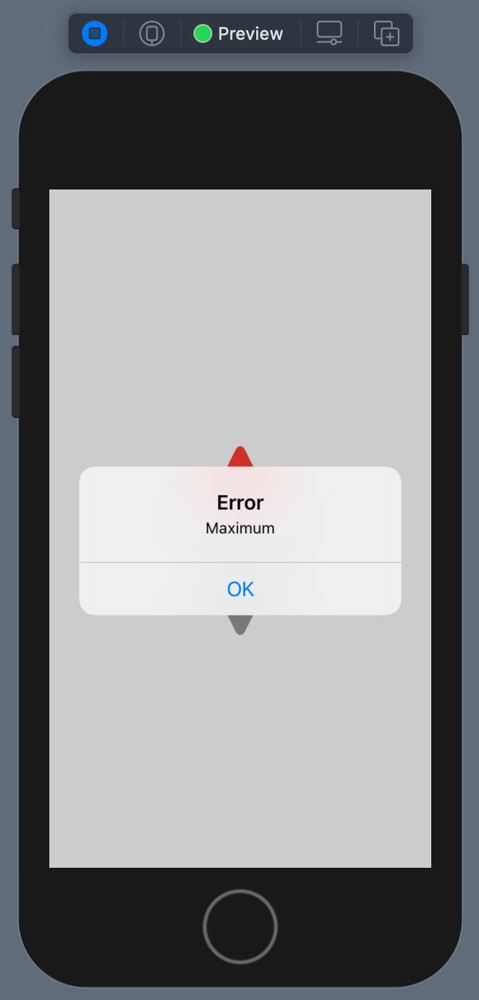

# 004 : Presenting an Alert

Hiển thị một thông báo (**Alert**) là công việc cơ bản một dev mobile cần phải làm. Nhưng vì đặc trưng của lập trình mobile thì **Alert** chính là một dạng màn hình phụ. Cộng với kiểu lập trình mới từ SwiftUI thì bạn sẽ gặp một số điều bất ngờ.

Bạn có thể dùng tiếp project từ bài trước. Nếu như mọi thứ ổn rồi thì ...

> Bắt đầu thôi!

## Chuẩn bị

Mình sẽ tận dụng lại code của bài trước. Nhưng nếu bạn muốn tạo một project SwiftUI mới thì vẫn được. Chỉ cần copy code của **ContentView** là oke hết. Còn sau đây là code của ContentView, mình dùng nó để tiếp tục demo.

```swift
struct ContentView: View {
    
    @State var number: Int = 10
    
    var body: some View {
        VStack(alignment: .center) {
                    Button(action: {
                        number += 1
                    }) {
                        Image(systemName: "arrowtriangle.up.fill")
                            .resizable()
                            .frame(width: 50.0, height: 50.0)
                            .foregroundColor(.red)
                    }
                    .frame(width: 50.0, height: 50.0)
                    Text("\(number)")
                        .font(.title)
                        .fontWeight(.bold)
                        .foregroundColor(Color.blue)
                        .multilineTextAlignment(.center)
                    Button(action: {
                        number -= 1
                    }) {
                        Image(systemName: "arrowtriangle.down.fill")
                            .resizable()
                            .frame(width: 50.0, height: 50.0)
                    }
                    .frame(width: 50.0, height: 50.0)
                }
                .frame(width: 50.0, height: 200.0)
    }
}
```

Có vẻ code của chúng ta ngày càng dài ra thì phải. Nhưng bạn yên tâm, qua bài sau mình sẽ giải quyết vấn đề này trong vòng 1 nốt nhạc.

## 1. Sự kiện

Công việc của lập trình viên là xử lý luồng sự kiện. Để muốn hiển thị một cái gì đó lên thì bạn cần phải có được **duyên khởi** cho nó. 

Với bài toàn của chúng ta thì như sau:

* Nếu người dùng nhất nút tăng giá trị số, thì số sẽ được cộng thêm 1 đơn vị. Ngược lại với nút giảm.
* Giới hạn tối đa là 20
* Giới hạn tối thiểu là 0

Chúng ta có 2 Button, vì đậy tại mỗi `action` của Button thì ta sẽ handle các yêu cầu trên. Cho bạn hình dung lại việc sử dụng `action` của Button là như thế nào.

```swift
 Button(action: {
   // code here
 }) {
  Text("Tap Me!")
}
```

## 2. Alert

Như đã nói ở trên, **Alert** được xem là một view phụ. Nó sẽ xuất hiện độc lập so với **ContentView**. Ta xem qua các tạo một Alert đơn giản là như thế nào.

```swift
Alert(title: Text("Title"), message: Text("message"))
```

Nó tương tự như UIAlertViewController trong UIKit. Nhưng đây là SwiftUI thì Alert cũng được xem là một view. Bạn cần gọi nó xuất hiện. Và phương thức ta cần sử dụng là `.alert()`. 

Kết hợp giữa 2 yếu tố:

* Xuất hiện độc lập
* Lập trình khai báo

Ta có thể gọi `.alert()` ở bất kì đâu trong ContentView. Tuy nhiên cũng vì lập trình khai báo, nên mọi thứ phải được viết ra hết. Do đó, ta không muốn gọi Alert thì cũng phải định nghĩa ra luôn. Vì vậy, bạn cần phải thêm một thuộc tính `@State` để quản lý việc lúc nào sẽ cho phép Alert xuất hiện.

Chúng ta sẽ thêm 2 thuộc tính sau:

```swift
    @State var isShowAlert: Bool = false
    @State var message: String = ""
```

Thực chất là chỉ cần một thuộc tính **Bool** thôi. Cái kia thì mình làm cho nó màu mè một chút. Và khi bạn thay đổi trạng thái của thuộc tính `isShowAlert = true` thì Alert sẽ xuất hiện.

## 3. Binding

Tiếp tục câu chuyện ở trên thì ta sẽ có code handle xuất hiện Alert như sau.

```swift
.alert(isPresented: $isShowAlert, content: {
            Alert(title: Text("Error"),
                  message: Text(message))
        })
```

Trong đó:

* `$isShowAlert` sẽ dùng làm quyết định việc hiển thị
* Với từ khoá `$` thì bạn cho phép việc tự đông thay đổi giá trị của thuộc tính. Hay còn gọi là Binding ngược lại từ Alert nếu người dùng nhấn nút ẩn đi.
* `content` chính là Alert mà bạn đã tạo ở phần trên.
* Ta sử dụng biến `message` để thay đổi nội dung hiển thị. Cho nó màu mè một chút

Cuối cùng, chính là cách thay đổi giản trị của `isShowAlert` tại đâu và khi nào. Bạn quay về `action` của Button. Ví dụ cho nút tăng giá trị

```swift
Button(action: {
                if number < 20 {
                    number += 1
                } else {
                    isShowAlert = true
                    message = "Maximum"
                }
                
            }) {
                Image(systemName: "arrowtriangle.up.fill")
                    .resizable()
                    .frame(width: 50.0, height: 50.0)
                    .foregroundColor(.red)
            }
```

Bạn chỉ cần quan tâm với gán `true` còn việc ngược lại thì Alert lo giúp bạn rồi. Bạn bấm **Live Preview** để tận hưởng kết quả nào.



Bạn áp dụng tương tự cho nút giảm nha. Còn sau đây là code hoàn chỉnh của bài viết này để cho bạn tham khảo.

```swift
struct ContentView: View {
    @State var number: Int = 10
    @State var isShowAlert: Bool = false
    @State var message: String = ""
    
    var body: some View {
        VStack(alignment: .center) {
            Button(action: {
                if number < 20 {
                    number += 1
                } else {
                    isShowAlert = true
                    message = "Maximum"
                }
                
            }) {
                Image(systemName: "arrowtriangle.up.fill")
                    .resizable()
                    .frame(width: 50.0, height: 50.0)
                    .foregroundColor(.red)
            }
            .frame(width: 50.0, height: 50.0)
            Text("\(number)")
                .font(.title)
                .fontWeight(.bold)
                .foregroundColor(Color.blue)
                .multilineTextAlignment(.center)
            Button(action: {
                if number > 0 {
                    number -= 1
                } else {
                    isShowAlert = true
                    message = "Minimum"
                }
            }) {
                Image(systemName: "arrowtriangle.down.fill")
                    .resizable()
                    .frame(width: 50.0, height: 50.0)
            }
            .frame(width: 50.0, height: 50.0)
        }
        .frame(width: 50.0, height: 200.0)
        .alert(isPresented: $isShowAlert, content: {
            Alert(title: Text("Error"),
                  message: Text(message))
        })
    }
}
```

## Tạm kết

* Cách hiển thị Alert & cách sử dụng phương thức `.alert()`
* Binding thuộc tính để quản lý việc hiển thị Alert

---

Okay! tới đây thì mình xin kết thúc bài viết ngắn này. Hẹn gặp lại bạn ở các bài viết sau.

Cảm ơn bạn đã đọc bài viết này!