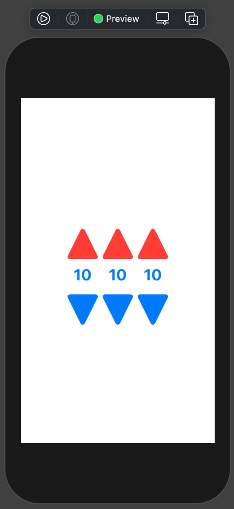
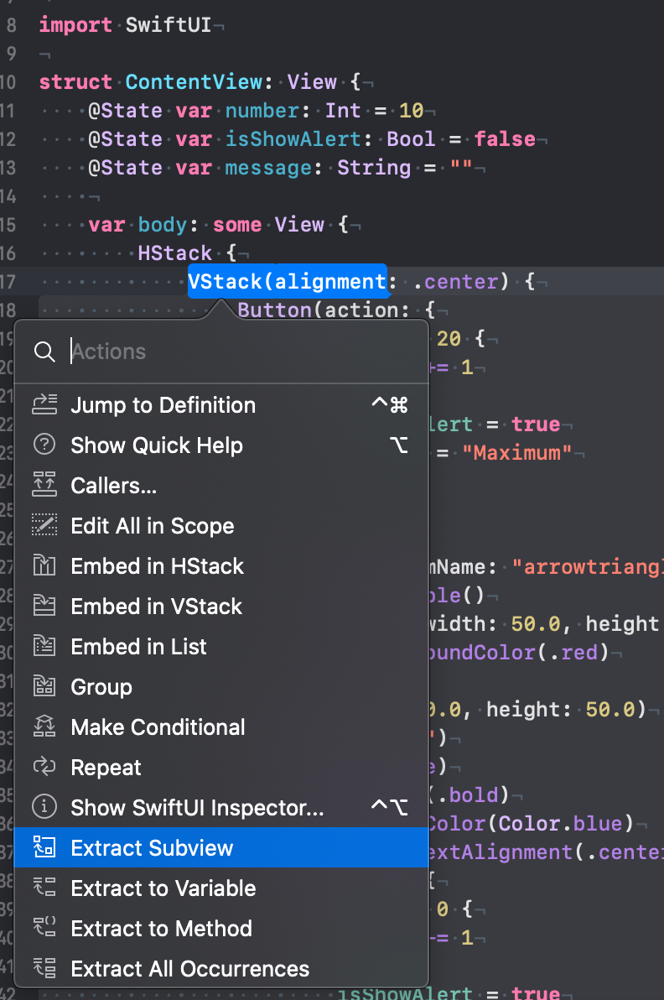
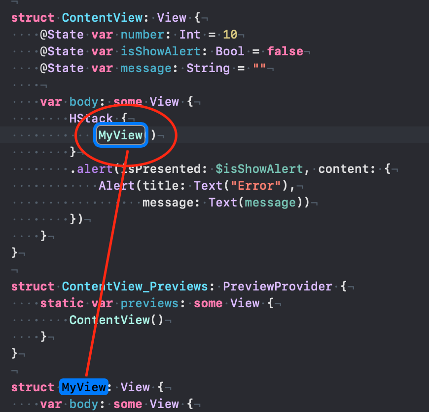

# 005 : Extracting subviews

Bài viết hôm nay mang tính chất giới thiệu tới một chức năng cũng khác hay trong Xcode khi làm với SwiftUI. Đó là **Extracting Subview**. Để biết nó là gì và dùng làm gì thì ...

> Bắt đầu thôi!

## Chuẩn bị

Bạn sẽ sử dụng lại code của bài trước, và bạn tiếp tục thực hiện thêm các yêu cầu mới thêm. Mục đích biến demo của chúng ta màu mè hơn mà thôi. Cho bạn dễ hình dung thì ta có giao diện của bài trước như thế này.


Một Control nhỏ xinh với 2 nút tăng và giảm. Còn về code thì là như sau:

```swift
VStack(alignment: .center) {
                Button(action: {
                    if number < 20 {
                        number += 1
                    } else {
                        isShowAlert = true
                        message = "Maximum"
                    }
                    
                }) {
                    Image(systemName: "arrowtriangle.up.fill")
                        .resizable()
                        .frame(width: 50.0, height: 50.0)
                        .foregroundColor(.red)
                }
                .frame(width: 50.0, height: 50.0)
                Text("\(number)")
                    .font(.title)
                    .fontWeight(.bold)
                    .foregroundColor(Color.blue)
                    .multilineTextAlignment(.center)
                Button(action: {
                    if number > 0 {
                        number -= 1
                    } else {
                        isShowAlert = true
                        message = "Minimum"
                    }
                }) {
                    Image(systemName: "arrowtriangle.down.fill")
                        .resizable()
                        .frame(width: 50.0, height: 50.0)
                }
                .frame(width: 50.0, height: 50.0)
            }
```

## 1. Tái sử dụng

Mọi viêc đơn giản khi mỗi View được tạo ra là duy nhất. Tuy nhiên, với các ứng dụng thì nhiều Control lặp lại trong chính một màn hình. Ta có bài toán mới với giao diện như sau:



Ta sẽ có tới 3 block giao diện nhỏ trong một màn hình. Và chúng giống nhau. Nếu như bạn suy nghĩ code của nó như thế nào. Thì bạn hãy nhìn đoạn code ở phần **Chuẩn bị**. Các bước như sau:

1. Đưa block view cơ bản đầu tiền vào một **HStack**
2. Sao chép lại block code view cơ bản đó
3. Dán lại chúng nó thêm 2 lần nữa vào trong **HStack**

> Cũng khá là EZ nhỉ!

Chúng ta sẽ nhân 3 lần số dòng code đó lên. Tuy nhiên, ở đời không ai làm như vậy đây. Vậy giải pháp kinh điểm muôn đời đó là:

> Tạo một Subview, để tái sử dụng nhiều lần.

*(Xin lỗi vì file code lúc này quá dài nên mình xin phép không bỏ vào đây!)*

## 2. Extract Subview

Bạn sẽ bắt đầu lại bằng file code ở phần **Chuẩn bị**. Và ta có code của **ContentView** như sau:

```swift
struct ContentView: View {
    @State var number: Int = 10
    @State var isShowAlert: Bool = false
    @State var message: String = ""
    
    var body: some View {
        HStack {
            VStack(alignment: .center) {
                Button(action: {
                    if number < 20 {
                        number += 1
                    } else {
                        isShowAlert = true
                        message = "Maximum"
                    }
                    
                }) {
                    Image(systemName: "arrowtriangle.up.fill")
                        .resizable()
                        .frame(width: 50.0, height: 50.0)
                        .foregroundColor(.red)
                }
                .frame(width: 50.0, height: 50.0)
                Text("\(number)")
                    .font(.title)
                    .fontWeight(.bold)
                    .foregroundColor(Color.blue)
                    .multilineTextAlignment(.center)
                Button(action: {
                    if number > 0 {
                        number -= 1
                    } else {
                        isShowAlert = true
                        message = "Minimum"
                    }
                }) {
                    Image(systemName: "arrowtriangle.down.fill")
                        .resizable()
                        .frame(width: 50.0, height: 50.0)
                }
                .frame(width: 50.0, height: 50.0)
            }
        }
        .alert(isPresented: $isShowAlert, content: {
            Alert(title: Text("Error"),
                  message: Text(message))
        })
    }
}
```


Bạn hãy đưa con trỏ về **VStack** và nhấn tổ hợp phím **Command + click**. Sau đó chọn như hình dưới đây.




Sau đó, bạn bấm **Enter** và đổi tên đoạn code của mình vừa mới tách ra.



Rất nhanh chóng, với chức này hữu ích này bạn đã nhanh chóng có một **Custom View** theo đúng cú pháp của SwiftUI rồi.

## 3. Hoàn thiện

Tuy nhiên, vì dính phải các thuộc tính với nhau. Nên **MyView** mới sẽ bị lỗi. Công việc của bạn là giỡ lỗi chúng nó.

Đầu tiên, chuyển các thuộc tính ở **ContentView** về **MyView**.

```swift
@State var number: Int
@Binding var isShowAlert: Bool
@Binding var message: String
```

Có một chút khác biệt ở đây. Đó là `@Binding`. Vì chúng ta thay đổi giá trị ở **Subview** và giá trị này sẽ ảnh hưởng tới thuộc tính ở **ContentView**.

> `@Binding` là một **Property Wrappers** trong SwiftUI, nó cho phép chúng ta khai báo một giá trị thực chất được khai báo ở một nơi khác, nhưng được chia sẻ lẫn nhau. 

Và ta sẽ khởi tạo **MyView** trong **ContentView** như sau:

```swift
HStack {
            MyView(number: 10, isShowAlert: $isShowAlert, message: $message)
        }
```

Chú ý thì bạn sẽ thấy các thuộc tính truyền vào hàm khởi tạo của MyView thì phải thêm từ khoá `$` vào. Nôm na là báo cho View con kia biết địa chĩ gốc của thuộc tính mà dữ liệu từ nó sẽ gởi về mà thôi.

Okay! Ta sẽ có code hoàn thiện của **MyView** như sau:

```swift
struct MyView: View {
    
    @State var number: Int
    @Binding var isShowAlert: Bool
    @Binding var message: String
    
    var body: some View {
        VStack(alignment: .center) {
            Button(action: {
                if number < 20 {
                    number += 1
                } else {
                    isShowAlert = true
                    message = "Maximum"
                }
                
            }) {
                Image(systemName: "arrowtriangle.up.fill")
                    .resizable()
                    .frame(width: 50.0, height: 50.0)
                    .foregroundColor(.red)
            }
            .frame(width: 50.0, height: 50.0)
            Text("\(number)")
                .font(.title)
                .fontWeight(.bold)
                .foregroundColor(Color.blue)
                .multilineTextAlignment(.center)
            Button(action: {
                if number > 0 {
                    number -= 1
                } else {
                    isShowAlert = true
                    message = "Minimum"
                }
            }) {
                Image(systemName: "arrowtriangle.down.fill")
                    .resizable()
                    .frame(width: 50.0, height: 50.0)
            }
            .frame(width: 50.0, height: 50.0)
        }
    }
}
```

Và code của ContentView như sau:

```swift
struct ContentView: View {
    
    @State var isShowAlert: Bool = false
    @State var message: String = ""
    
    var body: some View {
        HStack {
            MyView(number: 10, isShowAlert: $isShowAlert, message: $message)
            MyView(number: 10, isShowAlert: $isShowAlert, message: $message)
            MyView(number: 10, isShowAlert: $isShowAlert, message: $message)
        }
        .alert(isPresented: $isShowAlert, content: {
            Alert(title: Text("Error"),
                  message: Text(message))
        })
    }
}
```

Bạn hãy bấm **Live Preview** và tự cảm nhận kết quả nha! Giờ thì code của **ContentView** đã thu gọn đi nhiều lần rồi.

## Tạm kết

* Cách tách một đoạn code thành một Subview
* Binding dữ liệu từ View con về View cha
* `@Binding` vs. `@State`

---

Okay! tới đây thì mình xin kết thúc bài viết ngắn này. Hẹn gặp lại bạn ở các bài viết sau.

Cảm ơn bạn đã đọc bài viết này!