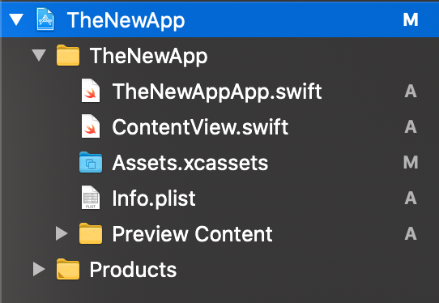
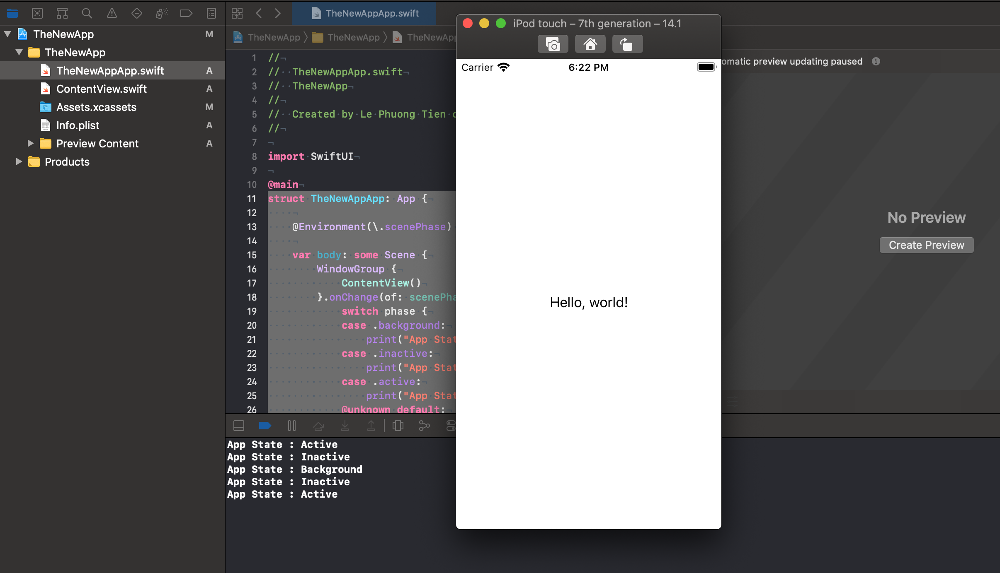
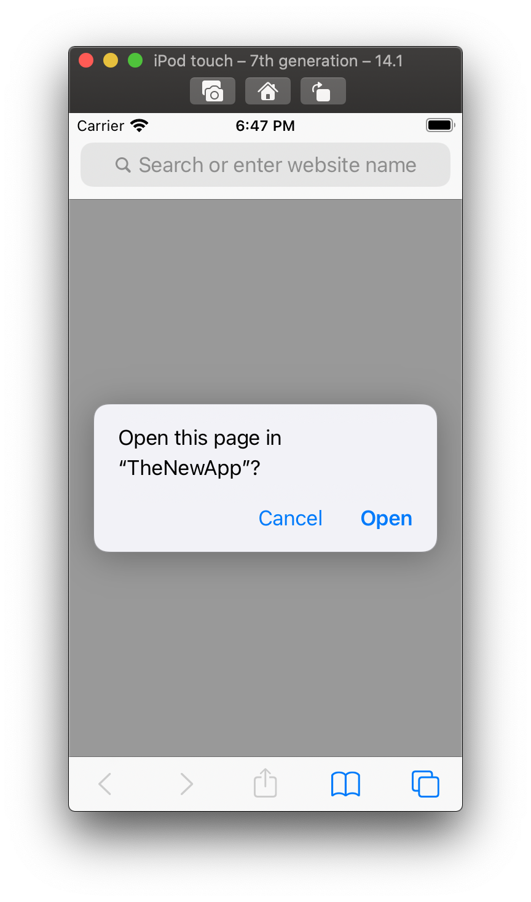
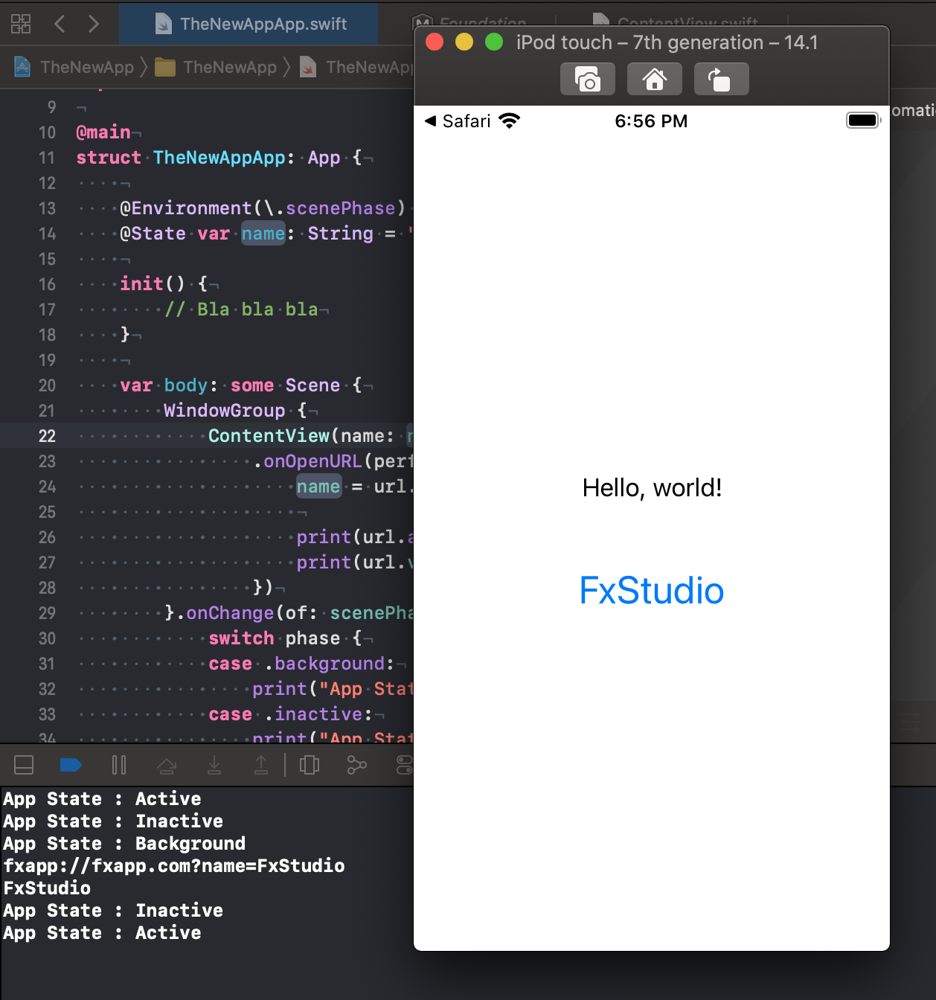

# 006 : SwiftUI App Life Cycle

Đã tới lúc ...

> **Bye Bye AppDelegate!**

Đây là một mới của SwiftUI kết hợp với Xcode. Bây giờ thì SwiftUI có được cuộc sống riêng và không còn lệ thuộc với UIKit nhiều. Nào cùng tìm hiểu thôi!

## Chuẩn bị

* Xcode 12
* Swift 5.3

Về phiên bản Xcode và Swift thì ở trên là yêu cầu tối thiểu. Nguyên nhân như mình nói ở lời giới thiệu rồi. Đây là tính năng mới nhất đến từ Xcode 12 kết hợp với SwiftUI 2.0.

## 1. UIKit App Delegate vs. SwiftUI App

**Life Cycle** là một trong những thức mà một dev cần phải nắm được. Bạn biết được các hình thái trạng thái của ứng dụng mình đang như thế nào. Bạn biết được sự kiện gì sẽ xãy ra khi bạn tương tác với ứng dụng của bạn ... vâng vâng và mây mây!

Từ khai sinh lập địa của iOS thì chúng ta vẫn sử dụng duy nhất một Life Cycle với đại diện là **AppDelegate**. Nhưng cũng theo sự phát triển của lập trình thì iOS cũng không ngoài xu thế đó. Nhưng cái hay mà Apple đem tới cho bạn là việc ...

> Âm thâm chuẩn bị giúp bạn.

Tất cả những gì mình chia sẽ lại từ bài viết này thì đã được Apple chuẩn bị trước đó 1 năm. Còn quay về với 1 năm trước thì bạn có **Xcode 11**. Với Xcode 11, project của bạn không chỉ có một màn hình `main`. Bạn có thể thêm các config để AppDelegate cho phép UIKit có thể triển khai trên nhiều màn hình thiết bị khác nhau.

> Nhưng đó là sự phát triển của UIKit.

Và cái mà bạn cần quan tâm trong series này. Chính là SwiftUI. Và tới **Xcode 12**, Apple đã ưu ái cho nó riêng một các quản lý **Life Cycle** của riêng SwiftUI.

Chúng ta sẽ bắt đầu từng bước một để khai phá nó nào. Trước tiên, bạn hãy tạo một project mới với **SwiftUI**.


Với tuỳ chọn `Interface` là SwiftUI, thì phần `Life Cycle` bạn có thêm 2 sự lựa chọn.

* **UIKit App Delegate** : đây là cách truyền thống với sự quản lý từ UIKit.
* **SwiftUI App** : đây là cách mới, thời đại mới.

> Với lựa chọn Inteface là Storyboard thì bạn chỉ có duy nhất một sự lựa chọn cho Life Cycle mà thôi. Đừng cố gắng thử làm gì! Ahihi!

## 2. Bắt đầu

Trước tiên, chúng ta hãy dạo chơi một vòng với **SwiftUI App** mới có những gì. Sau khi tạo xong thì project chúng ta sẽ hiện ra. Thứ cần quan tâm là cấu trúc file cho template mới này có những gì.



Đập vào mắt là số lượng file có vẻ ít đi rất nhiều. Hay nói cách khác thì SwiftUI App với template rất đơn giản. Bạn chỉ cần tập trung vào 2 file sau:

* **ContentView.swift** : đây là nơi chưa màn hình đầu tiên. À chính xác là view đầu tiên.
* **TheNewAppApp.swift** : mình đặt tên hơi củ chuối nên có 2 chứ App. Bạn chỉ cần biết có hậu tố `App` phía sau tên. Nó tương tự như file AppDelegate vậy. Nó sẽ quản lý toàn bộ ứng dụng.

## 3. SwiftUI App Protocol

> Điểm bắt đầu mới!

Ta sẽ xem có gì trong file SwiftUI App mới đó.

```swift
import SwiftUI

@main
struct TheNewAppApp: App {
    var body: some Scene {
        WindowGroup {
            ContentView()
        }
    }
}
```

### 3.1. @main

Nếu bạn nào thực sự tìm hiểu mỗi lần Swift mới ra mắt thì có những gì thay đổi. Thì mới hiểu được từ khoá `@main` có tầng lớp ý nghĩa như thế nào. Mình sẽ tóm tắt lại như sau:

- - Có từ Swift 5.3
  - Không sử dụng được với file `main.swift`
  - Chỉ định struct/class nào đó là điểm bắt đầu khi khởi chạy một chương trình
  - Nếu thêm 2 lần `@main` thì báo lỗi
  - Không thêm vào thì cũng bị lỗi

### 3.2. App Protocol

Ấn tượng tiếp theo là bạn có một protocol với cái tên rất bá đạo, là `App`. Nó quá cụ thể luôn. Đây chính là ứng dụng của bạn. Với việc implement protocol này thì bạn cần phải khai báo thêm một phương thức của nó là 

```swift
@SceneBuilder var body: Self.Body { get }
```

Đây là một **ScencBuilder**, thứ cần để ứng dụng hiển thị cho người dùng thấy được. Trong đó, bạn cần tiếp tục khai báo thêm một **WindowGrop**. Em này lại cần một em là **ContentView**. Chắc phần này cũng dễ đoán mà thôi.

### 3.3. Scene

Bạn cũng đã biết mục đích chính của SwiftUI là có thể đưa lên nhiều nền tảng khác nhau. Do đó, thành phần Scene này cũng khá là linh hoạt.

Với mặc định từ Xcode 12 tạo ra thì bạn có đại diện chính là **WindowGroup**. Nó như là `window` trong UIKit hay nhiều `window` với MacOS. 

Tuy nhiên, với nền tảng khác thì không chỉ có một Window mà còn thêm nhiều thứ khác nữa. Ví dụ: MacOS có những view đặc biệt như **Setting** thì chúng ta có thể `if else` sau nha. Bạn xem thêm tại [đây](https://developer.apple.com/documentation/swiftui/settings).

Thêm tí tổng hợp bà con nhà nó như sau:

- - WindowGroup
  - DocumentGroup
  - Settings
  - WKNotificationScene
  - CommandsBuilder
  - CommandMenu
  - Command Protocol

Có điều kiện thì mình sẽ viết bài riêng cho từng em một nha. Giờ tập trung sang phần chính tiếp theo nào!

## 4. App States Callbacks

Tiếp tục là việc bạn cần phải lắng nghe được sự thay đổi của trạng thái ứng dụng. Trong iOS 14, Apple cung cấp cho bạn **ScenePhase** để giúp bạn theo dõi trạng thái. Việc theo dõi này sẽ theo dõi từ môi tường. Do đó bạn cần tạo thêm một biến môi trường cho scene.

```swift
    @Environment(\.scenePhase) private var scenePhase
```

Bạn đã có scene rồi, giờ sử dụng thêm phương thức `onChange(of:)` để lắng nghe các giá trị từ biến môi trường.

```swift
struct TheNewAppApp: App {
    
    @Environment(\.scenePhase) private var scenePhase
    
    var body: some Scene {
        WindowGroup {
            ContentView()
        }.onChange(of: scenePhase) { phase in
            switch phase {
            case .background:
                print("App State : Background")
            case .inactive:
                print("App State : Inactive")
            case .active:
                print("App State : Active")
            @unknown default:
                print("App State : Unknown")
            }
        }
    }
}
```

Bạn sử dụng đoạn code trên để tiết kiệm thời gian. Sau đó hãy build ứng dụng lên các thiết bị iOS và xem kết quả.



## 5. App Init

Với AppDelegate thì function `didFinishLaunchWithOptions` , rất thần thánh. Nới ứng dụng bắt đầu khởi tạo và là nơi để chứa hết những gì cần chạy lúc ban đầu. Và tương tự với SwiftUI App. Bạn chỉ cần nhẹ nhàn thêm function `init` huyền thoại vào là ổn.

```swift
struct TheNewAppApp: App {
    
    @Environment(\.scenePhase) private var scenePhase
    
    init() {
        // Bla bla bla
    }
    
    var body: some Scene {
        WindowGroup {
            ContentView()
        }.onChange(of: scenePhase) { phase in
            switch phase {
            case .background:
                print("App State : Background")
            case .inactive:
                print("App State : Inactive")
            case .active:
                print("App State : Active")
            @unknown default:
                print("App State : Unknown")
            }
        }
    }
}
```

Còn muốn dùng là gì thì tuỳ ý bạn nha!

## 6. Deeplink URLs

 Phần tiếp theo là ở ứng dụng bằng một link URL. Giang hồ gọi làm Deeplink. Chúng ta có thể làm nhiều thứ với nó. Như truyền thêm giá trị vào ứng dụng từ bên ngoài.

Với AppDelegate, ta có thể handle nó thông qua phương thức sau `application(_:open:options:)`. Còn với SwiftUI App ta cũng có phương thức tương tự.

```swift
WindowGroup {
            ContentView(name: name)
                .onOpenURL(perform: { url in
                    print(url.absoluteURL)
                })
        }.onChange(of: scenePhase) { phase in
            switch phase {
            case .background:
                print("App State : Background")
            case .inactive:
                print("App State : Inactive")
            case .active:
                print("App State : Active")
            @unknown default:
                print("App State : Unknown")
            }
        }
```

Với `onOpenURL`, sử dụng cho scene top trong ứng dụng. Ta có thể đón nhận các `url` và khởi động app lên.

> Về setting cho Deeplink URL thì mình không trình bày ở bài viết này.

Để cho demo thêm sinh động ta sẽ implement thêm một chút nữa con **ContentView**. Với việc hiển thị tên dưới chữ `Hello, world!`. Giá trị tên này sẽ truyền từ một link và mở bằng Safari. Code của **ContentView** như sau:

```swift
struct ContentView: View {
    
    let name: String
    
    var body: some View {
        VStack {
            Text("Hello, world!")
                .padding()
            Text((name != "") ? name : "---")
                .font(.title)
                .foregroundColor(Color.blue)
                .padding()
        }
    }
}
```

Bạn chuyển sang file `App`, thêm 1 extension nhằm đọc giá trị từ query string của url một cách nhanh chóng.

```swift
extension URL {
    func valueOf(_ queryParamaterName: String) -> String? {
        guard let url = URLComponents(string: self.absoluteString) else { return nil }
        return url.queryItems?.first(where: { $0.name == queryParamaterName })?.value
    }
}
```

Sau đó bạn hoàn thiện struct App.

```swift
struct TheNewAppApp: App {
    
    @Environment(\.scenePhase) private var scenePhase
    @State var name: String = ""
    
    init() {
        // Bla bla bla
    }
    
    var body: some Scene {
        WindowGroup {
            ContentView(name: name)
                .onOpenURL(perform: { url in
                    name = url.valueOf("name") ?? ""
                    
                    print(url.absoluteURL)
                    print(name)
                })
        }.onChange(of: scenePhase) { phase in
            switch phase {
            case .background:
                print("App State : Background")
            case .inactive:
                print("App State : Inactive")
            case .active:
                print("App State : Active")
            @unknown default:
                print("App State : Unknown")
            }
        }
    }
}
```

Trong đó:

* Tạo một thuộc tính `@State` là `name`, để lưu trữ giá trị và truyền cho **ContentView**
* Tại `onOpenURL` , phân tích `url` và gián giá trị mới cho `name`.

Cú pháp mở app từ Safari với url như sau:

```
fxapp://fxapp.com?name=FxStudio
```

Build ứng dụng và xem kết quả:

* Safari sau khi gõ đường dẫn trên



* Ứng dụng được gọi lại từ background



## 7. Connect to AppDelegate

Mặc dù SwiftUI App có thể độc lập với UIKit. Nhưng khi bạn phát triển ứng dụng trên iOS thì mối quan hệ này vẫn còn vương vấn. Hiện nay, nhiều thư viện hay dịch vụ của bên thứ ba vẫn cần được khởi tạo tại AppDelegate. Hoặc bạn có thể tracking nhiều hơn với AppDelegate.

Do đó, SwiftUI cũng giúp cho bạn có thể nhận được hay triệu hồi các phương thức AppDelegate. Ta sẽ thực hiện theo các bước sau:

**Bước 1 : tạo lại file AppDelegate.swift**

```swift
import UIKit

class MyAppDelegate: UIResponder, UIApplicationDelegate {
  
    func application(_ application: UIApplication, didFinishLaunchingWithOptions launchOptions: [UIApplication.LaunchOptionsKey : Any]? = nil) -> Bool {
      
        print("AppDelegate > didFinishLaunchingWithOptions > called")
      
        return true
    }
}
```

Trong đó:

* Triệu hồi UIKit trong file này
* Kế thừa UIResponder
* Implement protocol UIApplicationDelegate
* Thêm phương thức `didFinishLaunchWithOptions`
* Không khai báo hay khởi tạo thêm các `window` & `scene`

Đặc biệt trong file không có từ khoá sau **@UIApplicationMain** hay **@main** . Vì đây là SwiftUI App, main đã được chỉ định ở nơi khác rồi. 

**Bước 2: Tạo adaptor từ file App**

```swift
@UIApplicationDelegateAdaptor(MyAppDelegate.self) private var appDelegate
```

Khi ứng dụng được khởi tạo và chạy thì hàm `didFinishLaunchWithOptions` cũng sẽ được gọi chạy theo.

Bạn build lại ứng dụng và cảm nhận kết quả nha!

## Tạm kết

* Tạo App với protocol App
* Sử dụng `@main` để chỉ định struct/class nào là bắt đầu ứng dụng
* Tracking các trạng thái của app bằng SwiftUI App
* Sử dụng Deeplink vào trong SwiftUI App
* Kết nối ngược lại với AppDelegate Life cycle

---

Okay! Tới đây mình xin kết thúc bài về SwiftUI App Life Cycle. Đây là bài viết thuộc dạng nền tảng cần phải hiểu được, để bạn có thể tiến xa hơn nữa với SwiftUI. Hẹn gặp lại ở các bài viết sau.

Cảm ơn bạn đã đọc bài viết này!