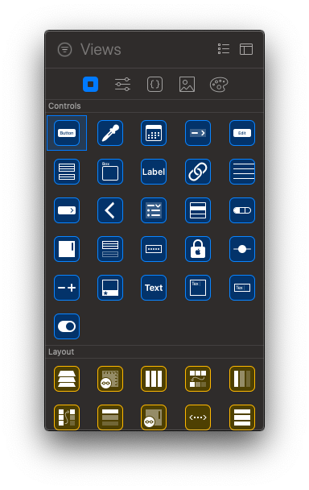
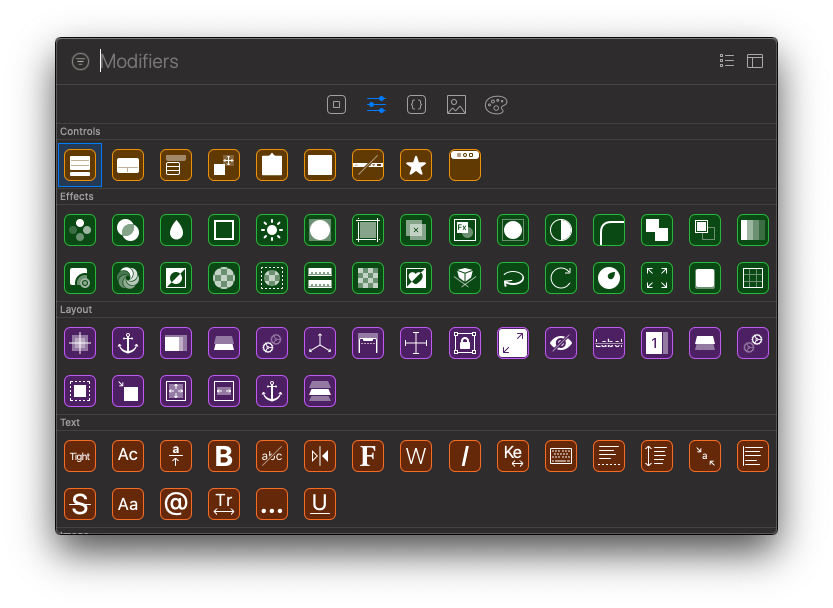

# 007 - 2 : Declaring Views

Với SwiftUI thì cũng như UIKit, bạn sẽ tạo từng phần nhỏ giao diện để được một giao diện hoàn chỉnh. Trong SwiftUI thì có nhiều UI tương tự như UIKit, ví dụ như Text, Button ... đó là phần cơ bản. Và giúp bạn không phải hoang mang khi thay đổi nền tảng.

## Primitive views

Đây chính là những Control cơ bản đầu tiêu. Bên cạnh đó có các bố cục layout cơ bản. Về chi tiết mỗi loại thì mình sẽ đề cập sau.

## Modifiers

Phần thứ 2 là các Modifiers. Nó là các công cụ sửa đổi cho các Control. Như hiệu ứng, layout, font ... Và khi bạn thay đổi thuộc tính của một Control thì bằng cách gọi các phương thức liên tiếp. 

> Thứ tự các phương thức gọi sẽ ảnh hưởng tới hiển thị của Control.

SwiftUI khuyến khích bạn tạo các Reusable View để tái sử dụng nhiều lần. Về hiển thị thì SwiftUI sẽ hỗ trợ hiển thị từng view riêng lẻ. Bạn sẽ thoải mái sáng tạo mà không sợ việc ảnh hưởng giao diện chung khi thay đổi 1 view nhỏ.

---

Về các chủ đề riêng lẻ cho các View & Modifiers thì mình sẽ cập nhật sau. Ahihi!

