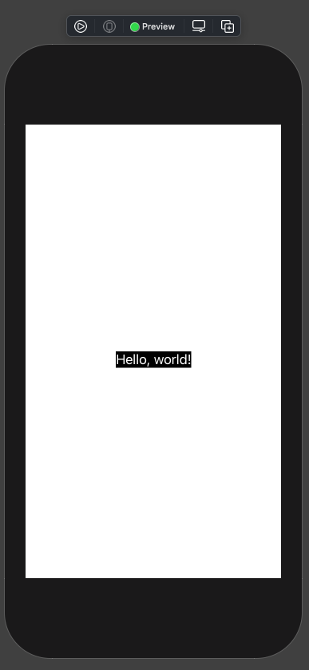
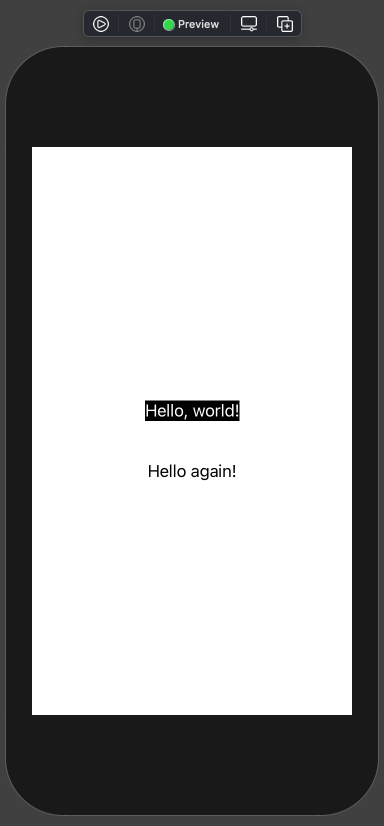
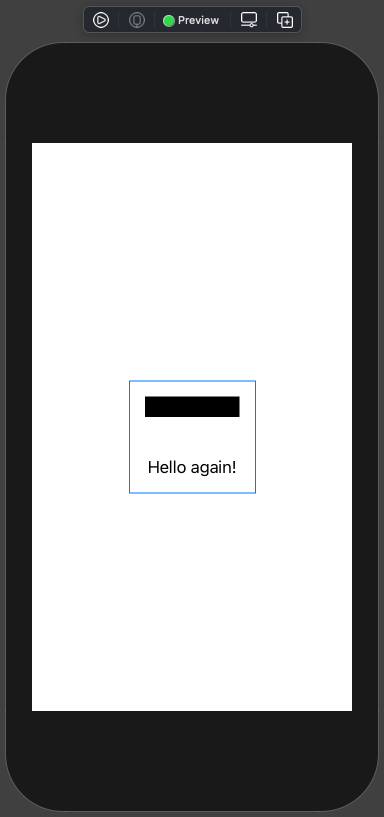
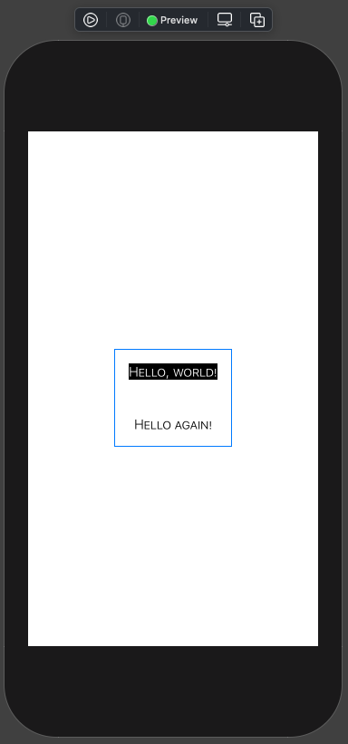

# 007 - 3 : Environment values

Các giá trị của môi trường sẽ ảnh hưởng tới toàn bộ ứng dụng của bạn về mặt hiển thị. Ví dụ như: accessibility, locale, calendar & color scheme ... Và bạn có thể thử và kiểm tra hiển thị theo từng giá trị ở màn hình Preview. Từ đó mình có thể dễ dàng tìm và debug hoặc thiết kế một cách nhanh chóng.

Về chi tiết về phần này thì chúng ta sẽ có một bài viết cụ thể hơn. Sau đây, mình sẽ đi qua nhanh các vấn đề bạn có thể xử lý với **Environment values**.

> Bắt đầu thôi!

## 1. Thay đổi ở Preview

Bạn hãy tạo một project mới và thử nghiệm vài phép biến đổi. Trước tiên xem qua code của ContentView của chúng ta.

```swift
import SwiftUI

struct ContentView: View {

    var body: some View {
        Text("Hello, world!")
            .padding()
    }
}

struct ContentView_Previews: PreviewProvider {
    static var previews: some View {
        ContentView()
    }
}
```

Mình có 2 phần tách biệt:

* **ContentView** : để hiển thị nội dung
* **Preview**: để hiển thị bản xem trước của ContentView

Thay vì phải build project và thay đổi môi trường của thiết bị. Bạn có thể nhanh chóng cài đặt từng loại biến môi trường. Chúng ta sẽ lấy ví dụ với `dark` & `light` mode trong iOS.

Tại Preview, bạn thêm đoạn code sau vào.

```swift
struct ContentView_Previews: PreviewProvider {
    static var previews: some View {
        ContentView()
            .environment(\.colorScheme, .light)
    }
}
```

Mọi việc chưa có biến đổi gì hết. Bạn đổi nhẹ từ `.light` sang `.dark` thì sẽ thấy chữ `Hello, world!` biến mất. Thực chất lúc này thì màu chữ của nó trùng với màu background.

Bạn hãy thử nghiệm và đây là cách thay đổi giá trị của môi trường. Với nó bạn không tốn thời gian build lại ứng dụng. Rất nhanh và tiện lợi.

## 2. Sử dụng biến môi trường

Chúng ta có chữ của Text đã auto thay đổi. Đơn giản vì nó sử dụng màu sắc mặc định của hệ thống. Giờ chúng ta sẽ làm màu nền của Text thay đổi theo chế độ màu sắc sáng tối.

Muốn thực hiện việc này thì ta cần phải khai báo thêm một thuộc tính là biến môi trường. Bạn thêm dòng code sau vào **ContentView**.

```swift
@Environment(\.colorScheme) var colorScheme: ColorScheme
```

Trong đó:

* `@Environment` là một wrapper properties
* `\.colorScheme` là key path để trỏ tới cái chúng ta cần lấy. Đó là hệ màu theo chế độ theme.

Bạn tiến hành chỉnh sửa Text một lần nữa với việc thay đổi `background` của nó như sau:

```swift
Text("Hello, world!")
            .background(colorScheme == .dark ? Color(.black) : Color(.white))
            .padding()
```

Bấm **Command + Option + P** để cho Canvas load nhanh hơn. Và tận dưởng kết quả nào!



Ta đã sử dụng được biến môi trường và tuỳ biến giao diện theo giá trị của biến môi trường rồi. Sang phần tiếp theo.

## 3. Local environment

SwiftUI cũng hỗ trợ cho chúng ta việc thay đổi hay cài đặt lại với từ giá trị biến môi trường cụ thể. Nó sẽ không bị ảnh hường gì từ các giá trị biến môi trường của thiết bị. 

> Đây là điểm linh hoạt của SwiftUI.

### 3.1. Cho từng element

Tại ContentView, bạn tiến hành thêm 1 VStack và thêm một Text nữa. Bạn theo dõi đoạn code sau:

```swift
    var body: some View {
        VStack {
            Text("Hello, world!")
                .background(colorScheme == .dark ? Color(.black) : Color(.white))
                .padding()
            Text("Hello again!")
                .padding()
                .environment(\.colorScheme, .light)
        }
    }
```

Trong đó bạn chú ý tới dòng code `.environment(\.colorScheme, .light)`. Với dòng code này thì Text mới của chúng ta sẽ hiển thị theo giá trị môi trường của riêng nó.

Bấm resume nhẹ Canvas và xem kết quả tiếp theo nào.



### 3.2. On top element

Vì các view trong SwiftUI có sự bố cụ và phân cấp. Do đó, thay vì thay đổi nhiều biến môi trường cho nhiều element trong 1 block giao diện. Bạn có thể thay đổi với element lớn nhất. Sau đó, tất cả các thành phần giao diện con của nó đều bị ảnh hưởng.

Ví dụ bạn thay đổi biến môi trường của VStack để nó ảnh hưởng toàn bộ các Text con ở trong.

```swift
VStack {
            ...
        }
        .environment(\.colorScheme, .light)
```

Xem tiếp kết quả ra sao nào!



Giải thích:

* `background` được cài đặt theo giá trị biến môi trường từ Preview. Nên có màu đen
* Màu của Text đầu tiên thì vẫn sử dụng mặc định. Nên với giá trị từ VStack là `.light` thì nó sẽ hiển thị màu đen

Bạn thay đổi biến môi trường của VStack thành `.dark` nha. Chuẩn bị cho ví dụ cuối cùng.

### 3.3. Cài đặt biến môi trường

Ngoài ra, bạn có thể thay đổi từng giá trị đặt biệt. Chúng sẽ ảnh hưởng tới hiển thị của toàn bộ các View con trong đó. Ta hãy thay đổi giá trị Font thay vì dùng font mặc định trong ví dụ trên.

```swift
 VStack {
            ...
        }
				.environment(\.colorScheme, .dark)
        .font(Font.subheadline.lowercaseSmallCaps().weight(.light))
```

Bấm resume để xem kết quả nào!



Bạn hoàn toàn có thể chỉ định một giá trị cụ thể như Font để nó áp dụng cho toàn bộ các view con. Hoặc chỉ định cho từng view vẫn được. 

Và với chế độ màu theo `dark mode` hay `light mode` thì cũng có thể xét riêng. Bạn hay thay lại với phương thức `.colorScheme(.dark)`.

Okay! Gì bạn xem lại toàn bộ code của phần biến môi trường này để có cái nhìn tổng quả nhất.

```swift
import SwiftUI

struct ContentView: View {
    
    @Environment(\.colorScheme) var colorScheme: ColorScheme
    

    var body: some View {
        VStack {
            Text("Hello, world!")
                .background(colorScheme == .dark ? Color(.black) : Color(.white))
                .padding()
            Text("Hello again!")
                .padding()
                .environment(\.colorScheme, .light)
        }
        .colorScheme(.dark)
        .font(Font.subheadline.lowercaseSmallCaps().weight(.light))
    }
}

struct ContentView_Previews: PreviewProvider {
    static var previews: some View {
        ContentView()
            .environment(\.colorScheme, .dark)
    }
}
```

## Tạm kết

* Thay đổi biến môi trường ở Preview để ảnh hưởng toàn bộ View
* Lấy giá trị biến môi trường để cài đặt giao diện phù hợp
* Xét giá trị biến môi trường
  *  Cho từng View
  * Từng loại thuộc tính
  * Ảnh hưởng toàn bộ các View con

---

Okay! Tới đây mình xin hết thúc bài viết với chủ đề biến môi trường. Hẹn gặp lại bạn ở các bài viết tiếp theo.

Cảm ơn bạn đã đọc bài viết này!