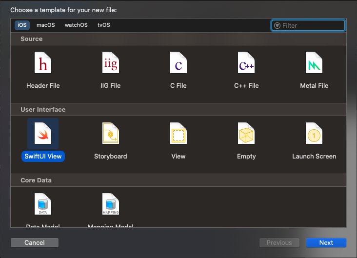
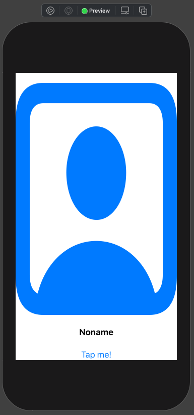
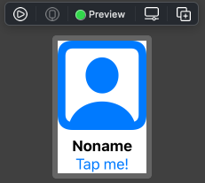
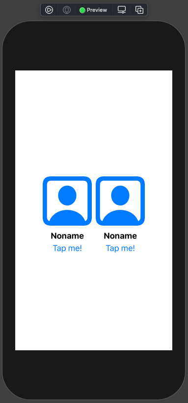
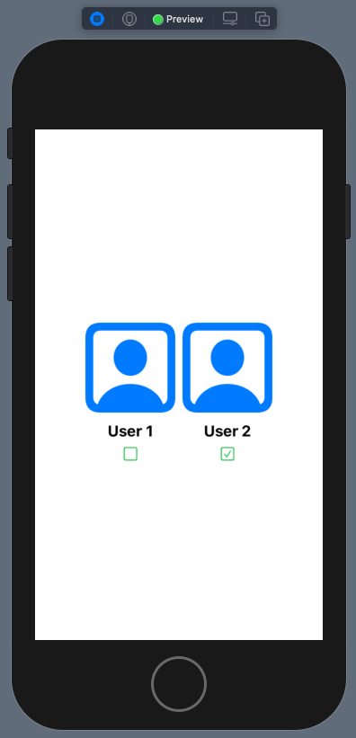
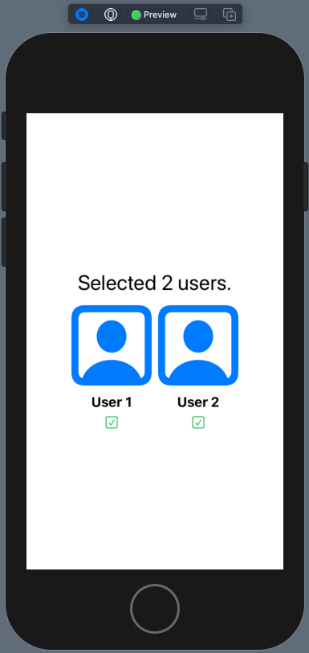
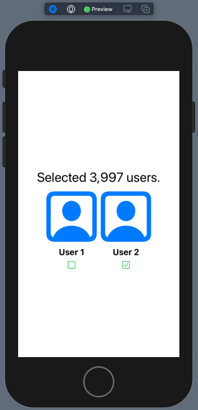
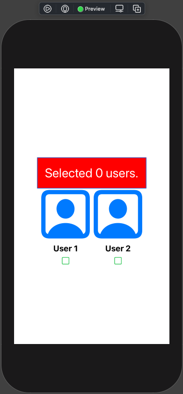

# 007 - 4 : Reusable View

Cái tên nghe khá là kêu nhưng thực chất đây chính là cách bạn Custom View mà thôi. Với UIKit, chúng ta đã quen với việc Custom và xử lý nhiều vấn đề kéo theo như: Binding, Call back ... . Thì sang SwiftUI, chúng ta vẫn phải giải quyết chúng.

Bài viết này chỉ là cách Custom cơ bản và nêu ra các phần cần chú ý giúp bạn. Nếu mọi việc ổn rồi thì ...

> Bắt đầu thôi!

## 1. Tạo một View

Bạn có thể sử dụng tiếp project SwiftUI hoặc có thể tạo mới. Tuy nhiên, bạn không cần quá cầu kì trong việc chuẩn bị. Đối với SwiftUI bạn có thể tạo ở mọi nơi và bất cứ lúc nào. Còn với demo cho bài viết thì mình sẽ tạo mới một file

* **UserView** dùng làm View custom
* **ContentView** để làm nơi chứa các UserView

Bắt đầu bằng việc tạo mới một file **SwiftUI**. Bạn chú ý là chọn đúng template SwiftUI nha.



Sau đó đặt tên (mình đặt là UserView) và bấm enter. Mặc định Xcode sẽ tạo giúp cho bạn nhiều thứ. Xem qua code mặc định của UserView như sau:

```swift
import SwiftUI

struct UserView: View {
    var body: some View {
        Text("Hello, World!")
    }
}

struct UserView_Previews: PreviewProvider {
    static var previews: some View {
        UserView()
    }
}
```

Ta tiến hành tạo sơ giao diện của UserView như sau:

```swift
struct UserView: View {
    var body: some View {
        VStack {
            Image(systemName: "person.crop.square")
                .resizable()
                .foregroundColor(.blue)
            Text("Noname")
                .fontWeight(.bold)
                .multilineTextAlignment(.center)
            Button(action: {
                // action here
            }) {
                Text("Tap me!")
            }
        }
    }
}
```

Với bố cục bao gồm:

* Một Image hiển thị ảnh của người dùng
* Text hiển thị tên  người dùng
* Button để tương tác với view

Tuy nhiên, ấn tượng đầu tiên khi bạn nhìn sang màn hình Canvas thì khác là xấu xí.



Bạn không cần quá lo lắng. Với SwiftUI, tất cả đều xem là View. Cái bạn thấy chỉ là Preview của View đó trên một thiết bị giả định. Trong tình huống này thường suy nghĩ như sau:

* Bạn sẽ bị hiểu lầm View với kích thước là toàn màn hình
* Bạn sẽ tìm cách edit lại hay tuỳ chỉnh kích thước của các Control con trong View

Với trường hợp này bạn nên bình tĩnh và có việc sau cần làm:

**Thay đổi lại kích thước Preview để có được hiệu quả mong muốn.**

Xem đoạn code sau:

```swift
struct UserView_Previews: PreviewProvider {
    static var previews: some View {
        UserView()
            .previewLayout(.fixed(width: 100.0, height: 150.0))
    }
}
```

Kết quả bây giờ rất là nhỏ xinh rồi.



**Tuỳ chỉnh kích thước của View:**

Cách trên vẫn chỉ là cách đánh lừa mắt mình mà thôi. Giờ bạn cần phải cập nhật lại kích thước của View một cách cụ thể. Xem code tham khảo

```swift
struct UserView: View {
    var body: some View {
        VStack {
            Image(systemName: "person.crop.square")
                .resizable()
                .foregroundColor(.blue)
                .frame(width: 100.0, height: 100.0)
            Text("Noname")
                .fontWeight(.bold)
                .multilineTextAlignment(.center)
                .frame(width: 100.0, height: 25.0)
            Button(action: {
                // action here
            }) {
                Text("Tap me!")
            }
            .frame(width: 100.0, height: 25.0)
        }
        .frame(width: 100.0, height: 150.0)
    }
}
```

Giờ thì khác là ổn rồi. Qua các chương sau mình sẽ trình bày về cách bố cục hay auto layout sau nha. Tiếp tục, bạn chuyển sang **ContentView** và tiến hành thêm UserView vào. Ví dụ như sau:

```swift
struct ContentView: View {
    
    var body: some View {
        HStack {
            UserView()
            UserView()
        }
    }
}
```

Mình thêm 2 UserView cho bạn dễ hình dung. Xem kết quả như sau:



## 2. Properties

Việc hiển thị dữ liệu lên giao diện thì cũng phải được thay đổi. Do đó, ta phải thêm các thuộc tính sau vào cho **UserView**.

### 2.1. Chỉ hiển thị một lần

Ta thêm thuộc tính có tên của user như sau:

```swift
var name: String
```

Thuộc tính này chỉ hiển thị một lần và đơn giản. Hầu như bạn không cần phải thay đổi gì. Do đó, bạn khai báo bình thường như trước đây với UIKit.

Sau đó, bạn cập nhật lại nội dùng của Text như sau, để nó hiển thị giá trị `name`

```swift
Text(name)
                .fontWeight(.bold)
                .multilineTextAlignment(.center)
                .frame(width: 100.0, height: 25.0)
```

Và bạn sẽ nhận một loạt lỗi từ Xcode. Bạn bình tĩnh vì đây là:

* Bạn thêm mới thuộc tính mà chưa cấp phát giá trị khởi tạo
* Các Preview và các View đang sử dụng UserView sẽ yêu cầu bạn cung cấp thêm giá trị khởi tạo cho đối tượng UserView với tham số `name`

Bạn từ từ cập nhật lại nha. Ví dụ của mình ở **ContentView** như sau:

```swift
HStack {
            UserView(name: "User 1")
            UserView(name: "User 2")
        }
```

Kết quả cũng khá là đẹp.


### 2.1. Có thể thay đổi được

Giờ chúng ta sang dạng thuộc tính có sự thay đổi giá trị. Và sự thay đổi giá trị này ảnh hưởng tới hiển thị của View. Bạn thêm thuộc tính sau vào UserView.

```swift
@State var isSelected = false
```

Mục đích là để người dùng tương tác vào. Nếu:

* `isSelected == true` thì sẽ hiện ô check
* `isSelected == false` thì sẽ hiện ra ô un-check

Ta có code như sau:

```swift
struct UserView: View {
    
    var name: String
    @State var isSelected = false
    
    var body: some View {
        VStack {
            Image(systemName: "person.crop.square")
                .resizable()
                .foregroundColor(.blue)
                .frame(width: 100.0, height: 100.0)
            Text(name)
                .fontWeight(.bold)
                .multilineTextAlignment(.center)
                .frame(width: 100.0, height: 25.0)
            Button(action: {
                isSelected.toggle()
            }) {
                Image(systemName: isSelected ? "checkmark.square" : "square")
                    .foregroundColor(.green)
            }
            .frame(width: 100.0, height: 25.0)
        }
        .frame(width: 100.0, height: 150.0)
    }
}

```

Điểm quan trong là khai báo `@State`, với khai báo này thì Control UI của chúng ta có sự liên kết về mặt dữ liệu với thuộc tính được khai báo với @State kia. Từ đó, mỗi khi giá trị thuộc tính được thay đổi thì SwiftUI tự động cập nhật lại  giao diện phụ thuộc kia.

Muốn xem được kết quả thì bạn phải chuyển sang chế độ Live Preview. Kết quả sẽ như thế này.




## 3. Binding

Tiếp tục, chúng ta tới phần cũng khá là hay. Khi SwiftUI kết hợp với Combine để giúp cho bạn có thể Binding dữ liệu giữa 2 view một cách nhanh chóng.

Ta sẽ tiếp tục demo phần này. Bắt đầu tại file **ContentView** với việc khai báo thêm 1 thuộc tính `@State`. Thuộc tính này đảm nhận vai trò lưu trữ và thay đổi trạng thái cho UI mà nó được ràng buộc.

```swift
@State var count = 0
```

Cùng tại ContentView, bạn cập nhật thêm UI để hiển thị số lượng User được `selected`. Code mới như sau:

```swift
struct ContentView: View {
    
    @State var count = 0
    
    var body: some View {
        VStack {
            Text("Selected \(count) users.")
                .font(.title)
            HStack {
                UserView(name: "User 1", count: $count)
                UserView(name: "User 2", count: $count)
            }
        }
    }
}
```

Bạn sẽ thấy ta chỉnh sử lại khai báo UserView với tham số `$count`. Nó là gì? Ta tạm thời sang file **UserView** để tiếp tục thêm thuộc tính mới.

```swift
@Binding var count: Int
```

Điểm mới ở đây là từ khoá `@Binding`, với nó thì:

* Liên kết với biến/thuộc tính từ bên ngoài
* Khi nó thay đổi giá trị thì ngoài kia cũng theo đổi theo
* 1 đối tượng có thể sử dụng cho nhiều đối tượng con khác

Ta chỉnh sửa tiếp phần `action` trong UserView như sau:

```swift
Button(action: {
                isSelected.toggle()
                
                if isSelected {
                    count += 1
                } else {
                    count -= 1
                }
                
            }) {
                Image(systemName: isSelected ? "checkmark.square" : "square")
                    .foregroundColor(.green)
            }
```

Không quá khó hiểu khi chỉ có mỗi việc tăng hoặc giảm giá trị của thuộc tính mà thôi. Chúng ta lại về ContentView và chuyển sang chế độ Live Preview. Kết quả như sau:



**Ta tóm tắt một chút:**

* `@State` để khai báo một thuộc tính sẽ gây ảnh hưởng tới một View thông qua việc ràng buộc dữ liệu của nó. Mỗi khi thay đổi giá trị thì View sẽ tự động cập nhật lại.
* `@Binding` sẽ liên kế với thuộc tính `@State`. Từ đó chia sẽ giá trị của thuộc tính với nhau. Khi thay đổi ở một nơi thì nơi kia cũng thay đổi theo.
* Từ khoá `$` sẽ được thêm vào trước tên thuộc tính @State làm đối số cho @Binding
* Về mặt bộ nhớ thì sẽ không bị duplicate hay copy vùng nhớ. 

## 4. Call back

Phần tiếp theo cần quan tâm đó là **Call back**. Nhưng trong mô hình phát triển **Declarative App** thì hầu như không cần thiết mấy. Và cũng đôi lúc chúng ta cần sự phản hồi trở lại từ Custom View khi kết thúc một sự kiện nào đó.

> Công việc này tương tự như viết Delegate cho Custom View ở UIKit vậy.

Bắt đầu, tại file **UserView**. Bạn tiếp tục thêm thuộc tính mới. Nó là một `closure` đơn giản kết hợp `optional`. Để đảm bảo không cần phải gán giá trị lúc khởi tạo đối tượng.

```swift
var action: (() -> Void)?
```

Ta thêm một function mới tên là `onChanged` như sau:

```swift
func onChanged(action: @escaping () -> Void ) -> Self {
        var copy = self
        copy.action = action
        return copy
    }
```

Trong đó:

* Nhân bản đối tượng hiện tại lên
* Gán `action` bằng với action được truyền vào từ view bên ngoài
* Return lại chính giá trị vừa mới được nhân bản lên.

Trong UserView, khi bạn muốn nơi nào `call back` thì sẽ gọi ở đó. Ta có ví dụ sau để gọi call back tại action của Button.

```swift
Button(action: {
                isSelected.toggle()
                
                if isSelected {
                    count += 1
                } else {
                    count -= 1
                }
                
                action!()
                
            }) {
                Image(systemName: isSelected ? "checkmark.square" : "square")
                    .foregroundColor(.green)
            }
            .frame(width: 100.0, height: 25.0)
```

Sang file **ContentView**, ta sử dụng nó như một Modifier của UserView.

```swift
VStack {
            Text("Selected \(count) users.")
                .font(.title)
            HStack {
                UserView(name: "User 1", count: $count)
                    .onChanged {
                        count += 999
                    }
                UserView(name: "User 2", count: $count)
            }
        }
```

Khi user 1 kích vào Button thì `onChanged` sẽ được gọi. Ta sẽ cộng thêm một số lượng lớn vào cho dễ nhận biết. Bạn bấm Live Preview và xem lại kết quả nào.



## 5. Thứ tự của Modifiers

Nếu bạn để ý thì khi chúng ta lần lượt thay đổi của thuộc tính của một Declaring View, thì thứ tự thực hiện sẽ quyết định tới hiện hiển thị View đó. Ta xem qua 2 ví dụ sau:

 **Ví dụ 1:**

````swift
Text("Selected \(count) users.")
                .padding()
                .font(.title)
                .foregroundColor(Color.white)
                .background(Color(.red))
````



**Ví dụ 2:**

```swift
Text("Selected \(count) users.")
                .font(.title)
                .foregroundColor(Color.white)
                .background(Color(.red))
                .padding()
```


Chỉ cần thay đổi `.padding()` thì View của chúng ta sẽ biến đổi khác nhau. Nguyên nhân là gì?

* Sau mỗi lần thay đổi thuộc tính thì nó được gọi là modifier.
* Mới modifier thì một phiên bản View mới được tạo ra, sau đó sẽ gởi trả về cho View cha hiển thị
* Nên thứ tự các modifier rất quan trọng trong việc quyết định hiển thị của View

Nó khác với **UIKit** và khác với **Imperative app**, khi việc thay đổi thuộc tính thì chỉ thay đổi giá trị. Đối tượng đó vẫn còn và không bị thay đổi. Nên khi hiển thị thì sẽ giống nhau.

> Bạn hết sức chú ý thứ tự các Modifiers trong việc phát triển SwiftUI App của mình.

## Tạm kết

* Cách tạo một View và tái sử dụng chúng. Hay còn gọi là Custom View
* Các loại thuộc tính và cách ràng buộc dữ liệu vào UI
* @State và @Binding trong việc liên kết & chia sẽ giá trị của các thuộc tính
* Cách thực hiện Call back trong SwiftUI
* Việc ảnh hưởng của Thứ tự các Modifiers tới việc hiển thị của giao diện

---

Okay! Bài viết cũng khá là dài rồi và mình xin kết thúc tại đây. SwiftUI đúng là thật ảo diệu. Một lần nữa cảm ơn bạn đã đọc bài viết này!