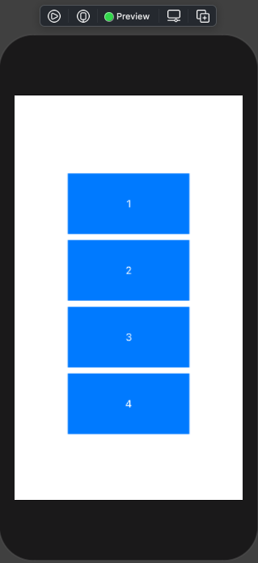
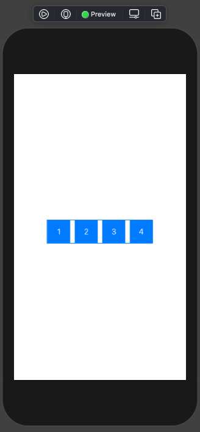
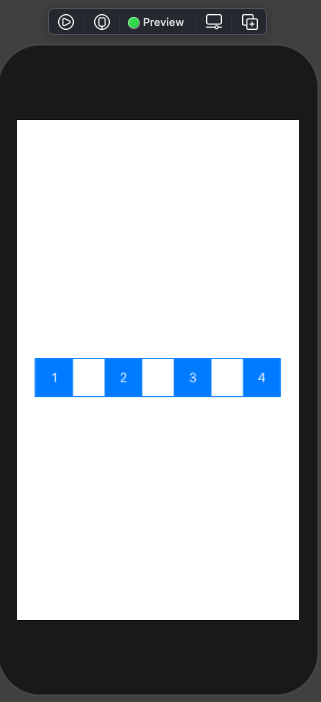
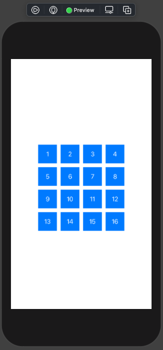
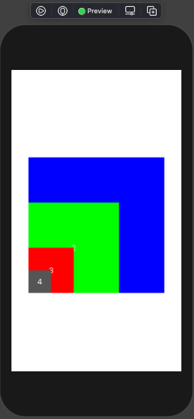
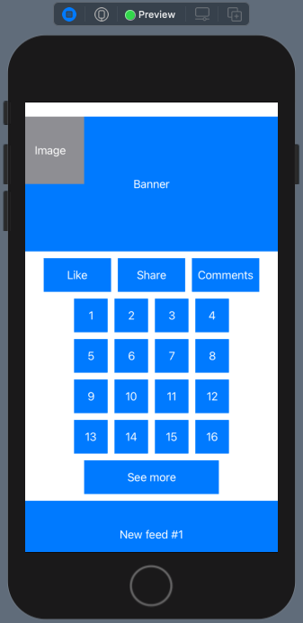
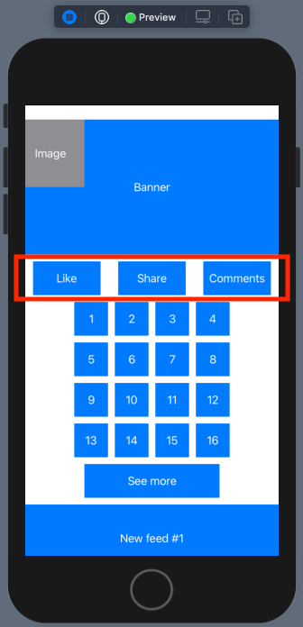

# 008 - Basic Layout

Bài viết này trình bày về cơ bản cách bố cục các view trong một màn hình bằng SwiftUI. Và mới tiêu chí:

> Mọi giao diện phức tạp thì cũng đều tạo thành từ cách phần giao diện đơn giản.

Do đó, ta cần phải nắm được tư tưởng và cách bố cục cơ bản để phân chia và tạo giao diện một cách hợp lý. Để bắt đầu thì cũng yêu cầu bạn có một số kiến thức nhất định về SwiftUI. Nên nếu bạn chưa tìm hiểu SwiftUI thì có thể đọc các bài notes khác trong chính repo này.

## Chuẩn bị

* Xcode 12
* Swift 5.3
* SwiftUI 2.0

Vẫn là những yêu cầu cơ bản cho version các tool chứ ta cần sử dụng. Về demo của bài viết thì không quá cầu kì. Để bắt đầu, bạn hãy tạo một project mới bằng SwiftUI.

Sau đó, bạn tạo thêm một Reusable View để tái sử dụng nhiều lần cho demo của chúng ta. Mình sẽ đặt tên là **ItemView** và code ví dụ như sau:

```swift
struct ItemView: View {
    
    var width: CGFloat = 200
    var height: CGFloat = 100
    var name = ""
    var backgroundColor: Color = .blue
    
    var body: some View {
        Text(name)
            .foregroundColor(Color.white)
            .frame(width: width, height: height, alignment: .center)
            .background(backgroundColor)
            .padding(.all, 1.0)
    }
}
```

Hiển thị một hình chữ nhật với màu nền mặc định là màu xanh. Ngoài ra, bạn có thể tuỳ chỉnh giá trị khởi tạo ban đầu  bằng cách thêm các tham số vào hàm khởi tạo.

```swift
ItemView(width: 100, height: 100, name: "Image", backgroundColor: .gray)
```

Thay vì nói lý thuyết nhiều thì hi vọng qua các demo sau bạn có thể hiểu được các cách bố cục cơ bản mà SwiftUI cung cấp.

> Nhân tiện là Autolayout hay xét `frame` của UIKit thì không còn nữa. Bạn hãy bắt đầu thay đổi suy nghĩ của mình với SwiftUI.

Nhưng ...  **Stacks** - Tương tự với UIStackView trong UIKit thì Stacks trong SwiftUI cũng có 3 loại:

- Ngang (HStack)
- Dọc (VStack)
- Depth-based (ZStack)

Bắt đầu tìm hiểu từng loại thôi.

## 1. VStack

Bạn tạo một file SwiftUI View mới và sử sử dụng Layout đầu tiên chính là **VStack**. Code ví dụ như sau:

```swift
struct DemoVStack: View {
    var body: some View {
        VStack {
            ItemView(name: "1")
            ItemView(name: "2")
            ItemView(name: "3")
            ItemView(name: "4")
        }
    }
}
```

Bạn hãy chờ một tý và thấy màn hình Preview sẽ xuất hiện giao diện như sau:



**VStack**:

* Các View con trong nó sẽ được bố trí theo hàng ngang
* Theo thứ tự từ trên xuống dưới
* Mặc định thì tất cả sẽ canh chính giữa
* Bạn có thể tuỳ biến thêm nhiều cho VStack

Tạm thời chúng ta xong về VStack. Tiến sang đối tượng tiếp theo nào.

## 2. HStack

Ta sẽ bắt đầu tương tự với VStack ở trên. Ta xem đoạn code ví dụ sau

```swift
struct DemoHStack: View {
    var body: some View {
        HStack(alignment: .center, spacing: 40) {
            ItemView(width: 50, height: 50, name: "1")
            ItemView(width: 50, height: 50, name: "2")
            ItemView(width: 50, height: 50, name: "3")
            ItemView(width: 50, height: 50, name: "4")
        }
    }
}
```

Xem kết quả hiển thị như thế nào?



Với **HStack** thì tương tự như VStack, nhưng sẽ bố cục theo hàng dọc và từ thứ tự từ trái sang phải.

Tiếp theo, ta tuỳ chỉnh một tí cho HStack như sau:

```swift
        HStack(alignment: .center, spacing: 40) {
            ItemView(width: 50, height: 50, name: "1")
            ItemView(width: 50, height: 50, name: "2")
            ItemView(width: 50, height: 50, name: "3")
            ItemView(width: 50, height: 50, name: "4")
        }
```

Xem kết quả nhoé!



Khoảng cách giữa các phần tử đã giãn ra nhiều rồi. Giờ ta thử kết hợp giữa

> VStack + HStack

Ví dụ code như sau:

```swift
        VStack {
            HStack {
                ItemView(width: 50, height: 50, name: "1")
                ItemView(width: 50, height: 50, name: "2")
                ItemView(width: 50, height: 50, name: "3")
                ItemView(width: 50, height: 50, name: "4")
            }
            HStack {
                ItemView(width: 50, height: 50, name: "5")
                ItemView(width: 50, height: 50, name: "6")
                ItemView(width: 50, height: 50, name: "7")
                ItemView(width: 50, height: 50, name: "8")
            }
            HStack {
                ItemView(width: 50, height: 50, name: "9")
                ItemView(width: 50, height: 50, name: "10")
                ItemView(width: 50, height: 50, name: "11")
                ItemView(width: 50, height: 50, name: "12")
            }
            HStack {
                ItemView(width: 50, height: 50, name: "13")
                ItemView(width: 50, height: 50, name: "14")
                ItemView(width: 50, height: 50, name: "15")
                ItemView(width: 50, height: 50, name: "16")
            }
        }

```

Với cách này thì bạn có một CollectionView như ở UIKit. Tuy khá là thô sơ nhưng cũng đầy đủ chức năng rồi. Thêm một vào `for` là xin sò thôi.



Okay, sang tiếp một loại Stack nữa nha.

## 3. ZStack

Đây là đối tượng Stack cuối, bạn xem tiếp ví dụ sau:

```swift
struct DemoZStack: View {
    var body: some View {
        ZStack(alignment: .bottomLeading) {
            ItemView(width: 300, height: 300, name: "1", backgroundColor: Color(.blue))
            ItemView(width: 200, height: 200, name: "2", backgroundColor: Color(.green))
            ItemView(width: 100, height: 100, name: "3", backgroundColor: Color(.red))
            ItemView(width: 50, height: 50, name: "4", backgroundColor: Color(.darkGray))
        }
    }
}
```

Kết quả hiển thị như sau:



Với **ZStack**:

* Các view con sẽ được xếp chồng lên nhau
* Thứ tự cuối cùng sẽ ở trên cùng

Phát huy hiệu quả khi bạn muốn view này đè view kia. Okay! Chúng ta chuyển sang loại Layout khác nữa.

## 4. ScrollView

Để hiển thị cho giao diện quá dài hơn so với hình hiển thị. Bạn phải dùng tới ScrollView. Bản chất thì nó giống như UIScrollView trong UIKit.

Code sử dụng cho một ScrollView đơn giản như sau:

```swift
ScrollView {
   // ...
}
.frame(maxWidth: .infinity, maxHeight: .infinity)
```

Trong đó:

* Bạn cần xác định kích thước của scroll thông qua modified `.frame`
* Để full màn hình với các kích thước thì ta sử dụng tham số  `.infinity`

## 5. Bố cục hỗn hợp

Bây giờ ta sử dụng hỗi hợp các bố cùng vào ScrollView để xem kết quả như thế nào. Ví dụ đoạn code sau:

```swift
ScrollView {
            ZStack(alignment: .topLeading) {
                ItemView(width: 400, height: 200, name: "Banner")
                ItemView(width: 100, height: 100, name: "Image", backgroundColor: .gray)
            }
            HStack {
                ItemView(width: 100, height: 50, name: "Like")
                ItemView(width: 100, height: 50, name: "Share")
                ItemView(width: 100, height: 50, name: "Comments")
            }
            VStack {
                HStack {
                    ItemView(width: 50, height: 50, name: "1")
                    ItemView(width: 50, height: 50, name: "2")
                    ItemView(width: 50, height: 50, name: "3")
                    ItemView(width: 50, height: 50, name: "4")
                }
                HStack {
                    ItemView(width: 50, height: 50, name: "5")
                    ItemView(width: 50, height: 50, name: "6")
                    ItemView(width: 50, height: 50, name: "7")
                    ItemView(width: 50, height: 50, name: "8")
                }
                HStack {
                    ItemView(width: 50, height: 50, name: "9")
                    ItemView(width: 50, height: 50, name: "10")
                    ItemView(width: 50, height: 50, name: "11")
                    ItemView(width: 50, height: 50, name: "12")
                }
                HStack {
                    ItemView(width: 50, height: 50, name: "13")
                    ItemView(width: 50, height: 50, name: "14")
                    ItemView(width: 50, height: 50, name: "15")
                    ItemView(width: 50, height: 50, name: "16")
                }
                ItemView(width: 200, height: 50, name: "See more")
            }
            VStack {
                ItemView(width: 400, height: 100, name: "New feed #1")
                ItemView(width: 400, height: 200, name: "New feed #2")
                ItemView(width: 400, height: 100, name: "New feed #3")
                ItemView(width: 400, height: 500, name: "New feed #4")
            }
        }
        .frame(maxWidth: .infinity, maxHeight: .infinity)
    }
```

Trong đó:

* Chính là một **ScrollView**, vì ta xác định View của chúng ta sẽ dài hơn kích thước màn hình
* Các View sẽ chia ra nhiều block
* Với block đầu tiên, ta có 2 View xếp chồng lên nhau thì ta sử dụng **ZStack**
* Tiếp theo sử dụng **HStack** để bố cục 3 view trên 1 hàng
* Block với dạng lưới thì kết hợp giữa **VStack + HStack**
* Cuối cùng là theo dạng **list** (danh sách), ta sử dụng VStack

Để thấy được toàn bộ giao diện hiển thị ta sử dụng Live Preview. Bạn sẽ thấy view của chúng ta sẽ scroll được.



Scroll nhẹ 1 phát nữa nha!


Bây giờ, bạn dư sức chiến đấu rồi nhoé!

## 6. Spacer

Cuối cùng, tuy nhỏ mà nó có võ. Đôi lúc đây là cách bạn sẽ bố cục giao diện nhanh và gọn nhất. Ta lấy đoạn code block với "Like Share Comments" trên và thay đổi 1 chút với **Spacer** nha.

```swift
            HStack {
                Spacer()
                ItemView(width: 100, height: 50, name: "Like")
                Spacer()
                ItemView(width: 100, height: 50, name: "Share")
                Spacer()
                ItemView(width: 100, height: 50, name: "Comments")
                Spacer()
            }
```

Ta chèn các **Spacer** vào giữa các View. Công dụng của nó sẽ giãn các View ra và canh đều các khoảng cách với nhau. Bạn xem kết quả như sau:



## Tam kết

* Họ hàng nhà Stack, sẽ bố cục các view theo các hướng
* **HStack** là một view chứa các view con được sắp xếp theo chiều ngang
* **VStack** là một view chứa các view con được sắp xếp theo chiều dọc
* **ZStack** là một view chứa các view con được sắp xếp theo chiều trục Z, hay nói các khác các view có thể đè lên nhau từng lớp
* **ScrollView** để hiển thị và cuộn với giao diện có kích thước lớn
* **Spacer** để cách đều và giãn cách các View trong View cha

---

Okay! Bài viết cũng khá là dài rồi và mình xin kết thúc tại đây. SwiftUI đúng là thật ảo diệu. Một lần nữa cảm ơn bạn đã đọc bài viết này!