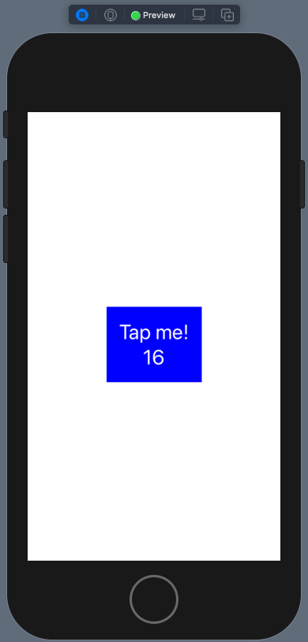
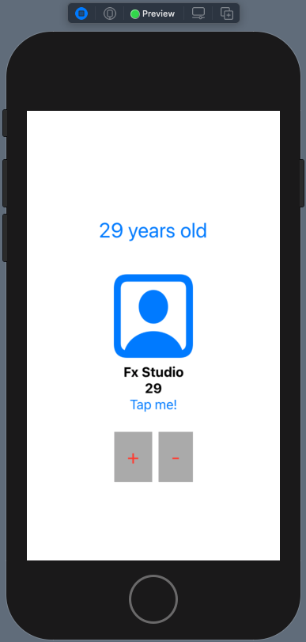
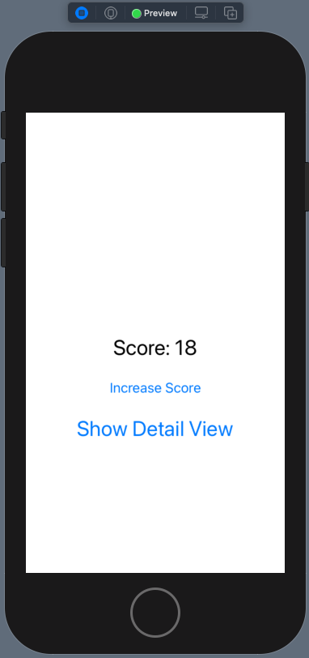
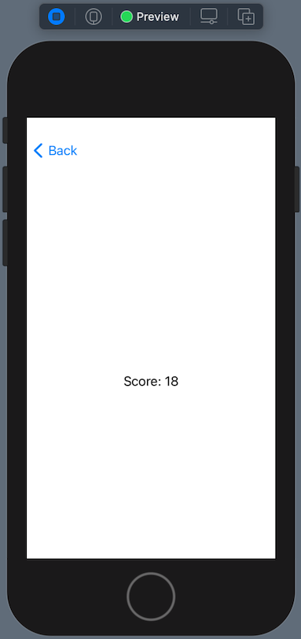
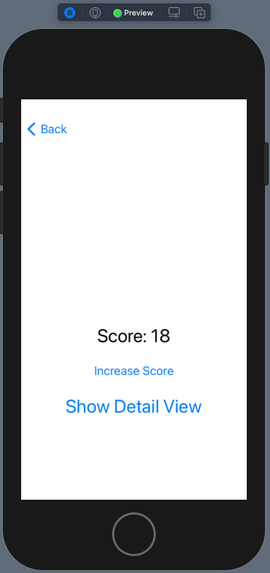
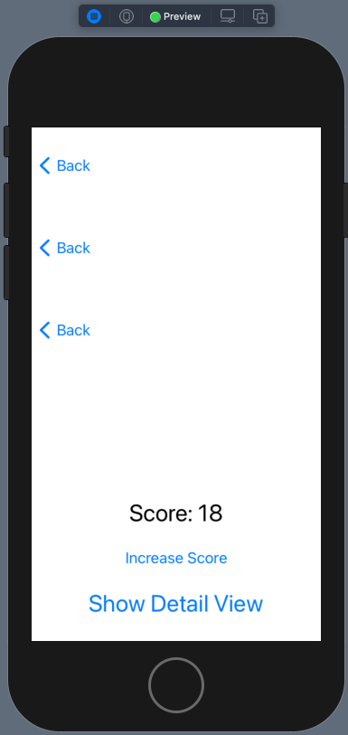

# 009 - Declaring Data

Chào các bạn, chúng ta lại tiếp tục với bài note trong phần Declarative App. Các phần trước ta đã đi qua các khái niệm lý thuyết, View, Layout. Bài viết lần này sẽ đi vào chủ đề là dữ liệu.

> Bắt đầu thôi!

## Chuẩn bị

* Xcode 12
* Swift 5.3
* SwiftUI 2.0

Về demo cho bài viết này, ta sẽ cần tạo mới một project với giao diện cực kì đơn giản. Chủ yếu tập trung vào luồng dữ liệu hoạt động như thế nào trong project với SwiftUI.

## 1. Declaring Data dependencies

Với SwiftUI, các ứng dụng của chúng ta đang phát triển thuộc thể loại Declarative App. Do đó, về luồng dữ liệu hoạt động trong App cũng phải thuộc trường phái Declarative Programming. Và bạn phải dần quên đi cách truyền/gán dữ liệu theo truyền thống. Và nếu như bạn đã biết về Reactive Programming thì đó là một lợi thế.

À, nếu bạn chưa biết về 2 thư viện Reactive Programming cho Swift hay iOS thì có thể tham khảo các bài viết sau:

* [Combine](https://fxstudio.dev/category/code/combine/)
* [RxSwift](https://fxstudio.dev/category/code/rxswift/)

Còn với SwiftUI, ta có 2 nguyên tắc hướng dẫn cách để quản lý luồng dữ liệu như sau:

### Data access = dependency

* Việc đọc dữ liệu sẽ đến từ view của bạn sẽ tạo ra mối quan hệ phụ thuộc giữa View & Data
* Mọi View được khởi tạo hay khai báo thì sẽ đi kèm với các dữ liệu phục thuộc. Nó có thể là các input hay state của View
* Khi dữ liệu phụ thuộc thay đổi, thì giao diện hiển thị của View sẽ tự động thay đổi theo

### Single source of truth

* Được xem là nguồn chân lý/sự thật. Nơi sẽ chứa dữ liệu của 1 View nào đó.
* Dữ liệu của 1 View có sẽ nguồn riêng của riêng nó hoặc đến từ một View biên ngoài khác.
* Bất kể nằm ở đâu thì nguồn này là duy nhất.
* Quản lý việc cập nhật lại giá trị của dữ liệu và gây ảnh hưởng lên 1 hoặc nhiều View có sự liên kết với nguồn này.

## 2. Property wrappers

> Cái tên của property wrapper cũng đã mang nhiều ý nghĩa, property wrapper là vỏ bọc của property. Về cơ bản, property wrapper là một cấu trúc dữ liệu, nó sẽ đóng gói property, và bổ xung thêm một vài chức năng cho property đó.
> Property wrapper có thể là dạng struct, class hoặc enum. Trước Swift 5.1, Swift đã có nhiều builtin wrappers như lazy, @NSCopying, và SwiftUI cũng có nhiều builtin wrappers như @State, @Binding,… Từ Swift 5.1 trở đi, chúng ta có thể viết thêm các custom property wrapper để phục vụ mục đích của mình

Ở trên là định nghĩa sơ lượt nhất về Property wrappers. Ta sẽ đề cập tới nó, vì SwiftUI sẽ sử dụng rất nhiều và thường xuyên các wrappers này trong code. Và phần được dùng nhiều nhất chính là Declaring Data này. Ta sẽ đi qua lần lượt các warppers như sau.

### @State

* Các biến tạo với wrapper `@State` thì sẽ thuộc chính View đó.
* Đây là một biến lưu trữ dữ liệu. Nên bạn cần cấp phát giá trị khi khai báo loại biến này
* Nó chỉ dùng có các giá trị kiểu `value type` đơn giản. Như: Int, Float, Double, String ...
* Khuyến cáo thì nên sử dụng `private` cho nó

### @Binding

* `@Binding` được sử dụng để khai báo một biến mà có sự phụ thuộc vào một biết `@State` từ một View khác.
* Sử dụng từ khoá `$` để gán giá trị cho biến Binding của View vào lúc View được khởi tạo.
* Đây là một biến tham chiếu đến dữ liệu. Do đó, bạn không cần cấp phát giá trị khởi tạo ban đầu cho nó.
* Tham chiếu này cho phép bạn có thể thay đổi giá trị của nguồn sự thật từ bất cứ View nào mà có cụ ràng buộc dữ liệu với nguồn.

### @ObservedObject

* Dùng để khai báo một biến với kiểu dữ liệu tham chiếu (class).
* Kiểu của biến (class type) phải implement giao thức ObservableObject
* Nó sẽ yêu cầu implement các thuộc tính `objectWillChange` để có thế phát dữ liệu thay đổi của nó đi. Từ khoá sẽ là `@Published` cho thuộc tính đó.

### @EnvironmentObject

* Khai báo sự phụ thuộc vào một số dữ liệu được chia sẽ (share data) cho toàn project.
* Giống như Singleton
* Các đơn giản nhất mà bạn có thể truyền dữ liệu đi bất cứ nơi nào. Mà không cần phải quan tâm tới việc truyền/gán/khởi tạo hay bắt buộc phải dùng chúng.

## 3. Value Type

### 3.1. Basic Type

Với kiểu dữ liệu giá trị (value type), chúng ta hay quen sử dụng như là Int, Float, Double ... Ta sẽ dùng `@State` để khai báo dữ liệu phụ thuộc cho View của mình. Bạn tham khảo code ví dụ sau:

```swift
struct ContentView: View {
    @State var count: Int = 0
    
    var body: some View {
        Button(action: {
            count += 1
        }, label: {
            Text("Tap me!\n\(count)")
                .font(.title)
                .foregroundColor(Color.white)
                .multilineTextAlignment(.center)
        })
        .padding()
        .background(Color(.blue))
    }
}
```

Ta khai báo thuộc tính `count` của ContentView với từ khoá `@State`. Tại đây, phần UI phụ thuộc vào đó chính là Text. Nó sẽ hiển thị giá trị của thuộc tính `count` đó. Quan trọng mọi thứ sẽ tự động cập nhật với nhau.

### 3.2. Struct

Một kiểu dữ liệu giá trị nữa đó là `struct`. Ta sẽ khai báo một Struct cơ bản. Nó được tạo thành từ các kiểu dữ liệu đơn giản như ở trên. Ta thêm khai báo thêm một Struct như sau:

```swift
struct Score {
    var count: Int = 0
}
```

Bạn hãy cập nhật lại thuộc tính `count` được khai báo ở trên, với kiểu giá trị mới là `Score`.

```swift
@Binding var item: Score
```

Tiến hành update lại một chút cho phần View.

```swift
    var body: some View {
        Button(action: {
            item.count += 1
        }, label: {
            Text("Tap me!\n\(item.count)")
                .font(.title)
                .foregroundColor(Color.white)
                .multilineTextAlignment(.center)
        })
        .padding()
        .background(Color(.blue))
    }
```

Chúng ta sẽ dùng `.count` và thay đổi giá trị của nó. Mặc dù là bạn thay đổi giá trị thuộc tính của một đối tượng Struct. Tuy nhiên, vì nó kiểu dữ liệu giá trị. Nên đối tượng không cập nhật lại giá trị cho thuộc tính, thay vào đó một vùng nhớ mới tạo ra. Với giá trị thuộc tính mới được cập nhật. Quan trọng cơ chế này giống như việc bạn sử dụng các kiểu dữ liệu cơ bản.

### 3.3. Binding

Thêm một chút nữa để kết thúc phần này là việc truyền dữ liệu đi. Hay còn nó cách khác là chúng ta sẽ sử dụng tới

> **Single source of truth**

Công việc của ta sẽ tạo thêm 1 View, mình chọn cái tên hơi chuối là `StateView`. Bạn tham khảo code của nó như sau:

```swift
struct StateView: View {
    @Binding var item: Score
    
    var body: some View {
        Button(action: {
            item.count += 1
        }, label: {
            Text("Tap me!\n\(item.count)")
                .font(.title)
                .foregroundColor(Color.white)
                .multilineTextAlignment(.center)
        })
        .padding()
        .background(Color(.blue))
    }
}
```

Trong đó:

* Bạn clone lại code ContentView ở trên, đưa nó vào StateView
* Thay từ khoá `@State` bằng `@Binding` cho thuộc tính `item`
* Ý nghĩa các View vẫn giống ở trên

Bạn quay về **ContentView**, thay đổi lại một chút cho `body` của nó như sau:

```swift
struct ContentView: View {
    @State var item: Score = Score()
    
    var body: some View {
        StateView(item: $item)
    }
}
```

Chú ý việc khởi tạo `StateView`, cần:

* Truyền giá trị cho thuộc tính của StateView là `item`
* Thêm từ khoá `$` để liên kết với nguồn dữ liệu chân lý `item`

Bạn bấm Live Preview và cảm nhận kết quả nha!



## 4. Reference type

Về kiểu dữ liệu, bên cạnh kiểu dữ liệu tham trị (value type) thì chúng ta còn kiểu dữ liệu tham chiếu (reference type). Với kiểu này thì áp dụng 2 nguyên tắc của **Declaring Data** sẽ hơi phức tạp hơn một chút. Bạn cần thêm một chút kiến thức của Combine vào đây thì mới dễ hiểu hơn. Và mình xin phép trình bày cơ bản cách sử dụng Reference Type trong SwiftUI.

### 4.1. Protocol ObservableObject

Một đối tượng là kiểu tham chiếu thì nó sẽ trở tới một vùng nhờ nào đó. Đối với cách tiếp cận Declarative App, chúng ta sẽ quan tâm tới việc thay đổi giá trị của vùng nhớ đó. 

Để bắt đầu, ta tạo một class mới có tên là **User**. Code ví dụ như sau:

```swift
class User: ObservableObject {
    @Published var name: String
    @Published var age: Int
    
    init(name: String, age: Int) {
        self.name = name
        self.age = age
    }
}
```

Trong đó:

* Bạn cần phải implement protocol `ObservableObject`. Có như vậy thì đối tượng của chúng ta mới có thể lắng nghe được từ bên ngoài.
* Tiếp theo, bạn xác định thuộc tính nào cho phép phát dữ liệu đi thì hãy khai báo thêm với từ khoá `@Published`
* Việc phát dữ liệu đi trước khi vùng nhớ của thuộc tính bị thay đổi. Chính là `objectWillChange`

### 4.2. @StateObject

Bạn tạo một View mới, đặt tên gì cũng được. Mình đặt tên là `DemoReferenceView` và code ví dụ như sau:

```swift
struct DemoReferenceView: View {
    
    @StateObject var user = User(name: "Fx Studio", age: 18)
    
    var body: some View {
        VStack {
            Text("\(user.age) years old")
                .font(.title)
                .foregroundColor(Color.blue)
                .padding()
            UserView(user: user)
                .frame(width: 100, height: 175)
                .padding()
            HStack{
                Button(action: {
                    user.age += 1
                }, label: {
                    Text("+")
                        .font(.title)
                        .foregroundColor(Color.red)
                        .padding()
                        .background(Color(.lightGray))
                })
                Button(action: {
                    user.age -= 1
                }, label: {
                    Text("-")
                        .font(.title)
                        .foregroundColor(Color.red)
                        .padding()
                        .background(Color(.lightGray))
                })
            }
        }
    }
}
```

Bạn tạm thời chưa cần quan tâm tới `UserView`. Trong đoạn code trên thì ta chú ý 2 điều.

* Thuộc tính `user` với khai báo `@StateObject`.

```swift
@StateObject var user = User(name: "Fx Studio", age: 18)
```

Nó cũng tương tự như `@State`. Nhưng lần này bạn có quyền dùng với các thuộc tính là kiểu tham chiếu và kiểu dữ liệu phức tạp hơn. Nó biến thuộc tính hay biến đó thành nguồn sự thật chân lý. Là nơi cho các View ràng buộc dữ liệu vào.

* Từ khoá `$` , ta không cần tới nó trong trường hợp này. Vì lẽ bản thân của thuộc tính đã là tham chiếu rồi.

```swift
UserView(user: user)
```

Ngoài ra, trong các action của Button thì ta sẽ thay đổi giá trị thuộc tính `age` của đối tượng `user`. Mục đích xem nó có ảnh hưởng tới hiển thị của UserView hay không.

### 4.3. @ObservedObject

Thay vì dùng `@Binding` để liên kết với dữ liệu phụ thuộc ở một View khác, ta sử dụng từ khoá `@ObservedObject`. Cũng tương tự như với Binding, lần này xác nhận thuộc tính của bản lắng nghe sự thay đổi từ nguồn sự thật chân lý. Và có một số chú ý sau:

* Dùng đối với kiểu dữ liệu tham chiếu và kiểu dự liệu custom
* Chỉ nhận được giá trị thay đổi của những thuộc tính nào có khai báo `@Published`
* Không cần gán giá trị ban đầu cho lúc khởi tạo thuộc tính
* Khi thay đổi giá trị từ một View, nó sẽ ảnh hưởng tới tất cả các View mà có ràng buộc với dữ liệu đối tượng đó

Ta sẽ tiến hành cài đặt nó vào trong UserView. Bạn hãy tạo file SwiftUI mới có tên là UserView. Code ví dụ như sau:

```swift
struct UserView: View {
    
    @ObservedObject var user: User
    
    var body: some View {
        VStack {
            Image(systemName: "person.crop.square")
                .resizable()
                .foregroundColor(.blue)
            Text(user.name)
                .fontWeight(.bold)
                .multilineTextAlignment(.center)
            Text("\(user.age)")
                .fontWeight(.bold)
                .multilineTextAlignment(.center)
            Button(action: {
                user.age += 1
            }) {
                Text("Tap me!")
            }
        }
    }
}
```

Ta cài đặt `@ObservedObject` cho thuộc tính `user` của UserView. Các View con của nó sẽ ràng buộc dữ liệu với các thuộc tính trong đối tượng `user`. Cuối cùng, action của Button sẽ thay đổi giá trị của thuộc tính và vẫn mục đích xem phạm vi ảnh hưởng của nó tới nhiều View.

Bạn hãy bấm Live Preview và kiểm tra kết quả.



Bạn hãy bình tĩnh và test cẩn thận nha. Phần này dễ sai, dễ cấu lắm. Ahihi!

## 5. Environment

Cuối cùng, bạn sẽ đến phần tổ chức và truyền dữ liệu đi khắp nơi trong project SwiftUI. Đó là các biến/thuộc tính với khai báo là `@EnvironmentObject`. Thao tác này của chúng ta hay còn được gọi là tự báo biến môi trường của riêng mình.

Chúng ta sẽ tiếp tục demo theo các bước để có thể hiểu hơn về chúng nó.

### 5.1. Setup

Bắt đầu, bạn sẽ cài đặt cho việc sử dụng tới các kiểu dữ liệu cho biến môi trường mới này. Mình sẽ tạo 1 class với tên là GameSetting. Đặc điểm của đối tượng này sẽ là duy nhất trong cả project. Mình tin chắc nếu vào bài toán thực tế thì bạn cũng chỉ cần 1 đối tượng duy nhất mà thôi. 

Bạn xem code ví dụ sau:

```swift
class GameSettings: ObservableObject {
    @Published var score = 0
}
```

À, cũng giống y với việc sử dụng tham chiếu trong Declaring Data. Đọc lại mục trên nếu bạn quên nha.

Tiếp theo, bạn tạo một View đơn giản. Mình gọi nó là ScoreView và code ví dụ của nó như sau:

```swift
struct ScoreView: View {
    @EnvironmentObject var settings: GameSettings
    
    var body: some View {
        Text("Score: \(settings.score)")
    }
}
```

Trong đó:

* Từ khoá `@EnvironmentObject` dùng để khai báo một thuộc tính là biến môi trường của một View
* Không cần gán giá trị ban đầu cho thuộc tính đó
* Mọi thứ bạn cài đặt vẫn giống như mọi khi

### 5.2. Implement

Việc cài đặt & sử dụng biến môi trường mới như sau. Trước hết, ta sẽ tạo ra một View ban đầu để là nơi khởi tạo các View và giá trị cần thiết. Mình đặt tên là GameView và code ví dụ như sau:

```swift
struct GameView: View {
    @StateObject var settings = GameSettings()

        var body: some View {
            NavigationView {
                VStack {
                    Text("Score: \(settings.score)")
                        .font(.title)
                    
                    Button(action: {
                        settings.score += 1
                    }, label: {
                        Text("Increase Score")
                            .padding()
                    })

                    NavigationLink(destination: ScoreView()) {
                        Text("Show Detail View")
                            .font(.title)
                    }
                }
                .frame(height: 200)
            }
            .environmentObject(settings)
        }
}
```

Theo nguyên tắc về nguồn sự thật chân lý, cho dù là một biến môi trường thì nó vẫn phải có và chỉ có duy nhất một nguồn mà thôi. Cũng vì là kiểu dữ liệu của Setting là tham chiếu (khai báo class), nên ta sử dụng từ khoá `@StateObject` cho thuộc tính `settings` của View.

```swift
@StateObject var settings = GameSettings()
```

Bạn vẫn sử dụng biến như bình thường và sử dụng ràng buộc dữ liệu với các view con của nó. Nhưng điểm đặc biệt, bạn chú ý tới việc khởi tạo của `ScoreView()`. Chúng ta không cần phải truyền đối số vào hàm khởi tạo của nó. Và các đơn giản là bạn chỉ cần gọi tới modifier `environmentObject(setting)` là ổn.

Quá đơn giản và hiệu quả. Bạn bấm Live Preview để kiểm tra kết quả nha.

* Ở GameView bấm tăng score vài lần



* Vào màn hình ScoreView xem giá trị score có đúng như ở bên ngoài không



### 5.3. Over and Over

Để khai thác thêm tính hiệu quả của `@EnvironmentObject` này. Bạn thử thay đổi một chút code của ScoreView như sau.

```swift
struct ScoreView: View {
    @EnvironmentObject var settings: GameSettings
    
    var body: some View {
        NavigationView {
            VStack {
                Text("Score: \(settings.score)")
                    .font(.title)
                
                Button(action: {
                    settings.score += 1
                }, label: {
                    Text("Increase Score")
                        .padding()
                })

                NavigationLink(destination: ScoreView()) {
                    Text("Show Detail View")
                        .font(.title)
                }
            }
            .frame(height: 200)
        }
        .environmentObject(settings)
    }
}
```

Thực chất, bạn copy lại code ở GameView sang ScoreView thôi à. Nhưng điểm cần chú ý đó là bạn lại gọi tới một ScoreView trong ScoreView. Nhưng điểm quan trọng là bạn truyền giá trị của biến môi trường xuyên qua rất nhiều View. Mục đích chính vẫn là xem việc sử dụng và cập nhật lại giá trị của biến sẽ ảnh hưởng như thế nào tới toàn bộ các View.

Bạn hãy bấm Live Preview và tận hưởng kết quả nào!

* Bạn vào lại ScoreView lần từ nhất và bắt đầu tại GameView mà sau khi nhấn tăng score vài lần



* Sau vài lần thử kích để vào ScoreView và kết quả hiển thị như hình dưới. Và giá trị của biến môi trường đã truyền qua các View một cách đồng nhất.



Okay, mọi View đều cập nhật đúng giá trị. Và bất cứ View nào cũng thay đổi được giá trị của biến môi trường. Ưu điểm chính của biến môi trường này là đơn giản và tiện lợi.

## Tạm kết

Quả thật là đau não với đám Declaring Data này. Ta có tóm tắt theo các Property Wrappers như sau:

* `@State` Sử dụng có các thuộc tính của View và kiểu dữ liệu đơn giản (Int, Float, String ...). Nên sử dụng `private` cho khai báo này.
* `@Binding` dùng để khai báo các thuộc tính mà ràng buộc dữ liệu với thuộc tính ở một View khác. Chính là nơi khai báo @State. Và gán bằng từ khoá `$`
* Sử dụng khai báo `@StateObject` dành cho các thuộc tính với kiểu dữ liệu tham chiếu để biến nó thành nguồn sự thật công lý. Và giá trị của nó sẽ ảnh hưởng tới các View mà ràng buộc dữ liệu với nó. 
* Class khai báo với `@StateObject` thì cần phải implement Protocol **ObservableObject**. Xác nhận rằng đối tượng của class sẽ lắng nghe được.
* Bạn muốn thuộc tính nào của class ObservableObject có thể lắng nghe được từ bên ngoài. Thì khai báo thêm `@Published` cho thuộc tính đó. Và khi thay đổi giá trị của đối tượng thì sẽ ảnh hưởng tới các View ràng buộc với chính nó.
* `@ObservedObject` dùng để khai báo thuộc tính của View mà thuộc tính đó sẽ liên kết với nguồn sự thật công lý (với kiểu tham chiếu) từ một View bên ngoài. Nơi mà biến/thuộc tính được khai báo với @StateObject.
* `@EnvironmentObject` tạo ra một thuộc tính là biến môi trường. Đây là các đơn giản và hiệu quả nhất để truyền dữ liệu đi quan nhiều View. Nó tương tự Singleton truyền thống. Và bạn không cần truyền đối số khi khởi tạo View. Đây là nguồn dữ liệu chia sẽ (share data).

---
Okay! Bài viết cũng khá là dài rồi và mình xin kết thúc tại đây. SwiftUI đúng là thật ảo diệu. Một lần nữa cảm ơn bạn đã đọc bài viết này!
