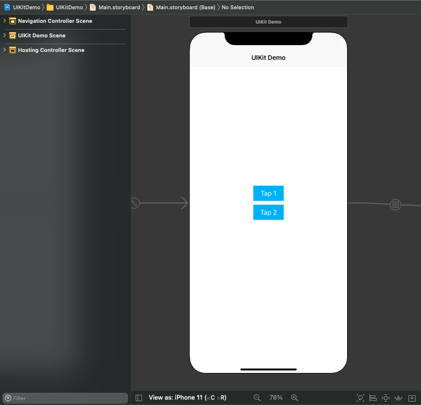
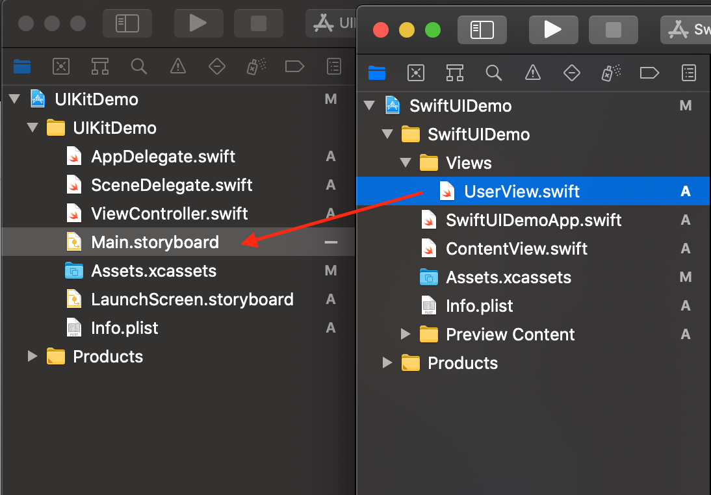
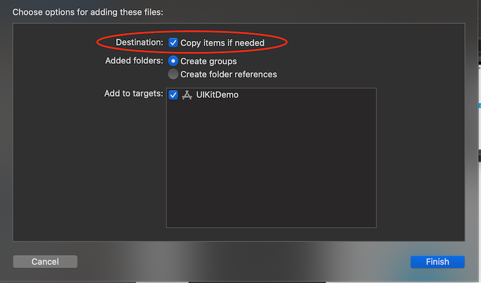
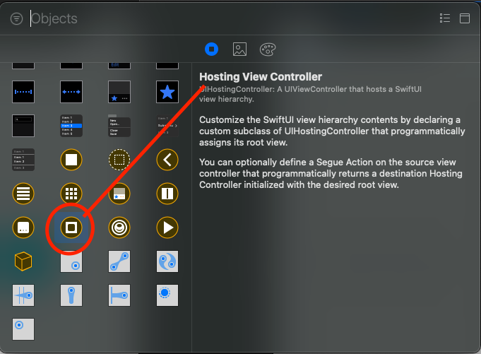
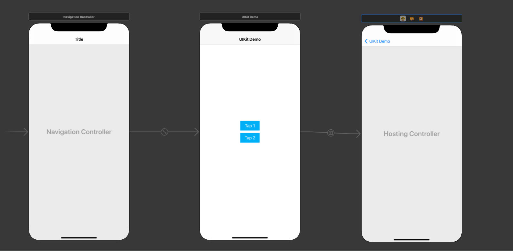
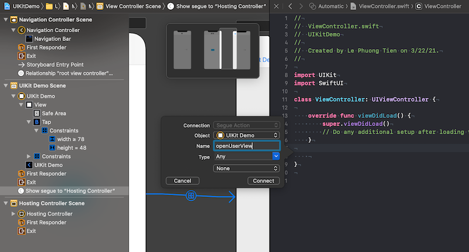
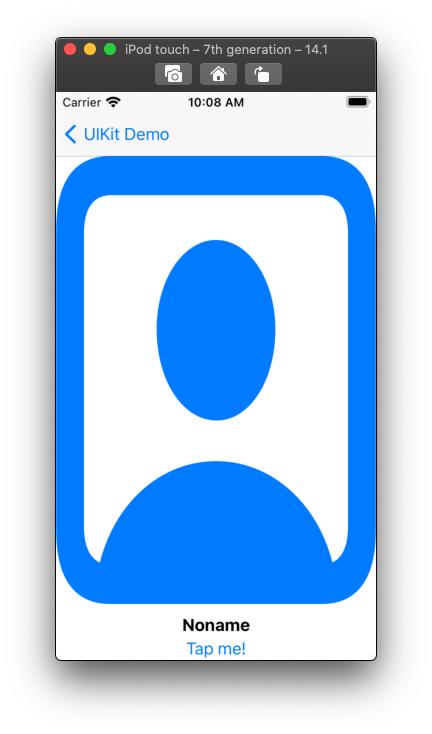

# 011 - SwiftUI in UIKit Project

Bắt đầu cho phần tích hợp giữa **SwiftUI & UIKit**, đó là việc sử dụng SwiftUI trong một Project của UIKit. Đối với ta thì việc này khá là dư thừa, nhưng ...

> Đời chưa biết được chữ ngờ.

Apple không bao giờ làm ta thất vọng. Như lần ra mắt Swift thì việc sử dụng cả hai ngôn ngữ vào trong một project lại càng đem lại sức mạnh to lớn. Và SwiftUI cũng vậy. Nó không những linh hoạt được trong mọi tình trường hợp, mà bạn vẫn còn có thể đem nó vào UIKit. SwiftUI sẽ hoạt động một cách mượt mà như bao UI Control khác của UIKit.

Bật Xcode lên và ...

> Bắt đầu thôi!

## Chuẩn bị

* Swift 5.x
* iOS 13.x

Vì lần này chúng ta sẽ dùng iOS Project với UIKit và để sử dụng được SwiftUI thì bắt buộc iOS phải là 13 (hoặc mới hơn).

Tiếp theo, bạn chuẩn bị một file SwiftUI. Tiết kiệm thời gian thì mình dùng lại code SwiftUI cho `UserView` huyền thoại từ những bài trước. Bạn tham khảo lại code của nó như sau.

```swift
import SwiftUI

struct UserView: View {    
    var name: String = "noname"
    
    var body: some View {
        VStack {
            Image(systemName: "person.crop.square")
                .resizable()
                .foregroundColor(.blue)
            Text(name)
                .fontWeight(.bold)
                .multilineTextAlignment(.center)
            Button(action: {
                print("Select: \(name)")
            }) {
                Text("Tap me!")
            }
        }
    }
}

```

Bạn cũng nên tạo một project SwiftUI với **UserView** trên, để có thể tái sử dụng lại cho các bài sau.

Cuối cùng, bạn tạo tiếp một project với UIKit. Giao diện đơn giản với **Storyboard**. Mình sử dụng giao diện với 2 Button như sau.



Vậy ta đã xong phần chuẩn bị. Bây giờ, chúng ta chuyển sang phần chính.

## 1. Add SwiftUI file

Hiện tại, mình đang có file `UserView.swift`, nó là một SwiftUI. Bạn tiến hành thêm nó vào Project bằng cách kéo thả vào navigator của Project. Xem hình sau nha.



Bạn nhớ là phải thật sự copy file vào project, đừng trỏ reference tới file. Nhằm tránh hậu hoạ sau này.



Quá EZ! Như vậy là bạn đã thêm được file SwiftUI vào UIKit Project rồi. Nhưng ...

> SwiftUI chỉ là code, nó không có `*.xib` như các View/View Controller của UIKit.

Để sử dụng với giao diện thì bạn tiến hành kéo thả một **UIHostingViewControll** ở file giao diện (*.xib hoặc storyboard)



File **StoryBoard** của chúng ta sẽ trông như thế này.



## 2. UIHostingController

Bạn tiến hành nối Button `Tap 1` với **UIHostingController** vừa mới kéo thả. Xác nhận nó là `push`. Sau đó, bạn kéo thả để tạo action xử lý thêm. Xem hình sau nha.



Việc này sẽ tạo ra một function là `@IBSegueAction` nó sẽ kết nối với **Segue** ở StoryBoard. Và trả về một **UIViewController**. Bạn chỉnh sửa lại code function như sau:

```swift
    @IBSegueAction func openUserView(_ coder: NSCoder) -> UIViewController? {
        let user = UserView() 
        return UIHostingController(coder: coder, rootView: user)
    }
```

Bạn cần **import** thêm SwiftUI thì mọi thứ mới hoạt động nha.

```swift
import SwiftUI
```

Vì là Project với UIKit, nên bạn không có Live Preview nha. Bạn sẽ phải bấm `run` và cảm nhận kết quả.



Quá đơn giản phải không? Thực tế thì tất cả SwiftUI view đều được nhúng trong **UIHostingController**, vì thế để nhúng SwiftUI vào UIKit, chỉ cần nhúng vào **UIHostingController** là xong. Ta tóm tắt lại công việc như sau:

- Bước 1: import SwiftUI framework
- Bước 2: tạo instance của UIHostingController với rootView là instance của SwiftUIView
- Bước 3: modal present instance của UIHostingController để hiển thị SwiftUIView

## 3. Passing Data

Nếu chỉ hiển thị đơn giản View từ SwiftUI lên trên UIKit, thì quả thật là vô vị. Bây giờ, ta sang phần khó hơn chút là truyền tải dữ liệu qua lại giữa SwiftUI & UIKit.

### 3.1. UIKit to SwiftUI

Chiều truyền dữ liệu đầu tiên là từ UIKit sang SwiftUI. Cái này khá là đơn giản, bạn chỉ cần

> Gán dữ liệu cho đối tượng SwiftUI được tạo ra.

Vì bản chất, bạn cần phải tạo ra một đối tượng SwiftUI. Nó cần hiển thị gì thì bạn có 2 cách sau:

* Truyền dữ liệu vào tham số của các function SwiftUI. Hay hàm khởi tạo
* Gán trực tiếp dữ liệu vào thuộc tính của các đối tượng SwiftUI

Ta thay đổi một chút code demo như sau:

* Tại file `UserView`, bạn thêm hàm khởi tạo và xoá đi việc gán dữ liệu cho thuộc tính `name`.

```swift
   var name: String
    
    init(name: String) {
        self.name = name
    }
```

Các này sẽ đảm bảo mọi thứ được riêng tư, đúng theo tính chất của hướng đối tượng trong lập trình.

* Tại file `ViewController` bạn chỉnh lại function `openUserView` như sau:

```swift
@IBSegueAction func openUserView(_ coder: NSCoder) -> UIViewController? {
        let user = UserView(name: "Fx Studio") 
        return UIHostingController(coder: coder, rootView: user)
    }
```

Bạn thêm giá trị `"Fx Studio"` cho tham số `name` lúc khởi tạo đối tượng UserView. Sau đó, bạn build lại project và cảm nhận kết quả nha.

### 3.2. SwiftUI to UIKit

Chiều truyền dữ liệu ngược lại thì sẽ hơi khó hơn. Bạn muốn truyền dữ liệu từ SwiftUI sang UIKit thì có thể sử dụng 2 cách sau:

* Protocol Delegate
* Closure call back

Với Protocol Delegate, mình sẽ không khuyến khích bạn sử dụng cái này. Vì nó là kiểu tham chiếu, nó sẽ kéo theo một loạt các thay đổi. Mình không dám chắc mọi thứ sẽ hoạt động trợ tru. Nhưng thôi không dùng tới nó cho chắc.

Chúng ta sẽ áp dụng cách khác, lai giữa 2 thao tác:

> Gán dữ liệu + call back

Đầu tiên, bạn mở file `UserView` thêm 1 alias và 1 thuộc tính như sau. Tiện thể cập nhật lại hàm `init` của nó.

```swift
    typealias Action = (String) -> Void
    
    var name: String
    var action: Action?
    
    init(name: String, action: @escaping Action) {
        self.name = name
        self.action = action
    }
```

Trong đó:

* Định nghĩa một Action là 1 closure
* Tạo một thuộc tính mới với kiểu là `Action?` , đặt tên là `action`
* Thêm `@escaping` vào trước tham số ở `init`. Để capture lại closure cho tiện sử dụng

Vì SwiftUI là View, nên thực sự cần truyền dữ liệu thì chỉ khi có sự tác động của người dùng vào nó. Trong demo chúng ta có thể lợi dụng sự kiện của `button`. Tại đó, bạn sẽ dùng thuộc tính `action` và truyền dữ liệu vào closure. Code ví dụ như sau:

```swift
var body: some View {
        VStack {
            Image(systemName: "person.crop.square")
                .resizable()
                .foregroundColor(.blue)
            Text(name)
                .fontWeight(.bold)
                .multilineTextAlignment(.center)
            Button(action: {
                print("Select: \(name)")
                if let action = action {
                    action(name)
                }
            }) {
                Text("Tap me!")
            }
        }
    }
```

Bạn chú ý tới đoạn `action` của Button nha. Nhờ kiểm tra xem nó có tồn tại hay không, vì ta đang sử dụng kiểu Optional. 

Tiếp theo, ta chuyển tới file `ViewControler` và update lại function `openUserView`. Code ví dụ như sau:

```swift
    @IBSegueAction func openUserView(_ coder: NSCoder) -> UIViewController? {
        let user = UserView(name: "Fx Studio") { (name) in
            print("UIKit > selected: \(name)")
        }
        return UIHostingController(coder: coder, rootView: user)
    }
```

Chỉ đơn giản, bạn thêm tiếp tham số `action` lúc khởi tạo UserView. Sau đó build lại project và tận hưởng kết quả thôi.

## 4. Naviagtion

Phần này, chỉ là phụ thôi. Nếu bạn không phải là người thích phong cách kéo thả với Storyboard. Thì sử dụng cách truyền thống để điều hướng từ UIKit sang SwiftUI. 

Bạn chỉ cần sử dụng lại `UIHostingController` làm cấu nối trung gian giữa SwiftUI và UIKit. Nó là một View Controller và bạn có thể sử dụng để `push` &  `pop` từ đối tượng `navigationController`.

Tham khảo code ví dụ cho xử lý action của button `Tap 2` như sau:

```swift
@IBAction func openUser2(_ sender: Any) {
        let user = UserView(name: "Fx Studio 2") { (name) in
            print("UIKit > selected: \(name)")
        }
        
        let vc = UIHostingController(rootView: user)
        
        self.navigationController?.pushViewController(vc, animated: true)
    }
```

Trong đó:

* Tạo một đối tượng UIHostingController với tên là `vc,` bằng việc xét `rootView` là một SwiftUI View
* Sử dụng `navigationController` để push `vc` kia vào.

Build lại project và tận hưởng kết quả.

## Tạm kết

* Thêm file từ SwiftUI vào UIKit Project
* Sử dụng UIHostingController để sử dụng SwiftUI View trong UIKit
* Passing Data giữa SwiftUI & UIKit
* Điều hướng đơn giản với ViewController tạo bằng SwiftUI View

---

Okay! Bài viết cũng khá là dài rồi và mình xin kết thúc tại đây. SwiftUI đúng là thật ảo diệu. Một lần nữa cảm ơn bạn đã đọc bài viết này!

