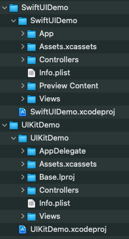
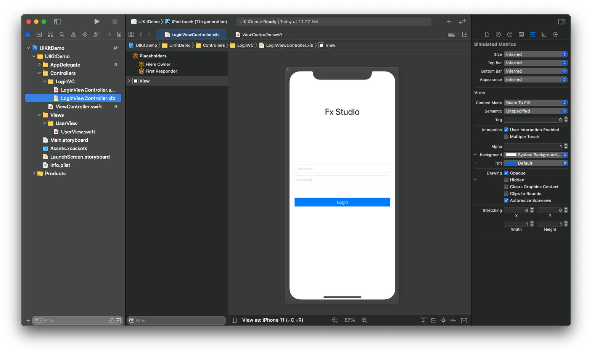
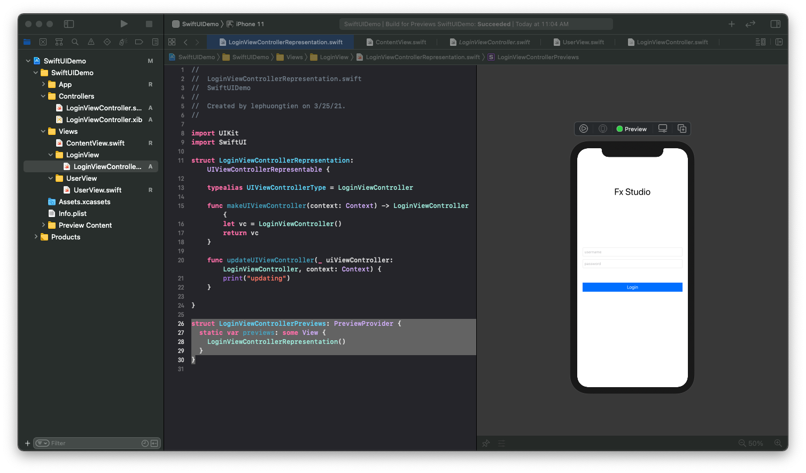
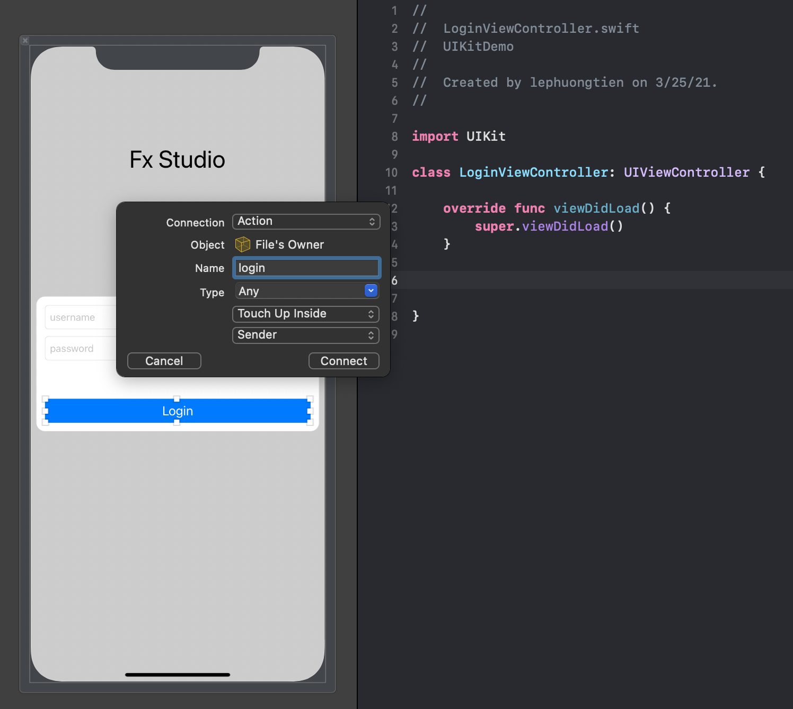

# 012 - UIKit in SwiftUI Project

Trong bài viết trước, chúng ta đã tìm hiểu cách đưa SwiftUI vào Project với UIKit. Công việc này khá là đơn giản. Bên cạnh đó chúng ta còn tìm hiều cách truyền tải dữ liệu giữa hai bên. Sang bài viết này, bạn sẽ được hướng dẫn cách ngược lại. Đó là **tích hợp UIKit vào SwiftUI Project**.

Nếu mọi việc đã ổn rồi, thì ...

> Bắt đầu thôi!

## Chuẩn bị

Về version cho các tool của chúng ta sẽ sử dụng làm demo như sau:

* MacOS 10.15.x
* iOS 13.x
* Swift 5.3
* SwiftUI 2.0

Như lần trước, ta có 2 project với 2 nền tảng là UIKit & SwiftUI. Bạn có thể xem qua cấu trúc thư mục như sau:



Mình cố tình tạo ra các thư mục như vậy để hai project có điểm tương đồng. Và mình sẽ dùng lại file **UserView** ở bài trước.

## 1. Add UIViewControler

Ở project UIKit, ta có một View Controller. Mình đặt tên là LoginViewController, với giao diện đơn giản. Bạn xem qua hình sau:



Việc đầu tiên, bạn cần phải làm đó là thêm file View Controller từ UIKit Project và SwiftUI Project. Nhiệm vụ của bạn vô cùng khó khăn. Bạn hãy kéo thả như hình sau.


Bạn thử xem có bị báo lỗi gì không. Nhất là các liên kết giữa giao diện (file *.xib) và code (file *.swift). 

### Tại sao?

Chắc bạn cũng phải thắc mắc là tại sao cần thực hiện công việc đưa các View Controller từ UIKit vào SwiftUI? Câu trả lời thì như sau:

> Tận dung lại cả 10 mấy năm phát triển của iOS.

Có quá nhiều thứ hay cần được tái sử dụng lại. Bạn có thể đem nguyên 1 ViewController trong dự án cũ và chuyển nó sang SwiftUI, mà không phải lo lắng gì hết.

Hoặc bạn chưa tự tin code SwiftUI, nhưng lại bị giao vào một dự án với SwiftUI. Vâng vâng và mây mây, nhưng đối với mình thì câu trả lời hay nhất là:

> Sử dụng được thế mạnh của cả hai.

Okay! chúng ta sẽ sang phần sử dụng View Controller mới thêm vào đó trong SwiftUI Project như thế nào.

## 2. UIViewControllerRepresentable

***<u>Lưu ý:</u>*** mình sẽ dụng **SwiftUI App - Life Cycle** cho Project với SwiftUI. Vì **UIKit AppDelegate Life Cycle** lại đi kèm với việc sử dụng UIViewController thì có gì đó sai sai. Không thoải mái.

> Đã máu rồi thì đừng hỏi bố cháu là ai.

Đầu tiên, chúng ta sẽ tìm hiểu định nghĩa của **UIViewControllerRepresentable** trước.

> **UIViewControllerRepresentable** là một ViewController của UIKit. Sử dụng điều cái này khi bạn muốn sử dụng UIViewController bên trong SwiftUI.

Để bất kỳ UIViewContoder nào có thể sử dụng được trong SwiftUI, hãy tạo một wrapper view kế thừa UIViewControllerRepresentable. Chi tiết có thể được tìm thấy trong bài [này](https://developer.apple.com/tutorials/swiftui/interfacing-with-uikit).

### 2.1. Create View

Bắt đầu, bạn hãy tạo thêm một file swift và đặt tên là `LoginViewControllerRepresentation`. Sau đó, bạn tiếp tục khai báo một `struct` như sau:

```swift
import UIKit
import SwiftUI

struct LoginViewControllerRepresentation: UIViewControllerRepresentable {
}

```

Struct **LoginViewControllerRepresentation** được xem là một SwiftUI View. Và cũng để tương đồng với phần còn lại của SwiftUI nên nó sẽ được khai báo bằng một **Value Type** (đó là struct). Và bạn cần:

* Import SwiftUI, vì bạn đang sử dụng SwiftUI nha.
* Implement protocol UIViewControllerRepresentable
  * Đây chính là struct sẽ giữ instance của MyViewController để tương tác với SwiftUI

Với việc sử dụng UIViewControllerRepresentable, thì bạn cần phải hoàn thiện khai báo với các function sau:

```swift
struct LoginViewControllerRepresentation: UIViewControllerRepresentable {

    typealias UIViewControllerType = LoginViewController
    
    func makeUIViewController(context: Context) -> LoginViewController {
        let vc = LoginViewController()
        return vc
    }
    
    func updateUIViewController(_ uiViewController: LoginViewController, context: Context) {
        print("updating")
    }
    
}
```

Trong đó:

- Tạo **typealias** UIViewControllerType là `LoginViewController`. Việc này sẽ giúp **LoginViewControllerRepresentation** hiểu được nó đang quản lý instance của class **LoginViewController**
- Function `makeUIViewController` khởi tạo instance của **LoginViewController**. Đây là function bắt buộc để conform UIViewControllerRepresentable protocol
- Function `updateUIViewController` cũng là function bắt buộc để conform UIViewControllerRepresentable protocol. Hàm này được gọi khi cần update ViewController lúc data bên SwiftUI có thay đổi. Ở đây chúng ta không cần update gì nên chỉ cần bỏ trống hàm này.

### 2.2. Preview

Một đặc sản không thể thiếu được của SwiftUI. Đó là **Preview**. Với UIViewController, bạn đã tạo một UIViewControllerRepresentable, thì tạo preview của nó cũng đơn gian hơn. Bạn xem đoạn code ví dụ như sau:

```swift
struct LoginViewControllerPreviews: PreviewProvider {
  static var previews: some View {
    LoginViewControllerRepresentation()
  }
}
```

Vẫn là struct **PreviewProvider** quen thuộc, bạn chỉ cần `return` đối tượng **LoginViewControllerRepresentation** mà thôi. Sau đó, bạn sẽ thấy xuất hiện khung hình Canvas. Tiếp theo, bạn bấm nút Resume để xem kết quả.



Nếu như không có lỗi gì xãy ra thì bạn là thành công thực hiện thêm một UIViewController vào SwiftUI rồi đó. Bây giờ, bạn có thể sử dụng nó như bao View bình thường khác của SwiftUI.

## 3. Navigation

Vấn đề tiếp theo cần được giải quyết đó là sự điều hướng trong project giữa các View. Nhưng lần này, chúng ta sẽ làm khác biệt đi một tí. Chúng ta sẽ điều hướng qua lại giữa SwiftUI và UIKit.

Ta sẽ chọn Naviagtion là đối tượng điều hướng. Với:

* SwiftUI sẽ là NavigationView & NavigationLink
* UIKit sẽ là UINavigationController

### 3.1. SwiftUI to UIKit

Hướng thứ nhất là bạn sẽ có một file SwiftUI View, sau đó bạn di chuyển tới một View khác là UIKit. Chúng ta sẽ thực hiện demo với file bắt đầu là **ContentView**. Code ví dụ như sau:

```swift
struct ContentView: View {
    var body: some View {
        NavigationView {
            VStack {
                NavigationLink("Login", destination: LoginViewControllerRepresentation())
            }
            .navigationTitle("SwiftUI Demo")
            .navigationBarTitleDisplayMode(.inline)
            .background(Color(.systemBackground))
        }
        .navigationViewStyle(StackNavigationViewStyle())
    }
}
```

Trong đó:

* NavigationView là đối tượng lớn nhất, nó bọc lại một VStack. Chúng ta sử dụng NaviagtionView với kiểu là `stack`
* VStack lúc này sẽ đại diện cho một màn hình như UIViewController của UIKit
* Bạn cần phải cấu hình thêm các thuộc tính cho phần NavigationBar (như là title, displayMode, Color ...) 

Cụ thể về NavigationView như thế nào thì bạn sẽ được biết ở các bài viết sau này. Hiện tại, chúng ta sẽ mặc định hiểu đơn giản như thế. Bạn chỉ cần clone lại code và thay đồi tuỳ biến các giá trị một chút.

Phần VStack, mình sử dụng một đối tượng là NavigationLink. Đối tượng này cầu:

* String cho title hiển thị
* `destination` là đích hiển thị tiếp theo. Nó chính là View mới tạo từ một UIViewController.

Tiếp theo là bấm **Live Preview** và tận hưởng kết quả nào.

### 3.2. UIKit to SwiftUI

Thực sự phần này không cần thiết, nhưng vì đam mê nên mình sẽ làm tiếp việc điều hướng từ UIKit sang SwiftUI. Tất nhiên, cả hai vẫn đang ở SwiftUI Project nhoé.

Bạn hãy mở file **LoginViewController** và kéo thả thêm 1 **IBAction** cho sự kiện của Button.



Chúng ta cần một cái cớ (sự kiện) để điều hướng sang màn hình khác. Và trong UIKit, IBAction là thứ sẽ đảm đương việc nhận sự kiện người dùng tại ViewController. Okay, bạn tham khảo code cho function `login` này nào.

```swift
    @IBAction func login(_ sender: Any) {
        let userView = UserView(name: "Fx Studio") { (name) in
            print("Selected : \(name)")
        }
        
        let vc = UIHostingController(rootView: userView)
        self.navigationController?.pushViewController(vc, animated: true)
    }
```

Đoạn code trên thì khá là quen thuộc và mình trình bày trong bài sử dụng SwiftUI trong UIKit Project rồi. Bạn cần:

* Sử dụng UIHostingController để là vật chứa cho một SwiftUI View
* `rootView` chính là đối tượng SwiftUI của bạn hay là màn hình bạn muốn điều hướng tới

Vì lúc này, bạn đang ở UIKit. Nên chúng ta sẽ sử dụng `navigationController` để điều hướng với việc gọi method `pushViewController` của nó.

Bạn hãy về lại **ContentView** và bấm **Live Preview**. Sau đó, bạn hãy test lại mọi tứ đầu & tận hưởng kết quả nhoé.

### 3.3. Change title

Cuối cùng, bạn sẽ làm đẹp thêm các màn hình/ViewController với nhiệm vụ thêm `title` cho NavigationBar. Cái này nói dễ thì cũng không là dễ đâu. Thậm chí còn rất là bực. Mình sẽ liệt kê một số vấn đề với việc đổi title như sau:

* Nó sẽ không xuất hiện khi bạn xét `title` trong file UIViewController ở `viewDidLoad`
* Title có thể hiển thị ra ở cả Màn hình thuộc UIKit & SwiftUI, nhưng sẽ có hiện tượng chớp.

Chúng ta sẽ giải quyết chúng.

#### 3.3.1. UIViewController

Như đã nói ở trên, bạn không thể hiện thị title bằng cách xét nó ở `viewDidLoad`. Cách để fix nó như sau:

```swift
    override func viewWillAppear(_ animated: Bool) {
        parent?.navigationItem.title = "Login"
    }
```

Bạn sử dụng `viewWillAppear` để thay đổi title. Và cần phải dùng tới đối tượng `parent` để thay đổi. Tuy nhiên, hiện tượng chớp sẽ xãy ra.

Vì:

* Chúng ta đang ở SwiftUI và mọi thứ là value Type
* View Controller lúc này được đại diện bởi một đối tượng **LoginViewControllerRepresentation**
* Cái mà được cập nhật chính là ở function `updateUIViewController` 

Để khắc phục việc chớp này, bạn sẽ phải thay đổi title tại một nơi khác. Nơi mà **LoginViewControllerRepresentation** được tạo ra.

Trong demo, bạn sẽ chỉnh sửa lại ở ContentView.

```swift
VStack {
                NavigationLink("Login", destination: LoginViewControllerRepresentation()
                                .navigationTitle("Login"))
            }
```

Bạn bấm **Live Preview** và tận hưởng kết quả thứ nhất này.

#### 3.3.2. SwiftUI View

View của SwiftUI mà muốn thay đổi title thì bạn sẽ dùng tới modifier `.navigationBarTitle`. Bạn mở file UserView lên và thêm modifier kia vào

```swift
    var body: some View {
        VStack {
            Image(systemName: "person.crop.square")
                .resizable()
                .foregroundColor(.blue)
            Text(name)
                .fontWeight(.bold)
                .multilineTextAlignment(.center)
            Button(action: {
                print("Select: \(name)")
                if let action = action {
                    action(name)
                }
            }) {
                Text("Tap me!")
            }
        }
        .padding()
        .navigationBarTitle("Profile", displayMode: .inline)
    }
```

Khi bạn bấm Live Preview và test lại. Hiện tượng chớp vẫn xãy ra. Điều này khá là đau đầu. Vì đối tượng quản lý điều hướng lúc này ở `navigationController` ở ViewController. Chứ không phải là NavigationView từ ContentView.

Bạn tiêps tục việc fix hiện tượng chớp như sau. Về lại file LoginViewController và chỉnh sửa thêm function `login` như sau:

```swift
    @IBAction func login(_ sender: Any) {
        let userView = UserView(name: "Fx Studio") { (name) in
            print("Selected : \(name)")
        }
        
        let vc = UIHostingController(rootView: userView)
        vc.navigationItem.title = "Profile"
        self.navigationController?.pushViewController(vc, animated: true)
    }
```

Bạn chỉ cần chú ý tới dòng lệnh ` vc.navigationItem.title = "Profile"` là okay. Lúc này, SwiftUI View sẽ không được sử dụng. Mà đối tượng sử dụng là UIHostingController, nó là một sub-class của UIViewController. Do đó, việc thay đổi title của màn hình sẽ thực hiện với việc thay đổi giá trị  thuộc tính của đối tượng kia.

Okay! Bạn hãy bấm Live Preview và tận hưởng kết quả lần cuối nào.

## Tạm kết

* Sử dụng **UIViewControllerRepresentable** để đưa UIViewController vào SwiftUI
* Cách điều hướng qua lại giữa SwiftUI & UIKit
* Cách thay đổi title cho màn hình với SwiftUI & UIKit

---

Okay! Bài viết cũng khá là dài rồi và mình xin kết thúc tại đây. SwiftUI đúng là thật ảo diệu. Một lần nữa cảm ơn bạn đã đọc bài viết này!

