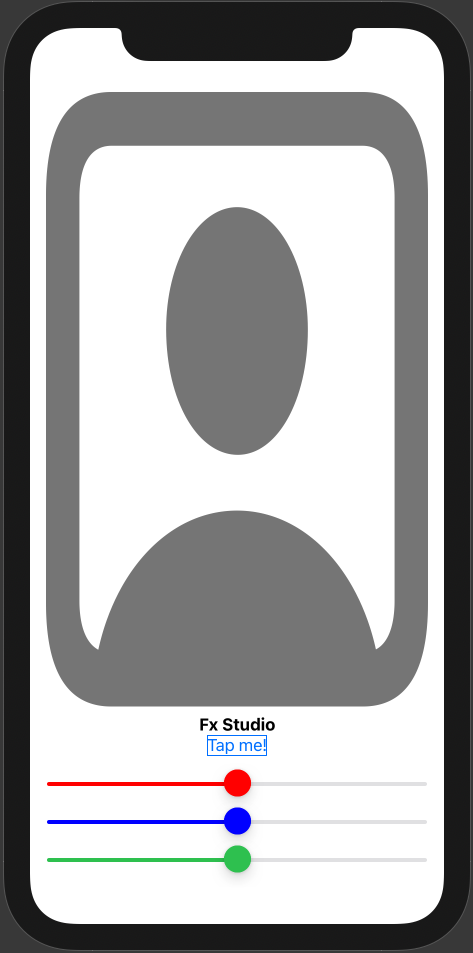
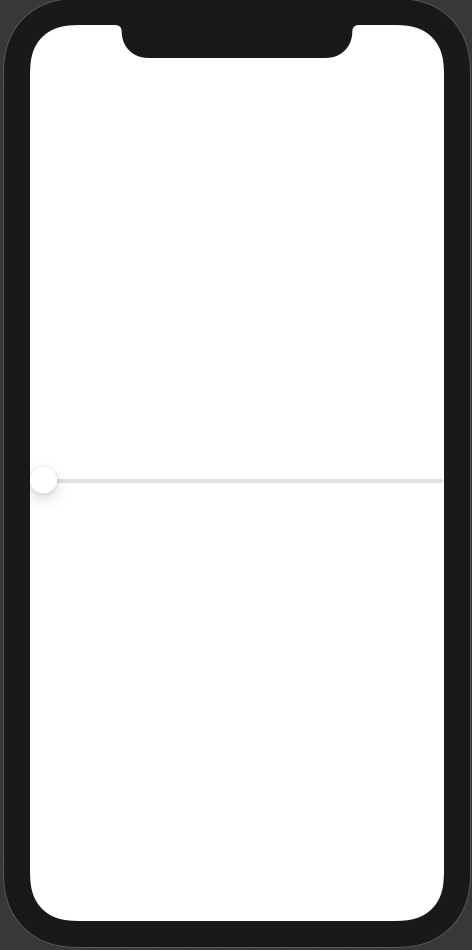
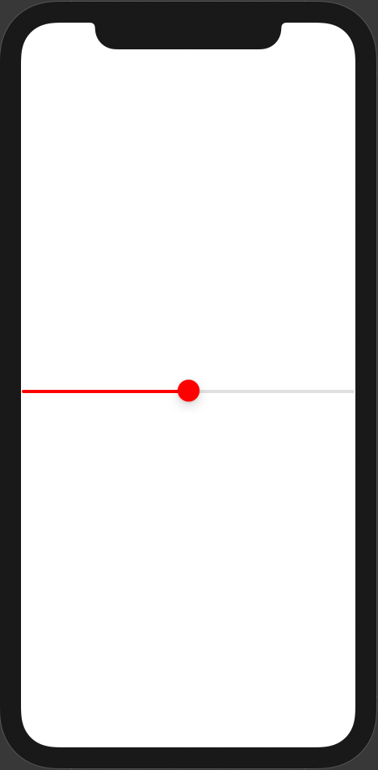
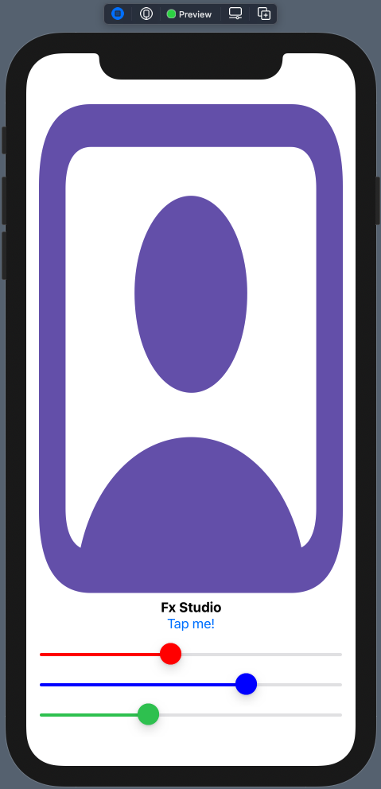

# 013 - UIView in SwiftUI Project

Chào bạn đến với bài notes của series SwiftUI đầy thú vị này. Ở bài notes trước, chúng ta đã học cách tích hợp UIViewController vào SwiftUI Project. Nhưng chúng ta còn thế lực cực kì đông và nguy hiểm nữa đó là các UI Control. Hay còn gọi với cái tên dân gian là UIView. Bài viết này sẽ trình bày cách tích hợp UIView vào SwiftUI Project.

Để dễ hiểu hơn thì chúng ta sẽ sử dụng lại kiến thức & project demo từ bài trước. Nếu bạn đã quên hay chưa biết thì có thể tìm đọc lại trong repo này. Còn nếu như mọi việc đã ổn rồi thì ...

> Bắt đầu thôi!

## Chuẩn bị

- MacOS 10.15.x
- iOS 13.x
- Swift 5.3
- SwiftUI 2.0

Ở trên, bạn có phiên bản cho từng tool, OS hay môi trường cần được sử dụng cho bài viết này. Ngoài ra, mình sẽ dùng lại project SwiftUI của bài trước. Do đó, bạn có thể checkout tại [đây](https://github.com/fx-studio/swiftui-notes/tree/main/010-SwiftUIVsUIKit).

Mình sẽ tiến hành phát triển **UserView** lên một tầm cao mới. Tiếp tục nào!

## 1. UIViewRepresentable

Như đã biết, muốn thêm một **UIViewController** thì chúng ta sử dụng tới protocol **UIViewControllerRepresentable**. Nhưng ngoài View Controller, chúng ta lại có rất nhiều các UI Control khác. Như UIButton, UITextField, UIDatePickerView ... Và một điều quan trọng là

> SwiftUI vẫn còn thiếu nhiều Control mà chúng ta hay sử dụng trong project.

Để khắc phục điều này thì việc sử dụng lại các Control của UIKit là một giải pháp khá là tốt. Và trong bài viết này chúng ta sẽ chỉ đề cập tới các UI Control cơ bản & được cung cấp sẵn trong iOS mà thôi. 

Về demo, ta sẽ tiến hành làm giao diện của UserView như hình bên dưới.



Thực chất SwiftUI đã cung cấp Control là Slider. Nhưng vì đam mê nên ta sẽ sử dụng UISlider của UIKit.

### 1.1. Create View

Bắt đầu, chúng ta sẽ một file SwiftUI View và đặt tên như sau `MyColorUISlider` (hơi dài một chút). Tiếp theo, ta tạo import các thư việc cần dùng.

```swift
import UIKit
import SwiftUI
```

Khai báo tiếp một struct cho View sử dụng trong SwiftUI. Ta đặt tên là **MyColorUISlider**. Code ban đầu như sau:

```swift
struct MyColorUISlider: UIViewRepresentable {
    typealias UIViewType = UISlider
    
    func makeUIView(context: Context) -> UISlider {
				let slider = UISlider(frame: .zero)
				return slider
    }
    
    func updateUIView(_ uiView: UISlider, context: Context) {
       
    }

}
```

Struct implement trực tiếp từ protocol **UIViewRepresentable**. Như bạn cũng đã tìm hiểu thì protocol này tương tự với **UIViewControllerRepresentable**. Nhưng lần này chúng ta sẽ dùng cho UIView và các sub-class UIView. Và bạn sẽ cần các thứ sau khi sử dụng nó.

* `typealias` cho UIViewType, bạn gán bằng `UISlider`. Khi khai báo định danh này thì cho các đối tượng của nó dễ confirm về kiểu cụ thể cho đối tượng UIView cần sử dụng.
* function `makeUIView` dùng để tạo ra một đối tượng UIView. Đây chính là nơi bạn cần code sinh ra đối tượng UIView.
* function `updateUIView` sẽ được gọi khi có sự cập nhật từ SwiftUI View lên đối tượng **Represention**. Mình sẽ sử dụng nó sau.

Và chỉ cần tạo ra một đối tượng UISlider tại `makeUIView` và return lại, thì bạn đã hoàn thành việc thêm 1 UI Cotrol từ UIKit vào SwiftUI Project rồi.

### 1.2. Preview View

Sang phần tiếp theo, chúng ta sẽ tạo thêm một struct dùng làm Preview cho đối tượng SwiftUI View mới tạo ở trên. Bạn tham khảo đoạn code sau:

```swift
struct MyColorUISlider_Previews: PreviewProvider {
    static var previews: some View {
        MyColorUISlider()
    }
}
```

Bạn bấm Resume và xem kết quả hiển thị nha.



Nhìn hơi xấu phải không nào. Chúng ta sang tiếp phần làm đẹp cho đối tượng SwiftUI View mới.

## 2. Update View

View đảm nhận hai nhiệm vụ chính, đó là:

* Hiển thị dữ liệu
* Nhận sự kiện người dùng

Với nhiệm vụ hiển thị dữ liệu, chúng ta lại có 2 nhiệm vụ con trong đó.

* Hiển thị dữ liệu ban đầu
* Cập nhập lại dữ liệu cho giao diện

Bạn yên tâm, mình sẽ giải quyết từng em một. 

### 2.1. Properties

Để hiển thị dữ liệu cung cấp ban đầu cho View. Chúng ta cần phải tạo ra các thuộc tính cho đối tượng View. Sau đó, tiến hành gián giá trị cho các thuộc tính đó. 

Về lại demo của chúng ta, bạn sẽ thêm các thuộc tính sau cho struct **MyColorUISlider**.

```swift
    var color: UIColor
    @Binding var value: Double
```

Trong đó:

* `color` dùng để xét màu cho thumbnail của Slider (cái núm tròn tròn xinh xinh của slider)
* `value` dùng để xác định giá trị của slide lúc khởi tạo. Vì nếu không xét giá trị, thì mặc định giống hình ở trên. Và `value = 0`
* Về `@Binding` thì mình sẽ trình bày ở phần tiếp theo trong bài viết.

Vì là khai báo struct, nên ta có thể không cần gán giá trị lúc khai báo thuộc tính. Tiếp theo, bạn sẽ tiến hành cập nhật lại function `makeUIView` như sau:

```swift
    func makeUIView(context: Context) -> UISlider {
        let slider = UISlider(frame: .zero)
        slider.value = Float(value)
        slider.thumbTintColor = color
        slider.tintColor = color

        return slider
    }
```

Thêm chút màu mè cho yêu đời. Bạn cũng phải cập nhật lại struct Preview, với các giá trị cho các tham số khi khởi tạo một đối tượng **MyColorUISlider**. Tham khảo code sau nha.

```swift
struct MyColorUISlider_Previews: PreviewProvider {
    static var previews: some View {
        MyColorUISlider(color: .red, value: .constant(0.5))
    }
}
```

Bạn bấn Resume và tận hưởng kết quả nào!



### 2.2. Add subview

Công việc tiếp theo đó là cập nhật lại giao diện khi dữ liệu có sự thay đổi. Chính xác là ta sẽ thay đổi `value` từ bên ngoài và đối tượng SwiftUI View mới sẽ tự động theo đổi theo. Và nó giúp đảm bảo đúng theo nguyên tắt Declarative Programming của SwiftUI

> Các truyền thống với UIKit. Sau khi thay đổi dữ liệu, bạn sẽ gán nó cho thuộc tính của đối tượng UIView.

 Đầu tiên là bạn về lại UserView. Và khai báo thêm 3 thuộc tính `@State` như sau:

```swift
    @State var redValue: Double = 0.5
    @State var blueValue: Double = 0.5
    @State var greenValue: Double = 0.5
```

Với `@State` thì ta có thể thay đổi giá trị từ của nó từ các View khác. Và các View ràng buộc dữ liệu với nó sẽ tự động cập nhật theo. Mình sẽ dùng 3 giá trị kia để tạo nên một đối tượng Color, dùng đối tượng đó để xét màu cho ảnh. Bạn xem code tham khảo sau

```swift
 Image(systemName: "person.crop.square")
                .resizable()
                .foregroundColor(Color(red: redValue, green: greenValue, blue: blueValue, opacity: 1.0))
```

Để thay đổi giá trị của 3 thuộc tính, ta sẽ sử dụng `action` của Button `Tap me!` và random giá trị. Và phạm vi random là từ 0.0 đến 1.0

```swift
            Button(action: {
                print("Select: \(name)")
                if let action = action {
                    action(name)
                }
                redValue = Double.random(in: 0...1)
                blueValue = Double.random(in: 0...1)
                greenValue = Double.random(in: 0...1)
                
            }) {
                Text("Tap me!")
            }
```

Cuối cùng là bạn hoàn thiện giao diện như hình chuẩn bị ở trên cùng. Bằng cách thêm 3 subview là 3 đối tượng **MyColorUISlider**.

```swift
VStack {
                MyColorUISlider(color: .red, value: $redValue)
                    .frame(maxWidth: .infinity)
                MyColorUISlider(color: .blue, value: $blueValue)
                    .frame(maxWidth: .infinity)
                MyColorUISlider(color: .systemGreen, value: $greenValue)
                    .frame(maxWidth: .infinity)
            }
```

Trong đó:

* VStack để sắp xếp chúng nó nằm ngang
* Mỗi đối tượng MyColorUISlider sẽ tương ứng với một thuộc tính `@State`
* Khai báo kèm với từ khoá `$` để xác nhận ràng buộc dữ liệu với View

Bạn xem lại toàn bộ code của UserView nha. Cho có cái nhìn tổng quát nhất.

```swift
struct UserView: View {
    typealias Action = (String) -> Void
    
    var name: String
    var action: Action?
    
    @State var redValue: Double = 0.5
    @State var blueValue: Double = 0.5
    @State var greenValue: Double = 0.5
    
    init(name: String, action: @escaping Action) {
        self.name = name
        self.action = action
    }
    
    var body: some View {
        VStack {
            Image(systemName: "person.crop.square")
                .resizable()
                .foregroundColor(Color(red: redValue, green: greenValue, blue: blueValue, opacity: 1.0))
            Text(name)
                .fontWeight(.bold)
                .multilineTextAlignment(.center)
            Button(action: {
                print("Select: \(name)")
                if let action = action {
                    action(name)
                }
                redValue = Double.random(in: 0...1)
                blueValue = Double.random(in: 0...1)
                greenValue = Double.random(in: 0...1)
                
            }) {
                Text("Tap me!")
            }
            VStack {
                MyColorUISlider(color: .red, value: $redValue)
                    .frame(maxWidth: .infinity)
                MyColorUISlider(color: .blue, value: $blueValue)
                    .frame(maxWidth: .infinity)
                MyColorUISlider(color: .systemGreen, value: $greenValue)
                    .frame(maxWidth: .infinity)
            }
        }
        .padding()
    }
}
```

Bấn Resume để xem kết quả có giống như ta tưởng tượng hay không.

### 2.3. Update Data

Sau khi đã setup xong phần dữ liệu của View cha và ràng buộc dữ liệu cho các View con (MyColorUISlider). Thì bạn sẽ hiểu rằng.

> Giá trị của thuộc tính trong View con sẽ tự động theo đổi theo. Mà ta không cần thiết phải gán lại giá trị cho nó.

Từ đó, ta phải đảm bảo việc giao diện của View con cũng phải tự động thay đổi luôn. Đó cũng là nhiệm vụ của chúng ta khi sử dụng UI Control của UIKit trong SwiftUI Project.

Bạn về lại file MyColorUISlider và chỉnh sửa function `updateUIView` như sau:

```swift
    func updateUIView(_ uiView: UISlider, context: Context) {
        print("updating")
        uiView.value = Float(self.value)
    }
```

Trong đó:

* Mọi thay đổi hay cập nhật từ SwiftUI sẽ triệu hồi function `updateUIView`
* `context` chính là đối tượng Represention
* Ta chỉ cần quan tâm tới `uiView`, nó là đối tượng UIView đang hiển thị.
* Vì `self.value` với `value` đã được khai báo là `@Binding` nên nó sẽ ràng buộc với thuộc tính `@State` bên ngoài. Khi thuộc tính `@State` thay đổi giá trị thì kéo theo `value` cũng theo đổi theo
* Bạn chỉ cần xét lại giá trị mới đó cho UIView là xong

Bạn về lại UserView và bấn Live Preview để xem kết quả. Thử kích vào Button `Tap me!` vài lần xem màu sắc của các Slider & ảnh có theo đổi theo không.



Nếu chúng nó tự động thay đổi rồi thì chúc mừng bạn hoàn thành việc cập nhật hiển thị cho các đối tượng UIView trong SwiftUI một cách **tự động.**

## 3. Coordinators

Chúng ta đã giải quyết được bài toán hiển thị dữ liệu cho View. Tiếp theo, ta sẽ giải quyết tiếp bài toán xử lý sự kiện người dùng. 

Khi người dùng tác động lên View, người dùng đó sẽ thay đổi một vài giá trị trên giao diện của View. Kéo theo giá trị thuộc tính liên quan tới phần thay đổi đó cũng bị thay đổi theo. Nhưng vấn đề là:

> Làm sao để SwiftUI View (khác) thấy được các giá trị thay đổi kia.

Như bạn cũng đã biết, các View của SwiftUI đều là khai báo struct. Do đó, nó không phải là tham chiếu và cộng thêm việc sử dụng Declarative Syntax. Kết hợp Combo bạn không dùng được closure & protocol từ 1 View.

Nếu bạn suy nghĩ tới Combine hay RxSwift thì đó là một giải pháp. Nhưng chúng ta sẽ để dành nó cho các bài viết sau. Tuy nhiên, SwiftUI không tận diệt bạn. SwiftUI View đã cung cấp thêm một khái niệm đó là **Coordinator**. Nó sẽ là:

* Đóng vai trò điều phối giữa kiểu tham chiếu (đối tượng UIView) và kiểu tham trị (đối tượng SwiftUI View)
* Tiếp nhận các sự kiện của người dùng trên UIView & bao gồm luôn các Delegate & Datasource

Mà bạn chỉ cần quan tâm 1 chiều là làm sao để nhận được sự thay đổi dữ liệu thôi. Còn việc cập nhật thì ta đã có nguồn sự thật chân lý với `@State` & `@Binding` lo rồi.

### 3.1. Create Coordinator class

Bước đầu tiên, bạn cần tạo một class là `Coordinator` ở bên trong class UIViewRepresentable kia. Bạn tham khảo code của nó như sau:

```swift
class Coordinator: NSObject {
        var parent: MyColorUISlider

        init(_ parent: MyColorUISlider) {
            self.parent = parent
        }
    }
```

Trong đó:

* Ngoài việc implement `NSObject` để có thể sử dụng được các function với khai báo `@objc`. Thì bạn còn có thể implement các protocol Delegate & DataSource của đối tượng UIView kia
* `parent` trỏ tới đối tượng SwiftUI View. Trong demo ta dung kiểu MyColorUISlider
* `init` thì gán giá trị cho thuộc tính thôi

Và khi bạn khai báo class Coordinator trong MyColorUISlider thì bạn cần phải thêm một function có tên là `makeCoordinator`. Bạn tiếp tục tham khảo code như sau:

```swift
    func makeCoordinator() -> Coordinator {
        Coordinator(self)
    }
```

Như vậy là bạn đã xong việc tạo class Coordinator bên trong một SwiftUI View rồi.

### 3.2. Action

Tiếp theo, chúng ta sẽ bắt sự kiện người dùng. Đối với đối tượng UISlider thì chúng ta sẽ bắt các sự kiện làm thay đổi giá trị `value` của nó. Bạn xem code thay khảo sau tại function `makeUIView`

```swift
    func makeUIView(context: Context) -> UISlider {
        let slider = UISlider(frame: .zero)
        slider.value = Float(value)
        slider.thumbTintColor = color
        slider.tintColor = color

        // target
        slider.addTarget(context.coordinator, action: #selector(Coordinator.updateColorUISlider(_:)), for: .valueChanged)
        
        return slider
    }
```

Tại `makeUIView`, chúng ta sẽ khai báo hết tất cả những gì cần thiết, kể cả các action của người dùng. Với việc thêm một `target` cho UISlider, bạn chú ý:

* kiểu action là `valueChanged`
* Action sẽ được truyền về Coordinator và function tiếp nhận là `updateColorUISlider`

Bạn sẽ khai báo thêm một function `updateColorUISlider` trong class Coordinator và xử lý tại đó.

```swift
        @objc func updateColorUISlider(_ sender: UISlider) {
         parent.value = Double(sender.value)
        }
```

Mọi thứ không có gì khó hết, bạn chỉ cần chú ý tới `parent.value`. Vì sender chính là đối tượng UIView mà được truyền trong sự kiện. Cộng với việc thuộc tính `value` được khai báo với wrapper `@Binding`. Thì mọi thứ sẽ được tự động cập nhật theo nguyên lý **nguồn sự thật chân lý**. Ahihi!

Bạn về lại file UserView và bấm Live Preview. Sau đó, bạn thử kéo các slider để xem màu sắc có thay đổi theo hay không. Và các View có ràng buộc dữ liệu cũng có thay đổi theo hay không?

## Tạm kết

* Sử dụng UIViewRepresentable để sử dụng các UIKit View vào SwiftUI Project
* Cập nhật dữ liệu với các wrapper `@State` & `@Binding` cho các thuộc tính của View
* Tạo Coordinator để điều phối các sự kiện người dùng & delegate của UIView cho SwiftUI View

---

Okay! Bài viết cũng khá là dài rồi và mình xin kết thúc tại đây. SwiftUI đúng là thật ảo diệu. Một lần nữa cảm ơn bạn đã đọc bài viết này!

