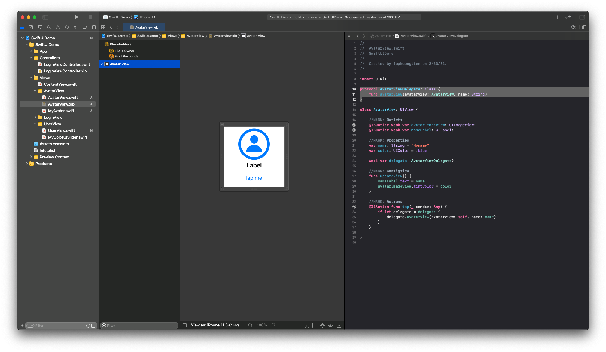
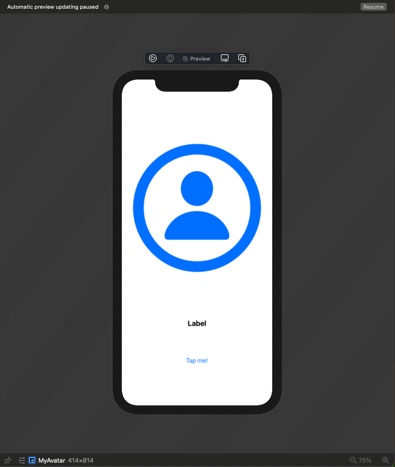
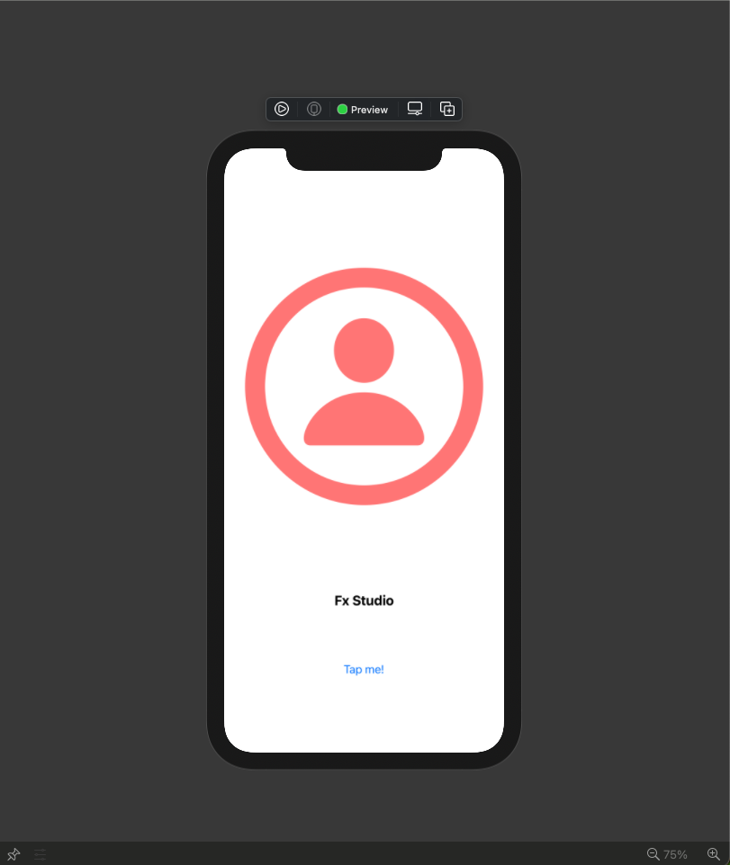
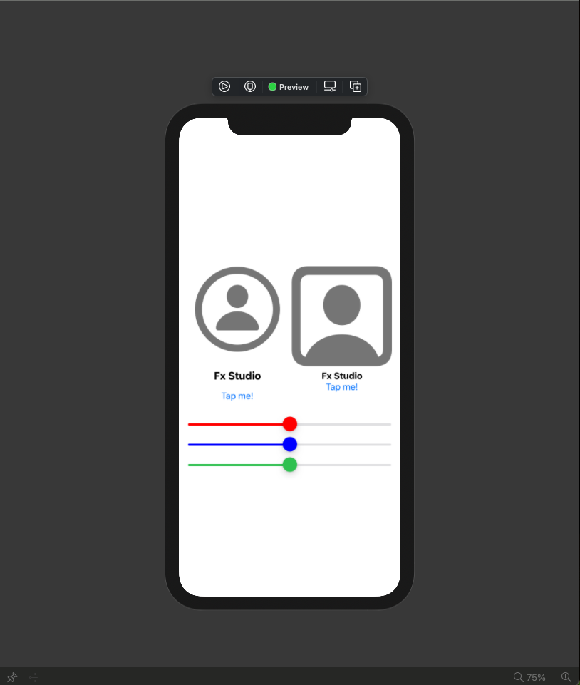
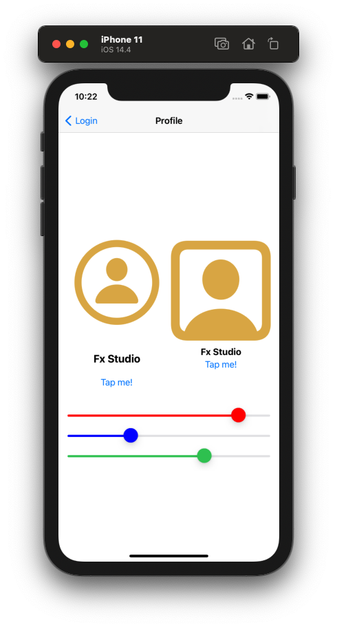

# 014 - Custom UIView in SwiftUI Project

Chúng ta đã biết các tích hợp **UIViewController & UIView** vào trong SwiftUI Project. Tuy nhiên, hai đối tượng mà chúng ta đã sử dụng thì là những đối tượng & UI Control được iOS cung cấp. Do đó, để giúp bạn có cái nhìn tổng quát hơn nữa với đối tượng thứ 3 trong thế giới UIView. Đó là Custom View của UIKit & tích hợp nó vào SwiftUI Project.

Nếu bạn chưa biết về các phần trên thì bạn có thể tìm đọc lại tại repo này. Và nếu mọi việc đã ổn rồi thì ...

> Bắt đầu thôi!

## Chuẩn bị

Về môi trường và các phiên bản cần sử dụng thì vẫn giống từ bài viết trước.

- MacOS 10.15.x
- iOS 13.x
- Swift 5.3
- SwiftUI 2.0

Và vẫn là project demo từ bài trước. Chúng ta sẽ tiếp tục nâng cấp chúng bằng việc thêm một Custom cho UIView. Bạn có thể checkout project tại [đây](https://github.com/fx-studio/swiftui-notes/tree/main/010-SwiftUIVsUIKit).

## 1. Create a Custom UIView

Bắt đầu, bạn cần có một Custom UIView. Bạn có thể tạo View này ở UIKit Project hoặc ở SwiftUI Project đều được. Xcode của Apple vẫn bá đạo như ngày nào, nó cho phép bạn có thể sử dụng cả 2 hay nhiều nền tảng của Apple vào cùng một project.

### 1.1. Create View

Về giao diện của Custom UIView này thì mình làm cực kì đơn giản. Bạn hãy tạo một file Swift + *.xib với giao diện như hình sau:



Đặt tên là AvatarView. Bạn xem code của nó như sau:

```swift
import UIKit

class AvatarView: UIView {
    
    //MARK: Outlets
    @IBOutlet weak var avatarImageView: UIImageView!
    @IBOutlet weak var nameLabel: UILabel!
    
    //MARK: Properties
    var name: String = "Noname"
    var color: UIColor = .blue
        
    //MARK: ConfigView
    func updateView() {
        nameLabel.text = name
        avatarImageView.tintColor = color
    }
    
    //MARK: Actions
    @IBAction func tap(_ sender: Any) {
       // code here
    }
    
}
```

Trong đó:

* AvatarView là một class. Khác với các SwiftUI View là các struct
* 2 thuộc tính sẽ dùng nhận dữ liệu với bên ngoài là `name` và `color`
* View nhận sự kiện của người dùng tại function IBAction `tap`

Mục đích cho Custom UIView này dùng:

* Nhận dữ liệu truyền từ các SwiftUI View khác
* Gởi sự kiện người dùng cho các SwiftUI View

### 1.2. Protocol

Về việc truyền dữ liệu (passing data) từ Custom UIView cho các đối tượng khác, thì bạn có rất nhiều cách sử dụng. Mình sẽ liệt kê như sau:

* Protocol
* Callback closure
* Notification
* UserDefault
* ...

Trong demo này mình sẽ chọn Protocol vì nó là hiệu quả nhất trong mô hình của Declarative App với SwiftUI. Bạn tiếp tục tạo thêm một Protocol Delegate như sau:

```swift
protocol AvatarViewDelegate: class {
    func avatarView(avatarView: AvatarView, name: String)
}
```

Tại AvatarView, bạn thêm thuộc tính `delegate`. Cần lưu ý cho thuộc tính này:

* `weak` để tạo liên kết yếu tránh chiếm giữ bộ nhớ

```swift
weak var delegate: AvatarViewDelegate?
```

Sử dụng delegate tại IBAction `tap`.

```swift
    @IBAction func tap(_ sender: Any) {
        if let delegate = delegate {
            delegate.avatarView(avatarView: self, name: name)
        }
    }
```

Vì là Optional nên cần phải sử dụng `if let` để unwrrap nó một cách an toàn. Nhiều bạn dev iOS thường hay sử dụng dấu `?` hoặc `!`, tuy nhiên nó sẽ là nguyên nhân tiềm tàng gây crash ứng dụng. Chịu khó tí vẫn hơn!

## 2. UIViewRepresentable with Custom UIView

Chúng ta đã có một Custom UIView, công việc tiếp theo sẽ là tạo một SwiftUI View từ Custom UIView đó. Và Custom UIView thực chất là sub-class của UIView. Do đó, bạn có thể sử dụng tới protocol **UIViewRepresentable** để tiến hành đưa Custom UIView vào SwiftUI Project.

### 2.1. Create Representation

Bắt đầu phần này bằng việc tạo một file SwiftUI View mới và implement protocol **UIViewRepresentable**. Mình sẽ đặt tên là **MyAvatar**. Code tham khảo như sau:

```swift
struct MyAvatar: UIViewRepresentable {
    
    typealias UIViewType = AvatarView
    
    func makeUIView(context: Context) -> AvatarView {
        let avatarView = Bundle.main.loadNibNamed("AvatarView", owner: nil, options: nil)?.first as! AvatarView
        
        return avatarView
    }
    
    func updateUIView(_ uiView: AvatarView, context: Context) {
        print("updating")
    }
}
```

Vẫn là những thành phần quen thuộc cho **UIViewRepresentable**, trong đó:

* Typealias với **AvatarView**, giúp cho việc xác định cụ thể kiểu của đối tượng UIKit được sử dụng
* Tại function `makeUIView` bạn cần tạo đối tượng Custom UIView và `return` nó về. Ta sử dụng phương pháp `loadNibName` truyền thống cho Custom UIView
* Function `updateUIView` dùng để cập nhất lại đối tượng UIView khi có sự thay đổi từ bên ngoài.

### 2.2. Preview

Preview là đặc sản của SwiftUI và chúng ta cũng nên tạo ra nó cho đối tượng View trên. Mục đích bạn có thể xem giao diện một cách trực quan.

Bạn tạo tiếp struct cho Preview này như sau:

```swift
struct MyAvatar_Preview : PreviewProvider {
    static var previews: some View {
        MyAvatar()
    }
}
```

Lúc này phần Cavas sẽ hiện ra. Bạn hãy bấm Resume để xem kết quả nào.



### 2.3. Update UIView

Cơ bản thì bạn đã có một Custom UIView và một SwiftUI View tạo ra từ Custom UIView đó. Tiếp tục, bạn cần tạo thêm các thuộc tính để nhận các giá trị từ bên ngoài và cho View hiển thị.

Bạn mở MyAvatar lên và thêm các thuộc tính sau:

```swift
    var name: String
    var color: UIColor {
        UIColor(red: CGFloat(redValue), green: CGFloat(greenValue), blue: CGFloat(blueValue), alpha: 1.0)
    }

    @Binding var redValue: Double
    @Binding var blueValue: Double
    @Binding var greenValue: Double
```

Trong đó:

* `name` & `color` là các thuộc tính để dùng tương tác với đối tượng Custom UIView của UIKit
* các thuộc tính với khai báo `@Binding` dùng để liên kết dữ liệu với các đối tượng SwiftUI View từ bên ngoài. Nó sẽ tự động cập nhật giá trị mới

Bạn tiếp tục cập nhật các function chính của SwiftUI View này.

```swift
    func makeUIView(context: Context) -> AvatarView {
        let avatarView = Bundle.main.loadNibNamed("AvatarView", owner: nil, options: nil)?.first as! AvatarView
        
        avatarView.name = name
        avatarView.color = color
        avatarView.updateView()
        
        return avatarView
    }
    
    func updateUIView(_ uiView: AvatarView, context: Context) {
        print("updating")
        uiView.name = name
        uiView.color = color
        uiView.updateView()
    }
```

Về giải thích thì mình đã giải thích nhiều rồi và tóm tắt thì như sau:

* Tại `makeUIView` cần các giá trị ban đầu cho việc khởi tạo một UIView
* Tại `updateUIView` thì sẽ cập nhật lại các giá trị (đã thay đổi từ bên ngoài) của đối tượng UIView thông qua tham số `uiView`

Việc thêm các thuộc tính cho đối tượng SwiftUI View này dẫn tới bạn phải cập nhật lại Preview. Khởi tạo lại đối tượng MyAvatar với các đối số cần thiết.

```swift
struct MyAvatar_Preview : PreviewProvider {
    static var previews: some View {
        MyAvatar(name: "Fx Studio", redValue: .constant(1.0), blueValue: .constant(0.5), greenValue: .constant(0.5))
    }
}
```

Trong đó, khai báo `.constant(_)` dùng để đưa dữ liệu cho các thuộc tính với khai báo là `@Binding`. Bạn bấm lại nút Resum và tận hướng kết quả nha.



## 3. Coordinator with Protocol

Với function `updateUIView` , ta có thể truyền dữ liệu từ ngoài cho đối tượng UIView. Còn chiều ngược lại từ đối tượng UIView để truyền ra ngoài thì chúng ta phải sử dụng tới **Coordinator**. Nó được xem là đối tượng trung gian để kết nối SwiftUI View (Representation) với UIView.

### 3.1. Create class

Bắt đầu, ta cần tạo class Coordinator ở bên trong struct SwiftUI View kia. Bạn xem code sau sẽ hiểu:

```swift
class Coordinator: NSObject, AvatarViewDelegate {

        var parent: MyAvatar

        init(_ parent: MyAvatar) {
            self.parent = parent
        }

        //MARK: Delegate
        func avatarView(avatarView: AvatarView, name: String) {
            parent.redValue = Double.random(in: 0...1)
            parent.blueValue = Double.random(in: 0...1)
            parent.greenValue = Double.random(in: 0...1)
        }
    }
```

Trong đó:

* Class sẽ implement thêm Protocol AvatarViewDelegate. Để cho class Coordinator sẽ là người đón nhận các sự kiện từ UIView trả về.
* Ta cần khai báo thêm thuộc tính `parent` để có thể sử dụng được các thuộc tính từ SwiftUI View
* Cập nhật lại giá trị của SwiftUI View, vì chúng nó khai báo là `@Binding` nên bạn không cần lo lắng việc gởi dữ liệu đi hay cập nhật các nơi khác. Mọi thứ sẽ được tự động

Khi đã khai báo 1 class Coordinator bên trong một SwiftUI View thì bạn cần phải khai báo thêm function `makeCoordinator` cho nó. Bạn tham khảo code sau.

```swift
    func makeCoordinator() -> Coordinator {
        Coordinator(self)
    }
```

### 3.2. Implement Delegate

Như đã trình bày ở trên thì bạn thấy `class Coordinator: NSObject, AvatarViewDelegate { }` . Nó kế thừa lại **AvatarViewDelegate** rồi. Công việc cuối cùng còn lại là xác nhận `.delegate` của đối tượng UIView.

Bạn về lại function `makeUIView` và cập nhật thêm dòng code sau trước khi phải return UIView.

```swift
avatarView.delegate = context.coordinator
```

Như vậy, bạn đã setup xong mọi thứ cần thiết rồi. Tiếp tục là sang phần sử dụng đối tượng SwiftUI View mới.

## 4. Use Custom UIView

### 4.1. Layout

Bạn cập nhật lại bố cục giao diện với việc thêm một đối tượng **MyAvatar** được tạo ở trên vào màn hình. Mình sẽ sử dụng màn hình **UserView** để demo việc sử dụng MyAvatar này.

Bạn tham khảo lại cần code cho `body` của UserView như sau:

```swift
var body: some View {
        VStack {
            HStack {
                VStack {
                    MyAvatar(name: name, redValue: $redValue, blueValue: $blueValue, greenValue: $greenValue)
                }
                .frame(height: 300, alignment: .center)
                VStack {
                    Image(systemName: "person.crop.square")
                        .resizable()
                        .aspectRatio(1.0, contentMode: .fit)
                        .foregroundColor(Color(red: redValue, green: greenValue, blue: blueValue, opacity: 1.0))
                    Text(name)
                        .fontWeight(.bold)
                        .multilineTextAlignment(.center)
                    Button(action: {
                        print("Select: \(name)")
                        if let action = action {
                            action(name)
                        }
                        redValue = Double.random(in: 0...1)
                        blueValue = Double.random(in: 0...1)
                        greenValue = Double.random(in: 0...1)
                        
                    }) {
                        Text("Tap me!")
                    }
                }
                .frame(height: 300, alignment: .center)
            }
            VStack {
                MyColorUISlider(color: .red, value: $redValue)
                    .frame(maxWidth: .infinity)
                MyColorUISlider(color: .blue, value: $blueValue)
                    .frame(maxWidth: .infinity)
                MyColorUISlider(color: .systemGreen, value: $greenValue)
                    .frame(maxWidth: .infinity)
            }
        }
        .padding()
    }
```

Bố cục mới như sau:

* 2 View hiển thị cho User sẽ ở trong 1 HStack
* HStack đó lại ở trong VStack
* Vẫn giữ lại các slider được tạo bằng UISlider của UIKit từ bài trước

Khởi tạo đối tượng MyAvatar thì như sau:

```swift
MyAvatar(name: name, redValue: $redValue, blueValue: $blueValue, greenValue: $greenValue)
```

Các đối số cho việc khởi tạo thì sử dụng trực tiếp các thuộc tính `@State` từ **UserView**. Và bạn nhớ thêm `$` để nó tự động cập nhật lại giá trị.

Cuối cùng, bạn bấm Resume để xem giao diện mới của UserView nha



### 4.2. Actions

Để thực hiện việc kiểm tra xem mọi đối tượng có hoạt động với nhau đúng như thiết kế & ý muốn của mình hay không. Bạn hãy bấm **Live Preview** ở **UserView** và bắt đầu kiểm thử. 

Trong đó, các sự kiện bao gồm như sau:

* 2 action `Tap me!`. Nó sẽ làm cho các thuộc tính `@State` thay đổi giá trị một cách ngẫu nhiên. Các giá trị này sẽ ảnh hưởng tới nhiều View mà có sự ràng buộc dữ liệu với nó. (Slide & MyAvatar ...)
* Các sự kiện khi kéo slider. Các sự kiện này chỉ làm thay đổi 1 trong 3 thuộc tính `@State` . Tuy nhiên, chúng vẫn đủ sức làm cho các userview thay đổi

Bạn có thể bấm Live Preview hoặc build cả project lên Simulator để test. Chúc bạn thành công!



## Tạm kết

* Custom một UIView và thêm nó vào SwiftUI Project thông qua protocol UIViewRepresentable
* Cập nhật dữ liệu một cách tự động từ SwiftUI sang UIKit thông qua khai báo `@Binding` cho các thuộc tính
* Truyền dữ liệu từ Custom UIView sang các View của SwiftUI thông qua Coordinator
* Tiến hành implement Delegate của Custom UIView cho Coordinator

---

Okay! Bài viết cũng khá là dài rồi và mình xin kết thúc tại đây. SwiftUI đúng là thật ảo diệu. Một lần nữa cảm ơn bạn đã đọc bài viết này!


