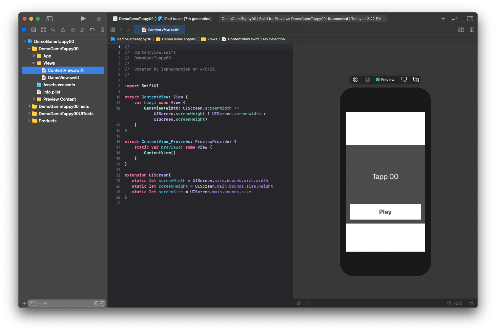
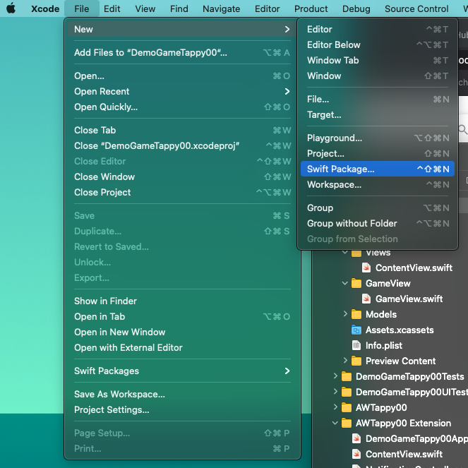
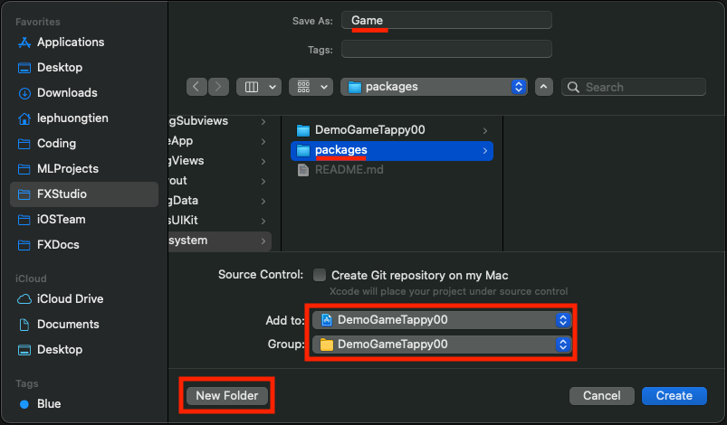
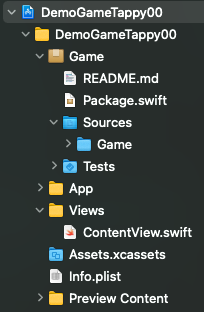
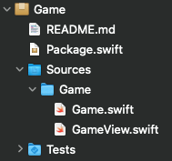
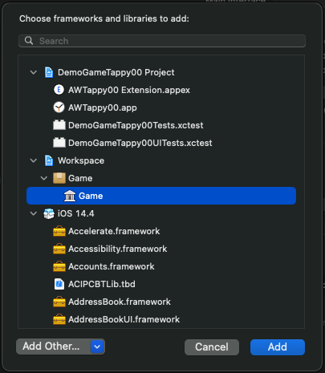
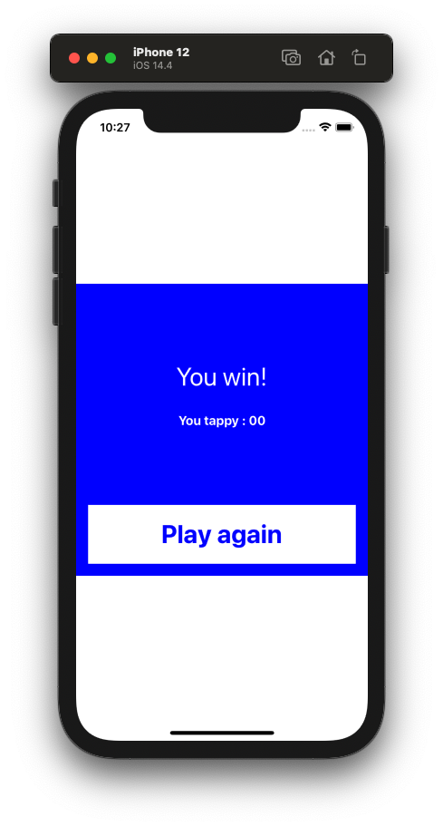

# 011.1. - Swift Package

Nhiệm vụ đầu tiên của chúng ta cần phải làm trước khi thực hiện việc đưa một source code lên các thiết bị & nền tảng khác nhau. Đó là biến các phần dùng chung thành một thư viện duy nhất. Đảm bảo được tính thống nhất về mặt logic trong tất cả các nền tảng.

Apple cũng đã hỗ bạn với **Swift Package Manager**. Nó cũng khá tương đồng với **CocoaPod**. Tuy nhiên, ta sẽ sử dụng Swift Package trong khuôn khổ local. Và lưu trữ tại máy tính. Có thể bạn sẽ thấy thích nó sau khi hoàn thành các bài trong phần mới này của series.

> Bắt đầu thôi!

## 1. Game Demo

Thay vì cung cấp cho bạn các version OS & tools, thì mình sẽ trình bày phần chuẩn bị bằng một game đơn giản. Bạn có thể xem qua ở hình sau:



### 1.1. Game Play

Game Play thì khá là đơn giản.

* Khi nhấn `Play` Button, Game sẽ được chạy
* Nhiệm vụ của bạn là `Tap` vào màn hình
* Nếu con số bạn `Tap` là `00` thì bạn là người chiến thắng
* Ngược lại bạn sẽ thua
* Bạn có thể chơi lại khi kích vào `Play again`

Game có tên là `"Tappy 00". Hy vọng nó giúp bạn đỡ căng thẳng trong những giờ làm việc mệt mỏi.

### 1.2. Cấu trúc

Ta có cấu túc thư mục của Project Game như sau:

* **ContentView** là một SwiftUI View. Đó là màn hình chính của game chúng ta.

```swift
struct ContentView: View {
    var body: some View {
        GameView(width: .infinity)
    }
}

struct ContentView_Previews: PreviewProvider {
    static var previews: some View {
        ContentView()
    }
}

```


* **GameView** là View cài đặt cho Game Play. Việc xử lý logic và các trạng thái cho game được thực hiện trong cùng một file


Code khởi tạo GameView cho bất cứ màn hình nào như sau:

```swift
GameView(width: 300.0)
```

### 1.3. Game State

Đây là một thành phần quan trọng của Game. Các màn hình game như Loading, Running, GameOver ... sẽ được quản lý bằng Game State. Ta có enum khai báo các trạng thái game như sau:

```swift
enum GameState {
    case loading
    case running
    case gameover
    case winner
}
```

Vì chúng ta đang sử dụng SwiftUI và phong cách code của ta là **Declarative Programming**. Nên tất cả phải được khai báo ngay từ đầu. Do đó, với một ứng dụng mà thay đổi liên tục các View phù hợp với các trạng thái khác nhau. Thì sự lựa chọn cho việc khai báo view là

> @ViewBuilder

Ta có function sau để quyết định View nào sẽ xuất hiện trọng ứng dụng.

```swift
@ViewBuilder func makeStatusView() -> some View {
        switch gameState {
        case .loading:
            // View for Loading
            
        case .running:
            // View for Running
            
        case .gameover, .winner:
            // View for end game
        }
    }
```

Vì kiểu trả về là `some View` nên bạn hoàn toàn yên tâm mà sử dụng nó vào trong `body` **GameView**.

Qua trên, mình đã trình bày cấu trúc chính của demo Game đơn giản này rồi. Hi vọng giúp dễ hiểu hoặc giúp bạn có thể tự thiết kế một game cho riêng bạn. Và bây giờ, chúng ta sang phần chính nào.

## 2. Create Swift Package

**Swift Packager Manager**, ra mắt cùng Swift 3.0 được giới thiệu là một công cụ giúp quản lý việc phân phối mã nguồn, giúp cho việc chia sẻ và dùng lại code được dễ dàng.

Tuy nhiên, ta sử dụng **Swift Package** đơn giản mà thôi. Dễ hình dung thì ta sẽ tạo ra một thư viện nhỏ. Thư viện này sẽ được import vào các project demo trong phần này.

### 2.1. Create

Đầu tiên, bạn hãy dùng Xcode và tạo một Swift Package trước. Lựa chọn **Menu > New > Swift Package**.



Bạn tiếp tục điền các thông tin cần thiết như sau:



Bạn chú ý các phần được tô màu đỏ.

* Bạn cần phải tạo thêm một thư mục mới để chứa thư viện này
* Bạn chọn  `Add to` và `Group` cho project demo ở trên. Giúp bạn có thể chỉnh sửa một cách nhanh chóng

Sau khi thêm thành công thì Swift Package đó được tự động thêm vào Project. Ta xem cấu trúc file của project lúc này sẽ như sau:



Trong đó:

* `Package.swift` là nới chứa định nghĩa của Swift Package và các tham số cần thiết (như targer, version ...)
* Thư mục `Sources` chứa mã nguồn của thư viện
* File `Game.swift` là file define đầu tiên của thư viện

### 2.2. Add files

Sang phần tiếp theo, chúng ta sẽ thêm các file mã nguồn cần thiết vào thư viện. Theo cấu trúc trên ta sẽ có thư mục `Game` là nơi chứa mã nguồn của thư viện. Bạn muốn thêm file nào vào thì hãy copy vào thư mục `Game` đó.



Mình tiến hành kéo thả file `GameView.swift` từ project demo vào Swift Package.

### 2.3. Config Code

Phần này rất quan trọng. Khi bạn code thường sẽ không chú ý tới các `access control` trong Swift. Vì mặc định khi bạn khai báo 1 class, thì mức truy cập là `internal`. Điều này có nghĩa là các class/struct khác cùng module với sẽ có thể truy cập tới và có thể kế thừa.

Tuy nhiên, khi bạn sử dụng Swift Package thì lúc nào đã là một module khác rồi. Với quyền truy cập mặc định là `internal` thì bên ngoài (lúc này là code ở Project) sẽ không thể nào tìm thấy được các class/struct trong Swift Package.

Do đó, bạn cần phải thêm từ khoá `public` vào những class và properties nào mà bạn muốn bên ngoài nhìn thấy được. Ví dụ mình sẽ chỉnh sửa lại như sau:

```swift
public enum GameState {
    case loading
    case running
    case gameover
    case winner
}

public struct GameView: View {
  
    public var width: CGFloat

    let mainColor = Color(.white)
    @State var gameState: GameState = .loading
    @State var backgroundColor = Color(.darkGray)
    @State var status = "Tap to Play!"
    @State var isStarGame = false
    @State var count = 10
    @State var timer = Timer.publish(every: 0.01, on: .main, in: .common)
    @State private var timerSubscription: Cancellable?
        
    public init(width: CGFloat) {
        //...
    }
    
    public var body: some View {
       // ...
    }
}
```

Cái nào thực sự cần thiết thì bạn hãy để ở chế độ `public` nha. Chúng ta sang phần tiếp theo nào.

### 2.4. Version

Giúp cho việc build package thì bạn cần phải cung cấp thêm các version của các `platforms` mà bạn muốn sử dụng Swift Package này. Nếu bạn bỏ qua thì Xcode sẽ báo lỗi. Bạn sẽ thêm các từ khoá `@available` vào trước câu lệnh/khai báo .... mà bạn sử dụng. Xcode sẽ hiểu là hệ điều hành mới nhất.

> Khá là rườm rà!

Đơn giản hơn, bạn mở file `Package.swift` lên và thêm tham số cho `platforms` vào.

```swift
 platforms: [.iOS(.v13), .macOS(.v10_15), .watchOS(.v6), .tvOS(.v13)],
```

Cho bạn dễ nhìn thì sau đây là toàn bộ file Package.

```swift
import PackageDescription

let package = Package(
    name: "Game",
    platforms: [.iOS(.v13), .macOS(.v10_15), .watchOS(.v6), .tvOS(.v13)],
    products: [
        // Products define the executables and libraries a package produces, and make them visible to other packages.
        .library(
            name: "Game",
            targets: ["Game"]),
    ],
    dependencies: [
        // Dependencies declare other packages that this package depends on.
        // .package(url: /* package url */, from: "1.0.0"),
    ],
    targets: [
        // Targets are the basic building blocks of a package. A target can define a module or a test suite.
        // Targets can depend on other targets in this package, and on products in packages this package depends on.
        .target(
            name: "Game",
            dependencies: []),
        .testTarget(
            name: "GameTests",
            dependencies: ["Game"]),
    ]
)
```

> Chắc phải làm một bài viết đầy đủ về Swift Package. Ahuhu!

### 2.5. Linking

Bạn chú ý tại file `Package.swift` có phần define về `product` . Đây là phần định nghĩ những gì mà bạn có thể thấy được từ Project khi sử dụng thư viện.

```swift
products: [
        .library(
            name: "Game",
            targets: ["Game"]),
    ],
```

Tiếp theo, bạn sẽ tiến hành import thư viện vào Project. Bạn theo các bước sau:

1. Mở Project của bạn lên
2. Tại **Target** của Project, bạn truy cập phần **General**
3. Bạn tới phần **Frameworks, Libraries and Embedded Content** , kích nút `+`
4. Chọn Package tại **Workspace/Game/ Game**



> Nếu Project có nhiều targer và target nào bạn muốn sử dụng Swift Package thì hãy thực hiện lại các thao tác liên kết trên cho từng target.

Như vậy, bạn đã hoàn thành việc tạo thư viện và liên kết nó vào Project của bạn.

## 3. Import Swift Package

Cuối cùng, bạn muốn sử dụng Swift Package tại đâu trong Project của bạn thì hãy `import` nó vào. Xem ví dụ cho thư viện vừa tạo của chúng ta.

```swift
import Game
```

Tuy nhiên, bạn hãy bấm `Command + B` để build lại Project.  Nếu Xcode báo lỗi và không build được. Thì sẽ gỡ rối theo môt trong các cách như sau hoặc tất cả cũng đc.

1. Product > Clean (nhấn `Shift + Command + K`)
2. Product > Clean Build Folder (nhấn `Shift + Option + Command + K`)
3. Xoá thư mục **Derived Data** của project. Mở bằng cách truy cập **Xcode Menu > Preferences > Locations**.

Mọi thứ đã okay thì bạn tiến hành sử dụng các class/struct trong thư viện đó. Với Project demo của chúng ta, mình có sử dụng thư viện tại **ContentView**. Code tham khảo của nó sẽ như thế này

```swift
import SwiftUI
import Game

struct ContentView: View {
    var body: some View {
        GameView(width: UIScreen.screenWidth <= UIScreen.screenHeight ? UIScreen.screenWidth : UIScreen.screenHeight)
    }
}

struct ContentView_Previews: PreviewProvider {
    static var previews: some View {
        ContentView()
    }
}

extension UIScreen{
   static let screenWidth = UIScreen.main.bounds.size.width
   static let screenHeight = UIScreen.main.bounds.size.height
   static let screenSize = UIScreen.main.bounds.size
}
```

## 4. Build iOS App

Sau khi đã fix hết các lỗi phát sinh. Bạn tiến hành build. lại project để xác nhận lần cuối là thư viện của chúng ta đã hoạt động ổn hay không.

Bạn chọn lại Schema & Target để build. Kết quả build thành công lên Simulator là thành công nhoé.



Chúng ta sẽ tiếp tục sử dụng thư viện này cho các bài viết sau và trên các nền tảng khác của Apple.

## Tạm kết

* Tạo thư viện đơn giản ở local với Swift Package
* Cấu hình cho Swift Package
* Liên kết Package với Project mà bạn muốn sử dụng
* Import vào code và sử dụng 

---

Okay! Bài viết cũng khá là dài rồi và mình xin kết thúc tại đây. SwiftUI đúng là thật ảo diệu. Một lần nữa cảm ơn bạn đã đọc bài viết này!