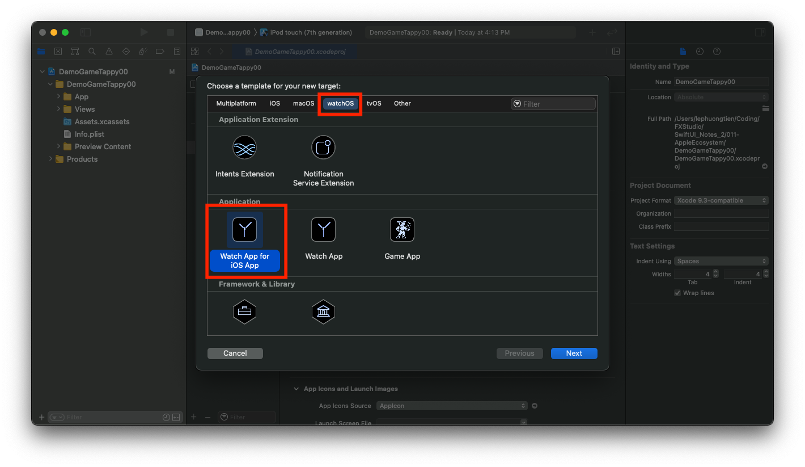
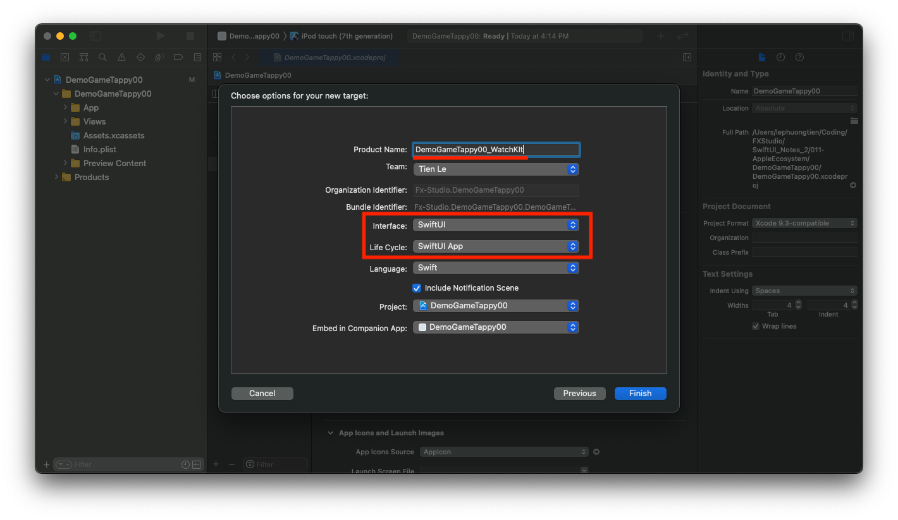
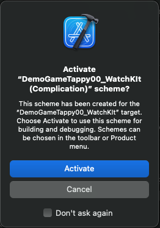
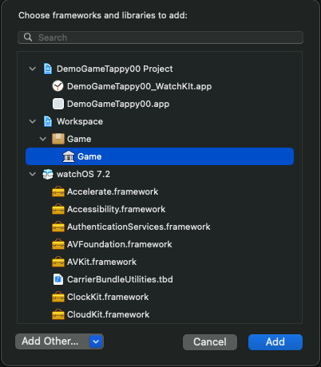
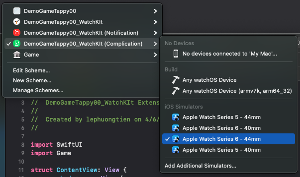
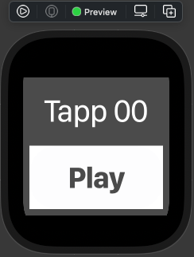
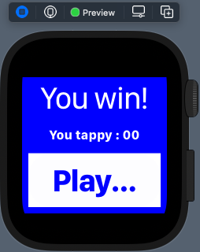
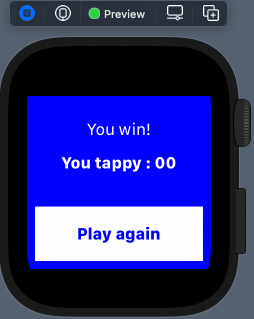

# 011.2. - WatchOS App

Chào bạn, chúng ta sẽ tiếp tục với nền tảng tiếp theo của Apple. Đó là WatchOS với các thiết bị Apple Watch. Chúng ta sẽ tìm hiểu SwiftUI có thể build lên các thiết bị Apple Watch như thế nào. Và có điều gì chúng ta cần chú ý.

> Bắt đầu thôi!

## Chuẩn bị

Bạn sẽ cần xác nhận cấu hình và version các phiên bản OS đảm bảo việc hoạt động của các ứng dụng. Cấu hình đề xuất như sau:

* iOS 13.x
* macOS 10.15.x
* watchOS 6.x
* tvOS 13.x
* Swift 5.3
* SwiftUI 2.0

Khá là nhiều thứ cần phải lưu tâm, tuy nhiên bản chất nó là như vậy. Bạn muốn đảm bảo tất cả app trên các nền tảng khác nhau của Apple hoạt động giống nhau thì phải đảm bảo được code đó chạy được với các phiên bản OS.

Bạn sẽ bắt đầu với project dùng ở phần **Swift Package**. Ta đã có một game demo và nó đã hoạt động được trên iOS. Công việc bây giờ rất đơn giản là đưa nó lên watchOS mà thôi.

## 1. Create a new WatchOS App

Tình hình, nhiều bạn là dev iOS nhưng lại chưa bao giờ tạo một app cho WatchOS. Thậm chí có nhiều bạn cả năm trời code dự án sml và không tạo mới nỗi một project để demo nữa. Và với lý do củ chuối đó, mình sẽ hướng dẫn bạn cách tạo mới một app cho WatchOS. 

Bắt đầu, bạn hãy chú ý tới chỗ button **(+)** ở góc dưới phần naviagtion cho **Target**. Bạn nhấn vào đó để thêm mới một Target cho Project của bạn. Lúc này, mình sẽ gọi project là một **workspace** nha. Vì qua nhiều bài demo thì chúng ta sẽ có thêm khác nhiều Target cho nhiều nền tảng nữa.



Tại đây, bạn chọn **watchOS > Watch App for iOS App**. Sau đó, bạn cứ tự tin mà nhấn Next mà thôi. Lại quá EZ rồi!

> Bạn nên nhớ là ứng dụng cho WatchOS thì chỉ có thể cài thông qua iPhone mà thôi. Và chỉ có iPhone là có thể kết nối với Apple Watch.

Do đó, phần ứng dụng watchOS thì người ta còn hay gọi là Extension của iOS. Bạn tiếp tục theo dõi nhoé!



Bạn hãy điền các thông tin cần thiết cho WatchOS App mới này. Bạn chú ý các phần màu đỏ nha. Ta sẽ sử dụng WatchOS với **SwiftUI** cho giao diện và quản lý vòng đời qua **SwiftUI App**.



Cuối cùng, bạn cần xác nhận để thêm Target mới vào workspace. Bấn Activate để hoàn thành công việc tạo mới một WatchOS App.

## 2. Using Swift Package

Bạn đã tạo một **Swift Package** ở bài trước và sau đó chúng ta sử dụng Package đó cho Target iOS App. Trong bài viết này, chúng ta cũng sẽ làm lại công việc thêm Package đó cho Target WatchOS App mới này.

Bạn theo các bước sau:

1. Mở Project của bạn lên
2. Tại **Target WatchOS App** của Project, bạn truy cập phần **General**
3. Bạn tới phần **Frameworks, Libraries and Embedded Content** , kích nút `+`
4. Chọn Package tại **Workspace/Game/ Game**



Như vậy, bạn đã hoàn thành việc tạo thư viện và liên kết nó vào Target WatchOS App mới của bạn. Tiêp theo, bạn truy cập vào thư mục chứa code và các thứ linh tinh cho WatchOS App. Trong demo, ta đặt tên nó là **DemoGameTappy00_WatchKIt** nên bạn sẽ thấy một thư mục có tên là **DemoGameTappy00_WatchKIt Extension**.

Bạn mở file `ContentView.swift` (nhưng nó thuộc thư mục **DemoGameTappy00_WatchKIt Extension** nha). Tại đó, bạn thêm dòng code huyền thoại sau:

```swift
import Game
```

Tiếp theo, bạn hãy bấm `Command + B` để build lại Project. Nếu Xcode báo lỗi và không build được. Thì sẽ gỡ rối theo môt trong các cách như sau hoặc tất cả cũng đc.

1. Product > Clean (nhấn `Shift + Command + K`)
2. Product > Clean Build Folder (nhấn `Shift + Option + Command + K`)
3. Xoá thư mục **Derived Data** của project. Mở bằng cách truy cập **Xcode Menu > Preferences > Locations**.

Mọi thứ đã okay thì bạn tiến hành sử dụng các class/struct trong thư viện đó. Và tại `body` bạn tiến hành tạo mới một **GameView**. Tham khảo code như sau:

```swift
import SwiftUI
import Game

struct ContentView: View {
    var body: some View {
        let temp = min(WKInterfaceDevice.screenWidth, WKInterfaceDevice.screenHeight)
        return GameView(width: temp)
    }
}

struct ContentView_Previews: PreviewProvider {
    static var previews: some View {
        ContentView()
            .previewDevice("Apple Watch Series 6 - 44mm")
    }
}


extension WKInterfaceDevice {
    static let screenWidth = WKInterfaceDevice.current().screenBounds.size.width
    static let screenHeight = WKInterfaceDevice.current().screenBounds.size.height
    static let screenSize = WKInterfaceDevice.current().screenBounds.size
}
```

Nếu như có báo lỗi về thư viện Swift Package kia thì bạn bình tĩnh mà gỡ lỗi nha. Ahihi!

## 3. Build on WatchOS

Sau khi bạn thêm thư viện và tạo các View mới ra. Nếu như không có lỗi gì xuất hiện nhưng tại **Canvas** vẫn không xuất hiện **Preview** cho WatchOS Device.

Bạn sẽ phải kiểm tra việc schema lúc này build project có đang trỏ tới thiết bị WatchOS Device không. 



Mình sẽ chọn **Apple Watch Series 6 - 44mm** cho nó xịn sò. Sau đó, bạn bấm lại **Try again** để tận hưởng kết quả.



Cuối cùng, ta sẽ test xem GameView có thực sự hoạt động trên **Apple Watch** hay không. Bạn nhấn **Live Preview** và Play game để kiểm tra. Nếu kết quả game demo chúng ta hoạt động mượt mà thì chúc mừng bạn đã tạo mới một WatchOS App thành công.

Bạn có thể build trực tiếp ứng dụng lên thiết bị thật và trải nghiệm app cho đồng hồ.

## 4. Improve Code

Vấn đề giao diện sẽ khó mà đảm bảo 100% chạy đúng & đẹp trên nhiều thiết bị khác nhau của cùng một hệ sinh thái. Ví dụ với demo game của chúng ta thì khi bạn chơi trên Apple Watch sẽ gặp tình trạng như thế này.



Bạn sẽ thấy font chữ hiển thị quá to, làm cho giao diện của chúng ta không nhất quán trên các thiết bị khác nhau. Tất nhiên, ta phải tránh việc phải sửa ở nhiều nền tảng. Với việc sử dụng Swift Package đem lại một lợi ích nữa. Ta sẽ quản lý code chúng ta tập trung tại một nơi.

Và bây giờ chúng ta tiếp tục fix các bugs giao diện ở Swift Package thôi nào. 

Bắt đầu, bạn hãy truy cập tới file **GameView** trong Swift Package `Game` mà ta đã tạo ở bài trước. Bạn thêm một thuộc tính cho struct GameView, để xác định loại thiết bị ta đang dùng là Apple Watch hay không.

```swift
var isWatchOS: Bool
```

Vì nó không phải là `public property` nên cần cập nhật lại hàm `init` để cung cấp giá trị ban đầu cho nó.

```swift
    public init(width: CGFloat, isWatchOS: Bool = false) {
        self.width = width
        self.isWatchOS = isWatchOS
    }
```

Ta sử dụng `default value` với mục đích là không phải thay đổi lại hàm khởi tạo của GameView ở những đoạn code trước. Ta sẽ tìm tới nơi cần thay đổi trong code.

```swift
                    Button(action: {
                        handleTap()
                    }, label: {
                        Text("Play again")
                            .font(isWatchOS ? .body : .largeTitle)
                            .fontWeight(.bold)
                            .frame(maxWidth: .infinity)
                            .foregroundColor(backgroundColor)
                            .padding()
                    })
```

Ví dụ, cho Button `Play again`. Bạn chỉ cần xét `if else` để thay đổi font size cho phù hợp với thiết bị. Bạn sẽ tuỳ chỉnh thêm ở nhiều chỗ khác nữa trong GameView để đảm bảo giao diện hiển thị đúng như ý đồ của mình.

Cuối cùng, bạn sẽ cập nhật là **ContentView** ở thư mục WatchOS App.

```swift
struct ContentView: View {
    var body: some View {
        let temp = min(WKInterfaceDevice.screenWidth, WKInterfaceDevice.screenHeight)
        return GameView(width: temp, isWatchOS: true)
    }
}
```

Sau đó, bạn thử lại Live Preview là test tiếp xem ứng dụng WatchOS viết bằng SwiftUI và được cung cấp bởi Swift Package có hoạt động ổn không.



Nếu như kết quả giống như ý đồ của bạn thì chúc mừng bạn đã hoàn thành tạo mới một ứng dụng WatchOS bằng SwiftUI.

## Tạm kết

* Cách tạo một ứng dụng WatchOS
* Sử dụng Swift Package cho Target WatchOS App
* Tuỳ chỉnh code để SwiftUI hiển thị tối ưu trên các thế bị ở các nền tảng khác nhau

---

Okay! Bài viết cũng khá là dài rồi và mình xin kết thúc tại đây. SwiftUI đúng là thật ảo diệu. Một lần nữa cảm ơn bạn đã đọc bài viết này!

