# 011.3. - Mac Catalyst App

Chào bạn, chúng ta lại tiếp tục với hành trình phiêu lưu của SwiftUI trong hệ sinh thái của Apple. Bài viết hôm nay sẽ đề cập tới MacOS, tuy nhiên không phải là MacOS thuần tuý. Đó là Mac Catalyst. Nó sẽ giúp bạn đang ứng dụng iOS/iPadOS lên MacOS một cách nhanh chóng.

> Bắt đầu thôi!

## Chuẩn bị

Bạn sẽ cần xác nhận cấu hình và version các phiên bản OS đảm bảo việc hoạt động của các ứng dụng. Cấu hình đề xuất như sau:

- iOS 13.x
- macOS 10.15.x
- watchOS 6.x
- tvOS 13.x
- Swift 5.3
- SwiftUI 2.0

Trong demo, mình sẽ chỉ sử dụng iOS mà thôi. Còn iPadOS thì cũng như iOS bạn không cần quan tâm nhiều. Và tất nhiên, mình sẽ tiếp tục phát triển tiếp phiên bản trên MacOS xịn sò.

## 1. Extending Catalyst App

Để đảm bảo mọi thứ hoạt động tốt và bạn sẽ không phải ân hận gì khi kích hoạt thêm app trên MacOS, mình khuyên bạn nên backup project lại trước tiên. Sau khi đã hoàn thành việc backup, ta tiến hành thêm một Tagert mới cho MacOS.

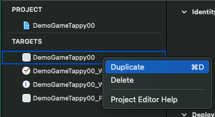

Bạn chỉ cần nhân bản nó lên thôi, vì đây là phiên bản mở rộng từ iOS app nên tốt nhất bắt đầu từ Target iOS. Tiếp theo. Bạn sẽ phải kích hoạt **MacOS** tại **Deployment Info**.

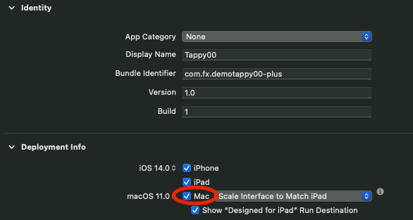

Vì chúng ta học cách cấu hình SwiftUI trên hệ sinh thái Apple, do đó ta sẽ để mọi thứ là **mặc định**. Sau khi chọn MacOS, bạn cần active thêm cho Target này.

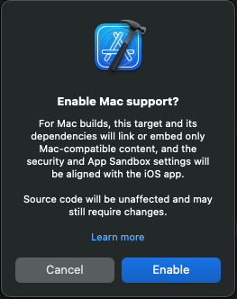

Cuối cùng, để tránh việc xử lý nhiều thì mình khuyên bạn nên dùng một tài khoản Apple Developer có trả phí. Sau đó tại Signing & Capabillities chọn chế độ auto signin cho bundle id. Và bạn hãy tạo thêm 1 bundle id mới cho app Mac Catalyst này.

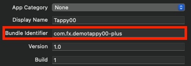

Mọi thứ ổn rồi, thì bạn hãy build ứng dụng với MacOS thôi.

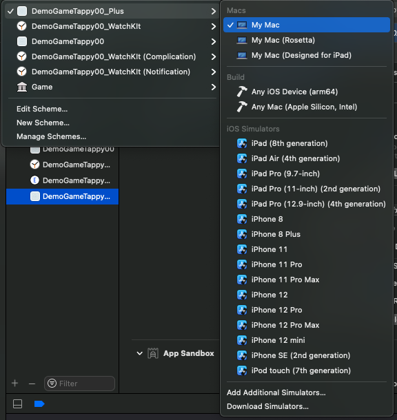

Bạn cứ chọn thoải mái các device MacOS, cái nào lỗi thì chọn cái khác. Còn nếu okay hết thì sẽ chạy được trên nhiều thiết bị.

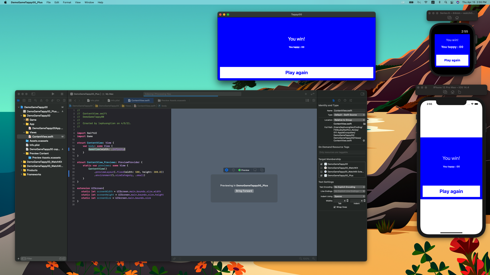

## 2. Edit Settings iOS & MacOS

Các ứng dụng iOS thì bạn sẽ ít quan tâm tới phần Setting của ứng dụng. Nhưng đối với ứng dụng cho MacOS thì đó là một không thể thiêu. Vì ứng dụng lúc này của mình là phần mở rộng iOS/iPadOS với Mac Catalyst. Nên phần setting cho MacOS sẽ lấy trực tiếp từ Setting iOS. Và nó được gọi là Preferences trên MacOS.

> iOS Settings == MacOS Preferences

### 2.1. Create new Settings

Bắt đầu, ta sẽ thêm một Bundle Setting cho project của mình. Bạn tạo mới một file, **iOS ▸ Resource ▸ Settings Bundle**.

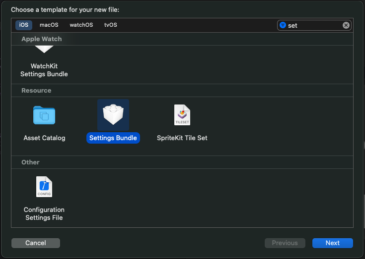

Đặt tên cho nó, mà để im tên như vậy cũng ổn. Nhưng quan trọng là bạn hãy chọn đúng Target cho file.

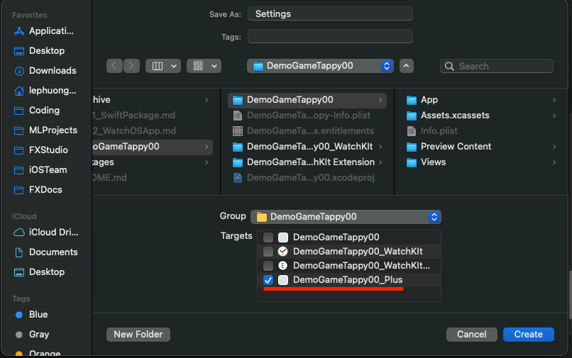

Bạn sẽ thấy cấu trúc file mới như sau. Và bạn chỉ cần quan tâm tới file `Root.plist` thôi. Đó là nơi define các setting của bạn.

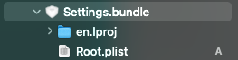

Bạn sẽ tới phần chỉnh sửa setting.

* Bạn hãy mở phần Preference Items và xoá hết các item trong đó
* Bạn hay tạo mới item theo ý bạn
* Một item sẽ có các phần như sau:
  * **Type** là kiểu hiển thị của item
  * **Title** là tên của item
  * **Identifier** là định danh của nó và khi bạn muốn dùng code truy xuất dữ liệu
  * **Default Value** là tuỳ chọn thêm mà thôi

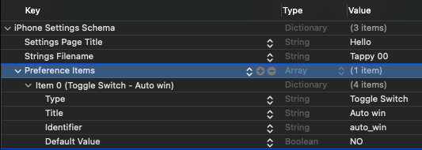

Mọi thứ đã ổn rồi thì bạn build lại ứng dụng và chú ý ở thanh Menu trên MacOS. Nó sẽ hiển thị như sau:

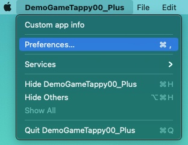

Khi kích vào bạn sẽ thấy mở ra một hộp thoại cho Preferences như sau:

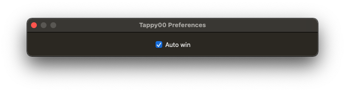

Như vậy là bạn đã hoàn thành việc tạo một Preferences cho ứng dụng của bạn. Tiếp theo, bạn học cách truy xuất dư liệu từ nó.

### 2.2. Use Preferences

Một điều bạn sẽ thấy khá là bất ngờ. Vì

> MacOS Preferences = iOS Settings == UserDefault

Chúng nó sẽ lưu trữ dưới dạng các UserDefault trong ứng dụng của bạn. Do đó, bạn không cần quan tâm tới các sự kiện trên Preferences. Dữ liệu sẽ tự động cập nhật trong UserDefault. Nhiệm vụ của chúng ta là lấy nó ra mà dùng một cách tinh tế mà thôi.

Với demo trên, ta sẽ lấy dữ liệu của chức năng auto win như sau:

```swift
UserDefaults.standard.bool(forKey: "auto_win")
```

Với `key` chính là identifier mà tao vừa tạo cho item của Preferences ở trên. Khá là EZ phải không. Tiếp theo, bạn dùng nó vào code thôi.

Mình sẽ dùng trược tiếp nó vào Swift Package, với mục đích xem cả iOS và MacOS đều hoạt động ổn hay không. Tại function `handleTap` mình sẽ lấy dữ liệu từ UserDefault và sử dụng.

```swift
func handleTap() {
        isStarGame.toggle()
        
        if isStarGame {
            count = 10
            instantiateTimer()
            self.gameState = .running
            self.backgroundColor = Color(.darkGray)
            
        } else {
            cancelTimer()
            
            if UserDefaults.standard.bool(forKey: "auto_win") {
                
                self.backgroundColor = Color(.blue)
                self.status = "You win!"
                self.gameState = .winner
                
            } else {
                if count != 0 {
                    self.backgroundColor = Color(.red)
                    self.status = "Game over!"
                    self.gameState = .gameover
                } else {
                    self.backgroundColor = Color(.blue)
                    self.status = "You win!"
                    self.gameState = .winner
                }
            }

        }
    }
```

Chỉ là `if ... else` cơ bản mà thôi. Bạn hãy build lại ứng dụng và test xem đã chạy đúng hay không.

### 2.3. @AppStore

Đây là một tính năng mới và được giới thiệu trong Swift 2.0. Đó là `@AppStore`, là một warapper để sử dụng trực tiếp dữ liệu từ UserDefault.

> Mục đích chính của bạn là lắng nghe sự thay đổi dữ liệu từ UserDefault.

Mình sẽ giới thiệu nó thôi, vì nếu bạn sử dụng UIKit hay Swift 1.0 thì bạn sẽ dùng cách **ObservableObject**. Tuy nhiên, cách đó không chạy được trên Swift 2.0. Mình sẽ có bài viết riêng về nó. Còn đây là code thay khảo cho cách trên.

```swift
extension UserDefaults: ObservableObject {
    @objc dynamic var autoWin: Bool {
        return bool(forKey: "auto_win")
    }
}

class UserSettings: ObservableObject {
    @Published var autoWin: Bool {
        didSet {
            UserDefaults.standard.set(autoWin, forKey: "auto_win")
        }
    }
        
    init() {
        self.autoWin = UserDefaults.standard.object(forKey: "auto_win") as? Bool ?? false
    }
}
```

Còn đây, bạn sẽ quay về cách chính mà mình muốn giới thiệu. Bạn mở file ContenView và thêm một thuộc tính như sau:

```swift
@AppStorage("auto_win") var autoWin: Bool = false
```

Trong đó:

* Nó đại diện như một thuốc tính bình thường của class/struct
* Nó có khả năng như `@State` hay `@StateObject` để ràng buộc dữ liệu với các View khác
* Quan trong nhất là nó sẽ phát lại dữ liệu khi UserDefault có sự thay đổi

Câu lệnh khai báo trên tương đường với. Vừa kiểm tra và vừa lấy đối tượng.

```swift
UserDefaults.standard.object(forKey: "auto_win") as? Bool ?? false
```

Cách dùng thì như các thuộc tính `@State` hay `@StateObject` khác. Ví dụ code như sau:

```swift
    var body: some View {
        VStack {
            GameView(width: .infinity)
                .border(autoWin ? Color.blue : Color.red, width: 10)
        }
    }
```

Bạn build và test lại ứng dụng nha.

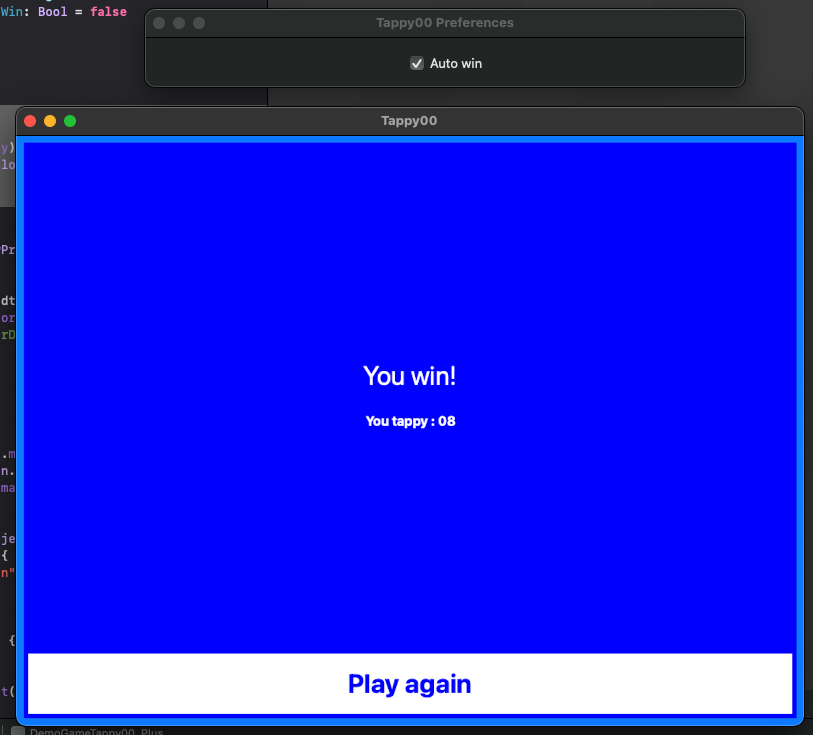

## 3. Basic MacOS Menu

Đặc sản tiếp theo từ MacOS, đó là Menu. Chúng ta sẽ phải tuỳ chỉnh hoặc thêm mới các menu cho ứng dụng MacOS của mình.

> Đây là một phần rất phức tạp. Nhất là đối với các dev iOS thuần tuý.

Và một đối tượng tác động mạnh nữa tới việc tạo Menu đó là SwiftUI. Chúng ta không có file `*.xib` cho Menu. Mọi thứ sẽ phải code ra mà thôi.

Bạn truy cập vào file App của project. Do ứng dụng tạo bởi SwiftUI App Life Cycle. Và bạn thêm một Modifier sau cho `body` của Scene.

```swift
var body: some Scene {
                
        WindowGroup {
            ContentView()
                //.environmentObject(defaults)
        }
        .commands {
            // Menu ....
        }

    }
```

Với `.commads` thì giúp cho ứng dụng SwiftUI có thể thêm Menu khi hoạt động. 

### 3.1. New Menu Item

Bắt đầu bằng việc thêm mới 1 menu trong thanh menu của ứng dụng. Bạn hãy thêm đoạn code sau vào khối lệnh của `.commands` ở trên.

```swift
CommandMenu("First menu") {
            Button("Print message") {
                print("Hello World!")
            }.keyboardShortcut("p")
}
```

Trong đó:

* Menu mới sẽ có tên là `First menu`
* Trong đó có 1 Button với tên là `Print message`
* Sự kiện của Button đó sẽ in ra dòng chữ `Hello World!`
* Phím tắt là `P`, được cài đặt thông qua `.keyboardShortcut`

### 3.2. More stype Menu

* Text

```swift
Text("Option 1")
```

* Button

```swift
            Button("Print second message") {
                print("Second message!")
            }
```

* Divider

```swift
Divider()
```

* Picker

```swift
            Picker(selection: $sorting, label: Text("Sorting")) {
                Text("Option 1").tag(1)
                Text("Option 2").tag(2)
                Text("Option 3").tag(3)
            }
```

* Toggle

```swift
            Toggle(isOn: $isOS, label: {
                Text( isOS ? "Unselect" : "Select")
            })
```

* Sub-menu

```swift
                Menu("Submenu") {
                    Button("Menu Item", action: ...)
                }
```

Mình liệt kê vài loại cơ bản mà bạn sử dụng. Các loại khác bạn tự tìm hiểu thêm nha.

### 3.3. Editing Existing Menus

Bạn có thể tuỳ chính những Menu có sẵn, như: New, Help, Save ... Ví dụ như:

* Thêm vào trước Menu có sẵn

```swift
CommandGroup(before: CommandGroupPlacement.newItem) {
                Button("before item") {
                    print("before item")
                }
            }
```

* Thêm vào sau nó

```swift
            CommandGroup(after: CommandGroupPlacement.newItem) {
                Button("after item") {
                    print("after item")
                }
            }

```

* Thay đổi lại nó luôn

```swift
            CommandGroup(replacing: CommandGroupPlacement.appInfo) {
                Button("Custom app info") {
                    // show custom app info
                }
            }
```


Với những các can thiệp cơ bản ở trên thì bạn đủ sức tuỳ biến lại Menu bar theo ý thích của bạn rồi. Bạn hãy build lại ứng dụng và kiểm tra kết quả nào.


## Tạm kết

* Tạo mở rộng MacOS App từ iOS/iPadOS với Catalyst
* Thêm các Setting & Preferences cho ứng dụng MacOS
* Handle các dữ liệu từ Settings với @AppStore
* Basic Menu trên MacOS

---

Okay! Bài viết cũng khá là dài rồi và mình xin kết thúc tại đây. SwiftUI đúng là thật ảo diệu. Một lần nữa cảm ơn bạn đã đọc bài viết này!

