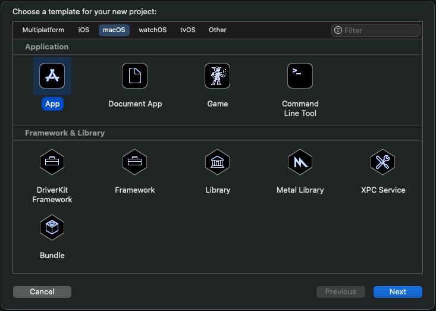
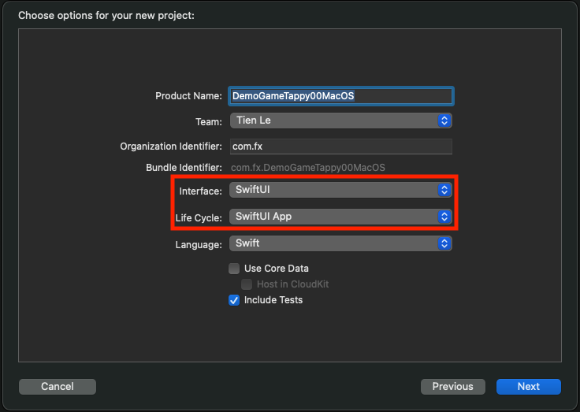
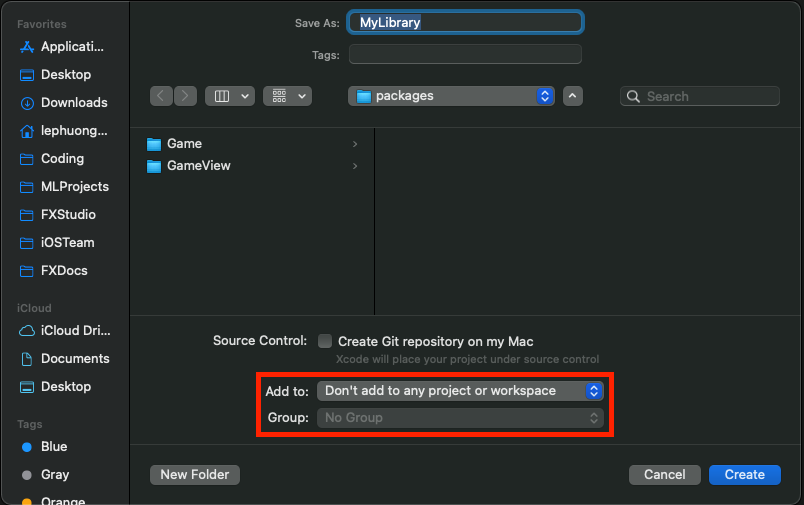
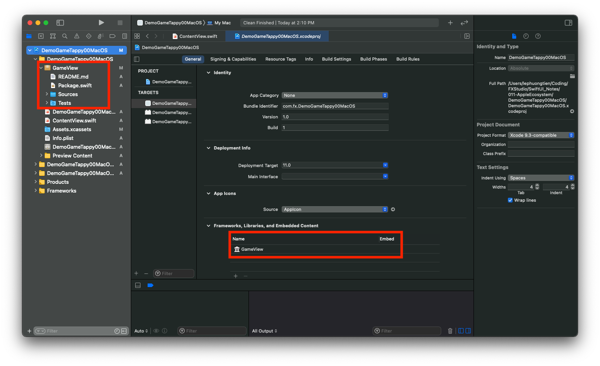
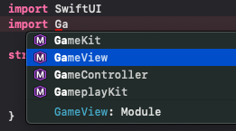
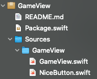

# 011.4. MacOS App

Chào bạn, chúng ta cũng đã lang thang được 3 nền tảng với SwiftUI rồi. Ở phần trước, bạn cũng đã được tìm hiểu cách mở rộng ứng dụng iOS/iPadOS sang MacOS với Catalyst. Bài viết này sẽ hướng dẫn bạn cách tạo một ứng dụng MacOS chính chủ.

> Bắt đầu thôi!

## Chuẩn bị

Bạn sẽ cần xác nhận cấu hình và version các phiên bản OS đảm bảo việc hoạt động của các ứng dụng. Cấu hình đề xuất như sau:

- iOS 13.x
- macOS 10.15.x
- Swift 5.3
- SwiftUI 2.0

Trong bài viết này, chúng ta sẽ tạo mới một Project cho MacOS. Tuy nhiên, chúng ta sẽ dùng lại code của thư viện Swift Package mà được dùng cho 3 phần trước.

## 1. Create a new MacOS App

Bài viết này mang tính chất hướng dẫn là chính. Giúp cho bạn có cái nhìn tổng quan về một ứng dụng MacOS sẽ như thế nào.

Đầu tiên, bạn cần tạo một project với tuỳ chọn MacOS. Sau đó, bạn chọn **Application > App**



Bấm Next và đến màn hình điền thông tin ban đầu cho MacOS Project.



Chúng ta sẽ sử dụng **SwiftUI Ap**p cho **Life Cycle** với MacOS Project này. Như vậy, bạn đã tạo xong một Project cho MacOS rồi.

## 2. Project Struct

Với một project có Life Cycle là SwiftUI App, thì cấu trúc thư mục khá là đơn giản. Bạn sẽ thấy 2 file chính:

* File App, nơi sẽ khởi động App với WindowGroup
* File ContentView, nơi chứa View đầu tiên của ứng dụng

Cấu trúc này cũng khá tương tự iOS App với SwiftUI App Life Cycle. Bạn có thể tìm lại bài viết đó ở phần trước trong series này.

## 2. Import Swift Package

Tất nhiên, bạn không phải code lại mọi thứ khi đổi sang nền tảng mới. Mà bạn sẽ dùng Swift Package để tái sử dụng lại code của mình.

Vì Swift Package lần trước ta tạo nó có vấn đề Target. Vì nó được add trực tiếp vào Project. Do đó, bạn sẽ phải tạo lại một một Swift Package mới, hoàn toàn không chịu ảnh hường từ bất cứ Target hay Project nào.

### 2.1. Create

Bạn sẽ bắt đầu tạo lại Swift Package bằng cách chọn **Menu > File > New > Swift Package**.



Bạn chú ý việc bỏ trống chọn `Add to` & `Group`. Sau đó, bạn copy các file cần thiếu vào thư mục `Source` của Swift Package vừa mới tạo.

Tiếp theo, bạn kéo thả Swift Package mới tạo vào Project đang làm của chúng ta.



Sau đó, bạn link thư viện vào Project. Tại phần Framework, Libs, bạn kích button (+) và chọn đúng thư viện vừa tạo ở trên. Như vậy, bạn đã hoàn thành việc tạo mới thư viện rồi.

### 2.2. Import

Cuối cùng, bạn muốn sử dụng Swift Package tại đâu trong Project của bạn thì hãy `import` nó vào. Xem ví dụ cho thư viện vừa tạo của chúng ta.

```
import Game
```

Tuy nhiên, bạn hãy bấm `Command + B` để build lại Project. Nếu Xcode báo lỗi và không build được. Thì sẽ gỡ rối theo môt trong các cách như sau hoặc tất cả cũng đc.

1. Product > Clean (nhấn `Shift + Command + K`)
2. Product > Clean Build Folder (nhấn `Shift + Option + Command + K`)
3. Xoá thư mục **Derived Data** của project. Mở bằng cách truy cập **Xcode Menu > Preferences > Locations**.

Mọi thứ okay thì bạn sẽ thấy được tên thư viện tại phần suggestion khi gõ lệnh import.



Với Project demo của chúng ta, mình có sử dụng thư viện tại **ContentView**. Code tham khảo của nó sẽ như thế này.

```swift
import SwiftUI
import GameView

struct ContentView: View {
    
    var body: some View {
        VStack {
            GameView(width: 300.0)
        }
    }
}

struct ContentView_Previews: PreviewProvider {
    static var previews: some View {
        ContentView()
    }
}
```

Vẫn là những đoạn code quen thuộc. Ta sẽ tạo mới một đối tượng **GameView** với `width = 300.0`. Bạn bấm **Resume** và xem kết quả hiển thị như thế nào.


## 3. Custom Code

Với hình ở trên, bạn sẽ nhận ra rằng giao diện không hoàn toàn hoàn hảo đúng 100% như kì vọng. Nguyên nhân là vì cùng một SwiftUI code, nhưng khi build lên nền tảng nào thì nó sẽ hiển thị theo nền tảng đó.

Với demo của chúng ta đã thiết kế Button cho iOS (hay UIKit). Nhưng trên MacOS (AppKit) thì Button sẽ lại phải tuỳ chỉnh kiểu khác. Phần này, mình sẽ trình bày ở phần sau, khi đi vào phân tích từng UI từng đối tượng trong SwiftUI.

Với demo này, chúng ta sẽ Custom lại theo phương phép thay đổi `stype` cho SwiftUI View. Đầu tiên, bạn cần tạo mới một file Swift trong **Swift Package** kia. Mình đặt tên là **NiceButton**. 



Và code tham khảo của nó như sau:

```swift
import SwiftUI

struct NiceButtonStyle: ButtonStyle {
  var foregroundColor: Color
  var backgroundColor: Color
  var pressedColor: Color

  func makeBody(configuration: Self.Configuration) -> some View {
    configuration.label
      .foregroundColor(foregroundColor)
      .background(configuration.isPressed ? pressedColor : backgroundColor)
  }
}


extension View {
  func niceButton(
    foregroundColor: Color = .white,
    backgroundColor: Color = .white,
    pressedColor: Color = .accentColor
  ) -> some View {
    self.buttonStyle(
      NiceButtonStyle(
        foregroundColor: foregroundColor,
        backgroundColor: backgroundColor,
        pressedColor: pressedColor
      )
    )
  }
}

```

Trong đó:

* Phần extension cho một View với modifier là `niceButton`
* Phần style sẽ kế thừa lại `ButtonStyle`

Cụ thể code của nó như thế nào, thì xin phép mình trình bày ở một bài viết nào đó sau này. Bây giờ, bạn chỉ cần copy code và sử dụng.

Tiếp tục, bạn mở file **GameView** lên và truy cấp tới các đoạn code khai báo **Button**. Ví dụ cho việc tuỳ chỉnh 1 button như sau

```swift
Button(action: {
                        handleTap()
                    }, label: {
                        Text("Play")
                            .font(.title)
                            .fontWeight(.bold)
                            .frame(maxWidth: .infinity)
                            .foregroundColor(backgroundColor)
                            .padding()
                    })
                    .background(mainColor)
                    .niceButton()
```

Mọi thứ sẽ không thay đổi gì hết. Bạn chỉ cần gọi thêm modifier sau `.niceButton()` là oke. Cuối cùng, bạn về lại ContentView và bấm Resume để xem kết quả. Nếu không có lỗi gì xãy ra, bạn có thể build project để test ứng dụng MacOS mới của mình.


## Tạm kết

* Cách tạo một project MacOS với SwiftUI App Life Cycle
* Tạo mới Swift Package và cách sử dụng nó vào Project
* Tuỳ chình giao diện đơn giản cho Button với Style custom

---

Okay! Bài viết cũng khá là dài rồi và mình xin kết thúc tại đây. SwiftUI đúng là thật ảo diệu. Một lần nữa cảm ơn bạn đã đọc bài viết này!

