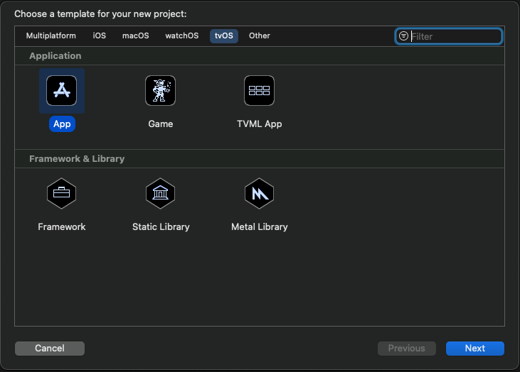
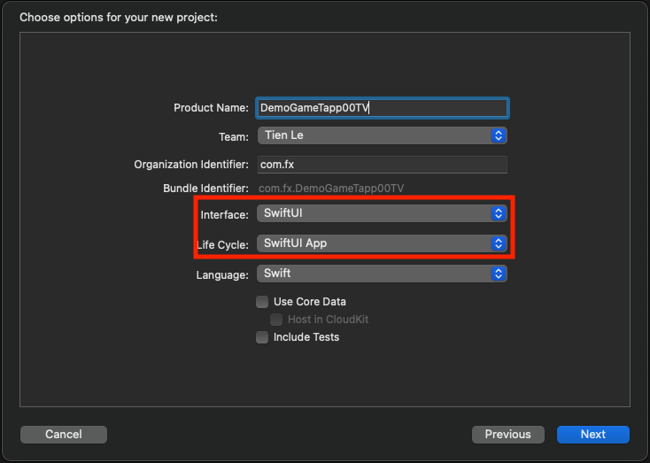
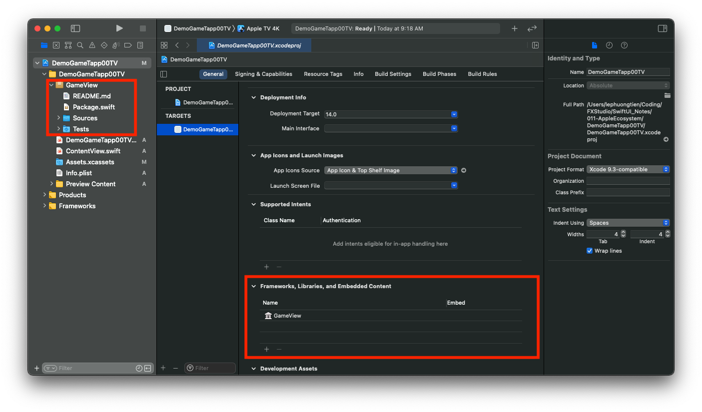
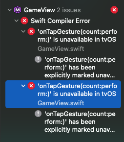
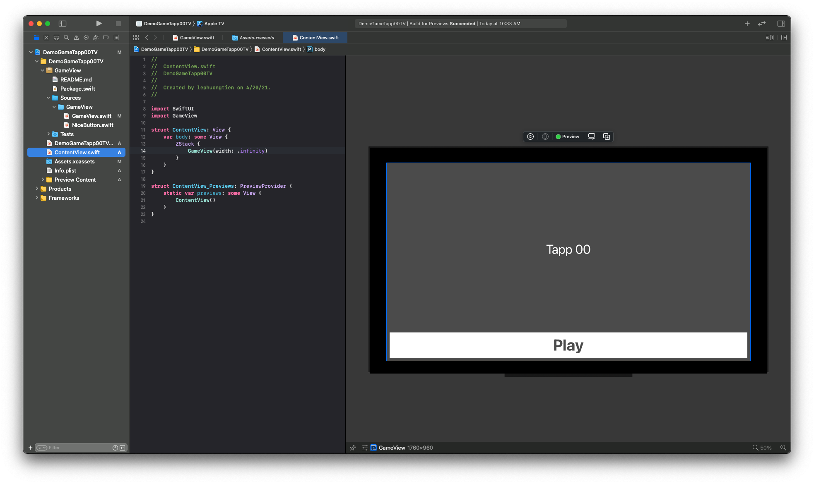
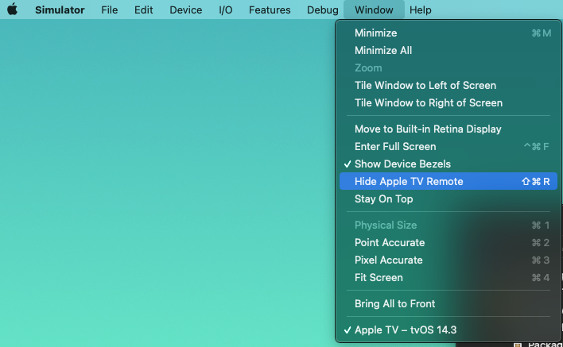
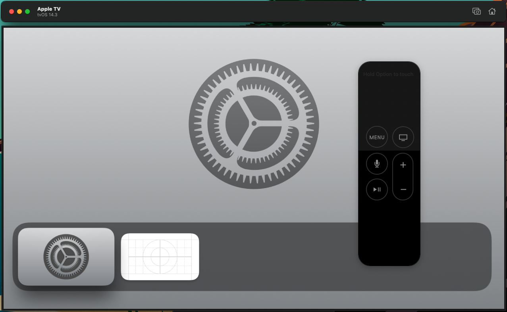
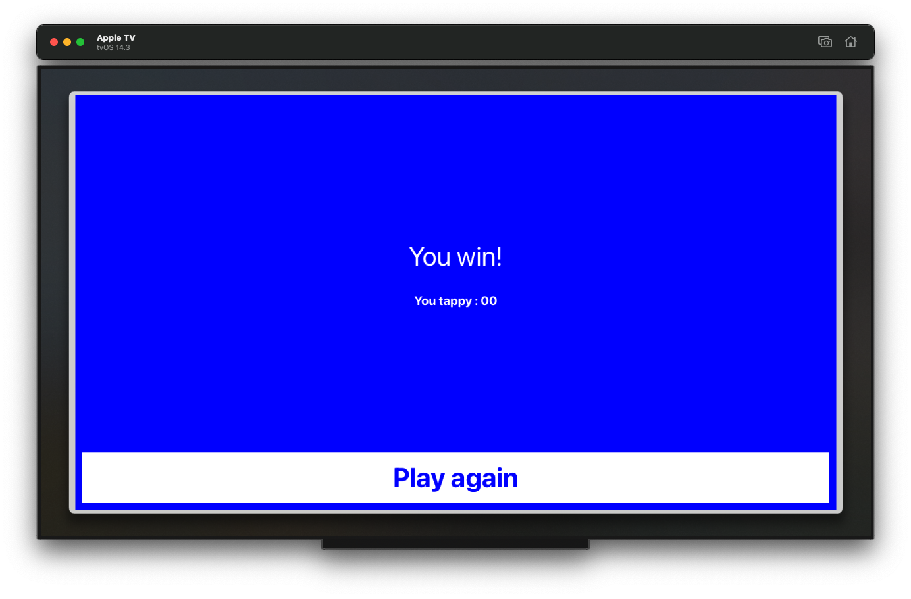

# 011.5. - tvOS App

Chào bạn, chúng ta lại tiếp tục hành trình khám phá thêm một nền tảng nữa trong hệ sinh thái của Apple. Đối tượng lần này chính là Apple TV với tvOS. Đây là một nền tảng phải nói là khá xa lạ với mình và dám chắc cũng khá nhiều anh em dev iOS mù tẹt về nó. Thôi ...

> Bắt đầu thôi!

## Chuẩn bị

Bạn sẽ cần xác nhận cấu hình và version các phiên bản OS đảm bảo việc hoạt động của các ứng dụng. Cấu hình đề xuất như sau:

- tvOS 13.x
- Swift 5.3
- SwiftUI 2.0

Ta vẫn sử dụng lại Swift Package huyền thoại từ 4 phần trước. Và lần này chúng ta xem nó có thể hoạt động mượt mà trên nền tảng tvOS của Apple hay không.

## 1. Create a new tvOS App

Chúng ta sẽ tạo mới hoàn toàn một Project với tvOS, chứ không cần thêm Target nào nữa cho Project có sẵn. Bắt đầu, bạn hãy chọn **New > Project** và tuỳ chọn tới **tvOS > App**.



Sau đó, bạn hãy điền các thông tin cần thiết cho Project.



Điều quan trọng là bạn cần chọn phần **Interface** & **Life Cycle** là **SwiftUI** & **SwiftUI App**. Mình muốn mọi thứ phải đồng bộ với nhau và mới nhất.

Và chỉ có như vậy thôi, bạn đã tạo được một Project với tvOS rồi. Ahihi!

## 2. Project Struct

Với một project có Life Cycle là **SwiftUI App**, thì cấu trúc thư mục khá là đơn giản. Bạn sẽ thấy 2 file chính:

- File App, nơi sẽ khởi động App với WindowGroup
- File ContentView, nơi chứa View đầu tiên của ứng dụng

Cấu trúc này cũng khá tương tự iOS App & MacOS App với **SwiftUI App Life Cycle**. Bạn có thể tìm lại bài viết đó ở phần trước trong series này.

Bạn hãy thử build project và xem tvOS Simulator có gì khác biệt với iOS hay MacOS nha. Chúc bạn thành công!

## 3. Import Swift Package

Nếu bạn chưa biết thì tvOS SDK cung cấp các đối tượng UI rất hạn chế. Nhiều control sẽ không chạy được trên tvOS. Do đó, việc bạn gặp bất ngờ khi thư viện của mình không hoạt động thì là điều hiển nhiên.

### 3.1. Create

> Vì phần tạo Swift Package với không tuỳ chọn target nào hết thì mình đã thực hiện ở bài viết trước. Bạn hãy xem lại nếu chưa biết tạo hoặc quên mất cách tạo.

Bỏ qua bước tạo Swift Package, bạn tới bước thêm Swift Package vào project. Bạn chỉ cần kéo thả Swift Package vào Project đang làm của chúng ta.



Sau đó, bạn link thư viện vào Project. Tại phần Framework, Libs, bạn kích button (+) và chọn đúng thư viện vừa tạo ở trên. Như vậy, bạn đã hoàn thành việc tạo mới thư viện rồi.

### 3.2. Custom code

Bạn hãy thử build project trước (bấm Command + B). Project của bạn sẽ báo lỗi. Lỗi này đến từ Swift Package của chúng ta.



Đây chỉ là 1 trong vô số lỗi có thể xảy ra, khi bạn chuyển đổi từ iOS sang tvOS. Đó là cả một bầu trời mới đối với bạn. Công việc khá là đơn giản. Bạn chỉ cần xoá hoặc comment nó lại. 

Tiếp tục, bạn hãy mở file **ContentView** và import thư viện.

```swift
import GameView
```

Sau đó, bạn hãy build project để xác nhận việc thêm thư viện thành công vào project với tvOS. Còn bây giờ, chúng ta sẽ tạm thời fix bug trên như sau.

Bạn truy cập vào file GameView của Package và edit đoạn code bị lỗi.

```swift
ZStack {
            Button(action: {
                handleTap()
            }, label: {
                Rectangle()
                    .fill(backgroundColor)
                    .frame(width: .infinity, height: .infinity)
            })
            makeStatusView()
        }
```

Trong đó:

* Ta xoá đi phần cảm ứng với `.tapGesture` của **ZStack**
* Thay vào đó, ta thêm một Button với kích thước full khung chứa.
* Tại sự kiện của Button ta gọi function xử lý game

Bạn build lại Project xem còn lỗi hay không. Nếu không tìm chúng ta sang phần sử dụng thư viện.

### 3.3. Import

Tại file ContentView, bạn tuỳ chính cái code và thêm đối tượng GameView cho `body`.

```swift
import SwiftUI
import GameView

struct ContentView: View {
    var body: some View {
        ZStack {
            GameView(width: .infinity)
        }
    }
}

struct ContentView_Previews: PreviewProvider {
    static var previews: some View {
        ContentView()
    }
}
```

Sau đó, bạn hay bấm Resume để tận hưởng kết quả trên tvOS nào.



EZ Game!

## 3. TV Remote

Tại màn hình Preview, bạn hãy bấm Live Preview để test game hoạt động đúng hay không. Tuy nhiên, chắc bạn sẽ phải thất vọng lần 2.

> Vì ứng dụng trên tvOS lại không hoạt động. Bạn sẽ không kích được vào màn hình.

Nguyên nhân rất đơn giản, vì đó là TV. Nó không có cảm ứng và bạn cần điều kiển bằng `remote` của TV.

Và bây giờ, bạn hãy bấm run project và để Xcode khởi động tvOS Simulator. Sau đó, bạn hãy kích hoạt cái `remote` của TV ảo này. Chọn **Simulator > Menu > Window > Show Apple TV Remote**. 



Okay thì sẽ có một em remote nhỏ nhỏ xinh xinh như hình bên dưới.



Cách sử dụng em nó thì như thế này.

* Vùng ở phía trên remote, bạn cứ `tap` vào đó. Đó là click. (hết)
* Các phần còn lại bạn hãy tự tìm hiểu.

Mọi thứ ổn rồi, bạn hãy run lại Project với tvOS Simulator và test thử ứng dụng của mình vừa tạo nha.



Chúc bạn vui vẻ với tvOS!

## Tạm kết

* Tạo project với tvOS
* Tuỳ chỉnh các đối tượng phù hợp với tvOS SDK
* Sử dụng TV Remote cho việc điều kiển ứng dụn tvOS

---

Okay! Bài viết cũng khá là dài rồi và mình xin kết thúc tại đây. SwiftUI đúng là thật ảo diệu. Một lần nữa cảm ơn bạn đã đọc bài viết này!

