# 012.1. Basic Multiplatform App

Chào bạn đến với series **SwiftUI Notes** của **Fx Studio**. Đây sẽ là bài viết trong phần mới nhất của Apple & SwiftUI. Đó là **Multi-platform App** với SwiftUI App. Nó không như Mac Catalyst, project của bạn sẽ chạy trực tiếp trên các nền tảng khác nhau của Apple. Và sẽ có rất nhiều thứ mà bạn cần cập nhật nữa theo phần mới này.

Nếu mọi thứ ổn rồi thì ...

> Bắt đầu thôi!

## Chuẩn bị

Khi bạn sử dụng Xcode 12 để tạo mới một Project thì bạn sẽ thấy một phần mới được giới thiệu trong Xcode 12. Đó là **multiplatform app template**. Do đó, bạn cũng cần phải chuẩn bị các version OS & tool theo cập nhật mới nhất.

* Xcode 12
* SwiftUI 2.0

Còn về kiến thức thì bạn cần nắm các kiến thức sau đây:

* SwiftUI App - Life Cycle
* SwiftUI - The Apple Ecosystem

*(Các bài viết đó đều được cập nhật trên website [Fx Studio](https://fxstudio.dev/) bạn có thể tìm đọc tại đó. Nhớ like, share & subscribe các channels của Fx Studio nhoé).*

## 1. Create a new project

Chúng ta sẽ tìm hiểu về Multi Platform App thông qua việc thực hiện theo demo từng bước. Mình sẽ cố gắng trình bày các điểm lý thuyết bổ sung để giúp bạn hiểu rõ hơn về nó.

Để bắt đầu, bạn hãy mở Xcode và **New Project**. Bạn hãy chú ý tới phần `Multiplatform` nha.

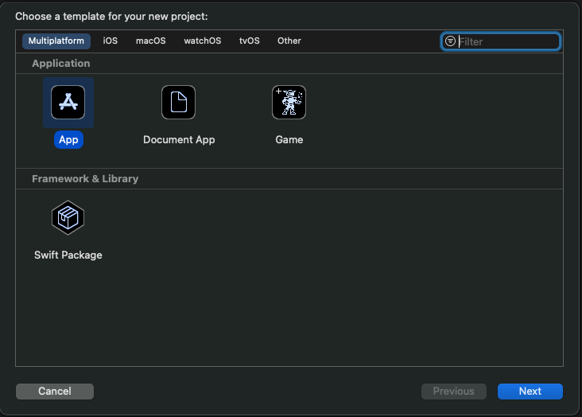

Bạn nhấn **Next** để tiếp tục, sau đó điền thông tin cho project của bạn.

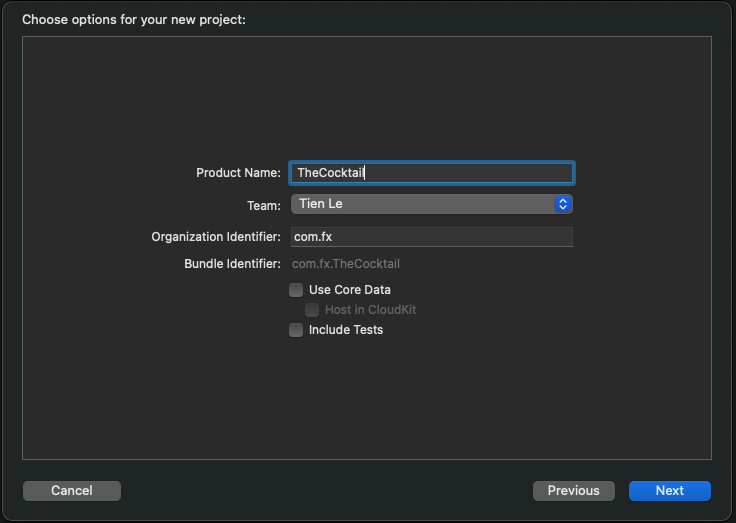

*(thông tin ban đầu cho Project cũng khá là sơ sài.)*

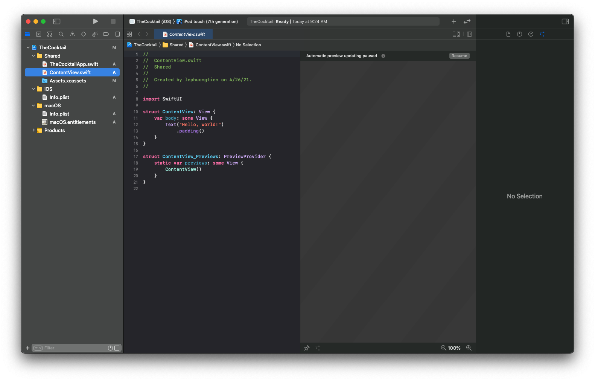

Như vậy, bạn đã hoàn thành việc tạo mới một project theo **Multiplatform App** rồi đó. Chúng ta sẽ đi vào tìm hiểu cấu trúc của project có những gì nào. 

## 2. Project Struct

Tiếp theo, chúng ta sẽ xem từng phần trong Project có những gì. Hãy bắt đầu bằng việc quan sát phần Naviagtion của Xcode để xem cấu trúc files và thư mục.

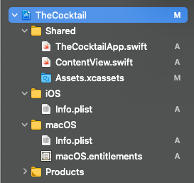

Ta có 3 phần rất rõ ràng như sau:

* Shared
* iOS
* macOS

Vì 2 nền tảng iOS & MacOS là lớn nhất nên nó sẽ ưu tiên được tạo ra đầu tiên. Các nền tảng bạn sẽ phải tự thêm vào. Chúng ta sẽ tìm hiểu nó sau nha. Giờ đi vào chi tiết từng cấu trúc một của project mới này.

### 2.1. Shared

Đây là nơi bạn sẽ làm việc rất nhiều. Là nới sẽ chứa các thứ chung như sau:

* Giao diện ứng dụng
* Models
* Service
* ...

Nó giúp bạn tiết kiệm code và tránh việc tạo các thư viện thêm như Swift Package. Bạn sẽ kết hợp thế mạnh của nhiều thứ:

* SwiftUI giúp 1 lần code cho nhiều nền tảng
* Sử dụng chung một logic và các models

Tiếp tục vào chi tiết từng file ban đầu có trong phần Shared này. Bạn sẽ thấy nó chính là **SwiftUI App Life Cycle**.

* File App là nơi bắt đầu chạy của ứng dụng. Với các `Scene` được tạo ra. Nó sẽ quản lý các Window & State của ứng dụng ...
* **ContentView** là nơi hiển thi view đầu tiên của bạn. Nếu bạn không thích nó thì hãy xoá đi cũng không sao.
* **Assets** là nơi chứa tài nguyên, ảnh, font, color ...v..v..

### 2.2. iOS & MacOS

Hai thư mục này tuy khác nhưng về ý nghĩa thì giống nhau. Bạn sẽ có:

* iOS : chứa các files cho riêng iOS
* MacOS : chứa các files cho riêng MacOS

Đôi lúc bạn cũng phải thiết kế chúng khác nhau một ít giữa các nền tảng.

### 2.3. File Target

Nếu bạn để ý kĩ thì chỉ có 1 file `ContentView.swift` cho cả 2 nền tảng iOS và MacOS. Và bạn muốn tạo một file mới và đảm bảo file đó hoạt động tốt cho 2 nền tảng thì bạn cần chú ý tới `Target` của file.

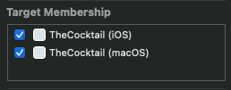

Nếu như bạn thêm một nền tảng nữa thì cũng phải chú ý tới Target đó.

## 3. Build Project

### 3.1. Preview

Lợi thế của SwiftUI đó chính là **Preview**, bạn không cần phải run project chi cho mệt mà vẫn có thể test app một cách xịn sò. Hiện tại, chúng ta chưa cần code gì hết. Chúng ta sẽ thử xem nó sẽ hiển thị ra sao trên iOS và MacOS trước.

Đầu tiên, bạn chọn lại scheme build của project là iOS.

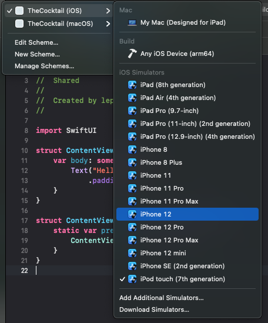

Sau đó, bạn bấm Resume ở phần Canvas của Xcode. Điều kì hiện sẽ hiện ra.

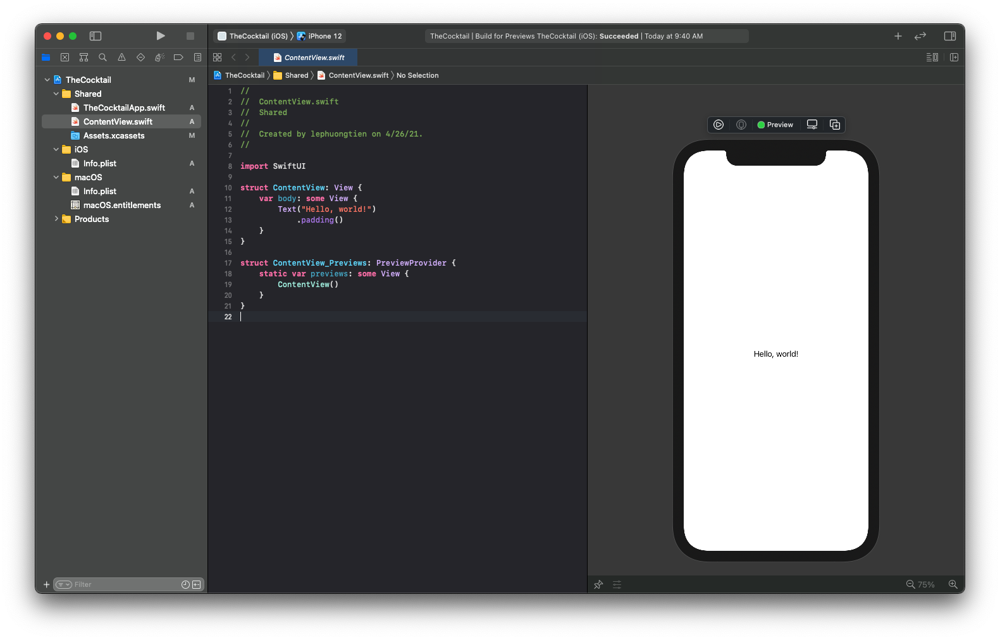

Bạn làm tương tự cho MacOS nhoé. Và nó sẽ trông như thế này.

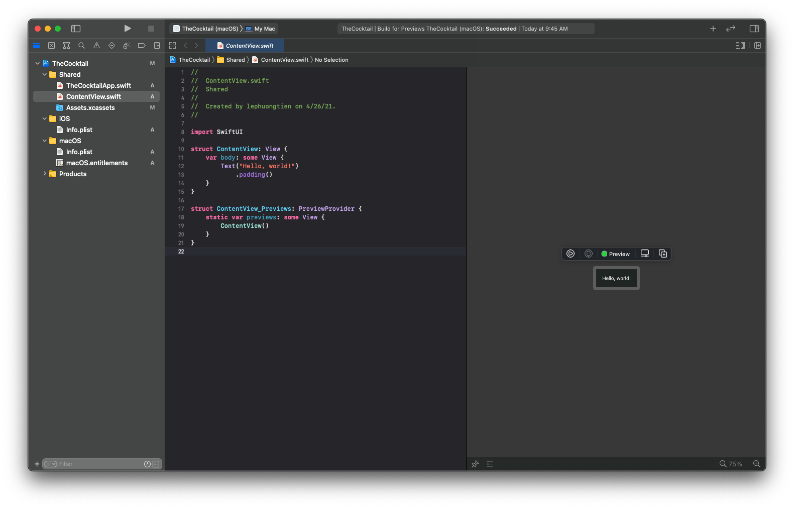

Nhìn khá là xấu xí quá đi mà.

### 3.2. Run

Sau khi, bạn đã Preview thành công và không có lỗi nào xuất hiện. Thì hãy build project lên iOS và MacOS nha. Công việc vẫn như Preview, chọn Schema và build thôi.

* iOS Simulator

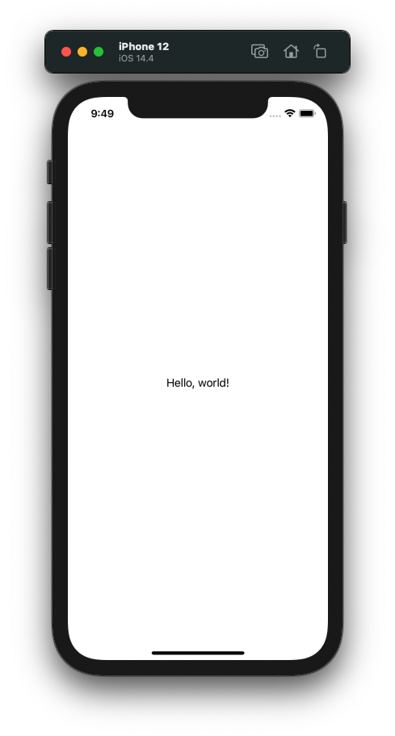

* MacOS

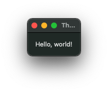

Cái nhìn đầu tiên khác là khó chịu phải không nào. Nhất là khi chạy trên MacOS lại xuất hiện một window nhỏ xí, vừa đủ chứa cái chữ mà thôi. Giờ ta sẽ config chúng nó cho đẹp hơn mới được.

### 3.3. Config View

Bắt đầu, bạn mở file **ContentView** và tiến thành thay đổi một ít code như sau.

```swift
struct ContentView: View {
    var body: some View {
        #if os(macOS)
        Text("Hello MacOS!")
            .font(.largeTitle)
            .frame(width: 500.0, height: 300.0)
            .padding()
        #else
        Text("Hello iOS!")
            .font(.title)
            .padding()
        #endif
        
    }
}
```

Trong đó:

* `if os(...)` dùng để kiểm tra xem nền tảng chúng ta sử dụng là là gì. SwiftUI đã giúp bạn làm việc này khá là đơn giản rồi đó.
* Tại mỗi điều kiện khác nhau, ta thực hiện việc config khác nhau cho View

Bạn nãy build lại ứng dụng trên iOS và MacOS để kiểm tra chúng hoạt động như thế nào.

* iOS Simulator

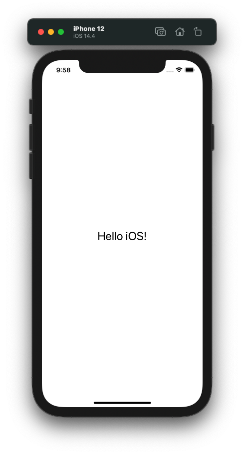

* MacOS

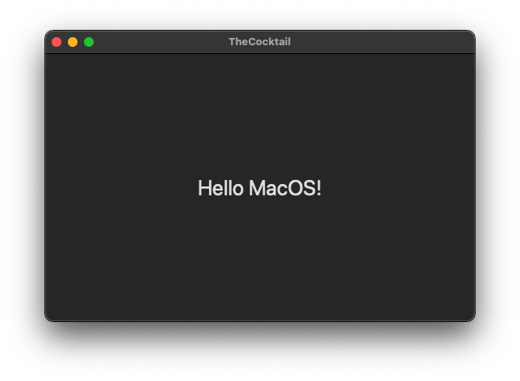

Lúc này, ứng dụng trên macOS đã đẹp rồi. Bạn có thể tuỳ biến `frame` của ứng dụng cho phù hợp.

## 4. Add more platform

### 4.1. New

Như đã nói ở trên, chúng ta sẽ thử tiếp xem SwiftUI với template mới này với nhiều nền tảng sẽ như thế nào. Ta đã có iOS & MacOS (cho mặc định khi tạo project). Do đó, ta sẽ tạo thêm một platform nữa, đó là watchOS.

Bắt đầu, tại file project và phần Target, bạn nhấn nút (+) để tạo mới một target.

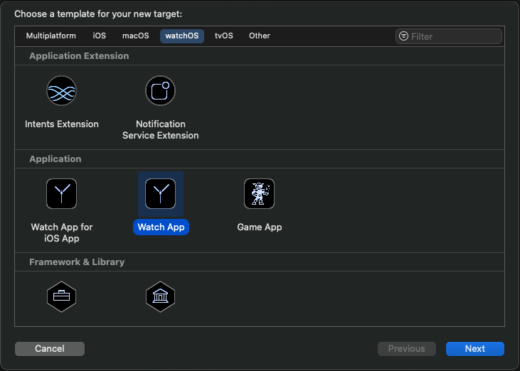

Bạn chọn tạo thêm một **Watch App** nha. Sau đó, bạn sẽ điền các thông tin vào cho Target mới này.

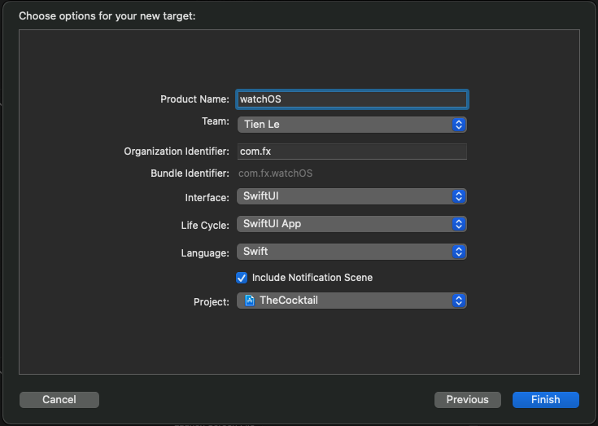

Bạn chú ý chọn đúng các thông tin để chúng đồng bộ với nhau giữa các target trong cùng một project

* SwiftUI
* SwiftUI App Life Cycle
* Project

Các file mới sẽ được thêm vào project và chúng trông như thế này.

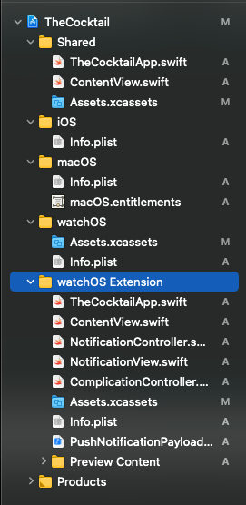

Khá là nhiều files, tuy nhiên bạn không cần quan tâm nhiều về nó. Sang phần chính của chúng ta thôi.

### 4.2. Config View

Kết hợp kiến thức mới học ở phần trên. Chúng ta sẽ tiết kiện việc coding lại bằng cách dùng chung file từ phần **Shared**. Do đó, việc đầu tiên của bạn cần làm là mạnh tay xoá đi file `ContentView.swift` ở phần **WatchOS App**.

Tiếp theo, bạn truy cập lại file `ContentView.swift` ở phần **Shared**, mở phần **File inspector** và tích thêm vào target mới tạo.

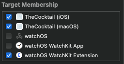

Tiếp theo nữa, bạn sẽ thay đổi code một chút tại file ContentView để có thể thấy được sự khác nhau giữa các nền tảng. Code ví dụ như sau.

```swift
struct ContentView: View {
    var body: some View {
        #if os(macOS)
        Text("Hello MacOS!")
            .font(.largeTitle)
            .frame(width: 500.0, height: 300.0)
            .padding()
        #elseif os(iOS)
        Text("Hello iOS!")
            .font(.title)
            .padding()
        #else
        Text("Hello WatchOS!")
            .font(.title)
            .padding()
        #endif
    }
}
```

Chỉ là thêm `if else` thôi nha! Bạn cần phải hiển thị được Preview cho WatchOS và công việc cũng khá đơn giản. Chọn lại target thôi.

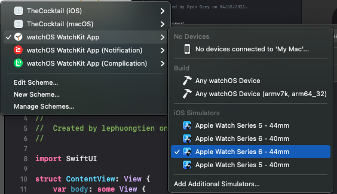

Cuối cùng, bạn hãy bấm lại Resume tại phần Canvas và xem kết quả nhoé!

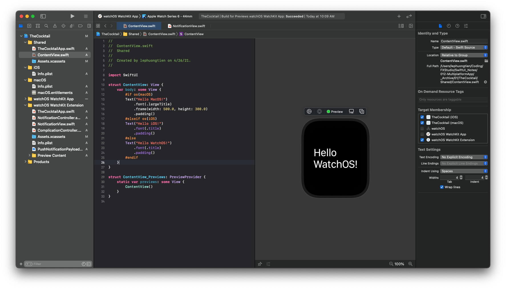

Đã xuất hiện dòng chữ `Hello WatchOS!` xịn sò rồi. Nếu bạn hiển thị được như vậy thì chúc mừng bạn đã thành công bước đầu trong việc tạo một project với Multiplatform với SwiftUI.

## Tạm kết

* Tạo project với template Multplatform App với SwiftUI & SwiftUI App
* Tìm hiểu cấu trúc project mới
* Config cho nhiều nền tảng
* Cách tuỳ chọn hiển thị với Target cho files
* Build app cho nhiều nền tảng

---

Cảm ơn bạn đã theo dõi các bài viết từ **Fx Studio** & hãy truy cập [website](https://fxstudio.dev/) để cập nhật nhiều hơn!

