# 012.2. Design Views & Make Color

Chào bạn đến với series **SwiftUI Notes** của **Fx Studio**. Ở bài viết trước, ta đã tìm hiểu việc tạo một project **Multiplatform App Template**. Học cách cấu hình các View để chúng có thể hoạt động trên các nền tảng khác nhau. Tuy nhiên, chừng đó vẫn chưa đủ khi mỗi nền tảng lại yêu cầu sự khác nhau về mặt giao diện. Do đó, bài viết này sẽ tập trung vào việc **Design Views** cho đẹp với Multiplatform App của SwiftUI.

Nếu mọi thứ đã ổn rồi, thì ...

> Bắt đầu thôi!

## Chuẩn bị

Về mặt tool và version, các bạn tham khảo như sau:

* SwiftUI 2.0
* Xcode 12

Ngoài ra, các bạn có thể checkout lại các project của các phần trước tại [đây](https://github.com/fx-studio/swiftui-notes/tree/main/012-MultiplatformApp/_Archive/). Vì lý do chúng ta sẽ phải xoá đi làm lại hơi nhiều thứ.

Về mặt kiến thức, yêu cầu bạn phải thông được phần trước của bài viết này. EZ Game!

Về project demo, bạn có thể sử dụng lại project của bài viết trước. Hoặc tạo mới một project cũng không sao. Vì hầu như chúng ta làm lại 100% cho tất cả.

## 1. Create View

Chúng ta sẽ bắt đầu thiết kế một ứng dụng theo kiểu Master-Detail. Bao gồm:

* Một view hiển thị một danh sách
* Một view hiển thị chi tiết của phân tử trong danh sách

### 1.1. Master

Bắt đầu, bạn tạo mới một file **SwiftUI View** và đặt tên là `ListCategoriesView.swift`, nó sẽ được tạo ở thư mục **Share**. Do đó, bạn chú ý tích chọn hết các Target có trong project.

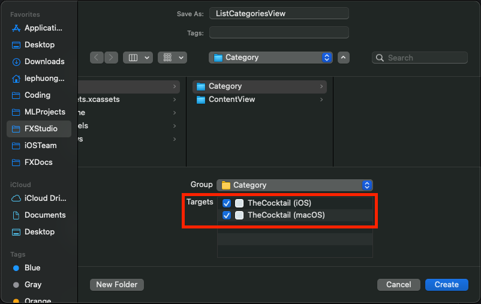

Ta sẽ hiển thị một danh sách cực kì đơn giản với đối tượng **List** của SwiftUI và 1 array **String**. Bạn xem code ví dụ như sau:

```swift
struct ListCategoriesView: View {
    
    let categories = ["Ordinary Drink",
                      "Cocktail",
                      "Milk / Float / Shake",
                      "Other/Unknown",
                      "Cocoa",
                      "Shot",
                      "Coffee / Tea",
                      "Homemade Liqueur",
                      "Punch / Party Drink",
                      "Beer",
                      "Soft Drink / Soda"]
    
    var body: some View {
        List(categories, id: \.self) { category in
            Text(category)
        }
    }
}
```

*(Chúng ta sẽ tìm hiểu về Danh sách trong SwiftUI ở phần sau nha. Ahihi!)*

Sau đó, bạn nhất thử Resume để xem kết quả như thế nào.

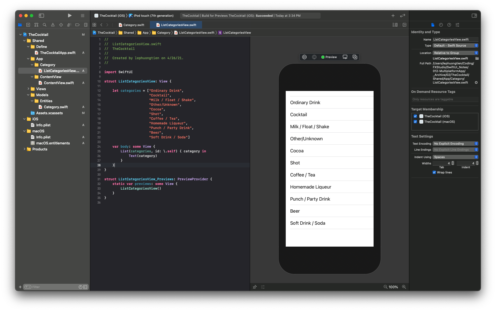

### 1.2. Detail

Tiếp theo, bạn cần phải tạo thêm một file SwiftUI View nữa và đặt tên là `CategoryDetailView.swift`. Và cũng làm đầy đủ thủ tục như file master. Code tham khảo như sau:

```swift
import SwiftUI

struct CategoryDetailView: View {
    
    var name: String
    
    init(name: String) {
        self.name = name
    }
    
    var body: some View {
        Text("Detail of \(name)")
            .navigationTitle(name)
    }
}

struct CategoryDetailView_Previews: PreviewProvider {
    static var previews: some View {
        CategoryDetailView(name: "ABC")
    }
}
```

### 1.3. Navigation

Ta cũng cần phải chỉnh sửa lại cho **ListCategoriesView** của chúng ta với một Navigation. Và cũng chính nhờ Navigation đó mà ta có thể di chuyển từ List sang Detail. Tham khảo code như sau.

```swift
    var body: some View {
        NavigationView {
            List(categories, id: \.self) { category in
                Text(category)
            }
            .navigationTitle("Categories")
        }
    }

```

Trong đó:

* **NavigationView** được dùng là đối tượng điều hướng
* **Title** của NavigationBar sẽ được khai báo bằng việc gọi modifier `.navigationTitle("Categories")`

Cuối cùng, chúng ta sẽ dùng đối tượng NavigationLink để điều hướng từ màn hình này sang màn hình kia. Code ví dụ như sau

```swift
var body: some View {
        NavigationView {
            List(categories, id: \.self) { category in
                NavigationLink(
                    destination: CategoryDetailView(name: category),
                    label: {
                        Text(category)
                    })
            }
            .navigationTitle("Categories")
        }
    }
```

Bạn hãy bấm Live Preview và cảm nhận kết qua nha.

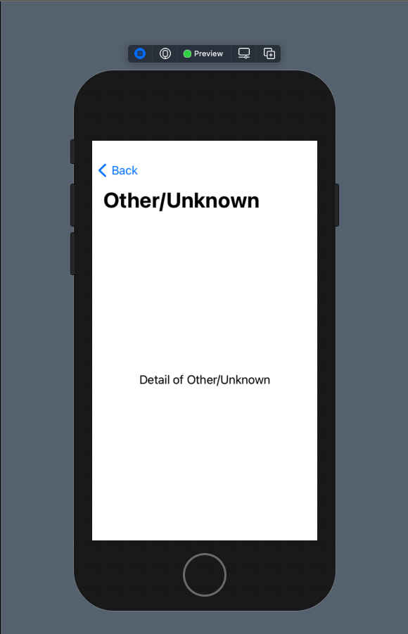

## 2. Running on MacOS

Trước tiên, bạn hãy chỉnh sửa lại file App của project. Với mục đích đưa màn hình Master lên đầu tiên. Bạn truy cập vào file App ở Shared và thay ContentView bằng ListCategoriesView là ổn.

```swift
import SwiftUI

@main
struct TheCocktailApp: App {
    var body: some Scene {
        WindowGroup {
            ListCategoriesView()
        }
    }
}
```

### 2.1. MacOS

Ta đang design View với iOS. Và thử build ứng dụng lên MacOS xem như thế nào. Bạn hãy chọn lại scheme và build nha.

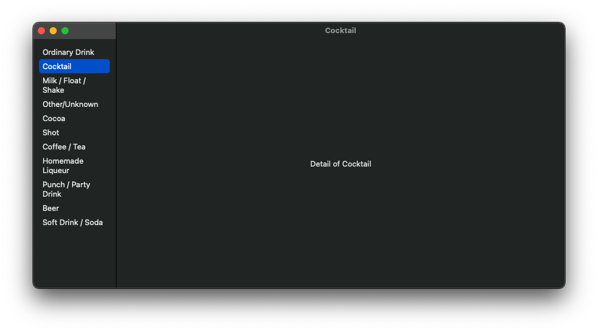

Giao diện của ứng dụng sẽ trông rất khác với iOS. Thậm chí còn khác suy nghĩ ban đầu của bạn. Khi mà với MacOS cả Master & Detail đều xuất hiện ngay từ lúc đầu.

### 2.2. iPad

Và giao diện này sẽ hơi giống với việc bạn chạy app trên iPad. Bạn hãy Build với iPad và kiểm tra xem như thế nào

* Chế độ portrait

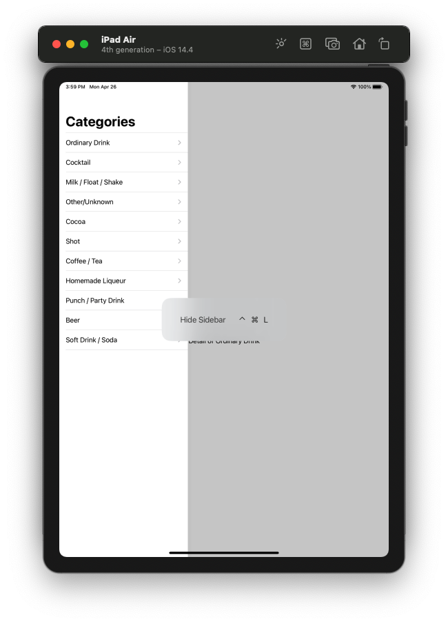

* Chế độ landscape

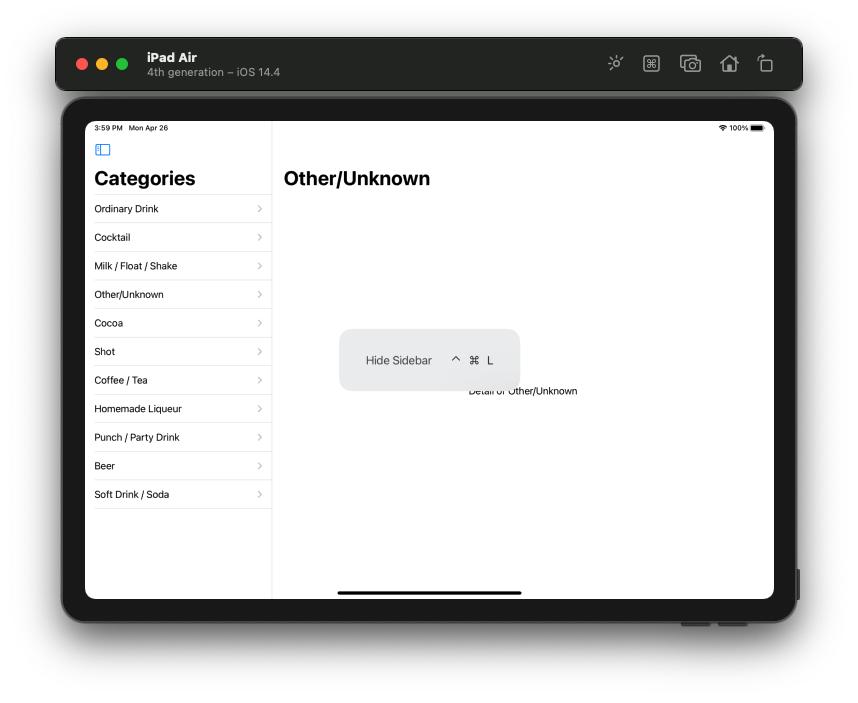

Bạn cũng tự nhận ra sự tương đồng giữa các nền tảng trong cùng một hệ sinh thái rồi đấy. Điều này có nghĩa là gì?

## 3. Adapts to the Platform

> Đó chính là sự tương thích của SwiftUI cho từng nền tảng.

Về mặt giao diện, SwiftUI tự động điều chỉnh các đối tượng UI tương thích với nền tảng mà ứng dụng đang hoạt động. Ví dụ trên

* Với iOS, đó là một màn hình với danh sách hiển thị. Người dùng kích vào mỗi item thì sẽ được điều hướng sang màn hình khác
* Với MacOS, đó là một màn hình với 1 sidebar là một danh sách. Detail sẽ ở phần bên cạnh
* Còn với iPad (hay iPadOS), chúng sẽ kết hợp cả 2 đối với một chế độ.

Điều này có ý nghĩa gì?

* Bạn chỉ cần học code một lần, hay viết code một lần. Và chúng sẽ hiển thị được với nhiều thiết bị
* Nếu ứng dụng đơn giản thì bạn không cần quan tâm nhiều tới việc tuỳ biến code sao cho hợp lý. SwiftUI sẽ tự động làm việc đó.
* Giảm tải đi thời gian phát triển ứng dụng, nhất là chon nhiều nền tảng

Tới được đây, mình hi vọng bạn đã cảm thấy được thế mạnh của SwiftUI mang lại với các nền tảng của Apple. Và biết đâu được, SwiftUI sẽ trở thành một chuẩn giao diện cho các nền khác Apple hay sao. Vì Apple đã cho Swift là mã nguồn mở từ khi nó được ra mắt rồi.

## 4. Design Views

Nhằm để thấy được sự khác nhau của giao diện với cùng một code SwiftUI khi chạy trên những nền tảng khác nhau của Apple. Chúng ta sẽ thực hiện việc demo bằng cách thiết kết thêm cho project những view mới. 

### 4.1. Minimum width

Chắc ít nhiều bạn cũng đã sử dụng modifier `.frame` cho các SwiftUI View rồi. Trong số các tham số đó, thì `minWidth` , `maxWidth` , `minHeight` & `maxHeight` chắc bạn sẽ thấy nó ít tác dụng. Tuy nhiên, với môi trường là Multiplatform App thì đây là một trong những thuộc tính hay nhất.

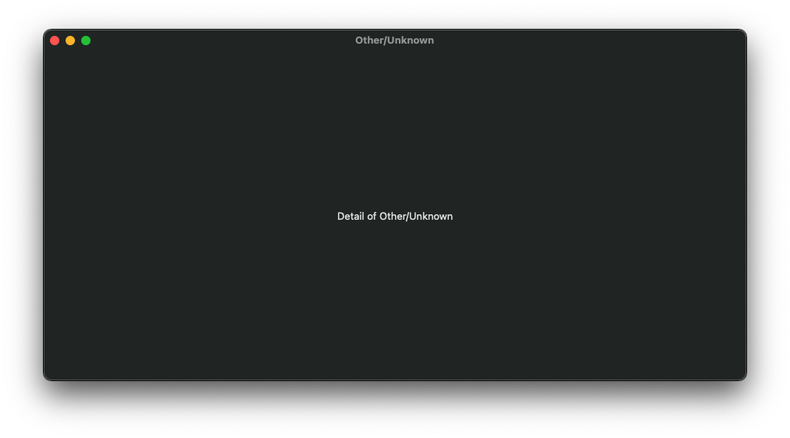

Hình trên là ứng dụng của chúng ta khi chạy trên MacOS và lỡ tay kéo phần Master thu nhỏ lại quá. Và chúng ta mất nó luôn. Để khắc phục điều này ta sẽ dùng tới thuộc tính `frame` với tham số `minWidth`. Bạn update lại code của **ListCategoriesView** với modifier như sau.

```swift
    var body: some View {
        NavigationView {
            List(categories, id: \.self) { category in
                NavigationLink(
                    destination: CategoryDetailView(name: category),
                    label: {
                        Text(category)
                    })
            }
            .navigationTitle("Categories")
            .frame(minWidth: 300)
        }
        
    }
```

Trong đó, bạn chỉ cần quan tâm tới `frame(minWidth: 300)`. Nó sẽ định hình kích thước view của bạn. Ngoài `minWidth` thì chúng ta còn có `maxWidth` và cho chiều `height` nữa. 

Build lại demo và xem kết quả nào

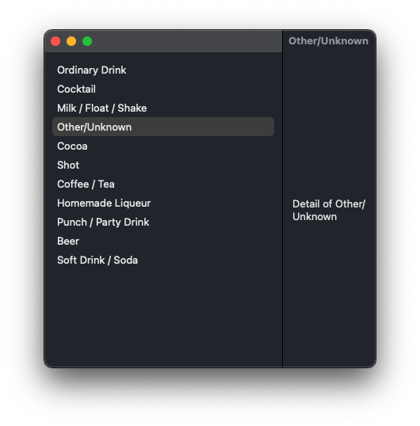

Cho dù bị resize thế nào thì phần Master vẫn có một kích thức tối thiểu.

### 4.2. Master List

Ta sẽ làm lại Master với các cell (item) được define bằng một View riêng. Bạn tạo mới một file SwiftUI View và đặt tên là **CategoryCell**. Code ví dụ cho cell như sau:

```swift
import SwiftUI

struct CategoryCell: View {
    var item: Category
    var color = Color.black.opacity(0.5)
    @State var isActive = false
    
    init( item: Category) {
        self.item = item
    }
    
    var body: some View {
        ZStack(alignment: .bottom) {
            Image(item.thumbnail)
                .resizable()
                .frame(maxWidth: .infinity, minHeight: 100.0, maxHeight: 200.0)
                .clipped()
            Text(item.name)
                .frame(maxWidth: .infinity)
                .padding(.vertical, 5.0)
                .font(.title)
                .background(color)
                .foregroundColor(Color.white)
        }
        .clipShape(RoundedRectangle(cornerRadius: 10.0))
        .background(
            NavigationLink(
                destination: CategoryDetailView(name: item.name),
                isActive: $isActive,
                label: {
                    EmptyView()
                })
        )
        .onTapGesture {
            self.isActive.toggle()
        }
    }
}

struct CategoryCell_Previews: PreviewProvider {
    static var item = Category(name: "ABC", thumbnail: "img1")
    static var previews: some View {
        CategoryCell(item: item)
    }
}
```

Ta sẽ thêm các thiết kế cho cell như sau:

* 1 thuộc tính `item` với kiểu dữ liệu là **Category**, chứa thông tin của cell
* Giao diện bao gồm một Image & Text để hiển thị thông tin
* Sự kiện khi người dùng `tap` vào cell thì sẽ di chuyển sang màn hình Detail.

Về phần dữ liệu thì bạn tạo thêm một file Swift và đặt tên là Category. Code ví dụ như sau:

```swift
struct Category: Identifiable {
    let id = UUID()
    var name: String
    var thumbnail: String
}
```

Quan trọng nhất là kế thừa protocol `Identifiable`. Nó giúp mỗi item trong array được định danh riêng biệt. Từ đó đối tượng List sẽ tự động nhận biết vào re-use các cell cho phù hợp. 

Bạn mở file ListCategoriesView và thay đổi một tí cho List. Code ví dụ như sau:

```swift

struct ListCategoriesView: View {
    
    var categories = Category.getCategories()
    
    var body: some View {
        NavigationView {
            List(categories) { category in
                CategoryCell(item: category)
            }
            .frame(minWidth: 300.0)
            .navigationTitle("Categories")
        }
    }
}
```

Trong đó:

* `categories` là array các Category. Ta dùng dummy data để làm dữ liệu hiển thị cho Master
* Phần **List** thu gọn lại với array có sắn `identifier`
* Điều hướng **NaviagtionLink** được đưa vào Cell

Ta build lại trên macOS để xem kết quả. Bạn cũng có thể build thêm trên iOS. Tuy nhiên, với iOS thì chúng ta qúa quen rồi, không còn gì bất ngờ nữa.

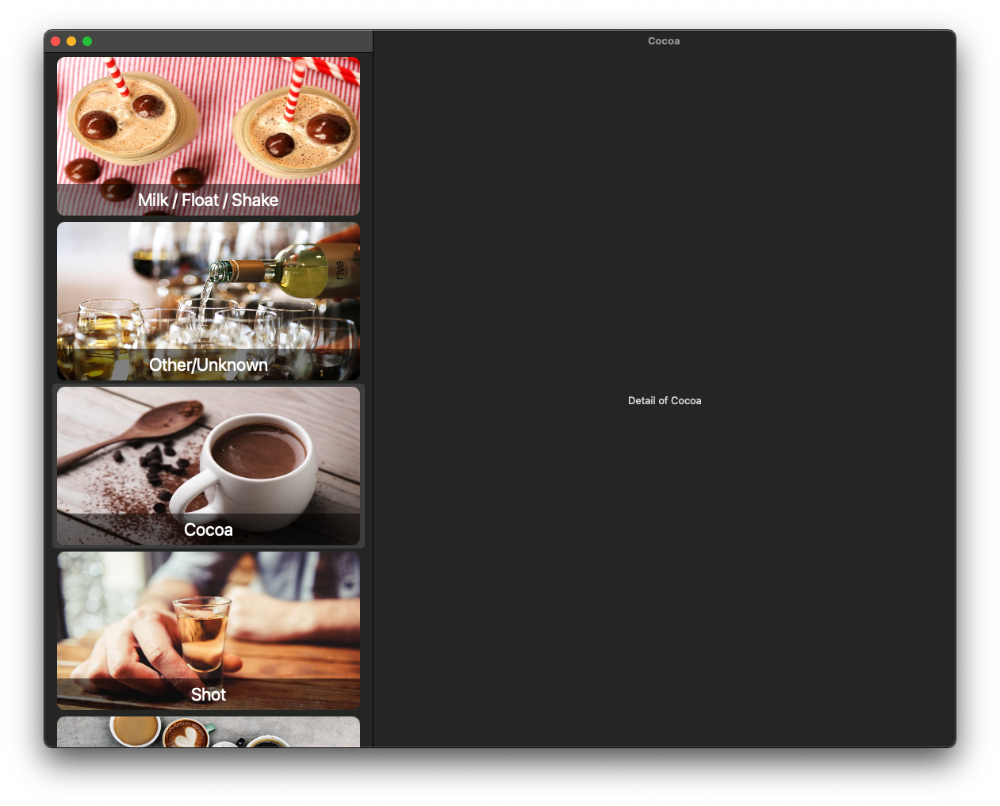

Cuối cùng, bạn đã có một ứng dụng Master-Detail xịn sò trên MacOS rồi đó. Và cái nhìn đầu tiên cho sự khác như với Master-Detail trên iOS & MacOS là:

* MacOS: Maviagtion sẽ hiển thị cả 2 view Master & Detail. Khi kích vào các cell trong Master thì Detail sẽ thay đổi. Ngoài ra, bạn có thể cung cấp một View Mặc định cho Detail lúc mới khởi tạo và chưa chọn cell nào.
* iOS : sẽ chia ra 2 view riêng biệt. Một cho Master và một cho Detail. Khi kích vào cell trong Master thì Detail sẽ được push vào thông qua Naviagtion.

### 4.3. Tabbar

Chứng kiến thêm sự khác nhau nữa của 2 nền tảng. Ta sẽ nâng cấp độ phức tạp của demo lên cấu trúc Tabbar. Trong đó:

* Tabbar sẽ là View root của ứng dụng
* Mỗi Tabbar sẽ là một Navigation Master-Detail

Bạn cần tạo mới một file SwiftUI View và đặt tên là Tabbar. Code cho Tabbar thì bạn tham khảo sau đây, cụ thể nó như thế nào thì chúng ta sẽ tìm hiểu ở phần tiếp theo của series.

```swift
struct Tabbar: View {
    var body: some View {
        // TABBAR
        TabView {
            // #1
            ListCategoriesView(title: "Cocktail")
            .tabItem {
                Label("Cocktail", systemImage: "heart.fill")
            }
            // #2
            ListCategoriesView(title: "Glass")
            .tabItem {
                Label("Glass", systemImage: "staroflife.circle")
            }
            // #3
            ListCategoriesView(title: "Alcoholic")
            .tabItem {
                Label("Alcoholic", systemImage: "atom")
            }
        }
    }
}
```

Để tiện cho việc nhận biết các Naviagtion của mỗi **Categories** thì mình thêm thuộc tính `title` và dùng nó để xét title cho **NavigationBar**. Và code update cho **ListCategoriesView** như sau:

```swift
struct ListCategoriesView: View {
    
    var categories = Category.getCategories()
    var title: String
    
    init(title: String) {
        self.title = title
    }
    
    var body: some View {
        NavigationView {
            List(categories) { category in
                CategoryCell(item: category)
            }
            .frame(minWidth: 300.0)
            .navigationTitle(title)
        }
    }
}
```

Cuối cùng, chúng ta sẽ cập nhật lại App File của project. Thay **Tabbar** cho **ListCategoriesView**.

```swift
@main
struct TheCocktailApp: App {
    var body: some Scene {
        WindowGroup {
            Tabbar()
        }
    }
}
```

Sau khi đã thêm các file và các view mới. Bạn tiến hành build ứng dụng lên iOS và MacOS nha.

* iOS

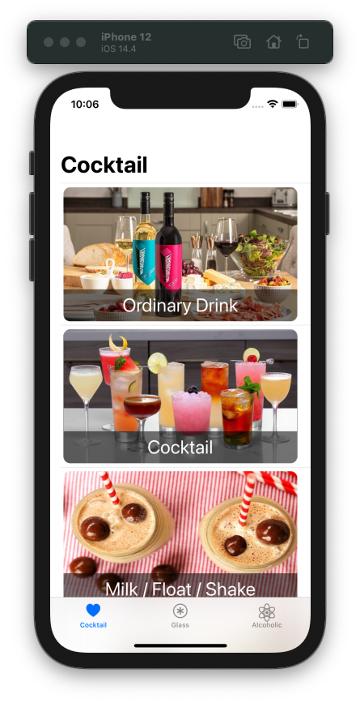

* MacOS

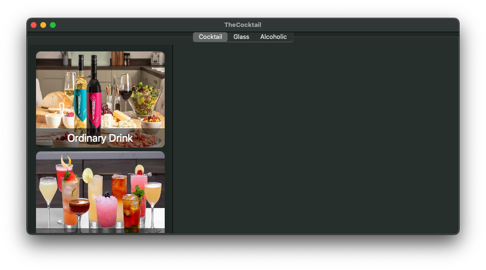

Qua trên, bạn cũng nhân ra sự khác biệt về giao diện trên mỗi nền tảng là cũng có lúc rất là lớn. Lần này, chúng ta không thể nào dùng chung một code SwiftUI để build chúng cho 2 nền tảng nữa rồi. Bây giờ, chúng ta cần tìm một lối đi mới.

## 5. Sidebar

Ta đã có design ứng dụng như trên. Tuy nhiên, về giao diện trên MacOS sẽ đem lại trải nghiệm người dùng không tốt bằng trên iOS. Do đó, ta sẽ thực hiện việc thay đổi tuỳ biến cho riêng macOS.

> Trên macOS, chúng ta có một màn hình phụ nhỏ với tên là `SideBar`. Ta sẽ sử dụng nó để tối ưu giao diện ứng dụng.

### 5.1. Create

Bạn sẽ tạo mới 1 file SwiftUI View với tên là SideBar. Ngoài ra, vì view này chỉ dùng cho MacOS nên bạn chọn Target cho MacOS và đặt nó vào thư mục MacOS. Code tham khảo của nó như sau:

Bạn sẽ thêm một thuộc tính mới và mình đặt tên là `sideBar`. Code tham khảo như sau:

```swift
var sideBar: some View {
        List {
            NavigationLink(
                destination: ListCategoriesView(title: "Cocktail"),
                label: {
                    Label("Cocktail", systemImage: "heart.fill")
                })
            NavigationLink(
                destination: ListCategoriesView(title: "Glass"),
                label: {
                    Label("Glass", systemImage: "staroflife.circle")
                })
            NavigationLink(
                destination: ListCategoriesView(title: "Alcoholic"),
                label: {
                    Label("Alcoholic", systemImage: "atom")
                })
        }
        .frame(minWidth: 200)
        .listStyle(SidebarListStyle())
        .toolbar {
          // 4
          ToolbarItem {
            Button(action: toggleSideBar) {
              Label("Toggle Sidebar", systemImage: "sidebar.left")
            }
          }
        }
    }
```

Trong đó:

* `sideBar` là một SwiftUI View với kiểu là `some View`
* Ta cung cấp cho `sideBar` với nội dung là một đối tượng **List**
* List này có 3 item. Chính là 3 Tab của Tabbar ở trên
* Ta sẽ điều hướng khi kích vào 3 item đó tới 3 màn hình Master khác nhau
* Bạn chú ý về `listStyle(SidebarListStyle())` để xác định List của chúng ta là một SideBar
* Về `toolbar` thì bạn chưa cần quan tâm.

### 5.2. Toolbar

Giờ thì chúng ta đi vào xem xét `toolbar` có những gì. Nó cũng khá giống với `UIToolBar` trong UIKit. Khi bạn muốn thêm các sự kiện vào thanh naviagtion hoặc toolbar.

Còn với phần `sidebar` này ta sẽ thêm 1 Button. Button này có nhiệm vụ ẩn hiện SideBar khi ứng dụng chạy trên MacOS.

Bạn tiếp tục thêm đoạn code quản lý việc ẩn hiện SideBar như sau:

```swift
    func toggleSideBar() {
      NSApp.keyWindow?.firstResponder?.tryToPerform(
        #selector(NSSplitViewController.toggleSidebar), with: nil)
    }
```

(Cụ thể code đó như thế nào, chúng ta sẽ tìm hiểu ở phần sau của series nha. Giờ quá nhiều kiến thức được truyền tải tải rồi.)

### 5.3. Combine Views

Bây giờ, chúng ta sẽ kết hợp các phần trên lại để tạo giao diện theo ý muốn. Vẫn ở file **Sidebar** và chúng ta sẽ chỉnh sửa `body` như sau:

```swift
    var body: some View {
        NavigationView {
            sideBar
            Text("Welcome to The Cocktail!")
                .foregroundColor(Color.white)
                .navigationTitle("Welcome")
        }
    }
```

Trong đó:

* Bạn có body là một NavigationView với 2 View con
* `sideBar` sẽ hiển thị danh sách và nó nằm trong sidbar vì đã được xét style ở trên
* Một màn hình detail phụ khi bắt đầu chạy ứng dụng. Lúc này chúng ta chưa chọn item nào trên Sidebar thì nó sẽ được hiển thị ở Detail

### 5.4. Build

Ta tiếp tục bằng việc build ứng dụng lên MacOS để kiểm tra xem SideBar hoạt động ra sao. Trước tiên, bạn cần cập nhật lại App File để có thể build được trên MacOS và chọn đúng SwiftUI View.

```swift
@main
struct TheCocktailApp: App {
    var body: some Scene {
        WindowGroup {
            #if os(macOS)
            Sidebar()
            #else
            Tabbar()
            #endif
        }
    }
}
```

(Bạn hãy sửa lại Target của Tabbar và di chuyển nó vào thư mục iOS. Vì lúc này nó chỉ có ý nghĩa cho iOS mà thôi)

Ta xem kết quả như sau:

* Hiển thị SideBar

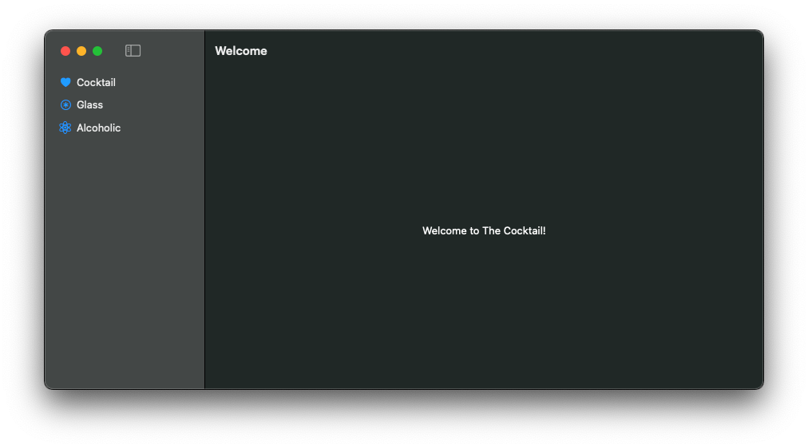

* Ẩn SideBar

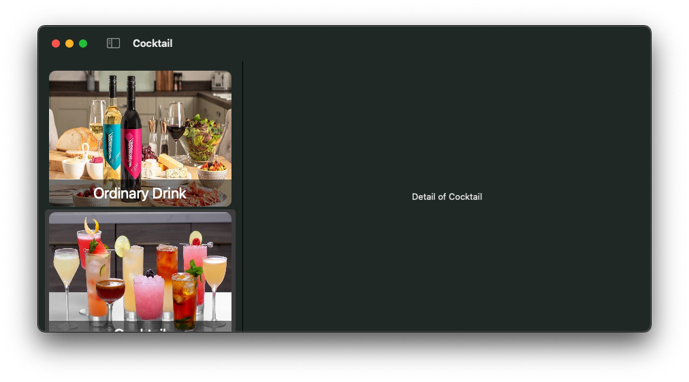

Bây giờ, bạn đã có một ứng dụng Multiplatform App hoàn chỉnh với SwiftUI rồi. Nó có giao diện thích hợp với từng nền tảng khác nhau.

## Tạm kết

* Thiết kế hiển thị các View trên các nền tảng
* Sự tính toán hợp lý về kích thước ứng dụng khi chạy trên mỗi nền tảng, tránh việc vỡ layout
* Tạo ra sự khác biệt giữa giao diện để ứng dụng tương thích với mỗi nền tảng khác nhau
* Sử dụng được SideBar cho MacOS và tuỳ biến SideBar
* Sử dụng được Toolbar đơn giản

---

Cảm ơn bạn đã theo dõi các bài viết từ **Fx Studio** & hãy truy cập [website](https://fxstudio.dev/) để cập nhật nhiều hơn!