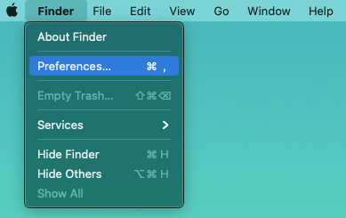
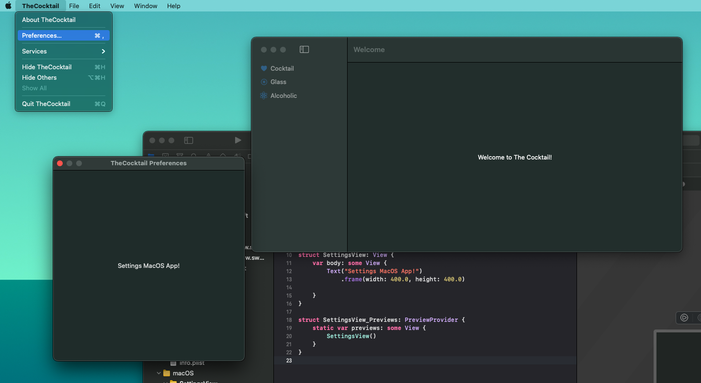
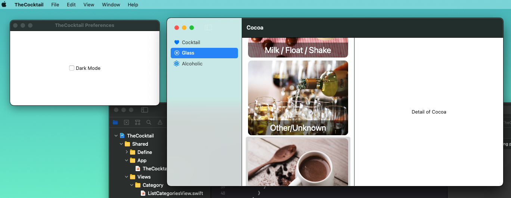
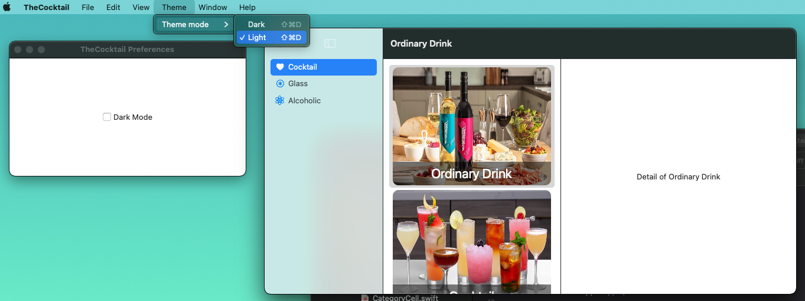

# 012.3 - Extra Functions

Chào bạn đến với series **SwiftUI Notes** của **Fx Studio**. Đây là bài viết cuối cho phần SwiftUI với **Multiplatform App**. Chủ đề của bài viết liên quan tới các tính năng có trên MacOS. Và giúp bạn hoàn thiện ứng dụng của mình trên MacOS.

Nếu mọi thứ ổn rồi, thì ...

> Bắt đầu thôi!

## Chuẩn bị

Về mặt tool và version, các bạn tham khảo như sau:

- SwiftUI 2.0
- Xcode 12

Ngoài ra, các bạn có thể checkout lại các project của các phần trước tại [đây](https://github.com/fx-studio/swiftui-notes/tree/main/012-MultiplatformApp/_Archive/). Vì lý do chúng ta sẽ phải xoá đi làm lại hơi nhiều thứ.

Về mặt kiến thức, yêu cầu bạn phải thông được phần trước của bài viết này. EZ Game!

Về project demo, bạn có thể sử dụng lại project của bài viết trước. Hoặc tạo mới một project cũng không sao. Vì hầu như chúng ta làm lại 100% cho tất cả.

## 1. Preferences View



Đây là phần có riêng cho MacOS và nó xuất hiện ở Menu. Nếu bạn đã đọc bài viết về Mac Catalyst thì mình cũng trình bày Preferences tại [đây](https://fxstudio.dev/mac-catalyst-app-swiftui-notes-19/#2_Edit_Settings_iOS_MacOS). Còn với phần mới này, chúng ta sẽ học một cách tạo khác cho nó.

### 1.1. Create Settings View

Bạn hay tạo mới một **SwiftUI View**, đặt tên như thế nào cũng được. Mình chọn là `SettingsView` cho nó ngầu. Bạn tạm thời để code mặc đinh. Thêm một modifier là `.frame` cho nó có kích thước.

```swift
import SwiftUI

struct SettingsView: View {

    var body: some View {
        Text("Settings MacOS App!")
           .frame(width: 400, height: 400, alignment: .center)
    }
}

struct SettingsView_Previews: PreviewProvider {
    static var previews: some View {
        SettingsView()
    }
}
```

Vẫn là những đoạn code quen thuộc và bạn cần chú ý tới Target của nó. Vì SwiftUI View này chúng ta sẽ chỉ dùng cho `MacOS` mà thôi.

Tiếp theo, bạn cần sử dụng nó vào ứng dụng của bạn. Chúng ta sẽ về lại file **App** (trong demo nó có tên là `TheCocktailApp.swift`). Bạn sẽ thêm một đoạn code sau vào `body` của **App**. Và nó không thuộc **WindowGroup**. Code như sau:

```swift
        #if os(macOS)
        Settings {
            SettingsView()
        }
        #endif
```

>  Với SwiftUI App thì Preferences View chính là **Settings**. 

Cuối cùng, bạn hãy build lại ứng dụng với MacOS và test xem nó đã xuất hiện ra hay chưa.



### 1.2. Update Data & UI

Công việc tiếp theo sẽ là làm màu cho **SettingsView** để nó được đẹp hơn và đầy đủ tính năng nhiều hơn. Ta sẽ thiết kế giao diện để bật/tắt chế độ màu sắc của ứng dụng.

* Dark Mode
* Light Mode

Phần giao diện mới của **SettingsView** như sau.

```swift
var body: some View {
        VStack {
            HStack {
                Toggle(isOn: $isColorMode) {
                    Text("Dark Mode")
                }
            }
        }
        .frame(width: 400, height: 200, alignment: .center)
        .colorScheme(isColorMode ? .dark : .light)
        .background(isColorMode ? Color.gray : Color.white)
    }
```

Bạn thấy chúng ta có 2 biến mới, đó là `colorScheme` & `isColorMode`. Do đó, bạn thêm tiếp 2 thuộc tính mới này cho SettingsView.

```swift
    @Environment(\.colorScheme) var colorScheme: ColorScheme
    @AppStorage("isColorMode") var isColorMode: Bool = false
```

Trong đó:

* `colorScheme` sẽ lấy biết môi trường của thiết bị
* `isColorMode` dùng để vừa lưu trữ trong UserDefault, vừa dùng làm biến cho các SwiftUI View phản ứng theo.

Bài toán lúc này sẽ là:

* Nếu lần chạy đần tiên, chúng ta kiểm tra xem thiết bị đang ở chế độ nào và gán giá trị cho `isColorMode`
* Qua các lần chạy sau đó thì với `@AppStore` thì app sẽ hoạt động bất chấp biến môi trường của thiết bị là gì.

Bạn cập nhật thêm hàm `init()` cho **SettingsView** như sau:

```swift
    init() {
        if (UserDefaults.standard.object(forKey: "first") == nil) {
            if colorScheme == .dark {
                isColorMode = true
            } else {
                isColorMode = false
            }
            
            UserDefaults.standard.setValue(true, forKey: "first")
        }
    }
```

### 1.3. Sử dụng

Ở đoạn code của `body` trong **SettingsView**. Bạn chú ý 2 dòng code cho 2 modifier sau:

```swift
        .colorScheme(isColorMode ? .dark : .light)
        .background(isColorMode ? Color.gray : Color.white)
```

Tư tưởng SwiftUI thì bạn không cần phải lo tới việc cập nhật lại giao diện. Bạn chỉ cần cài đặt các View ràng buộc dữ liệu với các thuộc tính (theo lý thuyết *Nguồn sự thật chân lý*). 

Bây giờ, bạn muốn phần này của ứng dụng có thể phản ứng theo việc tuỳ chọn màu sắc này thì cũng chỉ cần khai báo thêm thuộc tính sau

```swift
@AppStorage("isColorMode") var isColorMode: Bool = false
```

Cách sử dụng sẽ bao gồm 2 phần như sau:

*  Cho từng phần View riêng lẻ

```swift
        Text("Detail of \(name)")
            .frame(maxWidth: .infinity, maxHeight: .infinity)
            .navigationTitle(name)
            .colorScheme(isColorMode ? .dark : .light)
            .background(isColorMode ? Color.gray : Color.white)
```

* Cho toàn bộ một View hoặc một nhóm View

```swift
        WindowGroup {
            #if os(macOS)
            Sidebar()
                .colorScheme(isColorMode ? .dark : .light)
            #else
            Tabbar()
                .colorScheme(isColorMode ? .dark : .light)
            #endif
        }
```

Vì SwiftUI rất linh hoạt, nên chỉ cần View lớn nhất bị ảnh hưởng thì toàn bộ các View con sẽ bị ảnh hưởng theo. Cuối cùng, bạn build lại ứng dụng lên MacOS và test xem kết quả như thế nào.



## 2. Menu

Ở phần trên, bạn muốn hiển thị Preferences View thì phải truy cập từ Menu. Và Menu cũng là một tính năng đặc biệt trên MacOS. 

> Mình cũng đã có một bài viết cơ bản về Menu cho ứng dụng MacOS với SwiftUI. Bạn hãy đọc thêm tại [đây](https://fxstudio.dev/mac-catalyst-app-swiftui-notes-19/#3_Basic_MacOS_Menu).

### 2.1. Create Menu

Về lý thuyết đã có ở trên. Công việc chúng ta bây giờ rất đơn giản. Tạo 1 Menu mới và có thể lựa chọn chế độ màu sắc theo Light hay Dark.

Bắt đầu, bạn hãy tạo một SwiftUI View. Tuy nhiên, chúng ta sẽ đặt tên là `AppCommands`. Code tham khảo như sau:

```swift
import SwiftUI

struct AppCommands: Commands {
    
    @AppStorage("isColorMode") var isColorMode: Bool = false
    
    var body: some Commands {
        CommandMenu("Theme") {
            Picker(selection: $isColorMode, label: Text("Theme mode")) {
                Text("Dark").tag(true)
                Text("Light").tag(false)
            }
        }
    }
}
```

Trong đó:

* `isColorMode` là thuộc tính quản lý UserDefault cho biến `isColorMode` mà chúng ta đã tạo ở phần trên.
* Với `@AppStore` thì bạn không cần vất vả tìm cách update lại giá trị hay lắng nghe sự thay đổi của giá trị
* `body` lần này sẽ mang kiểu là **Commands**
* Cần phải trả về một **CommandMenu**
* Lựa chọn phần tử là **Picker** để hiện thị 2 tuỳ chọn và trạng thái hiện tại đang ở chế độ nào
* Với từ khoá `$` trước biến `isColorMode` khi sử dụng cho Picker. Giúp việc tự động cập nhật giá trị của thuộc tính đó khi người dùng thao tác trên giao diện (hay gọi là Binding)

Vì mọi thứ đã được kết nối giữa View và dữ liệu rồi. Nên chúng ta thay đổi tại Menu thì cũng sẽ ảnh hưởng toàn bộ ứng dụng. 

Cuối cùng, bạn hãy về file App và thêm modifier cho WindowGroup để kích hoạt thêm Menu cho ứng dụng MacOS của chúng ta. Code như sau:

```swift
        WindowGroup {
            #if os(macOS)
            Sidebar()
                .colorScheme(isColorMode ? .dark : .light)
            #else
            Tabbar()
                .colorScheme(isColorMode ? .dark : .light)
            #endif
        }
        .commands {
            AppCommands()
        }
```

Build lại ứng dụng trên MacOS và tận hưởng kết quả nào!



### 2.2. Keyboard Shortcut

Nếu bạn chú ý thì sẽ thấy các kí tự `shortcut` cho Menu vừa tạo. Đó chính là phím tắt để sử dụng các Commands trên Menu của ứng dụng MacOS.

Cách để thêm nó như sau, bạn thêm modifire sau vào **Picker** ở **AppCommands**.

```swift
.keyboardShortcut("D", modifiers: [.command, .shift])
```

Trong đó:

* `keyboardShortcut` để tạo phím tắt
* `"D"` là định nghĩa phím tắt sẽ là **phím D**
* Tổ hợp phím tắt kết hợp sẽ là `Command` & `Shift`. Các phím khác bạn tự tìm hiểu

Ngoài ra, bạn có thể thay đổi lại các Menu mặc định (New, Edit ...), hoặc xoá chúng. Hoặc xác định vị trí thêm vào trước/sau của các Menu mặc định.

## Tạm kết

* Thêm các tính năng đặc trưng cho MacOS là Preferences View & Menu
* Cập nhật dữ liệu cho toàn bộ ứng dụng thông qua UserDefault & @AppStore
* Ràng buộc giao diện với các dữ liệu dùng chung
* Kết hợp toàn bộ với nhau (Menu & Preferences) để thay đổi dữ liệu

---

Cảm ơn bạn đã theo dõi các bài viết từ **Fx Studio** & hãy truy cập [website](https://fxstudio.dev/) để cập nhật nhiều hơn!