# 013.1 - Text

Chào bạn đến với **Fx Studio** và series **SwiftUI Notes**. Bài viết này sẽ tập trung vào đối tượng SwiftUI View là **Text**. Chủ yếu mang tính chất giới thiệu & trình bày cách đặt trưng của **Text**.

> Bắt đầu thôi

## Chuẩn bị

Về mặt tool và version, các bạn tham khảo như sau:

- SwiftUI 2.0
- Xcode 12

Về mặt kiến thức, bạn cần biết trước các kiến thức cơ bản với SwiftUI & SwiftUI App. Tham khảo các bài viết sau, nếu bạn chưa đọc qua SwiftUI:

* [Làm quen với SwiftUI](https://fxstudio.dev/swiftui-phan-1-lam-quen-voi-swiftui/)
* [Cơ bản về ứng dụng SwiftUI App](https://fxstudio.dev/swiftui-phan-2-co-ban-ve-ung-dung-swiftui-app/)

Về mặt demo, hầu như là demo đơn giản, vì tập trung vào từng view riêng lẻ. Do đó, bạn cũng không cần phải quá lo lắng và việc tạo mới project cũng không ảnh hưởng gì nhiều.

*(Mặc định, mình xem như bạn đã biết về cách tạo project với SwiftUI & SwiftUI App rồi.)*

## Text

> A view that displays one or more lines of read-only text.

Theo Apple thì **Text** là một SwiftUI View. Nó dùng để hiển thị các dòng văn bảng (1 hoặc nhiều). Người dùng chỉ đọc được và không có tương tác nào để thay đổi giá trị của chúng.

Với UIKit, thì **Text** giống như **UILabel**. Công dụng và đặc trưng cũng khá là tương đồng với nhau ... Bây giờ, bạn hãy tạo mới một project với SwiftUI và bắt tay vào việc tìm hiểu **Text** như thế nào.

## 1. Displaying a Simple Text

Để tiện cho việc demo nhiều loại SwiftUI View thì bạn hãy tạo mới một file **SwiftUI View**. Mình đặt tên là `TextDemoView.swift`. Bạn sẽ thấy code mặt định cho **TextDemoView** như sau:

```swift
import SwiftUI

struct TextDemoView: View {
    var body: some View {
        Text("Hello, World!")
    }
}

struct TextDemo_Previews: PreviewProvider {
    static var previews: some View {
        TextDemoView()
    
}
```

Và bạn cũng thấy dòng code đầu tiên cho Text đó là

```swift
Text("Hello, World!")
```

Đây chính là hiển thị một **Text** đơn giản. Bạn có thể thay đổi nội dùng trong hai dấu `( )`.

## 2. Multiline Text

Bạn thử thay đổi nội dung sang 1 đoạn chữ dài và nhiều như sau:

```swift
Text("Lorem Ipsum is simply dummy text of the printing and typesetting industry. Lorem Ipsum has been the industry's standard dummy text ever since the 1500s, when an unknown printer took a galley of type and scrambled it to make a type specimen book. It has survived not only five centuries, but also the leap into electronic typesetting, remaining essentially unchanged. It was popularised in the 1960s with the release of Letraset sheets containing Lorem Ipsum passages, and more recently with desktop publishing software like Aldus PageMaker including versions of Lorem Ipsum.")
```

Bấm Resume để xem hiển thị của đoạn **Text** dài này.

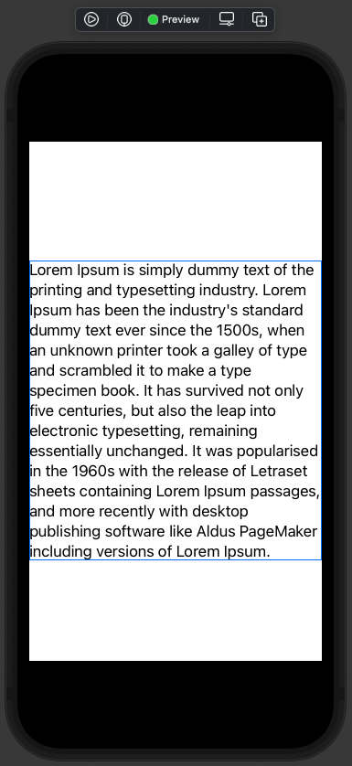

> Đúng là mơ ước của biết bao nhiều thế hệ anh em dev iOS.

Text sẽ tự động tạo điều chỉnh kích thước để hiển thị đầy đủ nội dung. Và bạn có thể quản lý số dòng hiển thị bằng modifier này `.lineLimit(:_)`. Xem ví dụ code

```swift
        Text("Lorem Ipsum is simply dummy text of the printing and typesetting industry. Lorem Ipsum has been the industry's standard dummy text ever since the 1500s, when an unknown printer took a galley of type and scrambled it to make a type specimen book. It has survived not only five centuries, but also the leap into electronic typesetting, remaining essentially unchanged. It was popularised in the 1960s with the release of Letraset sheets containing Lorem Ipsum passages, and more recently with desktop publishing software like Aldus PageMaker including versions of Lorem Ipsum.")
            .lineLimit(3)
```

Với giá trị là `3` thì sẽ hiển thị 3 dòng & đi kèm với nó là dấu `...` nếu số lượng dòng thực tế vượt quá số dòng. Còn để không giới hạn thì sẽ là `.lineLimit(nil)`

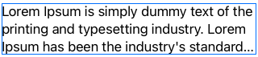

SwiftUI cũng cho phép bạn thay đổi vị trí dấu `...` , chứ không phải nhất thiết chỉ là ở cuối mà thôi. Xem ví dụ

```swift
        Text("Lorem Ipsum is simply dummy text of the printing and typesetting industry. Lorem Ipsum has been the industry's standard dummy text ever since the 1500s, when an unknown printer took a galley of type and scrambled it to make a type specimen book. It has survived not only five centuries, but also the leap into electronic typesetting, remaining essentially unchanged. It was popularised in the 1960s with the release of Letraset sheets containing Lorem Ipsum passages, and more recently with desktop publishing software like Aldus PageMaker including versions of Lorem Ipsum.")
            .lineLimit(1)
            .truncationMode(.middle)
```

Bạn chỉ cần sử dụng modifier `.truncationMode()`.  Các tham số khác của nó như sau:

* `.head` cho ở đầu
* `.tail` ở cuối đoạn
* `.middle` ở giữa đoạn

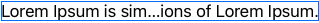

Mọi thứ thật là EZ!

## 3. Font

Về Font thì mặc định sẽ là font hệ thống (system font) cho Text.  Bạn có thể sử dụng một số tuỳ chọn mặc định như sau để thay đổi kích thước của font.

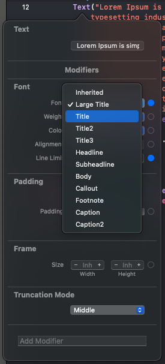

Tuỳ thuộc vào mỗi nền tảng thì sẽ có kích thước phụ hợp với mỗi tuỳ chọn ở trên. Bạn cũng có thể tuỳ chọn kích thước một cách xác định riêng.

```swift
.font(.system(size: 20))
```

Trong đó, modifier `.system` sẽ sử dụng chính font hệ thông của thiết bị. Ngoài ra, bạn có thể chọn các font khác với modifier là `.custom`. Ví dụ code như sau:

```swift
.font(.custom("Helvetica Neue", size: 25))
```

## 4. Color

Bạn muốn thay đổi màu chữ của Text thì sử dụng modifier `foregroundColor` với tham số là **Color**. Chúng ta chuyển màu sang màu xanh lá nào.

```swift
.foregroundColor(Color.green)
```

Bạn hoàn toàn có thể sử dụng các màu sắc khác. Hãy tìm hiểu thêm các hàm khởi tạo **Color** nha.

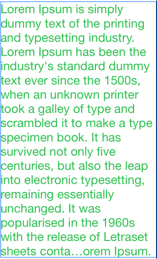

## 5. Text Alignment

Để thay đổi canh lề cho nội dung của Text. Bạn sử dụng modifier `.multilineTextAlignment` Với 3 tuỳ chọn sau:

* `.leading` canh lề trái
* `.center` canh chính giữa
* `.trailing` canh lề phải

Ví dụ vơí canh lề chính giữa như sau:

```swift
Text("...")
    .font(.largeTitle)
    .multilineTextAlignment(.center)
    .frame(width: 300)
```

Nâng cấp demo lên xịn sò tí nha.

```swift
struct TextDemoView: View {
    let alignments: [TextAlignment] = [.leading, .center, .trailing]
    @State private var alignment = TextAlignment.leading
    
    var body: some View {
        
        VStack {
            Picker("Text alignment", selection: $alignment) {
                ForEach(alignments, id: \.self) { alignment in
                    Text(String(describing: alignment))
                }
            }
            
            Text("Lorem Ipsum is simply dummy text of the printing and typesetting industry. Lorem Ipsum has been the industry's standard dummy text ever since the 1500s, when an unknown printer took a galley of type and scrambled it to make a type specimen book. It has survived not only five centuries, but also the leap into electronic typesetting, remaining essentially unchanged. It was popularised in the 1960s with the release of Letraset sheets containing Lorem Ipsum passages, and more recently with desktop publishing software like Aldus PageMaker including versions of Lorem Ipsum.")
                .font(.custom("Helvetica Neue", size: 25))
                .foregroundColor(Color.green)
                .multilineTextAlignment(alignment)
                .lineLimit(5)
                .truncationMode(.middle)
        }
        
    }
}
```

Bạn tha hồ mà test nha. Hãy sử dụng **Live Preview** để kiểm tra.

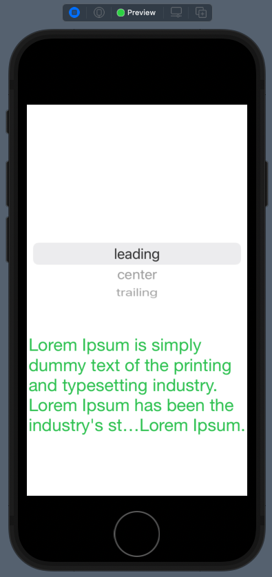

## 6. Padding and Line Spacing

Bạn có thể kiểm soát được khoảng cách giữa các dòng trong nội dung bằng modifiers `.lineSpacing`. Thử với ví dụ sau:

```swift
.lineSpacing(20.0)
```

Bạn thêm nó vào tiếp code demo của chúng ta và bấm Resume để xem kết quả.

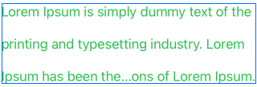

Và khi bạn muốn nội dung của bạn không quá sát các mép thì hãy sử dụng tiếp modifier `.padding()`. Bạn thêm tiếp dòng code đó vào ví dụ và xem kết quả.

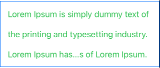

Ngoài ra, bạn có thể thêm các tham số cho `.padding` để xác định mép nào và giá trị cụ thể như thế nào. Ví dụ như cách ở trên và giá trị là `30`

```swift
.padding(.top, 30.0)
```

## 7. spacing between letters

Bạn có thể thay đổi khoảng cách giữa các ký tự hay các từ trong nội dung. Với 2 modifier sau:

* `.tracking` giãn cách các ký tự bất chấp là cùng hay không cùng một từ
* `.kerning` sẽ giãn cách cả chữ nhưng các từ ghép có nghĩa thì sẽ không vẫn dính với nhau

Bạn hãy thử với demo sau

```swift
struct ContentView: View {
    @State private var amount: CGFloat = 50

    var body: some View {
        VStack {
            Text("ffi")
                .font(.custom("AmericanTypewriter", size: 72))
                .kerning(amount)
            Text("ffi")
                .font(.custom("AmericanTypewriter", size: 72))
                .tracking(amount)

            Slider(value: $amount, in: 0...100) {
                Text("Adjust the amount of spacing")
            }
        }
    }
}
```

kết quả nhoé!

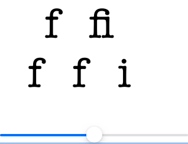

## 8. Format dates

Về hiển thị ngày tháng thì cũng khá đơn giản. Chúng cũng được modifier `.addingTimeInterval` cung cấp cho bạn. Bạn xem qua ví dụ code sau:

```swift
VStack {
                // show just the date
                Text(Date().addingTimeInterval(600), style: .date)

                // show just the time
                Text(Date().addingTimeInterval(600), style: .time)

                // show the relative distance from now, automatically updating
                Text(Date().addingTimeInterval(600), style: .relative)

                // make a timer style, automatically updating
                Text(Date().addingTimeInterval(600), style: .timer)
            }
```

Kết quả như sau:

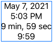

## 9. Rotating the Text

Xoay **Text** của bạn, tại sao không? Thực hiện điều này cũng khá đơn giản. Bạn sử dụng modifier `rotationEffect`. Thử các đoạn code ví dụ sau

* Xác định một góc cụ thể nào đó.

```swift
.rotationEffect(.degrees(45))
```

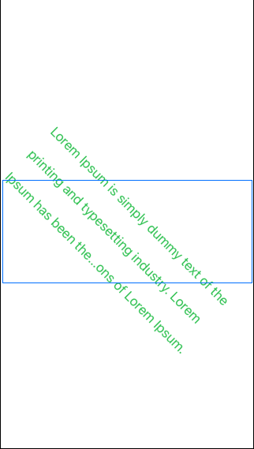

* Xác định điểm treo theo hệ toạ độ 2D

```swift
.rotationEffect(.degrees(20), anchor: UnitPoint(x: 0, y: 0))
```

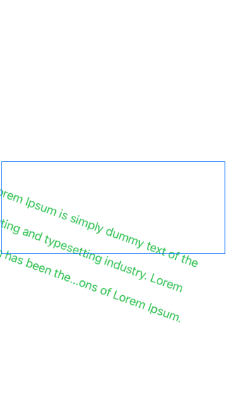

* Xác định điểm treo trong hệ toạ độ 3D

```swift
.rotation3DEffect(.degrees(60), axis: (x: 1, y: 0, z: 0))
```

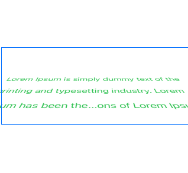

## 10. Shadow

Thất tuyệt vời với việc bạn thêm bóng đổ cho hiệu ứng 3D của Text. Bạn thử áp dụng modifier `.shadow` để hoàn thiện giao diện của mình đẹp nhất với Text.

Code ví dụ như sau:

```swift
.shadow(color: .gray, radius: 2, x: 0, y: 15)
```

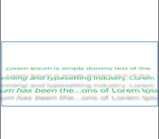

## 11. Order of modifiers

Đây là một bạn hết sức chú ý khi sử dụng quá nhiều modifier cho một đối tượng. Thứ tự thêm các modifier đó sẽ ảnh hưởng tới việc hiển thị của View của bạn ra sao.

> Mỗi lần gọi một modifier là sẽ nhân bản đối tượng View đó lên. Sau đó thay đổi giá trị và thay thế đối tượng trước đó. Đây là bản chất của Declaring View.

Bạn hãy test với 2 ví dụ sau

```swift
Text("Fx Studio")
  .background(Color.red)
  .padding()
```

và

```swift
Text("Fx Studio")
  .padding()
  .background(Color.red)
```

Kết quả như sau

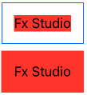

## Tạm kết

Thật sự để liệt kê hết các **modifier** mà giúp bạn tuỳ biến **Text** thì quả thật là quá nhiều. Qua trên, mình chỉ xin phép cung cấp các modifier hay sử dụng đối với **Text** mà thôi. Ngoài ra, bạn vẫn có thể áp dụng chúng cho nhiều đối tượng SwiftUI View khác mà có tính tương đồng với **Text**.

---

Cảm ơn bạn đã theo dõi các bài viết từ **Fx Studio** & hãy truy cập [website](https://fxstudio.dev/) để cập nhật nhiều hơn!