# 013.2 - Image

Chào bạn đến với **Fx Studio** và hành trình của series **SwiftUI Notes** bất tận này. Bài viết này sẽ tập trung vào một đối tượng View cơ bản mà có mặt ở hầu hết các nền tảng. Đó là **Image** trong **SwiftUI**. 

> An image is worth a thousand words. 

## Chuẩn bị

Về mặt tool và version, các bạn tham khảo như sau:

- SwiftUI 2.0
- Xcode 12

Về mặt kiến thức, bạn cần biết trước các kiến thức cơ bản với SwiftUI & SwiftUI App. Tham khảo các bài viết sau, nếu bạn chưa đọc qua SwiftUI:

- [Làm quen với SwiftUI](https://fxstudio.dev/swiftui-phan-1-lam-quen-voi-swiftui/)
- [Cơ bản về ứng dụng SwiftUI App](https://fxstudio.dev/swiftui-phan-2-co-ban-ve-ung-dung-swiftui-app/)

Về mặt demo, hầu như là demo đơn giản, vì tập trung vào từng view riêng lẻ. Do đó, bạn cũng không cần phải quá lo lắng và việc tạo mới project cũng không ảnh hưởng gì nhiều.

*(Mặc định, mình xem như bạn đã biết về cách tạo project với SwiftUI & SwiftUI App rồi.)*

## Image

Image chính là cách mà bạn có thể truyền tải đi rất nhiều thông điệp một cách đơn giản nhất. Vì vậy, trong giao diện bạn nên tận dụng chúng một cách tối đa nhất. Và Image cũng là một thành phần không thể nào thiếu được trong bất cứ thiết kế UI nào.

Trong SwiftUI, đối tượng hiển thị cho một hình ảnh là `Image`. Chắc bạn cũng quá quen thuộc với nó rồi và như trước đây với iOS chúng ta có `UIImageView` vậy. Hình ảnh có thể lấy được từ nhiều nguồn. Ví dụ:

* Các ảnh được lưu trữ thành tài nguyên trong Assests
* Các đối tượng từ các nền tảng khác của Apple như `NSImage` và `UIImage`
* Một ảnh dưới dạng `bitmap` được thể hiện bằng `CGImage` của Core Graphics
* Những icon & ảnh hệ thống, trong bộ sưu tập `SF Symbols`
* ...

Và bây giờ, chúng ta sẽ bắt đầu tìm hiểu xem **Image** trong **SwiftUI** như thế nào và có gì đặc biệt nha.

## 1. Display Image

Mọi việc bắt đầu bằng hiển thị một ảnh. Chúng ta sẽ sử dùng 2 nguồn chính, đó là lưu trữ trong Assets và ảnh hệ thống. Các nguồn khác như từ một URL nào đó hay ảnh động thì chúng ta sẽ bàn ở một bài viết khác nha.

### 1.1. Assets

Trước tiên, bạn hãy tạo mới một file **SwiftUI View**, đặt tên gì cũng được. Chúng ta sẽ có code mặc định được tạo kèm với file đó. Bạn hãy thay **Text** bằng **Image**, theo ví dụ sau

```swift
    var body: some View {
        Image("cat")
    }
```

Trong đó, mình sử dụng 1 ảnh được lưu trong file `Assets.xcassets`. Cú pháp của **Image** thì khá là đơn giản, tham số là **String**, tên của ảnh được lưu trong Assets.

Bạn bấm Resume và xem kết quả Preview nha!

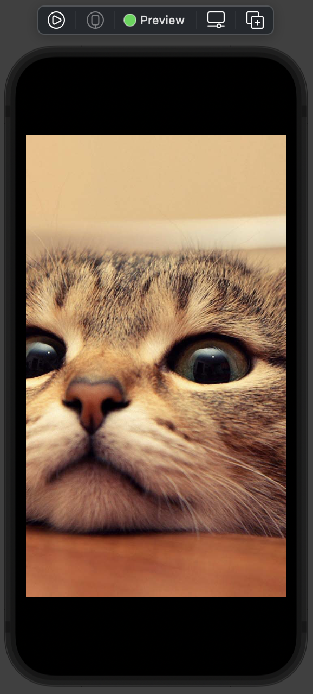

Sử dụng hình mèo cho tăng tương tác thôi. Ahihi!

### 1.2. SF Symbols

Hình ảnh hay các icon trong hệ thống thì được Apple cung cấp. Với việc bạn chỉ cần download thêm bộ sưu tập **SF Symbol**, thì bạn có trong tay hơn 1000 icon khác nhau các loại. Và đôi khi chúng ta gọi nó là ảnh hệ thống.

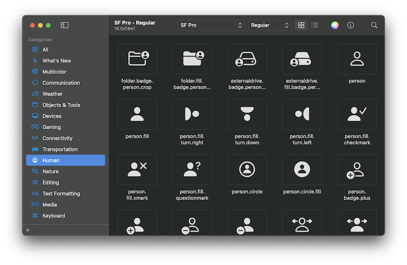

*(Link download tại [đây](https://developer.apple.com/sf-symbols/))*

Bạn sẽ tiết kiệm đi rất nhiều thời gian cho việc thiết kế ứng dụng của mình, bằng cách tận dụng những icon này. Và ưu điểm của chúng nó là dưới dạng `vector` nên bạn có thể thoải mái về kích thước cho các icon này mà ko sợ vỡ hình.

Bạn hãy tìm 1 cái tên trong đám icon đó, và sửa lại đoạn code trên như sau

```swift
Image(systemName: "tornado")
```

Để hiển thị ảnh hệ thống, ta chọn hàm khởi tạo **Image** với tham số label là `systemName` là được. Xem thử nó hiển thị như thế nào.

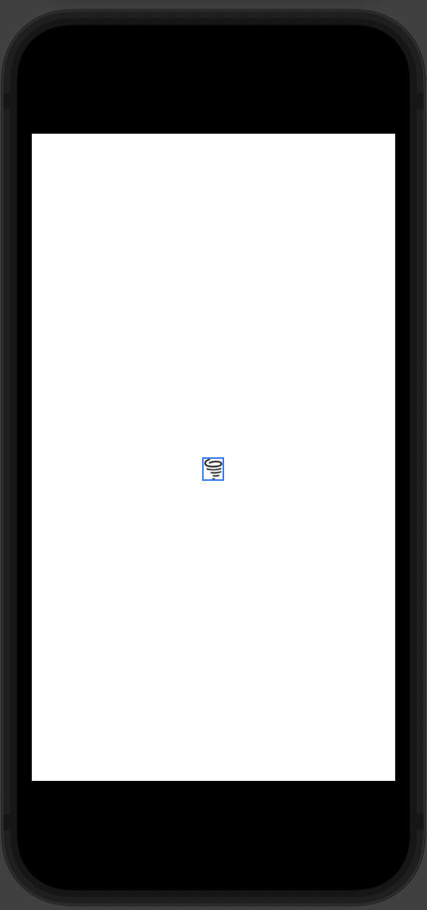

Bạn sẽ thấy cái hình nhỏ xí xi ở chính giữa màn hình đó. Để cho nó to lên thì chúng ta sẽ đi qua phần tiếp theo.

## 2. Change size

Đây chính là điều khó chịu đầu tiên khi bạn sử dụng Image trong SwiftUI. Đó chính là kích thước của Image. Bạn hãy xem lại ví dụ hình mèo dễ thương của mình.

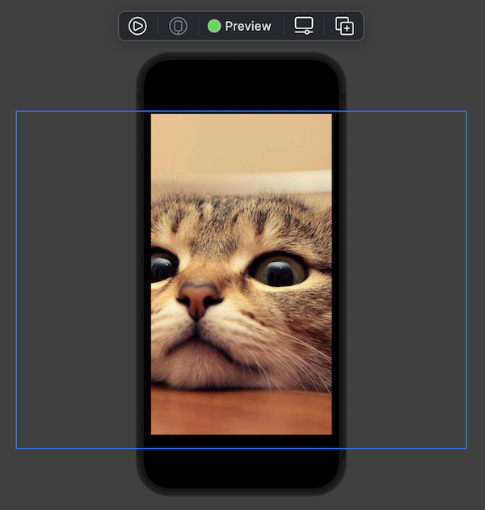

Cái viền màu xanh là biểu thị cho kích thước thật của ảnh chúng ta. Nó khá là lớn so với màn hình điện thoại. Chúng ta sẽ fix nó ngay thôi.

### 2.1. Resize-able

Sai lầm thứ 2 nữa của chúng ta hay quên đi. Đó là

> Tất cả chỉ là View

Với hình trên thì không phải kích thước View là kích thước màn hình. Mà màn hình điện thoại đó chỉ là khung hình để xem mà thôi. Nó không liên quan gì tới kích thước của Image.

Sau khi đọc qua 2 sai lầm cơ bản. Thì công việc của bạn chỉ còn là biến:

> Image từ không thể thay đổi kích thước thành có thể thay đổi được kích thước

Bạn chỉ cần thêm một modifier `.resizable()` vào sau Image là ổn.

```swift
        Image("cat")
            .resizable()
```

Xem kết quả nào!

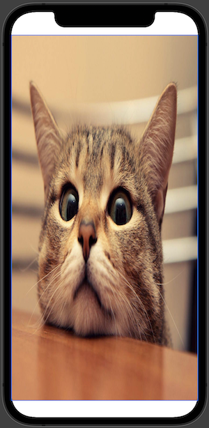

Với tính năng đó thì ảnh của bạn sẽ **auto resize** vừa với kích thước chứa của View.

### 2.2. Tiled resizing

Một trò khá là vui đến từ SwiftUI. Bạn hãy tìm một ảnh với kích thước nhỏ, và dùng đoạn code sau để hiển thị chúng.

```swift
        Image("star")
            .resizable(resizingMode: .tile)
```

Trong đó, 

* `star` là ảnh với kích thước 50x50px
* Vẫn là việc resize nhưng với kích thước ảnh nhỏ hơn View chưa thì sẽ dùng chế độ lặp lại nó
* Sử dụng tham số `resizingMode: .tile` để fill ngôi sao đó cho toàn bộ màn hình

Xem kết quả nào!

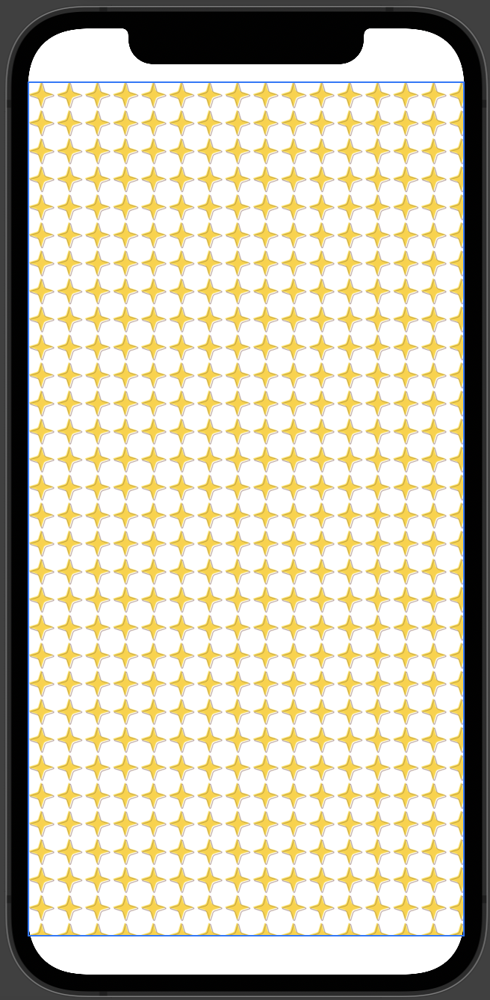

Khá là đẹp phải không nào, bạn nào có ý tưởng làm các background cute thì chừ quá đơn giản rồi đó.

Ngoài ra, với Tiled resizing này còn có nhiều tham số nữa, bạn hãy tự khám phá thêm nha. Ví dụ như sau, để thay đổi index của ảnh sao cho đẹp nhất với từng vị trí xác định.

```swift
.resizable(
                capInsets: .init(
                    top: 30,
                    leading: 30,
                    bottom: 30,
                    trailing: 30
                ),
                resizingMode: .tile
        )
```

### 2.3. Scale

Bạn nhìn lại hình mèo dễ thương ở trên sau khi resize thì cảm nhận ảnh bị bóp méo đi. Vậy muốn ảnh đẹp hơn thì chúng ta cũng phải chọn đúng chế độ khi `scale` ảnh. Và bạn có 2 chế độ cơ bản sau:

* `fit`

Ta lại có 2 cách dùng với chế độ `fit`. Bạn tham khảo code sau:

```swift
        Image("cat")
            .resizable()
            .aspectRatio(contentMode: .fit)
```

Hoặc

```swift
        Image("cat")
            .resizable()
            .scaledToFit()
```

Xem kết quả mèo dễ thương nào!

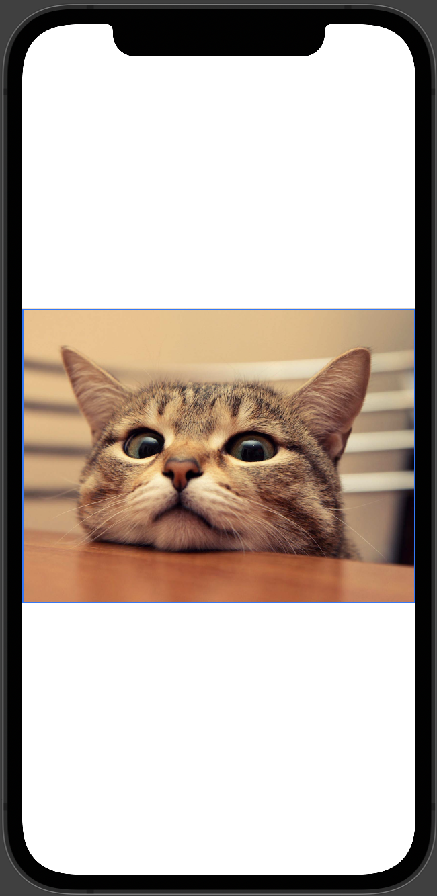

* `fill`

Với chế độ `fill` cũng tương tự, ta cũng có 2 cách để sử dụng chế độ này

```swift
        Image("cat")
            .resizable()
            .aspectRatio(contentMode: .fit)
```

Hoặc

```swift
        Image("cat")
            .resizable()
            .scaledToFill()
```

Xem kết quả mèo dễ thương nào!

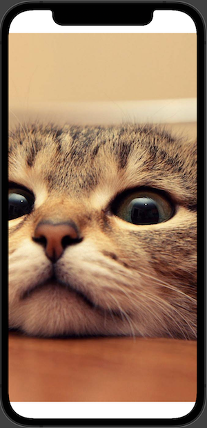


Tuy nhiên, với modifier `.aspectRatio` bạn sẽ có nhiều khám phá hơn. Không chỉ là 2 chế độ đơn giản như vậy.

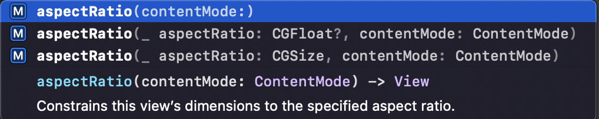

Ví dụ: ta sử dụng tỉ lệ scale cho 2 kích thước của ảnh như sau

```swift
        Image("cat")
            .resizable()
            .aspectRatio(0.7, contentMode: .fill)
```

Kết quả nè!

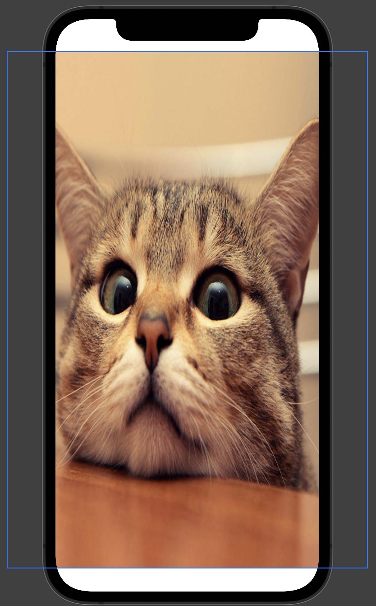

Khung hình màu xanh đã nhỏ đi khá nhiều rồi.

### 2.4. Frame

Nếu như tất cả vẫn chưa thoải mãn được bạn và bạn vẫn muốn Image có một kích thước xác định nào đó. Thì hãy sử dụng:

* Modifier `.frame` để xác định kích thước
* SwiftUI đủ thông minh để có thể tính toán các tham số kích thước, ngay khi bạn cung cấp không đầy đủ tham số truyền vào.
* Xác định `width` hay `height` hay cả 2 đều được
* Xác định kích thước `min` hay `max` cho 2 chiều

Tham khảo code ví dụ cho mèo dễ thương tiếp nha.

```swift
        Image("cat")
            .resizable()
            .scaledToFit()
            .frame(width: 300)
```

Kết quả nè!

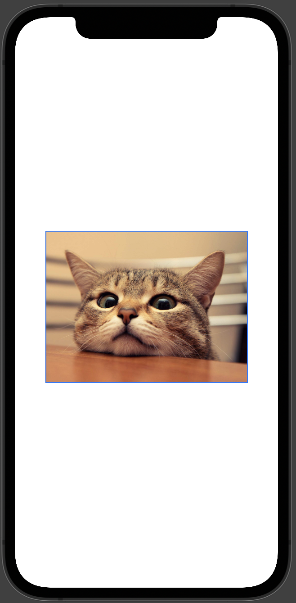

Lúc này mèo dễ thương trông nhỏ nhắn xinh đẹp rồi!

## 3. Full screen & Safe area

### 3.1. Full screen

Tới đây, nhiều bạn cùng gặp chung một vấn đề là "làm thế nào để ảnh full màn hình?". Khi mà SwiftUI rất linh hoạt và có thể build được lên nhiều thiết bị. Do đó, việc xác định kích thước màn hình chính xác thì rất khó. Bên cạnh đó ...

> Chúng ta đã nói lời chia tay với AutoLayout rồi. Ahuhu!

Nhưng mà ông trời không tuyệt đường sống của ta bao giờ. Khi Apple cung cấp cho bạn một giá trị là `.infinity` để dùng làm đối số truyền vào cho các tham số `width` & `height` trong modifier `.frame`. Bạn thử xem đoạn code sau với mèo dễ thương nha.

```swift
        Image("cat")
            .resizable()
            .frame(width: .infinity, height: .infinity)
```

Kết quả ra như sau nhoé!

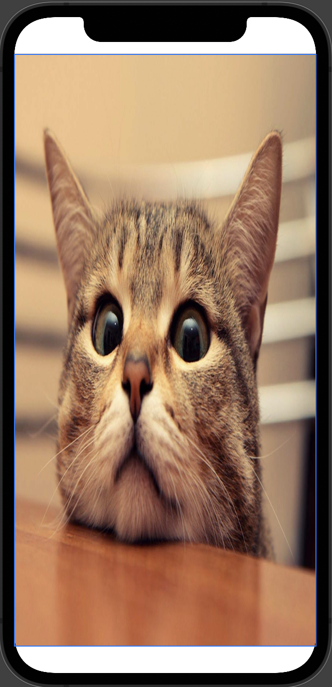

### 3.2. Safe area

Mình đã cố tình sử dụng simulator là iPhone 12 để cho có phần tai thỏ. Và bạn cũng dễ dàng thấy được 2 khoảng trắng 2 đầu rồi. 

Nguyên nhân chính là **Safe area** của các đời iPhone X. Đây là vùng an toàn để bạn thiết kế giao diện. Với Autolayout bạn cũng phải kéo thả constraint và ràng buộc chúng với Safe area. Thì SwiftUI cũng như vậy.

Để giúp bạn thoải mãn 100% thì chúng ta sẽ bỏ qua phần Safe area này, bạn chỉ cần thêm modifier `.ignoresSafeArea()` vào là mọi thứ ổn ngay.

```swift
        Image("cat")
            .resizable()
            .ignoresSafeArea()
            .frame(width: .infinity, height: .infinity)
```

Ở trên, mình thêm vào đoạn code ví dụ mèo dễ thương. Kết quả sẽ như thế này nè!


> Hài lòng mọi người chưa!


## 4. Image as a backgrounds

Một công dụng phải nói nhức nách nữa của **Image** chính là làm hình nền. Vì hầu như mọi developer đều đã sử dụng ảnh làm background cho View, Button, NavigationBar ... Do đó, mình xin mạn phép đưa vào luôn bài viết này. 

Ngoài ra, cũng giúp cho các bạn thấy được sự đa năng của SwiftUI như thế nào. Khi mà background nó cũng xem là một View. Bạn có thể làm mọi thứ với nó. Xem ví dụ code mèo dễ thương tiếp là được.

```swift
        HStack {
            Text("Mèo dễ thương! Moa moa")
                .font(.largeTitle)
                .fontWeight(.heavy)
                .foregroundColor(Color.white)
            }
            .background(
                Image("cat")
                    .resizable()
                    .scaledToFill()
                    .edgesIgnoringSafeArea(.all)
                    .frame(width: UIScreen.main.bounds.width, height: UIScreen.main.bounds.height)
                    
            )
```

Trong đó:

* Đối tượng chính là một **Text**
* Tại modifier `.background` ta cung cấp cho nó là một **Image**
* Tuỳ theo sở thích của bạn mà bạn tuỳ biến Image đó thành một Background đẹp cho Text

Bạn xem kết quả nhoé!

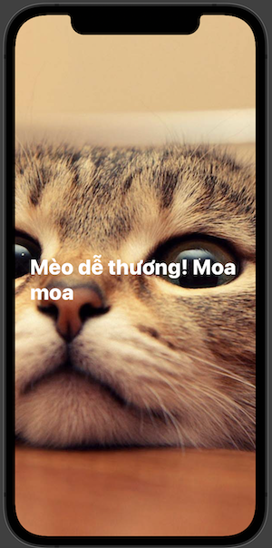

## 5. Make color

Chúng ta sang phần làm màu cho đối tượng **Image** nào. Lưu ý, đây chỉ là những modifier hay sử dụng mà thôi. Chứ không phải là tất cả nha. Mục đích là giúp bạn tham khảo một tí.

Chúng ta sẽ bắt đầu từ đoạn code này nha.

```swift
        Image("cat")
            .resizable()
            .frame(width: 300, height: 300)
```

### 5.1. cornerRadius

Đây cũng là một trong các modifier phổ biến nhất. Bạn sử dụng `.cornerRadius` để bo tròn một View hay Image. Code ví dụ như sau:

```swift
        Image("cat")
            .resizable()
            .frame(width: 300, height: 300)
            .cornerRadius(30.0)
```

Xem kết quả nhoé!

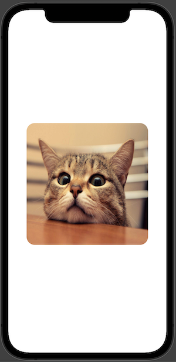

Còn bạn muốn cho Image của bạn thành hình tròn thì sử dụng cứ truyền cho tham số của `.cornerRadius` với một nữa của `width` là đẹp ngay.

```swift
        Image("cat")
            .resizable()
            .frame(width: 300, height: 300)
            .cornerRadius(150.0)
```

Xem tiếp kết quả mèo dễ thương nha!

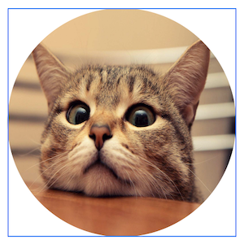

### 5.2. overlay

Modifier `.overlay` thì bạn có thể thêm những nội dung lên trên đối tượng View. Và Image cũng không ngoại lệ. Sẽ rất thú vị khi SwiftUI rất linh hoạt. Bạn có thể thêm bất cứ View nào vào cũng được.

Xem code ví dụ với việc sử dụng `.overlay` cho **Image** là một **Text** nha.

```swift
        Image("cat")
            .resizable()
            .frame(width: 300, height: 300)
            .cornerRadius(30.0)
            .overlay(
                Text("Mèo dễ thương")
                    .foregroundColor(Color.white)
                    .padding([.bottom, .trailing], 10)
                    .opacity(0.8),
                     alignment: .bottomTrailing
            )
```

Trong đó

* Content của `.overlay` chính là một Text
* Cần thêm tham số `alignment` để xác định vị trí của `overlay`
* `.bottomTrailing` sẽ là góc dưới bên phải của View
* Các modifier khác bạn tự tìm hiểu nha, cũng không quá khó lắm

Bạn xem kết quả nhoé!

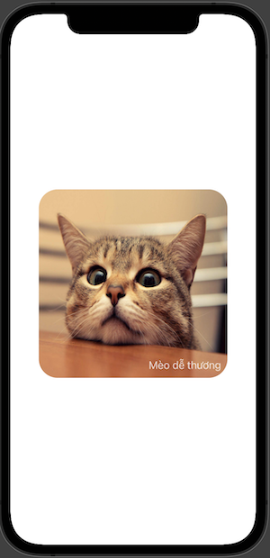

### 5.3. background

Modifier `.background` thì quá bình thường rồi. Bạn sẽ phủ màu hoặc cái gì đó làm hình nền cho Image. Nó có tác dụng khi ảnh của bạn trong suốt. Hoặc khi bạn load ảnh từ một URL nào nó, trong lúc chờ kết nối mạng .... cũng rất nhiều ứng dụng với modifier này.

Còn bây giờ, bạn xem qua code ví dụ với mèo dễ thương ở trên nha. Mình có thay đổi giá trị radius để bo tròn lớn hơn. Giúp bạn nhìn rõ đc background color.

```swift
        Image("cat")
            .resizable()
            .frame(width: 300, height: 300)
            .cornerRadius(50.0)
            .overlay(
                Text("Mèo dễ thương")
                    .foregroundColor(Color.white)
                    .padding([.bottom, .trailing], 10)
                    .opacity(0.8),
                     alignment: .bottomTrailing
            )
            .background(Color.green)
```

Xem kết quả luôn nhoé!

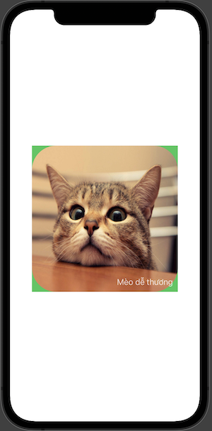

### 5.4. clipShape

Modifier `.clipShape` này sẽ cắt Image của chúng ta theo 1 hình dạng nào đó mà ta cung cấp. Mình sẽ thực hiện với hình cắt là hình tròn cho Image ở trên. Xem ví dụ code nào.

```swift
        Image("cat")
            .resizable()
            .frame(width: 300, height: 300)
            .cornerRadius(50.0)
            .overlay(
                Text("Mèo dễ thương")
                    .foregroundColor(Color.white)
                    .padding([.bottom, .trailing], 10)
                    .opacity(0.8),
                     alignment: .bottomTrailing
            )
            .background(Color.green)
            .clipShape(Circle())
```

Khá là đơn giản khi truyền tham số là một đối tượng `Circle()`. Xem kết quả nhoé!

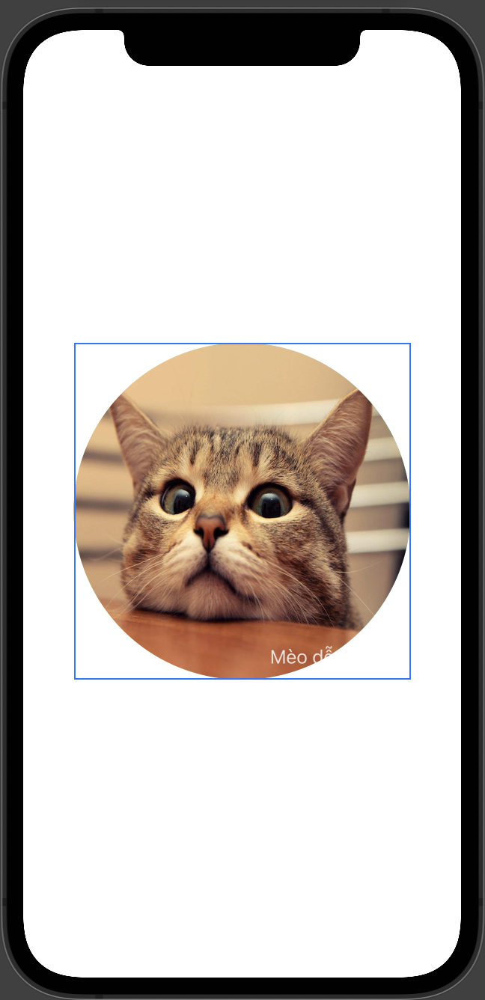

### 5.5. foregroundColor

Cái này áp dụng cho các Image hệ thống nha. Nó như `tintColor` vậy. Bạn có thể xét máy của Image giống như màu chữ của Text thông qua modifier `.foregroundColor`. Rất nhanh và rất tiện lợi!

Bạn xem ví dụ mới của mình như sau:

```swift
        VStack {
            Image(systemName: "star")
                .resizable()
                .frame(width: 80.0, height: 80.0)
                .foregroundColor(.blue)
            
            Image(systemName: "star")
                .resizable()
                .frame(width: 80.0, height: 80.0)
                .foregroundColor(.green)
            
            Image(systemName: "star")
                .resizable()
                .frame(width: 80.0, height: 80.0)
                .foregroundColor(.red)
            
            Image(systemName: "star")
                .resizable()
                .frame(width: 80.0, height: 80.0)
                .foregroundColor(.orange)
            
            Image(systemName: "star")
                .resizable()
                .frame(width: 80.0, height: 80.0)
                .foregroundColor(.yellow)
        }
```

Sử dụng Image hệ thống, với đầy đủ màu sắc khác nhau cho mỗi Image. Xem kết quá nhoé!

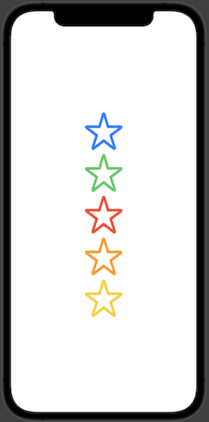

## Tạm kết

Qua trên, mình đã trình bày những thứ cơ bản liên quan tới **Image** của **SwiftUI**. Và chúng chỉ mang tính chất cơ bản mà thôi. Quan trọng bạn cần nhớ đến **modifier** `.resizable()` là được. Vì tất cả các thao tác tới Image sẽ chính xác hơn khi Image có thể thay đổi được kích thước.

Chúc bạn thành công với Image!

---

Cảm ơn bạn đã theo dõi các bài viết từ **Fx Studio** & hãy truy cập [website](https://fxstudio.dev/) để cập nhật nhiều hơn!