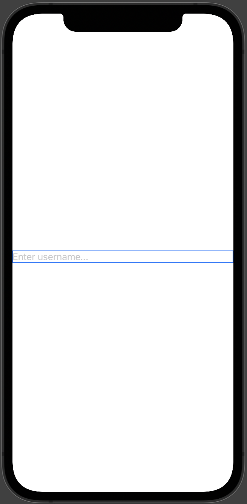
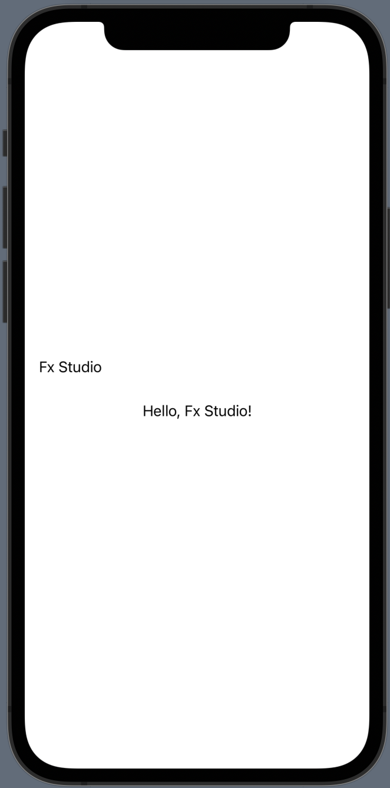
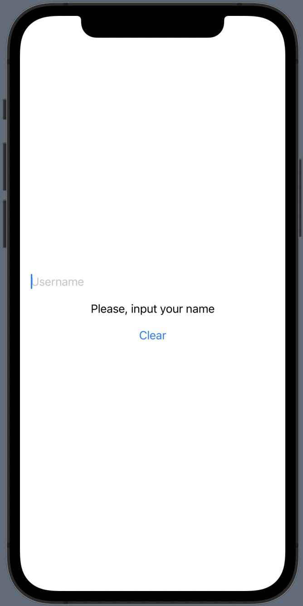
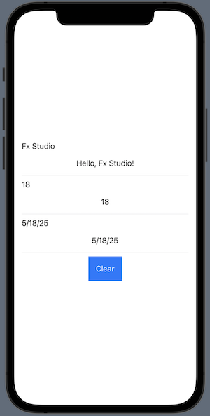
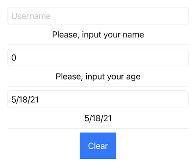

# 013.3 - Basic Textfield (part 1)

Chào bạn đến với **Fx Studio**. Chúng ta sẽ tiếp tục series **SwiftUI Notes** với bài viết về đối tượng **TextField**. Đây là một SwiftUI View và có rất nhiều điểm thú vị từ nó mà bạn cần khám phá.

> Bắt đầu thôi!

## Chuẩn bị

Về mặt tool và version, các bạn tham khảo như sau:

- SwiftUI 2.0
- Xcode 12

Về mặt kiến thức, bạn cần biết trước các kiến thức cơ bản với SwiftUI & SwiftUI App. Tham khảo các bài viết sau, nếu bạn chưa đọc qua SwiftUI:

- [Làm quen với SwiftUI](https://fxstudio.dev/swiftui-phan-1-lam-quen-voi-swiftui/)
- [Cơ bản về ứng dụng SwiftUI App](https://fxstudio.dev/swiftui-phan-2-co-ban-ve-ung-dung-swiftui-app/)

Về mặt demo, hầu như là demo đơn giản, vì tập trung vào từng view riêng lẻ. Do đó, bạn cũng không cần phải quá lo lắng và việc tạo mới project cũng không ảnh hưởng gì nhiều.

*(Mặc định, mình xem như bạn đã biết về cách tạo project với SwiftUI & SwiftUI App rồi.)*

## TextField

Một đối tượng SwiftUI View khá là bá đạo nhất. Nó là trong những **Control Input** mà được sử dụng nhiều nhất. Phiên bản tiền nhiệm của nó trong iOS & MacOS là UITextField & NSTextField. Ngoài ra, bạn có thể thấy được mức độ phổ biến của nó thông qua hằng hà sa số các thư viện custom lại.

Đặc trưng của TextField là:

* Là giao diện cho việc chỉnh sửa văn bản
* Đi kèm với nó là một bản phím ảo
* Sẽ có nhiều biến thể để phù hợp với nhiều định dạng của văn bản (số, email, ngày tháng ....)

Chúng ta tìm hiểu sơ như vậy thôi, hầu như ai cũng biết nó rồi. Và bây giờ, ta sẽ tập trung phần chính nào.

## 1. Display TextField

Nói là đơn giản nhưng cũng không phải là đơn giản quá mức cho việc hiển thị một TextField à. Vì SwiftUI thì chúng ta đang tương với với kiểu lập trình **Declarative**. 

Bạn cần phải khai báo đồng thời phần `data` & `ui` . Và khi người dùng tương tác với View (TextField) thì dữ liệu sẽ tự động cập nhật. Hoặc khi bạn thay đổi dữ liệu thì View cũng sẽ thay đổi thay.

Bắt đầu, bạn hay tạo một file SwiftUI View để dùng làm demo cho bài viết này. Và thêm một thuộc tính đơn giản đầu tiên cho View đó. Ví dụ như sau:

```swift
struct TextFieldDemoView: View {
    
    @State var name: String = ""
    
    var body: some View {
        Text("Hello, World!")
    }
}
```

Thuộc tính ta thêm vào có tên là `name` và là một Wrapper Property `@State`. Nó cho phép bạn có thể thay đổi giá trị từ các View ràng buộc với nó. Tiếp tục, ta thêm đối tượng **TextField** vào `body` , nó sẽ thay thế cho Text kia. Code ví dụ như sau:

```swift
    var body: some View {
        TextField("Enter username...", text: $name)
    }
```

Trong đó:

* tham số `title` với giá trị được truyền vào là `"Enter username..."` . Nó như là một placeholder của TextField
* `text` cần đối tượng để binding dữ liệu. Ta sử dụng thuộc tính `name` vừa tạo ở trên.
* Keyword `$` trước `name` để giúp cho View có thể thay đổi giá trị của thuộc tính/biến truyền vào

Rất là nhanh, bạn bấm Resume và xem kết quả nha.



## 2. Read TextField

Xong bước setup và sang bước sử dụng nó thôi. Làm thế nào để đọc được dữ liệu từ **TextField**. Câu trả lời cực kì ngắn gọn là ...

> Không cần làm gì cả.

Vì theo nguyên tắt lập trình Declarative thì mọi thứ sau khi đã khai báo với nhau. Mọi dữ liệu & giao diện sẽ được đồng bộ với nhau một cách tự động.

Tuy nhiên, để cho bạn an tâm thì bạn hãy xem tiếp đoạn code ví dụ sau:

```swift
    var body: some View {
        VStack {
            TextField("Username", text: $name)
            Spacer()
            Text(name == "" ? "Please, input your name" : "Hello, \(name)!")
            Spacer()
        }
        .frame(height: 100.0)
        .padding()
    }
```

Trong đó:

* Tuỳ chỉnh giao diện với **VStack** và thêm một **Text** nữa vào
* Nhiệm vụ của **Text** là đọc `name` và hiển thị sao cho phù hợp với giá trị của `name`

Okay, bạn bấm **Live Preview** để kiểm tra xem người dùng nhập giá trị vào **TextField**, thì có kéo theo giá trị ở **Text** thay đổi hay không.



## 3. Write TextField

Để thay đổi hiển thị của **TextField** thì cũng khá đơn giản và nó vẫn chịu tác động của **Declarative**. Bạn chỉ cần thay đổi giá trị của thuộc tính được *binding* với **TextField** là oki.

Chúng ta xem code ví dụ nữa nào

```swift
    var body: some View {
        VStack {
            TextField("Username", text: $name)
            Spacer()
            Text(name == "" ? "Please, input your name" : "Hello, \(name)!")
            Spacer()
            Button(action: {
                name = ""
            }, label: {
                Text("Clear")
            })
        }
        .frame(height: 100.0)
        .padding()
    }
```

Trong đó:

* Thêm một Button để lấy sự kiện `action` của nó, khi người dùng nhấn vào Button
* Tại đó, chúng ta sẽ thay đổi giá trị của thuộc tính `name`. Ví dụ là gán lại với `""`

Bạn tiếp tục **Live Preview** và kiểm tra việc nhấn vào **Button** sau khi đã nhập vào **TextField**. Thì kết quả ở TextField có thay đổi *text* hay không.




## 4. State & Action

Nếu bạn là một iOS Dev, khi dùng **UITextField**, thì kèm theo đó là việc sử dụng tới các **Delegate Protocol** của nó. Chúng ta sẽ cần bắt được các sự kiện hay các trạng thái mà **TextField** phát ra. Để xử lý trong nhiều trường hợp. Ví dụ như, *validate field* ngay khi kết thúc nhập ... 

> Nhưng, TextField trong SwiftUI sẽ không có Delegate Protocol.

Để đảm bảo bạn vẫn có thể bắt được chúng thì SwiftUI cung cấp cho bạn các hàm khởi tạo tương ứng. Vẫn là code ví dụ trên. Bạn thay đổi lại TextField như sau.

```swift
            TextField("Username", text: $name) { isBegin in
                if isBegin {
                    print("Begins editing")
                } else {
                    print("Finishes editing")
                }
            } onCommit: {
                print("commit")
            }
```

Trong đó:

* tham số đầu là `onEditingChanged` . Nó tương tự như `textFieldDidBeginEditing` trong Delegate của UITextField
  * Với giá trị trả về trong closure cho tham số `isBegin` . Nếu
  * `true` là bắt đầu thay đổi
  * `flase` là kết thúc việc thay đổi
* Tham số tiếp theo được cung cấp là `onCommit`. Nó tương tự như `textFieldShouldReturn`
  * Khi người dùng bấm **Return Key** của bàn phím ảo, thì nó sẽ được gọi.

Bạn thử lại với build project lên Simulator và xem kết quả nha ở Console nha.

```
Begins editing
commit
Finishes editing
```


> Nếu bạn tìm kiếm **TextField** với `responder`, cho việc focus hay dismiss một TextField tương tự như *UITextField*. Mình có tìm kiếm với SwiftUI thì chưa có hoặc chưa hỗ trợ. Bạn muốn sử dụng thì custom lại hoặc tải thêm *Package* trên mạng đã làm sẵn rồi.

## 5. Formatted text

SwiftUI cũng hỗ trợ TextField thêm nhiều sức mạnh, đó là việc chuyển đổi qua lại giữa vài kiểu dữ liệu cơ bản. Ví dụ như sau:

* Bạn có TextField để nhập số tuổi. Kiểu dữ liệu mong muốn của bạn sẽ là `Int`
* Bạn có TextField để nhập ngày tháng. Kiểu dữ liệu mong muốn của bạn sẽ là `Date`

Với cách truyền thống, chúng ta sẽ có một hàm nào đó. Và ngồi convert từ **String** của tất cả các **TextField** sang từng kiểu dữ liệu ứng với từng biến muốn sử dụng.

> Chúng ta sẽ cách nhanh hơn là truyển thằng **Formatter** cho **TextField**.

Trước tiên, mình sẽ trình bày từng bước ví dụ để bạn thấy nó hoạt động như thế nào. Ta bắt đầu với kiểu Int

### 5.1. Int

* Ví dụ với kiểu `Int`, chúng ta cần một đối tượng formatter của nó trước.

```swift
    static var numberFormater: NumberFormatter {
        let nf = NumberFormatter()
        nf.numberStyle = .decimal
        return nf
    }
```

* Tạo một thuộc tính `@State` tương ứng với kiểu `Int` (ý nghĩa thì cũng giống như biến `name` ở trên)

```swift
@State var age: Int = 0
```

* Cấu hình vào **TextField** với tham số `formmater` cho hàm khởi tạo của nó.

```swift
                TextField("Age",
                          value: $age,
                          formatter: TextFieldDemoView.numberFormater)
```

Như vậy, bạn đã hoàn thành việc tạo một **TextField** với `formmater` để liên kết với một thuộc tính khác **String**

### 5.2. Date

Một kiểu dữ liệu mà chúng ta dùng thường xuyên nữa đó là `Date`. Hầu như xuất hiện khá nhiều trong các form đăng ký hay tạo mới một cái gì đó.

Giải quyết việc này thì cũng tương tự Int ở trên. Đầu tiên, bạn cần phải có 1 đối tượng forrmater riêng cho nó.

```swift
    static var dateformater: DateFormatter {
        let df = DateFormatter()
        df.dateStyle = .short
        return df
    }
```

Tạo thêm một thuộc tính mà bạn sẽ dùng làm binding với đối tượng TextField. À, nó kiểu `Date` & `@State` nha.

```swift
@State var birthday: Date = Date()
```

Cuối cùng, bạn hoàn thành TextField với tham số `formatter` mới nào.

```swift
                TextField(
                    "Birthday",
                    value: $birthday,
                    formatter: TextFieldDemoView.dateformater)
```


Với 2 cách đơn giản này, bạn giảm tải đi rất nhiều việc *convert* kiểu dữ liệu **String** sang các kiểu khác cho **TextField**.

### 5.3 Demo

Đã nắm sơ qua việc sử dụng Formatter cho TextField rồi. Bây giời, chúng ta áp dụng cả 2 vào demo. Mình sẽ đưa ví dụ hoàn thành với 2 formatter ở trên nha.

```swift
struct TextFieldDemoView: View {
    
    @State var name: String = ""
    @State var birthday: Date = Date()
    @State var age: Int = 0
    
    static var dateformater: DateFormatter {
        let df = DateFormatter()
        df.dateStyle = .short
        return df
    }
    
    static var numberFormater: NumberFormatter {
        let nf = NumberFormatter()
        nf.numberStyle = .decimal
        return nf
    }
    
    
    var body: some View {
        VStack {
            // Username
            VStack {
                TextField("Username", text: $name) { isBegin in
                    if isBegin {
                        print("Begins editing")
                    } else {
                        print("Finishes editing")
                    }
                } onCommit: {
                    print("commit")
                }
                
                Spacer()
                Text(name == "" ? "Please, input your name" : "Hello, \(name)!")
                Spacer()
                Divider()
            }
            
            VStack {
                TextField("Age",
                          value: $age,
                          formatter: TextFieldDemoView.numberFormater)
                
                Spacer()
                Text(age == 0 ? "Please, input your age" : "\(age)")
                Spacer()
                Divider()
            }
            
            // Birthday
            VStack {
                TextField(
                    "Birthday",
                    value: $birthday,
                    formatter: TextFieldDemoView.dateformater)
                Spacer()
                Text(TextFieldDemoView.dateformater.string(from: birthday))
                Spacer()
                Divider()
            }
            
            // Button
            VStack {
                Button(action: {
                    name = ""
                    age = 0
                    birthday = Date()
                }, label: {
                    Text("Clear")
                        .foregroundColor(Color.white)
                })
                .padding()
                .background(Color.blue)
                
            }
        }
        .frame(height: 300.0)
        .padding()
    }
}
```

Bạn có thể tham khảo để có demo riêng của bạn. Còn bây giờ thì bấm Live Preview và test thử.



## 6. Styling

Nếu để ý bạn thấy TextField chúng ta qua xấu. Tuy nhiên, là do nó chưa được thêm `style`. SwiftUI cũng hỗ trợ bạn một modifier để thêm style cho TextField, đó là `.textFieldStyle`

Bạn thử một số loại style cơ bản như sau nha.

* DefaultTextFieldStyle
  * Cơ bản đầu tiên, nó sẽ dựa vào mỗi nền tảng và version OS mà hiển thị
* PlainTextFieldStyle
  * Chỉ có text mà thôi
* RoundedBorderTextFieldStyle
  * Hay sử dụng nhất và được bo tròn 4 góc
* SquareBorderTextFieldStyle
  * Cho MacOS và mình cũng không rành lắm

Code ví dụ như sau:

```swift
TextField("Username", text: $name) { isBegin in
                    if isBegin {
                        print("Begins editing")
                    } else {
                        print("Finishes editing")
                    }
                } onCommit: {
                    print("commit")
                }
                .textFieldStyle(RoundedBorderTextFieldStyle())
```

Xem kết quả nhoé!




## Tạm kết

* Sử dụng được TextField ở mức giao diện cơ bản
* Các trạng thái và sự kiện
* Binding dữ liệu với các thuộc tính và giao diện
* Chuyển đổi qua lại giữa các kiểu dữ liệu

---

Cảm ơn bạn đã theo dõi các bài viết từ **Fx Studio** & hãy truy cập [website](https://fxstudio.dev/) để cập nhật nhiều hơn!


