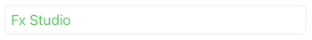
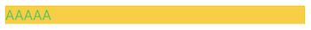
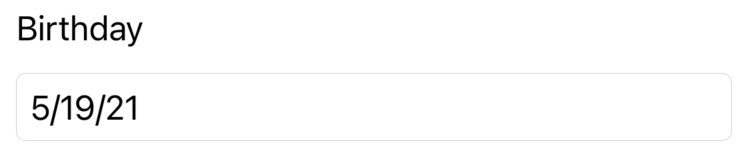
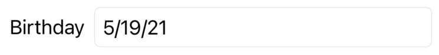
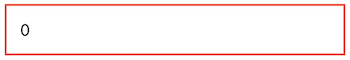
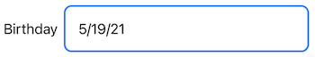
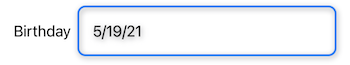
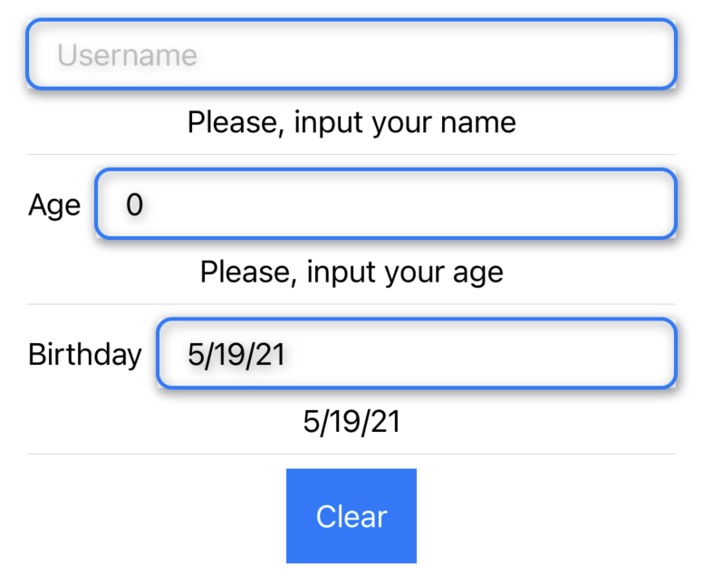
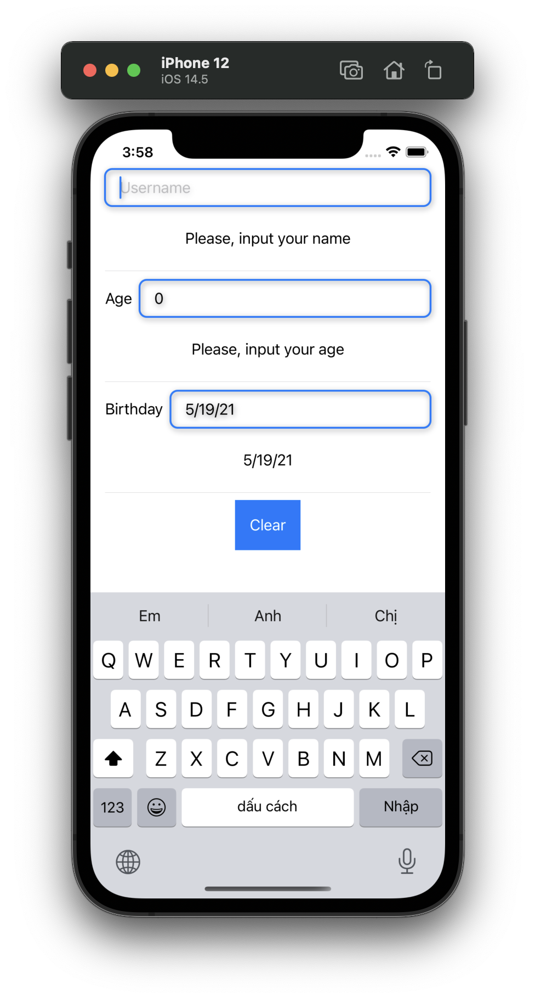

# 013.3 - Style & Modifier Textfield (part 2)

Chào bạn đến với **Fx Studio**. Chúng ta tiếp tục tìm hiểu về đối tượng **TextField** trong **SwiftUI**. Phần tiếp theo này, chúng ta sẽ đi vào custom là chủ yếu. Và bạn có thể áp dụng nó cho các đối tượng SwiftUI View khác.

Nếu mọi thứ ổn rồi, thì ...

> Bắt đầu thôi!

## Chuẩn bị

Về mặt tool và version, các bạn tham khảo như sau:

- SwiftUI 2.0
- Xcode 12

Về mặt kiến thức, bạn cần biết trước các kiến thức cơ bản với SwiftUI & SwiftUI App. Tham khảo các bài viết sau, nếu bạn chưa đọc qua SwiftUI:

- [Làm quen với SwiftUI](https://fxstudio.dev/swiftui-phan-1-lam-quen-voi-swiftui/)
- [Cơ bản về ứng dụng SwiftUI App](https://fxstudio.dev/swiftui-phan-2-co-ban-ve-ung-dung-swiftui-app/)

Về mặt demo, hầu như là demo đơn giản, vì tập trung vào từng view riêng lẻ. Do đó, bạn cũng không cần phải quá lo lắng và việc tạo mới project cũng không ảnh hưởng gì nhiều.

*(Mặc định, mình xem như bạn đã biết về cách tạo project với SwiftUI & SwiftUI App rồi.)*

Về mặt project demo, ta sẽ sử dụng lại từ phần trước của TextField. Hoặc bạn có thể tham khảo lại đoạn code sau cũng được.

```swift
struct TextFieldDemoView: View {
    
    @State var name: String = ""
    @State var birthday: Date = Date()
    @State var age: Int = 0
    
    static var dateformater: DateFormatter {
        let df = DateFormatter()
        df.dateStyle = .short
        return df
    }
    
    static var numberFormater: NumberFormatter {
        let nf = NumberFormatter()
        nf.numberStyle = .decimal
        return nf
    }
    
    
    var body: some View {
        VStack {
            // Username
            VStack {
                TextField("Username", text: $name) { isBegin in
                    if isBegin {
                        print("Begins editing")
                    } else {
                        print("Finishes editing")
                    }
                } onCommit: {
                    print("commit")
                }
                .textFieldStyle(RoundedBorderTextFieldStyle())
                
                Spacer()
                Text(name == "" ? "Please, input your name" : "Hello, \(name)!")
                Spacer()
                Divider()
            }
            
            VStack {
                TextField("Age",
                          value: $age,
                          formatter: TextFieldDemoView.numberFormater)
                    .textFieldStyle(RoundedBorderTextFieldStyle())
                
                Spacer()
                Text(age == 0 ? "Please, input your age" : "\(age)")
                Spacer()
                Divider()
            }
            
            // Birthday
            VStack {
                TextField(
                    "Birthday",
                    value: $birthday,
                    formatter: TextFieldDemoView.dateformater)
                    .textFieldStyle(RoundedBorderTextFieldStyle())
                Spacer()
                Text(TextFieldDemoView.dateformater.string(from: birthday))
                Spacer()
                Divider()
            }
            
            // Button
            VStack {
                Button(action: {
                    name = ""
                    age = 0
                    birthday = Date()
                }, label: {
                    Text("Clear")
                        .foregroundColor(Color.white)
                })
                .padding()
                .background(Color.blue)
                
            }
        }
        .frame(height: 300.0)
        .padding()
    }
}
```

## 1. More styling

Mặc dù chúng ta đã được SwiftUI cung cấp các style rồi, tuy nhiên chúng không đủ để cho bạn thể hiện cá tính riêng của bản thân mình. Vì vậy, chúng ta sẽ đi vào các bước make color cơ bản và hay sử dụng cho một TextField trong SwiftUI.

### 1.1. Change font color

Bắt đầu, bằng việc bạn có thể thay đổi màu chữ trong TextField. Nó cũng tương tự như Text, bạn hãy sử dụng tới modifier `.foregroundColor` là ổn.

Code ví dụ sau, bạn chỉ cần thêm vào cuối là đẹp

```swift
                TextField("Username", text: $name) { isBegin in
                    if isBegin {
                        print("Begins editing")
                    } else {
                        print("Finishes editing")
                    }
                } onCommit: {
                    print("commit")
                }
                .textFieldStyle(RoundedBorderTextFieldStyle())
                .foregroundColor(Color.green)
```

Xem kết quả nào!



### 1.2. Change background color

Bạn cũng có thể thay đổi màu nền của TextField thông qua modifier `.background`. Cái này đơn giản quá chắc không cần giải thích nhiều. Ahihi!

Code ví dụ như sau:

```swift
                TextField("Username", text: $name) { isBegin in
                    if isBegin {
                        print("Begins editing")
                    } else {
                        print("Finishes editing")
                    }
                } onCommit: {
                    print("commit")
                }
                //.textFieldStyle(RoundedBorderTextFieldStyle())
                .foregroundColor(Color.green)
                .background(Color.yellow)
```

Tạm thời, chúng ta sẽ không cần tới `.textFieldStyle`, nên mình sẽ comment nó lại. Bạn xem kết quả nha.



### 1.3. Vertical label

Đôi lúc bạn sẽ thấy `placeholder` không có ý nghĩa mấy. Nhất khi là một số TextField luôn hiển thị giá trị mặt định. Như demo thì chúng ta có TextField cho `birthday` thì sẽ hiển thị ngày hiện tại ra trước.

Muốn cho người dùng hiểu thì bạn phải custom thêm một ít nữa. Chúng ta sẽ cấu trúc chúng lại như sau:

```swift
                VStack(alignment: .leading) {
                    Text("Birthday")
                    TextField(
                        "Birthday",
                        value: $birthday,
                        formatter: TextFieldDemoView.dateformater)
                        .textFieldStyle(RoundedBorderTextFieldStyle())
                }
```

Trong đó:

* Tạo ra một `VStack` để chứa 2 đối tượng Text & TextField
* Text vẫn như xưa
* TextField vẫn không có gì mới

Nhưng với biến tấu này đem lại một cảm giác tươi mới hơn cho giao diện của bạn.



### 1.4. Horizontal label

Bạn thay đổi nhẹ từ `VStack` sang `HStack` và cảm nhận kết quả nha.

```swift
                HStack {
                    Text("Birthday")
                    TextField(
                        "Birthday",
                        value: $birthday,
                        formatter: TextFieldDemoView.dateformater)
                        .textFieldStyle(RoundedBorderTextFieldStyle())
                }
```

Xem kết quả nhoé!



### 1.5. Custom border

Đây mới chính là cái bạn cần quan tâm nhất. Chúng ta hầu như là sẽ không sử dụng giao diện mặc định. Cái cần thay đổi đầu tiên chính là `border` của TextField.

Bạn xem đoạn code ví dụ sau:

```swift
                TextField("Age",
                          value: $age,
                          formatter: TextFieldDemoView.numberFormater)
                    .padding()
                    .border(Color.red, width: 2)
```

Bạn chỉ cần sử dụng modifier `.border` để thực hiện công việc vẽ lại border của TextField. Ta không cần lệ thuộc vào đám `default style` kia. Xem kết quả luôn nhoé



Chúng ta có thêm một cách custom bữa để đem lại hiệu ứng đẹp cho border TextField. Đó là sử dụng modifier `.overlay`. Bạn tham khảo thêm code ví dụ sau nha.

```swift
TextField(
                        "Birthday",
                        value: $birthday,
                        formatter: TextFieldDemoView.dateformater)
                        //.textFieldStyle(RoundedBorderTextFieldStyle())
                        .padding()
                        .overlay(
                          RoundedRectangle(cornerRadius: 8)
                            .stroke(lineWidth: 2)
                            .foregroundColor(.blue)
                        )
```

Trong đó:

* với `.overlay` bạn sẽ làm được nhiều thứ hơn so với `border`
* Như ví dụ ta có thể tạo 1 border với bo tròn 4 góc
* Có thể custom màu sắc, kiểu border và độ dày cho nó

Xem kết quả nhoé.



### 1.6. Shadow

Bạn muốn thêm hiệu ứng bóng đổ để tạo cảm giác chiều sâu cho View, thì với TextField bạn sử dụng modifier `.shadow`. Nó cũng áp dụng tương tự cho các SwiftUI View khác.

Tiếp tục xem code ví dụ nha

```swift
                    TextField(
                        "Birthday",
                        value: $birthday,
                        formatter: TextFieldDemoView.dateformater)
                        //.textFieldStyle(RoundedBorderTextFieldStyle())
                        .padding()
                        .overlay(
                          RoundedRectangle(cornerRadius: 8)
                            .stroke(lineWidth: 2)
                            .foregroundColor(.blue)
                        )
                        .shadow(color: Color.gray.opacity(1.0),
                                radius: 3, x: 1, y: 2)
```

Kết quả nhoé!



## 2. Creating a custom text style

Bạn xem lại code ví dụ cho TextField sau khi đã làm make color và ưng ý. Thì code khá là dài. Bên cạnh đó, nếu màn hình của bạn có nhiều TextField thì phải copy cho mỗi cái nữa.

> Đáng sợ VL!

Vậy chúng ta sẽ tìm một giải pháp ổn hơn. Đó chính là custom luôn **TextFieldStyle** và áp dụng nó cho nhiều TextField một lúc.

Bắt đầu, bạn tạo một file swift với tên tuỳ ý. Bạn xem code ví dụ sau:

```swift
import SwiftUI

struct KuteTextFieldStyle: TextFieldStyle {
    
    public func _body (configuration: TextField<Self._Label>) -> some View {
          return configuration
    }
    
}
```

Trong đó:

* Struct cho style mới của chúng ta sẽ kế thừa protocol **TextFieldStyle**
* Nó sẽ yêu cầu bạn implement một function là `_body`
* Tham số chính là `configuration`, nó đại diện cho chính View của bạn
* Nhiệm vụ của bạn sẽ thay đổi & làm mọi thứ với `configuration` đó

Công việc tiếp theo, bạn sẽ copy đám code mà bạn đã làm ở phần trên sang đây. Vì tất cả là modifier, nên bạn áp dụng chúng cho `configuration` luôn.

```swift
import SwiftUI

struct KuteTextFieldStyle: TextFieldStyle {
    
    public func _body(configuration: TextField<Self._Label>) -> some View {
        return configuration
            .padding(EdgeInsets(top: 8, leading: 16, bottom: 8, trailing: 16))
            .background(Color.white)
            .overlay(
                RoundedRectangle(cornerRadius: 8)
                    .stroke(lineWidth: 2)
                    .foregroundColor(.blue)
            )
            .shadow(color: Color.gray.opacity(1.0),
                    radius: 3, x: 1, y: 2)
    }
    
}
```

Tiếp theo, bạn sẽ thay cho Style mặc định của **TextField**.

```swift
TextField("Username", text: $name)
                    .textFieldStyle(KuteTextFieldStyle())
```

Khá đơn giản phải không nào. Cuối bạn, bạn áp dụng cho toàn bộ màn hình với nhiều **TextField** luôn nào.

```swift
 var body: some View {
        VStack {
            // Username
            VStack {
                TextField("Username", text: $name)
                    .textFieldStyle(KuteTextFieldStyle())
                
                Spacer()
                Text(name == "" ? "Please, input your name" : "Hello, \(name)!")
                Spacer()
                Divider()
            }
            
            VStack {
                HStack {
                    Text("Age")
                    TextField("Age", value: $age, formatter: TextFieldDemo2View.numberFormater)
                        .textFieldStyle(KuteTextFieldStyle())
                }
            
                Spacer()
                Text(age == 0 ? "Please, input your age" : "\(age)")
                Spacer()
                Divider()
            }
            
            // Birthday
            VStack {
                HStack {
                    Text("Birthday")
                    TextField(
                        "Birthday", value: $birthday, formatter: TextFieldDemo2View.dateformater)
                        .textFieldStyle(KuteTextFieldStyle())
                }
                
                Spacer()
                Text(TextFieldDemoView.dateformater.string(from: birthday))
                Spacer()
                Divider()
            }
            
            // Button
            VStack {
                Button(action: {
                    name = ""
                    age = 0
                    birthday = Date()
                }, label: {
                    Text("Clear")
                        .foregroundColor(Color.white)
                })
                .padding()
                .background(Color.blue)
                
            }
        }
        .frame(height: 300.0)
        .padding()
    }
```

Kết quả hiển thị như sau:



## 3. Creating a custom modifier

Bạn cũng sẽ thấy với các custom trên thì chỉ áp dụng được cho các **TextField**, vì chúng kế thừa từ protocol **TextFieldStyle**. Và cũng từ câu chuyện đó nếu như:

* Bạn muốn áp dụng nó cho 1 đối tượng SwiftUI View thì sẽ ntn ?
* Bạn vừa áp dụng 1 style này và vừa muốn thêm một style khác nữa thì sao?

Đúng thật là

> THAM LAM

### 3.1. Create

Tuy nhiên, không phải là không có cách. Thay vì chọn phương án custom style thì chúng ta sẽ custom một `modifier` xịn sò luôn.

> Cái hay là nó sẽ dùng được cho nhiều đối tượng SwiftUI View, chứ ko chỉ đơn giản mỗi thể loại Style mà thôi.

Bắt đầu, bạn cũng tạo mới một file với tên tuỳ ý. Code ban đầu như sau:

```swift
struct KuteViewModifier: ViewModifier {
    func body(content: Content) -> some View {
      content
    }
}
```

Trong đó:

* Struct chúng ta phải kế thừa protocol **ViewModifier**
* Implement thêm function `body`
* Tham số `content` chính là View của bạn

Bước thứ 2, bạn sẽ hoàn thiện ViewModifier mới bằng các bước thêm `modifier` như là với custom style.

```swift
struct KuteViewModifier: ViewModifier {
    func body(content: Content) -> some View {
        content
            .padding(EdgeInsets(top: 8, leading: 16, bottom: 8, trailing: 16))
            .background(Color.clear)
            .overlay(
                RoundedRectangle(cornerRadius: 8)
                    .stroke(lineWidth: 2)
                    .foregroundColor(.blue)
            )
            .shadow(color: Color.gray.opacity(1.0), radius: 3, x: 1, y: 2)
    }
}
```

### 3.2. ModifiedContent

Cách sử dụng đơn giản với Modifier mới của bạn cho View sẽ như sau:

```swift
                ModifiedContent (
                    content: TextField("Username", text: $name),
                    modifier: KuteViewModifier()
                )
```

Trong đó:

* **ModifiedContent** là đối tượng mà bạn có được sau khi chúng nó hợp thể
* `content` chính là đối tượng SwiftUI View nào đó
* `modifier` là đối tượng chúng ta vừa mới tạo struct để custom lại

Hiệu quả đem lại vẫn lợi hại như trên.

### 3.3. Extend View

Cách trên cũng hay, nhưng lại thấy nó không giống như bao lần bạn sử dụng modifier trong SwiftUI. Khắc phục thì bạn sẽ chế thêm như sau.

Bước đầu tiên, bạn thêm một `extension` cho SwiftUI View. Ví dụ code như sau:

```swift
extension View {
    func kute() -> some View {
        ModifiedContent(
            content: self,
            modifier: KuteViewModifier()
        )
    }
}
```

Cũng khá là dễ hiểu cho đoạn code trên. Chỉ là bạn tách phần sử dụng ở trên ra và bọc chúng lại bằng một function khác. Nhưng thành phần chính vẫn là đối tượng **ModifierContent**.

Bước tiếp theo, bạn sử dụng vào các TextField thôi. Cũng xem tiếp ví dụ code nha.

```swift
 TextField("Age", value: $age, formatter: TextFieldDemo2View.numberFormater)
      .kute()
```

`.kute()` chính là function mà chúng đã bọc ở trên tại bước tạo `extension` cho View. 

> Bây giờ, bạn thấy SwiftUI là dễ chưa nào. Ahihi!

## 4. Handle Keyboard

Để trọn vẹn cho bài viết này thì chúng ta vẫn còn một thứ quan trọng cần xử lý nữa là ....

> Keyboard (bàn phím ảo)

### 4.1. Vấn đề

Nếu bạn build ứng dụng lên nền tảng iOS/iPadOS thì sẽ có bàn phím ảo xuất hiện theo TextField. Nó giúp người dùng nhập văn bản vào TextField. Mọi việc gặp vấn đề khi bạn bị chính Keyboard đó `che mất đi` các View đang hiển thị của bạn.

> Giao diện bàn phím che lấp, gây khó khăn trong việc hiển thị và tương tác

Với UIKit, chúng ta có thể dùng các thư viện để xử lý vấn đề đơn giản này. Tuy nhiên, với phạm vi bài viết chúng ta không thể nào dùng thư viện và tất cả phải code tay hết.

Cách xử lý thì có vô vàng cách, đại diện như sau:

* Thay đổi lại `frame` của màn hình
* Tuỳ chỉnh là `offset` của TextField
* Sử dụng Scroll và thay đổi `offset` của nó

Sẽ có nhiều cách giải quyết hay hơn nữa và mình sẽ chọn cách đơn giản nhất. Vì với SwiftUI thì mọi thức từ đơn giản lại trở nên phức tạp. Ví dụ như:

* Bạn không có Autolayout để neo các View lại với nhau
* Bạn không tính toán và thay đổi `frame` được
* Còn phải đồng bộ dữ liệu với nhau
* ...

Còn sau đây là cách giải quyết

### 4.2. Keyboard Manager

Để quản lý việc ẩn hiện Keyboard thì tốt nhất chúng ta phải cần một class để quản lý chúng. Class này sẽ đặc biệt một tí. Bạn xem code của nó như sau:

```swift
import SwiftUI

class FXKeyboardManager : ObservableObject {
    @Published var customHeight: CGFloat = 0
    @Published var keyboardHeight: CGFloat = 0
    @Published var isVisible = false
    
    init() {
        NotificationCenter.default.addObserver(self, selector: #selector(keyboardVisibilityChanged), name: UIResponder.keyboardWillChangeFrameNotification, object: nil)
    }
    
    deinit {
        NotificationCenter.default.removeObserver(self, name: UIResponder.keyboardWillChangeFrameNotification, object: nil)
    }
    
    @objc private func keyboardVisibilityChanged(_ notification: Notification) {
        guard let userInfo = notification.userInfo else { return }
        guard let keyboardEndFrame = userInfo[UIResponder.keyboardFrameEndUserInfoKey] as? CGRect else { return }
        
        isVisible = keyboardEndFrame.minY < UIScreen.main.bounds.height
        
        keyboardHeight = isVisible ? keyboardEndFrame.height : 0
        
        keyboardHeight = customHeight == 0 ? keyboardHeight : customHeight

    }
}
```

Trong đó:

* Class phải kế thừa lại protocol **ObservableObject** để giúp các đối tượng của nó có thể tương tác với các View trong SwiftUI.
* Các thuộc tính được khai báo với `@Published` sẽ báo cho bên ngoài biết được khi nào chúng thay đổi giá trị. Ràng buộc các View với chúng. Khi nó thay đổi thì View sẽ thay đổi theo.
* Các function còn lại chỉ liên quan tới tính toán và logic

Về mặt logic thì như sau:

* Sử dụng `UIResponder.keyboardWillChangeFrameNotification` để theo dõi việc ẩn hiện của Keyboard
* Nếu xuất hiện bàn phím thì 
  * `keyboardHeight` sẽ bằng kích thước bàn phím
  * `keyboardHeight` sẽ bằng kích thước custom nào đó, nếu ý đồ người lập trình muốn toàn bộ View di chuyển nhẹ lên thôi
* Nếu bàn phím ẩn đi thì  `keyboardHeigh = 0 ` mọi thứ sẽ về lại như ban đầu với

> Đây chính là các sử dụng Declaring Data với kiểu dữ liệu tham chiếu trong SwiftUI. Bạn xem lại tại [đây](https://fxstudio.dev/declaring-data-swiftui-notes-12/#4_Reference_type).

### 4.3. Sử dụng

Tại file SwiftUI View mà chúng ta sử dụng, bạn thêm một thuộc tính. Điều quan trọng là ý đồ bạn muốn sử dụng thuộc tính đó như thế nào. Với tư cách là:

* Nguồn dữ liệu chính và nhận mọi cập nhật từ các View hay các nơi khác, thì bạn sẽ khai báo với `@StateObject`
* Chỉ mang tính chất là `binding` dữ liệu với một nguồn nào đó ở bên ngoài, thì bạn sẽ khai báo với `@ObservedObject`

Với cách nào cũng okay hết, còn mình sẽ chọn theo `nguồn sự thật chân lý` vì nó là duy nhất. Mình sẽ thêm thuộc tính sau vào SwiftUI View của chúng ta đang làm demo từ đầu cho đến chừ.

```swift
@StateObject var keyboardManager = FXKeyboardManager()
```

Về mặt hiển thị sao cho đẹp thì ta sẽ lợi dụng yếu tố `.padding` và áp dụng nó cho phần tử lớn nhất trong SwiftUI View của chúng ta.

Ví dụ

```swift
 VStack {
        // .....
  }
  .padding(.bottom, keyboardManager.keyboardHeight)
  .padding()
```

Bạn sẽ lợi dùng việc `padding` cho cạnh ở dưới mà thôi. Hãy build project lên simulator và nhớ kích hoạt thêm bàn phím ảo nữa. Và cảm nhận kết quả.

Cuối cùng, nhiều lúc bạn chỉ muốn View của bạn nhích lên 1 tí thôi. Còn cách trên thì chúng nó xa quá, có khi đi luôn. Bạn sẽ thêm phần chỉnh sửa cho từng **TextField**. Xem ví dụ cho một TextField trong màn hình như sau.

```swift
                TextField("Username", text: $name) { isBegin in
                    if isBegin {
                        keyboardManager.customHeight = 50.0
                    } else {
                        keyboardManager.customHeight = 0
                    }
                    
                } onCommit: {}
                .kute()
```

Người hùng ở đây chính là thuộc tính `customHeight` của chúng ta. Bây giờ, build lại project và xem kết quả nào.



## Tạm kết

* Áp dụng được nhiều modifier để thêm phần giao diện TextField được xinh đẹp
* Custom Style cho TextField
* Custom ViewModifier để áp dụng cho TextField hoặc có thể bất cứ View nào cũng được
* Xử lý bàn phím ảo và giao diện hiển thị cho phù hợp

---

Cảm ơn bạn đã theo dõi các bài viết từ **Fx Studio** & hãy truy cập [website](https://fxstudio.dev/) để cập nhật nhiều hơn!