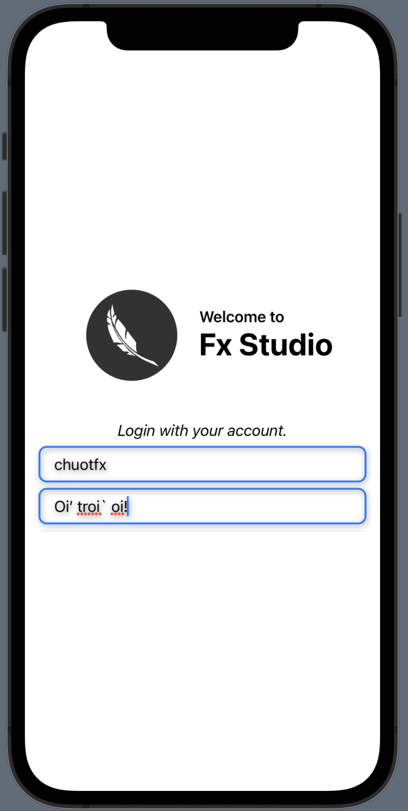
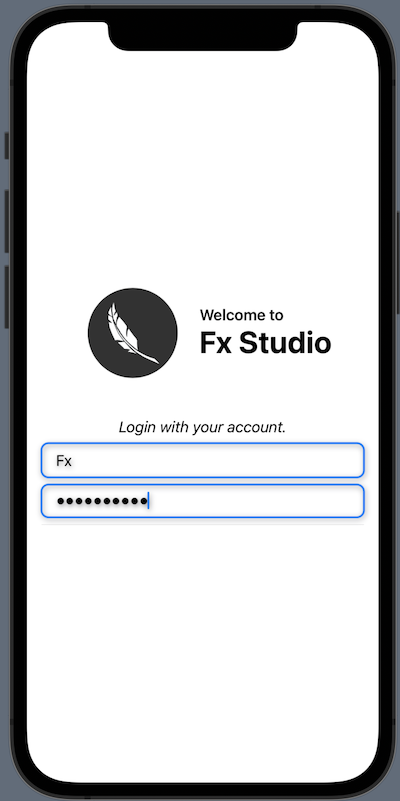
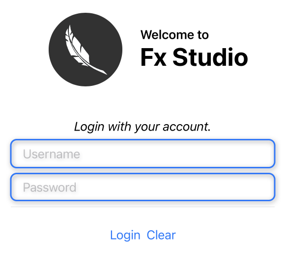
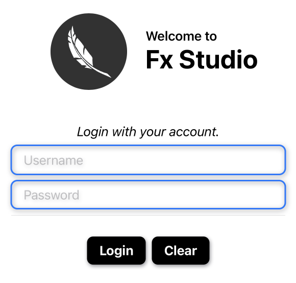
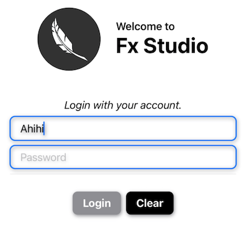
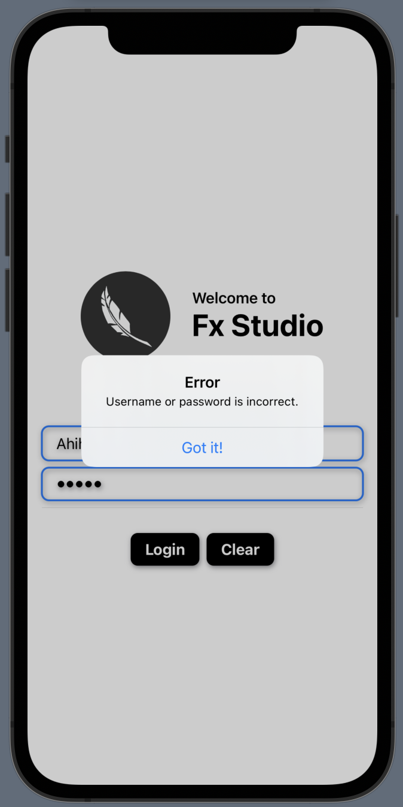
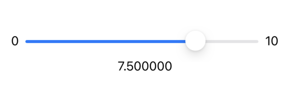
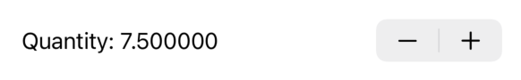

# 013.4 - Input Controls

Chào bạn đến với **Fx Studio**. Chúng ta đã tìm hiểu lần lượt các UI Control cơ bản (Text, Image, TextField) của SwiftUI. Và tiếp nối series SwiftUI Notes này, chúng ta sẽ tìm hiểu một loạt các UI Control cơ bản khác. Chúng thuộc nhóm các Control giúp người dùng tương tác hay nhập dữ liệu từ giao diện màn hình ... 

Để biết chúng là gì, thì ...

> Bắt đầu thôi!

## Chuẩn bị

Về mặt tool và version, các bạn tham khảo như sau:

- SwiftUI 2.0
- Xcode 12

Về mặt kiến thức, bạn cần biết trước các kiến thức cơ bản với SwiftUI & SwiftUI App. Tham khảo các bài viết sau, nếu bạn chưa đọc qua SwiftUI:

- [Làm quen với SwiftUI](https://fxstudio.dev/swiftui-phan-1-lam-quen-voi-swiftui/)
- [Cơ bản về ứng dụng SwiftUI App](https://fxstudio.dev/swiftui-phan-2-co-ban-ve-ung-dung-swiftui-app/)

Về mặt demo, hầu như là demo đơn giản, vì tập trung vào từng view riêng lẻ. Do đó, bạn cũng không cần phải quá lo lắng và việc tạo mới project cũng không ảnh hưởng gì nhiều.

*(Mặc định, mình xem như bạn đã biết về cách tạo project với SwiftUI & SwiftUI App rồi.)*

Về demo, chúng ta sẽ thử tạo một trang Login đơn giản và dùng là demo cho bài viết này. Mình sẽ xây dựng trang Login hoàn thiện đầy theo từng bước một. Còn sau đây là code ví dụ ban đầu của nó, để cho bạn có thể tham khảo.

```swift
struct DemoLoginView: View {

    var body: some View {
        VStack {
            // Welcome
            HStack(alignment: .center) {
                Image("logo")
                    .resizable()
                    .frame(width: 100, height: 100)
                    .clipShape(Circle())
                    .padding()
                VStack(alignment: .leading) {
                    Text("Welcome to")
                        .font(.headline)
                    Text("Fx Studio")
                        .font(.largeTitle)
                        .fontWeight(.bold)
                }
            }
        }
        .padding()
    }
}
```

Chúng ta sử dụng các đối tượng Image & Text đơn giản, nên cũng không có gì quá phức tạp ở. Còn đây là hình ảnh ban đầu cho nó.


## 1. SecureField

### 1.1. Login form

Chúng ta sẽ dùng các HStack & VStack để tách ra các khối giao diện. Nhằm mục đích quản lý có được tốt hơn. Công việc tiếp theo của bạn làm tiếp trang demo này chính à thêm các **TextField** cho **Login**.

Ta sẽ thêm 2 thuộc quản lý cho thông tin đăng nhập, đó là `username` & `password`. Bạn tham khảo code sau:

```swift
    @State var username: String = ""
    @State var password: String = ""
```

Trong đó:

* `@State` giúp thuộc tính này có thể lưu trữ được và cập nhật giá trị từ View hay các View khác ở bên ngoài. 
* Kiểu dữ liệu sử dụng là `String`

Tiếp theo, bạn sẽ thêm đoạn code này vào VStack của `body` ở trên (ở dưới đoạn Welcome). Code như sau:

```swift
VStack {
                Text("Login with your account.")
                    .italic()
                TextField("Username", text: $username)
                    .kute()
                TextField("Password", text: $password)
                    .kute()
                Divider()
            }
            .padding([.top, .bottom], 20.0)
```

Bạn cần áp dụng hết tinh hoa của bài trước,

* Các bố cục View
* Sử dụng các modifier cơ bản như `.padding`
* Sử dụng lại Custom Style & Modifier (từ bài trước)

Kết quả như sau:



### 1.2. Edit password field

Có gì đó sai sai ở form đăng nhập trên. Trường `password` của bạn như vậy thì không ổn. Chúng ta cần che chúng đi.

Tất nhiên, SwiftUI cũng đã hỗ trợ bạn điều này. Có một hay khá hay là SwiftUI đã tách biệt giữ Field bình thường và Field cần bảo mật. Và nó được gọi là `SecureField`.

Đặc trưng:

* Tương tự như TextField
* Dùng để che đi các văn bản khi nhập vào

Cú pháp:

```swift
@State var password = ""
...

SecureField.init("Password", text: $password)
  .textFieldStyle(RoundedBorderTextFieldStyle())
```

* Khi chưa nhập vào Field thì sẽ hiện ra `placeholder`
* Còn khi có kí tự được nhập thì chúng sẽ được hiển thị bằng dấu tròn đen

Cuối cùng, bạn chỉnh sửa lại form ở trên nha.

```swift
TextField("Username", text: $username)
    .kute()
SecureField("Password", text: $password)
    .kute()
```

Bấm Live Preview lại và tận hưởng kết quả nhoé!



## 2. Button

### 2.1. Cú pháp

Một trong số những UI Control phổ biến tiếp theo đó là **Button**. Nó giúp cho người dùng có thể tương tác với giao diện ứng dụng. Thông qua các hành động chạm vào, bấm vào, táp vào ... Hiểu nôm na

> Nhận sự kiện từ người dùng.

Có nhiều phiên bản khởi tạo với Button và cũng có nhiều thay đổi từ SwiftUI 1.0 & 2.0. Mình giới thiệu cho bạn phiên bản ổn nhất sau đây

```swift
struct Button<Label> where Label : View
```

Ta xem qua hàm khởi tạo của nó thì như sau:

```swift
init(
  action: @escaping () -> Void,
  @ViewBuilder label: () -> Label
)
```

Trong đó:

* `action` chịu trách nhiệm xử lý khi người dùng có tác động vào Button
* `label` là nội dung của Button. Nó là kiểu `@ViewBuidler` nên bạn có thể tuỳ ý sáng tạo vào đó.

Như vậy là ổn cho Button rồi. Bạn sẽ thêm 2 Button vào trong code demo thôi. Bạn thêm đoạn code này vào tiếp form Login của chúng ta.

```swift
          HStack {
                Button(action: {
										//...
                }, label: {
                    Text("Login")
                })

                Button(action: {
										//...
                }, label: {
                    Text("Clear")
                })
```

Chúng ta sẽ có 2 button cho 2 mục đích

* `Login` dùng để xử lý đăng nhập
* `Clear` dùng để xoá hết các giá trị nhập ở 2 Field

Bấm Resume để xem kết quả nào.



### 2.2. Make color Button

Mặc định với Button là như vậy, chúng sẽ nhận các style cơ bản và hiển thị theo đúng nền tảng quy định. Tất nhiên, chúng ta không thể nào làm ngơ đc. Cần phải `make color` cho chúng nó được đẹp hơn.

Có nhiều phương pháp, mình sẽ chọn phương pháp **Custom ViewModifier** để có thể áp dụng cho nhiều Button một lúc.

> Ưu điểm phương pháp này, nhanh gọn lẹ và áp dụng được cho nhiều đối tượng.

Bắt đầu, bạn có thêm một struct cho một **ViewModifier** mới. Mình đặt tên là `KuteButtonViewModifier`. Code tham khảo như sau:

* Mình có trình bày các Custom ViewModifier ở bài viết TextField, bạn tìm và xem lại nếu quên hoặc chưa biết.
* Ngoài ra, bạn có thể áp dụng cách Custom Style cho riêng Button. Nó sẽ oke hơn cách này nhiều.

```swift
struct KuteButtonViewModifier: ViewModifier {
    
    func body(content: Content) -> some View {
        content
            .padding(EdgeInsets(top: 8, leading: 16, bottom: 8, trailing: 16))
            .background(Color.black)
            .cornerRadius(8)
            .shadow(color: Color.gray.opacity(1.0), radius: 3, x: 1, y: 2)
    }
}
```

Bước tiếp theo, bạn cần tạo thêm `extension` cho các SwiftUI View. Cũng tiếp tục tham khảo code nhoé

```swift
extension View {

		// ....
		
    func kuteButton() -> some View {
        ModifiedContent(
            content: self,
            modifier: KuteButtonViewModifier()
        )
    }
}
```

Cũng khá là EZ, bạn sử dụng đối tượng **ModifiedContent** để áp dụng các thay đổi. Và đặt tên function là `kuteButton` nó cũng là tên của modifier mà bạn sử dụng bên ngoài.

Cuối cùng, chúng ta xem việc áp dụng style cho 2 Button sẽ như thế nào.

```swift
            HStack {
                Button(action: {

                }, label: {
                    Text("Login")
                        .fontWeight(.bold)
                        .foregroundColor(.white)
                })
                .kuteButton()

                Button(action: {

                }, label: {
                    Text("Clear")
                        .fontWeight(.bold)
                        .foregroundColor(.white)
                })
                .kuteButton()
            }
```

Trong đó:

* Ở mỗi Button, bạn chỉ cần gọi `.kuteButton` là được
* Bạn chỉ cần thêm một chú màu sắc cho các **Text** là đẹp ngay

Xem kết quả nhoé!



> Simple is best!

### 2.3. Actions

Sau khi đã make color cho Button rồi. Bạn sẽ đến phần xử lý sự kiện cho nó. Bạn có thể lợi dụng closure của tham số `action` để code vào đó.

Tuy nhiên, bạn có thể gọi một function khác vào đó, giúp cho việc code trở nên đơn giản và đẹp hơn. Chúng ta tạm thời thêm 2 function sau.

```swift
    func login() {
        // ahihi
    }
    
    func clear() {
        username = ""
        password = ""
    }
```

Trong đó:

* `login()` dành cho Button Login và sẽ handle sau
* `clear()` dành cho Button Clear. Chỉ cần gán lại giá trị của 2 thuộc tính `username` & `password` thì 2 TextField sẽ tự động reset

Còn sau đây là cách bạn cập nhật 2 function đó vào 2 Button. Chỉ sửa lại đoạn code cho 2 Button.

```swift
            HStack {
                Button(action: login, label: {
                    Text("Login")
                        .fontWeight(.bold)
                        .foregroundColor(.white)
                })
                .kuteButton()

                Button(action: clear, label: {
                    Text("Clear")
                        .fontWeight(.bold)
                        .foregroundColor(.white)
                })
                .kuteButton()
            }
```

Nhìn gọn và đẹp hơn rồi đó. Ahihi!

## 3. Reacting to inputs

Phần này sẽ gọi là viết vì `đam mê` chứ nó cũng không liên quan gì nhiều tới UI Control lắm. Mình sẽ đi nhanh phần này. Cũng hi vọng các bạn vô tình đọc được tới đây sẽ tăng thêm niềm tin và động lực để học SwiftUI. Vì, mình sẽ tiến hành kết hợp

> SwiftUI + MVVM + Combine

### 3.1. View Model

Chúng ta sẽ áp dụng mô hình quản lý MVVM vào project SwiftUI này. Chính xác hơn là cho mỗi SwiftUI View này. Đây là việc áp dụng hạn chế chứ không phải full cả mô hình. Để giúp bạn khỏi kì vọng và khỏi ảo tưởng sức mình của bản thân quá nhiều. Mình sẽ liệt kê ra những gì lấy được từ tinh hoa MVVM vào SwiftUI.

* Áp dụng Combine để thực hiện Binding 2 chiều cho View & ViewModel (quan trọng nhất)
* Lợi dụng các wrapper properties như `@Published` để phát đi các trạng thái `state` của ViewModel
* Loại bỏ đi các `subscriptions` vì chúng không cần thiết khi mọi thứ đã là Declarative Programming
* Ràng buộc dữ liệu giữa View & ViewModel theo nguyên tắc `nguồn sự thật chân lý`. Mọi thứ sẽ tự động và cập nhật. Giá trị sẽ lưu trữ tại một nơi duy nhất.

Okay! Chúng ta bắt đầu tạo một class ViewModel cho demo thôi. Tiết kiệm thơi gian thì bạn xem code ban đầu như sau:

```swift
import Foundation
import SwiftUI

class DemoLoginViewModel : ObservableObject {
    
    // 1
    @Published var username: String = ""
    @Published var password: String = ""
    
    // 2
    @Published var alert: Bool = false
    @Published var isLogined: Bool = false
    @Published var message: String = ""
    
    // 3
    func checkValid() -> Bool {
        return !username.isEmpty && !password.isEmpty
    }
    
    // 4
    func reset() {
        username = ""
        password = ""
    }
    
    func login() {
        if username == "admin" && password == "123" {
            alert = true
            isLogined = true
            message = "Login successful."
        } else {
            alert = true
            isLogined = false
            message = "Username or password is incorrect."
        }
    }
    
}
```

Trong đó:

* Class phải kế thừa lại protocol ObservableObject, để giúp thể hiện của nó có thể sử dụng được với nguyên tắc Declaring Data trong SwiftUI với kiểu tham chiếu.
* Sử dụng các wrapper properties là `@Published` để giúp vừa lưu trữ và vừa phát đi được giá trị ra bên ngoài.
* Class sẽ `hard code` khá nhiều. Bạn sẽ phải đăng nhập **username** là `admin` và **password** là `123`

Mình chia ra làm 5 nhóm trong class này:

1. Các thuộc tính cần thiết để `binding data` 2 chiều từ View. Làm `username` & `password`
2. Các thuộc tính mang tính chất là `trigger` để giúp thông báo trạng thái của ViewModel. View sẽ phản ứng theo các trạng thái đó.
3. Kiểm tra `validation` cho 2 thuộc tính `username` & `password`. Trường hợp này chỉ kiểm tra có rỗng hay là không.
4. Nhóm `actions` từ View yêu cầu ViewModel thực hiện. Đó là `reset` và `login`

### 3.2. Config

Bạn sẽ tiến hành sử dụng ViewModel vào trong SwiftUI View, bắt đầu bằng việc thêm 1 thuộc tính mới cho View như sau:

```swift
@StateObject var viewmodel = DemoLoginViewModel()
```

Sử dụng `@StateObject` cho kiểu dữ liệu tham chiếu. Để biến `viewmodel` thành nguồn sự thật chân lý. Nơi tập trung dữ liệu và cập nhất tới các view có ràng buộc dữ liệu với nó.

> Một số cách khác có thể dùng là Binding hay Environment. Tất cả đều được, miễn là bạn thấy thoải mái với cách nào thôi.

Chúng ta sẽ thực hiện một số thay đổi ở View, vì chúng ta không còn sử dụng các thuộc tính trực tiếp từ View nữa. Mà giờ đây sẽ dùng các thuộc tính của `viewmodel` cho View.

* Cho 2 TextField, bạn vẫn cần thêm `$` trước `viewmodel` để giúp có thể thay đổi dữ liệu thuộc tính từ bên View

```swift
            VStack {
                Text("Login with your account.")
                    .italic()
                TextField("Username", text: $viewmodel.username)
                    .kute()
                SecureField("Password", text: $viewmodel.password)
                    .kute()
                Divider()
            }
            .padding([.top, .bottom], 20.0)
```

* Cho 2 Button

```swift
 HStack {
                Button(action: viewmodel.login, label: {
                    Text("Login")
                        .fontWeight(.bold)
                        .foregroundColor(.white)
                })
                .kuteButton()
                .disabled(!viewmodel.checkValid())

                Button(action: viewmodel.reset, label: {
                    Text("Clear")
                        .fontWeight(.bold)
                        .foregroundColor(.white)
                })
                .kuteButton()
            }
```

Tạm thời như vậy là ổn rồi. Bây giờ chúng ta đi vào 2 công việc cần check trên giao diện.

### 3.3. Validation

Vì 2 TextField đã liên kết với `viewmodel` qua các thuộc tính của chính ViewModel rồi. Do đó, bạn không cần bận tâm về việc cập nhật dữ liệu. Bên cạnh đó function `checkValid()` của ViewModel đã đảm nhận công việc đó rồi.

> Chúng hoạt động như thế nào?

Với SwiftUI sẽ hoạt động như sau:

* Khi View đã ràng buộc với Data, mọi thay đổi từ View sẽ ảnh hưởng tới Data. Bao gồm các thuộc tính hay các function tính toán
* ViewModel lúc này được xem là nguồn dữ liệu duy nhất. Nhận mọi cập nhật từ View bên ngoài. Bên cạnh đó sẽ phát lại giá trị mới cho các View update lại giao diện
* Lúc đó 2 TextField nhập kéo theo 2 thuộc tính của ViewModel sẽ thay đổi theo. Và function `checkVaild()` cũng sẽ thay đổi kết quả dựa vào giá trị 2 thuộc tính.

Bạn chú ý tới modifier của Button `.disabled(!viewmodel.checkValid())`. Nó đang được ràng buộc với function `checkValid()` của ViewModel. Nên khi giá trị của function đó thay đổi, cũng sẽ ảnh hưởng tới chính Button đó.

Như vậy, bạn hoàn toàn an tâm khi người dùng chưa nhập hoặc bỏ sót 1 trong 2 Field thì Button của chúng ta sẽ không kích được. Mọi thứ tiếp theo đó sẽ không hoạt động.

Để cho Button thêm màu sắc thì chúng ta cập nhật lại Custom View Modidifier của nó như sau:

```swift
struct KuteButtonViewModifier: ViewModifier {
    
    var isDisabled = false
    
    func body(content: Content) -> some View {
        content
            .padding(EdgeInsets(top: 8, leading: 16, bottom: 8, trailing: 16))
            .background(isDisabled ? Color.gray : Color.black)
            .cornerRadius(8)
            .shadow(color: Color.gray.opacity(1.0), radius: 3, x: 1, y: 2)
    }
}


extension View {    
    func kuteButton(isDisabled: Bool = false) -> some View {
        ModifiedContent(
            content: self,
            modifier: KuteButtonViewModifier(isDisabled: isDisabled)
        )
    }
}
```

Trong đó:

* Nếu `disable` thì background sẽ là màu `gray`
* Ngược lại là `enable` thì background sẽ là màu `back`

Sau đó bạn cập nhật lại Button với tham số cho modifier. Bạn tham khảo code như sau:

```swift
Button(action: viewmodel.login, label: {
                    Text("Login")
                        .fontWeight(.bold)
                        .foregroundColor(.white)
                })
                .kuteButton(isDisabled: !viewmodel.checkValid())
                .disabled(!viewmodel.checkValid())
```

Bấm Live Preview và cũng nhau xem kết quả nhoé!




### 3.4. Action & State

Bây giờ, chúng ta sang phần xử lý sự kiện người dùng. Mà cập nhật lại trạng thái giao diện thông qua kết quả xử lý kia. Trong demo, ta có 2 sự kiện chính là `login` & `clear`.

Bạn bắt đầu trước với `clear`

* Tại Button Clear

```swift
Button(action: viewmodel.reset, label: {
                    Text("Clear")
                        .fontWeight(.bold)
                        .foregroundColor(.white)
                })
                .kuteButton()
```

Sự kiện được truyền trực tiếp từ Button tới `viewmodel` và sẽ gọi function `reset` .

* Tại function `reset`

```swift
    func reset() {
        username = ""
        password = ""
    }
```

Bạn sẽ thấy, chúng ta chỉ tương tác phần Data thôi. Không cần phải `call back` hay `delegate` gì như với UIKit. Do các thuộc tính trên được khai báo với `@Published` rồi. Nên các View sẽ tự động cập nhật theo giá trị mới của chúng

Tiếp theo là sự kiện `login`. Sự kiện này sẽ phức tạp hơn một chút. Và trước tiên bạn xem function `login` ở **ViewModel** có gì đã.

```swift
    func login() {
        if username == "admin" && password == "123" {
            alert = true
            isLogined = true
            message = "Login successful."
        } else {
            alert = true
            isLogined = false
            message = "Username or password is incorrect."
        }
    }
```

Bạn chỉ cần chú ý tới 2 thuộc tính, `alert` & `isLogined`. Nó cũng được khai báo tương tự như `username` & `password`. Nhưng trong demo nó lại mang ý nghĩa khác

* Lưu giữ trạng thái của **ViewModel**
* Đối với View thì nó giống như `trigger`, dùng để kích hoạt việc thay đổi giao diện ở View

Sử dụng chúng như thế nào. Bạn xem code ví dụ sau ở View

```swift
VStack {
   // bla bla bla
}
.alert(isPresented: $viewmodel.alert, content: {
            Alert(title: Text(viewmodel.isLogined ? "Fx Studio" : "Error"),
                  message: Text(viewmodel.message),
                  dismissButton: .default(Text("Got it!"))
            )
        })
```

Trong đó:

* VStack là đối tượng View lớn nhất
* `.alert` sẽ hiển thị ra một Alert. Cái này sẽ xuất hiện khi `viewmodel.alert = true`
* Với keyword `$` trước `viewmodel` để giúp cho việc thay đổi giá trị từ View xảy ra. Bạn ko cần quan tâm tới việc xét lại giá trị cho `viewmodel.alert`

Nhiệm vụ chính là kích hoạt trạng thái để cho View hiển thị Alert tương ứng với các tường hợp lỗi hay thành công từ ViewModel. Ta xem kết quả nhoé!




Okay! Ta đã áp dụng cơ bản của cơ bản MVVM vào SwiftUI nhằm sử dụng tối đa sức mạnh của các đối tượng View cơ bản rồi. Ngoài ra, vẫn có nhiều đối tượng View khác. Ta sẽ khám phá thêm 1 tí trong số chúng.

## 4. Toggle Control

Đây là phiên bản **UISwitch** cho SwiftUI. Chúng cho sẽ có một UI Control giúp cho người dùng chọn 1 trong 2 giá trị (**true** hoặc **false**). 

* Khởi tạo
  * Bạn cần cung cấp cho nó 1 biến có khả năng Binding là được
  * Kiểu dữ liệu sẽ là `Boll`

```swift
public init(
  isOn: Binding<Bool>,
  @ViewBuilder label: () -> Label
)
```

* Sử dụng vào demo

```swift
            HStack {
                Spacer()
                Toggle(isOn: $viewmodel.rememberUser) {
                    Text("Remember me")
                        .font(.subheadline)
                        .foregroundColor(.gray)
                }
                .fixedSize()
            }
```

Bạn tạo thêm một thuộc tính `rememberUser` ở ViewModel nữa. Với kiểu dữ liệu là `Bool` & khai báo với `@Published`. Cuối cùng, bạn bấm Live Preview để xem kết quả nào!


## 5. Slider

Đọc qua tên bạn cũng biết nó là gì rồi. Đây là phiên bản của UISlider từ UIKit và có mặt trên SwiftUI với tên là **Slider**. Ý nghĩa và công năng sử dụng thì tương tự như UISlider. Nó giúp người có thể chọn ra một giá trị từ biên độ nhỏ tới lớn (tuỳ thuộc vào người dùng gán vào)

Xem qua ví dụ code để hiểu hơn

```

@State var amount: Double = 0

// .....

VStack {
            HStack {
                Text("0")
                Slider(
                    value: $amount,
                    in: 0.0 ... 10.0,
                    step: 0.5
                )
                Text("10")
            }
            Text("\(amount)")
        }
        .padding()
```

Trong đó:

* Bạn cần một biến với khai báo `@State` hoặc `@Binding` cho tham số `value`
* `bounds` phạm vị biến đổi
* `step` là giá trị tăng giảm cho mỗi lần thay đổi
* `onEditingChanged` lắng nghe sự kiện mới bắt đầu hoặc kết thúc khi người dùng tương tác

Xem kết quả nhoé!



## 6. Stepper

Về khái niệm, Stepper tương tự như Slider. Nhưng thay vì kéo thả nhanh, người dùng sẽ nhấn vào 1 trong 2 button. Và mỗi lần nhấn sẽ tăng hoặc giảm lên 1 ít.

Xem nhanh code ví dụ cho máu

```swift
           @State var quantity = 0.0

           // ....

            VStack {
                Stepper(
                  "Quantity: \(quantity)",
                  value: $quantity,
                  in: 0 ... 10,
                  step: 0.5
                )
            }
```

Trong đó:

* `title` tiêu đề, thường hiển thị giá trị hiện tại
* `value` là biến binding được
* `bounds` là phạm vi tăng giảm
* `step` là giá trị mỗi bước nhảy
* `onEditingChanged` theo dõi việc bắt đầu hay kết thúc của sự kiện người dùng cho đối tượng.

Bấm Live Preview và xem kết quả nhoé!



## Tạm kết

* Tìm hiểu được thêm các UI Control phục vụ cho việc lấy dữ liệu từ người dùng và tương tác với người dùng
* Áp dụng được MVVM & Combine vào trong SwiftUI
* Xử lý được các yêu cầu đơn giản (validation, submit, state) cho một form

---

Cảm ơn bạn đã theo dõi các bài viết từ **Fx Studio** & hãy truy cập [website](https://fxstudio.dev/) để cập nhật nhiều hơn!