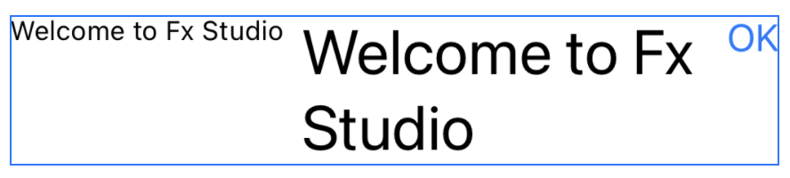
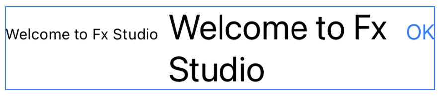
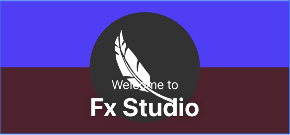
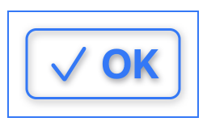

# 013.6 - Stacks & Containers

Chào bạn đến với **Fx Studio**. Chúng ta tiếp tục hành trình bất tận với **SwiftUI**. Các bài viết trước thì bạn đã tìm hiểu về các UI Control cơ bản và kinh điển trong SwiftUI rồi. Bây giờ, chúng ta sẽ đi sang các UI Controls liên quan tới bố cục (*layout*). Đó là các **Stacks** trong SwiftUI.

Nếu bạn chưa biết gì về Stack, thì mình đã có một bài viết các Stacks View. Bạn có thể đọc thêm tại [đây](https://fxstudio.dev/basic-layout-swiftui-notes-11/).

Nếu mọi việc đã ổn rồi thì ...

> Bắt đầu thôi!

## Chuẩn bị

Về mặt tool và version, các bạn tham khảo như sau:

- SwiftUI 2.0
- Xcode 12

Về mặt kiến thức, bạn cần biết trước các kiến thức cơ bản với SwiftUI & SwiftUI App. Tham khảo các bài viết sau, nếu bạn chưa đọc qua SwiftUI:

- [Làm quen với SwiftUI](https://fxstudio.dev/swiftui-phan-1-lam-quen-voi-swiftui/)
- [Cơ bản về ứng dụng SwiftUI App](https://fxstudio.dev/swiftui-phan-2-co-ban-ve-ung-dung-swiftui-app/)

Về mặt demo, hầu như là demo đơn giản, vì tập trung vào từng view riêng lẻ. Do đó, bạn cũng không cần phải quá lo lắng và việc tạo mới project cũng không ảnh hưởng gì nhiều.

*(Mặc định, mình xem như bạn đã biết về cách tạo project với SwiftUI & SwiftUI App rồi.)*

## 1. HStact & VStack

### 1.1. Định nghĩa

Về định nghĩa các Stack thì bạn hay xem ở bài viết cơ bản trên. Bây giờ, chúng ta sẽ chỉ nói về một số đặc điểm mới và kết với Layout giữa chúng.

HStack & VStack tuy 2 đối tượng SwiftUI View khác nhau, nhưng về bản chất lại giống nhau. Khác nhau duy nhất ở chỗ hướng sắp xếp items trong chúng:

* **HStack** sắp xếp các items theo chiều ngang
* **VStack** sắp xếp các item theo chiều dọc

Với UIKit thì chúng ta có người anh em `UIStackView` cũng khá là tương tự với 2 Stack kia. Việc định hướng các items dựa theo thuộc tính `axis`.

### 1.2. Khởi tạo

Ta hay sử dụng các Stack này mà ít khi khám phát nó có nhưng gì. Hầu như ta ta chỉ đặt các View vào giữa 2 dấu `{ }` mà thôi. Bây giờ, ta sẽ khám phá xem hàm khởi tạo của chúng có gì.

```swift
// HStack
init(
  alignment: VerticalAlignment = .center,
  spacing: CGFloat? = nil,
  @ViewBuilder content: () -> Content
)

// VStack
init(
  alignment: HorizontalAlignment = .center,
  spacing: CGFloat? = nil,
  @ViewBuilder content: () -> Content
)
```

Trong đó

* `content` chính là cái thứ mà bạn hay đặt đám View vào giữa 2 dấu `{   }`. Kiểu của nó là `@ViewBuilder`
* `alignment` là căn chỉnh theo chiều ngang hay chiều dọc cho HStack hoặc VStack. Mặc định sẽ là `.center` cho cả 2
* `spacing` khoảng cách giữa các phần tử. Mặc định là `nil` thì sẽ hiển thị dựa theo nền tảng. Muốn không có khoảng cách thì thì gán bằng `0`

### 1.3. alignment

Cũng là khá phong phú cách hiển thị với thuộc tính `alignment` này. Với **VStact** thì bạn có ` .center`, `.leading`, `.trailing`. Đối với **HStack** thì sẽ phong phú hơn nhiều thêm một tí. Ngoài `.center`, `.top` và `.bottom` thì có thêm

* `firstTextBaseline` : Căn chỉnh các chế độ xem dựa trên chế độ xem đường cơ sở văn bản trên cùng.
* `lastTextBaseline` : Căn chỉnh các chế độ xem dựa trên chế độ xem đường cơ sở dưới cùng của văn bản.

Hi vọng bạn tận dùng được tối đa sức mạnh của chúng trong việc bố cục các văn bản mà có sự khác nhau giữa các font chữ và kích thước font chữ ....

Ta xem qua một chút ví dụ cho nó có màu mè trực quan xí.

```swift
    var body: some View {
        HStack(alignment: .top) {
            Text("Welcome to Fx Studio").font(.caption)
            Text("Welcome to Fx Studio").font(.title)
            Button(action: {}, label: { Text("OK").font(.body) })
        }
    }
```

Xem qua kết quả của nó tí nha.



Để ý kĩ, bạn sẽ thấy. Mặc dù ta để chế độ `.top` , tuy nhiên phần tử View ở giữa lại cách mép trên 1 đoạn. Và các phần tử nhìn lồi lõm rất khó chịu phải không nào. Bạn chỉ cần thay đổi từ `.top` thành `.firstTextBaseline`.

```swift
    var body: some View {
        HStack(alignment: .firstTextBaseline) {
            Text("Welcome to Fx Studio").font(.caption)
            Text("Welcome to Fx Studio").font(.title)
            Button(action: {}, label: { Text("OK").font(.body) })
        }
    }
```

Xem kết quả nhoé



Chúng nó đã ở cùng trên 1 dòng rồi. Mặc dù font chữ & size khác nhau. Đẹp rồi á!

## 2. ZStack

Với đối tượng **ZStack** này thì là đặc trưng riêng của SwiftUI. UIKit không có đối tượng tương tự như vậy. ZStack này có gì:

* Các View con được xếp chồng lên nhau
* View con đầu tiền sẽ ở dưới cùng
* Các View vào sau sẽ ở trên các View vào trước
* `.layoutPriority` sẽ không ảnh tới thứ tự ưu tiên của Layout

Về kích thước của ZStack sẽ được xác định dựa vào kích thước view con lớn nhất. 

Về ứng dụng của Stack được dùng nhiều nhất cho việc xếp chồng các View lên với nhau. Bạn xem qua ví dụ sau nha.

```swift
ZStack (alignment: .bottom) {
                VStack(spacing: 0) {
                    Rectangle()
                        .frame(height: 90)
                        .foregroundColor(
                            Color(red: 84.0/255.0, green: 61.0/255.0, blue: 1).opacity(1.0))
                    Rectangle()
                        .frame(height: 90)
                        .foregroundColor(
                            Color(red: 84.0/255.0, green: 32.0/255.0, blue: 46.0/255.0).opacity(1.0))
                }
                
                Image("logo")
                    .resizable()
                    .frame(height: .infinity)
                    .scaledToFit()
                    .clipShape(Circle())
                    .padding()
                
                VStack {
                    Spacer()
                    Text("Welcome to")
                        .font(.body)
                        .foregroundColor(.white)
                    Text("Fx Studio")
                        .font(.largeTitle)
                        .foregroundColor(.white)
                        .fontWeight(.bold)
                        .shadow(radius: 7)
                }
                .padding()
            }
            .frame(height: 180)
```

Xem kết quả nhoé! Bạn hãy cố suy nghĩ các hiển thị giữa các Stack ngay trong đầu mình và đối chiếu với kết quả xem có giống với ý đồ của mình hay không.



*Chúng ta thực hiện đè lên nhau giữa **Image** logi và các **Text**.*

## 3. Các containers khác

Trong SwiftUI thì ngoài các nhóm View cơ bản (là View mà không chứa các View nào nữa) thì chúng ta có các View được gọi là Container. Ở phần trên, bạn đã khám khá các Container là Stacks View. Tuy nhiên, vẫn còn nhiều loại khác mà bạn cảm thấy bất ngờ.

*(Mình chỉ ví dụ vài loại cơ bản mà thôi.)*

### 3.1. Button

Đối tượng này khác là đơn giản. Tuy nhiên, chúng ta dùng hàm khởi tạo như đoạn code ví dụ sau:

```swift
Button(action: {}, label: {
                    HStack {
                        Image(systemName: "checkmark")
                            .font(.largeTitle)
                        Text("OK")
                            .font(.largeTitle)
                            .fontWeight(.bold)
                    }
                    .kute()
                    .padding()
                })
```

Trong đó, `label` là một ViewBuilder. Và bạn có thể thêm nhiều loại View vào đây. Nếu chúng nó là một Stacks View thì lại có thể chứa thêm nhiều View con nữa. Đúng là khá thú vị phải không nào. Xem kết quả nhoé!



### 3.2. Alert

Cũng tương tự như Button với Alert thì ta lại có nhiều tham số với kiểu dữ liệu là `@ViewBuilder`. Do đó, đối tượng View này cũng chứa nhiều hơn một View. Nhưng nó không thực sự là một Stack View.

Ví dụ code thì đơn giản như sau

```swift
   VStack {
       // ......
        }     
        .alert(isPresented: $isAlert: {
            Alert(title: Text("Fx Studio"),
                  message: Text("Hello world!"),
                  dismissButton: .default(Text("Got it!"))
            )
        })
```


Vẫn còn nhiều loại Containers khác, tuy nhiên mình chỉ giới thiệu đại diện với 2 đối tượng là Button & Alert thôi. Các bạn từ từ khám phá sau nhoé.

## Tạm kết

* Bài viết chỉ nhắc lại các kiến thức về các Stack. 
* Giải thích thêm vào các tham số của mỗi loại.
* Giới thiệu thêm vài đối tượng Containers khác hoặc được xem là containers

---

Cảm ơn bạn đã theo dõi các bài viết từ **Fx Studio** & hãy truy cập [website](https://fxstudio.dev/) để cập nhật nhiều hơn!


