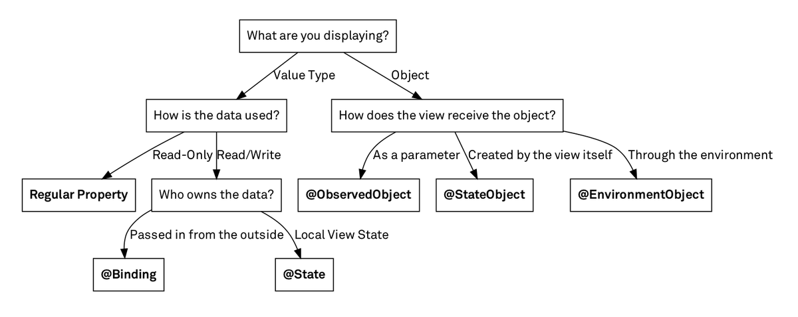

# 014.1 - Tổng quát

Chào bạn đến với **Fx Studio**. Bài viết này sẽ mở đầu cho một chương mới trong series **SwiftUI Notes**. Chương mới này sẽ tập trong về **State & Data Flow** trong SwiftUI. Cách dữ liệu được vận hành và hoạt động, các sự biến đổi giữa giao diện và dữ liệu. Và bài viết đầu đi vào khái niệm tổng quát.

Nếu mọi việc đã ổn rồi, thì ...

> Bắt đầu thôi!

## Chuẩn bị

Về mặt tool và version, các bạn tham khảo như sau:

- SwiftUI 2.0
- Xcode 12

Về mặt kiến thức, bạn cần biết trước các kiến thức cơ bản với SwiftUI & SwiftUI App. Tham khảo các bài viết sau, nếu bạn chưa đọc qua SwiftUI:

- [Làm quen với SwiftUI](https://fxstudio.dev/swiftui-phan-1-lam-quen-voi-swiftui/)
- [Cơ bản về ứng dụng SwiftUI App](https://fxstudio.dev/swiftui-phan-2-co-ban-ve-ung-dung-swiftui-app/)

*(Mặc định, mình xem như bạn đã biết về cách tạo project với SwiftUI & SwiftUI App rồi.)*

## 1. Mô hình MVC

MVC cả là một tượng đại đối với giới lập trình nói chung và với iOS nói riêng. Ngay cả trong framework chính là UIKit hay AppKit, thì đề thể hiện hoặc thiết kế ra để sử dụng với mô hình MVC. 

Dành cho bạn chưa biết thì có thể tóm tắt các thành phần trong MVC như sau:

- **Controller** đóng vai trò chính và kết nối
- **View** là giao diện
- **Model** lưu trữ dữ liệu và trạng thái

Controller đóng vai trò trung tâm và trái tim của toàn bộ mô hình. Giữ mọi thứ đồng bộ với nhau giữa giao diện và  dữ liệu. Ví dụ:

* Chuyển dữ liệu cho giao diện hiển thị
* Cập nhật dữ liệu khi giao diện có tác động hoặc bị thay đổi từ người dùng
* ...

### Vấn đề tồn tại

Trong bài viết này, ta sẽ chỉ tập trung vào mặt đồng bộ giữa dữ liệu và giao diện mà thôi. Các vấn đề khác của MVC tạm thời sẽ không bàn đến.

Bạn xem qua ví dụ sau cho một **ViewController** đơn giản nhất.

```swift
class ViewController: UIViewController {
  var name: String?
  @IBOutlet var nameTextField: UITextField!
}
```

Nếu bạn không cho `nameTextField` một dữ liệu để nó hiển thị, thì người dùng sẽ không bao giờ thấy được. Đó là nguyên nhân bạn cần thêm một thuộc tính String nữa là `name`. Lúc đó, việc truyền dữ liệu cho TextField sẽ như sau:

```swift
nameTextField.text = name
```

Việc lấy dữ liệu mới của TextField thì sẽ như thế này.

```swift
name = nameTextField.text
```

>  Bạn đã nhận ra được vấn đề gì chưa?

Vấn đề dễ thấy sẽ là:

* Quá nhiều đối tượng để lưu trữ và truyền dữ liệu
* Bạn sử dụng thêm Model để làm nơi lưu trữ dữ liệu thì sẽ tăng thêm các biến và vùng nhớ đề lưu trữ dữ liệu. Nhưng chưa chắc giao diện sẽ được cập nhật đúng.

Vấn đề khó thấy sẽ là:

* Trạng thái của dữ liệu chưa chắc là trạng thái của giao diện.
* Sự phát sinh thêm nhiều logic hoặc tách thêm các Model xử lý. Dẫn tới cồng kềnh
* Sự nhập nhèn trong chính nền tảng của (AppKit & UIKit), khi View & Controller không tách biệt rõ ràng.

### Tóm tắt

* Vì nó quá cồng kềnh nên nó là vấn đề chính
* Luôn phải đảm bảo cho UI & Model phải đồng bộ với nhau
* Trạng thái dữ liệu không phải lúc nào cũng đồng bộ với UI
* Từ View bạn có thể thay đổi trạng thái dữ liệu & model
* Rất dễ phát sinh lỗi

## 2. Một giao diện cũng là một chức năng

Ở trên, bạn sẽ đọc qua khái niệm **trạng thái của giao diện**. Và bạn thử suy nghĩ *"sẽ như thế nào khi giao diện của bạn trở thành một chức năng (function)."*

Sẽ giảm đi rất nhiều việc tạo thêm các biến để lưu trữ và truyền dữ liệu từ thành phần này sang thành phần khác. Loại bỏ đi các điều kiện kiểm tra, như cho phép 1 view hiển thị hay không, hoặc phụ thuộc vào 1 hay 1 vài điều kiện nhất định.

Ví dụ: nếu đang kết nối API thì cờ là `true` , thì hiển thị `loading view` . Kết thúc kết nối thì cờ lại là `false`, khi đó `loadingView` sẽ biến mất.

Hay nhất, bạn không cần phải ghi nhớ việc thường xuyên cập nhật lại giao diện khi có sự thay đổi dữ liệu. Ví dụ: có nhiều chỗ trong màn hình có thể tương tác với API, thì phải đảm bảo việc cập nhật giao diện tại tất cả các điểm đó.

Ngoài ra,

- Giảm đi các tham chiếu và các tham chiếu của các closure đi khá nhiều
- View sẽ xuất hiện giống như với dữ liệu ban đầu và cập nhật giống như dữ liệu được cập nhật.

Những điểm trên thì không giúp bạn giỏi lên đâu, nếu bạn quản lý tốt các liên kết và cập nhật đồng bộ giữa các thành phần thì *MVC* vẫn là bá chủ. Nhưng mà thay đổi một chút để vui vẻ hơn, đơn giản hơn và ít bugs hơn.

#### Cần gì để thực hiện được điều này

> **SwiftUI** hội tụ đầy đủ các yếu tố mà bạn cận để làm một cuộc cách mạng

- **Declarative** : bạn không triển khai (implement) giao diện mà là khai báo chúng (declare)
- **Functional** : giao diện là một function của trạng thái
- **Reactive**: khi có thay đổi, giao diện sẽ tự động cập nhật

> Ahihi!

## 3. Tổng quan về State & Data Flow

**SwiftUI** cung cấp một cách tiếp cận **Declarative** cho UI design. Bạn sẽ thiết kế nên sự phân cấp trong hệ thống các view và chỉ ra sự phụ thuộc giữa dữ liệu & View. Khi có tác động của người dùng thì **SwiftUI** sẽ cập nhật lại các phần giao diện bị ảnh hưởng. *Framework* này sẽ đảm đương hầu hết các công việc như một *View Controller* (lúc trước)

**SwiftUI** cung cấp cho bạn nhiều công cụ, như biến trạng thái, binding … để kết nỗi giữa dữ liệu và giao diện. Tất cả công cụ này giúp duy trì một thứ gọi là `single source of truth` cho tất cả các dữ liệu trong app. Và giảm đi một phần logic của bạn viết.



Trong đó,

- Quản lý các trạng thái của UI trong chính View của nó bằng các thuộc tính **State**
- Kết nối với các dữ liệu model tham chiếu bên ngoài thông qua **Observable Protocol** và các thuộc tính **ObserverObject**
- Truy cập tới các đối tượng có thể quan sát được từ mô trường thông qua các thuộc tính **EnvironmentObject**
- Tạo ra một đối tượng có thể quan sát được ở trong View bằng thuộc tính **StateObject**
- Chia sẽ các tham chiếu tới `source of truth` (tương tự như các đối tượng tham chiếu quan sát được ở trên) thông qua các thuộc tính **Binding**
- Truyền dữ liệu đi trong toàn bộ app thông qua các biến **Environment**
- Truyền dữ liệu đi qua hệ thống phân cấp View bằng **PreferenceKey**
- Sử dụng **FetchRequest** để tương tác với **CoreData**

## 4. Sực mạnh của các Property Wrappers

Như đã nói ở trên, công cụ mà **SwiftUI** cung cấp cho bạn chính là các **Property Wrappers**. Giúp bạn quản lý dữ liệu của các biến **State** hay **Binding**. Để áp dụng thì khá là đơn giản, bạn chỉ cần thêm tên của **Property Wrappers** vào trước các thuộc tính của bạn.

Ví dụ, khi muốn biến một thuộc tính Bool thành một kiểu State với Property Wrappers như sau:

```swift
 @State private var isVisible = true
```

Các thuộc tính mà được bọc với **Property Wrappers** thì sẽ mang các đặc tính của **Property Wrappers** đó. Các **State** & **Data** đó sẽ theo dõi các thay đổi dữ liệu. Khi bạn tham chiếu trực tiếp tới thuộc tính trong code, bạn có thể sử dụng trực tiếp được giá trị của nó.

Ví dụ code tham khảo tiếp nha.

```swift
if isVisible == true {
    Text("Hello") // Only rendered when isVisible is true.
}
```

Ngoài ra, khi bạn truy cập giá trị của một **Property Wrapper** bằng tiền tố `$` thì bạn sẽ tạo ra một tham chiếu `Binding`. Là một kết nối 2 chiều giữa View khác (ở bên ngoài) và `single source of truth`.  

Ví dụ tiếp nữa nè.

```swift
Toggle("Visible", isOn: $isVisible) // The toggle can update the stored value.
```

Bạn yên tâm là chúng ta sẽ tìm hiểu tất cả **Property Wrapper** của *SwiftUI* trong các bài viết sau. Còn nếu bạn muốn tìm hiểu riêng về Wrapper trong *Swift*, thì có thể tham khảo tại [đây](https://docs.swift.org/swift-book/LanguageGuide/Properties.html#ID617).

## Tạm kết

* Biết được các vấn đề còn tồn tại trong MVC 
* Sự đồng bộ giữa trạng thái dữ liệu và giao diện của ứng dụng
* Tổng qua về State & Data Flow trong SwiftUI
* Sức mạnh về các Property Wrapper mang lại

---

Cảm ơn bạn đã theo dõi các bài viết từ **Fx Studio** & hãy truy cập [website](https://fxstudio.dev/) để cập nhật nhiều hơn!
