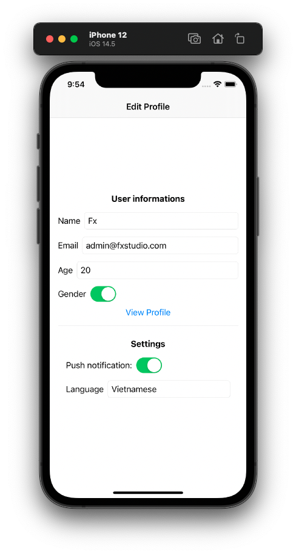

# 014.5 - Sharing in the environment

Chào bạn đến với Fx Studio. Chúng ta tiếp tục cuộc hành trình phiêu lưu với vũ trụ SwiftUI trong series SwiftUI Notes này. Bài viết lần này sẽ trình bày về một thế lực mà ta không thể bỏ qua được, đó là các biến môi trường. Hay còn gọi là **Environment Object**. Và bạn sẽ là được những điều không tưởng từ nó.

Nếu mọi thứ đã ổn rồi, thì ...

> Bắt đầu thôi!

## Chuẩn bị

Về mặt tool và version, các bạn tham khảo như sau:

- SwiftUI 2.0
- Xcode 12

Về mặt kiến thức, bạn cần biết trước các kiến thức cơ bản với SwiftUI & SwiftUI App. Tham khảo các bài viết sau, nếu bạn chưa đọc qua SwiftUI:

- [Làm quen với SwiftUI](https://fxstudio.dev/swiftui-phan-1-lam-quen-voi-swiftui/)
- [Cơ bản về ứng dụng SwiftUI App](https://fxstudio.dev/swiftui-phan-2-co-ban-ve-ung-dung-swiftui-app/)

*(Mặc định, mình xem như bạn đã biết về cách tạo project với SwiftUI & SwiftUI App rồi.)*

## Environment

Như bạn cũng đã biết, thì câu chuyện nói về việc truyền dữ liệu qua lại giữa các màn hình với nhau không bao giờ là đơn giản. Thậm chí giữa các đối tượng với nhau hay phức tạp hơn là trong toàn bộ ứng dụng.

Điều vui nữa là chúng ta đang trong vũ trụ **SwiftUI**, là một ứng dụng **Declarative Programming**. Thì nó sẽ có những tư duy và lối suy nghĩ riêng của mình. Cho nên việc truyền dữ liệu đi cũng phải tuân thủ các nguyên tắc riêng để phù hợp với SwiftUI.

Với các State & Binding thì chúng ta đảm bảo dữ liệu được truyền trong một phạm vi nhất định. Bây giờ, chúng ta sẽ tìm hiểu tiếp cách để truyền dữ liệu cho toàn bộ các thành phần trong một ứng dụng.

Bạn có thể suy nghĩ tới Singleton là lựa chọn phù hợp cho bạn. Tuy nhiên, chúng ta sẽ có một vài hạn chế của mẫu design này, mặc dù nó khó tốt và đơn giản. Nó sẽ tạo ra nhiều hiệu ứng (side effect). Nó không bị ràng buộc hoặc dễ xãy ra các cuộc chạy đua dữ liệu.

Cái mà chúng ta đang cần hướng tới chính là những đối tượng Môi trường **(environment objects**). Dữ liệu của bạn sẽ đáp ứng được các nguyên tắc của **The single source of truth** và đáp ứng binding 2 chiều. Ngoài ra, bạn có thể tạo ra các ràng buộc nhất định giữa View và dữ liệu (**Dependency Injection)**.

* Truyền qua nội bộ vài view hay phân cấp của view mà giữ nguyên được dữ liệu của các View cha từ các View con
* Truyền qua toàn bộ ứng dụng
* Sử dụng được các giá trị môi trường của thiết bị.

Chúng ta sẽ bắt đầu tìm hiểu về Environment trong Swift thông 2 kiểu đặc trưng sau.

## Dependency Injection via Environment

> Dependency injection là một kĩ thuật trong đó một object (hoặc một static method) cung cấp các dependencies của một object khác. Một dependency là một object mà có thể sử dụng (một service). 
>
> *(Theo wikipedia)*

### Cơ chế hoạt động

Nói cho đúng thì đây không phải chính xác là cơ chế Dependency injection 100%. Tuy nhiên, SwiftUI sẽ dựa vào những nguyên tắc cơ bản đó mà tạo nên cơ chế hoạt động của các Environment Object và cách chúng vận hành.

Đơn giản sẽ là:

* Bạn truyền các đối tượng vào một nơi nào đó (View), có thể hiểu như một cái túi. Dữ liệu & giao diện của View sẽ phụ thuộc vào các đối tượng mà bạn thêm vào. Từ đó tạo nên các ràng buộc hay yêu cầu khi tạo mới một View
* Tại các nơi mà bạn sử dụng thì bạn có thể lấy nó ra & dùng bình thường. Ngoài ra, bạn có thể truyền đi trong phân cấp View của chính nó.

> Cái túi tưởng tượng đó sẽ là **Environment**. Và các đối tượng được gởi vào là các **Environment Object**.

SwiftUI sẽ hỗ trợ cho cơ chế này bằng các function và Property Wrapper như sau:

* Gửi đối tượng vào môi trường thì sử dụng modifier `.environmentObject(_:)`
* Lấy dữ liệu được gửi vào môi trường ra để sử dụng thì sử dụng `@EnvironmentObject`

### Khai báo Environment Object

Với `@EnvironmentObject`, dùng để khai báo các thuộc tính trong View với kiểu dữ liệu đáp ứng với **ObservableObject Protocol**. Khi đó, thuộc tính mới của chúng ta sẽ đảm bảo được các nguyên tắc của **State & Data Flow**. Quan trọng nhất là các giao diện sẽ tự động cập nhật lại khi bạn sử dụng **Environment Object**.

Đầu tiên, chúng ta cần phải khai báo một class để sử dụng làm đối tượng được truyền đi. Bạn có thể tham khảo đoạn code sau:

```swift
class UserProfile: ObservableObject {
    @Published var name: String
    @Published var email: String
    @Published var age: Int
    @Published var gender: Bool
    
    init(name: String, email: String, age: Int, gender: Bool) {
        self.name = name
        self.email = email
        self.age = age
        self.gender = gender
    }
}
```

Trong đó, class **UserProfile** hoàn toàn bình thường. Và tuân thủ đầy đủ các yêu cầu như trên đã liệt kê.

* Kế thừa ObservableObject Protocol
* Sử dụng các @Published cho các thuộc tính của class

Lúc này, chúng ta sẽ khai báo một thuộc tính mà nó sẽ trở thành một Environment Object. Ví dụ code như sau:

```swift
struct View6: View {
    
    @EnvironmentObject var userProfile: UserProfile
    
    var body: some View {
        VStack {
           //....
        }
        .padding()
    }
}
```

Trong đó, bạn chú ý tới thuộc tính `userProfile` sẽ được khai báo với `@EnvironmentObject`. Và thuộc tính sẽ mang đầy đủ tính chất của một **State**. Bạn tham khảo các sử dụng như sau.

```swift
   struct View6: View {
    
    @EnvironmentObject var userProfile: UserProfile
    
    static var numberFormater: NumberFormatter {
        let nf = NumberFormatter()
        nf.numberStyle = .decimal
        return nf
    }
    
    var body: some View {
        VStack {
            HStack {
                Text("Name")
                TextField("name", text: $userProfile.name)
                    .textFieldStyle(RoundedBorderTextFieldStyle())
            }
            HStack {
                Text("Email")
                TextField("email", text: $userProfile.email)
                    .textFieldStyle(RoundedBorderTextFieldStyle())
            }
            HStack {
                Text("Age")
                TextField("Age",
                          value: $userProfile.age,
                          formatter: View6.numberFormater)
                    .textFieldStyle(RoundedBorderTextFieldStyle())
            }
            HStack {
                Text("Gender")
                Toggle("Gender", isOn: $userProfile.gender)
                    .labelsHidden()
                Spacer()
            }
        }
        .padding()
    }
}
```

Ta vẫn sẽ sử dụng tiền tố `$` để tạo nên Binding 2 chiều tới thuộc tính. Giúp cho View có thể cập nhật giá trị của thuộc tính một cách tự động.

Cuối cùng chính là cách truyền đối tượng vào môi trường. Bạn sẽ phải dùng tới modifier `.environmentObject(:_)` cho View mà bạn muốn truyền vào. Ví dụ code như sau:

```swift
        View6()
            .environmentObject(UserProfile(name: "Fx",
                                           email: "fxstudio@mail.com",
                                           age: 19,
                                           gender: true))
```

Hãy build và cảm nhận.

### Phân cấp View

Chúng ta sẽ tiếp tục tìm hiểu sức mạnh nữa của Environment mang lại trong SwiftUI. Đó là,

> Trong phần cấp View, các View con sẽ kế thừa lại tất cả các Environment Object từ các View cha của nó.

Điều này có nghĩa, bạn chỉ cần khai báo thuộc tính `@EnvironmentObject` tại các View con. Chúng nó sẽ tự động lấy các đối tượng môi trường của View cha. Rất tiện lợi phải không nào!

Để xem ví dụ ta tạm thời chỉnh sửa lại lại `body` của View trên như sau:

```swift
    var body: some View {
        NavigationView {
            VStack {
                HStack {
                    Text("Name")
                    TextField("name", text: $userProfile.name)
                        .textFieldStyle(RoundedBorderTextFieldStyle())
                }
                HStack {
                    Text("Email")
                    TextField("email", text: $userProfile.email)
                        .textFieldStyle(RoundedBorderTextFieldStyle())
                }
                HStack {
                    Text("Age")
                    TextField("Age",
                              value: $userProfile.age,
                              formatter: View6.numberFormater)
                        .textFieldStyle(RoundedBorderTextFieldStyle())
                }
                HStack {
                    Text("Gender")
                    Toggle("Gender", isOn: $userProfile.gender)
                        .labelsHidden()
                    Spacer()
                }
                NavigationLink(destination: ProfileView()) {
                    Text("View Profile")
                }
            }
            .padding()
            .navigationTitle("Edit Profile")
            .navigationBarTitleDisplayMode(.inline)
        }
```

Bạn hãy chú ý tại `NavigationLink(destination: ProfileView()) { ... }`

* Chúng sẽ gọi một View khác trong View hiện tại
* Nhìn code thì ta sẽ không khai báo bất cứ gì thêm cho hàm khởi tạo của View con. Hay gọi thêm các modifier nào thêm.
* Việc triệu hồi `.environmentObject(:_)` là dư thừa

Bạn xem qua code của ProfileView thì như sau:

```swift
struct ProfileView: View {
    
    @EnvironmentObject var userProfile: UserProfile
    
    var body: some View {
        VStack {
            Text(userProfile.name)
                .font(.title)
            Text(userProfile.email)
                .font(.body)
                .fontWeight(.thin)
            Text("\(userProfile.age)")
                .font(.body)
                .fontWeight(.thin)
            Text(userProfile.gender ? "male" : "female")
                .font(.body)
                .fontWeight(.thin)
            Spacer()
        }
        .padding()
        .navigationTitle("Profile")
    }
}
```

Tất cả, bạn chỉ cần khai báo một thuộc tính `@EnvironmentObject` mà thôi. Còn lại SwiftUI sẽ lo hết cho bạn.

Hãy build lại project và cảm nhận kết quả nhoé!

> Bạn có thể sử dụng `@ObservedObject` thay cho `@EnvironmentObject` thì vẫn được. Tuy nhiên, bạn sẽ cần truyền đối tượng cho View tại hàm khởi tạo của nó. Cách này là Binding dữ liệu từ nguồn sự thật chân lý.

### Root

Khi bạn khởi tạo *Environment Object* tại **Window** và gửi nó vào môi trường của View. Lúc đó, chúng ta có một phiên bản *Singleton* cho toàn bộ luồng của View đó. 

```swift
@main
struct DemoStateDataFlowApp: App {
    
    var body: some Scene {
        WindowGroup {
            var userProfile = UserProfile(name: "Fx", email: "admin@fxstudio.com", age: 20, gender: true)
            
            View6()
                .environmentObject(userProfile)
        }
    }
}
```

Bạn sẽ không cần quan tâm tới việc truyền các *Environment Object* tại các View con trong phân cấp view của nó nữa. Lúc này, bạn muốn sử dụng đối tượng đó tại bất cứ đâu. Thì chỉ cần khai báo thuộc tính với `@EnvironmentObject` là đủ.

Hãy build project và cảm nhận tiếp nha. Còn tiếp tục, thì bạn hãy suy nghĩ nếu chúng ta cần hơn 1 biến môi trường thì như thế nào. Ví dụ như khai báo ở View sau đây.

```swift
struct View6: View {
    
    @EnvironmentObject var userProfile: UserProfile
    @EnvironmentObject var settings: Settings
    
    // .....
    
}
```

View sẽ sử dụng 2 biến môi trường cho 2 thuộc tính. Và theo nguyên tắc như sau:

> Bạn cần bao nhiêu biến môi trường thì hãy truyền chừng đó biến vào.

Ta sẽ cập nhật lại code tại Window như sau:

```swift
@main
struct DemoStateDataFlowApp: App {
    
    var body: some Scene {
        WindowGroup {
            var userProfile = UserProfile(name: "Fx", email: "admin@fxstudio.com", age: 20, gender: true)
            
            View6()
                .environmentObject(userProfile)
                .environmentObject(Settings())
        }
    }
}
```

Khá là EZ phải không nào! Quan trọng nhất là

> Bạn sẽ quản lý dữ liệu tập trung tại một nơi và gởi vào các môi trường. Tạo ra sự ràng buộc cần thiết đối với các View.

Build lại project và cảm nhận kết quả nhoé!



## Environment properties

Ở phần trên, chúng ta đã sử dụng các đối tượng và truyền chúng vào môi trường. Với mục đích truyền dữ liệu đi cho toàn bộ ứng dụng hoặc cho một luồng View. Tất cả đều liên quan tới dữ liệu là chính.

Phần tiếp theo này, chúng ta sẽ sử dụng các **Environment Properties**. Các thuộc tính này được cài đặt sẵn và tác động trực tiếp tới giao diện hiển thị của các View. Mang ý nghĩa như các Global Settings cho toàn ứng dụng. Dựa vào đó bạn có thể custom các view một cách khác biệt nhau. Hay tương thích với các giá trị đã được thiết lập của chính thiết bị.

Các **Environment Properties** này sẽ:

* Ảnh hưởng tới các View mà  sử dụng nó.
* Cung cấp một giá trị ban đầu cho View để sử dụng
* View có thể gán lại giá trị mới.
* Giữa các View ngang cấp với nhau thì sẽ không bị ảnh hưởng khi View này thay đổi giá trị của biến môi trường. Vì nó áp dụng cho từng View
* Trong phân cấp View thì biến môi trường này vẫn có sự ảnh hưởng từ View cha cho các View con.

### Các giá trị môi trường

Chúng ta sẽ sử dụng các thế lực được định nghĩa từ trước của SwiftUI. Đây là các giá trị biến môi trường (Environment Values) của chính nền tảng hay thiết bị mà ứng dụng đang hoạt động.

> Bạn có thể xem qua danh sách các Environment Values tại [đây](https://developer.apple.com/documentation/swiftui/environmentvalues).

Các giá trị này ảnh hưởng trực tiếp tới các View của bạn. Ví dụ, bạn có thể lấy được giá trị của ngôn ngữ hiện tại đang sử dụng như sau:

```swift
@Environment(\.locale) var locale: Locale
```

Trong đó:

* `@Environment` là **Property Wrapper** dùng để khai báo một thuộc tính biến môi trường
* `\.locale` là **key path** của giá trị này. Bạn có thể tham khảo thêm ở link trên cho các **Environment Values** khác.
* Còn lại thì như khai báo một thuộc tính bình thường. Với `locale` là tên thuộc tính & **Locale** là kiểu dữ liệu của thuộc tính.

Như vậy, bạn không cần khai báo hay khởi tạo bất cứ gì cho các biến môi trường này. View sẽ tự động lấy giá trị biến môi trường từ chính thiết bị của bạn.

Bạn muốn lấy gì thêm thì hãy khai báo thêm. Rất chi là đơn giản và dễ sử dụng. Và trong thực tế bạn sẽ phải sử dụng nó rất nhiều để thiết kế giao diện một cách đẹp nhất.

### Sử dụng

Về cách sử dụng này, mình đã trình bày ở bài viết [Basic Environment values](https://fxstudio.dev/basic-environment-values-swiftui-notes-9/). Cũng khá chi tiết và đầy đủ rồi. Bạn có thể tham khảo để biết các cách dùng cơ bản hoặc sử dụng các giá trị môi trường tốt nhất.

Tóm tắt những thứ bạn có thể làm được như sau:

- Thay đổi biến môi trường ở Preview để ảnh hưởng toàn bộ View.
- Lấy giá trị biến môi trường để tạo thành một property. Nhằm cài đặt giao diện phù hợp & linh hoạt hơn.
- Xét giá trị biến môi trường
  - Cho từng View
  - Từng loại thuộc tính
  - Ảnh hưởng toàn bộ các View con

Sau đây, mình sẽ làm một ví dụ nhỏ để tổng hợp tất cả các cách sử dụng **Environment Values**.

```swift
struct View7: View {
    
    @Environment(\.colorScheme) var colorScheme: ColorScheme
    
    var body: some View {
        if colorScheme == .light {
            Text("Light mode")
        } else {
            Text("Dark mode")
                .colorScheme(.light)
        }
    }
}

struct View7_Previews: PreviewProvider {
    static var previews: some View {
        View7()
            .environment(\.colorScheme, .dark)
    }
}
```

Build và cảm nhận kết quả nhoé!

## Custom Environment properties

Đây mới là nhân vật chính của chúng ta. Bất cứ cái gì **Custom** thì đều quan trọng cần chú ý và phải làm được nó. Và với *Environment Values* thì chúng ta vẫn có thể **Custom** được. Để có được những **giá trị** hay **key path** riêng.

```swift
@Environment(\.locale) var locale: Locale
```

Giá trị custom này cũng tương tự như các giá trị mặc định. Ta sẽ cần có 2 phần chính.

* **Key path** để xác định nó trong tất cả các giá trị biến môi trường
* Tạo mới các **computed properties** để đọc & ghi giá trị cho biến môi trường mới.

> Các **Environment Values** này bạn có thể áp dụng được cho cả giao diện & dữ liệu.

### Create Environment Key

#### 1. Create the environment key

Bắt đầu, chúng ta cần một `key` để xác định Giá trị biến môi trường. Bạn cần phải:

* Tạo mới một **Struct**, yêu cầu kế thừa **EnvironmentKey Protocol**. Đây là `key` của bạn.
* **EnvironmentKey Protocol** sẽ yêu cầu bạn khai báo `defaultValue` và cung cấp giá trị ban đầu cho nó.
* Bạn có thể sử dụng `private struct` để che đi các khai báo này khi không muốn cho nó trùng lặp với nhiều khai báo khác.

Ví dụ tham khảo khai báo một struct cho màu sắc với giá trị biến môi trường như sau:

```swift
private struct CaptionColorKey: EnvironmentKey {
  static let defaultValue = Color(.secondarySystemBackground)
}
```

#### 2. Extend the environment

Khi đã có `key`, việc tiếp theo là sẽ tạo `value`. Bằng cách mở rộng EnvironmentValues với việc thêm một thuộc tính mới. Nó là:

* Computed Property. Giá trị của nó sẽ phải được tính toán và phải đảm báo khai báo thuộc tính trong `extension`.
* Sử dụng các `set` & `get` để đọc ghi giá trị cần thiết cho thuộc tính mới tạo.

Tiếp tục tham khảo ví dụ của chúng ta như sau:

```swift
extension EnvironmentValues {
  var captionBackgroundColor: Color {
    get { self[CaptionColorKey.self] }
    set { self[CaptionColorKey.self] = newValue }
  }
}
```

#### 3. Add a view modifier (Optional)

Bước này thật sự không cần thiết. Vì bạn đã được SwiftUI cung cấp sẵn modifier `.environment(:_:_)` với 2 tham số là cho giá trị biến môi trường rồi.

* Key patch
* Valule

Ví dụ như sau:

```swift
ContentView()
  .environment(\.captionBackgroundColor, .yellow)
```

Còn để cho code của bạn nhìn chuyên nghiệp hơn. Bạn có thể mở rộng thêm **View** và thêm một modifier mới.

```swift
extension View {
  func captionBackgroundColor(_ color: Color) -> some View {
    environment(\.captionBackgroundColor, color)
  }
}
```

Thực chất là nó cũng gọi lại cách trên mà thôi. Như vậy, bạn đã hoàn thành việc tạo một **Environment Value** mới rồi.

### Sử dụng

Cũng tương tự như trên, cách sử dụng không có thay đổi nhiều. Bắt đầu, chúng ta sẽ báo thêm 1 thuộc tính với `@Environment`. Tham khảo với ví dụ trên như sau.

```swift
@Environment(\.captionBackgroundColor) var backgroundColor
```

 Tương tác nó vào View của bạn như một thuộc tính bình thường.

```swift
var body: some View {
        if colorScheme == .light {
            Text("Light mode")
                .background(backgroundColor)
        } else {
            Text("Dark mode")
                .colorScheme(.light)
                .background(backgroundColor)
        }
    }
```

Nếu để mặc định thì `backgroudColor` sẽ là màu hệ thông định nghĩa. Ví dụ với

* Light mode


* Dark mode


Nhìn hơi xấu và bạn vẫn có thể cang thiệp để thay đổi giá trị mặc định này như sau.

```swift
struct View7_Previews: PreviewProvider {
    static var previews: some View {
        View7()
            .environment(\.colorScheme, .dark)
            .environment(\.captionBackgroundColor, .accentColor)
    }
}

```

Hoặc cách khác

```swift
struct View7_Previews: PreviewProvider {
    static var previews: some View {
        View7()
            .environment(\.colorScheme, .dark)
            //.environment(\.captionBackgroundColor, .accentColor)
            .captionBackgroundColor(.blue)
    }
}
```

Lúc này, Environment Value của bạn sẽ không bị ảnh hưởng bởi chính thiết bị hay các giá trị mặc định nữa rồi.


## Tạm kết

* Hiểu về **Environment** trong SwiftUI & các dữ liệu được truyền đi
* Cơ chế hoạt động của Enviroment & sự ràng buộc dữ liệu với các đối tượng trong SwiftUI
* Sử dụng được **Environment Object** cho việc truyền dữ liệu đi trong các View và ứng dụng
* Khai thác các **Environment Values** được cài đặt sẵn để tuỳ biến giao diện cho phù hợp hơn với thiết bị.
* Tạo mới các **Custom Environment Values** cho riêng bạn.

---

Cảm ơn bạn đã theo dõi các bài viết từ **Fx Studio** & hãy truy cập [website](https://fxstudio.dev/) để cập nhật nhiều hơn!
