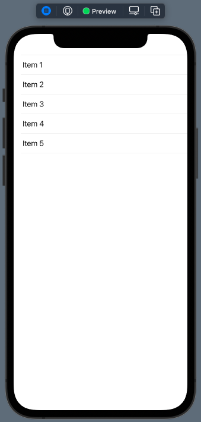
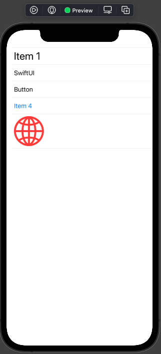
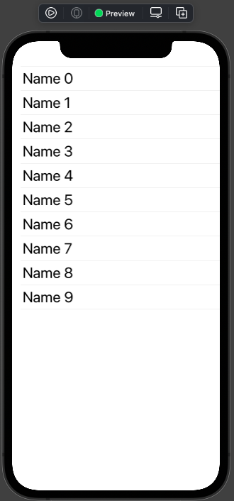
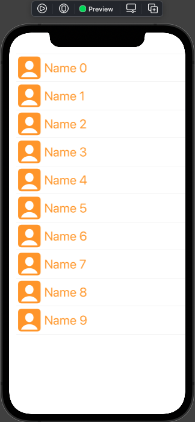
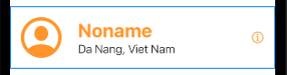
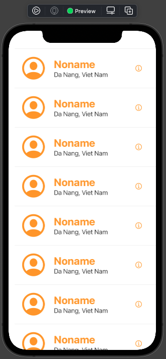
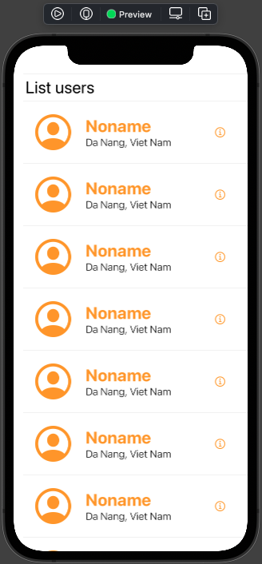

# 015.1 - Simple List

Chào mừng bạn đến với **Fx Studio**. Đây là bài đầu tên cho chương mới **Working with List** của series **SwiftUI Notes**. **List** hay danh sách thì là một trong những control cơ bản và quan trong nhất để cấu thành giao diện ứng dụng. Khi bạn tự tin nắm được xử lý về **List** thì coi nhưng bạn đã hoàn thành **SwiftUI**.

Nếu mọi việc đã ổn rồi, thì ...

> Bắt đầu thôi!

## Chuẩn bị

Về mặt tool và version, các bạn tham khảo như sau:

- SwiftUI 2.0
- Xcode 12

Về mặt kiến thức, bạn cần biết trước các kiến thức cơ bản với SwiftUI & SwiftUI App. Tham khảo các bài viết sau, nếu bạn chưa đọc qua SwiftUI:

- [Làm quen với SwiftUI](https://fxstudio.dev/swiftui-phan-1-lam-quen-voi-swiftui/)
- [Cơ bản về ứng dụng SwiftUI App](https://fxstudio.dev/swiftui-phan-2-co-ban-ve-ung-dung-swiftui-app/)

*(Mặc định, mình xem như bạn đã biết về cách tạo project với SwiftUI & SwiftUI App rồi.)*

## List

Hồi tưởng về quá khứ một tí với người tiền nhiệm là *UIKit*. Chúng ta có **UITableView**, đây cũng là control tương tự với **List** của *SwiftUI View*.

**Vậy List được sử dụng với mục đích gì?**

> Đơn giản là hiển thị một danh sách lên giao diện.

Chúng ta sẽ có nhiều biến thể từ List để hiển thị danh sách với nhiều mục địch khác nhau:

* Danh sách 1 chiều và nhiều chiều
* Hiển thị Image
* Scroll theo 2 chiều khác nhau
* Hiển thị danh sách với các loại item khác nhau
* Hiển thị dữ liệu lấy được từ API
* ....

Và nếu bạn để ý thì trong bất cứ ứng dụng mobile nào (trừ game nhoé) thì đều cũng xuất hiện hình bóng của **List**. Do đo, hiểu và xử lý thành thục nó là một điều bắt buộc đối với bạn.

### Tạo một List đơn giản

Bắt đầu, chúng ta cần tạo một file **SwiftUI View**, với tên tuỳ ý bạn. Sau đó, bạn hãy thêm đoạn code sau đây vào:

```swift
struct SimpleListView: View {
    var body: some View {
        List {
            Text("Item 1")
            Text("Item 2")
            Text("Item 3")
            Text("Item 4")
            Text("Item 5")
        }
    }
}
```

Trong `body` của View chứa một Control là **List**. Nó là một compomemts, bản thân nó chưa được nhiều View khác. Cú pháp cho List khá đơn giản.

```swift
List {
  // Ahihi
}
```

Bạn hãy bấm Resume và xem kết quả nhoé.



Tiếp theo, bạn biến tấu một tý với List trên nhoé. Tham khảo như sau:

```swift
struct SimpleListView: View {
    var body: some View {
        List {
            Text("Item 1")
                .font(.title)
            Text("SwiftUI")
            Button(action: {
                
            }, label: {
                Text("Button")
            })
            Text("Item 4")
                .foregroundColor(Color.blue)
            Image(systemName: "globe")
                .resizable()
                .foregroundColor(Color.red)
                .frame(width: 80, height: 80)
        }
    }
}
```

Trong này, ta sẽ để nhiều loại *SwiftUI View* khác nhau. Và List của bạn vẫn cân tốt hết nhoé. Tới đây, đặc tính của **List** cũng khá tương đồng với **ScrollView**.



### Lặp các phần tử

Tiếp theo, bạn sẽ đi vào ý nghĩa chính của List, đó là hiện thị một danh sách nào đó. Nhưng trước tiên chúng ta xem thử khả năng lặp các phần tử của nó như thế nào.

```swift
struct LoopItemsView: View {
    var body: some View {
        List (0..<10) { index in
            Text("Name \(index)")
                .font(.title)
        }
    }
}
```

Trong đó:

* Tham số cho **List** là một range từ `0 ~ 10`
* Tại mỗi bước lặp, ta thêm một **Text** và nội dụng theo `index`

Bấm Resume và xem kết quả nhoé!



### Nhiều View cho một Row

Ta tiếp tục thử với việc cho nhiều View vào trong một row của List xem như thế nào nha. Lưu ý, chỉ áp dụng được với phương pháp lặp phần tử mà thôi.

Chúng ta sẽ thêm một Image vào trong ví dụ trên tại mỗi bước lặp của List nhoé. Tham khảo đoạn code sau:

```swift
struct LoopItemsView: View {
    var body: some View {
        List (0..<10) { index in
            Image(systemName: "person.crop.square.fill")
                .resizable()
                .foregroundColor(Color.orange)
                .frame(width: 50, height: 50)
            Text("Name \(index)")
                .font(.title)
                .foregroundColor(Color.orange)
        }
    }
}
```

Bấm Resume và cùng nhau xem kết quả nhoé.



Okay, như vậy chúng ta đã có được một Simple List rồi. Tiếp theo, chúng ta sẽ tối ưu code của chương trình.

## Custom Row

Công việc tiếp theo của chúng ta là tạo một **Custom View** cho từng **Row** nhoé. Công việc này cũng khá tương tự với Custom TableView Cell cho UITableView ở UIKit.

### 1. Create Custom Row

Bắt đầu, mình tạo thêm một file SwiftUI View và đặt tên là `UserCell`. Mục đích tri ân tới UIKit với cái tên `cell` thôi. Bạn tham khảo code của nó như sau.

```swift
struct UserCell: View {
    var body: some View {
        HStack {
            Image(systemName: "person.crop.circle")
                .resizable()
                .foregroundColor(Color.orange)
                .frame(width: 60, height: 60, alignment: .center)
                .padding(.all)
            VStack(alignment: .leading) {
                Text("Noname")
                    .font(.title)
                    .fontWeight(.bold)
                    .foregroundColor(Color.orange)
                    Text("Da Nang, Viet Nam")
                        .fontWeight(.light)
            }
            Spacer()
            Image(systemName: "info.circle")
                .foregroundColor(Color.orange)
                .padding(.all)
        }
    }
}
```

Cũng khá đơn giản cho Custom View này:

* Bố cục giao diện với HStack & VStact
* Các Control cơ bản (Text & Image)

Bấm Resume để xem View mới chúng ta như thế nào nhoé!



### 2. Sử dụng vào List

Bước này thì khá đơn giản, bạn thay đổi lại đoạn code của List như sau:

```swift
struct LoopItemsView: View {
    var body: some View {
        List (0..<10) { _ in
            UserCell()
        }
    }
}
```

Tại mỗi bước lặp, ta tạo ra một đối tượng SwiftUI View `UserCell`. Như vậy là xong rồi. Chúng ta bấm Resume để tận hưởng kết quả luôn nhoé!



Tới đây, bạn sẽ thấy **SwiftUI** khá là nhanh và tiện lợi hơn so vơi UIKit không nào. Để custom được **tableview cell** thì bạn phải khai báo thêm nhiều function **Delegate** nữa.

## ForEach

Để hiển thị một danh sách bên trong một danh sách khác hoặc trong một **Component View** khác. Bạn có thể sử dụng tới **ForEach**. 

Tham khảo ví dụ sau:

```swift
struct ForEachDemoView: View {
    var body: some View {
        List {
            Text("List users")
                .font(.title)
            ForEach(0..<10) { _ in
                UserCell()
            }
        }
    }
}
```

Trong đó:

* **List** chưa 2 phần tử là **Text** và **ForEach**
* Tại **ForEach** chúng ta sẽ lặp lần lượt từ 0 đến 10, mỗi bước lặp bạn tạo ra một **UserCell**

Cùng nhau xem kết quả nhoé!



Nếu bạn để ý, với **ForEach** thì chúng ta có thể tạo được nhiều List trong một List. Ngoài ra, tuỳ ý thêm bớt các giao diện khác.

> Đây là tiền đề cho việc tạp nên các giao diện với các danh sách phức tạp.

## Tạm kết

* Hiển thị danh sách đơn giản với List
* Lặp các phần tử với List & ForEach
* Custom Row để tạo giao diện cho từng Row trong danh sách

---

Cảm ơn bạn đã theo dõi các bài viết từ **Fx Studio** & hãy truy cập [website](https://fxstudio.dev/) để cập nhật nhiều hơn!
