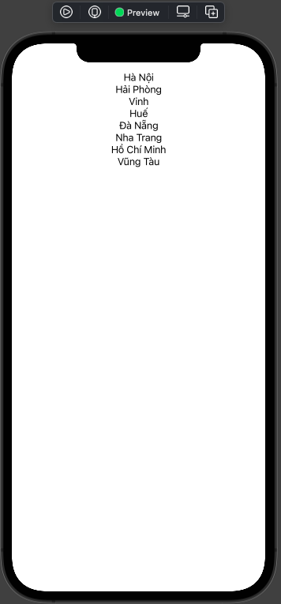
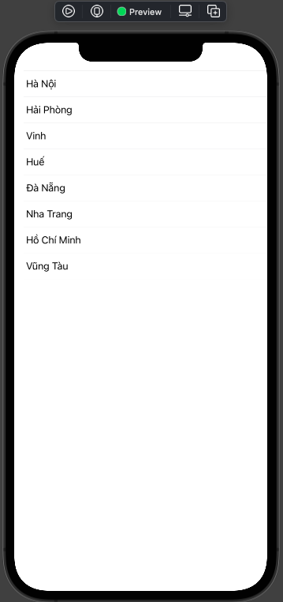
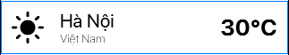
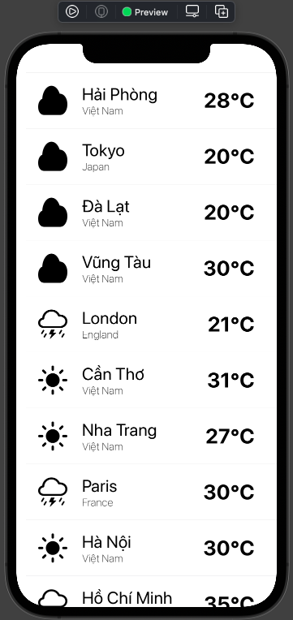
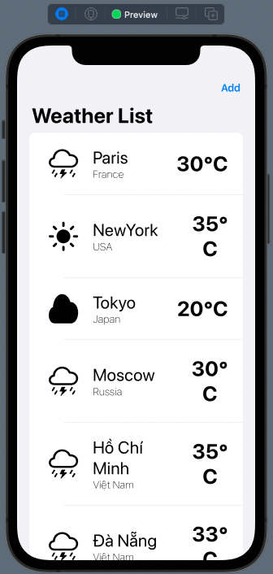
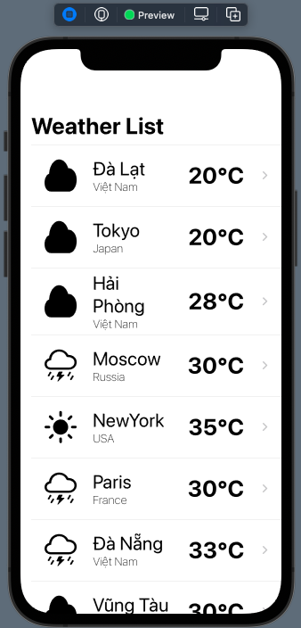
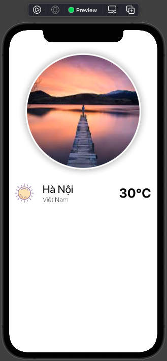

# 015.2 - Dynamic List

Chào mừng bạn đến với **Fx Studio**. Chúng ta đã bắt đầu với việc hiển thị một danh sách với dữ liệu tĩnh tại bài trước rồi. Bài viết này sẽ tiếp tục hướng dẫn bạn bạn hiển thị một danh sách động cùng với List. Chủ đề hôm nay là **Dynamic List**, bài viết thuộc series **SwiftUI Notes**.

Nếu mọi việc đã ổn rồi, thì ...

> Bắt đầu thôi!

## Chuẩn bị

Về mặt tool và version, các bạn tham khảo như sau:

- SwiftUI 2.0
- Xcode 12

Về mặt kiến thức, bạn cần biết trước các kiến thức cơ bản với SwiftUI & SwiftUI App. Tham khảo các bài viết sau, nếu bạn chưa đọc qua SwiftUI:

- [Làm quen với SwiftUI](https://fxstudio.dev/swiftui-phan-1-lam-quen-voi-swiftui/)
- [Cơ bản về ứng dụng SwiftUI App](https://fxstudio.dev/swiftui-phan-2-co-ban-ve-ung-dung-swiftui-app/)

*(Mặc định, mình xem như bạn đã biết về cách tạo project với SwiftUI & SwiftUI App rồi.)*

Về mặt demo, chúng ta chỉ sử dụng các SwiftUI View riêng lẻ. Nên bạn có thể bắt đầu bằng việc tạo mới một project SwiftUI và giao diện không quá phức tạp lắm.

## Dynamic List

Chúng ta đã có bài viết hướng dẫn về cách hiển thị một danh sách với **List** & **ForEach** rồi. Tuy nhiên, chúng chỉ là các hiển thị với các dữ liệu tĩnh cố định. Hoặc các dữ liệu tăng tuyến tính mà thôi.

Trong dự án thực tế thì chúng ta không thể nào hiển thị dữ liệu như vậy. Với ứng dụng mobile sẽ luôn nhận được một danh sách với dữ liệu lấy về từ API. Chúng ta không biết trước được việc hiển thị chúng sẽ là bao nhiêu phần tử hay cụ thể các phần thử sẽ như thế nào ... 

Do đó, chúng ta sẽ phải làm được việc là hiển thị một Array đối tượng lên **List** hay **ForEach**. Đây sẽ là tiền đề cho bạn trong các bài viết sau, với dữ liệu từ API hay từ DataBase.

### Hiển thị array String

Chúng ta sẽ bắt đầu từ cái đơn giản trước, đó là bạn sẽ hiển thị một Array String lên giao diện. Array String này được xem là phần dữ liệu cho View.

Ví dụ ta có 1 array như sau:

```swift
    let cities = ["Hà Nội",
                  "Hải Phòng",
                  "Vinh",
                  "Huế",
                  "Đà Nẵng",
                  "Nha Trang",
                  "Hồ Chí Minh",
                  "Vũng Tàu"]
```

Giải pháp đầu tiên sẽ là sử dụng **ForEach**, vì nó có `index`. Từ `index` bạn sẽ lấy được dữ liệu từng phần tử trong Array. Bạn xem tiếp ví dụ nha:

```swift
    var body: some View {
        ScrollView {
            ForEach(0..<cities.count) { index in
                Text(cities[index])
            }
        }
    }
```

Đó là ưu điểm của ForEach đem lại cho bạn, khi chúng ta có được `index` để duyệt các phần tử trong một mãng. Bạn bấm Resume và xem kết quả nhoé.



Kết quả nhìn không được đẹp cho lắm nhĩ. Chúng ta sẽ cải thiện nó tiếp thôi.

### Sử dụng List

Phiên bản trên nhìn hơi xấu, nó không đem lại cho chúng ta cảm giác là một danh sách hay UITableView như với UIKit. Để cải thiện thì bạn sẽ sử dụng **List**, mặc dù chúng ta sẽ không có được `index` như **ForEach**.

Nhưng với control này thì SwiftUI hỗ trợ thêm nhiều tham số còn có ý nghĩa cao hơn. Chúng ta sẽ chĩnh sửa lại code trên với List như sau:

```swift
    var body: some View {
        List(cities, id: \.self) { city in
            Text(city)
        }
    }
```

Trong đó:

* `cities` là phần dữ liệu cho List
* `id` làm tham số được thêm vào để xác định mỗi phần tử trong `cities` là duy nhất. 
* Vì phần tử của `cities` là một String, mà không phải là một cấu trúc phức tạp. Do đó, ta sẽ lấy `keypath` chính là bản thân nó `self` để làm `id`

Dễ hiểu hơn thì trước đây chúng ta gọi `id` là `identifier` cho các định danh của UITableViewCell của UIKit. Bấm Resume và xem kết quả như thế nào nhoé.



Bây giờ thì trông đẹp rồi đó, đã có trải nghiệm giống UITableView lúc xưa rồi. Ahihi!

### Sử dụng kiểu dữ liệu phức tạp

Chúng ta lại tiếp tục tìm một giải pháp toàn diện hơn. Bắt đầu, chúng ta sẽ định nghĩa lại kiểu dữ liệu cần dùng cho **List**. Sử dụng **struct** để tạo ra một kiểu dữ liệu phức tạp hơn. 

Ví dụ với struct **Weather** như sau:

```swift
struct Weather {
    enum WeatherStatus {
        case sun
        case rain
        case cloud
    }
    
    var city: String
    var country: String
    var temperature: Int
    var status: WeatherStatus
    
    func getStatusInfo() -> String {
        var str = ""
        
        switch status {
        case .sun:
            str = "sun.max.fill"
        case .rain:
            str = "cloud.bolt.rain"
        case .cloud:
            str = "cloud.fill"
        }
        
        return str
    }
}
```

> Chúng ta sẽ dùng nó làm dữ liệu cho các phần tiếp theo của bài viết.

Tiếp theo, bạn sẽ custom một SwiftUI View để phục vụ cho việc hiển thị được đẹp hơn. Xem ví dụ nha:

```swift
struct WeatherRow: View {
    var weather: Weather
    
    var body: some View {
        HStack {
            Image(systemName: weather.getStatusInfo())
                .resizable()
                .padding(.all)
                .frame(width: 80.0, height: 80.0)
                .aspectRatio(contentMode: .fill)
            VStack(alignment: .leading) {
                Text(weather.city)
                    .font(.title)
                Text(weather.country)
                    .fontWeight(.thin)
            }
            Spacer()
            Text("\(weather.temperature)°C")
                .font(.largeTitle)
                .fontWeight(.bold)
                .multilineTextAlignment(.center)
                .padding(.all)
        }
    }
}
```

Cũng không quá phức tạp, bạn xem preview của nó như sau. Bạn hãy tạo 1 đối tượng **Weather** để truyền vào Preview nhoé.



Cuối cùng bạn cần tạo mới một SwiftUI View để hiển thị danh sách thời tiết cho các thành phố nhoé. Xem ví dụ sau:

```swift
struct WeatherList: View {
    var weathers = Weather.dummyData()
    
    var body: some View {
        List(weathers, id: \.city) { item in
            WeatherRow(weather: item)
        }
    }
}
```

Trong đó:

* `weathers` là một Array với kiểu là Weather. 
* `dummyData()` để sinh ra dữ liệu cho thuộc tính, bạn tự viết phần này nhoé. Còn không thì tham khảo source code của repo
* Sử dụng `id` với `key path` là thuộc tính `city`

Kết quả sẽ trông đẹp mắt hơn nhiều so với 1 Array String truyền thống. Xem nhoé!



## Identifiable Protocol

Ở phần trên, ta sử dụng tới `id` hay là một Identifier để định danh các phần tử là duy nhất trong một Array. Tuy nhiên, chúng vẫn có thể trùng lặp nếu thuộc tính bạn lựa chọn là `id` có thể xảy ra trùng lặp với nhau.

Do đó, Swift cung cấp cho chúng ta một Protocol là **Identifiable**. Sẽ giúp cho class/struct bạn có thêm được tính năng định danh riêng biệt. Điều này giúp các phần tử trong Array sẽ là duy nhất.

```swift
public protocol Identifiable {

    /// A type representing the stable identity of the entity associated with
    /// an instance.
    associatedtype ID : Hashable

    /// The stable identity of the entity associated with this instance.
    var id: Self.ID { get }
}

@available(macOS 10.15, iOS 13, tvOS 13, watchOS 6, *)
extension Identifiable where Self : AnyObject {

    /// The stable identity of the entity associated with this instance.
    public var id: ObjectIdentifier { get }
}
```

Việc kế thừa Identifiable Protocol cho các struct/class thì cần bạn khai báo thêm thuộc tính `id`. Với kiểu dữ liệu cho `id` đảm bảo được là một `Hashable value`.

Chúng ta sẽ nâng cấp struct Weather trên với việc sử dụng **Identifiable Protocol**.

```swift
struct Weather: Identifiable {
    
    enum WeatherStatus {
        case sun
        case rain
        case cloud
    }
    
    var id = UUID()
    var city: String
    var country: String
    var temperature: Int
    var status: WeatherStatus
    
    func getStatusInfo() -> String {
        var str = ""
        
        switch status {
        case .sun:
            str = "sun.max.fill"
        case .rain:
            str = "cloud.bolt.rain"
        case .cloud:
            str = "cloud.fill"
        }
        
        return str
    }
}
```

Trong đó:

* Chúng ta implement thêm **Identifiable Protocol** cho **Weather**
* Với **Identifiable Protocol**, cần phải có thêm một thuộc tính là `id`. Và bạn sẽ phải khai báo thêm thuộc tính đó.
* `id` sẽ phải là các giá trị mà đảm bảo chúng là duy nhất.
* Sử dụng `UUID()` để có được một chuỗi String đảm bảo là duy nhất

Cuối cùng, bạn chỉ cần edit nhẹ phần List lại như sau:

```swift
struct WeatherList: View {
    
    var weathers = Weather.dummyData()
    
    var body: some View {
        List(weathers) { item in
            WeatherRow(weather: item)
        }
    }
}
```

Lúc này, code của chúng ta nhìn đẹp hơn nhiều rồi. Và khi đối tượng chúng ta là một **Identifiable**, thì không cần tới tham số `id` như ở trên.

Bạn hãy bấm resume và cảm nhận kết quả nhoé!

## NavigationView

> *A view for presenting a stack of views representing a visible path in a navigation hierarchy.*

Chúng ta đã có được một List hiển thị một danh sách với dữ liệu động cho giao diện rồi. Để trải nghiệm được đẹp hơn nữa, ta sẽ sử dụng thêm một **NavigationView** cho giao diện của chúng ta. Vì mục đích của chúng ta không chỉ đơn giản là xem 1 danh sách với các phần tử mà thôi. 

> Mục đích chính sẽ là điều hướng từ List sang các View khác.

Đây là phiên bản của **UINavigationViewController** từ UIKit cho SwiftUI.

### Cú pháp

Chúng ta đi sơ qua các cú pháp cơ bản nhất của một **NavigationView** trước nhoé.

* Tạo một **NavigationView**

```swift
NavigationView { 
        List {
	          Text("Hello World")
        }
      .navigationBarTitle(Text("Navigation Title")) // Default to large title style
}
```

Trong đó:

* **NavigationView** đóng vài trò là `root` của View
* Chúng ta sẽ đưa vào trong nó các SwiftUI View cần thiết, trong ví dụ là một List

Tiếp theo, bạn muốn thay đổi `title` của NavigationView, bạn sẽ sử dụng modifier `.navigationBarTitle(_:_:)` . Ví dụ như sau:

```swift
.navigationBarTitle(Text("Navigation Title"), displayMode: .inline)
```

Bạn có thể chọn các kiểu hiển thị của Title với tham số cho `displayMode`. 

Cuối cùng, bạn có thể thêm các BarButtonItem cho NavigationBar. Xem ví dụ nha:

```swift
//barbuttonitems. : traing & leading
.navigationBarItems(trailing:
       Button(action: {
	// Add action
       }, label: {
	Text("Add")
       })
)
```

Xem lại cập nhật cho WeatherList của chúng ta với NavigationView nhoé!

```swift
struct WeatherList: View {
    
    var weathers = Weather.dummyData()
    
    var body: some View {
        NavigationView {
            List(weathers) { item in
                WeatherRow(weather: item)
            }
            .navigationBarTitle(Text("Weather List"))
            .navigationBarItems(trailing:
                                    Button(action: {
                                        //action
                                    }, label: {
                                        Text("Add")
                                    })
            )
        }
        
    }
}
```

Bấm Resume và cảm nhận kết quả nhoé!



### NavigationLink

Quan trọng nhất khi sử dụng NavigationView đó là sự điều hướng. Các để bạn đưa một View khác vào bằng NaviagtionView đó là sử dụng đối tượng **NaviagtionLink**.

> Sẽ có nhiều điều bất ngờ tại đây khi bạn từ UIKit chuyển sang SwiftUI nhoé.

Trong đó cần:

* `destination` là điểm đến. Chính là View của bạn muốn đưa vào.
* `label` chính là nội dung của bạn cần hiển thị cho **NavigationLink**.

Xem ví dụ với WeatherList của chúng ta nhoé.

```swift
struct WeatherList: View {
    
    var weathers = Weather.dummyData()
    
    var body: some View {
        NavigationView {
            List(weathers) { item in
                NavigationLink(
                    destination: WeatherDetail(),
                    label: {
                        WeatherRow(weather: item)
                    })
            }
            .navigationBarTitle(Text("Weather List"))
        }
        
    }
}

```

Trong đó, ta sử dụng **NavigationLink** để bọc các **WeatherRow** lại với nhau. Mỗi khi kích vào **Row** thì sẽ được di chuyển sang màn hình **WeatherDetail**.

Kết quả sẽ như thế này!



Sẽ có một cái dấu `>` nhỏ nhỏ đó bạn à. Nhìn cũng đẹp và tương đối ổn đó.

> Chúng ta sẽ gặp lại NavigationView ở các phần sau hoặc 1 chương khác. Ở đây chỉ là giới thiệu sơ bạn bạn để sử dụng trong List mà thôi.

## Master - Detail

Đây là mẫu design được sử dụng khá nhiều trong các ứng dụng mobile. Với **List** sẽ là một Master View. Dùng chính điều hướng của **NavigationView** để chuyển sang các màn hình Detail View.

### Detail View

Ở ví dụ trên, bạn có điểm đích của **NavigationView** là một **WeatherDetail**. Đó chính là màn hình cho Detail trong mô hình Master - Detail của chúng ta.

Lúc này, ta sẽ design lại **WeatherDetail** như sau, bạn tham khảo code nhoé.

```swift
struct WeatherDetail: View {
    var weather: Weather
    
    var body: some View {
        VStack(alignment: .center) {
            CircleImage(name: "img1")
            HStack {
                Image(weather.getStatusInfo())
                    .padding(.all)
                    .frame(width: 80.0, height: 80.0)
                    .aspectRatio(contentMode: .fill)
                VStack(alignment: .leading) {
                    Text(weather.city)
                        .font(.title)
                    Text(weather.country)
                        .fontWeight(.thin)
                }
                Spacer()
                Text("\(weather.temperature)°C")
                    .font(.largeTitle)
                    .fontWeight(.bold)
                    .multilineTextAlignment(.center)
                    .padding(.all)
            }
            Spacer()
            }.navigationBarTitle(Text(weather.city), displayMode: .inline)
    }
}
```

Trong đó:

* Chúng ta có dữ liệu của màn hình là một thuộc tính `weather`. Sẽ được truyền từ List vào.
* Bạn cần custom view cho Image, trong ví dụ mình tạo một custom view là **CircleImage**. Giúp cho ảnh của bạn được bo tròn và bóng đổ.

Xem kết quả nhoé!



> Mình có thay đổi lại icon cho các biểu tượng thời tiết, để nhìn cute hơn. Ahihi!

### Master View

Master View trong mô hình Master - Detail là một danh sách. Tại đó:

* Điều hướng sang các Detail View khác nhau
* Lưu trữ dữ liệu tập trung
* Chuyển dữ liệu cho các Detail View

Trong ví dụ của chúng ta thì đã sử dụng List làm Master View rồi. Nhiệm cụ cuối cùng là kết nối và truyền dữ liệu sang Detail View thôi. Xem ví dụ code nhoé

```swift
            List(weathers) { item in
                NavigationLink(
                    destination: WeatherDetail(weather: item),
                    label: {
                        WeatherRow(weather: item)
                    })
            }
            .navigationBarTitle(Text("Weather List"))
```

Bạn chỉ cần quan tâm tới dòng code có ` WeatherDetail(weather: item)` là xong. Tất cả chỉ có như vậy mà thôi.

Bạn hãy bấm Preview và test lại các View của chúng ta nhoé. Chúc bạn thành công!

## Tạm kết

* Hiển thị một danh sách với dữ liệu động từ một array
* Các cách tạo các Identifier từ các đối tượng trong array
* Custom một class/struct với Identifiable Protocol để sử dụng làm dữ liệu cho List
* Cơ bản về NavigationView & NavigationLink
* Mô hình Master - Detail trong SwiftUI

---

Cảm ơn bạn đã theo dõi các bài viết từ **Fx Studio** & hãy truy cập [website](https://fxstudio.dev/) để cập nhật nhiều hơn!
