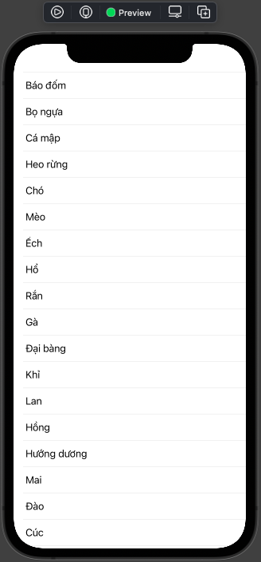
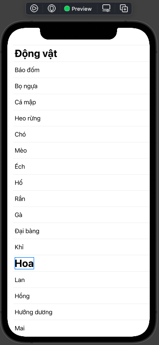
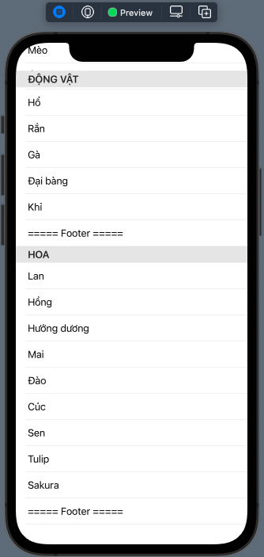
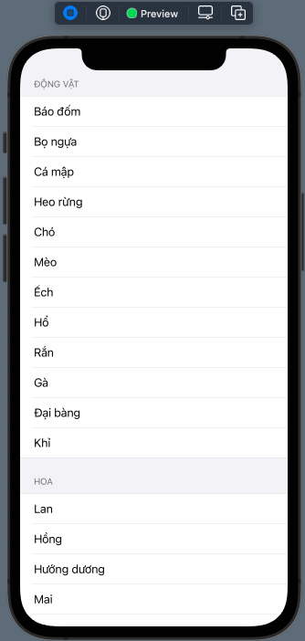

# 015.3 - Section & Grouped

Chào mừng bạn đến với **Fx Studio**. Chúng ta sẽ tiếp tục với **SwiftUI** trong series **SwiftUI Notes**. Chủ đề lần này sẽ liên quan tới **Section & Grouped** trong List. Bài viết cũng nối tiếp mini series **Working with List**, nên bạn cần tham khảo các bài viết trước đó.

Nếu mọi việc đã ổn rồi, thì ...

> Bắt đầu thôi!

## Chuẩn bị

Về mặt tool và version, các bạn tham khảo như sau:

- SwiftUI 2.0
- Xcode 12

Về mặt kiến thức, bạn cần biết trước các kiến thức cơ bản với SwiftUI & SwiftUI App. Tham khảo các bài viết sau, nếu bạn chưa đọc qua SwiftUI:

- [Làm quen với SwiftUI](https://fxstudio.dev/swiftui-phan-1-lam-quen-voi-swiftui/)
- [Cơ bản về ứng dụng SwiftUI App](https://fxstudio.dev/swiftui-phan-2-co-ban-ve-ung-dung-swiftui-app/)

*(Mặc định, mình xem như bạn đã biết về cách tạo project với SwiftUI & SwiftUI App rồi.)*

Về mặt demo, chúng ta chỉ sử dụng các SwiftUI View riêng lẻ. Nên bạn có thể bắt đầu bằng việc tạo mới một project SwiftUI và giao diện không quá phức tạp lắm.

## Danh sách nhiều chiều

Trong thực tế dự án thì chúng ta không chỉ hiển thị 1 danh sánh lên một **List** hay **UITableView**. Công việc của chúng ta sẽ phức tạp hơn với:

* Hiển thị nhiều danh sách
* Hiển thị danh sách nhiều chiều

Và tất nhiên, chúng nó sẽ được hiển thị vào cùng một UI Control, đó là **List**. Do đó, với các bài viết trước chúng ta mới chỉ làm được một nữa. Chúng ta sẽ nâng cấp chương trình với danh sách nhiều chiều.

Để chuẩn bị cho demo, ta có 2 array để hiển thị thông tin như sau:

```swift
    let animals = ["Báo đốm",
                   "Bọ ngựa",
                   "Cá mập",
                   "Heo rừng",
                   "Chó",
                   "Mèo",
                   "Ếch",
                   "Hổ",
                   "Rắn",
                   "Gà",
                   "Đại bàng",
                   "Khỉ"]
    
    let flowers = ["Lan",
                   "Hồng",
                   "Hướng dương",
                   "Mai",
                   "Đào",
                   "Cúc",
                   "Sen",
                   "Tulip",
                   "Sakura"]
```

### Hiển thị nhiều danh sách

Ở trên, chúng ta có 2 danh sách, đó cũng là giả định với `n` danh sách. Sau khi nắm được nguyên tắc thì bạn sẽ thao tác được với `n` danh sách.

Giải pháp ở đây sẽ là:

* Sử dụng **List** để tạo 1 danh sách lớn nhất.
* Sử dụng **ForEach** cho mỗi danh sách

Ví dụ code sẽ như sau:

```swift
    var body: some View {
        List {
            ForEach(animals, id: \.self) { item in
                Text(item)
            }
            
            ForEach(flowers, id: \.self) { item in
                Text(item)
            }
        }
    }
```

Trong trường hợp này, **List** của bạn là một danh sách tĩnh. Nó sẽ chưa 2 **ForEach**. Mỗi **ForEach** lại là một danh sách động. Nếu bạn có `n` danh sách thì hãy thêm `n` lần ForEach như vậy.

Kết quả có được sẽ như thế này.



Nhìn đơn giản quá, tuy nhiên nó là cách đơn giản và nhanh nhất à.

### Tách biệt

Khi nhìn vào demo trên, chắc bạn cũng khó mà phân biệt được giữa các danh sách mới nhau. Để chúng nó tách biệt hơn thì chúng ta lại lợi dụng tính chất của danh sách tĩnh.

> Sẽ thêm vào các SwiftUI View nhằm tạo ra sự tách biệt trực quan.

```swift
    var body: some View {
        List {
            Text("Động vật")
                .font(.title)
                .fontWeight(.bold)
            ForEach(animals, id: \.self) { item in
                Text(item)
            }

            Text("Hoa")
                .font(.title)
                .fontWeight(.bold)
            ForEach(flowers, id: \.self) { item in
                Text(item)
            }
        }
    }
```

Bấm Resume để xem kết quả nhoé.



Kết quả cũng xem là tạm chất nhận được.

### Hiển thị danh sách nhiều chiều

Chúng ta sẽ nâng cấp độ khó của demo lên tiếp. Ở trên chỉ là nhiều danh sách, bây giờ bạn sẽ phải sử dụng 1 danh sách nhưng là nhiều chiều.

> Cấu trúc dữ liệu cho danh sách nhiều chiều chính là Array chứa Array.

Về mặt demo, ở trên bạn có 2 danh sách một chiều. Công việc tạo thêm 1 danh sách 2 chiều bằng cách kết hợp như sau:

```swift
    var items: [[String]] = []
    
    init() {
        items = [animals, flowers]
    }
```

Trong đó:

* Thêm một thuộc tính `items` là danh sách 2 chiều với kiểu dữ liệu là `[[String]]`. Tứu là Array mà phần tử là một Array String
* Sử dụng `init` để xét giá trị cho thuộc tính. Vì đây là hướng đối tướng nhoé.

Tiếp tục, chúng ta cấu hình lại View của chúng ta như sau:

```swift
        List {
            ForEach(items, id: \.self) { array in
                ForEach(array, id: \.self) { item in
                    Text(item)
                }
            }
        }
```

Trong đó:

* **List** sẽ có ý nghĩa là 1 container lớn nhất. Chứa tất cả các danh sách
* **ForEach** đầu tiên dùng để lặp 2 phần tử trong `items`
* **ForEach** thứ 2 dùng để lặp các phần tử trong mỗi phân tử của `items`

Công việc hơi vất vả, nhưng như thế này mới thứ mới gọi là dữ liệu động được. Kết quả hiển thị thì giống với nhiều danh sách ở trên.

## Section

Nhìn kết quả ở trên hơi xấu, chúng ta lại phải tiếp tục make color chúng nó. Tuy nhiên lần này sẽ cố gắng làm mọi thứ đẹp hơn và đúng chuẩn hơn.

Theo như bạn cũng có thể là đã biết:

> Trong một UITableView khi hiển thị nhiều danh sách hay danh sách sách nhiều chiều. Thì mỗi danh sách đó sẽ được gọi là một **section**.

Công việc của chúng ta sẽ tạo ra các **Section** để chứa các danh sách đó. Khá là EZ phải không nào.

### Create Section

Để có các section, thì SwifUI cung cấp cho chúng ta đối tượng **Section**. Ta thử áp dụng vào luôn ví dụ trên cho nóng. Xem code nhoé.

```swift
        List {
            Section {
                ForEach(animals, id: \.self) { item in
                    Text(item)
                }
            }
            
            Section {
                ForEach(flowers, id: \.self) { item in
                    Text(item)
                }
            }
        }
```

Lúc này, nhìn code chúng ta đẹp hơn và dễ hiểu hơn rồi. Ý nghĩa rất rõ ràng là:

* List chứa nhiều **Section**
* Các section lại chứa nhiều row được **ForEach** lặp và sinh ra

Hoặc với code có Section cho danh sách nhiều chiều thì như sau:

```swift
        List {
            ForEach(items, id: \.self) { array in
                Section {
                    ForEach(array, id: \.self) { item in
                        Text(item)
                    }
                }
            }
        }
```

Tất cả đều đem lại trải nghiệm hiển thị là như nhau.

### Header & Footer

Mỗi Section sẽ có 2 View đặc biệt, đó là **Header** và **Footer**. Nó dùng để phân biệt giữa các Section với nhau. Đem lại trải nghiệm giống nhau ở tất cả các section.

Ta tiếp tục nâng cấp với demo trên, bằng cách thêm các tham số `header` và `footer` cho các Section vừa tạo. Bạn xem code ví dụ tiếp nha:

```swift
        List {
            Section(header: Text("ĐỘNG VẬT"), footer: Text("===== Footer =====")) {
                ForEach(animals, id: \.self) { item in
                    Text(item)
                }
            }

            Section(header: Text("HOA"), footer: Text("===== Footer =====")) {
                ForEach(flowers, id: \.self) { item in
                    Text(item)
                }
            }
        }
```

Trong đó:

* `header` & `footer` là SwiftUI View
* Bạn có thể tuỳ ý custom cho chúng

Bấm Preview và cảm nhận kết quả nhoé!



Khi bạn scroll List, thì phần Header sẽ đứng im. Nếu cả section đó trôi qua thì Header cũng sẽ trôi đi theo.

## Grouped Type

Bạn có thể sử dụng danh sách nhiều chiều để hiển thị lên List với nhiều Section khác nhau. Không cần phải tạo ra nhiều lần **ForEach** trong một List.

Tuy nhiên, để đơn giản và đẹp hơn thì chúng ta cần thêm một array chưa nội dung cho các Header của mỗi Section trước nhoé. Bạn thêm thuộc tính này vào view của bạn:

```swift
var names = ["ĐỘNG VẬT", "HOA"]
```

Chúng ta lại chỉnh sửa tiếp ví dụ của chúng ta để List hiển thị danh sách nhiều chiều:

```swift
        List {
            ForEach(0..<items.count) { index in
                Section(header: Text(names[index])) {
                    ForEach(items[index], id: \.self) { item in
                        Text(item)
                    }
                }
            }
        }
```

Trong đó, thay vì lặp các phần tử trong danh sách 2 chiều. Chúng ta sẽ lặp `index`. Từ `index` sẽ lấy được:

* Nội dung cho `header`
* Phần tử trong danh sách 2 chiều `items`. Tức là Array String

Công việc còn lại thì sẽ như ở trên, với ForEach để sinh ra các Row cần thiết.

Cuối cùng, bạn thêm một modifier này vào cho List.

```swift
        List {
            //...
        }
        .listStyle(GroupedListStyle())
```

Với **GroupedListStyle**, giúp cho List tự tách biệt các Section ra với nhau. Nhóm chúng thành một Group. Đây cũng là phiên bản `group` của UITableView bên UIKit. Nhờ đó mà giao diện của bạn sẽ trông rõ ràng hơn rất nhiều.

Bấn Resume và Live Preview để xem kết quả nhoé!



## Tạm kết

* Hiển thị được nhiều danh sách & danh sách nhiều chiều
* Sử dụng Section để tách biệt nhiều danh sách với nhau trong hiển thị
* Custom Header & Footer trong các Section

---

Cảm ơn bạn đã theo dõi các bài viết từ **Fx Studio** & hãy truy cập [website](https://fxstudio.dev/) để cập nhật nhiều hơn!
