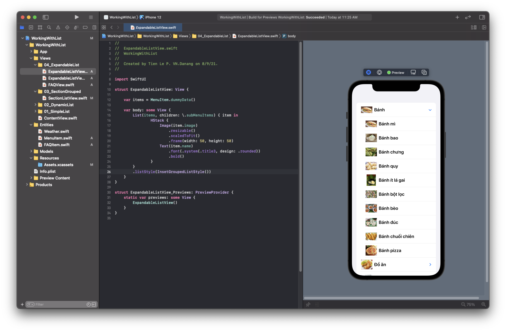
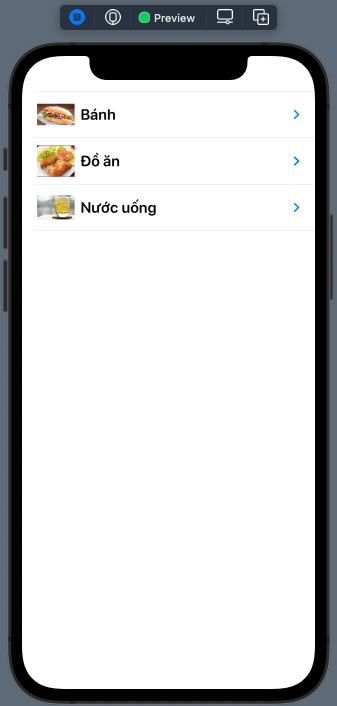
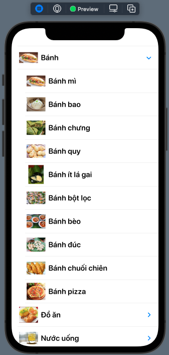
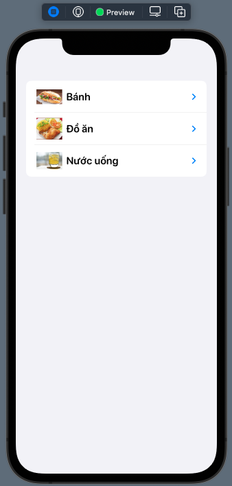
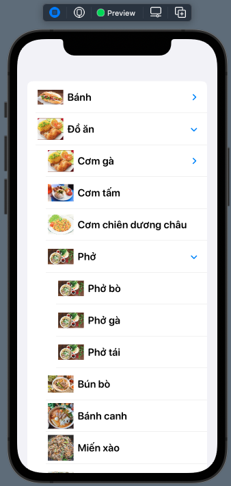
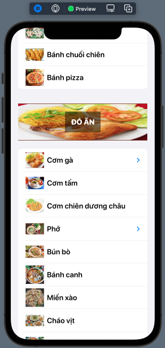
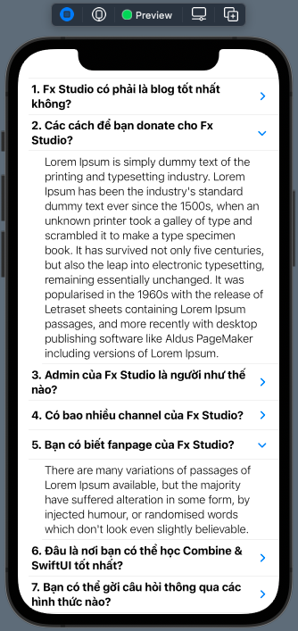
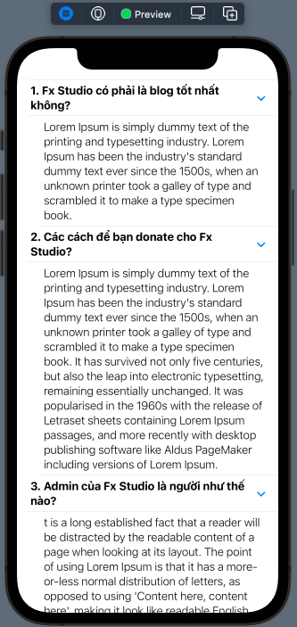

# 015.4 - Expandable List

Chào mừng bạn đến với **Fx Studio**. Chúng ta lại tiếp tục hành trình trong **SwiftUI** dài bất tận này. Chủ đề bài viết này là **Expandable List**, một cách xử lý danh sách khá là phổ biến trong các ứng dụng mobile. Và bài viết thuộc phần **Working with List** trong toàn bộ series **SwiftUI Notes**.

Nếu bạn chưa biết nhiều về thực thể List trong SwiftUI, thì có thể tham khảo các bài viết trước trong repo này. Còn nếu mọi việc đã ổn rồi, thì ...

> Bắt đầu thôi!

## Chuẩn bị

Về mặt tool và version, các bạn tham khảo như sau:

- SwiftUI 2.0
- Xcode 12

Về mặt kiến thức, bạn cần biết trước các kiến thức cơ bản với SwiftUI & SwiftUI App. Tham khảo các bài viết sau, nếu bạn chưa đọc qua SwiftUI:

- [Làm quen với SwiftUI](https://fxstudio.dev/swiftui-phan-1-lam-quen-voi-swiftui/)
- [Cơ bản về ứng dụng SwiftUI App](https://fxstudio.dev/swiftui-phan-2-co-ban-ve-ung-dung-swiftui-app/)

*(Mặc định, mình xem như bạn đã biết về cách tạo project với SwiftUI & SwiftUI App rồi.)*

Về mặt demo, chúng ta chỉ sử dụng các SwiftUI View riêng lẻ. Nên bạn có thể bắt đầu bằng việc tạo mới một project SwiftUI và giao diện không quá phức tạp lắm.

## Expandable List

SwiftUI **List** là phiên bản của **UITableView** trong UIKit. Tuy nhiên, chúng được nâng cấp mạnh mẽ và linh hoạt hơn nhiều. Khi UITableView bó buộc chúng ta trong việc đồng bộ giữa dữ liệu và các cell thông qua các delegate của nó. Thì List sẽ hiển thị theo trạng thái dữ liệu của chúng ta.

Việc này làm giảm đi rất nhiều mặc custom hay logic dư thừa. Chúng sẽ chỉ cần quản lý kĩ phần dữ liệu và chỉ ra cho giao diện cách hiển thị mà thôi.



Hình trên là một ví dụ về **Expandable List**, nó có đặc điểm gì:

* Giống như một danh sách bình thường với các row/cell
* Khi kích vào row/cell thì nếu có thêm dữ liệu. Sẽ tiếp tục hiển thị một danh sách nữa
* Số cấp độ mở rộng sẽ không bị gới hạn

Để làm được điều này với UIKit, thì bạn cũng phải thật siêu nhân với các năng thất truyền như:

* Table trong Table
* Table trong Cell
* Co giãn cell & Ẩn hiện cell
* Mapping dữ liệu, làm phẳng array
* ...

Nhưng với SwiftUI thì ...

> EZ Game!

Và theo kinh nghiệm cả chục năm trong nghề, mình nhận ra **Expandable List** cũng đáng để các bạn mới vào nghề thành thục. 

> Thao trường đồ mồ hôi thì chiến trường bớt đổ máu.

## Setup Data Model

Cũng như các công việc khác, bạn cần tổ chức cấu trúc dữ liệu cho thật tốt để đảm bảo tính logic chương trình. Một trong những điều mà hầu như các bạn dev mới vào nghề đều bỏ qua. Với Expandable List thì kiểu dữ liệu có khác với List bình thường. Nên ta càng cần phải chuẩn bị cho phù hợp.

### Create

Ví dụ tham khảo với chương trình hiển thị **thực đơn** và kiểu dữ liệu đề xuất như sau:

```swift
struct MenuItem: Identifiable {
    var id = UUID()
    var name: String
    var image: String
    var subMenuItems: [MenuItem]?
}
```

Trong đó, toàn những hình bóng quen thuộc với List:

* **Identifiable Protocol** dùng để định danh cách item trong một array là duy nhất
* Đi kèm với Protocol đó là thuộc tính `id`, ta cho nó nhận giá trị từ `UUID()` để đảm bảo chúng nó là duy nhất
* Các thuộc tính `image` & `name` chứa thông tin của một món ăn trong thực đơn
* `subMenuItems` là một Array kiểu `[MenuItem]?`. Có thể có hoặc không cũng không sao.

Mấu chốt vấn đề là bạn có thể lợi dụng thuộc tính `subMenuItems` để tạo nên nhiều phân cấp dữ liệu. **Expandable List** không chỉ đơn giản ở 2 cấp mà thôi.

### Dummy Data

Để có dữ liệu làm ví dụ sinh động hơn thì chúng ta lại cần chuẩn bị thêm phần `dummy data` cho đẹp.

> Sau này, dữ liệu của bạn sẽ lấy từ một nguồn khác, có thể là API hay Database ...

Bạn thêm đoạn code sau vào chương trình.

```swift
extension MenuItem {
    static func dummyData() -> [MenuItem] {
        // list 1
        let list1: [MenuItem] = [MenuItem(name: "Bánh mì", image: "img_1_01"),
                                 MenuItem(name: "Bánh bao", image: "img_1_02"),
                                 MenuItem(name: "Bánh chưng", image: "img_1_03"),
                                 MenuItem(name: "Bánh quy", image: "img_1_04"),
                                 MenuItem(name: "Bánh ít lá gai", image: "img_1_05"),
                                 MenuItem(name: "Bánh bột lọc", image: "img_1_06"),
                                 MenuItem(name: "Bánh bèo", image: "img_1_07"),
                                 MenuItem(name: "Bánh đúc", image: "img_1_08"),
                                 MenuItem(name: "Bánh chuối chiên", image: "img_1_09"),
                                 MenuItem(name: "Bánh pizza", image: "img_1_10")]
       
        let list2: [MenuItem] = [MenuItem(name: "Cơm gà", image: "img_2_01"),
                                 MenuItem(name: "Cơm tấm", image: "img_2_02"),
                                 MenuItem(name: "Cơm chiên dương châu", image: "img_2_03"),
                                 MenuItem(name: "Phở", image: "img_2_04"),
                                 MenuItem(name: "Bún bò", image: "img_2_05"),
                                 MenuItem(name: "Bánh canh", image: "img_2_06"),
                                 MenuItem(name: "Miến xào", image: "img_2_07"),
                                 MenuItem(name: "Cháo vịt", image: "img_2_08"),
                                 MenuItem(name: "Bún chả cá", image: "img_2_09"),
                                 MenuItem(name: "Mì quảng", image: "img_2_10")]
        
        let list3: [MenuItem] = [MenuItem(name: "Trà đá", image: "img_3_01"),
                                 MenuItem(name: "Nước mía", image: "img_3_02"),
                                 MenuItem(name: "Nước chanh", image: "img_3_03"),
                                 MenuItem(name: "Coca", image: "img_3_04"),
                                 MenuItem(name: "Bia", image: "img_3_05"),
                                 MenuItem(name: "Nước ép hoa quả", image: "img_3_06"),
                                 MenuItem(name: "Sinh tố", image: "img_3_07"),
                                 MenuItem(name: "Trà sữa", image: "img_3_08"),
                                 MenuItem(name: "Chè", image: "img_3_09"),
                                 MenuItem(name: "Nước lọc", image: "img_3_10")]
        
        let items: [MenuItem] = [MenuItem(name: "Bánh", image: "img_1_01", subMenuItems: list1),
                                 MenuItem(name: "Đồ ăn", image: "img_2_01", subMenuItems: list2),
                                 MenuItem(name: "Nước uống", image: "img_3_01", subMenuItems: list3)]
        
        
        return items
    }
}
```

Trong đó:

* Ta sẽ có 3 item lớn nhất cho cấp đầu tiên
* Mỗi item lại có thêm 10 item con cho cấp thứ 2 của nó

Bạn đã hình dùng giao diện của mình sẽ trông như thế nào rồi đó. Khá vui phải không nào.

## Display Expandable List

Phần dữ liệu đã xong, ta sang phần giao diện chính. Ban đầu, mình cứ tưởng làm cái này khó lắm, nhưng là hoá ra lại rất đơn giản. Tất cả chỉ có tập trung vào tham số `children` của **List** hay **ForEach** mà thôi.

Bạn hãy tạo một file SwiftUI View mới và tiến hành code như với List bình thường ở bài trước. Tuy nhiên, sẽ phải sử dụng thêm tham số `children`. Code ví dụ như sau:

```swift
struct ExpandableListView: View {
    
    var items = MenuItem.dummyData()
    
    var body: some View {
        List(items, children: \.subMenuItems) { item in
                HStack {
                    Image(item.image)
                        .resizable()
                        .scaledToFit()
                        .frame(width: 50, height: 50)
                    Text(item.name)
                        .font(.system(.title3, design: .rounded))
                        .bold()
                }
        }
    }
}
```

Trong đó:

* List sẽ duyệt qua `items` là array dữ liệu chính
* `children` sẽ dựa trên `key path` mà chúng ta cung cấp. Nó sẽ kiểm tra mỗi phần tử trong array có thêm một danh sách con hay không.
* Tại mỗi bước lặp, ta sẽ thiết kế riêng giao diện cho từng Row.

Giao diện của mỗi Row sẽ áp dụng cho toàn bộ các cấp trong danh sách. Bạn hãy bấm Preview để test kết quả nhoé.

* Không Expand



* Có Expand



Bạn chỉ cần kích vào cái nút mũi tên đó là nó tự hiển thị ra thôi. Phần mũi tên này sẽ tự động cho bạn. Còn custom nó thì mình chưa tìm hiểu. Ahihi!

### Grouped List Style

Thêm một ít màu mè cho đẹp nữa nhoé. Chúng ta sẽ grouped lại danh sách cho gọn. Bạn sẽ dùng tới modifier `.listStyle` với tham số `InsetGroupedListStyle`. Code ví dụ như sau:

```swift
List(items, children: \.subMenuItems) { item in
   //...
}
.listStyle(InsetGroupedListStyle())
```

Xem kết quả nhoé!



### More Expand

Sẽ như thế nào khi chúng ta thêm một cấp nữa cho các `sub item`. Thành là 3 cấp. Và vẫn như bước đầu tiên, ta lại phải chuẩn bị dữ liệu tiếp. 

> Lần này chỉ thêm về mặt dữ liệu, chứ không thay đổi về mặt cấu trúc dữ liệu.

Ví dụ code như sau:

```swift
        let sublist2: [MenuItem] = [MenuItem(name: "Cơm gà mã lai", image: "img_2_01"),
                                    MenuItem(name: "Cơm gà luộc", image: "img_2_01"),
                                    MenuItem(name: "Cơm gà xé", image: "img_2_01")]
        
        let sublist3: [MenuItem] = [MenuItem(name: "Phở bò", image: "img_2_04"),
                                    MenuItem(name: "Phở gà", image: "img_2_04"),
                                    MenuItem(name: "Phở tái", image: "img_2_04")]
        
        let list2: [MenuItem] = [MenuItem(name: "Cơm gà", image: "img_2_01", subMenuItems: sublist2),
                                 MenuItem(name: "Cơm tấm", image: "img_2_02"),
                                 MenuItem(name: "Cơm chiên dương châu", image: "img_2_03"),
                                 MenuItem(name: "Phở", image: "img_2_04", subMenuItems: sublist3),
                                 MenuItem(name: "Bún bò", image: "img_2_05"),
                                 MenuItem(name: "Bánh canh", image: "img_2_06"),
                                 MenuItem(name: "Miến xào", image: "img_2_07"),
                                 MenuItem(name: "Cháo vịt", image: "img_2_08"),
                                 MenuItem(name: "Bún chả cá", image: "img_2_09"),
                                 MenuItem(name: "Mì quảng", image: "img_2_10")]
```

Ta sẽ thêm 2 danh sách item con vào 2 phần tử trong danh sách thứ 2. 

Bạn hãy chờ một chút hoặc clean lại project và bấm Resume nha, khi đó dữ liệu sẽ cập nhật toàn bộ cho project SwiftUI. 

Xem kết quả nhoé!



Bạn sẽ thấy là từ `Đồ ăn > Phở > các món phở khác`. Do đó, với tham số `children` thì List sẽ duyệt tất cả các cấp trong danh sách của chúng ta. Và sẽ hiển thị đầy đủ.

> Đúng là EZ Game không nào!

## Outline Group

Bạn cũng nhận ra một điều là giao diện của tất cả các Row nó rất đơn điệu và một màu phải không. Chúng ta cần phải custom để có sự tách biệt ra một ít. Lúc này, ta sẽ sử dụng thêm `OutlineGroup`

Mục đích, tách biệt phần `children` ra khỏi các phần tử. Bên cạch đó giúp ta có thể custom phần giao diện của các phần tử ở cấp đầu tiên được đẹp hơn.

Bạn xem code ví dụ nha:

```swift
        List {
            OutlineGroup(items, children: \.subMenuItems) {  item in
                HStack {
                    Image(item.image)
                        .resizable()
                        .scaledToFit()
                        .frame(width: 50, height: 50)

                    Text(item.name)
                        .font(.system(.title3, design: .rounded))
                        .bold()
                }
            }
        }
        .listStyle(InsetGroupedListStyle())
```

Mặc dù hiện thị vẫn giống với các ở trên. Tuy nhiên, bạn sẽ thấy `OutlineGroup` đã được tách biệt ra rồi. Do đó, chúng ta có thể thêm bớt và custom những thứ khác vào List. Mọi thứ không còn là dính với nhau 1 chùm như ở trên.

### Custom Section

Áp dụng tiếp OutlineGroup, chúng ta sẽ tiến hành custom các Header của các Section. Lúc này:

* Mỗi Section là 1 item của cấp đầu tiên
* Header sẽ chứa thông tin của item cấp đầu tiên đó
* Các Row ở trong sẽ tiếp tục hiển thị và phân cấp, dựa vào `children` của nó

Code ví dụ như sau:

```swift
        List {
            ForEach(items) { menuItem in

                Section(header:
                            ZStack {
                                Image(menuItem.image)
                                    .resizable()
                                    .frame(width: .infinity, height: 100)
                                    .scaledToFill()

                                Text(menuItem.name)
                                    .font(.title3)
                                    .fontWeight(.heavy)
                                    .padding()
                                    .foregroundColor(Color.white)
                                    .background(Color.black.opacity(0.5))
                            }
                            .padding(.vertical)

                ) {
                    OutlineGroup(menuItem.subMenuItems ?? [MenuItem](), children: \.subMenuItems) {  item in
                        HStack {
                            Image(item.image)
                                .resizable()
                                .scaledToFit()
                                .frame(width: 50, height: 50)

                            Text(item.name)
                                .font(.system(.title3, design: .rounded))
                                .bold()
                        }
                    }
                }
            }
        }
        .listStyle(InsetGroupedListStyle())
```

Trong đó:

* **ForEach** sẽ lặp các phần tử có trong cấp đầu tiên.
* Trong mỗi bước lặp của ForEach ta tiến hành 2 công việc:
  * **Custom** lại **Header** của Section được thêm vào với thông tin chính là `item` mỗi bước lặp
  * Tạo thêm một **OutlineGroup** cho các phần tử của `.subMenuItems`, thức là các item của cấp thứ 2
  * Nó sẽ duyệt tiếp nếu có cấp thứ 3 ...

Ta thử bấm Live Preview và xem kết quả nhoé!



Ta đã có một Header nhìn xịn sò và tách biệt ra các phần tử tiếp theo rồi. Mọi thử trông ổn đó. Ahihi!

## Disclosure Group

Các danh sách trên với **List** & **OutlineGroup** thì chúng đều liên quan tới danh sách hay danh sách con để có thể ẩn/hiện hoặc mở rộng ra các row tiếp theo trong giao diện. 

Nhưng khi các phần tử của bạn lại không có các danh sách con. Hoặc bạn chỉ cần mở rộng để hiển thị thêm thông tin cho Row thì sẽ như thế nào.

Để giải quyết vấn đề này thì SwiftUI lại cho chúng ta một đối tượng nữa, đó là **Disclosure Group**. Nó sẽ hoạt động độc lập theo từng phần tử và sẽ quyết định mở rộng phần thông tin nào thêm cho bạn.

Để dễ hình dùng, chúng ta sẽ làm một ví dụ với màn hình câu hỏi trong ứng dụng. Hay còn gọi là FAQ.

### Setup data model

Cũng như trên, trước tiên ta cần chuẩn bị về mặt cấu trúc và dữ liệu cho ổn. Bạn xem ví dụ sau để tham khảo.

```swift
struct FAQItem: Identifiable {
    var id = UUID()
    var question: String
    var answer: String
    var showContent = true
}
```

Trong đó:

* Kế thừa lại Identifiable Protocol như bình thường & `id` để định danh phần tử
* `question` & `answer` chứa thông tin của câu hỏi
* `showContent` để chứa trạng thái ẩn hiện của nội dung

Mục đích của chúng ta sẽ là:

* Hiển thị phần câu hỏi ra trước.
* Khi người dùng kích vào câu hỏi, thì sẽ hiển thị câu trả lời ở dưới
* Danh sách của chúng ta sẽ tự động mở rộng ra và thu lại khi người dùng kích vào lại để ẩn câu trả lời.

Tiếp theo, bạn chuẩn bị `dummy data` nha. Các làm tương tự ở trên.

### Display FAQ

Chúng ta sẽ dùng đối tượng DisclosureGroup để thao tác hiển thị cho màn hình FAQ này. Ví dụ code sẽ như sau:

```swift
struct FAQView: View {
    
    var items = FAQItem.dummyData()
    
    var body: some View {
        List {
            ForEach(0..<items.count) { index in
                DisclosureGroup(
                    //isExpanded: $items[index].showContent,
                    content: {
                        Text(items[index].answer)
                            .font(.body)
                            .fontWeight(.light)
                    },
                    label: {
                        Text("\(index + 1). \(items[index].question)")
                            .font(.body)
                            .fontWeight(.bold)
                    })
            }
        }
    }
}
```

Trong đó:

* Dùng kiểu cấu trúc **List** và **ForEach** lồng nhau để có thể custom được nhiều hơn.
* Dùng kiểu lặp `index` với mục đích đánh số chỉ mục cho các item trong danh sách
* Tại mỗi bước lặp ta sử dụng đối tượng **DisclosureGroup**. Với:
  * `content` là phần sẽ được ẩn đi hay hiện ra lúc người dùng kích vào
  * `label` là phần luôn luôn hiện ra

Để dễ hình dung hơn thì bạn hay bấm Live Preview và test nhoé. Kết quả sẽ như sau:



Bạn cứ thoải mái mà kích ẩn/hiện từng item nhoé.

### Show / Hide content

Để tối ưu trả nghiệm người dùng hơn thì sẽ tiếp tục nâng cấp danh sách đó như sau:

* Lúc mới bắt đầu sẽ hiển thị tất cả `content`
* Việc ẩn hiện `content` sẽ tuỳ thuộc vào mỗi đối tượng tự quản lý.

Lần này, để làm được như vậy. Bạn cần phải tuỳ chỉnh lại dữ liệu cho SwiftUI View này. Ta sẽ biến `items` trở thành một **The single source of truth**. Ví dụ như sau:

```swift
@State var items = FAQItem.dummyData()
```

Struct FAQItem đã có sẵn thuộc tính `showContent`. Chúng ta đã biến `items` thành nguồn dữ liệu duy nhất cho View, thì các phần tử trong danh sách `items` đó cũng trở thành nguồn dữ liệu. Mọi thao tác hay ràng buộc với View để có được sự ảnh hưởng.

Tiếp theo, ta dùng tới tham số `isExpanded` trong **DisclosureGroup** để handle sự ẩn hiện của từng item. Vì danh sách `items` đã là nguồn dữ liệu rồi, nên ta có thể Binding từ View tới 1 phần dữ liệu của các `struct`. Cụ thể như sau:

```swift
        List {
            ForEach(0..<items.count) { index in
                DisclosureGroup(
                    isExpanded: $items[index].showContent,
                    content: {
                        Text(items[index].answer)
                            .font(.body)
                            .fontWeight(.light)
                    },
                    label: {
                        Text("\(index + 1). \(items[index].question)")
                            .font(.body)
                            .fontWeight(.bold)
                    })
            }
        }
    }
```

Trong đó, bạn chỉ cần chú ý tới `isExpanded: $items[index].showContent` là đủ. Với giá trị ban đầu cung cấp cho `showContent` của mỗi item là `true` nên danh sách của bạn lúc bắt đầu sẽ hiển thị tất cả các `content` của toàn bộ câu câu hỏi ra. 

Quan trọng, bạn có thể chỉ định hoặc quản lý ẩn/hiện cho từng item. Quá EZ! Xem kết quả nhoé!



## Tạm kết

* Cấu trúc dữ liệu phù hợp cho một danh sách có khả năng mở rộng
* Hiển thị Expandable List với nhiều cấp
* Custom Expandable List với OutlineGroup
* Ẩn hiện một phần nội dụng với DisclosureGroup.
* Kết hợp giữa List & DisclosureGroup

---

Cảm ơn bạn đã theo dõi các bài viết từ **Fx Studio** & hãy truy cập [website](https://fxstudio.dev/) để cập nhật nhiều hơn!
