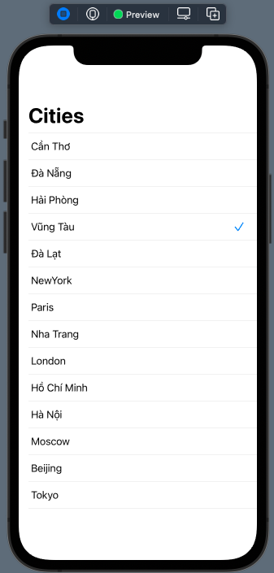
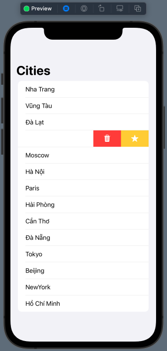
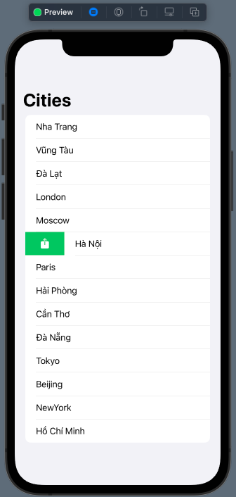
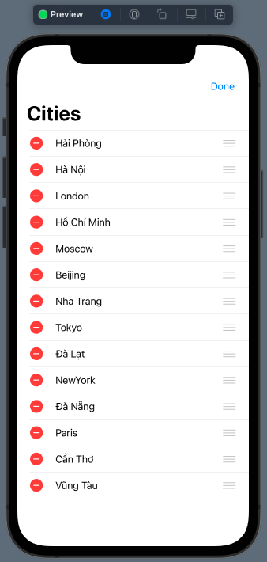
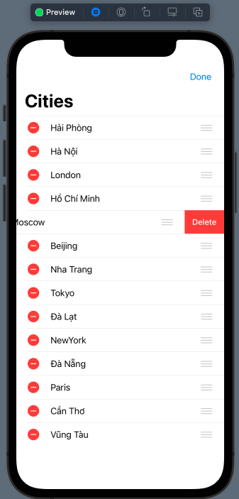
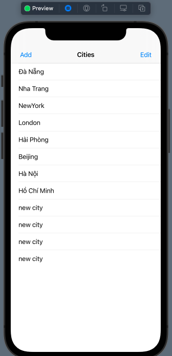
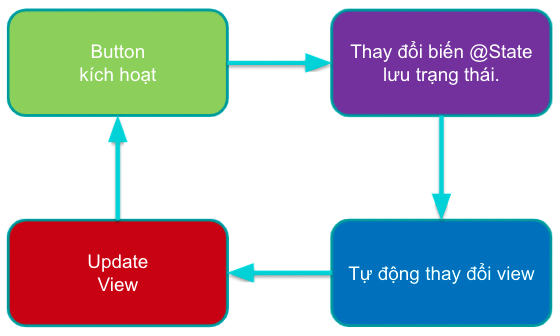

# 015.4 - Editing Mode


Chào mừng bạn đến với **Fx Studio**. Và chúng ta lại tiếp tục hành trình trong vũ trụ **SwiftUI** bất tận này. Chủ đề bài viết này sẽ về các trạng thái tương tác trên **List**. Bạn có thể thêm và xoá đi các Row của nó ... và nhiếu thứ bạn có thể tương tác được.

Còn nếu mọi việc đã ổn rồi, thì ...

> Bắt đầu thôi!

## Chuẩn bị

Về mặt tool và version, các bạn tham khảo như sau:

- SwiftUI 2.0
- Xcode 12

Về mặt kiến thức, bạn cần biết trước các kiến thức cơ bản với SwiftUI & SwiftUI App. Tham khảo các bài viết sau, nếu bạn chưa đọc qua SwiftUI:

- [Làm quen với SwiftUI](https://fxstudio.dev/swiftui-phan-1-lam-quen-voi-swiftui/)
- [Cơ bản về ứng dụng SwiftUI App](https://fxstudio.dev/swiftui-phan-2-co-ban-ve-ung-dung-swiftui-app/)

*(Mặc định, mình xem như bạn đã biết về cách tạo project với SwiftUI & SwiftUI App rồi.)*

Về mặt demo, chúng ta chỉ sử dụng các SwiftUI View riêng lẻ. Nên bạn có thể bắt đầu bằng việc tạo mới một project SwiftUI và giao diện không quá phức tạp lắm.

## Did selected Cell For Row At ...

Thật là buồn khi cú pháp với SwiftUI 1.0 đã không còn nữa. Bạn đã từng làm việc này với List một cách đơn giản như sau:

```swift
 List(data: <RandomAccessCollection>,
                 selection: <Binding<T>>,
                 action: <(Identifiable.IdentifiedValue) -> Void>,
                 rowContent: <(Identifiable.IdentifiedValue) -> View>)
```

Trong đó, tham số `action` sẽ là sự kiện trên một Row và đơn giản là bạn sẽ có được `identified` của Row đó và làm được nhiều thứ. 

> Tuy nhiên, nó đã bị xoá đi khỏi SwiftUI 2.0 và 3.0 rồi.

Chúng ta sẽ dùng tới cách truyền thống thôi.

### Selection Cell

Bắt đầu, chúng ta sẽ tiến hành custom một Cell. Nó có khả năng phản hồi lại tương tác của người dùng, ví dụ khi táp vào sẽ đánh dấu là đã chọn. Táp lần nữa thì đánh dấu là không chọn.

Xem ví dụ code nhoé

```swift
struct SelectionCell: View {
    let title: String
    @Binding var selectedItem: String?
    
    var body: some View {
        HStack {
            Text(title)
            Spacer()
            if title == selectedItem {
                Image(systemName: "checkmark")
                    .foregroundColor(.accentColor)
            }
        }
        .contentShape(Rectangle())
        .onTapGesture {
            self.selectedItem = self.title
        }
    }
}
```

Trong đó:

* Sử dụng thuộc tính `selectedItem` với kiểu là `@Binding`. Nó sẽ trỏ tới thuộc tính đánh dấu việc Row nào được chọn ở List
* Trong ví dụ ta chọn kiểu dữ liệu cho `selectedItem` là **String**. Vì mình làm cho đơn giản ví dụ thôi, còn nếu phức tạp hơn thì bạn sẽ phải trả về cả một đối tượng
* Nội dung `body` của **SelectionCell** sẽ tuỳ thuộc vào dữ liệu của `selectedItem`. Nếu trùng với `item` thì sẽ hiển thị dấu `checkmark`. Ngược lại thì sẽ không xuất hiện.
* `.onTapGesture { }` để thực hiện việc bắt sự kiện người dùng cho **SelectionCell**. Bạn chỉ cần xét lại `self.selectedItem = self.title` là oke

Nếu chúng ta chọn Row khác thì Row đó sẽ lại làm công việc `self.selectedItem = self.title`. Khi đó, Row hiện tại của chúng ta sẽ là `self.selectedItem != self.title` rồi. Nên dấu `checkmark` sẽ mất đi.

> EZ phải không nào!

Bạn chú ý về dòng code `.contentShape(Rectangle())` cho **HStack**, nó sẽ giúp bạn `tap` được vùng `Spacer()` à. Khá là có ích nhoé.

### Config List

Giờ mới tới phần List. Theo ở trên chúng ta cần phải cấu hình thêm cho View chưa List một tí. Để đảm bảo việc **Binding** dữ liệu.

Bạn xem ví dụ code sau cho List nhoé

```swift
struct DidSelectedCellDemoView: View {
    
    var weathers = Weather.dummyData()
    @State var selectedItem: String? = nil
    
    var body: some View {
        NavigationView {
            List {
                ForEach(weathers) { item in
                    SelectionCell(title: item.city, selectedItem: $selectedItem)
                }
            }
            .navigationTitle("Cities")
        }
    }
}
```

Trong đó:

* `weathers` là dữ liệu cho **List**. Chúng ta đã tiến hành custom với **Identifiable Protocol** trong các bài viết trước rồi.
* Ta cần 1 biến State là `selectedItem` , giúp lưu giữ giá trị được chọn khi người dùng chọn các Row

Khi người dùng chọn từng Row thì giá trị của `selectedItem` sẽ thay đổi. Vì áp dụng **The single source of truth**, nên các Row sẽ phản ứng theo giá trị của `selectedItem` nhoé.

Ta thử test thử View chúng ta ổn chưa. Bạn hãy bấm **Live Preview** và test nhoé.



### Deselected Cell

Có một bugs là khi bạn chọn lại 1 Row đã chọn. Nó sẽ không bị mất đi. Đơn giản là vì chúng ta chưa xét trường hợp đó. Nếu:

* `selectedItem` khác với `title` thì sẽ đánh dấu là chọn, gán `selectedItem = title`
* `selectedItem` trùng với `title` thì sẽ đánh dấu là bỏ chọn, gán lại `selectedItem = nil`

Bạn cập nhật lại phần `onTapGesture { }` ở View SelectionCell nhoé

```swift
        .onTapGesture {
            if title == selectedItem {
                selectedItem = nil
            } else {
                self.selectedItem = self.title
            }
        }
```

Như vậy, bạn sẽ thực hiện được công việc chọn và bỏ chọn khi tương tác cùng với 1 Row rồi. Hãy bấm Live Preview và test lại.

### Callback Actions

Một chút hoài niệm với quá khứ **UITableView** nhoé. Ta sẽ tìm cách đưa sự kiện ở **SelectionCell** về **List**. Điều này giúp bạn chủ động hơn.

> Hoặc có thể hiểu là Callback lại cho List từ Cell vậy.

Bạn tiến hành chĩnh sửa lại **SelectionCell** như sau:

```swift
struct SelectionCell: View {
    typealias Action = (String) -> Void
    
    let title: String
    @Binding var selectedItem: String?
    var action: Action?
    
    var body: some View {
        HStack {
            Text(title)
            Spacer()
            if title == selectedItem {
                Image(systemName: "checkmark")
                    .foregroundColor(.accentColor)
            }
        }
        .contentShape(Rectangle())
        .onTapGesture {
            if title == selectedItem {
                selectedItem = nil
            } else {
                self.selectedItem = self.title
            }
            
            if let action = action {
                action(title)
            }
        }
    }
}
```

Trong đó:

* Khai báo thêm một `typealias` là **Action** là một closure `(String) -> Void`
* Tham số **String** dùng để gởi `Identified` về cho List. Tuỳ với logic và dữ liệu bạn cần thì có thể khác nhau kiểu dữ liệu.
* Bạn khai báo thêm thuộc tính `action` cho **SelectionCell** nữa. Nó là kiểu **Optional** và sẽ được cung cấp giá trị lúc khởi tạo đối tượng từ bên ngoài.
* Cuối cùng là bạn chỉ có việc gởi `title` về thông qua việc gọi `action` thực thi ở `.onTapGesture { }`

Tại **List**, bạn update lại việc tạo đối tượng **SelectionCell** như sau:

```swift
SelectionCell(title: item.city, selectedItem: $selectedItem) { item in
   print(item)
}
```

Muốn test lại thì bạn hãy build project lên Simulator nhoé, để thấy được `print` ở Console.

## Swipe Actions

Đã nói tới List hay UITableView thì chúng ta không thể nào quên đi các button ẩn bằng tương tác **Swipe Action** được. Và List cũng hỗ trợ bạn công việc này.

> Đây là tính năng mới thêm vào cho iOS 15, Swift 5.5, SwiftUI 3.0 và bạn cần Xcode 13.0 để test nhoé

Bạn sẽ được cung cấp thêm một **modifier** `.swipeActions(edge:_)` cho **List** và **ForEach** và các View con, để bắt các sự kiện **Swipe Actions**

> Điểm đặc biệt bạn có thể áp dụng cho bất cư View nào để tương tác việc này. Không nhất thiết ở List nhoé

Xem ví dụ code như sau:

```swift
            List {
                if #available(iOS 15.0, *) {
                    ForEach(weathers) { item in
                        SelectionCell(title: item.city, selectedItem: $selectedItem) { item in
                            print(item)
                        }
                        .swipeActions(edge: .trailing) {
                            Button {
                                print("Mark as favorite")
                            } label: {
                                Label("Favorite", systemImage: "star")
                            }
                            .tint(.yellow)
                            
                            Button {
                                print("Delete")
                            } label: {
                                Label("Delete", systemImage: "trash")
                            }
                            .tint(.red)
                        }
                        .swipeActions(edge: .leading) {
                            Button {
                                print("Share")
                            } label: {
                                Label("Share", systemImage: "square.and.arrow.up")
                            }
                            .tint(.green)
                        }
                    }
                    
                } else {
                    // Fallback on earlier versions
                }
            }
```

Trong đó:

* Ta áp dụng `.swipeActions` cho custom view của chúng ta
* Sử dụng tham số `edge` với 2 hướng là `trailing` & `leading` 
* Bạn sẽ khai báo các View vào trong closue của chúng

Bấm Live Preview để test nhoé!

* **Trailing**



* **Leading**



Mặc định với iOS 15.5 và Xcode 13, thì là Style cho List là Grouped nhoé. Muốn về kiểu trước kia thì thêm modifier sau vào.

```swift
.listStyle(InsetListStyle())
```

## Edit Button

SwiftUI cung cấp cho chúng ta một cái Button khá là quyền lực. Được gọi là **EditButton**. Khi nó được triều hội thì List chúng ta đang dùng sẽ chuyển sang trạng thái **Edting**. Nghĩa là bạn có thể:

* **Delete** đi một row
* **Move** một row đi tới vị trí khác
* **Multi Selection** để làm một số tác vụ với nhiều Row một lúc. (Cái này ta sẽ tìm hiểu sau nhoé)

> Các kĩ thuật khó hơn, thì chúng ta sẽ 

Chúng ta sẽ kích hoạt trạng thái Editing cơ bản với EditButton như sau. Bạn tham khảo đoạn code sau:

```swift
struct BasicActionsForRowInListDemoView: View {
    @State var weathers = Weather.dummyData()
    
    var body: some View {
        NavigationView {
            List {
                ForEach(weathers) { item in
                    Text(item.city)
                }
                .onDelete(perform: delete)
                .onMove(perform: move)
            }
            .listStyle(InsetListStyle())
            .navigationBarItems(trailing: EditButton())
            .navigationTitle("Cities")
        }
    }
    
    // ....

}
```

Trong đó:

* Ta cần một nơi nào đó để người dùng nhấn sự kiện Edit. Trong ví dụ ta chọn Button ở NavigationBar
* Đối tượng **EditButton** sẽ thêm vào modifier sau `.navigationBarItems(trailing: EditButton())`. Bạn chú ý `trailing` là ở bên phía phải nhoé
* Nếu ta không có các modifier như `onDelete` & `onMove` thì không có hiện tượng gì xãy ra.

Khi bạn có đầy đủ các function cho việc tương tác với `onDelete` và `onMove` mới thấy được giao diện của trạng thái Editing là như thế nào.



## Basic actions for rows

Khi đã có trạng thái Editing của List được kích hoạt, bạn sẽ tiến hành tương tác với các Actions cơ bản như sau

> Nhớ khai báo danh sách dữ liệu chúng ta là kiểu **@State** hoặc **@StateObject** nhoé.

### Delete Row

Bạn sẽ thêm function `delete` vào View. Bạn tham khảo ví dụ code sau:

```
    func delete(at offsets: IndexSet) {
        if let first = offsets.first {
            weathers.remove(at: first)
        }
    }
```

Với nguyên lý của The single source of truth. Khi bạn xoá đi 1 item trong array `weathers` thì giao diện sẽ tự động biến đổi theo.

Function `delete` phải tuân thử khai báo với các tham số như trên.



### Move Row

Áp dụng tương tự, bạn sẽ có việc di chuyển một Row tới vị trí khác. Bạn sẽ hoàn thiện function `move` như sau:

```swift
    func move(from source: IndexSet, to destination: Int) {
        let reversedSource = source.sorted()
        for index in reversedSource.reversed() {
            weathers.insert(weathers.remove(at: index), at: destination)
        }
    }
```

Về logic bạn tự ngẫm nhoé. Cái này áp dụng được với đa số kiểu dữ liệu Array. Nên bạn cứ yên tâm mà dùng.

### Add Row

Với việc thêm một Row nữa thì sẽ phức tạp hơn một chút. Trước tiên, bạn cần hoàn thiện function `add`.

```swift
    func add() {
        let item = Weather(city: "new city", country: "new country", temperature: 25, status: .sun)
        weathers.append(item)
    }
```

Đơn giản là tạo mới một đối tượng thêm nó vào array của chúng ta thôi.

Vì chế độ Edting với EditButton không có actions add một item mới. Do đó, ta phải chế lại thôi. Bạn sẽ thêm một Bar Button Item nữa vào NavigationBar cho sự kiện thêm mới này. Tham khảo code nhoé.

```swift
    var body: some View {
        NavigationView {
            List {
                ForEach(weathers) { item in
                    Text(item.city)
                }
                .onDelete(perform: delete)
                .onMove(perform: move)
            }
            .listStyle(InsetListStyle())
            .navigationBarItems(leading: Button(action: add, label: {
                Text("Add")
            }) ,trailing: EditButton())
            .navigationTitle("Cities")
        }
    }
```

Bạn thêm một button `add` vào phái `leading` của NavigationBar là đẹp. Nó sẽ gọi action `add` và thêm mới 1 Row vào List.



Khi test, bạn sẽ thấy có nhiều row với title là `new city`. Đó là các Row mới được thêm vào.

## Editting Mode

Nếu bạn thấy việc dùng **EditButton** khá là củ chuổi và muốn custom lại cái Button đó, những kích hoạt được trạng thái **Editing** của List. Thì bạn còn có một cách nữa để thử. Đó là

> Kích hoạt trạng thái Editing Mode của List từ **Environment**

### Sơ đồ hoạt động

Chúng ta sẽ có sơ đồ hoạt động của nó như sau:



Trong đó:

* Button kích hoạt thì có thể bất cứ button nào cũng được. Do đó, đây là ưu điểm của bạn sẽ dùng. Chúng ta thoải mái thiết kế giao diện cho nó.
* Bạn cần một biến **@State** để lưu giữ trạng thái đang Editing hay hết Editing của View
* Các View hay List sẽ auto cập nhật trạng thái từ biến @State bằng việc sử dụng Environment với **keypath** là `\.EditMode`
* Cuối cùng bạn thực hiện xong các thao tác và cập nhật lại các View. 
* Tắt trạng thái Editing băng việc xét lại giá trị cho thuộc tính **State**

### Demo code

Chúng ta sẽ thực hiện các bước sau:

* Thêm một thuộc tính **@State** để quản lý trạng thái Editing nhoé

```swift
@State var isEditing = false
```

* Xét lại giá trị của Environment với keypath là `\.EditMode`

```swift
.environment(\.editMode, .constant(self.isEditing ? EditMode.active : EditMode.inactive))
```

Bạn sẽ thêm modifier đó cho **List** của bạn.

* Custom Button

```swift
            .navigationBarItems(trailing: Button(action: {
                // code for action
                isEditing.toggle()
            }, label: {
                if self.isEditing {
                    Text("Done").foregroundColor(Color.red)
                } else {
                    Text("Edit").foregroundColor(Color.blue)
                }
            }))
```

Mình sẽ làm mới một Bar Button item cho NaviagtionBar. Button này cũng phản ứng theo biến **@State** `isEditing`. Quan trọng chúng ta sẽ bật/tăt trạng thái tại `action` của Button. Bằng lệnh đơn giản sau `isEditing.toggle()`

* Để cho có hiệu ứng mợt hơn một tí, bạn thêm modifier `.animation` cho List nhoé

```swift
.animation(Animation.spring())
```

Okay, bạn xoá đi EditButton trước đó và test lại với Custom Button mới. Xem thử trạng thái **Editing Mode** hoạt động tốt không nhoé. Chúc bạn thành công!

## Tạm kết

* Thực hiện tương tác với một Row & Callback về List
* Xử lý các Swipe Actions trong Row/Cell
* Sử dụng EditButton để kích hoạt trạng thái Editing Mode
* Các tương tác cơ bản với List,  như: delete, move, add ... từng item
* Quản lý và tương tác với trạng thái Editing Mode với Environment 

---

Cảm ơn bạn đã theo dõi các bài viết từ **Fx Studio** & hãy truy cập [website](https://fxstudio.dev/) để cập nhật nhiều hơn!
