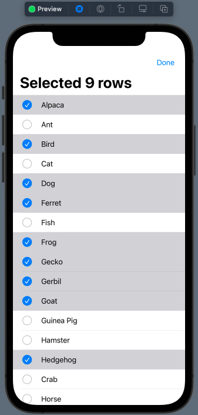
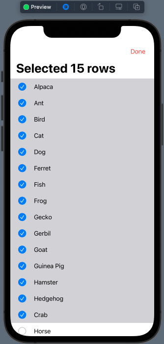
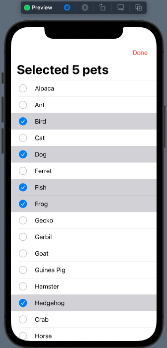
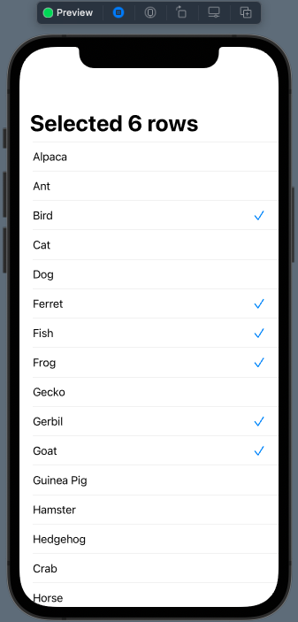
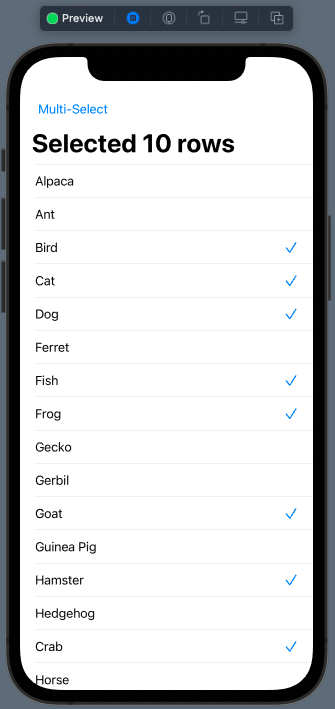
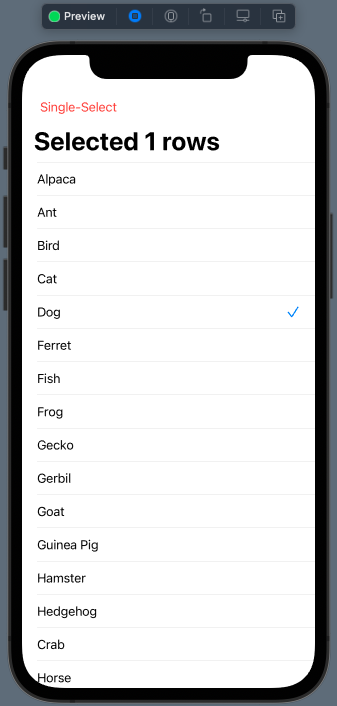

# 015.5 - Multiple Selection

Chào mừng bạn đến với **Fx Studio**. Chúng ta sẽ tiếp bước với mini series **Working with List**, thuộc vũ trụ **SwiftUI** bất tận này. Ở bài viết trước, ta đang có thể tương tác với từng item hay từng Row trong một List. Với bài viết này, chúng ta học thêm cách tương tác với nhiều item một lúc. Để được như vậy thì bạn cần phải chọn được nhiều item trước đã. Hay còn gọi là **Multiple Selection**.

Nếu mọi việc đã ổn rồi, thì ...

> Bắt đầu thôi!

## Chuẩn bị

Về mặt tool và version, các bạn tham khảo như sau:

- SwiftUI 2.0
- Xcode 12

Về mặt kiến thức, bạn cần biết trước các kiến thức cơ bản với SwiftUI & SwiftUI App. Tham khảo các bài viết sau, nếu bạn chưa đọc qua SwiftUI:

- [Làm quen với SwiftUI](https://fxstudio.dev/swiftui-phan-1-lam-quen-voi-swiftui/)
- [Cơ bản về ứng dụng SwiftUI App](https://fxstudio.dev/swiftui-phan-2-co-ban-ve-ung-dung-swiftui-app/)

*(Mặc định, mình xem như bạn đã biết về cách tạo project với SwiftUI & SwiftUI App rồi.)*

Về mặt demo, chúng ta chỉ sử dụng các SwiftUI View riêng lẻ. Nên bạn có thể bắt đầu bằng việc tạo mới một project SwiftUI và giao diện không quá phức tạp lắm.

## EditButton & EditMode

Ở bài trước, bạn đã biết về 2 khái niệm **EditButton** và **EditMode** rồi. Chúng sẽ kích hoạt trạng thái **Editing** của List giúp cho bạn. Với trạng thái Editing của List thì bạn có thể:

* Xoá 1 item
* Di chuyển và thay đổi thứ 1 item
* Chọn được nhiều items một lúc

### Create Selection

Để có thể lưu dữ được trạng thái Selection đối với các item trong một array. Chúng ta cần lợi dụng tiếp tính chất của **Identifiable Protoco**l. Nhằm xác định chúng là duy nhất trong array đó.

Chúng ta cần thêm một thuộc tính cho View để lưu dữ các **Identifier** và thuộc tính này sẽ được cung cấp cho List làm đối số của `selection`.

Bắt đầu, ta sẽ có một View như sau:

```swift
struct MultiSelectionWithEditButtonDemoView: View {
    
    var items = ["Alpaca","Ant", "Bird","Cat", "Dog","Ferret","Fish","Frog", "Gecko", "Gerbil", "Goat", "Guinea Pig", "Hamster", "Hedgehog", "Crab", "Horse", "Iguana", "Mantis", "Mouse",  "Newt", "Pig", "Rabbit", "Rat", "Salamander", "Sheep", "Snake", "Spider", "Stick-Bugs", "Turtle"]
    
    @State var selectedRows = Set<String>()
    
    var body: some View {
       //...
    }
}
```

Trong đó:

* `items` chính là array dữ liệu của chúng ta
* `selectedRows` là thuộc tính lưu dữ các **Identifier**. Với kiểu dữ liệu là `Set<String>`. Và nó là **State**.
* Nếu bạn sử dụng kiểu dự liệu khác cho **Identifier** thì có thay thế String bằng nó. Ví dụ như UUID.

### EditButton

Công việc tiếp theo là bạn sẽ kích hoạt trạng thái Editing của List bằng EditButton. Bên cạnh đó, bạn sẽ kết hợp với `selectedRows` vừa tạo ra, nhằm lưu giữ các trạng thái đã chọn.

Xem ví dụ code nhoé

```swift
    var body: some View {
        NavigationView {
            List(items, id: \.self, selection: $selectedRows) { item in
                Text(item)
            }
            .navigationBarItems(trailing: EditButton())
            .listStyle(InsetListStyle())
            .navigationBarTitle(Text("Selected \(selectedRows.count) rows"))
        }
    }
```

Trong đó:

* Ta sẽ sử dụng tham số `selection` của List với giá trị truyền vào là `selectedRows`
* Vì `selectedRows` là một **State**. Nên để List thay đổi giản trị của nó, thì bạn thêm tiền đố `$` vào trước.
* **EditButton** được gắn vào Bar Button Item cho NaviagtionBar

Mỗi trạng thái Editing của List kích hoạt, bạn táp chọn một Row thì nó tự động thêm vào `selectedRow` 1 phần tử. Phần tử đó là **Identifier**.

Bạn bấm **Live Preview** và test xem nhoé.



### EditMode

Với mục đích chủ động hơn trong việc custom giao diện và không phụ thuộc vào các class có sẵn của SwiftUI. Thì sự lựa chọn EditMode là số một.

Bạn đã được học cách sử dụng EditMode ở bài viết trước rồi, nên mình sẽ đi nhanh phần này. Bạn xem code tham khảo sau nhoé

```swift
struct MultiSelectionWithEditModeDemoView: View {
    
    var items = ["Alpaca","Ant", "Bird","Cat", "Dog","Ferret","Fish","Frog", "Gecko", "Gerbil", "Goat", "Guinea Pig", "Hamster", "Hedgehog", "Crab", "Horse", "Iguana", "Mantis", "Mouse",  "Newt", "Pig", "Rabbit", "Rat", "Salamander", "Sheep", "Snake", "Spider", "Stick-Bugs", "Turtle"]
    
    @State var selectedRows = Set<String>()
    @State var isEditing = false
    
    var body: some View {
        NavigationView {
            List(items, id: \.self, selection: $selectedRows) { item in
                Text(item)
            }
            .navigationBarItems(trailing: Button(action: {
                // code for action
                isEditing.toggle()
            }, label: {
                if self.isEditing {
                    Text("Done").foregroundColor(Color.red)
                } else {
                    Text("Edit").foregroundColor(Color.blue)
                }
            }))
            .environment(\.editMode, .constant(self.isEditing ? EditMode.active : EditMode.inactive))
            .animation(Animation.spring())
            .listStyle(InsetListStyle())
            .navigationBarTitle(Text("Selected \(selectedRows.count) rows"))
        }
    }
}
```

Trong đó, bạn chỉ cần chú ý các điểm sau:

* Sử dụng thêm một biến **State** `isEditing` để quản lý trạng thái **Editing** của List
* Sử dụng `evironment` với keypath `\.editMode` để kích hoạt trạng thái Editing hay tắt nó đi.
* Custom lại Bar Button Item. Tại `action` của Button đó, thay đổi trạng thái của `isEditing`
* Mọi thứ còn lại giống như sử dụng với EditButton ở trên

Bạn bấm **Live Preview** và cảm nhận kết quả nhoé!



(*Để ý thiệt kĩ là bạn sẽ thấy Button `Done` có màu đó, khác với EditButton mặc định với màu xanh.*)

## Single selection vs. Multiple selection

Chắc tới đây, nhiều bạn sẽ thắc mắc là

> Muốn chọn sử dụng trạng thái chọn một item với Editing Mode thì như thế nào?

Câu trả lời hết sức đơn giản. Đó là kiểu dữ liệu mà bạn cung cấp cho tham số `selection` của List. Nếu

* Là một collection, như Set, Array ... thì sẽ là Multiple Selection
* Là một kiểu dữ liệu bình thường (không phải collection) thì sẽ là Single Selection

Xem code ví dụ

```swift
    @State var selectedRows = Set<String>() // multiple selection
    @State var selectedRow: String? // single selection
```

> Tất cả chúng phải là **State** nhoé.

Sử dụng vẫn như là ở trên. Bạn cứ nén thẳng nó vào tham số `selection` của List mà thôi.

```swift
            List(items, id: \.self, selection: $selectedRow) { item in
                Text(item)
            }
```

Bấm Live Preview và cảm nhận kết quả nhoé.

## Selection with Object

Trong thực tế thì bạn không thể nào cứ sử dụng một Array String để dùng làm dữ liệu. Mà là custom một kiểu dữ liệu cho phù hợp. Và để đảm bảo được khả năng Multiple Selection thì bạn cần chú ý việc khai báo kiểu dữ liệu phải kế thừa **Identifiable Protocol**.

Ví dụ với một Struct **Pet** như sau:

```swift
struct Pet: Identifiable {
    var id = UUID()
    var name: String
}
```

Trong đó, bạn chú ý tới `id` là thuộc định định vị **Identifier** của đối tượng. Bạn nên sử dụng kiểu dữ liệu là **UUID**. Kéo theo đó là bạn cũng phải thay đổi lại kiểu dữ liệu cho `selection` của chúng ta.

Tham khảo code ví dụ sau nhoé.

```swift
struct MultiSelectionWithObjectDemoView: View {
    var pets = Pet.dummyData()
    
    @State var selectedRows = Set<UUID>()
    @State var isEditing = false
    
    var body: some View {
        NavigationView {
            List(pets, selection: $selectedRows) { item in
                Text(item.name)
            }
            .navigationBarItems(trailing: Button(action: {
                // code for action
                isEditing.toggle()
            }, label: {
                if self.isEditing {
                    Text("Done").foregroundColor(Color.red)
                } else {
                    Text("Edit").foregroundColor(Color.blue)
                }
            }))
            .environment(\.editMode, .constant(self.isEditing ? EditMode.active : EditMode.inactive))
            .animation(Animation.spring())
            .listStyle(InsetListStyle())
            .navigationBarTitle(Text("Selected \(selectedRows.count) pets"))
        }
    }
}
```

Bạn sẽ thấy là `selectedRows` lúc này là kiểu dữ liệu `Set<UUID>`. Nó sẽ ứng với `id` của đối tượng **Pet** nhoé. Hãy bấm Live Preview và cảm nhận kết quả.



Bây giờ, bạn có thể sử dụng array của của một kiểu dữ liệu custom rồi nhoé.

## Selection Manager

Bạn có mệt mỏi với trạng thái Editing Mode của List không. Khi chúng nó cứ hiện ra các UI mặc định như vậy. Hoặc bạn muốn tự custom cái nút `check` đó thì sẽ gặp không ít khó khăn.

> Bạn sẽ phải tự tay viết lại việc quản lý tương tự như Edting Mode của List nhoé.

Bạn tham khảo đoạn code sau:

```swift
struct SelectionManager {
    typealias SelectionValue = UUID
    
    // property
    var allowsMultipleSelection: Bool {
        didSet {
            // remove all item when changed mode
            selections.removeAll()
        }
    }
    var selections = Set<UUID>()
    
    // function
    init(allowsMultipleSelection: Bool = true) {
        self.allowsMultipleSelection = true
    }
    
    // select
    mutating func select(_ value: UUID) {
        if !allowsMultipleSelection {
            selections.removeAll()
        }
        selections.insert(value)
        print("selected: \(value)")
    }
    
    // deselected
    mutating func deselect(_ value: UUID) {
        selections.remove(value)
        print("deselected: \(value)")
    }
    
    func isSelected(_ value: UUID) -> Bool {
        return selections.contains(value)
    }
    
    // reset
    mutating func reset() {
        selections.removeAll()
    }
    
    // toggle of item
    mutating func toggle(_ value: UUID) {
        if selections.contains(value) {
            if !allowsMultipleSelection {
                selections.removeAll()
            } else {
                selections.remove(value)
            }
        } else {
            if !allowsMultipleSelection {
                selections.removeAll()
            }
            selections.insert(value)
        }
    }
}
```

Struct **SelectionManager** sẽ đảm nhậm công việc của **Editing Mode** của List, với các chức năng cơ bản như sau:

* Single Selection
* Multiple Selection
* Quản lý các `selections`
* Reset tất cả các `selections`

Chúng ta sẽ học cách sử dụng chúng cho các phần sau nhoé. Và chỉ cần bạn nhớ mục đích chính sẽ là.

> Không sử dụng tới **Editing Mode** của List.

Và bạn có thể lợi dụng đối tượng này cho Editing Mode vẫn được. Chúng hoạt động khá là ăn khớp với nhau.

```swift
struct MultiSelectionWithSelectionManagerDemoView: View {
    var pets = Pet.dummyData()
    
    @State var selectionManager = SelectionManager()
    @State var isEditing = false
    
    var body: some View {
        NavigationView {
            List(pets, selection: $selectionManager.selections) { item in
                Text(item.name)
            }
            .navigationBarItems(trailing: Button(action: {
                // code for action
                isEditing.toggle()
            }, label: {
                if self.isEditing {
                    Text("Done").foregroundColor(Color.red)
                } else {
                    Text("Edit").foregroundColor(Color.blue)
                }
            }))
            .environment(\.editMode, .constant(self.isEditing ? EditMode.active : EditMode.inactive))
            .animation(Animation.spring())
            .listStyle(InsetListStyle())
            .navigationBarTitle(Text("Selected \(selectionManager.selections.count) pets"))
        }
    }
}
```

Bạn xét `selection` của List bằng `$selectionManager.selections` là okay. Tuy nhiên, đó vẫn không phải cái mà chúng ta hướng tới.

## Custom Row without EditMode

Tiếp theo, ta sẽ tiến hành công việc **Custom Row** để có được trạng thái **Multiple Selection** mà không cần tới **Editing Mode** của List.

Nguyên tắc:

* Sử dụng nguyên tắt **The single source of truth**
* Tại các Custom Row chúng ta sẽ tiến hành Binding dữ liệu tới `selectedRows`
* Tiến hành kiểm tra 
  * Tồn tại của **Identifier** trong `selectedRows`
  * Thêm mới **identifier**
  * Xoá **identifier**

### Custom Row

Bạn tham khảo code cho Custom Row như sau:

```swift
struct MultiSelectRow: View {
    
    var pet: Pet
    @Binding var selectedItems: Set<UUID>
    
    var isSelected: Bool {
        selectedItems.contains(pet.id)
    }
    
    var body: some View {
        HStack {
            Text(self.pet.name)
            Spacer()
            if self.isSelected {
                Image(systemName: "checkmark")
                    .foregroundColor(Color.blue)
            }
        }
        .contentShape(Rectangle())
        .onTapGesture {
            if self.isSelected {
                self.selectedItems.remove(self.pet.id)
            } else {
                self.selectedItems.insert(self.pet.id)
            }
        }
    }
}
```

Trong đó, bạn sẽ có những phần cần chú ý như sau:

* `selectedItems` là thuộc tính **Binding** tới `selectedRows` ở List
* Thuộc tính `isSelected` dùng để kiểm tra trạng thái Row đã được chọn hay không, bằng cách kiểm tra tồn tại `id` trong `selectedItems`
* Các view con hiển thị dựa trên dữ liệu của `isSelected`. Vì nó là một computed property và giá trị dựa vào sự thay đổi của biến Binding
* `.onTapGesture { }` dùng để kiểm tra để thêm hoặc xoá `id` của Row trong `selectedItems`

### List

Cuối cùng, ta sẽ đưa **Custom Row** mới này vào List xem hoạt động ổn không. Tất nhiên, bạn sẽ xoá đi các code về **EditButton** và **EditMode** nhoé.

Tham khảo ví dụ code sau nhoé!

```swift
struct MultiSelectionWithCustomRow: View {
    var pets = Pet.dummyData()
    
    @State var selectedRows = Set<UUID>()
    
    var body: some View {
        NavigationView {
            List(pets) { pet in
                MultiSelectRow(pet: pet, selectedItems: self.$selectedRows)
            }
            .listStyle(InsetListStyle())
            .navigationBarTitle(Text("Selected \(selectedRows.count) rows"))
        }
    }
}
```

Code của bạn List đã gọn đi rất nhiều. Thuộc tính State `selectedRows` đảm nhận vai trò của **The single source of truth**. Các Row của bạn sẽ ràng buộc với nó. Và mọi thay đổi của 1 Row cũng ảnh hưởng tới toàn bộ các Row còn lại và cả List nữa.

Bấm Live Preview và cảm nhận kết quả nhoé!



> Nhưng mà **SelectionManager** của chúng ta ở đâu rồi.

## Switch mode selection (single or multiple)

Đây mới chính là lúc bạn hoàn thiện danh sách của bạn và đưa việc Selection các Row trở nên tầm cao mới. Ta sẽ làm các công việc sau:

* Custom Row để sử dụng với SelectionManager
* Quản lý SelectionManager cho việc Selection Row mà không sử dụng tới Editing Mode của List
* Chuyển đổi qua lại giữa 2 trạng thái Selection là Single & Multiple

### Super MultiSelect Row

Bắt đầu, bạn sẽ phải custom lại một Row sử dụng với **Selection Manager**. Nó là phiên bản nâng cấp của Custom Row ở trên. Bạn tham khảo code của nó như sau:

```swift
struct SuperMultiSelectRow : View {
    var pet: Pet
    
    @Binding var selectionManager: SelectionManager
    
    var isSelected: Bool {
        selectionManager.selections.contains(pet.id)
    }
    
    var body: some View {
        HStack {
            Text(self.pet.name)
            Spacer()
            if self.isSelected {
                Image(systemName: "checkmark")
                    .foregroundColor(Color.blue)
            }
        }
        .contentShape(Rectangle())
        .onTapGesture{
            self.selectionManager.toggle(self.pet.id)
        }
    }
}
```

Trong đó:

* Thuộc tính `selectionManager` là một **Binding** với kiểu **SelectionManager**. Nó sẽ trỏ tới đối tượng **SelectionManager** ở List
* `isSelected` vẫn kiểm tra sự tồn tại của `id` trong `selectionManager` và các View con vẫn biến đổi dựa theo nó
* `.onTapGesture{ }` đã thu gọn đi rất nhiều. Ta sử dụng hàm `toggle` của `selectionManager`

Mọi việc chỉ đơn giản vậy thôi. Chúng ta tiến quân sang List nào.

### List with SelectionManager

Bắt đầu, ta tạo một SwiftUI View mới và khai báo các thuộc tính cần thiết. Ví dụ như sau:

```swift
struct MultiSelectionWithSwitchModeSelectionDemoView: View {
    
    var pets = Pet.dummyData()
    
    @State var selectionManager = SelectionManager()
    @State var isMultiSelection = true
    
    var body: some View {
        //...
    }
}
```

Trong đó:

* `pets` là dữ liệu của chúng ta cho List
* Thuộc tính **State** `selectionManager` với kiểu là **SelectionManager**. Đóng vai trò là **The single source of truth**. Nơi tập trung dữ liệu và phân phối cho các Row.
* Thuộc tính State `isMultiSelection` để quản lý 2 chế độ **Single** & **Multiple** **Selection** của List

Tiếp theo, chúng ta tiến hành code giao diện có `body` với việc ràng buộc các dữ liệu theo các thuộc tính **State**. Ví dụ code như sau:

```swift
    var body: some View {
        NavigationView {
            List(pets) { pet in
                SuperMultiSelectRow(pet: pet, selectionManager: self.$selectionManager)
            }
            .navigationBarItems(leading: Button(action: {
                // code for change select mode
                isMultiSelection.toggle()
                self.selectionManager.allowsMultipleSelection = self.isMultiSelection
            }, label: {
                if self.isMultiSelection {
                    Text("Multi-Select").foregroundColor(Color.blue)
                } else {
                    Text("Single-Select").foregroundColor(Color.red)
                }
            }))
            .listStyle(InsetListStyle())
            .navigationBarTitle(Text("Selected \(selectionManager.selections.count) rows"))
        }
    }
```

Khá là đơn giản phải không nào. Trong đó:

* BarButtonItem ở `leading` sẽ hiển thị nội dung dựa vào biến `isMultiSelection` cho 2 chế độ **Single** hay **Multiple**
* Với `action` của BarButtonItem này, ta sẽ thay đổi trạng thái của `selectionManager` thông qua thuộc tính `.allowsMultipleSelection` của nó.
* Các chế độ đã được cài đặt ở Selection Manager rồi. Chỉ là các phép logic cơ bản. Bạn có thể xem lại nhoé.

Như vậy là đã xong. Bấm Live Preview và chúng ta cùng nhau test 2 chế độ nha:

* **Multiple Selection**



* **Single Selection**



Tới đây, chúc bạn thành công nhoé!

## Tạm kết

* Thực hiện được Multiple Selection với trạng thái Editing Mode của List bằng EditButton & EditMod
* Cấu hình để có 2 chế độ Single & Multiple Selection của trạng thái Editing Mode
* Quản lý các Selection với array là đối tượng có kiểu dữ liệu custom
* Custom Row để thực hiện Multiple Selection mà không sử dụng trạng thái Editing Mode của List
* Tạo đối Selection Manager để quản lý Selection trong List
* Chuyển đổi qua lại giữa 2 chế độ Single & Multiple Selection bằng Selection Manager, với việc không sử dụng trạng thái Editing Mode của List.

---

Cảm ơn bạn đã theo dõi các bài viết từ **Fx Studio** & hãy truy cập [website](https://fxstudio.dev/) để cập nhật nhiều hơn!
