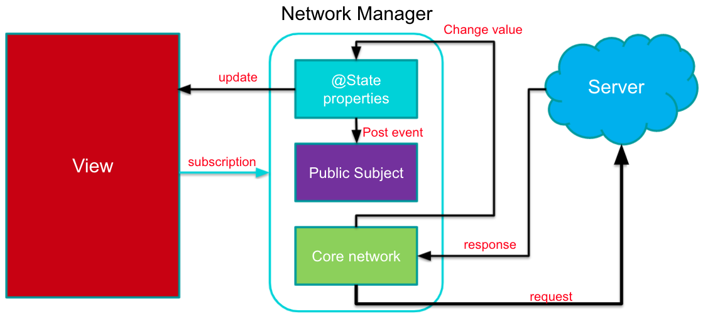
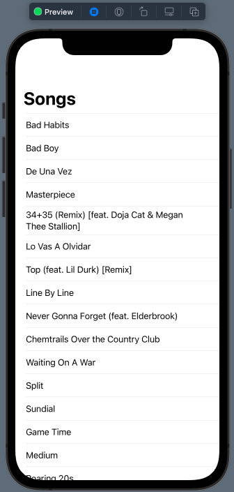
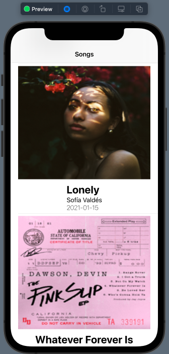
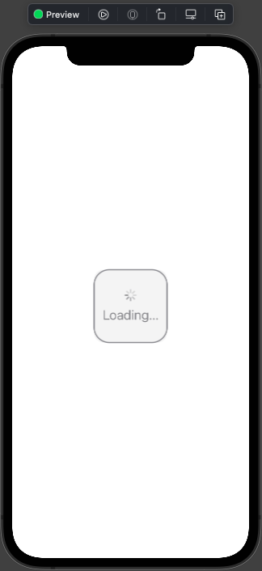

# 015.6 - Fetching Data from API

Chào mừng bạn đến với **Fx Studio**.  Chúng ta tiếp tục hành trình với series **SwiftUI** dài bất tận này. Chủ đề bài viết là **Fetching Data form API**. Hiển thị List bằng dữ liệu lấy được từ API. Bạn sẽ kết hợp tất cả những gì đã tìm hiểu ở các bài viết trước vào đây nhoé.

Còn nếu mọi việc đã ổn rồi, thì ...

> Bắt đầu thôi!

## Chuẩn bị

Về mặt tool và version, các bạn tham khảo như sau:

- SwiftUI 2.0
- Xcode 12

Về mặt kiến thức, bạn cần biết trước các kiến thức cơ bản với SwiftUI & SwiftUI App. Tham khảo các bài viết sau, nếu bạn chưa đọc qua SwiftUI:

- [Làm quen với SwiftUI](https://fxstudio.dev/swiftui-phan-1-lam-quen-voi-swiftui/)
- [Cơ bản về ứng dụng SwiftUI App](https://fxstudio.dev/swiftui-phan-2-co-ban-ve-ung-dung-swiftui-app/)

*(Mặc định, mình xem như bạn đã biết về cách tạo project với SwiftUI & SwiftUI App rồi.)*

Về mặt demo, chúng ta chỉ sử dụng các SwiftUI View riêng lẻ. Nên bạn có thể bắt đầu bằng việc tạo mới một project SwiftUI và giao diện không quá phức tạp lắm.

## Sơ đồ tương tác



Đầu tiên bạn cần phải hiểu được sơ đồ hoạt động của việc tương tác API. Nó sẽ đặc biết hơn khi bạn làm việc với SwiftUI.

> Vì chúng ta không thể dùng Delegate hay Callback để phản hồi sau khi tương tác API kết thúc.

Vấn đề chính là SwiftUI là **Declarative Programming**. Nên:

* View sẽ hiển thị dựa vào trạng thái của dữ liệu
* Không có Callback là bất lợi lớn nhất
* Không thể sử dụng Delegate trong SwiftUI, nó phá vỡ đi bản chất lập trình
* Ngoài hiển thị dữ liệu, bạn cần phải quản lý các trạng thái & quản lý lỗi nữa

Sơ đồ trên sẽ là một mô hình đề xuất giúp bạn thực hiện.

1. Bạn có thể lợi dụng các hàm khởi tạo hay các sự kiện người dùng để tiến hành gọi API
2. View sẽ lắng nghe các trạng thái phát tra từ Model API này, để biết lúc nào kết thúc quán trình hay lỗi
3. Việc tương tác API thông qua cái gọi là Core Network (có thể là bất cứ gì mà bạn đã dùng và tự tin dùng)
4. Khi bạn có **response** thì sẽ tiến hành **parse data** (phân tích dữ liệu). Sau đó tiến hành cập nhật cho phần dữ liệu của Model API
5. Lúc này, bạn kết hợp với **Reactive Programming** (ví dụ Combine) để tiến hành phát đi sự thay đổi.
6. View của bạn sẽ áp dụng nguyên tắc **The single source of truth** và có sự ràng buộc giao diện với dữ liệu. Giao diện sẽ tự động cập nhật theo giá trị của dữ liệu.

## Object Model

Bắt đầu công việc, bạn cần chuẩn bị các khai báo cho Model. Đây là các **Struct** tương ứng với các cấu trúc JSON của API. 

> Link API ví dụ: https://rss.itunes.apple.com/api/v1/vn/apple-music/hot-tracks/all/100/explicit.json

Bạn sẽ cần phân tích cấu trước đó để trở thành các thuộc tính của **Struct** nhoé. Ví dụ như sau:

```swift
typealias APIModel = Decodable & Identifiable

struct Song: APIModel {
    var id: String
    var artistName: String
    var releaseDate: String
    var name: String
    var collectionName: String
    var kind: String
    var copyright: String
    var artistId: String
    var artistUrl: String
    var artworkUrl100: String
}

//MARK: - Result
struct SongFeed: Decodable {
    var results: [Song]
}

struct SongResult: Decodable {
    var feed: SongFeed
}
```

Trong đó:

* APIModel sẽ là định danh của 2 **Protocol Decodable & Identifiable**.
* Với Decodable để giúp bạn `decoder` nhanh chóng từ JSON thành Object
* Với **Identifiable** sẽ giúp bạn định danh các Object trong Array. Ta sẽ lợi dụng key `id` trong JSON để định danh các Object này.

Vì cấu trúc JSON sự phân cấp. Nên chúng ta sẽ tạo thêm các Struct **SongFeed** và **SongResult**

* **SongFeed** tương ứng với key `feed` trong JSON trả về. Và nó chứa thuộc tính `results` thì tưởng ứng với Array Items trong JSON.
* Mỗi item tương ứng một **Song**
* **SongResult** đại diện cho toàn bộ cấu trúc JSON nhoé

## ViewModel

### Create file

Để giúp bạn có cái nhìn quen thuộc hơn. Mình sẽ kết hợp ViewModel vào trong SwiftUI này. Nhiệm vụ của **ViewModel** sẽ như **NetworkManager** trong sơ đồ trên. Bạn cần tạo 2 file như sau:

* SongListView : là SwiftUI View chính của chúng ta. Nơi sẽ hiển thị List

```swift
struct SongListView: View {
    
    @StateObject var viewmodle = SongListViewModel()
    
    var body: some View {
        Text("Hello, World!")
    }
}
```

Bạn sẽ khai báo một **StateObject** là `viewmodel` và khởi tạo luôn ViewModel của chúng ta.

* SongListViewModel : là nơi thực hiện tương tác với API và lưu trữ dữ liệu

```swift
class SongListViewModel: ObservableObject {
  
    private let urlString = "https://rss.itunes.apple.com/api/v1/vn/apple-music/hot-tracks/all/100/explicit.json"
    @Published var songs: [Song] = []
  
    init() { }
}
```

Ta cần phải khai báo thêm ObservableObject Protocol. Nó sẽ giúp View ràng buộc dữ liệu với các thuộc tính **@Published**. Ta khai báo thêm một String cho link của API nhoé.

Như vậy, chúng ta đã xong phần tạo các file cần thiết rồi.

### Load API

Công việc chính là đây. Bạn sẽ tương tác với API tại ViewModel nhoé. Còn tương tác như thế nào thì bạn sẽ xem qua ví dụ code sau:

```swift
class SongListViewModel: ObservableObject {
    
    private let urlString = "https://rss.itunes.apple.com/api/v1/vn/apple-music/hot-tracks/all/100/explicit.json"
    @Published var songs: [Song] = []
    
    init() {
        loadAPI()
    }
    
    //API
    func loadAPI() {
        guard let url = URL(string: urlString) else { return }
        
        URLSession.shared.dataTask(with: url) { (data, _, _) in
            guard let data = data else { return }
            
            let songResult = try! JSONDecoder().decode(SongResult.self, from: data)
            
            DispatchQueue.main.async {
                self.songs = songResult.feed.results
            }
        }.resume()
    }
}
```

Hầu như là việc sử dụng **URLSession** ở mức cơ bản mà thôi. Khi dữ liệu đã được `decode` xong thì chúng ta tiến hành cập nhập vào thuộc tính `song`. Vì nó là một **@Published**, nên các View ràng buộc dữ liệu với nó sẽ nhận được dữ liệu mới một cách tự động.

Ta tiến hành gọi function `loadAPI` ngay tại hàm khởi tạo `init()` của ViewModel nhoé. Như vậy, bạn đã có một file ViewModel có thể tương tác tốt với API.

## Display List

Tiếp theo, ta sang phần hiển thị danh sách có được từ API lên List của SwiftUI View. Nó cũng khá đơn giản vì tất cả đã được setup với **The single source of truth** rồi. Bạn chỉ cần quan tâm tới việc khai báo các View và sự ràng buộc dữ liệu với các thuộc tính **@StateObject** thôi nhoé.

Xem ví dụ tiếp nha

```swift
struct SongListView: View {
    
    @StateObject var viewmodle = SongListViewModel()

    var body: some View {
        NavigationView {
            List(viewmodle.songs) { song in
                Text(song.name)
            }
            .listStyle(InsetListStyle())
            .navigationBarTitle(Text("Songs"))
        }
    }
}
```

Bạn sử dụng `viewmodel.song` để là dữ liệu cho List. Các cấu hình của List thì vẫn giống như các bài trước. Xong rồi thì bạn bấm Live Preview và cảm nhận kết quả nhoé!



EZ Game!

### onAppear

Nếu bạn cảm thấy mọi việc đề được gọi lúc khởi tạo View và ViewModel sẽ tạo nên cảm giác bất an. Như trong ví dụ trên:

* Ta gọi `loadAPI` tại hàm khởi tạo của ViewModel
* Ta khởi tạo đối tượng của ViewModel ngày tại khai báo thuộc tính của SwiftUI View

Và bạn nghĩ như thế này:

```swift
struct SongListView: View {
    
    @StateObject var viewmodle = SongListViewModel()
    
    init() {
        viewmodle.loadAPI()
    }
    
    // ....
}
```

Thì SwiftUI 3.0 sẽ không hỗ trợ bạn nhoé. Khi đó một phiên bản @StateObject mới sẽ được tạo ra. Và View sẽ phản ứng với các giá trị cũ của `viewmodel` . Tương ứng với công việc này hoàn toàn vô ích. 

> Bạn hãy build project lên Simulator mà sẽ thấy được cảnh báo từ Xcode nhoé.

Và khi bạn khởi tạo mọi thứ như vậy cũng không tốt cho hiệu suất của ứng dụng. Do đó, SwiftUI mới cung cấp cho bạn một hàm khi mà View xuất hiện.

```swift
    var body: some View {
        NavigationView {
           // ....
        }
        .onAppear {
            viewmodle.loadAPI()
        }
    }
```

Bạn sẽ lợi dùng `onAppear` để tiến hành gọi API nhoé. Mọi việc giờ còn EZ hơn nữa rồi.

## Download Image

Để hiển thị danh sách được đẹp hơn thì chúng ta sẽ phải custom lại các row. Tuy nhiên, trở ngại đầu tiền chính là các **Image**. Chúng là các Image mà bạn phải tải về từ các URL. Do đó, việc tải ảnh từ một url cũng là một công việc tương tác với API.

### Downloader

Bạn cần tại thêm một Model để phục vụ việc tải ảnh. Mình tạm đặt tên nó là **Downloader** nhoé. Bạn xem ví dụ code như sau:

```swift
class Downloader: ObservableObject {
    
    @Published var data = Data()
    
    //API
    func loadAPI(urlString: String) {
        guard let url = URL(string: urlString) else { return }
        
        URLSession.shared.dataTask(with: url) { (data, _, _) in
            guard let data = data else { return }
            DispatchQueue.main.async { [weak self] in
                self?.data = data
            }
        }.resume()
    }
}
```

Là một phiên bản **clone** của ViewModel nhoé. Nhưng mà sử dụng thuộc tính `data` thay cho `songs`. Còn lại tất cả vẫn là sử dụng **URLSession** ở mức cơ bản mà thôi. Nguyên tắc hoạt động thì vẫn như ViewModle và view.

### Loadable Image View

Để kết hợp với SwiftUI View thì bạn có Custom một View thêm nữa. Custom View này sẽ đơn giản hoá đi việc download và hiển thị lên giao diện.

Về cơ bản nó vẫn giống như các List gọi API và hiển thị dữ liệu vậy. Bạn xem code ví dụ nhoé

```swift
struct LoadableImageView: View {
    
    @StateObject var downloader = Downloader()
    var urlString: String
    
    init(with urlString: String) {
        self.urlString = urlString
    }
    
    var stateContent: AnyView {
        if let image = UIImage(data: downloader.data) {
            return AnyView(
                Image(uiImage: image).resizable()
            )
        } else {
            return AnyView(
                ZStack {
                    ProgressView()
                }
                    .frame(
                        minWidth: 0,
                        maxWidth: .infinity,
                        minHeight: 0,
                        maxHeight: .infinity,
                        alignment: .center)
            )
        }
    }
    
    var body: some View {
        HStack {
            stateContent
        }
        .background(Color.gray)
        .onAppear {
            downloader.loadAPI(urlString: urlString)
        }
    }
}
```

Trong đó:

* Tại `.onAppear` của **HStack**, thì chúng ta tiến hành gọi download ảnh
* Nội dung của **HStack** là thuộc tính `stateContent`. Bạn sẽ làm quen dần với nó nhoé.
* `stateContent` là một AnyView, có nghĩa là bất kì SwiftUI View nào cũng được
* Tại `stateContent` bạn sẽ dựa vào dữ liệu của `downloader.data` mà quyết định hiển thị
  * Nếu có dữ liệu thì ta tiến hành cover từ **Data** thành **UIImage**. Sau đó `return` về
  * Nếu chưa có dữ liệu thì ta hiển thị một **ProgressView()**, để cho bạn biết lúc đó ảnh đang load

Bạn hãy thử một link ảnh nào đó ở Preview và kiểm tra kết quả nhoé


> Nhân tiện đây với SwiftUI 3.0 ta có một class mới, đó là **AsyncImage**. Nó sẽ cân hết công việc này. Tuy nhiên,  vì đam mê nên mình vẫn viết thôi. Ahihi!

## Custom Row

Tiếp theo, bạn cần cải thiện giao diện cho List với các Custom cho Row của nó. Phần này, bạn áp dụng LoadableImageView ở trên để có thể hiển thị ảnh từ một url nhoé.

Ví dụ code tham khảo như sau:

```swift
struct SongRow : View {
    var song: Song
    var body: some View {
        
        VStack(alignment: .center) {
            LoadableImageView(with: song.artworkUrl100)
                .frame(width: .infinity, height: 300.0)
                .scaledToFill()
                .background(Color.gray)
            VStack(alignment: .leading) {
                Text(song.name)
                    .font(.title)
                    .fontWeight(.bold)
                Text(song.artistName)
                Text(song.releaseDate)
                    .fontWeight(.thin)
            }
        }
    }
}
```

Cũng không có gì khó, chỉ là bố cục sao cho hợp mắt hoặc theo đúng thiết kế thôi. Cuối cùng, bạn cập nhật nó vào List của bạn nhoé. Xem ví dụ sau:

```swift
List(viewmodle.songs) { song in
    SongRow(song: song)
}
```

Như vậy là xong thôi. Bấm Live Preview và cảm nhận kết quả nhoé



## Display List with API State

Phần cuối này, chúng ta sẽ tiến hành tối ưu việc hiển thị của List. Bạn cũng biế là việc tương tác với API sẽ có thể xảy ra các trường hợp sau đây:

* `loading` khi bạn bắt đầu tương tác với API
* `success` hoàn thành việc tương tác API và phân tích dữ liệu thành công.
* `failure` xảy ra lỗi trong quá trình tương tác. Có thể có nhiều loại lỗi khác nhau

Do đó, View của chúng ta cũng phải linh hoạt theo các trường hợp như vậy. Để có thể hiển thị đúng với trạng thái tương tác với API

### Define

Chúng ta cần một số khai báo sau:

```swift
enum APIError: Error {
    case error(String)
    
    var localizedDescription: String {
        switch self {
        case .error(let message):
            return message
        }
    }
}

enum APIState {
    case loading
    case success
    case failure(APIError)
}
```

Trong đó:

* **APIError** là enum custom cho các lỗi của chương trình. Bạn có thể define thêm các `case` lỗi khác nhau nhoé
* **APIState** là trạng thái của việc tương tác với API. Ví dụ với 3 trạng thái cơ bản.

Tiếp theo, bạn khai báo thêm biến quản lý trạng thái cho việc tương tác API tại **ViewModel**. Ví dụ

```swift
@Published var apiState: APIState = .loading
```

### In use

Sử dụng thì khá là đơn giản. Vì `apiState` là một @Publisher. Do đó, bạn chỉ cần gán giá trị mới cho nó. Giá trị sẽ được phát đi. Các View ràng buộc với nó sẽ nhận được giá trị. Sau đó, các View sẽ tự động biến đổi theo.

Ví dụ:

```swift
// loading
apiState = .loading

// error
apiState = .failure(APIError.error("URL Error"))

// success
self.apiState = .success
```

### Handling Error

Tiếp theo, bạn cần quản quản lý các lỗi phát sinh trong quá trình tương tác với API. Ta sẽ cập nhật lại function `loadAPI()` của ViewModel như sau:

```swift
    func loadAPI() {
        guard let url = URL(string: urlString) else {
            apiState = .failure(APIError.error("URL Error"))
            return
        }
        
        apiState = .loading
        
        URLSession.shared.dataTask(with: url) { [self] (data, _, _) in
            guard let data = data else {
                self.apiState = .failure(APIError.error("Data Error"))
                return
            }
            
            do {
                let songResult = try JSONDecoder().decode(SongResult.self, from: data)
                DispatchQueue.main.async {
                    self.songs = songResult.feed.results
                    self.apiState = .success
                }
            } catch {
                self.apiState = .failure(APIError.error(error.localizedDescription))
            }
        }.resume()
    }
```

Trong đó:

* Sử dụng `try catch` để tiến hành bắt các lỗi do Decoder phát sinh ra
* Bên cạnh đó bạn cần bắt các lỗi trước khi kết nối với API, như là về lỗi của URL hay dữ liệu `data` không tồn tại

### @ViewBuilder function

Tại phần Loadable Image View, chúng ta đã thấy `stateContent` với **AnyView**. Đó là một cách biến đổi giao diện động. 

```swift
    var stateContent: AnyView {
        if let image = UIImage(data: downloader.data) {
            return AnyView(
                Image(uiImage: image).resizable()
            )
        } else {
            return AnyView(
                ZStack {
                    ProgressView()
                }
                    .frame(
                        minWidth: 0,
                        maxWidth: .infinity,
                        minHeight: 0,
                        maxHeight: .infinity,
                        alignment: .center)
            )
        }
    }
```

Ta cũng sẽ áp dụng cách này cho List của chúng ta. Tuy nhiên, với các dữ liệu & phức tạp hơn. Thì **AnyView** sẽ không đáp ứng được. Nhất là các View khởi tạo ban đầu cho màn hình. Do đó, ta sẽ tới với một giải pháp mới hơn.

> Đó là **@ViewBuilder** . Đây là một loại trình tạo chức năng cho phép bạn tạo một Chế độ xem duy nhất từ nhiều Chế độ xem.

Trước đây, điều này chỉ có thể bằng cách đặt xem bạn bên trong một `Group`, mà là một cách để có được những lợi ích của `@ViewBuilder`không những tác động bố trí `VStack`, `HStack`hoặc `ZStack`. Điều này không còn cần thiết trong phiên bản SwiftUI mới và kết quả là việc sử dụng `Group`sẽ trở nên thích hợp hơn.

Ta sẽ áp dụng vào **SongListView** với một function được khai báo với **@ViewBuilder**.

````swift
    @ViewBuilder
    func buildContent() -> some View {
        switch viewmodle.apiState {
        case .loading:
            ZStack {
                RoundedRectangle(cornerRadius: 15).fill(Color.gray.opacity(0.1))
                ProgressView {
                    Text("Loading...")
                        .font(.title2)
                }
            }.frame(width: 120, height: 120, alignment: .center)
                .background(RoundedRectangle(cornerRadius: 25).stroke(Color.gray,lineWidth: 2))
            
        case .success:
            NavigationView {
                List(viewmodle.songs) { song in
                    SongRow(song: song)
                }
                .listStyle(InsetListStyle())
                .navigationBarTitle(Text("Songs"))
            }
        case .failure(let error):
            Text(error.localizedDescription)
                .font(.title)
        }
    }
````

Trong đó:

* Sử dụng `switch case` để duyệt các trạng thái của `viewmodel.apiState`
* Với mỗi `case` tương ứng bạn sẽ có một kiểu giao diện phù hợp

Cuối cùng, bạn cập nhật lại `body` của **SongListView**, bằng việc gọi tới function **@ViewBuilder** là xong.

```swift
    var body: some View {
        HStack {
            buildContent()
        }
        .onAppear {
            viewmodle.loadAPI()
        }
    }
```

Bấm Live Preview và cảm nhận kết quả nhoé. Còn đây là hình trạng thái đang `loading` nhoé.



### @ViewBuilder Properties

Nến bạn không thích sử dụng một function mà thay vào đó là một property thì ta vẫn có thể áp dụng được @ViewBuilder cho một thuộc tính nhoé. Bạn xem ví dụ sau:

```swift
    @ViewBuilder
    var stateContent: some View {
        switch viewmodle.apiState {
        case .loading:
            ZStack {
                RoundedRectangle(cornerRadius: 15).fill(Color.gray.opacity(0.1))
                ProgressView {
                    Text("Loading...")
                        .font(.title2)
                }
            }.frame(width: 120, height: 120, alignment: .center)
                .background(RoundedRectangle(cornerRadius: 25).stroke(Color.gray,lineWidth: 2))
            
        case .success:
            NavigationView {
                List(viewmodle.songs) { song in
                    SongRow(song: song)
                }
                .listStyle(InsetListStyle())
                .navigationBarTitle(Text("Songs"))
            }
        case .failure(let error):
            Text(error.localizedDescription)
                .font(.title)
        }
    }
```

Cũng tương tự như với function thôi. Khác là ở một bên khai báo function, một bên là property.

Chúc bạn thành công nhoé!

## Tạm kết

* Sơ đồ cách hoạt động của việc tương tác với API trong SwiftUI
* Thiết kế các Model và Define phù hợp cho việc tương tác API
* Thực tiện tương tác đơn giản với MVVM
* Hiển thị dữ liệu từ API lên List
* Thực hiện download ảnh và hiển thị một Image với link url cho ảnh
* Custom Row với Image custom cho việc load ảnh từ url
* Hiển thị List theo từng trạng thái tương tác với API
* Xử lý các lỗi cơ bản trong quá trình tương tác API
* Xử lý nội dung hiển thị theo từng trạng thái với @ViewBuilder

---

Cảm ơn bạn đã theo dõi các bài viết từ **Fx Studio** & hãy truy cập [website](https://fxstudio.dev/) để cập nhật nhiều hơn!
