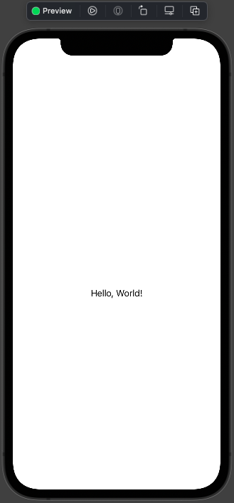
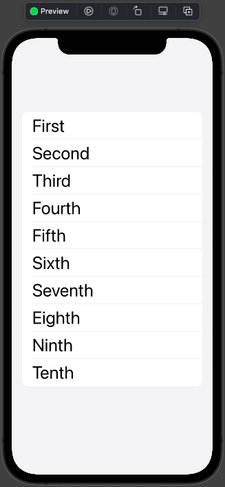
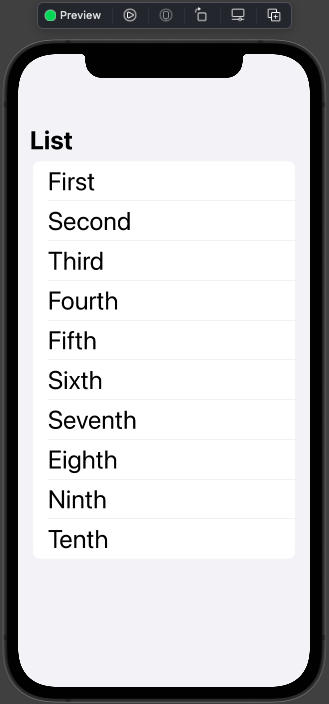
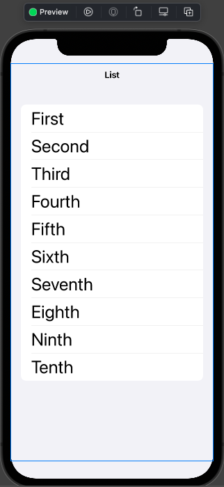
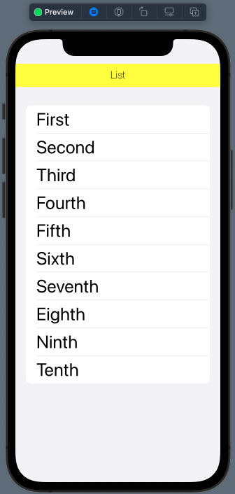
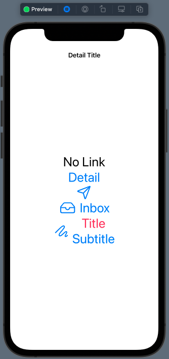
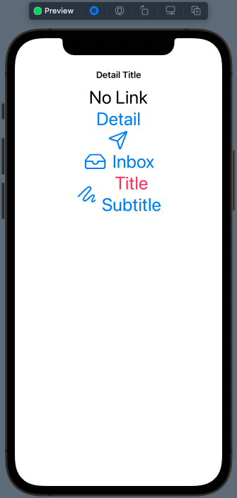
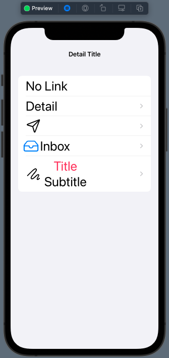
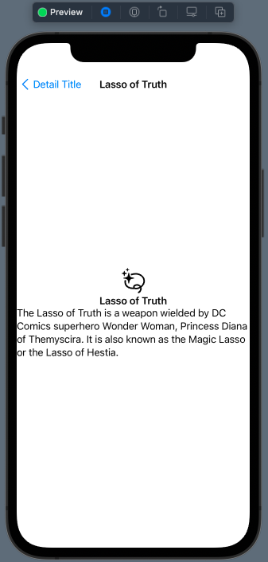

# 01 - Navigation

Chào mừng bạn đến với Fx Studio. Chúng ta lại gặp nhau trong series **SwiftUI Notes** này. Bây giờ, ta sẽ bắt đầu cuộc hành trình mới trong **SwiftUI**, tập trung về vấn đề điều hướng trong SwiftUI. Bắt đầu với bài viết về **Naviagtion** & **NavigationView**.

Nếu mọi việc đã ổn rồi, thì ...

> Bắt đầu thôi!

## Chuẩn bị

Về mặt tool và version, các bạn tham khảo như sau:

- SwiftUI 2.0
- Xcode 12

Về mặt kiến thức, bạn cần biết trước các kiến thức cơ bản với SwiftUI & SwiftUI App. Tham khảo các bài viết sau, nếu bạn chưa đọc qua SwiftUI:

- [Làm quen với SwiftUI](https://fxstudio.dev/swiftui-phan-1-lam-quen-voi-swiftui/)
- [Cơ bản về ứng dụng SwiftUI App](https://fxstudio.dev/swiftui-phan-2-co-ban-ve-ung-dung-swiftui-app/)

*(Mặc định, mình xem như bạn đã biết về cách tạo project với SwiftUI & SwiftUI App rồi.)*

## Naviagtion & NavigationView

Đặc trưng của các ứng dụng trên PC thì chúng hầu hết có 1 window và tất cả view hiển thị đều ở đó. Nhưng đối với mobile nói chung thì giới hạn về kích thước màn hình vẫn là điều lớn nhất. Nên giao diện phải được chia ra thành nhiều màn hình. Chúng sẽ được bố trí ở nhiều **View Controller** khác nhau. Vấn đề đặt ra là

> Làm sao để di chuyển giữa các màn hình với nhau và luồng dữ liệu & sự kiện sẽ như thế nào?

Bài này sẽ chỉ giải quyết một phần của vấn đề trên vì việc di chuyển giữa các màn hình khác nhau thì phức tạp hơn nhiều. Nó còn được gọi là **điều hướng** ứng dụng. Bạn phải nắm rõ cấu trúc các màn hình trong ứng dụng của bạn thì mới điều khiển được chúng nó.

### Navigation

Chúng ta hồi tưởng quá khứ một chút với UIKit nhoé!

> **UINavigationController** hay **Navigation Controller** là một container quản lý các **View** **Controller** con và điều hướng chúng. Trong đó, mỗi lần chỉ hiển thị được một View Controller con mà nó quản lý.


Navigation Controller giống như một ngăn xếp. View Controller được bỏ vào sau sẽ được **hiển thị**. Khi lấy ra một View Controller từ ngăn xếp thì View Controller được thêm vào trước đó sẽ được **hiển thị**. Tới khi nào tới View Controller đầu tiên thì không thể lấy ra được nữa.

Navigation được sử dụng vào việc điều hướng đơn giản khi muốn di chuyển qua các màn hình và quay lại. Các màn hình thường liên quan với nhau.

Vì **UINavigationController** cũng là con cháu của **UIViewController**. Nên đối tượng thể hiện của nó, có thể xét ở `root` của Window để điều hướng toàn bộ giao diện ứng dụng theo Navigation.

### NavigationView

Bây giờ, chúng ta qua đại diện **NavigationView** của **SwiftUI**. Nó cũng được xem là đối tượng thay thế cho *UINavigationController* bên *UIKit*.

Về định nghĩa thì **NavigationView** là View được trình bày dưới dạng ngăn xếp và chứa các view. Các View được chưa sẽ xếp chồng lên nhau.

Quan trọng nhất nó sẽ điều hướng các View với nhau có sự phân cấp trong ngăn xếp các View. Chế độ điều hướng của NavigationView thì đưa 1 View khác đè lên 1 trên cùng của nó (tại thời điểm đó).

Vì là người em đi sau **UINaviagtionController** nên **NaviagationView** cũng kết thừa lại hết nhữnh tinh hoa của đàn anh. Như *NavigationBar, Title, ....* Chúng ta sẽ tìm hiểu chúng dần dần ở các phần dưới nha.

## Creation

NavigationView thì là loại SwiftUI View kiểu Container. Có nghĩa nó sẽ chứa được nhiều View con trong nó. Bản thân hàm khởi tạo của nó cũng cần được cung cấp các View con.

Xem là biết thôi

```swift
public init(@ViewBuilder content: () -> Content)
```

Bạn sẽ truyền các View con cho tham số `content` của NavigationView nhoé. Vì là `@ViewBuilder` nên bạn thoải sức mà truyền tham số với các View bất kì.

Chúng ta sẽ có 2 dạng chính để tạo một NavigationView & View con của nó cho 2 trường hợp cơ bản sau đây.

### Non-scrollable Content

Trường hợp đầu tiên là 1 View tĩnh đơn giản, không có khả năng **scroll** hay có thể chứa thêm các View nào khác. Chúng ta xem qua ví dụ nhoé.

```swift
struct NavigationViewDemo: View {
    var body: some View {
        NavigationView {
            Text("Hello, World!")
        }
    }
}
```

Cũng không có gì khó hiểu hết. Bạn có thể chứa bất kì View nào đó vào trong NavigationView thôi. Xem kết quả nhoé.



### List Content

Tiếp theo, chúng ta tìm hiểu sử dụng **NavigationView** với dạng phổ biến hơn. Đó là List hoặc Scroll content. Với loại này bạn sẽ có 1 giao diện với content hơn hơn màn hình. Thường là các danh sách. Đi kèm với đó là việc bạn phải di chuyển từ màn hình này sang màn hình khác.

Do đó, NavigationView được sử dụng phá là phổ biến trong những tình huống như thế này. Xem ví dụ code tiếp nhoé!

```swift
struct NavigationViewDemo: View {
    var body: some View {
        NavigationView {
            List {
                Text("First")
                Text("Second")
                Text("Third")
                Text("Fourth")
                Text("Fifth")
                Text("Sixth")
                Text("Seventh")
                Text("Eighth")
                Text("Ninth")
                Text("Tenth")
            }.font(.largeTitle)
        }
    }
}
```

Xem kết quả sau khi nhấn Resume nhoé!



## Title & Bar

Với 2 ví dụ trên nhìn quá đơn sơ mộc mạc. Chúng ta sẽ tiếp tục làm màu cho chúng nó đẹp hơn nhoé.

### NaviagtionTitle

Bắt đầu, ta sẽ thêm `title` cho **NavigationView**, bằng modifier `.navigationTitle`. Tuy nhiên, có điểm khá là vui. Thay vì bạn gọi trực tiếp **modifer** của **NavigationView**, thì bạn phải gọi **modifier** cho **View con** mà *NavigationView* đang chứa để hiển thị `title`.

Ví dụ tiếp nhoé:

```swift
struct NavigationViewDemo: View {
    var body: some View {
        NavigationView {
            List {
                Text("First")
                Text("Second")
                Text("Third")
                Text("Fourth")
                Text("Fifth")
                Text("Sixth")
                Text("Seventh")
                Text("Eighth")
                Text("Ninth")
                Text("Tenth")
            }
            .font(.largeTitle)
            .navigationTitle("List")
        }
    }
}
```

Như vậy, đối tượng NaviagtionView sẽ chỉ phục vụ mục đích duy nhất là điều hướng mà thôi. Các thành phần khác do Content View của nó quyết định. Bạn bấm Resume và xem kết quả nhoé.



### NaviagtionBar

Bạn sẽ thấy Title nó hiển thị quá to. Đó là kiểu mặc định của Navigation trong iOS. Và bạn vẫn có thể tuỳ chính các style này. Cho NavigationBar. Thông qua modifier `navigationBarTitleDisplayMode()`. Trong đó, ta. sẽ có 3 tham số cho 2 kiểu hiển thị:

* `.larger` hiển thị với kích thước lớn (như ở trên)
* `.inline` hiển thị với kích thước nhỏ hơn, nằm vừa trong NaviagtionBar
* `.automatic` lựa chọn này là măc định

Xem ví dụ code tiếp nhoé

```swift
struct NavigationViewDemo: View {
    var body: some View {
        NavigationView {
            List {
                Text("First")
                Text("Second")
                Text("Third")
                Text("Fourth")
                Text("Fifth")
                Text("Sixth")
                Text("Seventh")
                Text("Eighth")
                Text("Ninth")
                Text("Tenth")
            }
            .font(.largeTitle)
            .navigationTitle("List")
            .navigationBarTitleDisplayMode(.inline)
        }
    }
}
```

Xem kết quả nhoé!



### Custom NavigationBar

Khá buồn vì hiện tại chúng ta chưa custom được nhiều cho **NaviagationBar** tương tự như với UIKit. Do đó, bắt buộc bạn phải lợi dụng theo từng nền tảng mà bạn đang sử dụng với SwiftUI.

Tại đây, mình thực hiện SwiftUI trên iOS và lợi dụng tới `UINavigationBar.appearance()`. Để tiền hành tuỳ chỉnh hiển thị của **NaviagtionBar** cho **NavigationView**.

Bạn cần thực hiển việc tuỳ chỉnh này ở 1 nơi nào đó, có thể tại hàm `init` của View cũng được. Xem ví dụ code nhoé

```swift
    init() {
        UINavigationBar.appearance().backgroundColor = .yellow
        
        UINavigationBar.appearance().largeTitleTextAttributes = [
            .foregroundColor: UIColor.darkGray,
            .font : UIFont(name:"Papyrus", size: 40)!]
        
        UINavigationBar.appearance().titleTextAttributes = [
            .font : UIFont(name: "HelveticaNeue-Thin", size: 20)!]
    }
```

Bạn không cần thay đổi code gì với NavigationView hay Content View của nó. Sau đó, bạn phải bấm **Live Preview** thì mới cảm nhận kết quả được.



## NavigationLink

Chúng ta chuyển sang phần chính, làm thế nào để đưa một View nào đó vào trong một **NavigationView**. Hay còn nói một cách khác thì là **điều hướng** các View trong Naviagtion.

Bạn sẽ sử dụng tới **NavigationLink**, nó là một View điều khiển việc điều hướng. Khởi tạo nó thì bạn cần có:

* **Source View** : là bất cứ View nào để làm **trigger** cho việc di chuyển.
* **Destination view** : là View sẽ được đưa vào ngăn xếp NaviagtionView.

### Source View

Như đã nói ở trên, thì Source View là bất cứ View nào. Chúng ta sẽ thực hiện ví dụ với 3 loại chính.

#### Non Scrollable Content

Bạn xem qua ví dụ sau nhoé!

```swift
struct NavigationLinkDemo1: View {
    var body: some View {
        NavigationView {
            VStack {
                Text("No Link") // <9>
                NavigationLink(
                    destination: Text("Detail"), // <1>
                    label: {
                    Text("Detail") // <5>
                })
                NavigationLink(
                    destination: Text("Paper Plane"), // <2>
                    label: {
                    Image(systemName: "paperplane") // <6>
                })
                NavigationLink(
                    destination: Text("Inbox"), // <3>
                    label: {
                    Label("Inbox", systemImage: "tray") // <7>
                })
                NavigationLink(
                    destination: Text("Custom"), // <4>
                    label: {
                    HStack { // <8>
                        Image(systemName: "scribble")
                        VStack {
                            Text("Title")
                                .foregroundColor(.pink)
                            Text("Subtitle")
                        }
                    }
                })
            }
            .font(.largeTitle)
            .navigationTitle("Detail Title")
            .navigationBarTitleDisplayMode(.inline)
        }
    }
}
```

Chúng ta chọn **VStack** là content cho **NavigationView**. Bên trong **VStack**, ta sẽ khai báo các **NavigationLink** mà sẽ điều hướng các **Text** vào **NavigationView**. Lúc này, Source View của nó là các View đơn giản, không có khả năng scroll, nghĩa là trong phạm vi màn hình mà thôi.

Bạn bấm **Live Preview** và cảm nhận kết quả nha.



#### ScrollView

Khi Content View của bạn với kích thước lớn hơn, thì bạn hãy nghĩ tới **ScrollView** thay thế cho **VStack**. Trong trường hợp này code của bạn chỉ cần thay `ScrollView` cho `VStack` là xong.

```swift
struct NavigationLinkDemo1: View {
    var body: some View {
        NavigationView {
            ScrollView {
                Text("No Link") // <9>
                NavigationLink(
                    destination: Text("Detail"), // <1>
                    label: {
                    Text("Detail") // <5>
                })
                NavigationLink(
                    destination: Text("Paper Plane"), // <2>
                    label: {
                    Image(systemName: "paperplane") // <6>
                })
                NavigationLink(
                    destination: Text("Inbox"), // <3>
                    label: {
                    Label("Inbox", systemImage: "tray") // <7>
                })
                NavigationLink(
                    destination: Text("Custom"), // <4>
                    label: {
                    HStack { // <8>
                        Image(systemName: "scribble")
                        VStack {
                            Text("Title")
                                .foregroundColor(.pink)
                            Text("Subtitle")
                        }
                    }
                })
            }
            .font(.largeTitle)
            .navigationTitle("Detail Title")
            .navigationBarTitleDisplayMode(.inline)
        }
    }
}
```

Mọi thứ vẫn hoạt động giống y như vậy. Tuy nhiên, chúng ta có thêm không gian để thêm nội dung cho Content View hay các Source View của các **NavigationLink**.



Để ý kĩ thì bạn thấy nội dung phía trên thay vì chính giữa màn hình thiết bị. Nó đã được dịch chuyển lên trên cùng rồi. Và bạn có thể scroll chúng

#### List

Cuối cùng, bạn thay thế `ScrollView` bằng `List` thì sẽ thấy sự khác biệt.

```swift
struct NavigationLinkDemo1: View {
    var body: some View {
        NavigationView {
            //VStack {
            //ScrollView {
            List {
                Text("No Link") // <9>
                NavigationLink(
                    destination: Text("Detail"), // <1>
                    label: {
                    Text("Detail") // <5>
                })
                NavigationLink(
                    destination: Text("Paper Plane"), // <2>
                    label: {
                    Image(systemName: "paperplane") // <6>
                })
                NavigationLink(
                    destination: Text("Inbox"), // <3>
                    label: {
                    Label("Inbox", systemImage: "tray") // <7>
                })
                NavigationLink(
                    destination: Text("Custom"), // <4>
                    label: {
                    HStack { // <8>
                        Image(systemName: "scribble")
                        VStack {
                            Text("Title")
                                .foregroundColor(.pink)
                            Text("Subtitle")
                        }
                    }
                })
            }
            .font(.largeTitle)
            .navigationTitle("Detail Title")
            .navigationBarTitleDisplayMode(.inline)
        }
    }
}
```

Trong đó:

* Mỗi NavigationLink sẽ đại diện cho 1 Row của List
* Khi bạn kích vào Row thì sẽ tự động điều hướng tiếp
* Khi bạn chọn thì Row sẽ được `highlights` lên
* Xuất hiện thêm 1 dấu `>` ở phía bên phải của Row, biểu thi cho việc từ Row đó thì có thể di chuyển tiếp sang View khác.

Bấn **Live Preview** và xem kết quả nhoé!



### Destination view

**Destination view** là cái View mà bạn muốn đưa vào **NavigationView** của bạn, thông qua **NavigationLink**. Trong ví dụ trên, nó là một Text. Tuy nhiên, nó có thể là bất cứ View nào hay bất cứ Custom View nào cũng được cả.

Ta thử lấy ví dụ như sau:

```swift
struct CustomDestinationView: View {
    var body: some View {
        VStack {
            Image(systemName: "lasso.sparkles")
                .font(.largeTitle)
            Text("Lasso of Truth")
                .font(.headline)
            Text("The Lasso of Truth is a weapon wielded by DC Comics superhero Wonder Woman, Princess Diana of Themyscira. It is also known as the Magic Lasso or the Lasso of Hestia.")
                .font(.body)
        }
        .navigationTitle("Lasso of Truth") // <1>
    }
}
```

**CustomDestinationView** sẽ đóng vài trò là điểm đến của NavigationLink. Và sử dụng nó thì bạn thay đổi lại từ `Text` thành `CustomDestinationView` trong các NavigationLink trên thôi. Ví dụ nhoé

```swift
                NavigationLink(
                    destination: CustomDestinationView(), // <1>
                    label: {
                    Text("Detail") // <5>
                })
```

Bạn bấm **Live Preview** và test lại nhoé!




### NavigationLink without NavigationView

Đôi lúc bạn có thể thắc mắc, chúng ta sẽ dùng NavigationLink mà không ở trong NavigationView thì sẽ như thế nào?

Xem ví dụ code là biết thôi.

```swift
struct NavigationLinkDemo2: View {
    var body: some View {
            NavigationLink(
                destination: CustomDestinationView(),
                label: {
                    Text("Detail")
                }
            )
            .font(.largeTitle)
            .navigationTitle("Detail Title")
            .navigationBarTitleDisplayMode(.inline)
        }
}
```

Lúc này, thì NavigationLink sẽ bị vô hiệu hoá. Phần Source View của nó sẽ bị xám đi. Bạn sẽ không táp hay kích được nào nó. Và nó chỉ có như vậy thôi!

Bấn Resume để xem kết quả nhoé!


## Tạm kết

* Tìm hiểu về NavigationView
* Các tạo NavigationView
* Custom title & bar của NaviagtionView
* Sử dụng NavigationLink vào điều hướng cơ bản

---

Cảm ơn bạn đã theo dõi các bài viết từ **Fx Studio** & hãy truy cập [website](https://fxstudio.dev/) để cập nhật nhiều hơn!
