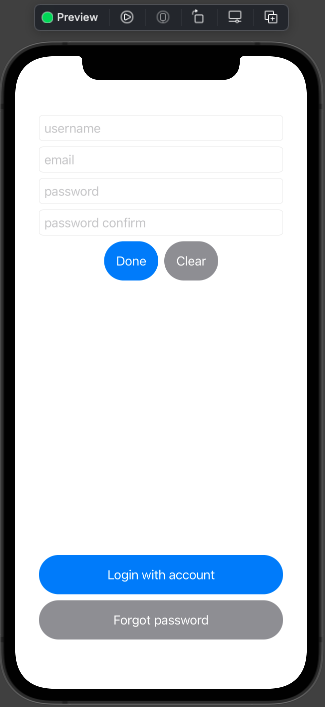
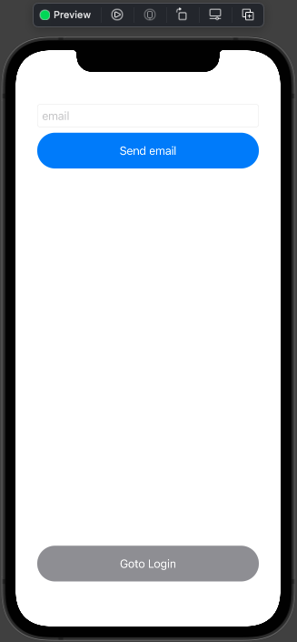
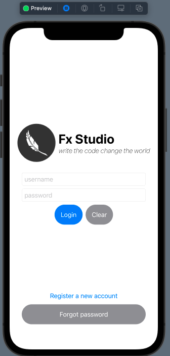
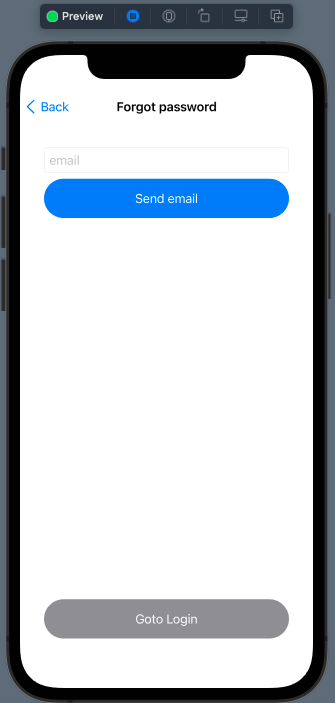

# 02 - Push & Pop

Chào mừng bạn đến với **Fx Studio**. Chúng ta đã bắt đầu tìm hiểu về đối tượng **NaviagtionView** trong việc điều hướng trong **SwiftUI**. Tuy nhiên, vấn đề cơ bản trong điều hướng là **Push & Pop**, thì lại không phải là việc đơn giản. Trong bài viết này, chúng ta sẽ giải quyết vấn đề điều hướng cơ bản trên.

Nếu mọi việc đã ổn rồi, thì ...

> Bắt đầu thôi!

## Chuẩn bị

Về mặt tool và version, các bạn tham khảo như sau:

- SwiftUI 2.0
- Xcode 12

Về mặt kiến thức, bạn cần biết trước các kiến thức cơ bản với SwiftUI & SwiftUI App. Tham khảo các bài viết sau, nếu bạn chưa đọc qua SwiftUI:

- [Làm quen với SwiftUI](https://fxstudio.dev/swiftui-phan-1-lam-quen-voi-swiftui/)
- [Cơ bản về ứng dụng SwiftUI App](https://fxstudio.dev/swiftui-phan-2-co-ban-ve-ung-dung-swiftui-app/)

*(Mặc định, mình xem như bạn đã biết về cách tạo project với SwiftUI & SwiftUI App rồi.)*

## Login Flow

Để chuẩn bị cho bài viết này, mình sẽ tạo sẵn các màn hình trong một luồng **Login** cơ bản nhất. Bạn chỉ cần copy để tái sử dụng lại. Hoặc tự sáng tạo theo ý đồ riêng của bạn.

> Mình sẽ dùng nó lại cho các bài viết sau nữa.

Luồng màn hình di chuyển sẽ như thế này:

```
// Chiều đi
Login > Register
Login > Forgot Password
Login > Register > Forgot Password

// Chiều về
Login > Register > Login
Login > Forgot Password > Login

Login > Register > Forgot Password > Login
Login > Register > Forgot Password > Register
```

Nhiệm vụ của bạn sẽ cài đặt các việc di chuyển như trên nhoé. Xoay quanh đó bạn sẽ có các nhiệm vụ như sau:

* **Push** : đưa 1 View khác vào Stack
* **Pop** : lấy View ra khỏi Stack
* **Pop to root** : lấy hết các View ra khỏi Stack, để lại Root

Còn sau đây là code cho từng màn hình.

### Login View

```swift
struct LoginView: View {
    
    @State var username: String = ""
    @State var password: String = ""
    
    var body: some View {
        NavigationView {
            VStack {
                Spacer()
                // logo
                HStack {
                    Image("logo")
                        .resizable()
                        .frame(width: 100, height: 100)
                        .clipShape(Circle())
                    VStack(alignment: .leading) {
                        Text("Fx Studio")
                            .font(.largeTitle)
                            .fontWeight(.bold)
                        Text("write the code change the world")
                            .fontWeight(.thin)
                            .italic()
                    }
                }
                
                // TextField
                VStack {
                    TextField("username", text: $username)
                        .textFieldStyle(RoundedBorderTextFieldStyle())
                    SecureField("password", text: $password)
                        .textFieldStyle(RoundedBorderTextFieldStyle())
                    HStack {
                        Button {
                            // goto Home
                        } label: {
                            Text("Login")
                        }
                        .buttonStyle(BlueButton())
                        
                        Button {
                            // clear
                            username = ""
                            password = ""
                        } label: {
                            Text("Clear")
                        }
                        .buttonStyle(GrayButton())
                    }
                }
                .padding()
                // Others button
                Spacer()
                VStack {
                    Button {
                        // goto register view
                    } label: {
                        Text("Register a new account")
                            .frame(maxWidth: .infinity)
                    }
                    .buttonStyle(BlueButton())
                    
                    Button {
                        // goto forgot view
                        
                    } label: {
                        Text("Forgot password")
                            .frame(maxWidth: .infinity)
                    }
                    .buttonStyle(GrayButton())
                }
                .padding()
            }
            .padding()
            .navigationBarTitleDisplayMode(.inline)
        }
    }
}
```

Kết quả ban đầu như sau.


### Register View

```swift
struct RegisterView: View {
    @State var username: String = ""
    @State var email: String = ""
    @State var password: String = ""
    @State var passwordConfirm: String = ""
    
    var body: some View {
        VStack {
            // TextField
            VStack {
                TextField("username", text: $username)
                    .textFieldStyle(RoundedBorderTextFieldStyle())
                TextField("email", text: $email)
                    .textFieldStyle(RoundedBorderTextFieldStyle())
                SecureField("password", text: $password)
                    .textFieldStyle(RoundedBorderTextFieldStyle())
                SecureField("password confirm", text: $passwordConfirm)
                    .textFieldStyle(RoundedBorderTextFieldStyle())
                HStack {
                    Button {
                        // goto Home
                    } label: {
                        Text("Done")
                    }
                    .buttonStyle(BlueButton())
                    
                    Button {
                        // clear
                        username = ""
                        email = ""
                        password = ""
                        passwordConfirm = ""
                    } label: {
                        Text("Clear")
                    }
                    .buttonStyle(GrayButton())
                }
            }
            .padding()
            // Others button
            Spacer()
            VStack {
                Button {
                    // goto register view
                } label: {
                    Text("Login with account")
                        .frame(maxWidth: .infinity)
                }
                .buttonStyle(BlueButton())
                
                Button {
                    // goto forgot view
                } label: {
                    Text("Forgot password")
                        .frame(maxWidth: .infinity)
                }
                .buttonStyle(GrayButton())
            }
            .padding()
        }
        .padding()
        .navigationTitle("Register a new account")
        .navigationBarTitleDisplayMode(.inline)
    }
}
```

Kết quả ban đầu như sau.



### ForgotPassword View

```swift
struct ForgotPasswordView: View {
    @State var email: String = ""
    
    var body: some View {
        VStack {
            // TextField
            VStack {
                TextField("email", text: $email)
                    .textFieldStyle(RoundedBorderTextFieldStyle())
                Button {
                    // goto register view
                } label: {
                    Text("Send email")
                        .frame(maxWidth: .infinity)
                }
                .buttonStyle(BlueButton())
            }
            .padding()
            // Others button
            Spacer()
            VStack {
                Button {
                    // goto login view
                } label: {
                    Text("Goto Login")
                        .frame(maxWidth: .infinity)
                }
                .buttonStyle(GrayButton())
            }
            .padding()
        }
        .padding()
        .navigationTitle("Forgot password")
        .navigationBarTitleDisplayMode(.inline)
    }
}
```

Kết quả ban đầu như sau.




Các View đều được cài đặt với **NavigationView**. Tuy nhiên,

* **LoginView** sẽ được cài đặt chính với *Root* là **NavigationView**
* **RegisterView** & **ForgotPassword** thì sẽ được điều hướng vào NavigationView. Nên *Root* của nó sẽ không có NavigationView
* Các `title` & `bar` thì cài đặt bình thường.

Mình có điều lưu ý sau:

> Bài viết này chủ yếu mang tính chất hoài niệm quá khứ với UINavigationView trong UIKit. Và giúp cho bạn có trải nghiệm quen thuộc khi chuyển đổi nền tảng sang SwiftUI. Về bản chất của lập trình SwiftUI, chúng ta sẽ không sử dụng các kiểu điều hướng như với UIKit.

## Push

Câu chuyện với **Push** thì khá là đơn giản. Chúng ta đã tìm hiểu về **NavigationLink** tại bài viết trước đó rồi. Và ta sẽ dùng **NavigationLink** cho **Push** một *View* vào *NaviagtionView*.

Để bắt đầu, bạn truy cập vào file LoginView và chú ý đoạn code này. 

```swift
                VStack {
                    Button {
                        // goto register view
                    } label: {
                        Text("Register a new account")
                            .frame(maxWidth: .infinity)
                    }
                    .buttonStyle(BlueButton())
                    
                    Button {
                        // goto forgot view
                        
                    } label: {
                        Text("Forgot password")
                            .frame(maxWidth: .infinity)
                    }
                    .buttonStyle(GrayButton())
                }
                .padding()
```

Mình đã thiết kế sẵn cho bạn 2 Button rồi. Còn khi kết hợp với NavigationLink thì bạn có rất nhiều sự lựa chọn:

### **NavigationLink chính là Button**

```swift
                    NavigationLink(destination: RegisterView()) {
                        Text("Register a new account")
                            .frame(maxWidth: .infinity)
                    }
```

Cũng khá okay đó. Tuy nhiên, bạn sẽ phải custom lại giao diện cho Text (hay là Label của **NavigationLink**), vì nó trông khá xấu. Nhưng vẫn đảm bảo việc **Push**.



Fix lại thì khá đơn giản, vì NavigationLink cũng như một Button. Do đó, bạn áp dụng `buttonStyle` cho nó là oke.

```swift
                    NavigationLink(destination: RegisterView()) {
                        Text("Register a new account")
                            .frame(maxWidth: .infinity)
                    }
                    .buttonStyle(BlueButton())
```

### NavigationLink with isActive

Chúng ta sang một cách sử dụng NavigationLink với 1 `trigger`. Ta sẽ khai thác thêm tham số `isActive` của nó. Nhưng bạn cần khai báo thêm một thuộc tính `@State` cho **LoginView** nhoé.

```swift
@State var isActive = false
```

Chúng ta sẽ đưa NavigationLink vào trong Button. Việc này có lợi ích là bạn có thể lợi dụng `action` của Button để xử lý hay tương tác trước. Tham khảo code nhoé

```swift
                    Button {
                        // goto forgot view
                        
                    } label: {
                        NavigationLink(destination: ForgotPasswordView(), isActive: self.$isActive) {
                            Text("Forgot password")
                                .frame(maxWidth: .infinity)
                        }
                    }
                    .buttonStyle(GrayButton())
```

Mình sử dụng nó hơi cùi một tí. Tuy nhiên, bạn sẽ lợi dụng `isActive` rất nhiều về sau. Bấm **Live Preview** và test lại Push nhoé.

### NavigationLink with Tag & Selection

Chúng ta sẽ khám phá thêm một cách sử dụng NavigationLink nữa. Có thể bạn sẽ thích cách này, vì chúng ta đang có 2 luồng điều hướng từ 1 view đầu tiên. Do đó, bạn sẽ dễ quản lý các luồng khi thuộc tính `@State` sẽ cho bạn nhiều lựa chọn hơn nữa là 2 giá trị của `bool`.

Bạn khai báo thêm một tính mới cho LoginView nhoé!

```swift
@State var selection: Int?
```

`selection` sẽ là một Optional nhoé!. Còn việc điều hướng sẽ như thế này.

```swift
                    NavigationLink(destination: RegisterView(), tag: 1, selection: self.$selection) {
                        Text("Register a new account")
                            .frame(maxWidth: .infinity)
                    }
                    .buttonStyle(BlueButton())
                    
                    
                    NavigationLink(destination: ForgotPasswordView(), tag: 2, selection: self.$selection) {
                        Text("Forgot password")
                            .frame(maxWidth: .infinity)
                    }
                    .buttonStyle(GrayButton())
```

Trong đó:

* Với mỗi `tag` sẽ đại diện cho một View trong NaviagtionView nhoé
* `selection` sẽ từ thuộc tính `@State` của bạn ở trên vừa mới khai báo
* Phần giao diện vẫn như trước đây

Bấm **Live Preview** và test lại nhoé!

## Pop

### Back button

Khi bạn đưa một **View** vào **NaviagtionView**. Thì sẽ xuất hiện **Back Button** ở **NavigationBar** của View đó. Và đó chính là cách đơn giản nhất để bạn có thể về lại View trước đó.



Bạn chỉ cần kích vào **Back Button** là sẽ được điều hướng về lại View trước đó à. EZ phải không nào!

> Tuy nhiên, đó phông phải cách chúng ta muốn dùng. Chúng ta sẽ phải điều hướng ở bất kỳ Button nào đó hoặc một sự kiện nào đó. Hoặc đơn giản bạn sẽ phải custom lại Back Button à.

Trong ví dụ trên, ta sẽ lấy Button `Goto Login` để dùng làm sự kiện **Pop** về màn hình trước đó.

### Presentation Mode

Một cách khá phổ biến để về màn hình trước đó, bạn sẽ lợi dụng tới một biến môi trường có sẵn trong SwiftUI. Đó là `presentationMode`. 

Chúng ta lấy **ForgotPasswordView** là ví dụ nhoé. Bạn sẽ khai báo thêm một thuộc tính biến môi trường như sau:

```swift
@Environment(\.presentationMode) var presentationMode
```

Cách để bạn **Pop** về màn hình trước đó thì rất đơn giản. Bạn tham khảo code này nhoé

```swift
            VStack {
                Button {
                    // goto login view
                    presentationMode.wrappedValue.dismiss()
                } label: {
                    Text("Goto Login")
                        .frame(maxWidth: .infinity)
                }
                .buttonStyle(GrayButton())
            }
            .padding()
```

Bạn sẽ sử dụng `presentationMode.wrappedValue.dismiss()` tại sự kiện mà bạn muốn đưa về màn hình trước đó. Áp dụng tương tự cho **RegisterView** luôn nhoé.

Bấm **Live Preview** và test lại luôn nha bạn!

### Tag & Selection

Cách cuối cùng của Push là bạn sử dụng với `tag` & `selection`, để đưa một màn hình vào NavigationView. Do đó, ta sẽ gỡ rối chỗ này trước. Bạn tiếp tục lợi dụng chúng để đưa về màn hình trước đó nhoé.

Trước tiên, bạn truy cập vào RegisterView và khai báo thêm một thuộc tính `@Binding` cho `selection` nhoé

```swift
@Binding var selection: Int?
```

Sau đó, bạn cần cập nhật là các chỗ mà bạn khởi tạo một **RegisterView** nữa. Để khỏi báo lỗi. Ví dụ như khởi tại nó ở tại **LoginView**.

```swift
                    NavigationLink(destination: RegisterView(selection: $selection), tag: 1, selection: self.$selection) {
                        Text("Register a new account")
                            .frame(maxWidth: .infinity)
                    }
                    .buttonStyle(BlueButton())
```

Sau khi đã ràng buộc dữ liệu với nhau rồi. Để bạn muốn về View trước đó thì bạn sẽ thay đổi giá trị của `selection` thôi.

```swift
                Button {
                    // goto register view
                    selection = nil
                } label: {
                    Text("Login with account")
                        .frame(maxWidth: .infinity)
                }
                .buttonStyle(BlueButton())
```

Trong đó:

* Nếu gán `selection = nil` thì sẽ về lại View đầu tiên (tức là Root)
* Hoặc bạn gán bằng giá trị khác, thì theo nguyên tắc **The single source of truth** bạn sẽ được đưa tới View cài đặt trước đó với `tag`

Bạn có thể lợi dụng cách này để đưa về một màn hình đó trong **stack** của **NavigationView**. Xem ví dụ nhoé!

```swift
                Button {
                    // goto forgot view
                    selection = 2
                } label: {
                    Text("Forgot password")
                        .frame(maxWidth: .infinity)
                }
                .buttonStyle(GrayButton())
```

Cũng tại **RegisterView**, chỉ cần gán lại `selection = 2` thì **LoginView** sẽ đưa **ForgotPasswordView** vào thay cho **RegisterView**. Và muốn cho có hiệu ứng thì bạn có thể tái sự dụng lại **NavigationLink**.

```swift
                Button {
                    // goto forgot view
                } label: {
                    NavigationLink(destination: ForgotPasswordView(selection: $selection), tag: 2, selection: self.$selection) {
                        Text("Forgot password")
                            .frame(maxWidth: .infinity)
                    }
                }
                .buttonStyle(GrayButton())
```

Cách này cũng khá hay, nhưng mà chúng ta sẽ gặp rắc rối với Back Button. Vì

> Nó không xếp chồng các View lên với nhau. Mà đơn giản chỉ là thay thế các View. Do đó, rất khó quản lý chúng.

### Active

Ta sẽ tiếp tục thử với cách dùng **NavigationLink** với tham số `isActive` bằng thuộc tính `@State` từ view ban đầu. Bạn cần khôi phục lại **LoginView** với việc push bằng `isActive` nhoé.

```swift
                    NavigationLink(destination: RegisterView(isActive: $isActive), isActive: $isActive) {
                        Text("Register a new account")
                            .frame(maxWidth: .infinity)
                    }
                    .buttonStyle(BlueButton())
```

Tại **RegisterView**, bạn cần tạo các thuộc tính `@Binding` để ràng buộc dữ liệu với `isActive` từ **LoginView**.

```swift
@Binding var isActive: Bool
```

Khi bạn muốn đưa về màn hình trước đó thì sẽ sử dụng như sau:

```swift
                Button {
                    // goto register view
                    self.isActive = false
                } label: {
                    Text("Login with account")
                        .frame(maxWidth: .infinity)
                }
                .buttonStyle(BlueButton())
```

Chỉ cần gán lại `self.isActive = false` là xong. **LoginView** sẽ được hiển thị lại. Tuy nhiên, khi ta lợi dụng quá tham số này với nhiều luồng di chuyển thì sẽ có hậu quả lớn. Ví dụ như sau:

```swift
                    // #1
                    NavigationLink(destination: RegisterView(isActive: $isActive), isActive: $isActive) {
                        Text("Register a new account")
                            .frame(maxWidth: .infinity)
                    }
                    .buttonStyle(BlueButton())
                    
                    // #2
                    Button {
                        // goto forgot view
                        
                    } label: {
                        NavigationLink(destination: ForgotPasswordView(), isActive: self.$isActive) {
                            Text("Forgot password")
                                .frame(maxWidth: .infinity)
                        }
                    }
                    .buttonStyle(GrayButton())
```

Trong đó, việc điều hướng từ LoginView tới 2 View đều dùng chung một `trigger` là `isActive`. Điều này dẫn tới sự xung đột. Do **the single source of truth** lúc này bị lợi dụng cùng một giá trị cho 2 trạng thái khác nhau của giao diện.

```swift
    @State var isActive1 = false
    @State var isActive2 = false
```

Bạn sẽ áp dụng mỗi thuộc tính cho một luồng di chuyện khác nhau. Từ đó đảm bảo được tính minh bạch của chúng và không bị ảnh hưởng với nhau. 

## Pop to root

### update property

Chúng ta đổi tên `isActive` thành `isRootActive` tại **RegisterView** & **ForgotPasswordView**, sau đó cập nhật rõ ràng với mỗi thuộc tính `isActive` tại **LoginView** ở trên nhoé. Sau đó, cập nhật lại **NavigationLink** ở **LoginView**. Và cập nhật lại các hàm khởi tạo của **RegisterView** & **ForgotPasswordView**.

```swift
                    NavigationLink(destination: RegisterView(isRootActive: $isActive1), isActive: $isActive1) {
                        Text("Register a new account")
                            .frame(maxWidth: .infinity)
                    }
                    .buttonStyle(BlueButton())
                    
                    // #2
                    Button {
                        // goto forgot view
                        
                    } label: {
                        NavigationLink(destination: ForgotPasswordView(isRootActive: $isActive2), isActive: self.$isActive2) {
                            Text("Forgot password")
                                .frame(maxWidth: .infinity)
                        }
                    }
                    .buttonStyle(GrayButton())
```

### isRootActive

Chúng ta giải quyết được bài toán với từng luồng di chuyển.

* **Login > ForgotPassword > Login**

```swift
                Button {
                    isRootActive = false
                } label: {
                    Text("Goto Login")
                        .frame(maxWidth: .infinity)
                }
                .buttonStyle(GrayButton())
```

Khá đơn giản, khi chúng chỉ có 1 cấp với nhau. Và khi `isRootActive = false` thì tự động điều hướng về **LoginView**.

* **Login > Register > ForgorPassword > Login**

```swift
                Button {
                    // goto forgot view
                } label: {
                    NavigationLink(destination: ForgotPasswordView(isRootActive: $isRootActive)) {
                        Text("Forgot password")
                            .frame(maxWidth: .infinity)
                    }
                }
                .buttonStyle(GrayButton())
```

Tại **RegisterView**, ta vẫn điều hướng sang **ForgotPasswordView** như bình thường với **NavigationLink**. Tuy nhiên, ta sẽ gởi ràng buộc `isRootActive` sang đó. Như vậy, tuy là đi con đường xa hơn. Nhưng cùng chung 1 gốc tại **LoginView**.

Ta tiếp tục điều hướng về **root** (**LoginView**) như sau:

```swift
                Button {
                    // goto register view
                    self.isRootActive = false
                } label: {
                    Text("Login with account")
                        .frame(maxWidth: .infinity)
                }
                .buttonStyle(BlueButton())
```

Nên khi này, bạn có thể từ **ForgotPasswordView** về lại **LoginView** bằng cách xét lại `self.isRootActive = false` là xong. Áp dụng nguyên tắc của **The single source of truth**.

Và nếu bạn thấy cách truyền này quá mệt mỏi, thì hãy suy nghĩ tới cách truyền bằng `@EnvironmentObject` nhoé. Hoặc custom `EnvironmentKey` cho chúng nó.

## Tạm kết

* Sử dụng **NavigationLink** để **Push** một View vào **NavigationView** với nhiều cách
* **Pop** một View ra khỏi NavigationView bằng với các cách khi đưa View đó vào
* Lợi dụng nguyên tắc **The single source of truth** để thực hiện việc **Pop to Root**

---

Cảm ơn bạn đã theo dõi các bài viết từ **Fx Studio** & hãy truy cập [website](https://fxstudio.dev/) để cập nhật nhiều hơn
