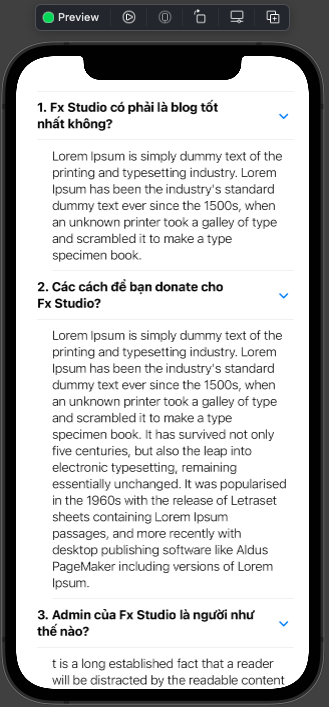
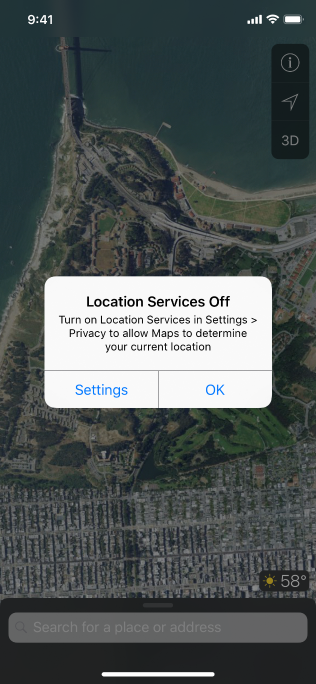
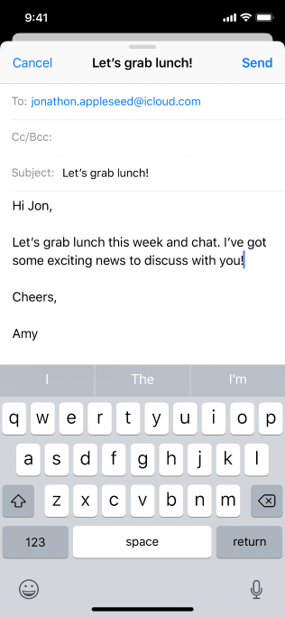
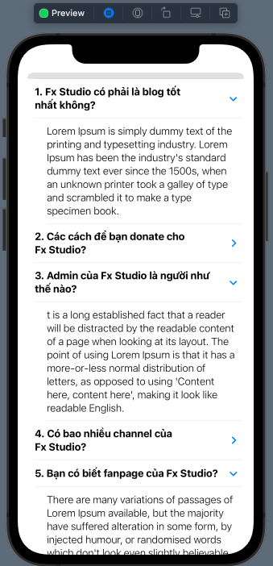
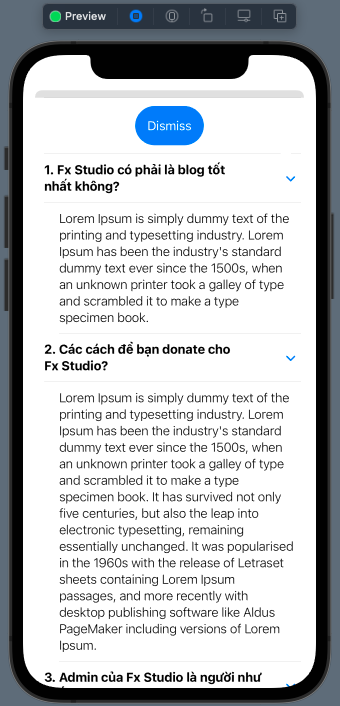
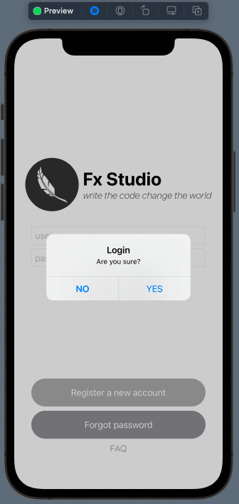
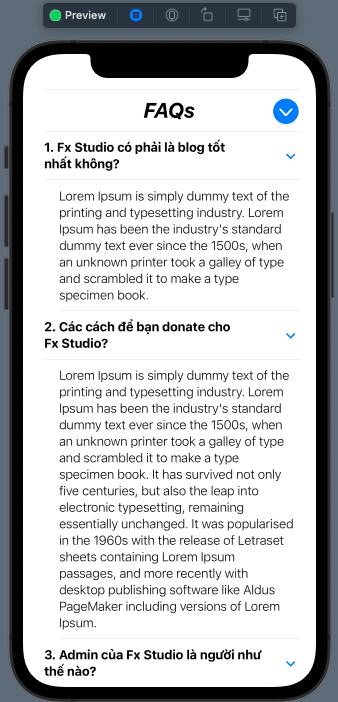

# 03 - Modal View & Alert

Chào mừng bạn đến với **Fx Studio**. Chúng ta tiếp tục với hành trình bất tận cùng với series **SwiftUI** này. Chủ đề bài viết này là **Modal View & Alert**, một cách điều hướng khác với **NaviagtionView**.

Nếu bạn chưa biết gì về NavigationView thì có thể tìm đọc các bài viết trước của repo.

Còn nếu mọi việc đã ổn rồi, thì ...

> Bắt đầu thôi!

## Chuẩn bị

Về mặt tool và version, các bạn tham khảo như sau:

- SwiftUI 2.0
- Xcode 12

Về mặt kiến thức, bạn cần biết trước các kiến thức cơ bản với SwiftUI & SwiftUI App. Tham khảo các bài viết sau, nếu bạn chưa đọc qua SwiftUI:

- [Làm quen với SwiftUI](https://fxstudio.dev/swiftui-phan-1-lam-quen-voi-swiftui/)
- [Cơ bản về ứng dụng SwiftUI App](https://fxstudio.dev/swiftui-phan-2-co-ban-ve-ung-dung-swiftui-app/)

*(Mặc định, mình xem như bạn đã biết về cách tạo project với SwiftUI & SwiftUI App rồi.)*

## Setup Views

Tại bài viết trước, chúng ta đã làm việc với **Login Flow**. Và ta lại sử dụng chúng cho demo của bài viết này. Bài toán của chúng ta sẽ là hiển thị một View cho các câu hỏi điều khoản trong chương trình. Đặt tên là **FAQView**.

Cách hiển thị của **FAQView** thì sẽ từ dưới lên trên. Hay còn gọi là `present` hoặc `modal`. Nhưng trước tiên, bạn có thể xem qua code của **FAQView** để tham khảo.

```swift
struct FAQView: View {
    @State var items = FAQItem.dummyData()
    
    var body: some View {
        List {
            ForEach(0..<items.count) { index in
                DisclosureGroup(
                    isExpanded: $items[index].showContent,
                    content: {
                        Text(items[index].answer)
                            .font(.body)
                            .fontWeight(.light)
                    },
                    label: {
                        Text("\(index + 1). \(items[index].question)")
                            .font(.body)
                            .fontWeight(.bold)
                    })
            }
        }
        .listStyle(InsetListStyle())
    }
}
```

Trong đó, dữ liệu cho **FAQView** là 1 mãng **FAQItem**. Bạn có thể tham khảo qua đọc code sau:

```swift
struct FAQItem: Identifiable {
    var id = UUID()
    var question: String
    var answer: String
    var showContent = true
}

extension FAQItem {
    static func dummyData() -> [FAQItem] {
        return [FAQItem(question: "Fx Studio có phải là blog tốt nhất không?", answer: "Lorem Ipsum is simply dummy text of the printing and typesetting industry. Lorem Ipsum has been the industry's standard dummy text ever since the 1500s, when an unknown printer took a galley of type and scrambled it to make a type specimen book."),
                FAQItem(question: "Các cách để bạn donate cho Fx Studio?", answer: "Lorem Ipsum is simply dummy text of the printing and typesetting industry. Lorem Ipsum has been the industry's standard dummy text ever since the 1500s, when an unknown printer took a galley of type and scrambled it to make a type specimen book. It has survived not only five centuries, but also the leap into electronic typesetting, remaining essentially unchanged. It was popularised in the 1960s with the release of Letraset sheets containing Lorem Ipsum passages, and more recently with desktop publishing software like Aldus PageMaker including versions of Lorem Ipsum."),
                FAQItem(question: "Admin của Fx Studio là người như thế nào?", answer: "t is a long established fact that a reader will be distracted by the readable content of a page when looking at its layout. The point of using Lorem Ipsum is that it has a more-or-less normal distribution of letters, as opposed to using 'Content here, content here', making it look like readable English. "),
                FAQItem(question: "Có bao nhiều channel của Fx Studio?", answer: "Contrary to popular belief, Lorem Ipsum is not simply random text. It has roots in a piece of classical Latin literature from 45 BC, making it over 2000 years old. "),
                FAQItem(question: "Bạn có biết fanpage của Fx Studio?", answer: "There are many variations of passages of Lorem Ipsum available, but the majority have suffered alteration in some form, by injected humour, or randomised words which don't look even slightly believable."),
                FAQItem(question: "Đâu là nơi bạn có thể học Combine & SwiftUI tốt nhất?", answer: "Lorem ipsum dolor sit amet, consectetur adipiscing elit, sed do eiusmod tempor incididunt ut labore et dolore magna aliqua. Ut enim ad minim veniam, quis nostrud exercitation ullamco laboris nisi ut aliquip ex ea commodo consequat."),
                FAQItem(question: "Bạn có thể gởi câu hỏi thông qua các hình thức nào?", answer: "At vero eos et accusamus et iusto odio dignissimos ducimus qui blanditiis praesentium voluptatum deleniti atque corrupti quos dolores et quas molestias excepturi sint occaecati cupiditate non provident, similique sunt in culpa qui officia deserunt mollitia animi, id est laborum et dolorum fuga. Et harum quidem rerum facilis est et expedita distinctio. "),
                FAQItem(question: "Làm thế nào subscribe website?", answer: "On the other hand, we denounce with righteous indignation and dislike men who are so beguiled and demoralized by the charms of pleasure of the moment, so blinded by desire, that they cannot foresee the pain and trouble that are bound to ensue; and equal blame belongs to those who fail in their duty through weakness of will, which is the same as saying through shrinking from toil and pain. "),
                FAQItem(question: "RxSwift có thực sự tốt không?", answer: "Duis aute irure dolor in reprehenderit in voluptate velit esse cillum dolore eu fugiat nulla pariatur. Excepteur sint occaecat cupidatat non proident, sunt in culpa qui officia deserunt mollit anim id est laborum."),
                FAQItem(question: "Tương lại của lập trình iOS sẽ như thế nào?", answer: "Nor again is there anyone who loves or pursues or desires to obtain pain of itself, because it is pain, but because occasionally circumstances occur in which toil and pain can procure him some great pleasure. ")]
    }
}
```

Kết quả ban đầu trông như sau:



## Modality

**Modality** là kỹ thuật thiết kế trình bày nội dung ở chế độ tạm thời tách biệt với ngữ cảnh hiện tại trước đó của người dùng và yêu cầu hành động rõ ràng để thoát. Trình bày nội dung theo phương thức có thể:

* Giúp mọi người tập trung vào một nhiệm vụ khép kín hoặc tập hợp các tùy chọn có liên quan chặt chẽ
* Đảm bảo rằng mọi người nhận được và nếu cần thiết, hành động dựa trên thông tin quan trọng

Các loại Modality trong iOS cung cấp như là: *Alert, Modal View,  Activity View (hay Share sheets) & Action Sheets*.

Chúng ta sẽ tập trung vào 2 loại chính thôi.

* Alert



* Modal View



 Bạn sẽ tìm hiểu & học cách sử dụng chúng qua các phần dưới đây.

## Modal View

Đây là một hiển thị cũng khá là quen thuộc trong iOS. Khi View sẽ được hiển thị từ dưới lên trên. Nó sẽ phủ toàn bộ màn hình (full screen) hoặc chừa lại một phần màn hình. Nhằm giúp cho người dùng có thể chạm và kéo nó xuống để ẩn đi (dismiss).

### Sheet

Việc hiển thị này giống như 1 thẻ (card) được xếp chồng lên Content View hiện tại của bạn. Hay còn gọi là **sheet presentation**. Và bạn sẽ dùng **modifier** `.sheet` để đưa nội dung cần hiển thị trên.

```swift
.sheet(isPresented: $showModal) {
    DetailView()
}
```

Tham số `isPresented` sẽ được ràng buộc với một **State**. Khi giá trị của thuộc tính State là `true` thì **DetaiView** sẽ được xuất hiện.

### Present View

Bạn đã có *View* làm demo & *modifier* giúp hiển thị rồi. Bắt tay vào việc thôi. Trước tiên ta sẽ sử dụng lại **LoginView** (ở bài viết trước), thêm một thuộc tính **State** để quản lý việc hiện thị *Modal View* của nó.

```swift
@State var isPresent = false
```

Tiếp theo, bạn lại cần cái cớ để hiển thị Modal View nhéo. Ta sẽ thêm một Button đơn giản như sau:

```swift
                    Button {
                        isPresent = true
                    } label: {
                        Text("FAQ")
                    }
                    .buttonStyle(DefaultButtonStyle())
```

Trong đó:

* Tại `action` của Button, ta sẽ xét lại giá trị thuộc tính `isPresent = true`
* Còn lại tuỳ ý bạn sử dụng nó với giao diện như thế nào và đặt ở đâu

Cuối cùng, bạn sẽ cài đặt modifier `.sheet` cho phù hợp. Bạn tham khảo nhoé.

```swift
        NavigationView {
            VStack {
               // ....
            }
            .sheet(isPresented: $isPresent) {
                // dismis
            } content: {
                // content
                FAQView()
            }
        }
```

Trong đó:

* `.sheet` sẽ sử dụng trong **NaviagtionView** và cho View con của nó.
* Trong trường hợp này thì chính là **VStack** của bạn
* Bạn sẽ truyền `$isPresent` cho tham số `isPresented`
* `dismiss` thì sử dụng khi bạn muốn làm gì sau khi Modal View bị ẩn đi
* `content` chính là nội dung ta cần hiển thị.

Bấm **Live Preview** và test lại nhoé.



### Present with Optional Binding

Bạn còn 1 cách nữa để hiển thị một Modal View với một giá trị **Optional Binding**. Đó là sử dụng modifier `.sheet` với tham số `item` thay cho `isPresented`. 

Ví dụ như:

```swift
.sheet(item: self.$selectedArticle) { article in
    ArticleDetailView(article: article)
}
```

Với cách này, bạn cần khai báo thêm 1 biến `selectedArticle` là một kiểu **Optional**. Khi nó được gán giá trị thì với Binding ràng buộc với `sheet`, sẽ tự động kích hoạt *content view* hiển thị.

Cách dùng này sẽ được sử dụng nhiều với **List**. Khi bạn muốn dữ liệu của **Modal View** của bạn là dữ liệu động.

*(Mình không demo cách này & bạn tự xử nhoé!)*

### Dismiss View

Hiển thị được rồi, chúng ta sẽ tìm cách ẩn chúng đi nhoé. Và ta cũng có 2 cách luôn à. Bạn sẽ tìm hiểu lần lượt như sau.

#### Environment

Tại View content của Modal View là FAQView, chúng ta sẽ thêm một thuộc tính với kiểu là `@Environment` nhoé.

```swift
@Environment(\.presentationMode) var presentationMode
```

`presentationMode` sẽ quản lý việc present của Modal View. Cách này bạn dùng với iOS 14.0 trở xuống. 

> Và với iOS 15 thì chúng ta có một `keypath` đơn giản hơn là `\.dismiss`. 

Vì khi bạn muốn `dismiss` với `presentationMode` thì sẽ như thế này.

```swift
presentationMode.wrappedValue.dismiss()
```

Bạn phải dùng tới `wrappedValue` của nó. Nhìn hơi xấu nhĩ. Còn tiếp theo, bạn sẽ làm thêm 1 Button nhằm để làm sự kiện cho việc `dismiss` nhoé. Tham khảo code sau:

```swift
        List {
            Section {
                VStack(alignment: .center) {
                    Button {
                        presentationMode.wrappedValue.dismiss()
                    } label: {
                        Text("Dismiss")
                    }
                    .buttonStyle(BlueButton())
                }
                .frame(maxWidth: .infinity)
            }
						
						// ....
        }
```

Không biết nhét ở đâu nên mình sẽ tạo 1 **Button** và nhét vào **Section** cho **List**. Quan trọng tại `action` của Button là nơi bạn gọi `presentationMode.wrappedValue.dismiss()` để ẩn đi Modal View.

Bấn Live Preview và test nhoé!



#### Binding

Cách thứ 2, bạn sẽ tác động tới thuộc tính **State** từ View khác. Chính xác đó là bạn sử dụng thuộc tình **Binding** tại Modal View nhằm thay đổi giá trị của **State**. Và theo nguyên tắc **The single source of truth** thì sẽ lôi được Modal View xuống thôi. Khá là EZ!

Đầu tiên, bạn cần khai báo thêm một thuộc tính tại **Modal View** như sau:

```swift
@Binding var isPresent: Bool
```

Cập nhật lại Button nữa.

```swift
                    Button {
                        //presentationMode.wrappedValue.dismiss()
                        isPresent = false
                    } label: {
                        Text("Dismiss")
                    }
                    .buttonStyle(BlueButton())
```

Thay thế cách dùng `presentationMode` bằng việc xét lại giá trị cho `isPresent = false` là xong.

Cuối cùng, bạn cập nhật lại ở **LoginView** với khởi tạo **FAQView** với tham số `isPresent` nhoé.

```swift
            .sheet(isPresented: $isPresent) {
                // dismis
            } content: {
                // content
                FAQView(isPresent: $isPresent)
            }
```

Bấm **Live Preview** và tiếp tục test nha.

## Float Button for Dismiss

Ta sẽ cải thiện tiếp giao diện cho *Modal View*, vì với *FAQView* kìa thì quá xấu rồi. Bên cạnh đó ta sẽ tạo ra một Button lơ lững (*Float Button*).

* Tạo lại `title` cho **Section**

```swift
            Section {
                VStack(alignment: .center) {
                    Text("FAQs")
                        .font(.title)
                        .fontWeight(.bold)
                        .italic()
                        .frame(maxWidth: .infinity)
                }
                
            }
```

* Tạo **Float Button**

```swift
        List {
            // ...
        }
        .listStyle(InsetListStyle())
        .overlay(
            HStack {
                    Spacer()

                    VStack {
                        Button(action: {
                            self.presentationMode.wrappedValue.dismiss()
                        }, label: {
                            Image(systemName: "chevron.down.circle.fill")
                                .font(.largeTitle)
                                .foregroundColor(.accentColor)
                        })
                        .padding(.trailing, 20)
                        .padding(.top, 10)

                        Spacer()
                    }
                }
            )
```

Trong đó:

* **Float Button** sẽ ở tại 1 vị trí và không bị ảnh hưởng khi scroll. Do đó, ta lợi dụng `overlay` của View
* Để xác định vị trí, bạn sử dụng các thuộc tính `.padding`

Ta sẽ dùng lại các cách `dismiss` như ở trên, tại `action` của Button. Trong ví dụ trên mình sử dụng `self.presentationMode.wrappedValue.dismiss()`.

Bạn bấm Live Prevew và test lại nhoé!


## Alert

Chúng ta tiếp tục với View đại diện thứ 2, đó là **Alert**. Về ngữ nghĩa thì nó cũng tương tự như Modal View. Nhưng nó sẽ block giao diện xung quanh nó. Nội dung sẽ được hiển thị trong một hộp thoại (**dialog**). Và mục đích của Alert là sẽ cảnh báo hay truyền một thông điệp cho người dùng biết.

### Create

Cú pháp của một Alert thì khá đơn giản. Ví dụ như sau:

```swift
Alert(title: Text("Warning"), 
      message: Text("Are you sure you want to leave?"), 
      primaryButton: .default(Text("Confirm")), 
      secondaryButton: .cancel()
     )
```

Trong đó:

* Các tham số `title` & `message` là kiểu String và thông điệp bạn muốn truyền vào
* Chúng ta sẽ có các button đi kèm `primaryButton` hay `secondaryButton`
* Với `.cancel()` sẽ làm Alert mất đi

Khi bạn muốn có thêm `action` cho các Button thì có thể thêm tham số của các button đó. Ví dụ:

```swift
.default(Text("YES"), action: { })
```

Hoặc bạn có thể custom lại nội dung của các Button, cho dù là mặc định. Ví dụ cho `.cancel()`

```swift
.cancel(Text("NO")
```

### Show Alert

Tới công việc chính nào. Alert thì ta đã tạo ra sẵn rồi. Còn để hiển thị nó thì bạn cần gọi tới modifier `.alert`. Ta sẽ ráp nó vào trong **LoginView** nhoé.

````swift
            .alert(isPresented: $isAlert) {
                Alert(title: Text("Login"),
                      message: Text("Are you sure?"),
                      primaryButton: .default(Text("YES"), action: {
                        isAlert = false
                      }),
                      secondaryButton: .cancel(Text("NO"))
                )
            }
````

Trong đó:

* Bạn sử dụng modifier vào View gốc của LoginView nhoé
* Chúng sẽ cần ràng buộc với một thuộc tính **@State** là `isAlert`
* Với `action` của Button, ta xét lại `isAlert = false`

Do đó, bạn cần khai báo thêm một thuộc tính nữa cho View của bạn, chính là `isAlert` là kiểu **State**.

```swift
    @State var isAlert = false
```

Cuối cùng, bạn sẽ phải tìm một cái cớ để hiển thị **Alert** của mình lên. Ví dụ mình chọn nút **Login** trên giao diện. Và cách hiển thị lên cũng đơn giản, xét lại giá trị `isAlert = true` thôi.

````swift
Button {
   isAlert = true
} label: {
   Text("Login")
}
.buttonStyle(BlueButton())
````

Bấm Live Preview và cảm nhận kết quả nhoé!



## Full Screen Modal View

Cuối cùng, là cách bạn sẽ hiển thị **Modal View** full màn hình. Với trạng thái full màn hình thì bạn không thể dùng tay để kéo Modal View mất đi được. 

> Nó là cách mà `modal` ở các iOS trước iOS 14 hiển thị.

Bạn sẽ không cần phải tuỳ chính nhiều thứ. Bạn sẽ thay modifier `.sheet` thành `.fullScreenCover` là được.

````swift
.fullScreenCover(isPresented: $isPresent) {
   // dismis
} content: {
   // content
   FAQView(isPresent: $isPresent)
}
````

Bấm **Live Preview** và test lại nhoé!



Mọi thứ vẫn hoạt động bình thường và Modal View đã full màn hình. Nhìn đẹp hơn rồi!

## Tạm kết

* Tìm hiểu về 2 loại Modality là Modal View & Alert
* Các cách hiển thị và ẩn một Modal View
* Cách hiển thị full màn hình với Modal View
* Xử lý Alert và hiển thị Alert lên giao diện

---

Cảm ơn bạn đã theo dõi các bài viết từ **Fx Studio** & hãy truy cập [website](https://fxstudio.dev/) để cập nhật nhiều hơn
