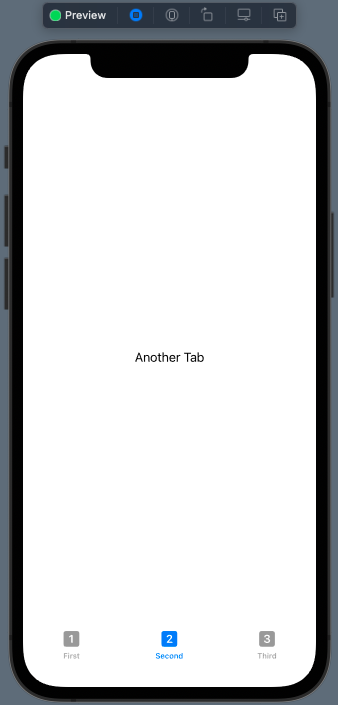
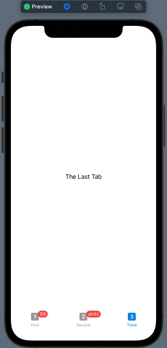
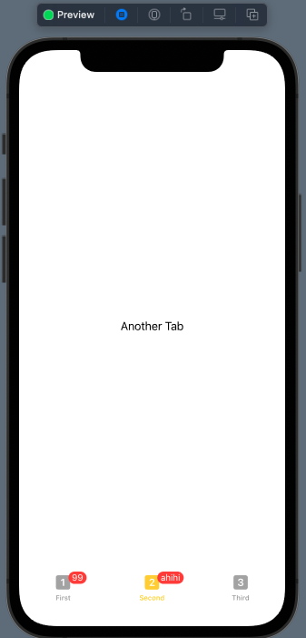
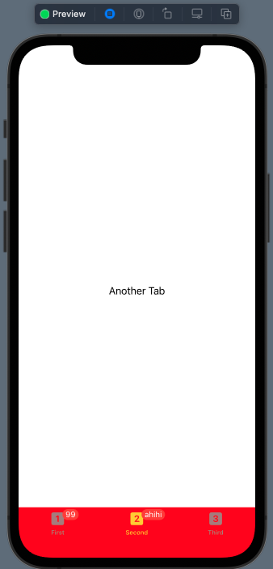
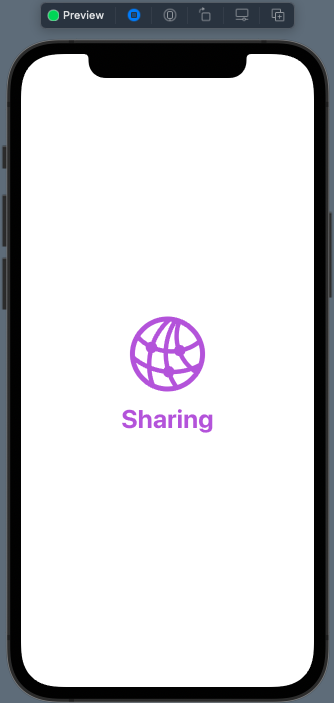
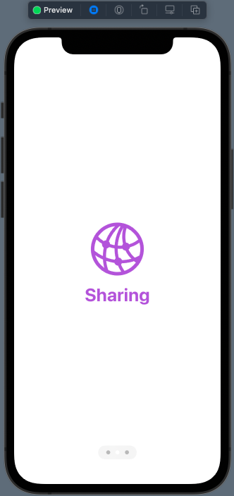
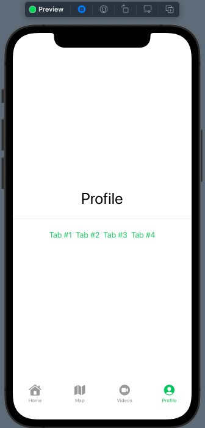

# 04 - TabView & PageView

Chào mừng bạn đến với **Fx Studio**. Chúng ta tiếp tục hành trình bất tận với **SwiftUI** và chủ đề bài viết này vẫn là điều hướng trong *SwiftUI*. Đối tượng lần này là **TabView**. Nó là gì và hoạt động ra sao, thì chúng ta cùng nhau tìm hiểu trong bài viết này nhoé!

Nếu mọi việc đã ổn rồi, thì ...

> Bắt đầu thôi!

## Chuẩn bị

Về mặt tool và version, các bạn tham khảo như sau:

- SwiftUI 2.0
- Xcode 12

Về mặt kiến thức, bạn cần biết trước các kiến thức cơ bản với SwiftUI & SwiftUI App. Tham khảo các bài viết sau, nếu bạn chưa đọc qua SwiftUI:

- [Làm quen với SwiftUI](https://fxstudio.dev/swiftui-phan-1-lam-quen-voi-swiftui/)
- [Cơ bản về ứng dụng SwiftUI App](https://fxstudio.dev/swiftui-phan-2-co-ban-ve-ung-dung-swiftui-app/)

*(Mặc định, mình xem như bạn đã biết về cách tạo project với SwiftUI & SwiftUI App rồi.)*

## TabView

**TabView** là một *SwiftUI View* với cấu tạo tương tự như *UITabbarController* của *UIKit*. Cung cấp chọn bạn một giao diện với nhiều màn hình. Các màn hình sẽ ở từng **tab** và chuyển đổi qua lại giữa các tab để hiển thị các màn hình đó. Đi kèm với bộ cục giao diện như vậy, thì chúng ta có điều hướng đặc trưng của **TabView** là chuyển đổi qua lại ngang cấp giữa các chức năng.

### Create a TabView

Bắt đầu, chúng ta sẽ tìm hiểu việc tạo một TabView thì như thế nào nhoé. Bạn tham khảo đoạn code sau đây để tạo 1 TabView.

```swift
        TabView {
            Text("The First Tab")
                .tabItem {
                    Image(systemName: "1.square.fill")
                    Text("First")
                }
            Text("Another Tab")
                .tabItem {
                    Image(systemName: "2.square.fill")
                    Text("Second")
                }
            Text("The Last Tab")
                .tabItem {
                    Image(systemName: "3.square.fill")
                    Text("Third")
                }
        }
```

Trong đó, bạn sẽ thấy 2 thành phần quan trọng:

* **TabView** chính là đối tượng chúng ta cần để hiển thị
* Trong TabView chúng ta có các **View con** của nó. Số lượng các View con sẽ là số lượng **tab** của TabView
* Tại mỗi View con, bạn thêm **modifier** `.tabItem`. Đây chính là **Tab bar Item** tronng TabView.

Bạn thử bấm **Live Preview** và cảm nhận kết quả nha!



### Tab Item

Các **Tab Item** sẽ đi kèm với các View. Nó được tạo ra bằng việc sử dụng modifier `.tabItem`. Trong ví dụ code trên như sau:

```swift
                .tabItem {
                    Image(systemName: "2.square.fill")
                    Text("Second")
                }
```

Tạo nên mỗi Tab item thì bạn có 2 phần:

* **Image** chính là icon của Tab item
* **Text** chính là lable hay title của Tab item

Có thể có 1 trong 2 cái vẫn được hoặc cả hai. Với mỗi Tab được chọn, thì Tab Item của nó sẽ được đổi màu sang trạng thái `selected`.

### Badge

Đây là tính năng được thêm vào trong **iOS 15**, bạn sử dụng modifier `.badge` để hiển thị một **Badge Number** cho các **Tab Item**. Với Badge, bạn sẽ dùng nhiều trong việc hiển thị các thông tin từ notification hoặc muốn cho người dùng chú ý tới.

Bạn xem ví dụ code sau:

```swift
        TabView {
            Text("The First Tab")
                .tabItem {
                    Image(systemName: "1.square.fill")
                    Text("First")
                }
                .badge(99)
            Text("Another Tab")
                .tabItem {
                    Image(systemName: "2.square.fill")
                    Text("Second")
                }
                .badge("ahihi")
            Text("The Last Tab")
                .tabItem {
                    Image(systemName: "3.square.fill")
                    Text("Third")
                }
        }
```

Bạn sẽ để ý là `.badge` sẽ nhận được 2 giá trị với 2 kiểu dữ liệu là **Int** hoặc **String**. Bạn bấm Resume và xem kết quả nhoé!



### accentColor

Mặc định khi bạn chọn các Tab Item thì nó sẽ được hiển thị với màu xanh. Để thay đổi màu này bạn sẽ cần sử dụng modifier `.accentColor` và truyền tham số màu. Bạn xem qua code Ví dụ sau nhoé!

```swift
        TabView {
					// ...
        }
        .onAppear() {
            UITabBar.appearance().barTintColor = .yellow
        }
        .accentColor(.yellow)
```

Trong ví dụ có trên thì đâu có có bạn sẽ sử dụng `UITabBar.appearance()`. Tuy nhiên, với vài cách custom thì SwiftUI sẽ không hiển thị, trong đó có `accentColor` hay `barTintColor` này. Bấm Resume và cảm nhận kết quả nhoé.



### Tabbar appearance

Cũng tương tự với việc custom NavigationBar, thì Tabbar cũng sử dụng cách tương tự. Ví dụ code như sau:

```swift
        .onAppear() {
            UITabBar.appearance().barTintColor = .yellow
            UITabBar.appearance().backgroundColor = UIColor.red
        }
```

Bạn có thể lợi dùng `.onAppear` hoặc hàm `init` để tạo **appearance** và custom các thuộc tính cho Tabbar. Còn trong ví dụ mình chỉ thay đổi giá trị `backgroudColor` mà thôi.



## Hiding the Tab Bar in a Navigation View

Bạn thử nghĩ sẽ ra sao khi chúng ta đưa **TabView** vào trong **NaviagtionView**.

```swift
NavigationView {
    TabView(selection: $selection) {
        // ....
    }
    .navigationTitle("TabView Demo")
}
```

Đúng là với SwiftUI, thì mọi thứ đều có thể xảy ra. Với cách bố cục layout như thế này thì chúng ta sẽ được một kết quả khá là bất ngờ.

```swift
        NavigationView {
            TabView {
                List {
                    ForEach(1...10, id: \.self) { index in
                        NavigationLink(destination: Text("Item #\(index)")) {
                            Text("Item #\(index)")
                        }
                    }
                }
                    .tabItem {
                        Image(systemName: "1.square.fill")
                        Text("First")
                    }
                    .badge(99)
                Text("Another Tab")
                    .tabItem {
                        Image(systemName: "2.square.fill")
                        Text("Second")
                    }
                    .badge("ahihi")
                Text("The Last Tab")
                    .tabItem {
                        Image(systemName: "3.square.fill")
                        Text("Third")
                    }
            }
            .onAppear() {
                UITabBar.appearance().barTintColor = .yellow
                //UITabBar.appearance().backgroundColor = UIColor.red
            }
            .accentColor(.yellow)
            .navigationTitle("TabView Demo")
        }
```

Trong đó:

* Tại một View con của **TabView**. Ta tạo một danh sách **List**
* Khi bạn dùng **NavigationLink** để điều hướng sang màn hình **Detail**, thì sẽ ẩn đi Tabbar

Vì ta đang sử dụng **NavigationView** là `root` của toàn bộ cấu trúc. Do đó, nó sẽ điều hướng một View mới đè lên toàn bộ **TabView**. Trải nghiệm lúc này thì bạn sẽ ẩn đi được **Tabbar** rồi. Tuy nhiên ....

> Bạn nên cẩn thận khi thiết kế bố cục các View trong SwiftUI nhoé!

## PageView

Với **TabView**, ta còn một cách điều hướng nữa. Đó chính là bạn scroll từ View ngang qua. Nó khá là giống với **PageView** bên **UIKit**. Và bạn có thể lợi dụng nó để thiết kế giao diện cho riêng bạn, với dữ liệu theo từng page nhoé.

### Create a PageView

Ta sẽ bắt đầu với một **PageView** đơn giản. Bạn đặt tên cho View mới này là **TutorialView** nhoé và xem code tham khảo như sau:

```swift
        TabView {
            VStack {
                Image(systemName: "chevron.left.slash.chevron.right")
                    .resizable()
                    .foregroundColor(Color.purple)
                    .frame(maxWidth: 100.0, maxHeight: 100.0)
                Text("Coding")
                    .font(.largeTitle)
                    .fontWeight(.bold)
                    .foregroundColor(Color.purple)
            }
            VStack {
                Image(systemName: "network")
                    .resizable()
                    .foregroundColor(Color.purple)
                    .frame(maxWidth: 100.0, maxHeight: 100.0)
                Text("Sharing")
                    .font(.largeTitle)
                    .fontWeight(.bold)
                    .foregroundColor(Color.purple)
            }
            VStack {
                Image(systemName: "heart.circle.fill")
                    .resizable()
                    .foregroundColor(Color.purple)
                    .frame(maxWidth: 100.0, maxHeight: 100.0)
                Text("Relax")
                    .font(.largeTitle)
                    .fontWeight(.bold)
                    .foregroundColor(Color.purple)
            }
        }
        .tabViewStyle(.page)
```

Trong đó, vẫn là cấu trúc với TabView như trên. Nhưng ta sẽ sử dụng tới modifier `.tabViewStyle`. Với giá trị truyền vào là `.page`.

Bấm Live Preview và bạn thử scroll ngang qua nhoé!



Với chế độ style là `.page` thì phần **Tabbar** & **Tab item** sẽ không xuất hiện. Người sẽ phải điều hướng bằng cách scroll.

### Index

Với kiểu giao diện như thế này, đôi khi bạn sẽ không biết được rằng mình đang ở Page thứ mấy. Do đó, bạn cần thêm một việc nữa là hiển thị `index` cho từng page.

Chúng ta sẽ dùng tới modifier `.indexViewStyle` như sau:

```swift
        TabView {
           // ....
        }
        .tabViewStyle(.page)
        .indexViewStyle(.page(backgroundDisplayMode: .always))
```

Tham số cần truyền vào là `.page(backgroundDisplayMode: .always)` thì phần giao diện giống như PageControl sẽ hiện ra. Khi chúng ta scroll sang một page khác thì nó sẽ thay đổi index.



## Change Tab

Phần cuối, ta sẽ tìm hiểu cách thay đổi các Tab hiển thị, tất nhiên là không sử dụng việc người dùng kích chọn ở Tabbar nhoé. Để nâng độ khó thì chúng ta sẽ tạo các View riêng lẻ từ bên ngoài cho các Tab.

* Các view riêng lẻ như sau.

```swift
// Home
struct HomeView: View {
    var body: some View {
        Text("Home")
            .font(.largeTitle)
    }
}

// Map
struct MapView: View {
    var body: some View {
        Text("Map")
            .font(.largeTitle)
    }
}

// Videos
struct VideosView: View {
    var body: some View {
        Text("Videos")
            .font(.largeTitle)
    }
}

// Profile
struct ProfileView: View {
    var body: some View {
        Text("Profile")
            .font(.largeTitle)
    }
}
```

* Tạo một TabView mới với các View con là các View ở trên nhoé

```swift
struct MyTabView: View {
    var body: some View {
        TabView {
            HomeView()
                .tabItem {
                    Image(systemName: "house.fill")
                    Text("Home")
                }
                .tag(0)
            MapView()
                .tabItem {
                    Image(systemName: "map.fill")
                    Text("Map")
                }
                .tag(1)
            VideosView()
                .tabItem {
                    Image(systemName: "video.circle.fill")
                    Text("Videos")
                }
                .tag(2)
            ProfileView()
                .tabItem {
                    Image(systemName: "person.crop.circle")
                    Text("Profile")
                }
                .tag(3)
        }
        .accentColor(.green)
    }
}
```

Có một điểm đặc biệt là ta sẽ sử dụng modifier `.tag` để đánh dấu các **Tab** trong **TabView**.

### Binding

Được xem là cách truyền thống trong SwiftUI với **The single source of truth**. Bạn cần tạo ra một biến **State** để quản lý việc hiển thị của Tabbar. Từ đó chúng ta sẽ tiến hành thay đổi giá trị của chúng.

Đầu tiên, ta sẽ thêm một thuộc tính **State** cho **TabView**.

```swift
@State var selection = 0
```

Tiếp theo, bạn sẽ thêm tham số cho việc khởi tạo **TabView**. Bạn truyền thuộc tính `$selection` cho tham số `selection` của **TabView**. Tham khảo code ở dưới.

```swift
TabView(selection: $selection) {
            HomeView()
                .tabItem {
                    Image(systemName: "house.fill")
                    Text("Home")
                }
                .tag(0)
            MapView()
                .tabItem {
                    Image(systemName: "map.fill")
                    Text("Map")
                }
                .tag(1)
            VideosView()
                .tabItem {
                    Image(systemName: "video.circle.fill")
                    Text("Videos")
                }
                .tag(2)
            ProfileView()
                .tabItem {
                    Image(systemName: "person.crop.circle")
                    Text("Profile")
                }
                .tag(3)
        }
        .accentColor(.green)
```

Tại các View, bạn tiến hành thêm thuộc tính **Binding** để ràng buộc dữ liệu với `selection`. Và mình sẽ tạo thêm các Button để thực hiện việc đổi Tab từ các View con đó. Bạn tham khảo **HomeView** và áp dụng hết cho các View còn lại nhoé.

````swift
struct HomeView: View {
    @Binding var selection: Int
    
    var body: some View {
        VStack {
            Text("Home")
                .font(.largeTitle)
            Divider()
            HStack {
                Button {
                    selection = 0
                } label: { Text("Tab #1")  }

                Button {
                    selection = 1
                } label: { Text("Tab #2") }
                
                Button {
                    selection = 2
                } label: { Text("Tab #3") }
                
                Button {
                    selection = 3
                } label: { Text("Tab #4") }
            }
            .padding()
        }
    }
}
````

Cuối cùng, bạn cập nhật lại các hàm khởi tạo các View con trong **TabView** nhoé.

```swift
        TabView(selection: $selection) {
            HomeView(selection: $selection)
                .tabItem {
                    Image(systemName: "house.fill")
                    Text("Home")
                }
                .tag(0)
            MapView(selection: $selection)
                .tabItem {
                    Image(systemName: "map.fill")
                    Text("Map")
                }
                .tag(1)
            VideosView(selection: $selection)
                .tabItem {
                    Image(systemName: "video.circle.fill")
                    Text("Videos")
                }
                .tag(2)
            ProfileView(selection: $selection)
                .tabItem {
                    Image(systemName: "person.crop.circle")
                    Text("Profile")
                }
                .tag(3)
        }
        .accentColor(.green)
```

Mọi thứ đã ổn rồi, bạn Live Preview và test lại nha.



### @SceneStorage

Bạn sẽ dùng tới một đối tượng tương tự như với **@State**. Đó là **@SceneStorage**, nó vừa có khả năng như một **State** và vừa có thể **lưu trữ ngắn hạn** giá trị trong phạm vi của **Scene**.

> Mỗi khi bạn build lại ứng dụng thì sẽ sẽ mất đi và cập nhật lại từ đầu. Nên hoàn toàn thích hợp trong hoàn cảnh này.

Tại sao phải sử dụng tới **@SceneStorage** làm gì? Vì:

* Bạn sẽ không cần phải lúc nào cũng truyền các thuộc tính **State** đi khắp các View.
* Nó giống như một phiên bản Singleton mà bạn có thể triệu hồi ở bất kì đâu trong toàn bộ ứng dụng

Về lại với demo, bạn chỉ cần thay khai báo `selection` với kiểu `@State` bằng `@SceneStorage` thôi.

```swift
@SceneStorage("selectedTab") var selection = 0
```

Trong đó, `selectedTab` là `key` của biến `selection` với kiểu `@SceneStorage`. Giúp bạn có thể sử dụng nó ở các View khác. Và cũng cùng thuộc nguyên lý **The single source of truth**, nên lúc này bạn bấm **Live Preview** thì nó vẫn hoạt động.

Tuy nhiên, ta sẽ tuỳ chỉnh một chút ở các View con như sau:

```swift
struct HomeView: View {
    //@Binding var selection: Int
    @SceneStorage("selectedTab") var selection = 0
    
    var body: some View {
        VStack {
            Text("Home")
                .font(.largeTitle)
            Divider()
            HStack {
                Button {
                    selection = 0
                } label: { Text("Tab #1")  }

                Button {
                    selection = 1
                } label: { Text("Tab #2") }
                
                Button {
                    selection = 2
                } label: { Text("Tab #3") }
                
                Button {
                    selection = 3
                } label: { Text("Tab #4") }
            }
            .padding()
        }
    }
}
```

Thay `@Binding` bằng `@SceneStorage` và chú ý đúng `key` là được. Cuối cùng bạn cập nhật lại hàm khởi tạo các View con là ổn.

```swift
        TabView(selection: $selection) {
            HomeView()
                .tabItem {
                    Image(systemName: "house.fill")
                    Text("Home")
                }
                .tag(0)
            MapView()
                .tabItem {
                    Image(systemName: "map.fill")
                    Text("Map")
                }
                .tag(1)
            VideosView()
                .tabItem {
                    Image(systemName: "video.circle.fill")
                    Text("Videos")
                }
                .tag(2)
            ProfileView()
                .tabItem {
                    Image(systemName: "person.crop.circle")
                    Text("Profile")
                }
                .tag(3)
        }
        .accentColor(.green)
```

Code của bạn sẽ trông gọn & đẹp hơn rồi. Bấm **Live Preview** và cảm nhận kết quả nhoé!

## Tạm kết

* Tìm hiểu về TabView và cách điều hướng của nó
* Thực hiện custom và thay đổi các giá trị cơ bản của Tabbar & Tab Item
* Tạo một PageView bằng cách thay đổi style của TabView
* Thay đổi hiện thị của các Tab bằng Binding & SceneStorage

---

Cảm ơn bạn đã theo dõi các bài viết từ **Fx Studio** & hãy truy cập [website](https://fxstudio.dev/) để cập nhật nhiều hơn
