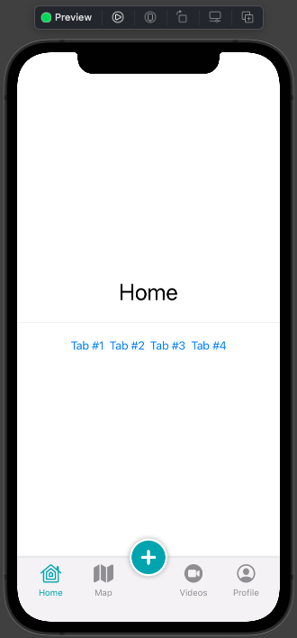
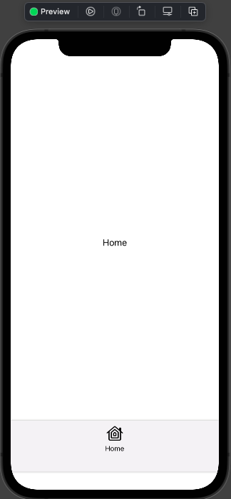
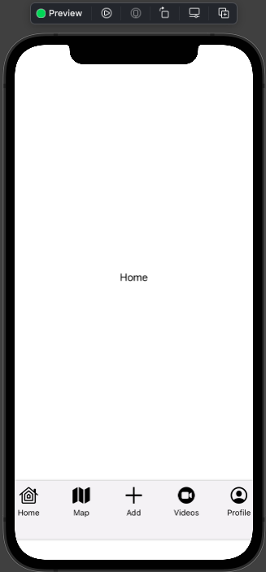
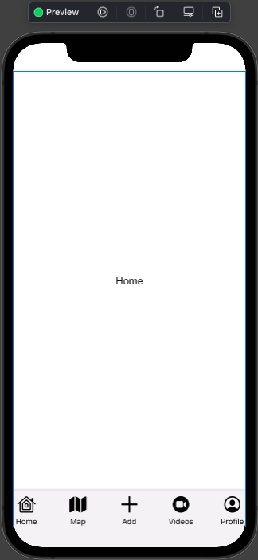
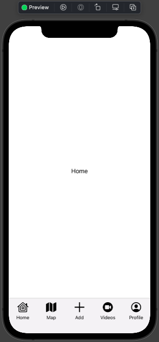
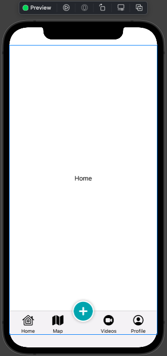
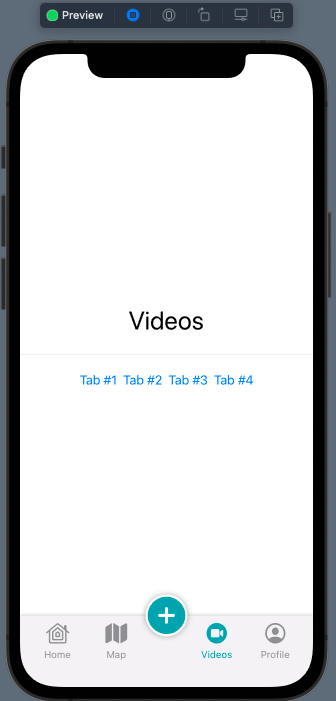
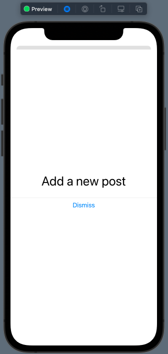

# 05 - Custom TabBar

Chào bạn đến với **Fx Studio**. Chúng ta lại tiếp tục với hành trình bất tận của series **SwiftUI**. Chủ đề bài viết này là **Custom TabBar**. Mặc dù, chúng ta đã tìm hiểu về *TabView* và sử dụng *TabBar* mặc định của SwiftUI cung cấp. Tuy nhiên, với các giao diện phức tạp thì nó lại không đáp ứng được. Và bên cạnh đó, giao diện với một TabBar làm trung tâm cũng khá là phổ biến trong hầu hết các ứng dụng (như: *Youtube, Facebook ...*). Vì vậy,

> Bạn phải custom được một **TabBar** và đầy đủ các tính năng như một *TabView* (hay *UITabbarController* của *UIKit*)

Nếu mọi việc đã ổn rồi, thì ...

> Bắt đầu thôi!

## Chuẩn bị

Về mặt tool và version, các bạn tham khảo như sau:

- SwiftUI 2.0
- Xcode 12

Về mặt kiến thức, bạn cần biết trước các kiến thức cơ bản với SwiftUI & SwiftUI App. Tham khảo các bài viết sau, nếu bạn chưa đọc qua SwiftUI:

- [Làm quen với SwiftUI](https://fxstudio.dev/swiftui-phan-1-lam-quen-voi-swiftui/)
- [Cơ bản về ứng dụng SwiftUI App](https://fxstudio.dev/swiftui-phan-2-co-ban-ve-ung-dung-swiftui-app/)

*(Mặc định, mình xem như bạn đã biết về cách tạo project với SwiftUI & SwiftUI App rồi.)*

## Custom TabBar

Để cho bạn dễ hình dùng thì kết quả cuối cùng của chúng ta sẽ như thế này.



Đây cũng được xem là một **TabBar** điển hình trong mọi ứng dụng. Bạn có thể sử dụng các **Tab** của nó để chuyển đổi sang các màn hình tương ứng. Các *TabItem* vẫn tương tự như *TabItem* của *TabView*, nhằm để tạo một trải nghiệm quen thuộc với người dùng.

Thường sẽ đi kèm với một Button chính giữa. Nó sẽ có một chức năng khác và điều hướng khác so với các TabItem còn lại. Ví dụ, bạn sẽ present một View lên và thực hiện các chứng năng như: *chụp ảnh, record video, post bài viết mới ...*

Cũng như với *UIKit & UITabbarController*, thì tạo được giao diện như trên thì cũng khá là vất vả đó à. Và với SwiftUI thì bạn cũng phải làm được công việc này thôi.

Chúng ta sẽ tiến hành tạo một Custom View theo các phần công việc sau đây. Và bài viết này sẽ tập trung hoàn toàn về thực hành và sẽ không giải thích lý thuyết nhiều. 

## 1. Setup Custom View

### 1.1. Layout

Chúng ta sẽ cần tạo ra một khung chứa với các bố cục layout cơ bản đầu tiên cho **TabBar**. Bạn tạo mới một SwiftUI View và mình tạm đặt tên là **FxTabBar** nhoé. Code ví dụ ban đầu như sau:

```swift
struct FxTabBar: View {
    var body: some View {
        VStack {
            Spacer()
            // Contents
            Text("Home")
            Spacer()
            // Tabbar
        }
    }
}
```

Ta lựa chọn VStack để sắp xếp nội dung theo các dòng. Trong đó, tách biệt ra 2 phần chính:

* **Contents**: chính là phần hiển thị nội dung của các View trong TabBar (như: *HomeView, MapView ...*)
* **TabBar**: sẽ chứa các TabBarItem

Các **Spacer** giúp ép các nội dung đúng với các vị trí mà chúng ta mong muốn. Trong trường hợp này thì **TabBar** sẽ luôn được ở phía dưới cùng của màn hình.

### 1.2. GeometryReader

Chúng ta cần phải biết được kích thước màn hình đang sử dụng để tính toán và bố trí kích thước của các TabBar và cá TabItem. Do đó, bạn sẽ cần sử dụng tới đối tượng **GeometryReader**.

Ta sẽ bọc toàn bộ View lại trong GeometryReader nhoé.

```swift
    var body: some View {
        GeometryReader { geometry in
            VStack {
                Spacer()
                // Contents
                Text("Home")
                Spacer()
                // Tabbar
            }
        }
    }
```

Trong đó, tham số `geometry` sẽ được sử dụng để lấy các kích thước `width` & `height` của màn hình.

## 2. Layout TabBar

Vì bố cục của các TabItem sẽ được xếp hàng ngang với nhau. Do đó, `root` của phần View cho **TabBar** sẽ là một **HStack**. Bạn sẽ thêm tiếp vào phần `//Tabbar` trong đoạn code trên.

```swift
    var body: some View {
        GeometryReader { geometry in
            VStack {
                Spacer()
                // Contents
                Text("Home")
                Spacer()
                // Tabbar
                HStack {
                    
                }
            }
        }
    }
```

Tiếp theo, ta sẽ tính toán và đưa ra kích thước cho phần TabBar, bạn tham khảo tiếp code nhoé.

```swift
HStack {
     
 }
 .frame(width: geometry.size.width, height: geometry.size.height/8)
 .background(Color("TabBarBackground").shadow(radius: 2))
```

Trong đó:

* Sử dụng `geometry` để lấy các kích thước `width` & `height`. Tuỳ ý hoặc theo thiết kế riêng của bản nhoé
* Tạo thêm phần bóng đổ cho tách biệt giữa nội dung và TabBar
* Màu sắc thì bạn sẽ tạo các màu sắc ở `assets` nhoé. Trong ví dụ trên thì mình tạo sẵn một `TabBarBackgroud` rồi

Tiếp theo, ta thử thêm View cho một TabItem xem ra sao, tham khảo đoạn code sau.

```swift
    var body: some View {
        GeometryReader { geometry in
            VStack {
                Spacer()
                // Contents
                Text("Home")
                Spacer()
                // Tabbar
                HStack {
                    // Home TabItem
                    VStack {
                             Image(systemName: "homekit")
                                 .resizable()
                                 .aspectRatio(contentMode: .fit)
                                 .frame(width: geometry.size.width/5, height: geometry.size.height/28)
                                 .padding(.top, 10)
                             Text("Home")
                                 .font(.footnote)
                             Spacer()
                         }
                }
                .frame(width: geometry.size.width, height: geometry.size.height/8)
                .background(Color("TabBarBackground").shadow(radius: 2))
            }
        }
    }
```

Bấm **Resume** và xem kết quả nhoé!



## 3. Create TabItem

Qua trên, ta có một TabItem được viết vào trong cùng với TabBar. Nhưng số lượng code và dòng code nhiều quá. Nếu ta có tới 4 hay 5 TabItem thì quá nhiều code. Vì vậy, cần tách code và tạo một Custom View riêng cho phần này.

Bạn tạo mới một **SwiftUI View** nhoé và đặt tên là **FxTabItem**. Tham khảo code như sau:

```swift
struct FxTabItem: View {
     
     let width, height: CGFloat
     let systemIconName, tabName: String
     
     
     var body: some View {
         VStack {
             Image(systemName: systemIconName)
                 .resizable()
                 .aspectRatio(contentMode: .fit)
                 .frame(width: width, height: height)
                 .padding(.top, 10)
             Text(tabName)
                 .font(.footnote)
             Spacer()
         }
     }
 }
```

Về bản chất thì nó là code phần Item `Home` mà bạn đã thêm ở trên. Chúng ta tách code qua và thêm các thuộc tính cần thiết. Như là `width`, `height`, `systemIconName`, `tabName`.

Bạn sang FxTabBar, tạo một đối tượng FxTabItem thay cho đoạn code dài dòng trên nhoé.

```swift
HStack {
   FxTabItem(width: geometry.size.width/5, height: geometry.size.height/28, systemIconName: "homekit", tabName: "Home")
}
```

Tại sao `width/5` và `height/28` thì chúng ta sẽ sang phần tiếp theo nhoé!

## 4. Add TabItems

### 4.1. Add More Items

Với demo của chúng ta sẽ có tới 4 Tab chính và 1 Push Button. Trước tiên, ta sẽ thêm 5 Item để cho bố cục được ổn định trước nhoé. 

```swift
HStack {
   FxTabItem(width: geometry.size.width/5, height: geometry.size.height/28, systemIconName: "homekit", tabName: "Home")
   FxTabItem(width: geometry.size.width/5, height: geometry.size.height/28, systemIconName: "map.fill", tabName: "Map")
   FxTabItem(width: geometry.size.width/5, height: geometry.size.height/28, systemIconName: "plus", tabName: "Add")
   FxTabItem(width: geometry.size.width/5, height: geometry.size.height/28, systemIconName: "video.circle.fill", tabName: "Videos")
   FxTabItem(width: geometry.size.width/5, height: geometry.size.height/28, systemIconName: "person.crop.circle", tabName: "Profile")
                     
}
```

Bạn có thể tuỳ y với giao diện riêng của bạn nhoé. Sau đó, bạn bấm Resume để xem kết quả như thế nào rồi.



Tới đây bạn sẽ thấy là chúng ta có tổng số items là 5, do đó bạn cần **width** là `geometry.size.width/5`. Còn với height thì tạm thời ta tính là `geometry.size.height/28`.

### 4.2. SafeArea

Bạn cũng để ý ra là có 1 khoảng trắng ở dưới cùng. Nó cách lý **TabBar** chúng ta ra. Đó chính là phần **SafeArea** khả dụng. Nên phần phía dưới và tai thỏ của iPhone thì sẽ không hiển thị được. Nhiệm vụ tiếp theo là bạn sẽ phải thêm modifier để cho View bỏ qua phần phía dưới của **SafeArea** nhoé.

```swift
GeometryReader { geometry in
     VStack {
         //...
     }
     .edgesIgnoringSafeArea(.bottom)
 }
```

Bạn chỉ cần sử dụng modifier `.edgesIgnoringSafeArea(.bottom)` là xong. Và chú ý đặt cho đúng View nào, trong ví dụ của chúng là sẽ là **VStack** con của **GeometryReader**.

Bấm **Resume** và xem kết quá nha.



Nhìn ngon rồi đó nhĩ!

### 4.3. Item padding

Thêm một chút khoản cách cho các **TabItem** ở trong **TabBar** để được đẹp hơn. Vì bạn sẽ thấy chúng nó dính mép với nhau. Tuy cập tới FxTabItem và thêm modifier sau nhoé.

```swift
struct FxTabItem: View {
    //....
    var body: some View {
        VStack {
						//....
        }
        .padding(.horizontal, -4)
    }
}
```

Với `.padding(.horizontal, -4)` SwiftUI sẽ cách đều 2 bên của View. Mọi thứ sẽ trông hài hoà thêm rồi.



## 5. Plus Button

Tiếp theo, bạn sẽ làm lại cái nút chính giữa `+` thành một Button mới. Mình tạo một custom View mới và đặt tên là **FxPlusTabBarButton**. Về cấu trúc thì tương tự như **FxTabItem**. Bạn tham khảo code nhoé.

```swift
struct FxPlusTabBarButton: View {
    let width, height: CGFloat
    let systemIconName, tabName: String
    
    var body: some View {
        ZStack {
            Circle()
                .foregroundColor(.white)
                .frame(width: width, height: height)
                .shadow(radius: 4)
            Image(systemName: systemIconName)
                .resizable()
                .aspectRatio(contentMode: .fit)
                .frame(width: width-6 , height: height-6)
                .foregroundColor(Color("PlusButtonColor"))
        }
        .padding(.horizontal, -4)
    }
}
```

Trong đó,

* Sử dụng ZStack thay thế cho VStack. Vì cần giao diện xếp chồng lên với nhau
* Có 2 phần là Circle là **background** và Image là **icon**
* `.foregroundColor(Color("PlusButtonColor"))` mình define nó ở trong `assets` nhoé!

Sau đó, bạn tiến hành thay thế trong **TabBar** chung bằng đối tượng **FxPlusTabBarButton** nha.

```swift
HStack {
    // ...
    FxPlusTabBarButton(width: geometry.size.width/7, height: geometry.size.width/7, systemIconName: "plus.circle.fill", tabName: "plush")
      .offset(y: -geometry.size.height/8/2)
    // ...
}
```

Vì nó cần ở cao hơn so với các TabItem còn lại, nên ta cần thêm modifier `.offset` và tham số cho `y` . Còn cao bao nhiêu là tuỳ bạn nhoé.

Bấm Resume và xem kết quả tiếp nha.



## 6. Setup TabBar Router

Xem như là bạn đã cơ bản xong phần giao diện cho **TabBar** và các **TabItem** & **Plus Button** rồi. Bây giờ, chúng ta sẽ bắt tay vào việc chính là điều hướng (**router**).

Bắt đầu, ta cần một **class** để quản lý việc điều hướng. Bạn tham khảo code sau nhoé.

```swift
class TabBarRouter: ObservableObject {
}
```

Sử dụng **Protocol ObservableObject** để biến đối tượng của class **TabBarRouter** thành 1 **The single source of truth**. Đó là đặc trưng trong SwiftUI.

Tiếp theo, ta khai báo thêm một **enum** để định nghĩa các màn hình được sử dụng cho **Contents View**, ví dụ như sau.

```swift
enum Page {
    case home
    case map
    case videos
    case profile
    case plus
}
```

Enum này sẽ định nghĩa các Page mà bạn sẽ sử dụng trong TabBar. Tiếp theo, để biết được sự thay đổi diện ra khi bạn điều hướng hay bạn muốn di chuyển tới Page nào. Ta cần thêm một thuộc tính nữa cho **TabBarRouter**.

```swift
class TabBarRouter: ObservableObject {
    @Published var currentPage: Page = .home
}
```

Với `@Published`, giúp ta ràng buộc giao diện và dữ liệu với nhau. Khi `currentPage` thay đổi giá trị thì kéo theo giao diện biến đổi theo.

## 7. Config Router

Tiếp theo là phần việc cấu hình dữ liệu & giao diện liên kết với nhau. Vẫn là nguyên tắc **The single source of truth** của *SwiftUI*. Ta sẽ phải tạo ra một thuộc tính đóng vai trò là trung tâm. Bạn khai báo thêm một thuộc tính như vậy cho **FxTabBar** nhoé.

```swift
    @StateObject var tabbarRouter = TabBarRouter()
```

`tabbarRouter` đảm nhận nhiệm vụ điều hướng chính trong TabBar, vì là kiểu tham chiếu (class type) nên sẽ cần khai báo với `@StateObject`. Ta tiếp tục thêm một thuộc tính nữa cho giao diện.

```swift
    @ViewBuilder var contentView: some View {
        switch tabbarRouter.currentPage {
        case .home:
            HomeView()
        case .map:
            MapView()
        case .videos:
            VideosView()
        case .profile:
            ProfileView()
        case .plus:
            EmptyView()
        }
    }
```

Trong đó:

* `contentView` là thuộc tính sẽ biến đổi theo dữ liệu (ở đây là `tabbarRouter.currentPage`). Kiểu dữ liệu của nó là `some View`, nghĩa là View nào cũng chơi được.
* Lựa chọn `switch case` để duyệt qua tất cả các giá trị tương ứng
* `@ViewBuilder` để đảm bảo việc kết hợp với các SwiftUI View khác và xác định nó là một View động.

Cuối cùng, bạn kết hợp `contentView` vào `body` nhé.

```swift
    var body: some View {
        GeometryReader { geometry in
            VStack {
                Spacer()
                // Contents
                contentView
                Spacer()
                // Tabbar
                HStack {
                    // ....   
                }
                .frame(width: geometry.size.width, height: geometry.size.height/8)
                .background(Color("TabBarBackground").shadow(radius: 2))
            }
            .edgesIgnoringSafeArea(.bottom)
        }
    }
```

Đơn giản phải không nào. Ahihi!

## 8. Implement Router in TabItem

Chúng ta đã xong phần cấu hình cho TabBar với `router`. Tiếp đến, ta sẽ tiếp tục cấu hình `router` cho các TabItem. Bạn mở **FxTabItem** và thêm các thuộc tính sau:

```swift
    @ObservedObject var tabbarRouter: TabBarRouter
    let assignedPage: Page
```

Trong đó:

* `tabbarRouter` sẽ lắng nghe trực tiếp tới thuộc tính chính bên **TabBar**. Hay **Binding** dữ liệu với nhau. Bên này thay đổi thì kéo theo bên kia thay đổi theo và ngược lại.
* `assignedPage` xác định **Page** hiện tại mà **TabItem** được chỉ định.

Tiếp theo, bạn cần sự kiện để việc chọn Tab xảy ra trên TabItem. Chúng ta sử dụng modifier `onTapGesture`. Và gán lại giá trị cho `currentPage`

```swift
      VStack {
          // ....
        }
        .onTapGesture {
            tabbarRouter.currentPage = assignedPage
        }
```

Muốn biết Tab chúng ta đang được chọn hay không, thì bạn cần so sánh giữa `currentPage` & `assignedPage`. Từ đó sẽ quyết định màu sắc khi Tab được chọn.

```swift
        VStack {
           // ....
        }
        .padding(.horizontal, -4)
        .foregroundColor(tabbarRouter.currentPage == assignedPage ? Color("TabBarHighlight") : .gray)
        .onTapGesture {
            tabbarRouter.currentPage = assignedPage
        }
```

Sau khi xong cấu hình bên **TabItem**, bạn sẽ cần cập nhật lại việc khởi tạo các **FxTabItem** ở **TabBar**.

```swift
HStack {
   FxTabItem(width: geometry.size.width/5, height: geometry.size.height/28, systemIconName: "homekit", tabName: "Home", tabbarRouter: tabbarRouter, assignedPage: .home)
   FxTabItem(width: geometry.size.width/5, height: geometry.size.height/28, systemIconName: "map.fill", tabName: "Map", tabbarRouter: tabbarRouter, assignedPage: .map)
   FxPlusTabBarButton(width: geometry.size.width/7, height: geometry.size.width/7, systemIconName: "plus.circle.fill", tabName: "plush")
                        .offset(y: -geometry.size.height/8/2)
                    FxTabItem(width: geometry.size.width/5, height: geometry.size.height/28, systemIconName: "video.circle.fill", tabName: "Videos", tabbarRouter: tabbarRouter, assignedPage: .videos)
   FxTabItem(width: geometry.size.width/5, height: geometry.size.height/28, systemIconName: "person.crop.circle", tabName: "Profile", tabbarRouter: tabbarRouter, assignedPage: .profile)
}
```

Ổn rồi đó, bạn bấm Live Preview và test lại luôn nhoé!



Tới đây thì bạn đã cơ bản xong việc **Custom TabBar** rồi đó. Hai phần dưới là option thêm cho thêm tính năng đẹp hơn thôi.

## 9. Action for Plus Button

Ta vẫn còn xử lý sự kiện **Plus Button** nữa. Vì lý do sẽ điều hướng khác và nó sẽ làm các tác vụ đặc trưng. Với yêu cầu ban đầu, chúng ta sẽ present lên một **Modal View**.

### 9.1. Call back

Sẽ có rất nhiều kiểu để bạn lấy sự kiện từ nó và mình sẽ chọn phương pháp đơn giản nhất là **call back**. Bạn tham khảo code sau cho **FxPlusBarButton**.

```swift
struct FxPlusTabBarButton: View {
    let width, height: CGFloat
    let systemIconName, tabName: String
    
    var action: () -> Void
    
    var body: some View {
        ZStack {
            Circle()
                .foregroundColor(.white)
                .frame(width: width, height: height)
                .shadow(radius: 4)
            Image(systemName: systemIconName)
                .resizable()
                .aspectRatio(contentMode: .fit)
                .frame(width: width-6 , height: height-6)
                .foregroundColor(Color("PlusButtonColor"))
        }
        .padding(.horizontal, -4)
        .onTapGesture {
            action()
        }
    }
}
```

Trong đó:

* `action` là một thuộc tính được thêm vào. Với kiểu là **closure**. Bạn sẽ truyền một function cho `action` lúc khai báo một đối tượng **FxPlusBarButton**.
* Sử dụng modifier `.onTapGesture` với mục đích triệu hồi `action` ở trong. Đó là sự kiện người dùng khi táp vào **Push Button**

### 9.2. Modal View

Tiết kiệm thời gian thì mình đã tạo sẵn một Custom View cho Modal View rồi. Bạn tham khảo code của nó nhoé.

```swift
struct NewPostView: View {
    @Environment(\.dismiss) var dismiss
    
    var body: some View {
        VStack {
            Text("Add a new post")
                .font(.largeTitle)
            Divider()
            Button {
                dismiss()
            } label: {
                Text("Dismiss")
            }

        }
    }
}
```

Chi tiết phần này không có gì phức tạp hết. Bạn sử dụng `dismiss` để ẩn đi Modal View. Nó là tính năng mới trên iOS 15 nhoé.

### 9.3. Show Popup

Tới phần liên kết dữ liệu và giao diện trong TabBar để hiển thị **Modal View** của Tabbar. Bạn sẽ thêm một thuộc tính như sau.

```swift
@State var isShowPopUp = false
```

Vẫn là nguyên tắc **The single source of truth**. Thuộc tính `isShowPopUp` sẽ quản lý trạng thái của **Modal View** ẩn hiện. Tiếp theo, bạn thêm 1 function với mục đích cập nhật lại giá trị của `isShowPopUp`

```swift
    func showPopUp() {
        isShowPopUp = true
    }
```

Bạn kết hợp modifier `.sheet` cho View root của TabBar, để present Modal View.

```swift
            VStack {
                //...
            }
            .edgesIgnoringSafeArea(.bottom)
            .sheet(isPresented: $isShowPopUp) {
                // Dismiss
            } content: {
                NewPostView()
            }
```

Cuối cùng, bạn cập nhật lại khởi tạo của FxPlusBarButton với tham số `action` chính là hàm `showPopUp` nhoé.

```swift
FxPlusTabBarButton(width: geometry.size.width/7, height: geometry.size.width/7, systemIconName: "plus.circle.fill", tabName: "plush", action: showPopUp)
```

Mọi việc đã xong. Bạn bấm **Live Preview** và test nhoé.



## 10. Change Tab from Content Views

Tối ưu hơn nữa, bạn có thể thay đổi **Contents View** của Tabbar từ chính các **Contents View** của nó hoặc các **child content view**. Công việc này sẽ giúp chúng ta rất nhiều sau này, nó giúp cho việc điều hướng đơn giản hơn.

Bắt đầu, bạn sẽ phải tạo thêm các **EnvironmentObject** ở các Content View. Mình sử dụng **HomeView** làm ví dụ nhoé.

```swift
@EnvironmentObject var tabbarRouter: TabBarRouter
```

Kiểu dữ liệu của **EnvironmentObject** là **TabBarRouter** và ta sẽ truyền đối tượng là thuộc tính `tabbarRouter` của TabBar. Bạn cập nhật lại các hàm thay đổi tab nha.

```swift
            HStack {
                Button {
                    tabbarRouter.currentPage = .home
                } label: { Text("Tab #1")  }

                Button {
                    tabbarRouter.currentPage = .map
                } label: { Text("Tab #2") }
                
                Button {
                    tabbarRouter.currentPage = .videos
                } label: { Text("Tab #3") }
                
                Button {
                    tabbarRouter.currentPage = .profile
                } label: { Text("Tab #4") }
            }
            .padding()
```

Vẫn là nguyên tắc **The single source of truth**, khi tại các View con thay đổi giá trị thì nguồn sẽ được cập nhật. Và tất cả sẽ được theo đổi theo.

Cuối cùng, bạn truyền giá trị biến môi trường cho các Contents View được khởi tạo trong `contentView` của **TabBar** nhoé.

```swift
    @ViewBuilder var contentView: some View {
        switch tabbarRouter.currentPage {
        case .home:
            HomeView()
                .environmentObject(tabbarRouter)
        case .map:
            MapView()
                .environmentObject(tabbarRouter)
        case .videos:
            VideosView()
                .environmentObject(tabbarRouter)
        case .profile:
            ProfileView()
                .environmentObject(tabbarRouter)
        case .plus:
            EmptyView()
        }
    }
```

Sử dụng modifier `.environmentObject` và giá trị truyền vào là `tabbarRouter`. Giá trị này sẽ tự động gán vào cho thuộc tính **@EnvironmentObject** trong mỗi Content View.

Bạn bấm **Live Preview** và test lại lần cuối nhoé!

## Tạm kết

Qua trên, ta có các bước cơ bản để tạo ra một **TabBar** với phong cách riêng của bạn. Cách bạn cấu hình & điều hướng trong đó. Từ đó, bạn sẽ cách hình dùng để custom các giao diện phức tạp hơn nhiều.

---

Cảm ơn bạn đã theo dõi các bài viết từ **Fx Studio** & hãy truy cập [website](https://fxstudio.dev/) để cập nhật nhiều hơn
