# 06 - SideBar & Toolbar

Chào mừng bạn đến với **Fx Studio**. Chúng ta đã tìm hiểu nhiều về *NavigationView* rồi, tuy nhiên nó vẫn còn một tính năng khá là hay nữa. Đó là **SideBar**. Và nếu bạn theo dõi series **SwiftUI** này từ đầu, thì mình đã giới thiệu về **SideBar** trong *MacOS*. Lần này, chúng ta sẽ tìm hiểu SideBar ứng dụng ra sao trong iOS & iPadOS nhoé.

## Chuẩn bị

Về mặt tool và version, các bạn tham khảo như sau:

- SwiftUI 2.0
- Xcode 12

Về mặt kiến thức, bạn cần biết trước các kiến thức cơ bản với SwiftUI & SwiftUI App. Tham khảo các bài viết sau, nếu bạn chưa đọc qua SwiftUI:

- [Làm quen với SwiftUI](https://fxstudio.dev/swiftui-phan-1-lam-quen-voi-swiftui/)
- [Cơ bản về ứng dụng SwiftUI App](https://fxstudio.dev/swiftui-phan-2-co-ban-ve-ung-dung-swiftui-app/)

*(Mặc định, mình xem như bạn đã biết về cách tạo project với SwiftUI & SwiftUI App rồi.)*

## SideBar

Từ trước tới giờ, có thể bạn chỉ biết mô hình **Master-Detail** đi kèm với **Navigation**. Tuy nhiên, bạn sẽ bất ngờ khi Navigation hay **NavigationView** lại cho thêm một View thứ 3 nữa. Đó là **SideBar**.

**SideBar** được xem là màn hình phụ trong cả macOS và iOS/iPadOS. Nhiều bạn sẽ lần tưởng **SideBar** là **SideMemu**. Nhưng nó gần giống với **UISplitViewController** trên iPadOS. Trong iOS, SideBar được đùng như 1 màn hình hiển thị kết quả search mà thôi, nghe hơn bất ngờ phải không nào.

Về điều hướng, **SideBar** sẽ dùng điều hướng *Master View*, sau đó *Master View* sẽ điều hướng tới *Detail View*. **SideBar** khác **TabView** là nó không thể điều hướng chuyển đổi qua lại giữa các luồng chính (*Master View*) như **TabView**.

Ta sẽ tiếp tục tìm hiểu **SideBar** trong các phần ở dưới nhoé!

### SideBar with NavigationView

Bắt đầu một cách đơn giản nhất. Bạn sẽ tạo một NavigationView, sau đó thêm cho nó 3 View con nhoé. Bạn tham khảo code sau:

```swift
struct SideBarDemoView: View {
    var body: some View {
        
        NavigationView {
            Text("Sidebar")
            Text("Primary View")
            Text("Detail View")
        }
    }
}
```

Xem kết quả để hình dung SideBar như thế nào? và nó nằm ở đâu nhoé.

* iOS

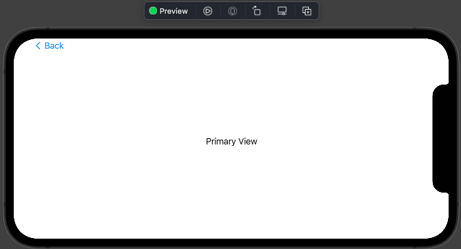

* iPadOS

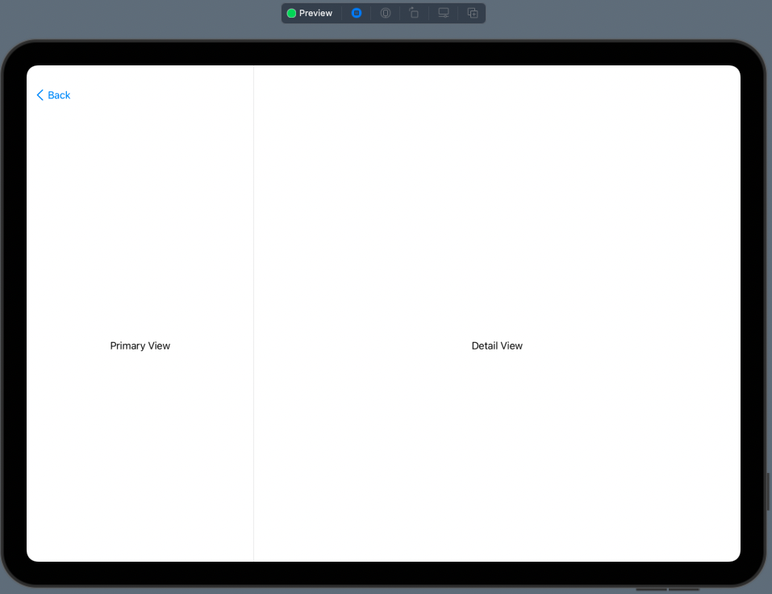

Khi bạn nhấn vào **Back Button** trên, nó sẽ đưa bạn qua màn hình **SideBar** nhoé. Đồng thời giao diện sẽ bị đẩy sang phải, che đi một phần của **Detail View**. Bạn nhấn vào Detail View thì sẽ ẩn đi **SideBar**.

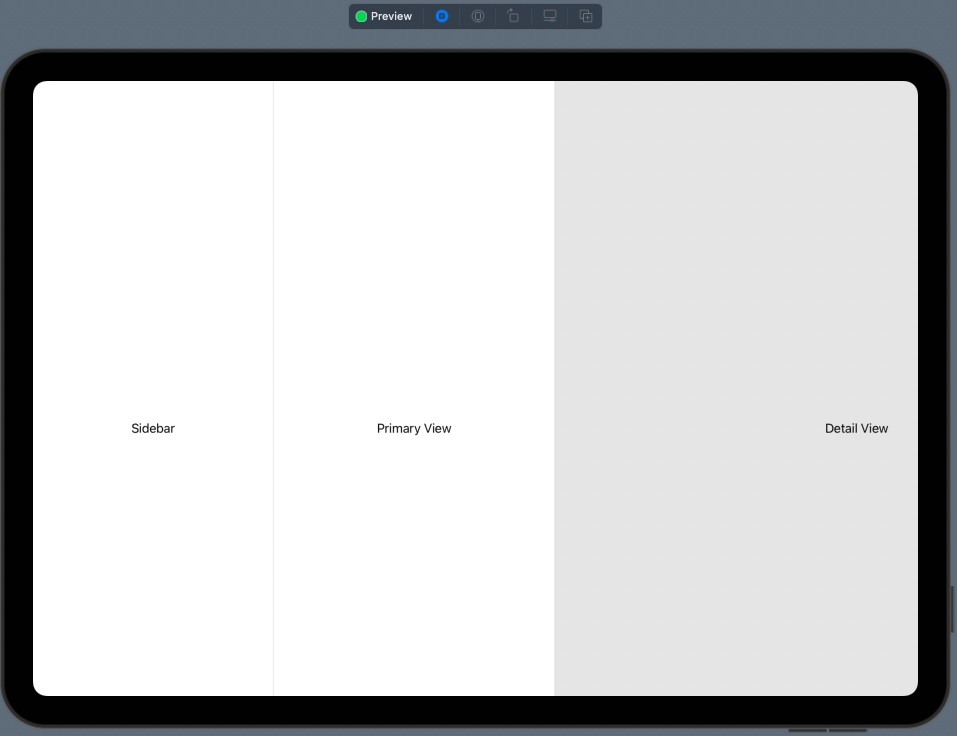

Qua trên bạn khái quá được ý SideBar sẽ trông như thế nào rồi. Ta sang phần tiếp theo nhoé.

### SideBar with List

Mục đích chính là dùng để điều hướng cả cho **Master View**. Do đó, ta thường sẽ sử dụng List để làm giao diện chính. SwiftUI sẽ tối ưu hoá việc điều hướng này cho bạn bằng kiểu là **SideBar**.

Xem ví dụ nhoé.

```swift
        NavigationView {
            List {
                ForEach(1...10, id:\.self) { index in
                    NavigationLink(destination: Text("Master \(index)")) {
                        Text("Item \(index)")
                    }
                }
            }
            .navigationTitle("SideBar")
            Text("Primary View")
            Text("Detail View")
        }
```

Bạn thay thế **Text** bằng **List** thôi và mọi thứ không có gì đặc biệt cả. Bạn bấm **Resume** để xem kết quả nhoé.

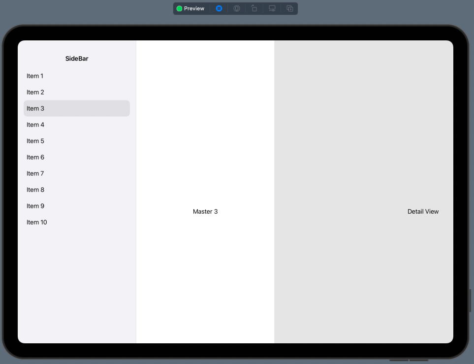

Tuy nhiên, bạn sẽ còn một cách nữa để biến List thành SideBar nhoé. Đó là sử dụng modifier `.listStyle`.

```swift
        NavigationView {
            List {
                ForEach(1...10, id:\.self) { index in
                    NavigationLink(destination: Text("Master \(index)")) {
                        Text("Item \(index)")
                    }
                }
            }
            .navigationTitle("SideBar")
            .listStyle(.sidebar)
            //Text("Primary View")
            //Text("Detail View")
        }
```

Trong đó,

* Sử dụng modifier với tham số là `.sidebar` cho List
* Comment 2 Text View ban đầu để cho mọi người dễ cảm nhận hơn

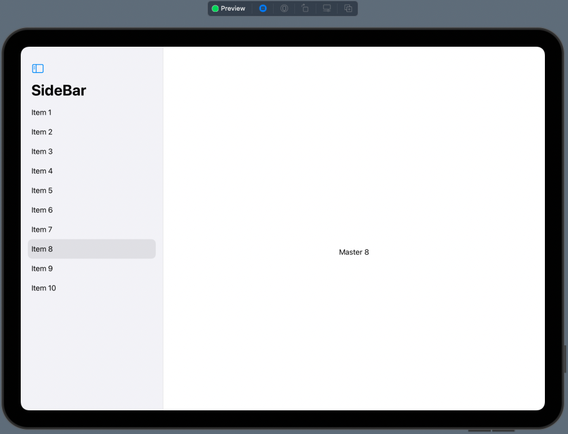

Với cách này, bạn sẽ có đc một **Bar Button Item** giúp ẩn hiện **SideBar**. Khá là tiện lợi phải không nào. 

> Nếu bạn đầu bạn cung cấp thêm cho **NavigationView** 2 View cho **Master & Detail**, thì **Bar Button Item** trên sẽ không xuất hiện nha.

Còn với iOS thì kết quả hiển thị sẽ không có **Bar Button Item** đó và vẫn giống như **List** bình thường.

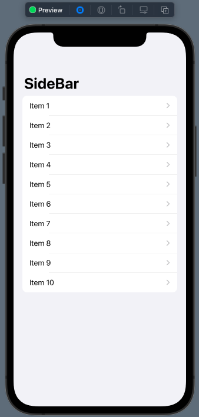

## Router

Trong phần này, mình sẽ thực hiện demo để xem được việc điều hướng như thế nào trong SideBar nhoé. Tổng quan bạn sẽ có 3 loại View chính:

* SideBar
* Master View
* Detail View

Việc điều hướng sẽ theo cấp như vậy. Mình sẽ demo một ứng dụng Mail đơn giản, trong đó:

* Folder chứa các loại mail, như: Inbox và Sent
* Mail Store: chứa các mail trong từng loại
* Mail View: hiển thị nội dung của một mail

Bắt đầu thôi nào!

### Setup Model

Ta sẽ cần chuẩn bị đối tượng đại diện cho Mail như sau:

```swift
struct Mail: Identifiable, Hashable {
    let id = UUID()
    let date: Date
    let subject: String
    let body: String
    var isFavorited = false
}
```

Trong đó:

* `id` sẽ là định danh cho từng đối tượng trong Array với việc kế thừa **Identifiable Protocol**.
* Các thuộc tính còn lại thì bình thường thôi

Tiếp theo, mình sẽ chuẩn bị `dummy data` cho chương trình. Tham khảo

```swift
final class MailStore: ObservableObject {
    @Published var allMails: [String: [Mail]] = [
        "Inbox": [ .init(date: Date(), subject: "Subject1.1", body: "Very long body..."),
                   .init(date: Date(), subject: "Subject1.2", body: "Very long body..."),
                   .init(date: Date(), subject: "Subject1.3", body: "Very long body..."),
                   .init(date: Date(), subject: "Subject1.4", body: "Very long body...") ],
        "Sent": [ .init(date: Date(), subject: "Subject2.1", body: "Very long body..."),
                  .init(date: Date(), subject: "Subject2.2", body: "Very long body..."),
                  .init(date: Date(), subject: "Subject2.3", body: "Very long body..."),
                  .init(date: Date(), subject: "Subject2.4", body: "Very long body..."),
                  .init(date: Date(), subject: "Subject2.5", body: "Very long body..."),
                  .init(date: Date(), subject: "Subject2.6", body: "Very long body...")],
    ]
}
```

Trong đó:

* Kế thừa thêm **ObservableObject Protocol** để tạo thành nguồn chữ liệu
* `@Published` cập nhật giá trị cho các View ràng buộc với thuộc tính này. Từ đó, View sẽ tự động cập nhật khi dữ liệu thay đổi.

### Custom SideBar

Ta sẽ tạo một file mới và tiến hành custom một **SideBar** nhoé. Bạn xem ví dụ code sau:

```swift
struct Sidebar: View {
    @ObservedObject var store: MailStore
    @Binding var selectedFolder: String?
    @Binding var selectedMail: Mail?
    
    var body: some View {
        List {
            ForEach(Array(store.allMails.keys), id: \.self) { folder in
                NavigationLink(
                    destination: FolderView(
                        title: folder,
                        mails: store.allMails[folder, default: []],
                        selectedMail: $selectedMail
                    ),
                    tag: folder,
                    selection: $selectedFolder
                ) {
                    Text(folder).font(.headline)
                }
            }
        }
        .listStyle(.sidebar)
        .navigationTitle("Folders")
    }
}
```

Trong đó:

* Bạn chú ý tới các thuộc tính lên quan tới **The single source of truth** nhoé
* `store` sẽ liên kết với dữ liệu dummy data
* `selectedFolder` & `selectedMail` lưu trữ dữ liệu cho thư mục mail được chọn
* `.listStyle(.sidebar)` xác định kiểu là một **SideBar** cho **List**

Việc hiển thị chính là sử dụng **List**. Việc điều hướng sử dụng **NavigationLink**, khi đó đối tượng **FolderView** sẽ được đẩy vào **NaviagtionView** (ở view chính đầu tiên). Dựa vào các dữ liệu ràng bộ để load đúng dữ liệu cho **FolderView**.

### Master View

Ta sẽ tiếp tục custom tiếp **FolderView**, nó đại diện cho **Master View**. Bạn tham khảo code như sau.

```swift
struct FolderView: View {
    let title: String
    let mails: [Mail]
    @Binding var selectedMail: Mail?
    
    var body: some View {
        List {
            ForEach(mails) { mail in
                NavigationLink(
                    destination: MailView(mail: mail),
                    tag: mail,
                    selection: $selectedMail
                ) {
                    VStack(alignment: .leading) {
                        Text(mail.subject)
                        Text(mail.date, style: .date)
                    }
                }
            }
        }.navigationTitle(title)
    }
}
```

Trong đó:

* Bạn chú ý tới thuộc tính `@Binding` đóng vai trò truyền dữ liệu xuyên qua các lớp phân cấp View
* Hiển thị danh sách vẫn bình thường với List

Việc điều hướng từ **Master View** sang **Detail View** vẫn sử dụng **NavigationLink**. Đối tượng truyền đi là `mail`, item trong array Mail. Đích của **NaviagtionLink** sẽ là **MailView**.

### Detail View

**MailView** đóng vài trong điểm đến cuối cùng và là **Detail View** trong toàn bộ phân cấp nhoé. Bạn tham khảo code ví dụ như sau:

```swift
struct MailView: View {
    let mail: Mail
    
    var body: some View {
        VStack(alignment: .leading) {
            Text(mail.subject)
                .font(.headline)
            Text(mail.date, style: .date)
            Text(mail.body)
        }
    }
}
```

Vì là View cuối cùng nên mọi thứ chỉ là chỉ đọc và hiển thị dữ liệu mà thôi. Nên cấu tạo của nó sẽ khá là đơn giản.

### Combine Views

Bạn đã có đầy đủ các dữ liệu và các View rồi. Ta tiến hành kết hợp chúng vào View lớn nhất. Đây cũng được xem là View gốc cho toàn bộ ứng dụng. Bạn tham khảo đoạn code nhoé.

```swift
struct SideBarDemo2: View {
    @StateObject var store = MailStore()
    @State private var selectedLabel: String? = "Inbox"
    @State private var selectedMail: Mail?
    
    var body: some View {
        NavigationView {
            Sidebar(
                store: store,
                selectedFolder: $selectedLabel,
                selectedMail: $selectedMail
            )
        }
    }
}
```

Khá đơn giản phải không nào. Bạn chỉ cần chuẩn bị các đối tượng `State` & `StateObject` thôi. Chúng nó đóng vài trò là nguồn dữ liệu chính. Mọi sự biến đổi đều tác động tới chúng. Và bạn cũng đã học qua nhiều với **The single source of truth** rồi. Nên cũng không quá khó hiểu nhĩ.

Bạn bấm **Live Preview** và test trên **iPad** trước nha.

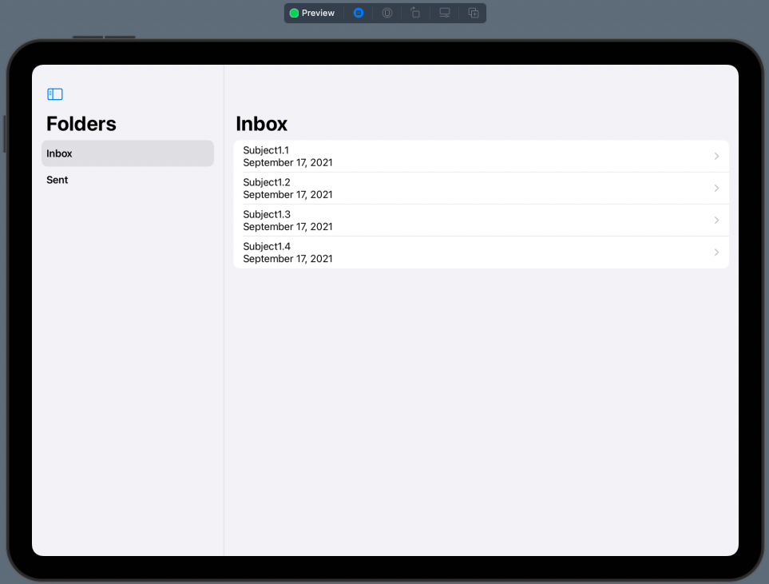

Nhìn qua cũng khá ổn nhĩ. Sau khi test xong cho iPad thì bạn chuyển sang iPhone để trải nghiệm nha. Nó đem lại một trải nghiệm hoàn toàn khác cho bạn.

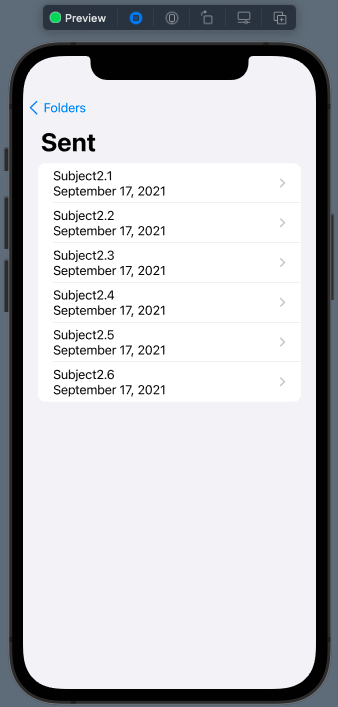

## Toolbar

Một View phụ đi kèm với **NavigationView** nữa đó là **Toolbar**. Mình sẽ giới thiệu chúng trong này, vì 

* Với macOS bạn sẽ lợi dụng nó để tạo giao diện cho button ẩn hiện SideBar
* Mình đã có trình bày nó ở 1 bài viết trước đây rồi. Bạn có thể tham khảo lại nha.

Về mặt hiển thị thì **Toolbar** sẽ chứa các **NavigationBarItem** (như trong iOS). Giúp bạn thực hiện nhiều tác vụ khác nhau. Với SwiftUI, **Toolbar** cũng tương tự như vậy. Bạn sẽ cần dùng tới modifier `.toolbar` để tạo các **BarItem** nhoé.

### Create ToolbarItem

Mình sẽ lợi dunhj luôn **Detail View** ở trên cho công việc này. Bạn tham khảo đoạn code này nha.

```swift
    var body: some View {
        VStack(alignment: .leading) {
            Text(mail.subject)
                .font(.headline)
            Text(mail.date, style: .date)
            Text(mail.body)
        }
        .toolbar {
            ToolbarItem {
                Image(systemName: "person.crop.circle")
            }
        }
    }
```

Trong đó:

* Modifier `.toolbar` để tạo một Toolbar trong NavigationView
* Để có 1 item, ta sử dụng đối tượng **ToolbarItem** và **Image** là nội dung của nó.

Đơn giản phải không nào, bạn bấm **Live Preview** và test lại nhoé!

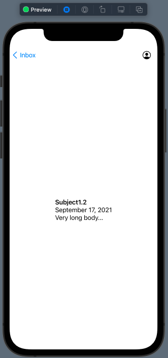

### ToolbarItem Placement

Mặc định, **ToolbarItem** sẽ ở vị trí như vậy. Nhưng bạn có thể thay đổi vị trí của chúng nhoé.

```swift
ToolbarItem(placement: .bottomBar) {
	Button(action: {}) {
		Image(systemName: "person.crop.circle")
	}
}
```

Xét lại với vị trí ở dưới với tham số `placement` và thay Image bằng Button để có sự kiện. Và ta sẽ thêm một combo như thế này

```swift
struct MailView: View {
    let mail: Mail
    @Environment(\.dismiss) var dismiss
    
    var body: some View {
        VStack(alignment: .leading) {
            Text(mail.subject)
                .font(.headline)
            Text(mail.date, style: .date)
            Text(mail.body)
        }
        .toolbar {
            ToolbarItem(placement: .navigationBarLeading) {
                Button(action: {
                    dismiss()
                }) {
                    Image(systemName: "chevron.backward")
                }
            }
            ToolbarItem(placement: .bottomBar) {
                Button(action: {}) {
                    Image(systemName: "person.crop.circle")
                }
            }
        }
        .navigationTitle(mail.subject)
        .navigationBarBackButtonHidden(true)
    }
}
```

Trong đó:

* `placement: .navigationBarLeading` sẽ ở vị trị trên thanh **NavigationBar** và bên trái
* `.navigationBarBackButtonHidden(true)` sẽ ẩn đi Back Button mặc định
* `@Environment(\.dismiss) var dismiss` dùng để pop View trong **NavigationLink**

Như vậy, bạn kết hợp combo trên bạn sẽ có đc một custom cho **Back Button** mặc định nha. Xem kết quả nhoé!

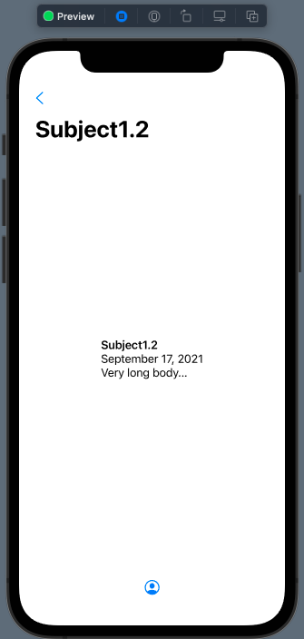

### ToolbarItemGroup

Cuối cùng, bạn có 1 nhóm các **ToolbarItem** và có ý định gôm chúng nó lại. Bạn sẽ cần sử dụng tới **ToolbarItemGroup**. Thay vì 1 View thì bạn có thể tạo nhiều View vào trong đó.

Bạn thêm đoạn code này vào trong `.toolbar` nha.

```swift
ToolbarItemGroup(placement: .bottomBar) {
	Image(systemName: "person")
	Spacer()
	Image(systemName: "ellipsis")
	Spacer()
	Image(systemName: "trash")
}
```

Bấm **Live Preview** và xem kết quả nha.

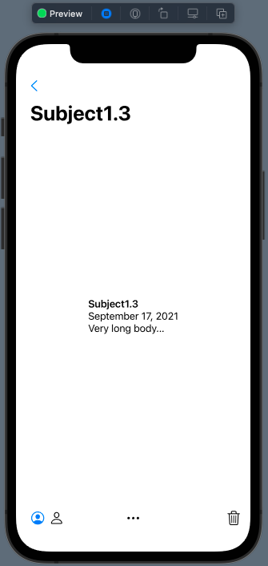

## Tạm kết

* Giới thiệu về SideBar trong SwiftUI
* Cách tạo SideBar trong NavigationView
* Cách biến đổi List sang kiểu SideBar
* Điều hướng trong ứng dụng với SideBar
* Giới thiệu và cách sử dụng Toolbar

---

Cảm ơn bạn đã theo dõi các bài viết từ **Fx Studio** & hãy truy cập [website](https://fxstudio.dev/) để cập nhật nhiều hơn
