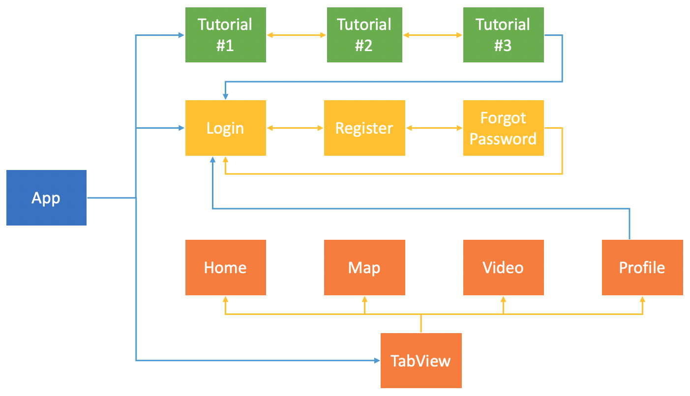
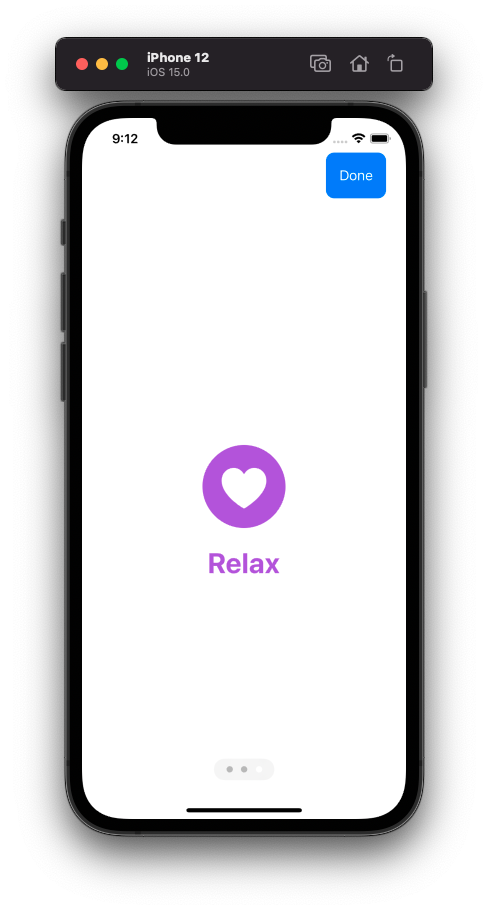
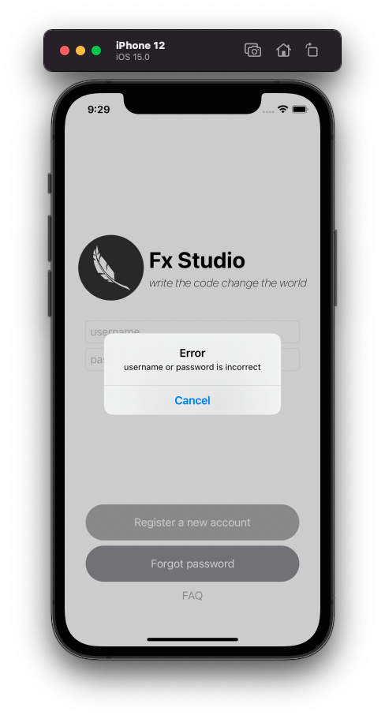
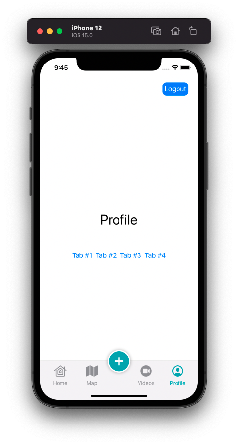

# 07 - Change Root

Chào mừng bạn đến với **Fx Studio**. Chúng ta tiếp tục hành trình với series **SwiftUI** và phần điều hướng trong **SwiftUI**. Bài viết này với chủ đề là **Change Root**. Ta sẽ kết hợp các màn hình với nhau, để điều hướng cho các luồng màn hình trong ứng dụng. Đây là một trong những kĩ năng mà bạn cần phải nắm được khi phát triển một ứng dụng.

Nếu mọi việc đã ổn rồi, thì ...

> Bắt đầu thôi!

## Chuẩn bị

Về mặt tool và version, các bạn tham khảo như sau:

- SwiftUI 2.0
- Xcode 12

Về mặt kiến thức, bạn cần biết trước các kiến thức cơ bản với SwiftUI & SwiftUI App. Tham khảo các bài viết sau, nếu bạn chưa đọc qua SwiftUI:

- [Làm quen với SwiftUI](https://fxstudio.dev/swiftui-phan-1-lam-quen-voi-swiftui/)
- [Cơ bản về ứng dụng SwiftUI App](https://fxstudio.dev/swiftui-phan-2-co-ban-ve-ung-dung-swiftui-app/)

*(Mặc định, mình xem như bạn đã biết về cách tạo project với SwiftUI & SwiftUI App rồi.)*

## Screen Flows

Một ứng dụng sẽ được kết hợp từ nhiều màn hình. Tuy nhiên, một vài màn hình sẽ đi liên với nhau trong nhằm thực hiện một tính năng hay một nhóm tính năng nào đó. Ta sẽ gọi chúng là **luồng màn hình** (*Screen Flow*). Ở một góc nhìn lớn hơn nữa, ứng dụng sẽ kết hợp nhiều luồng với nhau lại để tạo nên một ứng dụng hoàn chỉnh.

Xem ví dụ sau nhoé, mà nó cũng sẽ dùng làm ví dụ demo cho bài viết này.



Trong đó:

* Các đường màn xanh biểu thị cho việc thay đổi luồng màn hình
* Các đường màu vàng là sự thay đổi qua lại giữa các màn hình trong một luồng màn hình

Công việc của chúng ta tập trung vào các đường màu xanh, hay thay đổi các luồng màn hình. Nó được gọi là **Change Root**. Vấn đề này khá là quan trọng. Vì

> Đảm bảo cấu trúc và tính mở rộng của ứng dụng.

Khi bạn thiết kế tốt các Screen Flow và Change Root, thì sẽ:

* Đảm bảo được việc điều hướng một cách đơn giản nhất trong toàn bộ ứng dụng.
* Biết chính xác vị trí hay luồng của từng màn hình, từ đó tương tác được với các màn hình khác.
* Tạo điều kiện cho việc truyền dữ liệu một cách hiệu quả nhất.
* Mở rộng thêm màn hình hay thêm các tính năng cho ứng dụng.

Ta sẽ sử dụng các màn hình đã được demo trong các bài viết trước, để làm demo cho việc **Change Root** này.

### Tutorial Flow

> Các View này đã được demo cho PageView tại bài viết [TabView](https://github.com/fx-studio/swiftui-notes/blob/main/016-RoutingInSwiftUI/04_TabView.md#pageview).

Đây là các màn hình sẽ xuất hiện lúc bắt đầu ứng dụng. Và nó sẽ xuất hiện duy nhất một lần. Với ý nghĩa hướng dẫn hoặc giới thiệu cơ bản về ứng dụng của chúng ta.

Điều hướng trong luồng:

* Bằng cách *Swipe* qua lại giữa các **Page** trong luồng.
* Tại **Page** cuối, bạn có thể vào màn hình **Login**. Đó là điểm để *Change Root*.

### Login Flow

> Các View này đã được demo cho [Push & Pop](https://github.com/fx-studio/swiftui-notes/blob/main/016-RoutingInSwiftUI/02_Push_Pop.md) của NavigationView.

Trong đây với 3 màn hình đặc trưng là: *Login, Register, ForgotPassword*. Tuy là các màn hình với các tính năng độc lập với nhau. Nhưng chúng là màn hình xoay quanh tài khoản người dùng sử dụng cho bên trong ứng dụng. Ta sẽ nhóm chúng nó với nhau thành một **Sceen Flow**.

Về điều hướng trong này rất phức tạp, tuy nhiên mình đã làm giải thích trước rồi.

```
// Chiều đi
Login > Register
Login > Forgot Password
Login > Register > Forgot Password

// Chiều về
Login > Register > Login
Login > Forgot Password > Login

Login > Register > Forgot Password > Login
Login > Register > Forgot Password > Register
```

Nhiệm vụ của bạn sẽ cài đặt các việc di chuyển như trên nhoé. Xoay quanh đó bạn sẽ có các nhiệm vụ như sau:

- **Push** : đưa 1 View khác vào Stack
- **Pop** : lấy View ra khỏi Stack
- **Pop to root** : lấy hết các View ra khỏi Stack, để về lại Root

Ta có 2 điểm để *Change Root* từ **Login Flow** sang **TabView Flow**.

### TabView Flow

> Các View này đã được demo cho TabView & Custom Tabbar, chi tiết tại [đây](https://github.com/fx-studio/swiftui-notes/blob/main/016-RoutingInSwiftUI/05_CustomTabbar.md).

Với TabView hay Tabbar, bạn có thể thay đổi nội dung hiển thị giữa các tính năng với nhau. Quan trọng chúng sẽ được phân cấp ngang hàng với nhau, không ảnh hưởng lẫn nhau. Nên bạn sẽ có 4 Flows trong chính TabView:

* Home Flow
* Map Flow
* Videos Flow
* Profile Flow
* Plush Flow

Về điều hướng giữa các màn hình trong mỗi Flow sẽ dùng **NavigationView**. Riêng *Plus Flow* sẽ được điều hướng theo kiểu *Modal View*, từ dưới hiện lên.

Về điểm **Change Root** thì chúng ta sẽ từ màn hình **Profile** và tiến hành `logout`. Ứng dụng sẽ chuyển sang **Login Flow** để người dùng đăng nhập một tài khoản khác.

## App State

Ở trên, ta đã tìm hiểu sơ qua được việc điều hướng của các màn hình & các điểm thực hiện *Change Root*. Phần điều hướng tại các màn hình trong mỗi Flow thì mình đã thực hiện được trong các bài viết trước rồi. Nên mình sẽ tập trung vào Change Root.

Vì **SwiftUI** được phát triển theo phong cách **Declarative Programming**, nên chúng ta cần tạo ra các trạng thái tương ứng với các **Flows**. Và áp dụng The single source of truth, để ràng buộc dữ liệu (trạng thái) với giao diện.

> Chúng ta chỉ cần thay đổi giá trị của trạng thái, thì giao diện sẽ được tự động thay đổi theo.

Ngoài ra, để đảm báo được việc thay đổi Change Root từ các View con của các Flow, thì bạn phải cần giải quyết bài toán dùng chung dữ liệu. Nhiều bạn sẽ nghĩ tới Singleton Pattern huyền thoại. Nhưng vì là SwiftUI, chúng ta sẽ sử dụng một cách khác. Đó là,

> Environment Object

Bạn có thể dùng nhiều cách khác nhau để xử lý dữ liệu dùng chung. Nhưng sau khi tham khảo nhiều nguồn thì **Environment Object** là phù hợp nhất.

### Create State

Bắt đầu, ta sẽ cần tạo nên các class phục vụ cho việc định nghĩa AppState & Router cho ứng dụng. Bạn tham khảo đoạn code sau:

```swift
class AppRouter: ObservableObject {
    @Published var state: AppState = .tutorial
}

enum AppState {
    case tutorial
    case login
    case tabbar
}
```

Trong đó:

* Đối tượng **AppRouter** sẽ đóng vai trò quản lý trạng thái của ứng dụng.
* AppRouter được kế thừa **ObservableObject Protocol**, đảm bảo sử dụng với **The single source of truth**.
* Enum **AppState** định nghĩa các **Screen Flow** hiện có trong ứng dụng của bạn
* Thuộc tính `state` trong class AppRouter, lưu giữ giá trị hiện tại của ứng dụng.

Nhiệm vụ của bạn sẽ là thay đổi giá trị của `state` . Vì nó là `@Published`, nên giá trị mới sẽ được gởi đi. Các giao diện ràng buộc với nó sẽ tự động thay đổi theo.

## Root View

### Setup

Đây sẽ là trái tim cho toàn bộ ứng dụng này. Bạn về file App của project và tiến hành tạo mới một thuộc tính **AppRouter**.

```swift
@StateObject var appRouter = AppRouter()
```

Trong đó:

* Khai báo `appRouter` với `@StateObject` để biến nó thành nguồn dữ liệu chính.

Các View, Flows sẽ dựa vào đó mà tự động cập nhật theo. Tiếp theo, bạn sẽ tạo thêm một thuộc tính có tên là `rootView` nhoé. Tham khảo đoạn code sau:

```swift
    @ViewBuilder
    var rootView: some View {
        switch appRouter.state {
        case .tutorial:
            TutorialView()
        case .login:
            LoginView()
        case .tabbar:
            FxTabBar()
        }
    }
```

Trong đó:

* Bạn sẽ `switch case` giá trị của `appRouter.state` để lựa chọn View hiển thị phù hợp
* Vì `@Published` dùng khai báo `appRouter.state` nên khi có sự thay đổi giá trị của nó, thì việc lựa chọn này sẽ tiếp tục diễn ra. Từ đó tạo **Change Root**.

Cuối cùng, bạn sẽ sử dụng `rootView` vào trong `body` của App nhoé.

```swift
    var body: some Scene {
        WindowGroup {
            rootView
        }
    }
```

Đơn giản như vậy thôi, bạn đã cài đặt **Root View** thành công rồi. Hãy thử build ứng dụng và thay đổi giá trị `state` tại **AppRouter**, để xem mọi việc hoạt động ổn không.

### Environment Object

Ta sẽ giải quyết bài toán truyền dữ liệu đi. Hay ở đây chính là trạng thái ứng dụng (*App State*). Để bất cứ View nào cũng có thể tiếp cận được và thay đổi được giá trị của **App State**.

Như đã nói ở trên, ta sẽ sử dụng tới **EnvironmentObject**, bạn tham khảo đoạn code này nhoé.

```swift
    var body: some Scene {
        WindowGroup {
            rootView
                .environmentObject(appRouter)
        }
    }
```

Với modifier `.environmentObject`, bạn sẽ truyền đối tượng `appRouter` đi trong toàn bộ phân cấp View trong ứng dụng. Ưu điểm sẽ là bạn không cần:

* Truyền dữ liệu qua lại với nhau giữa các View và các cấp View
* Không thêm thuộc tính và sửa lại các hàm khởi tạo
* Không cần sử dụng tới `static` hay các Singleton
* Đảm bảo được nguyên tắc **The single source of truth**

Vì `rootView` là view gốc cho toàn bộ ứng dụng, nên sự ảnh hưởng của `.environmentObject(appRouter)` sẽ lên toàn bộ app. Tuy nhiên, về mặt dữ liệu thì nó chỉ lưu giữ tại một điểm. Giúp bạn an tâm về mặt bộ nhớ nhoé.

## Change Flow

Ở trên, xem như là tạm ổn với việc cài đặt **Change Root** trong toàn bộ ứng dụng rồi. Ta sẽ đi vào các ví dụ tại các điểm thay đổi **Flow** của ứng dụng nhoé.

Để áp dụng cho các điểm Change Root, thì bạn thêm thuộc tính sau vào các View nào mà bạn muốn thay đổi trạng thái của ứng dụng nhoé.

```swift
@EnvironmentObject var appRouter: AppRouter
```

Chúng ta bắt đầu thôi!

### Tutorial to Login

Bắt đầu, ứng dụng sẽ hiển thị **Tutorial Flow** lên đầu tiên. Ở bài viết trước, **TutorialView** được tạo bằng **TabView** với style là PageView. Nó khá đơn sơ.

Mình sẽ thêm một NavigationView và BarButtonItem để làm sự kiện thay đổi trạng thái ứng dụng. Bạn tham khảo đoạn code sau nhoé

```swift
struct TutorialView: View {
    
    @State var selection: Int = 0
    @EnvironmentObject var appRouter: AppRouter
    
    var body: some View {
        NavigationView {
            TabView(selection: $selection) {
                VStack {
                    Image(systemName: "chevron.left.slash.chevron.right")
                        .resizable()
                        .foregroundColor(Color.purple)
                        .frame(maxWidth: 100.0, maxHeight: 100.0)
                    Text("Coding")
                        .font(.largeTitle)
                        .fontWeight(.bold)
                        .foregroundColor(Color.purple)
                }
                .tag(0)
                VStack {
                    Image(systemName: "network")
                        .resizable()
                        .foregroundColor(Color.purple)
                        .frame(maxWidth: 100.0, maxHeight: 100.0)
                    Text("Sharing")
                        .font(.largeTitle)
                        .fontWeight(.bold)
                        .foregroundColor(Color.purple)
                }
                .tag(1)
                VStack {
                    Image(systemName: "heart.circle.fill")
                        .resizable()
                        .foregroundColor(Color.purple)
                        .frame(maxWidth: 100.0, maxHeight: 100.0)
                    Text("Relax")
                        .font(.largeTitle)
                        .fontWeight(.bold)
                        .foregroundColor(Color.purple)
                }
                .tag(2)
            }
            .tabViewStyle(.page)
            .indexViewStyle(.page(backgroundDisplayMode: .always))
            .navigationBarItems(trailing: Button(action: {
                if selection < 2 {
                    selection += 1
                } else {
                    // goto Login
                    appRouter.state = .login
                }
            }, label: {
                if selection < 2 {
                    Text("Next")
                        .foregroundColor(Color.white)
                        .padding()
                        .background(RoundedRectangle(cornerRadius: 10.0).foregroundColor(Color.gray))
                } else {
                    Text("Done")
                        .foregroundColor(Color.white)
                        .padding()
                        .background(RoundedRectangle(cornerRadius: 10.0).foregroundColor(Color.accentColor))
                }
            }))
        }
    }
}
```

View này là thay đổi nhiều nhất so với các View hay Flow demo trước đó. Và cũng mong muốn bạn xem được tổng quan của việc **Change Root**. Trong đó, bạn chú ý tới:

* Thuộc tính `appRouter` là một **Enviroment Object**. Liên kết trực tiếp với thuộc tính `appRouter` tại App.
* Khi `selection == 2` tức là bạn ở Page cuối cùng trong Tutorial, khi đó bạn xét lại `.state` là `.login`. Tự động chuyển đổng sang Login Flow.

Đơn giản phải không nào. Build lại ứng dụng và test nhoé!



### Login to TabView

Chúng ta cũng áp dụng tương tự như *TutorialView*, bạn cần thêm các thuộc tính **EnvironmentObject** `appRouter` cho các View có các sự kiện **Change Root** trước nha.

Tại **LoginView**, bạn thêm đoạn code sau cho button Login nhoé.

```swift
Button {
   if username == "fxstudio" && password == "123" {
      // goto Tabbar
      appRouter.state = .tabbar
   } else {
      // error -> show alert
      isAlert = true
   }                            
} label: {
   Text("Login")
}
```

Trong đó:

* Tại `action` của Login Button, ta tiến hành kiểm tra giá trị của `username` & `password`. Ví dụ như trong đoạn code nhoé
* Nếu đúng thì chuyển sang TabView Flow bằng cách thay đổi giá trị `.state` bằng `.tabbar` là xong

Tại **RegisterView**, chúng ta cũng áp dụng tương tự cho **Register Button**. Tiết kiện thời gian, bạn tham khảo đoạn code này nha.

```swift
Button {
  if !username.isEmpty && !password.isEmpty && !passwordConfirm.isEmpty && !email.isEmpty {
  		// goto Home
      appRouter.state = .tabbar
  } else {
       // show error
       isAlert = true
  }
                        
} label: {
    Text("Done")
}
```

Build ứng dụng và test tiếp nha!



### TabView to Login

Với TabView, ta có 4 Flows con trong đó. Nhưng tại **Profile Flow**, thì ta mới thực hiện **Change Root** mà thôi. Tại ProfileView, bạn thêm một Button Logout. Tại đó, chúng ta sẽ thực hiện thay đổi sang luồng Login nhoé. 

Tham khảo đoạn code sau nhoé

````swift
            .navigationBarItems(trailing:  Button(action: {
                // goto Login
                appRouter.state = .login
            }, label: {
                Text("Logout")
                    .foregroundColor(Color.white)
                    .padding(5)
                    .background(RoundedRectangle(cornerRadius: 10.0).foregroundColor(Color.accentColor))
            }))
````

Vẫn là tương tự như trên, bạn build lại ứng dụng và test luồng cuối nhoé.



## Tạm kết

* Tìm hiểu về Screen Flow trong SwiftUI
* Cài đặt AppState và AppRouter để phục vụ cho việc thay đổi luồng màn hình
* Cài đặt Root View và Environment Object để truyền dữ liệu trạng thái cho toàn bộ ứng dụng
* Thực hiện việc Change Root ở các View con

---

Cảm ơn bạn đã theo dõi các bài viết từ **Fx Studio** & hãy truy cập [website](https://fxstudio.dev/) để cập nhật nhiều hơn

