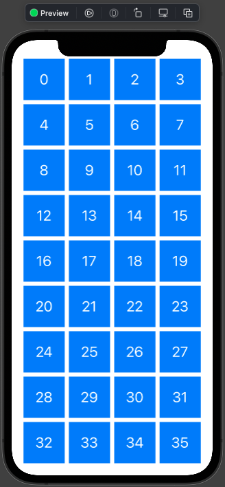
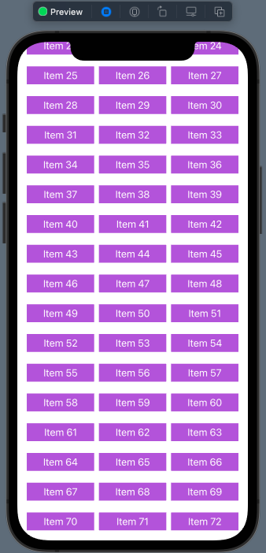
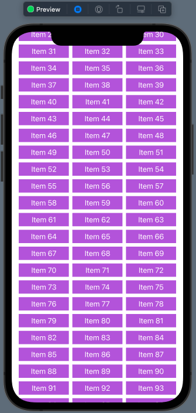
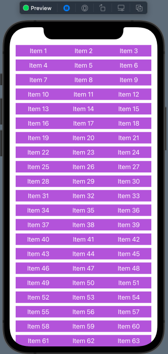
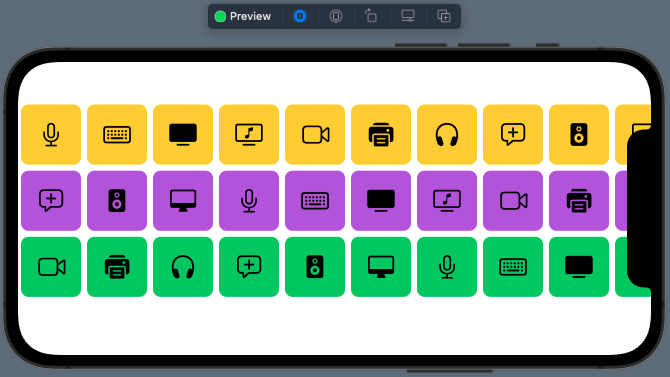

# 01 - Basic Grid Layout

Chào mừng bạn đến với **Fx Studio**. Chúng ta lại tiếp tục với series **SwiftUI** bất tận này. Bạn đã học được cách hiển thị theo dạng List với các Row, tuy nhiên chúng ta còn một cách hiển thị một danh sách nữa. Đó là theo dạng ô lưới, hay dân gian lập trình gọi là **Grid Layout**. Bạn sẽ tìm hiểu cơ bản về nó trong bài viết này.

Nếu mọi việc đã ổn rồi, thì ...

> Bắt đầu thôi!

## Chuẩn bị

Về mặt tool và version, các bạn tham khảo như sau:

- SwiftUI 2.0
- Xcode 12

Về mặt kiến thức, bạn cần biết trước các kiến thức cơ bản với SwiftUI & SwiftUI App. Tham khảo các bài viết sau, nếu bạn chưa đọc qua SwiftUI:

- [Làm quen với SwiftUI](https://fxstudio.dev/swiftui-phan-1-lam-quen-voi-swiftui/)
- [Cơ bản về ứng dụng SwiftUI App](https://fxstudio.dev/swiftui-phan-2-co-ban-ve-ung-dung-swiftui-app/)

*(Mặc định, mình xem như bạn đã biết về cách tạo project với SwiftUI & SwiftUI App rồi.)*

## Grid Layout

Nếu bạn là người tìm hiểu về *SwiftUI* ngay từ những ngày đầu khi vừa ra mắt. Nó đã tiến hóa lên tới **version 3.0** rồi, tuy nhiên vẫn chưa có một đối lượng hay class nào tương tự như **UICollectionView** trong **UIKit**. Mặc dù, bạn có List là một đối tượng thay thế cho UITableView và List đáp ứng đầy đủ các tính năng của UITableView. Thậm chí, một số trường hợp thì List trở nên đa năng UITableView rất nhiều.

Còn về *UICollectionView* hay cách bố trí giao diện dưới dạng các ô lưới, thì *SwiftUI* chỉ mới cập nhật tại **iOS 14** với 2 đối tượng là: **LazyVGrid** & **LazyHGrid**.

Còn về cấu tạo và cách hoạt động của **LazyVGrid** & **LazyHGrid** có thay thế được UICollectionView hay không thì đích thân bạn sẽ phải tự trải nghiệm mới biết được.

> Trong phạm vi của Fx Studio, mình chỉ tập trung tìm hiểu và chia sẽ lại những kiến thức của SwiftUI cung cấp mà thôi. Có thể bạn sẽ có được một giải pháp đơn giản hơn khi sử dụng các thư viện bên ngoài.

## VStack & HStack

Để có được một giao diện như *UICollectionView* trong *UIKit*, bạn có rất nhiều cách để tạo ra chúng. Trong đó, cách kết hợp giữa **VStack & HStack** được xem là đơn giản nhất trong **SwiftUI** (giai đoạn còn sơ khai).

Bạn xem qua ví dụ code sau:

```swift
struct DemoCollectionView: View {
    
    var body: some View {
        VStack {
            ForEach(0...8, id: \.self) { indexV in
                HStack {
                    ForEach(0...3, id: \.self) { indexH in
                        Text("\(indexV*4 + indexH)")
                            .font(.title)
                            .foregroundColor(Color.white)
                            .frame(width: 80, height: 80, alignment: .center)
                            .background(Color.accentColor)
                    }
                }
            }
        }
    }
}
```

Thật đơn giản phải không nào, trong đó:

* **VStack** được xem là các hàng
* **HStack** xem là các cột

Chúng kết hợp với 2 vòng **ForEach** và tạo nên một giao diện khá là giống với **UICollectionView**. Nội dung của các phần tử trong ô lưới thì là **Text** đơn giản. 

Bạn thử bấm **Resume** và xem kết quả nhóe!



Mặc dù rất nhanh chóng để bạn có được giao diện theo ý muốn. Tuy nhiên, chúng ta lại khó khăn trong việc:

* Lặp dữ liệu, vị chúng tới 2 vòng ForEach
* Cài đặt giao diện khá thủ công, khi bạn phải tự điều chỉnh và canh kích thước các ô sao cho phù hợp

Do đó, SwiftUI đã giúp bạn rất nhiều khi thêm 2 SwiftUI View mới (**LazyVGrid & LazyHGrid**) phục vụ cho việc hiển thị nội dung theo **Grid Layout**.

## LazyVGird

**LazyVGrid** là một *SwiftUI View* dùng để bố cục giao diện theo Grid Layout và được giới thiệu trong **SwiftUI 2.0**. Người anh em của chúng là **LazyHGrid**. Chúng cung cấp cho bạn một giao diện hiển thị kiểu ô lưới (grid) nhưng với một cách tự động và linh hoạt.

Chúng sẽ dựa vào dữ liệu bạn cung cấp để bố trích giao diện hiển thị sao cho phù hợp nhất. Việc cài đặt giao diện cho từng ô lưới thì bạn có thể cấu hình một cách tự động và duy nhất một lần. Gọi là **GridItem**. Khi xuất hiện thì LazyVGrid hay LazyHGrid sẽ dựa vào đó để bố trí giao diện theo dữ liệu.

> Cũng khá tương đồng với **UICollectionView** và **FlowLayout** của nó.

Với **LazyVGrid**, bạn sẽ *scroll* nội dung theo chiều dọc màn hình. Còn bố cục các item sẽ theo hàng ngang (columns).

### Create

Để tạo một Grid Layout chúng ta sẽ đi theo các bước lần lượt như sau:

**Bước 1:** Chuẩn bị dữ liệu

```swift
let data = (1...100).map { "Item \($0)" }
```

Ví dụ, với một dữ liệu là `data`, là một mãng String với nội dung từ 1 tới 100

**Bước 2:** Tạo các **GridItem**, thứ sẽ quyết định Grid của bạn trông như thế nào. Ví dụ: bao nhiêu cột, hàng, kích thước, khoảng cách ...

```swift
    let columns = [
        GridItem(.adaptive(minimum: 80))
    ]
```

Tiếp theo, ta có một thuộc tính là `columns` với kiểu dữ liệu là GridItem. Vì chứa 1 phần tử nên sẽ mong muốn Grid chứa được tối đa nhất các phần tử trên 1 hàng. Kích thước nhỏ nhất của một phần tử là `80 px`.

**Bước 3:** Tạo đối tượng **LazyVGrid** và được bọc với **ScrollView**. Nội dung bên trong sẽ dùng **ForEarch** lặp và sinh ra các View đại diện cho các ô trong *Grid*.

```swift
        ScrollView {
            LazyVGrid(columns: columns, spacing: 20) {
                ForEach(data, id: \.self) { item in
                    Text(item)
                        .foregroundColor(Color.white)
                        .padding(5)
                        .background(Color.purple)
                }
            }
            .padding(.horizontal)
        }
        .frame(maxHeight: .infinity)
```

Trong đó:

* Truyền `columns` cho LazyVGrid để xác định bố cụ
* **ForEach** sẽ lặp các phần tử của `data`
* Mỗi bước lặp ta sẽ tạo một đối tượng **Text**
* **ScrollView** bọc ngoài cùng vì kích thước của nội dung bên trong sẽ lớn hơn màn hình.

Bấm Live Preview và xem kết quả nhóe!


### Columns

Khi bạn muốn số lượng cột cụ thể và xác định, ví dụ như chỉ có 2 hay 3 cột mà thôi. Thì bạn sẽ phải cần thay đổi tham số của thuộc tính `columns`. Ví dụ với 3 cột nhóe, code sẽ như thế này.

```swift
    let columns = [
        GridItem(.flexible(minimum: 80)),
        GridItem(.flexible(minimum: 80)),
        GridItem(.flexible(minimum: 80))
    ]
```

Chúng ta sẽ khai báo 1 mãng **GridItem** với 3 phần tử xác định cụ thể với tham số `.flexible`. Như vậy mãng `columns` cho bao nhiêu phần tử thì sẽ có bấy nhiêu cột hiển thị.

Chỉnh sửa lại **LazyVGrid** một tí nào!

```swift
        ScrollView {
            LazyVGrid(columns: columns, spacing: 20) {
                ForEach(data, id: \.self) { item in
                    Text(item)
                        .foregroundColor(Color.white)
                        .padding(5)
                        .frame(maxWidth: .infinity)
                        .background(Color.purple)
                }
            }
            .padding(.horizontal)
        }
        .frame(maxHeight: .infinity)
```

Với modifier `.frame(maxWidth: .infinity)` cho Text, để giúp bạn thấy được kích thước của các ô trong Grid đẹp hơn. Cuối cùng, bạn bấm Live Preview và cảm nhận tiếp kết quả nha!



### Spacing

Tham số `spacing` trong hàm khởi tạo của LazyVGrid sẽ là khoảng cách giữa các dòng. Muốn đẹp hơn một tí thì bạn có thể thay đổi lại. Ví dụ mình chỉnh xuống là `8` cho đẹp.

```swift
        ScrollView {
            LazyVGrid(columns: columns, spacing: 8) {
                ForEach(data, id: \.self) { item in
                    Text(item)
                        .foregroundColor(Color.white)
                        .padding(5)
                        .frame(maxWidth: .infinity)
                        .background(Color.purple)
                }
            }
            .padding(.horizontal)
        }
        .frame(maxHeight: .infinity)
```

Và em nó sẽ trông như thế này nè.



Và bạn muốn điều chỉnh khoảng cách giữa các cột lại với nhau thì sẽ phải thêm tham số `spacing` ở các phần tử GridItem trong array `columns` . Ví dụ như sau:

```swift
    let columns = [
        GridItem(.flexible(minimum: 80), spacing: 0),
        GridItem(.flexible(minimum: 80), spacing: 0),
        GridItem(.flexible(minimum: 80), spacing: 0)
    ]
```

Kết quả thì trông khá là dị, bấm Live Preview và cảm nhận nhóe!



## LazyHGrid

Cũng tương tự như *LazyVGrid* về mọi mặt. **LazyHGrid** dùng để bố trí nội dung các ô lưới trong Grid. Với **LazyHGrid**, bạn sẽ *scroll* nội dung theo chiều ngang màn hình. Còn bố cục các item sẽ theo hàng dọc (rows).

Cơ bản về cách tạo thì khá tương đồng nhau. Bạn xem qua ví dụ code sau sẽ hiểu liền.

```swift
struct Demo02GridLayout: View {
    
    private var symbols = ["keyboard", "hifispeaker.fill", "printer.fill", "tv.fill", "desktopcomputer", "headphones", "tv.music.note", "mic", "plus.bubble", "video"]
    
    private var colors: [Color] = [.yellow, .purple, .green]
    
    private var gridItemLayout = [GridItem(.fixed(80), spacing: 8),
                                  GridItem(.fixed(80), spacing: 8),
                                  GridItem(.fixed(80), spacing: 8)]
    
    var body: some View {
        ScrollView(.horizontal) {
            LazyHGrid(rows: gridItemLayout, spacing: 8) {
                ForEach((0...9999), id: \.self) {
                    Image(systemName: symbols[$0 % symbols.count])
                        .font(.system(size: 30))
                        .frame(minWidth: 80, maxWidth: .infinity, maxHeight: .infinity)
                        .background(colors[$0 % colors.count])
                        .cornerRadius(10)
                }
            }
            .padding()
        }
        .frame(maxHeight: .infinity)
    }
}
```

Trong đó:

* Phần dữ liệu bao gồm `symbols` và `color`. Là tên các icon và màu sắc của hệ thống
* Thuộc tính `gridItemLayout` sẽ quyết định layout cho Grid của bạn. Với 3 phần tử, thì bạn sẽ có 3 hàng cho **LazyHGrid** hoặc 3 cột cho **LazyVGrid**.
* Vì bạn sẽ **scroll** theo chiều ngang màn hình. Do đó, cần thêm tham số cho **ScrollView** là `ScrollView(.horizontal)`
* Khởi tạo của **LazyHGrid** sẽ cần tham số `rows` (với *LazyVGrid* là `columns`)

Mọi thứ còn lại thì vẫn như trên. Chúng ta bấm Live Preview và test lại xem nhóe!



## Tạm kết

* Hiển thị giao diện kiểu Grid (ô lưới, hay Collection) trong SwiftUI
* Sử dụng hai đối tượng Grid Layout là LazyVGrid & LazyHGrid
* Điều chỉnh các tham số trong Grid Layout
* Thay đổi bố cục với GridItem

---

Cảm ơn bạn đã theo dõi các bài viết từ **Fx Studio** & hãy truy cập [website](https://fxstudio.dev/) để cập nhật nhiều hơn
