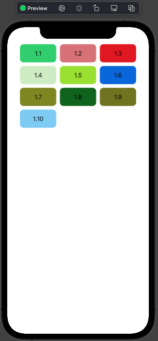
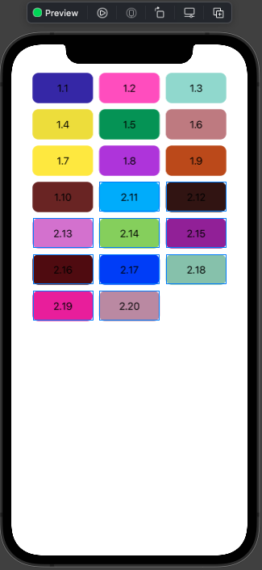
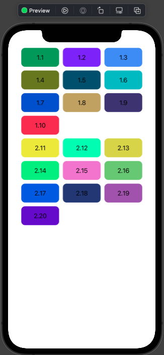
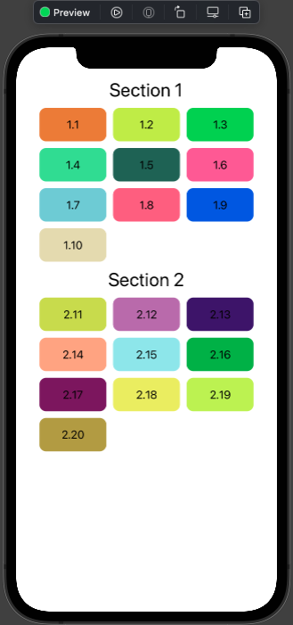
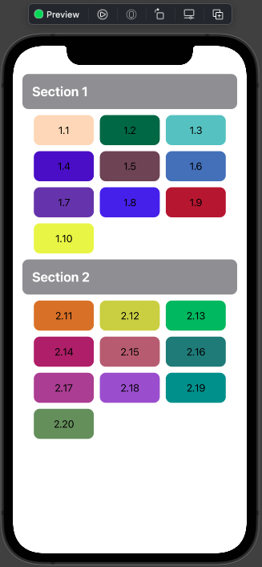
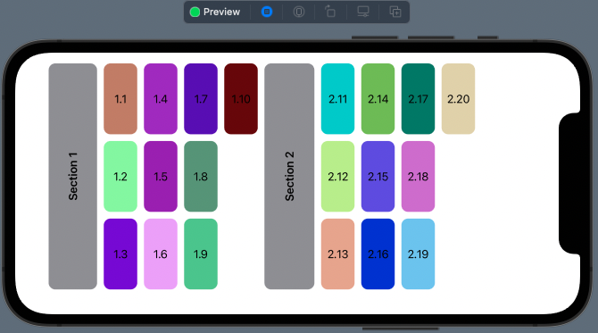
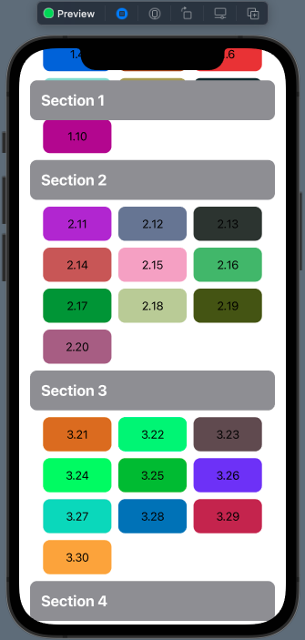
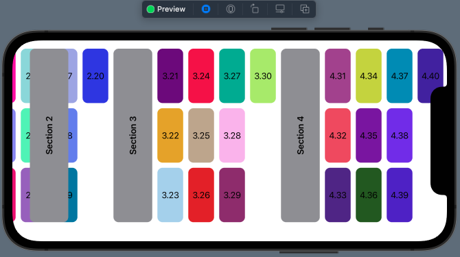

# 03 - Section in Grid

Chào mừng bạn đến với **Fx Studio**. Chúng ta tiếp tục hành trình bất tận trong vũ trụ **SwiftUI**. Chủ đề bài viết này là **Section in Grid**, cách bạn sẽ trình bày bố cục giao diện theo **Grid Layout** và có phân chia nội dung. Về bản chất, *Section* trong **Grid Layout** cũng tương tự như *List* hay *UICollectionView*. Nắm được cấu tạo & cách hoạt động của *Section* trong Grid sẽ giúp bạn chủ động hơn trong việc bố cục giao diện phực tạp.

Nếu bạn chưa biết gì về Grid Layout trong SwiftUI, thì có thể đọc lại các bài viết trước.

Còn nếu mọi việc đã ổn rồi, thì ...

> Bắt đầu thôi!

## Chuẩn bị

Về mặt tool và version, các bạn tham khảo như sau:

- SwiftUI 2.0
- Xcode 12

Về mặt kiến thức, bạn cần biết trước các kiến thức cơ bản với SwiftUI & SwiftUI App. Tham khảo các bài viết sau, nếu bạn chưa đọc qua SwiftUI:

- [Làm quen với SwiftUI](https://fxstudio.dev/swiftui-phan-1-lam-quen-voi-swiftui/)
- [Cơ bản về ứng dụng SwiftUI App](https://fxstudio.dev/swiftui-phan-2-co-ban-ve-ung-dung-swiftui-app/)

*(Mặc định, mình xem như bạn đã biết về cách tạo project với SwiftUI & SwiftUI App rồi.)*

## Section

Đây cũng là vấn đề muôn thuở. Bạn có nhiều danh sách cần được hiển thị hoặc chia thành nhiều bố cục khác nhau. Với List & TableView thì chúng ta sẽ chia chúng thành nhiều **Section** khác nhau. Và vấn đề này lại xuất hiên trên Grid, nhưng ...

> Tại sao phải cần Section trong Grid làm gì?

### Vấn đề

Để trả lời câu hỏi đó thì chúng ta sẽ xem qua ví dụ code sau:

```swift
struct SectionInGridDemoView: View {
    
    private var configGridItem = [
        GridItem(.fixed(100), spacing: 10),
        GridItem(.fixed(100), spacing: 10),
        GridItem(.fixed(100), spacing: 10)
    ]
    
    var body: some View {
        ScrollView(.vertical) {
            LazyVGrid(
                columns: configGridItem,
                spacing: 10
            ) {
                ForEach(1...10, id: \.self) { index in
                    Text("1.\(index)")
                        .frame(maxWidth: .infinity, minHeight: 50)
                        .background(Color.random)
                        .clipShape(
                            RoundedRectangle(cornerRadius: 10.0)
                        )
                }
            }
            .padding(.horizontal)
        }
        .frame(maxHeight: .infinity)
    }
}
```

Trong đó:

* Một LazyVGrid bình thường
* Config với 3 cột GridItem dạng `.fixed`
* ForEach lặp từ `1` đến `10`

Kết quả sẽ trông như thế này.



Mọi thứ vẫn đẹp. Chúng ta sẽ thêm tiếp 1 đoạn ForEach tiếp tục nữa vào LazyVGrid để xem Grid biến đổi như thế nào.

```swift
                ForEach(11...20, id: \.self) { index in
                    Text("2.\(index)")
                        .frame(maxWidth: .infinity, minHeight: 50)
                        .background(Color.random)
                        .clipShape(
                            RoundedRectangle(cornerRadius: 10.0)
                        )
                }
```

À há, vẫn không báo lỗi và không bị crash. Tuy nhiên ... kết quả sẽ có một chút bất thường.



Vấn đề chính là đây. Bạn sẽ thấy các phần tử của ForEach thứ 2 tiếp tục nối vào ForEach thứ 1. Chúng liên kết với nhau tạo thành một thể thống nhất. Và không có sự tách biệt ở đây.

> Ta sẽ thử dùng với Section xem như thế nào.

### Add Section

Bạn sẽ cập nhật lại nội dung của LazyVGrid thêm các đối tượng Section cho các ForEach ở trên nhóe. Tham khảo code như sau:

```swift
                Section {
                    ForEach(1...9, id: \.self) { index in
                        Text("1.\(index)")
                            .frame(maxWidth: .infinity, minHeight: 50)
                            .background(Color.random)
                            .clipShape(
                                RoundedRectangle(cornerRadius: 10.0)
                            )
                    }
                }
                
                //Section(header: Text("Section 2").font(.title)) {
                Section {
                    ForEach(10...19, id: \.self) { index in
                        Text("2.\(index)")
                            .frame(maxWidth: .infinity, minHeight: 50)
                            .background(Color.random)
                            .clipShape(
                                RoundedRectangle(cornerRadius: 10.0)
                            )
                    }
                }
```

Trong đó:

* Các đối tượng **Section** bọc lại các **ForEach**
* Các **Section** chứa trong **LazyVGrid**

Với các Section, giúp cho Grid của bạn tách biệt các phần nội dung hay các danh sách riêng lẽ với nhau. Bạn bấm Resume và xem kết quả nhóe!



Lúc này, mọi thứ nhìn sạch đẹp rồi đó. Hi vọng qua vài ví dụ nhỏ cũng giúp bạn hiểu được ý nghĩa vì sao cần Section trong Grid. Cũng tương tự như là với List. Mỗi đối tượng sinh ra đều có ý nghĩa riêng hết. Ahihi!

## Header

Chúng ta tiếp tục sang công việc tiếp theo cần xử lý **Section**. Bạn cần phải hiển thị thêm nội dung cho Section. Như bạn cũng đã biết thì ta có 2 view phụ cho nó:

* Header
* Footer

Chúng ta sẽ demo với Header thôi nhóe, còn lại bạn tự xử.

### Title

Bạn cần thêm các đối số cho `header` của hàm khởi tạo của Section. Code thì khá đơn giản, vì chúng ta đã quá quen thuộc với List rồi. Bạn tham khảo thêm nhóe!

```swift
                Section(header: Text("Section 1").font(.title)) {
                    ForEach(1...10, id: \.self) { index in
                        Text("1.\(index)")
                            .frame(maxWidth: .infinity, minHeight: 50)
                            .background(Color.random)
                            .clipShape(
                                RoundedRectangle(cornerRadius: 10.0)
                            )
                    }
                }
                
                Section(header: Text("Section 2").font(.title)) {
                    ForEach(11...20, id: \.self) { index in
                        Text("2.\(index)")
                            .frame(maxWidth: .infinity, minHeight: 50)
                            .background(Color.random)
                            .clipShape(
                                RoundedRectangle(cornerRadius: 10.0)
                            )
                    }
                }
```

Sử dụng Text làm `header` & tùy chỉnh thêm một ít với **modifier** `.font`. Bấm **Resume** và xem kết quả nhóe!



Chỉ vài thao tác nhỏ thì bạn đã có được Title cho Section rồi nhóe.

### Custom

Tất nhiên, chúng ta luôn sẽ phải custom view. Với `header` thì cũng không ngoại lệ được. Điều này giúp bạn tiết kiệm code và tránh viết code quá nhiều trong khởi tạo một đối tượng.

Bạn sẽ thêm một function như sau:

```swift
    private func customVHeader(with header: String) -> some View {
      Text(header)
        .font(.title2)
        .bold()
        .foregroundColor(.white)
        .padding()
        .frame(maxWidth: .infinity, maxHeight: .infinity, alignment: .leading)
        .background(RoundedRectangle(cornerRadius: 10)
          .fill(Color.headerBackground))
    }
```

Một function đơn giản và trả về với `some View`. Hiển thị nội dung title được truyền cho tham số của function. Bạn thay thế vào tham số `header` của Section.

```swift
    var body: some View {
        ScrollView(.vertical) {
            LazyVGrid(
                columns: configGridItem,
                spacing: 10
            ) {
                Section(header: customVHeader(with: "Section 1")) {
                    ForEach(1...10, id: \.self) { index in
                        Text("1.\(index)")
                            .frame(maxWidth: .infinity, minHeight: 50)
                            .background(Color.random)
                            .clipShape(
                                RoundedRectangle(cornerRadius: 10.0)
                            )
                    }
                }
                
                Section(header: customVHeader(with: "Section 2")) {
                    ForEach(11...20, id: \.self) { index in
                        Text("2.\(index)")
                            .frame(maxWidth: .infinity, minHeight: 50)
                            .background(Color.random)
                            .clipShape(
                                RoundedRectangle(cornerRadius: 10.0)
                            )
                    }
                }
            }
            .padding(.horizontal)
        }
        .frame(maxHeight: .infinity)
    }
```

Cũng khá đơn giản, ta cần truyền các String khác nhau để làm title cho mỗi Section. Cuối cùng, bấm Resume để xem tiếp kết quả nha!



Cũng ra gì và này nọ chứ. Bạn có thể tùy biến chúng đa dạng hơn nhiều so với ví dụ đơn giản của mình. Nhưng bạn sẽ chủ động hơn về mặt thiết kế giao diện cho ứng dụng của mình.

## LazyHGrid

Chúng ta sẽ tiếp tục demo các Section trên cho đối tượng Grid thứ 2 là LazyHGrid. Mục đích để xem hiển thị như thế nào với các Section được scroll ngang. À, không phải đơn giản chỉ là thay cái tên từ LazyVGrid sang thành LazyHGrid nha. Công việc cũng khá phức tạp.

Đầu tiên, ta cần tùy chỉnh lại lại array `configGridItem` trước đã. Cho chúng có khả năng linh hoạt một tí với `.adaptive`.

```swift
    private var configGridItem = [
        GridItem(.flexible(minimum: 100), spacing: 10),
        GridItem(.flexible(minimum: 100), spacing: 10),
        GridItem(.flexible(minimum: 100), spacing: 10)
    ]
```

Tiếp theo, ta sẽ phải thay đổi lại lại function **Custom Header** cho Section. Tham khảo đoạn code sau nhóe!

```swift
    private func customHHeader(with header: String) -> some View {
        Text(header)
          .bold()
          .frame(minWidth: 70)
          .rotationEffect(Angle(degrees: -90))
          .frame(maxWidth: .infinity, maxHeight: .infinity)
          .background(RoundedRectangle(cornerRadius: 10)
            .fill(Color.headerBackground))
    }
```

Bạn cần chú ý tới:

* Góc quay `.rotationEffect`
* `frame` với `maxWidth` & `maxHeight` (đã hoán vị so với LazyVGrid)

Cuối cùng, là sử dụng LazyHGrid vào trong ScrollView nhóe. Tiếp tục tham khảo đoạn code sau:

```swift
    var body: some View {
        ScrollView(.horizontal, showsIndicators: false) {
            LazyHGrid(
                rows: configGridItem,
                spacing: 10
            ) {
                Section(header: customHHeader(with: "Section 1")) {
                    ForEach(1...10, id: \.self) { index in
                        Text("1.\(index)")
                            .frame(minWidth: 50, maxHeight: .infinity)
                            .background(Color.random)
                            .clipShape(
                                RoundedRectangle(cornerRadius: 10.0)
                            )
                    }
                }
                
                Section(header: customHHeader(with: "Section 2")) {
                    ForEach(11...20, id: \.self) { index in
                        Text("2.\(index)")
                            .frame(minWidth: 50, maxHeight: .infinity)
                            .background(Color.random)
                            .clipShape(
                                RoundedRectangle(cornerRadius: 10.0)
                            )
                    }
                }
            }
            .padding(.horizontal)
        }
        .frame(maxHeight: .infinity)
    }
```

Trong đó:

* ScrollView sẽ được kích hoạt scroll ngang với `.horizontal`
* LazyHGrid sẽ cần cung cấp giá trị cho tham số `rows`
* Custom Header của Section sẽ gọi tới function `customHHeader`
* Mỗi item trong Grid cần điều chỉnh lại `frame` cho phù hợp

Mọi thứ còn lại thì không thay đổi gì nhiều. Bạn bấm Live Preview và xem kết quả nhóe.



Để thiết bị nằm ngang cho dễ quan sát. Bạn thử scroll qua lại xem như thế nào. Ahihi!

## PinnedScrollableViews

**PinnedScrollableViews** là các View mà bạn có thể `pin` (hay luôn hiển thị) trên Grid Layout. Đây là một tính năng mới được thêm cho các **LazyVGrid & LazyHGrid**. 

Đem lại một trải nghiệm tương tự như với UIKit. Và bạn sẽ không cần triệu hồi các UIKit để thực hiện nữa. Tất cả, đều có sẵn và chỉ cần sử dụng mà thôi.

Còn với Grid Layout cho cả 2 đối tượng **LazyVGrid & LazyHGrid**,  thì đều có tham số `pinnedView` cho hàm khởi tạo của chúng. Ví dụ như sau:

```swift
    LazyVGrid(
                columns: configGridItem,
                spacing: 10
                pinnedViews: [.sectionHeaders, .sectionFooters]
            ) {
            
            // ....
            
            }
```

Trong đó:

* `.sectionHeaders` chính là các Header của Section
* `.sectionFooters` chính là các Footer của Section

Khi các View được khởi tạo và bạn scroll chúng. Phần `header` hoặc `footer` sẽ ở nguyên vị trí của chúng, chỉ khi nào toàn bộ Section trôi qua thì chúng sẽ bị trôi theo.

Bạn hãy áp dụng vào 2 demo ở trên để xem kết quả nhóe, nhớ là thêm vài Section nữa (thay vì 2 cái như ví dụ).

* **LazyVGrid**



* **LazyHGrid**



Trông cũng khá ổn rồi đó, chúc bạn thành công nhóe. Ahihi!

## Tạm kết

* Thêm các Section cho Grid Layout
* Custom các Header & Footer
* Tùy biến Section riêng với LazyHGrid & LazyVGrid
* Sử dụng các PinnedScrollableViews để dính các header hoặc footer trên Grid Layout

---

Cảm ơn bạn đã theo dõi các bài viết từ **Fx Studio** & hãy truy cập [website](https://fxstudio.dev/) để cập nhật nhiều hơn

