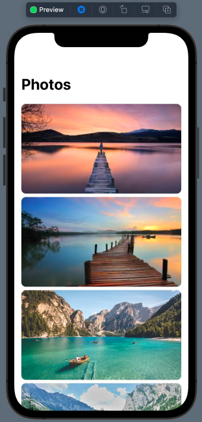
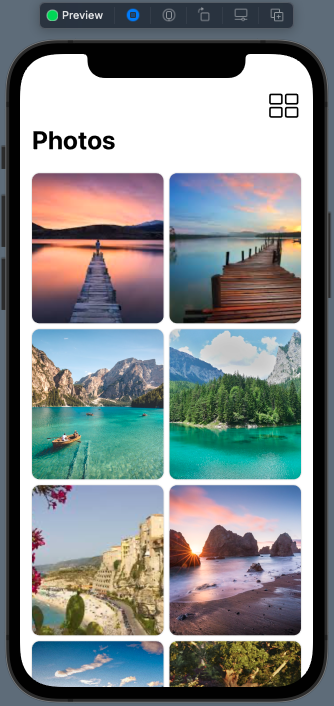
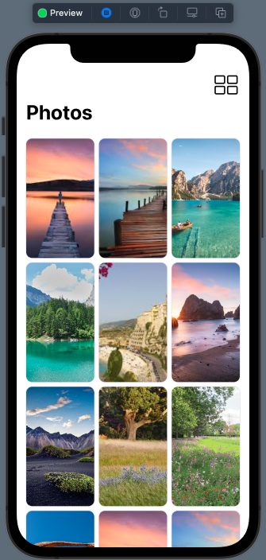
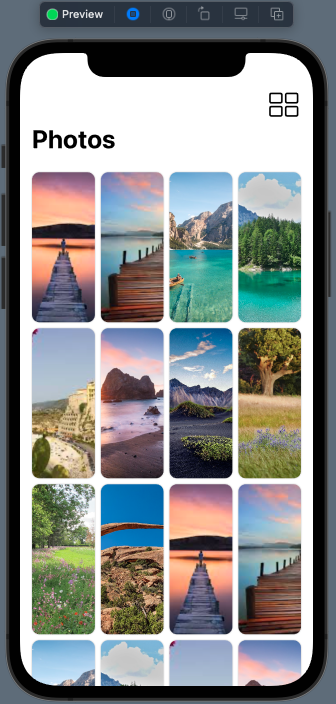
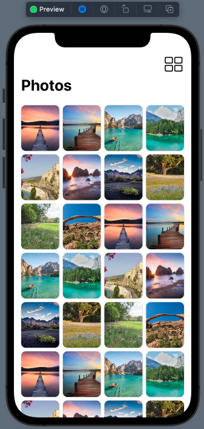

# 04 - Switching Grid Layout

Chào mừng bạn đến với **Fx Studio**. Chúng ta tiếp tục tìm hiểu về Grid Layout trong series SwiftUI bất tận này. Chủ đề bài viết này là **Switching Grid Layout**. Cách mà bạn thay đổi bố cục Layout của Grid khi đang dùng ứng dụng. Thậm chí với nhiều kiểu layout khác nhau nữa. Sẽ là một kỹ năng khá thú vị trong SwiftUI đó, ahihi!

Nếu mọi thứ đang ổn rồi, thì ...

> Bắt đầu thôi!

## Chuẩn bị

Về mặt tool và version, các bạn tham khảo như sau:

- SwiftUI 2.0
- Xcode 12

Về mặt kiến thức, bạn cần biết trước các kiến thức cơ bản với SwiftUI & SwiftUI App. Tham khảo các bài viết sau, nếu bạn chưa đọc qua SwiftUI:

- [Làm quen với SwiftUI](https://fxstudio.dev/swiftui-phan-1-lam-quen-voi-swiftui/)
- [Cơ bản về ứng dụng SwiftUI App](https://fxstudio.dev/swiftui-phan-2-co-ban-ve-ung-dung-swiftui-app/)

*(Mặc định, mình xem như bạn đã biết về cách tạo project với SwiftUI & SwiftUI App rồi.)*

## Switching Grid Layouts

Câu hỏi đặt ra cũng khá là thú vị, tại sau chúng ta cần phải làm công việc này. Trả lời thì đơn giản thôi:

> Đam mê

Thực chất thì chỉ là tối ưu code của bạn hơn mà thôi và lên trình code nữa. Quay về chủ đề chính, chúng ta cũng biết việc các ứng dụng ngày càng thân thiện hơn với người dùng. Cùng một nội dung giống nhau, người dùng có thể tùy chọn nhiều cách hiển thị khác nhau.

Ví dụ, bài toán chúng ta cần giải quyết là việc hiển thị một danh sách với nhiều kiểu hiển thị như:

* Một List thuần túy
* Một Grid
* Vẫn là Grid nhưng lại có số cột/dòng khác nhau

> Việc thay đổi giao diện từ List sang Grid là kiểu phổ biến nhất hiện nay.

Nhiều đồng chí có cách giải quyết khá đơn giản thì sẽ là là 2 View (1 List & 1 Grid), chúng cùng hiển thị một danh sách. Người dùng bấm nút thì sẽ ẩn cái này, hiện cái kia ... cách này đơn giản nhất, nhưng

> Khá là nhục!

Và may mắn, chúng ta có SwiftUI. Nó xử lý việc này khá là mượt mà. Nội dung chính của bài viết này là hướng dẫn bạn thao tác để có được một View mà thay đổi được bố cục. Chúng ta sẽ dùng Grid thuần tùy và đơn giản thôi.

## Create a List

### Setup

Chúng ta sẽ thực hiện tạo một View với kiểu hiển thị là một danh sách. Nhưng lần này ta sẽ không dùng tới List. Để bắt đầu, bạn cần tạo một file cho kiểu dữ liệu mà ta sẽ dùng trong demo trước nhóe. Mình đặt tên là **PhotoItem**. Tham khảo code nhóe.

```swift
struct PhotoItem: Identifiable {
    var id = UUID()
    var name: String
}
```

Trong đó, mọi thứ không có gì đặc biệt. Bạn cần kế thừa lại **Identifiable Protocol** để chúng xác định là duy nhất trong **Grid**. Tiếp theo, bạn tạo một SwiftUI View mới, đặt tên gì thì túy ý bạn nha. Tham khảo code ví dụ sau:

```swift
struct SwitchingGridLayoutDemo2: View {
    
    let photos = (1...30).map { PhotoItem(name: "img\($0%10)") }
    
    var body: some View {
        Text("Hello, World!")
    }
}
```

Chúng ta cần một thuộc tính để lưu giữ dữ liệu cho View, trong ví dụ mình dùng `photos` là dữ liệu. Phần ảnh thì các bạn thêm vào file `Assets` nhóe. Hình gì cũng được hết. Với ví dụ trên, ta có `photos` là một **Array PhotoItem** với 30 phần tử.

### GridItem config

Tiếp theo, bạn cũng biết được qua các bài viết vừa rồi. Chúng ta cần một Array GridItem để tiến hành định hình cho giao diện bố cụ của Grid View. 

Với kiểu hiển thị giống như List, thì array config của ta khá là đơn giản. Bạn tiếp tục thêm dòng code này vào SwiftUI View của chúng ta.

```swift
@State var gridConfig: [GridItem] = [ GridItem() ]
```

Bạn chỉ cần sử dụng `GridItem()` đơn giản vậy thôi, chúng sẽ có ý nghĩa:

* Bạn sẽ có 1 cột hoặc 1 hàng duy nhất trong Grid
* Khi không khởi tạo gì với `size` thì nó sẽ là kiểu `flexible` (hoặc thể loại tương đương)
* Quan trọng là bạn sẽ khai báo với `@State`

Vì là một đối tượng với kiểu State nên mỗi lần `gridConfig` thay đổi giá trị. Các View ràng buộc với nó sẽ thay đổi theo. Tức là Grid sẽ thay đổi bố cục. Đơn giản vậy thôi!

> EZ Game!

### Display List

Công việc cuối cùng, bạn sẽ tạo một Grid và hiển thị `photos` thôi. Công thức tạo Grid thì vẫn như trước. Bạn tham khảo code nhóe.

```swift
    var body: some View {
        NavigationView {
            ScrollView {
                LazyVGrid(columns: gridConfig) {
                    ForEach(photos) { item in
                        Image(item.name)
                            .resizable()
                            .scaledToFill()
                            .frame(minWidth: 0, maxWidth: .infinity)
                            .frame(height: 200)
                            .cornerRadius(10)
                            .shadow(color: Color.primary.opacity(0.3), radius: 1)
                    }
                }
                .padding()
            }
            .frame(height: .infinity)
            .navigationTitle("Photos")
        }
    }
```

Trong đó:

* Combo các đối tượng **NavigationView & ScrollView** đóng vai trò là khung chứa cho Grid của bạn
* Sử dụng **LazyVGrid** để trải nghiệm như là một **List**
* **ForEach** để duyệt các phần tử trên `photos` và mỗi bước lặp bạn tạo 1 Image

Như vậy, bạn có được một View hiển thị như một List nhưng lại sử dụng Grid.

> Điểm cần ghi nhớ là **Array GridItem** sẽ quyết định cách hiển thị cho Grid Layout nhóe.

Bấm **Live Preview** và cảm nhận kết quả nhóe!



## Switching Button

Người dùng muốn thay đổi giao diện hiển thị, thì bạn cần cung cấp cho họ một sự kiện. Trong ví dụ, ta sẽ dùng tới Bar Button Item trong **NavigationView**. Và với kiến thức từ các bài viết trước, bạn sẽ dùng tới modifier `.toolbar` để thêm một Bar Button Item vào **NavigationView**. Bạn tham khảo đoạn code sau nhóe!

```swift
        NavigationView {
            ScrollView {
                LazyVGrid(columns: gridConfig) {
                    ForEach(photos) { item in
                        Image(item.name)
                            .resizable()
                            .scaledToFill()
                            .frame(minWidth: 0, maxWidth: .infinity)
                            .frame(height: 200)
                            .cornerRadius(10)
                            .shadow(color: Color.primary.opacity(0.3), radius: 1)
                    }
                }
                .padding()
            }
            .frame(height: .infinity)
            .navigationTitle("Photos")
            .toolbar {
                ToolbarItem(placement: .navigationBarTrailing) {
                    Button {
                        // code here
                    } label: {
                        Image(systemName: "rectangle.grid.2x2")
                            .font(.title)
                            .foregroundColor(.primary)
                    }

                }
            }
        }
```

Trong đó:

* Modifier `.toolbar` sẽ giúp tạo ra các Bar Button Item cho bạn
* Sử dụng `ToolbarItem(placement: .navigationBarTrailing)` để có được một button đúng vị trí mong muốn
* Content của ToolbarItem là một **Button**

Như vậy, bạn đã ổn phần tạo View và sự kiện để người dùng thay đổi bố cục giao diện.

## Change Layout

Tới phần nội dung chính, ta sẽ biến tấu bố cục của Grid tại `action` cho Button trên. Bạn xem code tham khảo nhóe!

```swift
                    Button {
                        self.gridConfig = Array(repeating: .init(.flexible()), count: self.gridConfig.count % 4 + 1)
                    } label: {
                        Image(systemName: "rectangle.grid.2x2")
                            .font(.title)
                            .foregroundColor(.primary)
                    }
```

Bạn tập trung vào phần `action`, nó có ý nghĩa đơn giản.

* Mỗi lần nhấn vào Button, thì bạn gán lại giá trị mới cho `gridConfig`
* Giá trị mới sẽ là một **Array GridItem** với số lượng item lần lượt là từ 1 đến 4
* Các **GridItem** được tạo với kiểu `.flexible`

Khi giá trị của `gridConfig` được cập nhật, kéo theo Grid của chúng ta sẽ thay đổi theo. Bạn bấm Live Preview và xem kết quả nhóe!

* Grid với 2 cột



* Grid với 3 cột



* Grid với 4 cột



## Make Color

Bạn đã có được điều mà bạn mong muốn. Nhưng View của chúng ta vẫn chưa hoàn hảo. Bạn cần làm thêm một số thao tác nữa, để nó đẹp hơn.

### Update Height

Đầu tiên, bạn cần thay đổi chiều cao `height` của các item trong Grid cho phù hợp với số cột hiển thị. Các này khá đơn giản, chúng ta sẽ lợi dụng `gridConfig`. Do nó là một **State** nên giao diện sẽ tự động thay đổi theo.

```swift
.frame(height: gridConfig.count == 1 ? 200 : 100)
```

Bạn thay dòng code trên vào dòng code `.frame(height: 200)` là ổn nha. Sau đó, bấm **Live Preview** và xem kết quả.



### Animation

Cảm giác mỗi lần chuyển đổi Layout thì View chúng ta khá là thô. Chớp chớp một cái là xong. Do đó, bạn cần phải thêm hiệu ứng vào, để cho nó lung linh hơn. 

Với SwiftUI, cách thêm hiệu ứng như thế nào thì chúng ta sẽ tìm hiểu ở các bài viết sau. Còn với bài viết này, bạn chỉ cần tham khảo đoạn code sau là ổn.

```swift
.animation(.interactiveSpring(), value: gridConfig.count)
```

Bạn thêm modifier trên vào **LazyVGrid**. Còn nó là gì, thì mình giải thích đơn giản như sau:

* `interactiveSpring` kiểu hiệu ứng
* `value` giá trị so sánh sự thay đổi để diễn ra hiệu ứng

Như vậy thôi, bạn tiếp tục bấm lại **Live Preview** và cảm nhận kết quả tiếp nhóe!

### Update Bar Button

Hi vọng bạn không quên em Bar Button Item của chúng ta. Một phần nó là nơi tiếp nhận sự kiện để hành động thay đổi bố cục xãy ra. Nhưng nó còn biểu thị nội dung bố cục tiếp theo của Grid của bạn. Do đó, thêm phần tinh tế cho ứng dụng, thì bạn cũng phải cập nhật nội dung của Bar Button mỗi khi có sự thay đổi.

Cách cập nhật thì ta sẽ lợi dụng tới 2 yếu tố:

* Observe Property của `gridConfig`, để lắng nghe sự thay đổi giá trị của nó
* `@State` để ràng buộc giao diện với dữ liệu

Kết hợp 2 yếu tố trên thì bạn tham khảo tiếp đoạn code sau cho View của bạn:

```swift
    @State var gridConfig: [GridItem] = [ GridItem() ] {
        didSet {
            switch gridConfig.count {
            case 1:
                icon = "rectangle.grid.2x2"
            case 2:
                icon = "rectangle.grid.3x2"
            case 3:
                icon = "square.grid.4x3.fill"
            case 4:
                icon = "rectangle.grid.1x2"
            default:
                icon = "rectangle.grid.1x2"
            }
        }
    }
    @State var icon: String = "rectangle.grid.2x2"
```

Trong đó:

* Thêm `didSet` cho `gridItem` tương ứng với từng giá trị của thuộc tính mà ta sẽ thay đổi nội dung của `icon`
* Khai báo thêm thêm thuộc tính `icon`, chứa nội dung cho Bar Button

Sau đó, bạn cập nhật lại phần Label của Bar Button. Tham khảo tiếp đoạn code sau nhóe

```swift
                    Button {
                        self.gridConfig = Array(repeating: .init(.flexible()), count: self.gridConfig.count % 4 + 1)
                    } label: {
                        Image(systemName: icon)
                            .font(.title)
                            .foregroundColor(.primary)
                    }
```

Như vậy là xong, bạn có được một Grid Layout như ý. Bấm **Live Preview** và cảm nhận kết quả tiếp nhóe!

## Tạm kết

* Nhắm được cách thay đổi bố cục của Grid với Array GridItem
* Thay đổi cách hiển thị của Grid Layout
* Thêm các hiệu ứng và tùy chỉnh nội dung của các Item trong Grid

---

Cảm ơn bạn đã theo dõi các bài viết từ **Fx Studio** & hãy truy cập [website](https://fxstudio.dev/) để cập nhật nhiều hơn
