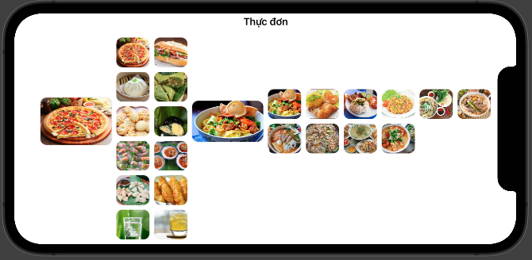
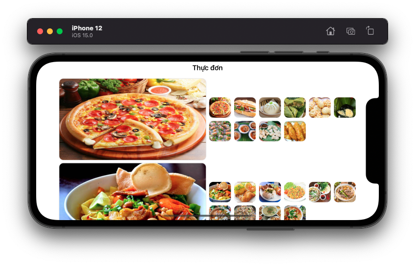
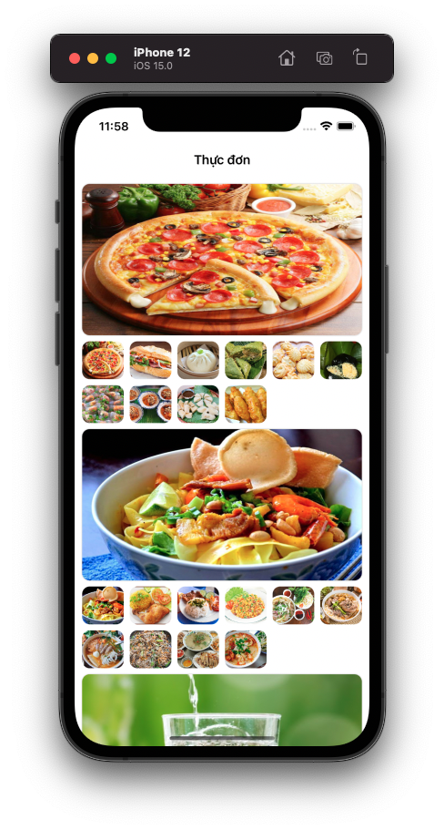

# 05 - Multiple Grids

Chào mừng bạn đến với **Fx Studio**. Chúng ta lại tiếp tục hành trình bất tận trong vũ trụ **SwiftUI**. Chủ đề bài viết là **Multiple Grids**. Sẽ hướng dẫn bạn cách sử dụng Grid trong Grid và cách biến đổi bố cục các Grids với nhau. Đây cũng thuộc một trong những kiểu giao diện trong các ứng dụng phổ biến hiện nay.

Nếu mọi việc đã ổn rồi, thì ...

> Bắt đầu thôi!

## Chuẩn bị

Về mặt tool và version, các bạn tham khảo như sau:

- SwiftUI 2.0
- Xcode 12

Về mặt kiến thức, bạn cần biết trước các kiến thức cơ bản với SwiftUI & SwiftUI App. Tham khảo các bài viết sau, nếu bạn chưa đọc qua SwiftUI:

- [Làm quen với SwiftUI](https://fxstudio.dev/swiftui-phan-1-lam-quen-voi-swiftui/)
- [Cơ bản về ứng dụng SwiftUI App](https://fxstudio.dev/swiftui-phan-2-co-ban-ve-ung-dung-swiftui-app/)

*(Mặc định, mình xem như bạn đã biết về cách tạo project với SwiftUI & SwiftUI App rồi.)*

## Multiple Grids

Ở bài viết trước, bạn đã thực hiện đc việc biến đổi bố cục giao diện của Grid. Tuy nhiên, giao diện vẫn là một Grid đơn giản mà thôi. Bạn sẽ thấy nhiều ứng dụng có Grid lồng trong Grid. Hoặc có sự trộn nhiều danh sách vào với nhau. Kiểu bố cục này cũng khá phổ biến trong nhiều ứng dụng. Mục đích chính là khi bạn muốn hiển thị danh sách nhiều chiều có sự phân cấp. 

> Còn với danh sách nhiều chiều không có sự phân cấp thì chúng ta sử dụng nhiều Section nhóe!

Công việc này với UIKit thì khá là phức tạp, bạn phải chia ra các lớp để sử dụng các protocol phù hợp. Càng khó khăn hơn với vấn đề `reusable` trên các UITableView & UICollectionView. Nhưng với SwiftUI, bạn sẽ bất ngờ về độ đơn giản của chúng. Kể cả khi dữ liệu của bạn có sự phân cấp trong cấu trúc dữ liệu.

Bài viết này sẽ hướng dẫn bạn cách có được giao diện Grid trong Grid và cách cài đặt dữ liệu phù hợp với giao diện. Nào tiếp tục thôi!

## Setup Data

Công việc đầu tiên luôn là việc xử lý phần dữ liệu trước. Chúng ta sẽ có một bài toán như sau:

* Danh sách các thực đơn
* Mỗi thực đơn lại có nhiều ảnh cho nó

Như vậy, ta sẽ có một mãng các ảnh ở trong một đối tượng thực đơn, để tạo ra sự phân cấp dữ liệu cần thiết. Bạn tham khảo đoạn code sau:

```swift
struct MenuItem: Identifiable {
    var id = UUID()
    var name: String
    var thumbnail: String
    var photos: [PhotoItem] = []
}

struct PhotoItem: Identifiable {
    var id = UUID()
    var name: String
}
```

Trong đó:

* Các struct phải kế thừa lại **Identifiable Protocol**, để giúp các item được xác định là duy nhất trong Grid
* Thuộc tính `id` là bắt buộc, nó được khởi tạo với `UUID` nên bạn không cần lo lắng về vấn đề duy nhất

Tiếp tục, bạn sẽ chuẩn bị dummy data cho SwiftUI View của bạn nhóe. Bạn tham khảo đoạn code sau:

```swift
extension MenuItem {
    static func dummyData() -> [MenuItem] {
        var menu1 = MenuItem(name: "Bánh", thumbnail: "img_1_0")
        menu1.photos = (0...9).map { PhotoItem(name: "img_1_\($0)") }
        
        var menu2 = MenuItem(name: "Đồ ăn", thumbnail: "img_2_0")
        menu2.photos = (0...9).map { PhotoItem(name: "img_2_\($0)") }
        
        var menu3 = MenuItem(name: "Nước uống", thumbnail: "img_3_0")
        menu3.photos = (0...9).map { PhotoItem(name: "img_3_\($0)") }
        
        return [menu1, menu2, menu3]
    }
}
```

Các ảnh thì mình lưu trữ ở file **Assets**. Nêu bạn thích bao nhiều hình thì có thể tùy biến thêm.

## Setup Grid

Tiếp theo, chúng ta sẽ tạo Grid đơn giản trước nhóe. Bạn tham khảo đoạn code sau:

```swift
struct MultipleGridsDemo: View {
    
    let menus = MenuItem.dummyData()
    @State var gridConfig: [GridItem] = [GridItem()]
    
    var body: some View {
        NavigationView {
            ScrollView {
                LazyVGrid(columns: gridConfig) {
                    ForEach(menus) { menu in
                        Image(menu.thumbnail)
                            .resizable()
                            .frame(maxWidth: .infinity, maxHeight: 200)
                            .scaledToFill()
                            .cornerRadius(10)
                            .shadow(color: Color.primary.opacity(0.3), radius: 1)
                    }
                }
                .padding(10)
            }
            .navigationTitle("Thực đơn")
        }
    }
}
```

Trong đó:

* Thuộc tính `menus` là array dữ liệu chính cho View
* Bố cục của Grid thì mình vẫn sử dụng **Array GridItem** với khai báo `@State`

Chúng ta sẽ sử dụng thuộc tính `gridConfig` khá nhiều về sau trong việc biến đổi bố cục tiếp theo cho Grid. Hiện tại, với một phần tử **GridItem**, nên giao diện với **LazyVGrid** là tương tự như List.

Bạn bấm **Live Preview** và cảm nhận hết quả nhóe!


## Adding an Additional Grid

Bây giờ, chúng ta mới bắt tay vào công việc chính nhóe. Nhiệm vụ là bạn sẽ phải thêm một **LazyVGrid** nữa vào trong **LazyVGrid** trên. Trước tiên, bạn hãy tham khảo đoạn code sau:

```swift
    var body: some View {
        NavigationView {
            ScrollView {
                LazyVGrid(columns: gridConfig) {
                    ForEach(menus) { menu in
                        
                        //#1
                        Image(menu.thumbnail)
                            .resizable()
                            .frame(maxWidth: .infinity, maxHeight: 200)
                            .scaledToFill()
                            .cornerRadius(10)
                            .shadow(color: Color.primary.opacity(0.3), radius: 1)
                        
                        //#2
                        LazyVGrid(columns: [GridItem(.adaptive(minimum: 50))]) {
                            ForEach(menu.photos) { photo in
                                Image(photo.name)
                                    .resizable()
                                    .scaledToFill()
                                    .frame(minWidth: 0, maxWidth: .infinity)
                                    .frame(height: 50)
                                    .cornerRadius(10)
                            }
                        }
                        .frame(minHeight: 0, maxHeight: .infinity, alignment: .top)
                    }
                }
                .padding(10)
            }
            .navigationTitle("Thực đơn")
        }
    }
```

Chúng ta sẽ tập trung vào 2 đoạn code `#1` và `#2`. Về bản chất, bạn hãy xem cả 2 là các **SwiftUI View**. Thì cả 2 đều là 2 item trong một Grid lớn.

* `#1` có kích thước xác định
* `#2` có kích thước tùy thuộc vào nội dung bên trong của nó

Về `#2`, là một **LazyVGrid** với **Array GridItem** đơn giản & truyền trực tiếp vào hàm khởi tạo của nó. Còn mặt dữ liệu cho `#2` thì bạn sử dụng tiếp `menu.photos`. Nó là một array và đảm bảo định danh là duy nhất trong Grid.

Như vậy là xong, bạn hãy bấm **Live Preview** và xem kết quả nhóe.


Tuy nhiên, để bạn thấy được sự khác biệt và tâm quan trọng của Array GridItem thì hãy tùy chỉnh lại `gridConfig` như sau:

```swift
    @State var gridConfig: [GridItem] = [
        GridItem(.adaptive(minimum: 100)),
        GridItem(.flexible())
    ]
```

Với 2 item, Grid của chúng ta sẽ có 2 cột. Một cột chứa ảnh lớn và một cột chứa 1 Grid con. Bấm Live Preview và xem kết quả tiếp nhóe!


Qua đó, giúp bạn thấy được tầm quan trọng của Array GridItem sẽ quyết định tất cả mọi thứ trong Grid.

## Handling Landscape Orientation

Điểm hay của giao diện của bạn là việc bố cục giao diện sẽ tự động thay đổi để phù hợp với kích thước màn hình thay đổi. Điều mà các dev hay quên khi nói tới kích thước màn hình thay đổi, thì chỉ nghĩ tới mỗi các device khác nhau thôi. Chúng ta còn có trường hợp xoay thiết bị nữa.

> Lúc này, giao diện của bạn sẽ rất dễ bị toang lắm.

Với demo trên của ta, thì bạn thử xem ở chế độ **Landscape** thì như thế nào.



Giao diện lúc này đúng là toang thật. Bố cục vừa sai và sai luôn cả cách dùng. Nguyên nhân chính là các GridItem đang ở chế độ `flexible`. Bạn sẽ tìm cách thay đổi chúng để giao diện chúng ta đẹp hơn.

### verticalSizeClass

Bạn sẽ sử dụng các đối tượng Environment được SwiftUI cung cấp sẵn.

```swift
    @Environment(\.horizontalSizeClass) var horizontalSizeClass: UserInterfaceSizeClass?
    @Environment(\.verticalSizeClass) var verticalSizeClass: UserInterfaceSizeClass?
```

Đây là các thuộc tính giúp bạn nhận biết được kích thước của màn hình khi có sự thay đổi. Bạn sẽ thêm các thuộc tính vào View của mình. Sau đó, sửa lại `gridConfig` như ban đầu nhóe.

```swift
@State var gridConfig: [GridItem] = [GridItem()]
```

### .onChange

Khi đã có được đối tượng lưu giữ giá trị kích thước màn hình rồi. Bạn lại cần phải lắng nghe sự thay đổi khi nào diễn ra, rồi từ đó bạn thay đổi lại giá trị của `gridConfig`. Chúng ta sẽ lợi dụng modifier `.onChange` cho NavigationView nhóe. Tham khảo đoạn code sau:

```swift
        .onChange(of: verticalSizeClass) { newValue in
            if verticalSizeClass == .regular {
                self.gridConfig = [
                    GridItem(.adaptive(minimum:  verticalSizeClass == .regular  ? 250 : 100)),
                    GridItem(.flexible())
                ]
            } else {
                self.gridConfig = [
                    GridItem()
                ]
            }
        }
```

Trong đó:

* Lắng nghe sự thay đổi giá trị của `verticalSizeClass`
* So sánh giá trị của `verticalSizeClass` là `regular` hay `compact`. Đó chính là chiều ngang và chiều dọc khi xoay màn hình
* Ứng với mỗi giá trị của `verticalSizeClass` thì ta sẽ gán lại giá trị cho `gridConfig`

Với chế độ `.regular` bạn sẽ thấy Array GridItem sẽ là các Item với `.adaptive` & `.flexible`, giúp cho các Item sẽ đảm bảo kích thước và bố cụ phù hợp hơn. Kết quả như sau:



Còn với chế độ `.compact` thì đơn thuần Grid chúng ta sẽ như là một List. Tương tự ở trên. Và kết quả như sau:



Để thấy được sự thay đổi khi xoay màn hình, thì bạn cần build ứng dụng SwiftUI lên Simulator nhóe.

### .onAppear

Dành cho các bạn thích mọi thứ phải hoàn hảo lúc bắt đầu thì xem hãy thêm tiếp một modifier nữa cho NavigationView nhóe. Đó là `.onAppear`, bạn sẽ lại dựa vào `verticalSizeClass` mà cập nhật giá trị cho `gridConfig` nhóe. Tham khảo đoạn code sau:

```swift
        .onAppear(perform: {
            if verticalSizeClass == .regular {
                self.gridConfig = [
                    GridItem(.adaptive(minimum:  verticalSizeClass == .regular  ? 250 : 100)),
                    GridItem(.flexible())
                ]
            } else {
                self.gridConfig = [
                    GridItem()
                ]
            }
        })
```

Để muốn test thì bạn hãy bấm **Live Preview** nhóe!

## Tạm kết

* Sử dụng một Grid trong một Grid
* Cách thiết kế dữ liệu và bố cụ các View phù hợp với kiểu giao diện này
* Xử lý việc thay đổi kích thước màn hình với Grid trong Grid

---

Cảm ơn bạn đã theo dõi các bài viết từ **Fx Studio** & hãy truy cập [website](https://fxstudio.dev/) để cập nhật nhiều hơn
